# Photoshop Tools and Toolbar Overview

> Source: [https://www.photoshopessentials.com/basics/photoshop-tools-toolbar-overview/](https://www.photoshopessentials.com/basics/photoshop-tools-toolbar-overview/)
> Downloaded and converted to Markdown.

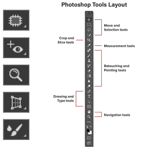

Learn all about Photoshop's tools and the toolbar. You'll learn how the toolbar is organized and how to access its many hidden tools. Includes a complete summary of the nearly 70 tools available in Photoshop that you can use as a reference! Now updated for Photoshop 2025!

In the first tutorial in this series, we took a [general tour of the Photoshop interface](/basics/getting-know-photoshop-interface/ "Learn more") and its main features. This time, we'll learn all about Photoshop's **tools** and the **toolbar**. The toolbar is where Photoshop holds the many tools we have to work with. There are tools for making selections, for cropping and retouching images, for adding shapes and type, and many more! 

We’ll start with a look at the toolbar itself, including how the toolbar is organized and how to access the many tools hidden within it. Then we’ll look at each and every tool in the toolbar with a quick summary of what each tool is used for.

### Which version of Photoshop is this for?

I'm using [Photoshop 2025](https://adobe.prf.hn/click/camref:1100lrdjJ/destination:https%3A%2F%2Fwww.adobe.com%2Fproducts%2Fphotoshop.html "Get Adobe Photoshop") but you can follow along with earlier versions as well. Just note that some tools may not be available in older versions.

Let's get started!

## The Photoshop toolbar

Photoshop's toolbar is located along the left of the screen:

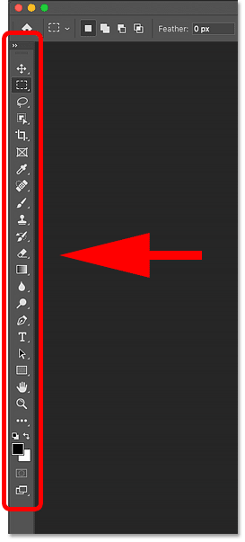
*The toolbar.*

### Choosing a single or double column toolbar

By default, the toolbar appears as a long, single column. But it can be expanded into a shorter, double column by clicking the **double arrows** at the top. Click the double arrows again to return to a single column toolbar:

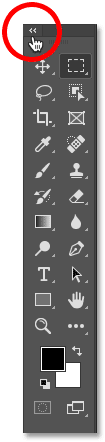
*The toolbar can be viewed in a single or double column.*

[Related: Use Photoshop's new AI Remove Tool to remove people and objects from photos!](/photo-editing/remove-objects-in-photoshop-with-the-new-ai-remove-tool/ "Learn more")

## The tools layout

Let's look at how Photoshop's toolbar is organized. While it may seem like the tools are listed randomly, there's actually a logical order to it, with related tools grouped together. 

At the top, we have Photoshop's **Move **and** Selection **tools. And directly below them are the **Crop **and** Slice **tools. Below that are the **Measurement **tools, followed by Photoshop's many **Retouching **and** Painting** tools. 

Next are the **Drawing **and** Type** tools. And finally, we have the **Navigation** tools at the bottom:

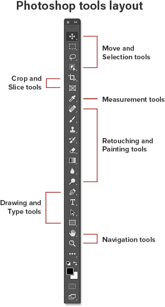
*The layout of the tools in the toolbar.*

### The toolbar's hidden tools

Each tool in the toolbar is represented by an icon, and there are many more tools available than what we see. 

A small **arrow** in the bottom right corner of a tool icon means that there are more tools hiding behind it in that same spot:

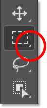
*Most of the spots in the toolbar hold more than one tool.*

To view the additional tools, **click and hold** on the icon. Or **right-click** (Win) / **Control-click** (Mac) on the icon. A fly-out menu will open listing the other tools that are available. 

For example, if I click and hold on the [Rectangular Marquee Tool](/basics/selections/rectangular-marquee-tool/ "Learn about the Rectangular Marquee Tool in Photoshop") icon, the fly-out menu tells me that along with that tool, the [Elliptical Marquee Tool](/basics/selections/elliptical-marquee-tool/ "Learn more about the Elliptical Marquee Tool in Photoshop"), the Single Row Marquee Tool and the Single Column Marquee Tool are also grouped in with it. 

To choose one of the additional tools, click on its name in the list. I'll choose the Elliptical Marquee Tool:

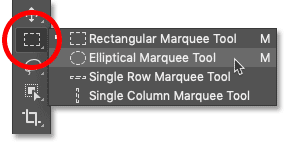
*Choosing a hidden tool from the fly-out menu.*

### The default tool

The tool that's initially displayed in each spot in the toolbar is known as the **default tool**. For example, the Rectangular Marquee Tool is the default tool for the second spot from the top. But Photoshop won't always display the default tool. Instead, it will display the last tool you selected. 

Notice that after choosing the Elliptical Marquee Tool from the fly-out menu, the Rectangular Marquee Tool is no longer displayed in the toolbar. The Elliptical Marquee Tool has taken its place:

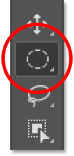
*Each spot in the toolbar displays either the default tool or the last tool selected.*

To select the Rectangular Marquee Tool at this point, I would need to either **click and hold**, or **right-click** (Win) / **Control-click** (Mac), on the Elliptical Marquee Tool icon. Then I could select the Rectangular Marquee Tool from the menu:

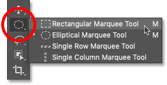
*Selecting the Rectangular Marquee Tool from behind the Elliptical Marquee Tool.*

## A summary of Photoshop's tools

So now that we've learned how Photoshop's toolbar is organized, let's look at the tools themselves. 

Below is a quick summary of each of Photoshop's tools, along with a brief description of what each tool is used for. The tools are listed in order from top to bottom, and specific tools are covered in more detail in other lessons.

An asterisk (*) after a tool's name indicates a default tool, and the letter in parenthesis is the tool's keyboard shortcut. To cycle through tools with the same keyboard shortcut, press and hold **Shift** as you press the letter.

This list is up-to-date as of [Photoshop 2025](https://adobe.prf.hn/click/camref:1100lrdjJ/destination:https%3A%2F%2Fwww.adobe.com%2Fproducts%2Fphotoshop.html "Get Adobe Photoshop"). Note that some tools are not available in earlier versions.

- **Move and Selection tools**
  -  
  - **Move Tool * ( V )** – The Move Tool is used to move layers, selections and guides within a Photoshop document. Enable "Auto-Select" to automatically select the layer or group you click on.
  -  
  - **Artboard Tool ( V )** – The Artboard Tool allows you to easily design multiple web or UX (user experience) layouts for different devices or screen sizes.
  -  
  - **Rectangular Marquee Tool * ( M )** – The [Rectangular Marquee Tool](/basics/selections/rectangular-marquee-tool/ "Learn more about the Rectangular Marquee Tool in Photoshop") draws rectangular selection outlines. Press and hold Shift as you drag to draw a square selection.
  -  
  - **Elliptical Marquee Tool ( M )** – The [Elliptical Marquee Tool](/basics/selections/elliptical-marquee-tool/ "Learn more about the Elliptical Marquee Tool in Photoshop") draws elliptical selection outlines. Press and hold Shift to draw a selection in a perfect circle.
  -  
  - **Single Row Marquee Tool** – The Single Row Marquee Tool in Photoshop selects a single row of pixels in the image from left to right.
  -  
  - **Single Column Marquee Tool** – Use the Single Column Marquee Tool to select a single column of pixels from top to bottom.
  -  
  - **Lasso Tool * ( L )** – With the [Lasso Tool](/basics/selections/lasso-tool/ "Learn more about the Lasso Tool in Photoshop"), you can draw a freeform selection outline around an object.
  -  
  - **Polygonal Lasso Tool ( L )** – Click around an object with the [Polygonal Lasso Tool](/basics/selections/polygonal-lasso-tool/ "Learn more about the Polygonal Lasso Tool in Photoshop") to surround it with a polygonal, straight-edged selection outline.
  -  
  - **Magnetic Lasso Tool ( L )** – The [Magnetic Lasso Tool](Learn more about the Magnetic Lasso Tool in Photoshop/basics/selections/magnetic-lasso-tool/ "Learn more about the Magnetic Lasso Tool") snaps the selection outline to the edges of the object as you move your mouse cursor around it.
  -  
  - **Object Selection Tool * ( W )** – The [Object Selection Tool](/basics/object-selection-tool/ "Learn about the Object Selection Tool in Photoshop") lets you select an object just by dragging a rough selection outline around it.
  -  
  - **Quick Selection Tool ( W )** – The [Quick Selection Tool](/basics/selections/quick-selection-tool/ "Learn about the Object Selection Tool in Photoshop") lets you easily select an object simply by painting over it with a brush. Enable "Auto-Enhance" in the Options Bar for better quality selections.
  - 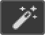 
  - **Magic Wand Tool ( W )** – Photoshop's [Magic Wand Tool](Learn more about the Magnetic Lasso Tool in Photoshop/basics/selections/magic-wand-tool/ "Learn more about the Magic Wand Tool in Photoshop") selects areas of similar color with a single click. The "Tolerance" value in the Options Bar sets the range of colors that will be selected.

- **Crop and Slice tools**
  -  
  - **Crop Tool * ( C )** – Use the [Crop Tool](/photo-editing/how-to-crop-images-photoshop-cc/ "Learn how to crop images in Photoshop") in Photoshop to crop an image and remove unwanted areas. Uncheck "Delete Cropped Pixels" in the Options Bar to [crop an image non-destructively](/photo-editing/crop-images-non-destructively-photoshop-cc/ "Learn how to crop an image non-destructively in Photoshop").
  - 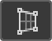 
  - **Perspective Crop Tool ( C )** – Use the [Perspective Crop Tool](/photo-editing/how-to-crop-images-photoshop-cc//photo-editing/perspective-crop-tool-cs6/ "Learn how to use the Perspective Crop Tool in Photoshop") to both crop an image and fix common distortion or perspective problems.
  -  
  - **Slice Tool ( C )** – The Slice Tool divides an image or layout into smaller sections (slices) which can be exported and optimized separately.
  -  
  - **Slice Select Tool ( C )** – Use the Slice Select Tool to select individual slices created with the Slice Tool.
  - 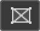 
  - **Frame Tool * ( K )** – New as of Photoshop CC 2019, the [Frame Tool](/basics/place-images-into-shapes-with-the-new-frame-tool-in-photoshop-cc-2019/ "Learn more about the Frame Tool in Photoshop") lets you place images into rectangular or elliptical shapes. 

- **Measurement tools**
  -  
  - **Eyedropper Tool * ( I )** – Photoshop's Eyedropper Tool samples colors in an image. Increase "Sample Size" in the Options Bar for a better representation of the sampled area's color.
  - 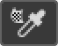 
  - **3D Material Eyedropper Tool ( I )** – Use the 3D Material Eyedropper Tool to sample material from a 3D model in Photoshop.
  - 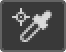 
  - **Color Sampler Tool ( I )** – The Color Sampler Tool displays color values for the selected (sampled) area in an image. Up to four areas can be sampled at a time. View the color information in Photoshop's Info panel.
  -  
  - **Ruler Tool ( I )** – The Ruler Tool measures distances, locations and angles. Great for positioning images and elements exactly where you want them.
  -  
  - **Note Tool ( I )** – The Note Tool allows you to attach text-based notes to your Photoshop document, either for yourself or for others working on the same project. Notes are saved as part of the .PSD file.
  -  
  - **Count Tool ( I )** – Use the Count Tool to manually count the number of objects in an image, or to have Photoshop automatically count multiple selected areas in the image.

- **Retouching and Painting tools**
  -  
  - **Spot Healing Brush Tool * ( J )** – The [Spot Healing Brush](/photo-editing/spot-healing-brush/ "Learn how to use the Spot Healing Brush in Photoshop") in Photoshop quickly removes blemishes and other minor problem areas in an image. Use a brush size slightly larger than the blemish for best results.
  -  
  - **Healing Brush Tool ( J )** – The [Healing Brush](/photo-editing/spot-healing-brush//photo-editing/healing-brush/ "Learn how to use the Healing Brush in Photoshop") lets you repair larger problem areas in an image by painting over them. Hold Alt (Win) / Option (Mac) and click to sample good texture, then paint over the problem area to repair it.
  - 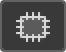 
  - **Patch Tool ( J )** – With the Patch Tool, draw a freeform selection outline around a problem area. Then repair it by dragging the selection outline over an area of good texture.
  -  
  - **Content-Aware Move Tool ( J )** – Use the Content-Aware Move Tool to select and move part of an image to a different area. Photoshop automatically fills in the hole in the original spot using elements from the surrounding areas.
  -  
  - **Red Eye Tool ( J )** – The Red Eye Tool removes common red eye problems in a photo resulting from camera flash.
  -  
  - **Brush Tool * ( B )** – The [Brush Tool](/basics/photoshop-brushes/brush-dynamics/brush-dynamics-intro/ "Learn more about the Brush Tool in Photoshop") is Photoshop's primary painting tool. Use it to paint brush strokes on a [layer](/photoshop-layers-learning-guide/ "Learn more about Photoshop layers") or on a [layer mask](/basics/understanding-photoshop-layer-masks/ "Learn more about Photoshop layer masks").
  -  
  - **Pencil Tool ( B )** – The Pencil Tool is another of Photoshop's painting tools. But while the Brush Tool can paint soft-edge brush strokes, the Pencil Tool always paints with hard edges.
  - 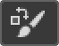 
  - **Color Replacement Tool ( B )** – Use the [Color Replacement Tool](/photo-editing/color-replacement-tool/ "Learn how to use the Color Replacement Tool in Photoshop") in Photoshop to easily replace the color of an object with a different color.
  -  
  - **Mixer Brush Tool ( B )** – Unlike the standard Brush Tool, the Mixer Brush in Photoshop can simulate elements of real painting such as mixing and combining colors, and paint wetness.
  -  
  - **Clone Stamp Tool * ( S )** – The Clone Stamp Tool is the most basic of Photoshop's retouching tools. It samples pixels from one area of the image and paints them over pixels in another area.
  -  
  - **Pattern Stamp Tool ( S )** – Use the Pattern Stamp Tool to paint a pattern over the image.
  -  
  - **History Brush Tool * ( Y )** – The History Brush Tool paints a snapshot from an earlier step (history state) into the current version of the image. Choose the previous state from the History panel.
  -  
  - **Art History Brush Tool ( Y )** – The Art History Brush also paints a snapshot from an earlier history state into the image, but does so using stylized brush strokes.
  -  
  - **Eraser Tool * ( E )** – The Eraser Tool in Photoshop permanently erases pixels on a layer. It can also be used to paint in a previous history state.
  - 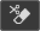 
  - **Background Eraser Tool ( E )** – The [Background Eraser Tool](/photo-editing/background-eraser/ "Learn how to use the Background Eraser Tool in Photoshop") erases areas of similar color in an image by painting over them.
  -  
  - **Magic Eraser Tool ( E )** – The Magic Eraser Tool is similar to the Magic Wand Tool in that it selects areas of similar color with a single click. But the Magic Eraser Tool then permanently deletes those areas.
  -  
  - **Gradient Tool * ( G )** – Photoshop's [Gradient Tool](/basics/how-to-draw-gradients-with-the-gradient-tool-in-photoshop/ "Learn how to use the Photoshop Gradient Tool") draws gradual blends between multiple colors. The [Gradient Editor](/basics/how-to-use-the-gradient-editor-in-photoshop/ "Learn how to edit gradients in Photoshop") lets you create and customize your own gradients.
  - 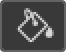 
  - **Paint Bucket Tool ( G )** – The Paint Bucket Tool fills an area of similar color with your Foreground color or a pattern. The "Tolerance" value determines the range of colors that will be affected around the area where you clicked.
  - 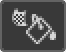 
  - **3D Material Drop Tool ( G )** – Used in 3D modeling, the 3D Material Drop Tool lets you sample a material from one area and then drop it into another area of your model, mesh or 3D layer.
  -  
  - **Blur Tool *** – The Blur Tool blurs and softens areas you paint over with the tool.
  -  
  - **Sharpen Tool** – The Sharpen Tool sharpens areas you paint over.
  -  
  - **Smudge Tool** – The Smudge Tool in Photoshop smudges and smears the areas you paint over. It can also be used to create a finger painting effect.
  -  
  - **Dodge Tool * ( O )** – Paint over areas in the image with the Dodge Tool to lighten them.
  -  
  - **Burn Tool ( O )** – The Burn Tool will darken the areas you paint over.
  - 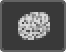 
  - **Sponge Tool ( O )** – Paint over areas with the Sponge Tool to increase or decrease color saturation.

- **Drawing and Type tools**
  -  
  - **Pen Tool * ( P )** – Photoshop's [Pen Tool](/photo-editing/spot-healing-brush//basics/selections/pen-tool-selections/ "Learn how to use the Pen Tool in Photoshop") allows you to draw extremely precise paths, vector shapes or selections.
  -  
  - **Freeform Pen Tool ( P )** – The Freeform Pen Tool allows you to draw freehand paths or shapes. Anchor points are automatically added to the path as you draw.
  -  
  - **Curvature Pen Tool ( P )** – The [Curvature Pen Tool](/photo-editing/spot-healing-brush//basics/selections/pen-tool-selections/basics/use-curvature-pen-tool-photoshop-cc-2018/ "Learn how to use the Curvature Pen Tool in Photoshop") is an easier, simplified version of the Pen Tool. New as of Photoshop CC 2018.
  -  
  - **Add Anchor Point Tool** – Use the Add Anchor Point Tool to add additional anchor points along a path.
  -  
  - **Delete Anchor Point Tool** – Click on an existing anchor point along a path with the Delete Anchor Point Tool to remove the point.
  -  
  - **Convert Point Tool** – On a path, click on a smooth anchor point with the Convert Point Tool to convert it to a corner point. Click a corner point to convert it to a smooth point.
  -  
  - **Horizontal Type Tool * ( T )** – Known simply as the Type Tool in Photoshop, use the Horizontal Type Tool to add standard type to your document.
  -  
  - **Vertical Type Tool ( T )** – The Vertical Type Tool adds type vertically from top to bottom.
  - 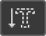 
  - **Vertical Type Mask Tool ( T )** – Rather than adding editable text to your document, the Vertical Type Mask Tool creates a selection outline in the shape of vertical type.
  - 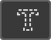 
  - **Horizontal Type Mask Tool ( T )** – Like the Vertical Mask Type Tool, the Horizontal Type Mask Tool creates a selection outline in the shape of type. However, the type is added horizontally rather than vertically.
  - 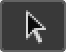 
  - **Path Selection Tool * ( A )** – Use the Path Selection Tool (the black arrow) in Photoshop to select and move an entire path at once.
  -  
  - **Direct Selection Tool ( A )** – Use the Direct Selection Tool (the white arrow) to select and move an individual path segment, anchor point or direction handle.
  -  
  - **Rectangle Tool * ( U )** – The [Rectangle Tool](/basics/using-the-shape-tools-in-photoshop-cc-2021/ "Learn more about the Rectangle Tool in Photoshop") draws rectangular vector shapes, paths or pixel shapes, with sharp or rounded corners. Press and hold Shift as you drag to force the shape into a perfect square.
  -  
  - **Ellipse Tool ( U )** – The [Ellipse Tool](/basics/using-the-shape-tools-in-photoshop-cc-2021/ "Learn more about the Ellipse Tool in Photoshop") draws elliptical vector shapes, paths or pixel shapes. Press and hold Shift as you drag to draw a perfect circle.
  - 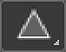 
  - **Triangle Tool ( U )** – The [Triangle Tool](/basics/using-the-shape-tools-in-photoshop-cc-2021/ "Learn more about the Ellipse Tool in Photoshop") draws triangle shapes. Hold Shift to draw an equilateral triangle, or use the Radius option to round the corners.
  -  
  - **Polygon Tool ( U )** – The [Polygon Tool](/basics/using-the-shape-tools-in-photoshop-cc-2021/ "Learn more about the Ellipse Tool in Photoshop") draws polygonal shapes with any number of sides. Use the Star Ratio option to turn polygons into stars.
  -  
  - **Line Tool ( U )** – The [Line Tool](/basics/using-the-shape-tools-in-photoshop-cc-2021/ "Learn more about the Line Tool in Photoshop") draws straight lines or arrows. Use the Stroke color and weight to control the appearance of the line.
  -  
  - **Custom Shape Tool ( U )** – Photoshop's [Custom Shape Tool](/basics/drawing-custom-shapes-with-the-shapes-panel-in-photoshop-cc-2020/ "Learn how to use the Custom Shape Tool in Photoshop") lets you select and draw custom shapes. Choose from Photoshop's hundreds of built-in custom shapes or [create your own](/basics/custom-shapes/ "Learn how to create custom shapes in Photoshop").

- **Navigation tools**
  -  
  - **Hand Tool * ( H )** – The [Hand Tool](/basics/image-navigation-essentials-zooming-panning-photoshop/ "Learn more about the Hand Tool in Photoshop") lets us click and drag an image around on the screen to view different areas when zoomed in.
  -  
  - **Rotate View Tool ( R )** – Use the Rotate View Tool in Photoshop to rotate the canvas so you can view and edit the image from different angles.
  -  
  - **Zoom Tool * ( Z )** – Click on the image with the [Zoom Tool](/basics/image-navigation-essentials-zooming-panning-photoshop/ "Learn more about the Zoom Tool in Photoshop") to zoom in on a specific area. Press and hold Alt (Win) / Option (Mac) and click with the Zoom Tool to zoom out.

And there we have it! Now that we know more about Photoshop's toolbar and its many tools, the next lesson shows you how to [reset Photoshop's toolbar](/basics/reset-toolbar-photoshop-cc/ "Learn how to reset the toolbar in Photoshop") back to its original, default layout! You can jump to any of the other lessons in this [Learning the Photoshop Interface](/basics/learning-the-photoshop-interface/ "View chapter") chapter. Or visit our [Photoshop Basics](/basics/ "Learn more") section for more topics!