# Photoshop Type Essentials

> Source: [https://www.photoshopessentials.com/basics/type/photoshop-type-essentials/](https://www.photoshopessentials.com/basics/type/photoshop-type-essentials/)
> Downloaded and converted to Markdown.

They say a picture is worth a thousand words, yet sometimes, the picture alone may not be enough. Often, we need to add a word, phrase or caption to an image to help convey a certain message. Or we may be designing a print or web layout and need text for headings, banners or buttons. And of course, sometimes we just want to create cool looking text effects.

As a photo editor and graphic design tool, Photoshop is probably not the software you want to be using if your goal is to write the next great novel, or if you want to update your resumé (in case the writing thing doesn't work out). Yet it *does* have many of the same type features found in other programs like Illustrator and InDesign, making it more than capable of adding simple and stylish text to our images and designs. In this tutorial, we'll cover the basics and essentials of working with text in Photoshop!

There's two main kinds of type that we can add in Photoshop - **point type** and **area type**. By far the most commonly used of the two is point type which is what we'll be looking at in this tutorial. In the [next tutorial](/basics/type/area-type/), we'll learn the difference between the two and how to add [area type](/basics/type/area-type/) to our documents.

### The Type Tool

Whenever we want to add any sort of text to a document, we use Photoshop's **Type Tool** which is found in the Tools panel along the left side of the screen. It's the icon that looks like a capital letter T. You can also select the Type Tool by pressing the letter **T** on your keyboard:

*Selecting the Type Tool from the Tools panel.*

With the Type Tool selected, your mouse cursor will change into what's commonly referred to as an "I-beam". I've enlarged it a bit here to make it easier to see:

*The Type Tool's"I-beam" mouse cursor.*

### Choosing A Font

As soon as we select the Type Tool, the **Options Bar** along the top of the screen updates to show us options related to the Type Tool, including options for choosing a font, a font style and the font size:

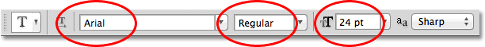
*From left to right - the font, font style and font size options.*

To view the complete list of fonts that are available to you, click on the small down-pointing triangle to the right of the font selection box:

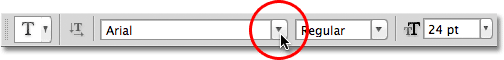
*Clicking the triangle to the right of the font selection box.*

This opens a list of all the fonts you can choose from. The exact fonts you'll see in your list will depend on which fonts are currently installed on your system:

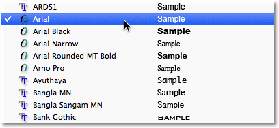
*Photoshop lists all the fonts that are installed on your computer.*

### Changing The Size Of The Font Preview

If you're using **Photoshop CS2 or higher**, Photoshop lists not only the name of each font but also a handy **preview** of what the font looks like (using the word "Sample" to the right of the font's name):

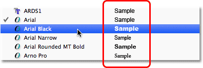
*Photoshop (CS2 and higher) includes a preview of the font beside the name.*

We can change the size of the font preview by going to Photoshop's Preferences settings. On a PC, go up to the **Edit** menu in the Menu Bar along the top of the screen, choose **Preferences**, and then choose **Type**. On a Mac, go to the **Photoshop** menu, choose **Preferences**, then choose **Type**. This opens Photoshop's Preferences dialog box set to the Type options.

The last option in the list is **Font Preview Size**. By default, it's set to Medium. You can click on the word "Medium" and choose a different size from the list. I'll choose the Extra Large size:

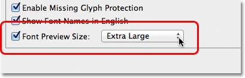
*The Font Preview Size option sets the size for the font preview in the Options Bar.*

Click OK to close out of the Preferences dialog box, and now if we go back up to the Options Bar and bring up the list of fonts again, we see that the font previews now appears much larger. The larger size makes the previews easier to see but they're also taking up more space. Personally I prefer to stick with the default Medium size but it's completely up to you. You can go back to the Preferences and change the preview size at any time:

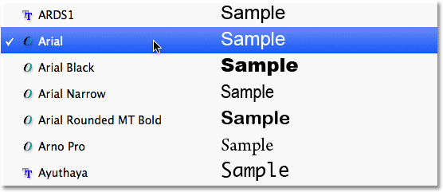
*The larger font previews are easier to see but take up more space than smaller previews.*

### Choosing A Font Style

Once you've chosen a font, choose the font style by clicking on the triangle to the right of the **Style** selection box:

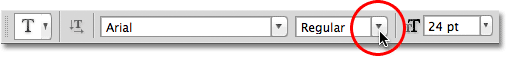
*Clicking the triangle to the right of the font style selection box.*

Select the style you need (Regular, Bold, Italic, etc.) from the list that appears. The style choices you're given will depend on the font you've chosen since some fonts have more styles available than others:

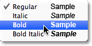
*Choose a style for the font from the list.*

### Setting The Font Size

Choose a size for your font by clicking on the triangle to the right of the **Size** selection box:

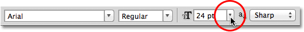
*Clicking the triangle to the right of the font size selection box.*

This will open a list of commonly-used preset sizes that you can choose from, ranging from 6 pt up to 72 pt:

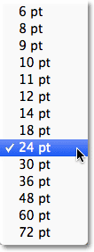
*Photoshop makes it easy to choose from several preset font sizes.*

If none of these sizes suit your needs, you can manually enter any value you want into the Size box. Simply click and drag over the existing size to highlight it, type in the new size, then press **Enter** (Win) / **Return** (Mac) on your keyboard to accept it. I've manually changed the size to 120 pt here just as an example (don't worry about adding the "pt" at the end of the number because Photoshop will automatically add it when you press Enter / Return):

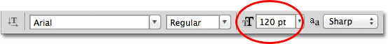
*Type a size directly into the Size box if none of the preset sizes will do.*

### Choosing The Text Color

The Options Bar is also where we choose a color for our text. A **color swatch** appears near the far right of the options. By default, the color is set to black. To change the color, click on the swatch:

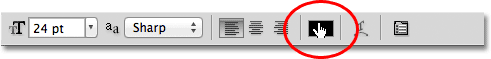
*Click on the color swatch to change the color of the text.*

Photoshop will pop open the **Color Picker** where we can choose a different color for the text. For now, I'm going to leave mine set to black so I'll simply click the Cancel button to cancel out of the Color Picker. If you do select a new text color, click OK when you're done to close out of the Color Picker:

*Use the Color Picker to choose a new color for the text.*

### Adding Type To The Document

As I mentioned briefly at the beginning of the tutorial, there's two different types of, well, type, that we can add to a document in Photoshop. We can add **point** type (also known as **character** type), and we can add **area** type (also known as **paragraph** type). The difference between them is that point type is mainly used for adding small amounts of text to a document (a single letter or word, a heading, etc.) while area type is used for adding larger amounts of text inside a pre-selected area. The one we're looking at here is point type because it's the most straightforward of the two and the one you'll use most often.

To add point type, simply click with the Type Tool in the spot where you want your text to begin. A blinking insertion marker will appear letting you know that Photoshop is ready for you to start typing, but as soon as you click, before you even begin typing, Photoshop will add a special kind of layer known as a **Type layer** to your document, which we can see in the Layers panel. It's easy to spot Type layers because they have a capital letter T in their thumbnail. Any time we add text to a document, it's placed on a Type layer. Photoshop will initially give the new Type layer a generic name like "Layer 1", but the name will actually change once we've added our text, as we'll see in a moment:

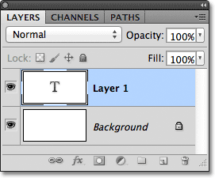
*Text is placed on special Type layers in the Layers panel.*

Once you've clicked in the document with the Type Tool and you have your blinking insertion marker, you can begin typing. Here I've added a short sentence to my document:

*Simply click in the document with the Type Tool, then add your type.*

### Moving Text As You're Typing

If you realize as you're typing that your text needs to be repositioned, you can easily move it into place without needing to cancel out of it and start over again. Just move your mouse cursor away from the text until you see the cursor change from the Type Tool's I-beam into the **Move Tool**'s icon. Click and drag the text into its new location, then continue typing:

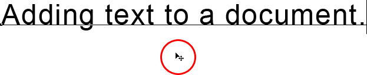
*Move your mouse cursor away from the text as you're typing to temporarily access the Move Tool, then click and drag the text into position.*

### Accepting The Text

To accept the text when you're done, click on the **checkmark** in the Options Bar:

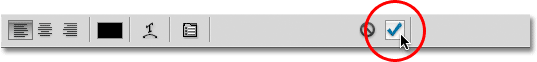
*Click the checkmark in the Options Bar to accept the text.*

If you have a keyboard with a numeric keypad, you can also accept the text by pressing the **Enter** key on the numeric keypad (usually in the bottom right corner of the keypad). Or, if you don't have a numeric keypad on your keyboard, you can press **Ctrl+Enter** (Win) / **Command+Return** (Mac) to accept the text.

Once you've accepted your text, Photoshop renames the Type layer using the first part of your text as the new name for the layer, which can be very helpful if we start adding multiple Type layers to our document:

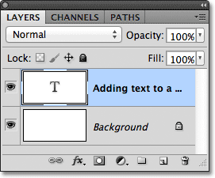
*Photoshop renames the Type layer using the first part of your text.*

### Adding A Line Break

You may be thinking that you should just be able to press the normal **Enter** (Win) / **Return** (Mac) key on your keyboard to accept the text, but that actually won't work because instead of accepting the text, it adds a **line break** to the text, allowing you to continue typing on a new line below the initial one:

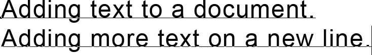
*Press Enter (Win) / Return (Mac) to add a line break and continue typing.*

Again, when you're done typing, accept the text either by clicking the **checkmark** in the Options Bar, by pressing the **Enter** key on a **numeric keypad**, or by pressing **Ctrl+Enter** (Win) / **Command+Return** (Mac).

### Cancel Or Delete Text

If you haven't yet accepted your text and simply want to cancel out of it, press the **Esc** key on your keyboard. This will clear the text you were typing and will delete the Type layer that Photoshop added for the text. If you need to delete text that you've already accepted, click on its Type layer in the Layers panel and drag it down on to the **Trash Bin**:

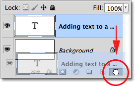
*Type layers can be deleted by dragging them down on to the Trash Bin.*

### The Text Alignment Options

Also found in the Options Bar are three common text alignment options - **Left Align Text**, **Center Text** and **Right Align Text**. By default, the Left Align Text option is selected, which means that as we type, the text is added to the right of the insertion point. Choosing Right Align Text will add the text to the left of the insertion point, while Center Text will extend the text out in both directions equally from the insertion point. It's best to make sure you have the correct alignment option chosen before you begin typing, but you can go back and change the alignment of text that you've already added by first selecting its Type layer in the Layers panel, then, with the Type Tool selected, simply choose a different alignment option in the Options Bar:

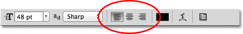
*From left to right - the Left Align Text, Center Text and Right Align Text options.*

Up next, we'll learn how to select and edit text after it's been added to the document!

### Selecting And Editing Text

We can easily go back and edit our text at any time, just like we could in a word processing program. Here's some text I've added with a couple of obvious spelling mistakes:

*Some text that needs editing.*

The first word, "speling", should have two letter l's in it. To fix the problem, I'll first make sure I have my Type Tool selected, then I'll move my mouse cursor over the word and I'll click to place my insertion marker between the letters "e" and "l":

*An insertion marker appears between the letters "e" and "l".*

With the insertion marker in place, all I need to do is press the letter "l" on my keyboard to add it to the word:

*The first spelling mistake is corrected.*

If you click in the wrong spot and place your insertion marker between the wrong letters, use the **left and right arrow keys** on your keyboard to easily move the insertion marker left or right along the text as needed.

The second word in my text, "mystakes", should be spelled with an "i" instead of a "y", so this time, I'll click with my Type Tool between the letters "m" and "y" and with my mouse button still held down, I'll drag across the letter "y" to highlight it:

*Click and drag over individual letters to highlight them.*

With the letter highlighted, I'll press "i" on my keyboard to make the change:

*The second spelling mistake is now corrected.*

We've seen how to select a single letter by clicking and dragging over it. To select an entire word, there's no need to click and drag. Simply **double-click** with the Type Tool on the word to instantly highlight it, at which point you can delete it by pressing **Backspace** (Win) / **Delete** (Mac) on your keyboard or you can type a different word to replace it:

*Double-click to select an entire word.*

To select an **entire line of text**, **triple-click** with the Type Tool anywhere on the text:

*Triple-click to select an entire line of text.*

If you have multiple lines of text separated by line breaks, and all of the text is on the same Type layer, you can quickly select it all by **double-clicking** on the Type layer's **thumbnail** in the Layers panel:

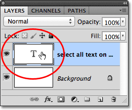
*Double-click on the thumbnail for the Type layer to select all text on the layer at once.*

This will instantly select all of the text on the layer:

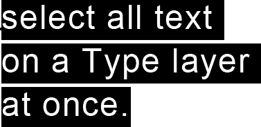
*All the text on the Type layer is selected at once.*

### Changing The Font, Style And Size

We can also go back at any time and change the font, font style or font size, and we don't need to select any text in the document to do it. Here I have some text that was added with my font set to Arial, the style set to Regular, and the font size set to 48 pt:

*Text that has already been added with the font, style and size that was initially chosen.*

Make sure you have the Type Tool selected, then select the **Type layer** in the Layers panel:

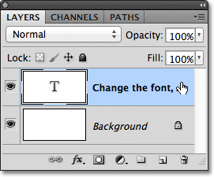
*To change the font, style or size, just select the Type layer itself.*

With the Type layer selected, go back up to the Options Bar and make any changes you need. I'll change my font to Futura, the style to Medium and the size to 36 pt:

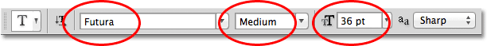
*Change the font, style and / or size in the Options Bar.*

Photoshop will instantly update your text in the document with the changes:

*You can change the font, style and size at any time.*

### Changing The Text Color

We can change the color of our text just as easily. Again, make sure the Type Tool is selected and that the Type layer for the text is selected in the Layers panel. Then, click on the **color swatch** in the Options Bar:

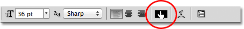
*With the Type Tool selected and the Type layer selected, click on the color swatch in the Options Bar.*

Photoshop will re-open the Color Picker for us so we can choose a new text color. I'll choose red:

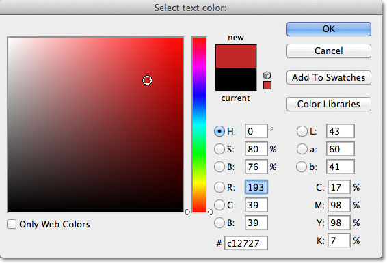
*Choose a new color for the text from the Color Picker.*

Click OK when you're done to close out of the Color Picker, and the text is instantly updated with the new color:

*The color of the text has been changed from black to red.*

If you want to change the color of just a single letter or word, highlight the letter or word with the Type Tool:

*Highlighting a word before selecting a new color.*

Then, just as we saw a moment ago, click on the **color swatch** in the Options Bar to bring up the **Color Picker** and choose the color you want. Click OK to close out of the Color Picker once you've chosen a color and Photoshop changes the color of just the text you highlighted:

*Only the highlighted word appears with the new color.*