# How to use Workspaces in Photoshop CC

> Source: [https://www.photoshopessentials.com/basics/photoshop-workspaces/](https://www.photoshopessentials.com/basics/photoshop-workspaces/)
> Downloaded and converted to Markdown.

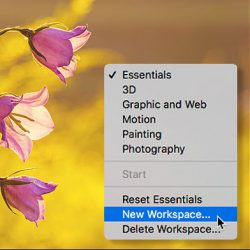

Learn all about Photoshop workspaces. You'll learn what workspaces are and how to use them to streamline and customize Photoshop's interface. Covers the default Essentials workspace, Photoshop's other built-in workspaces, how to save your own custom workspaces, and more!

In this tutorial, we'll learn all about **workspaces** in Photoshop. A *workspace* is a preset layout for the various elements that make up Photoshop's interface. Workspaces determine which of Photoshop's **panels** are displayed on your screen and how those panels are arranged. A workspace can also change which **tools** are available in the Toolbar and how the Toolbar is organized. Workspaces may include custom **menu items** in the Menu Bar, and even custom **keyboard shortcuts**. Any or all of these elements can be included and saved as part of a workspace.

Workspaces give us a way to customize Photoshop's interface for specific tasks, and to better match the way we work. Photoshop includes far too many panels to fit them all on your screen at once, so it's important that we limit the panels to just the ones we actually need. A photographer, for example, will use certain panels for image editing and retouching. A digital painter, on the other hand, will need different panels, ones for choosing brushes and colors. Other tasks, like web and graphic design, video editing, or working with type and typography, all use specific panels. A workspace streamlines the interface for the task at hand, keeping your screen free of clutter and helping you work more efficiently.

## What you'll learn

In a previous tutorial in this Photoshop Interface series, we learned all about [managing panels in Photoshop](/basics/managing-panels-photoshop-cc/). We also learned how to [customize the Toolbar](/basics/custom-toolbar-photoshop/), a new feature in Photoshop CC. While the Toolbar can now be saved as part of a workspace, as can menu items and keyboard shortcuts, workspaces are most commonly used for switching between different panel layouts. So for this tutorial, we'll focus on the panels. We'll look at Photoshop's default workspace, as well as other workspaces that are built into Photoshop. We'll learn how to switch between workspaces, and even how to save, update and delete our own custom workspaces. Finally, we'll learn how to restore the default workspace when we need it.

This tutorial has been fully updated for [Photoshop CC](https://prf.hn/l/dlXjD2w). If you're using Photoshop CS6, you'll want to check out the previous [Saving And Switching Workspaces In Photoshop CS6](/basics/photoshop-cs6-workspaces/) tutorial. This is lesson 9 of 10 in our [Learning the Photoshop Interface](/basics/learning-the-photoshop-interface/) series. Let's get started!

## Photoshop's default workspace

By default, Photoshop uses a workspace known as **Essentials**. If you've never chosen a different workspace, you're using the Essentials workspace. It's also the workspace we use in our tutorials. Essentials is a general-purpose workspace, suitable for many different tasks. It includes some of Photoshop's more commonly-used panels, like **[Layers](/basics/layers/layers-panel/)**, **Adjustments** and **Properties**, along with the **[Color](/basics/photoshop-cc-2014-color-panel/)** and **[Swatches](/basics/custom-swatches/)** panels ([flowers photo](https://prf.hn/l/q5RQjLo) from Adobe Stock):

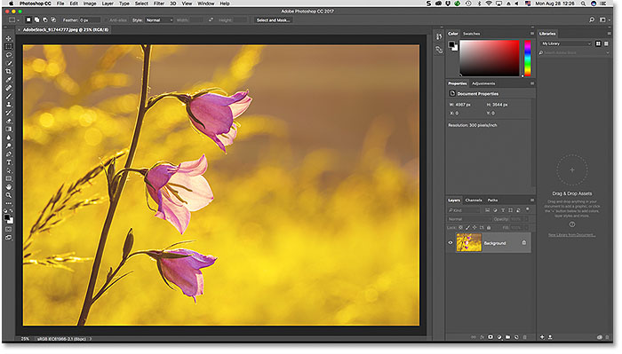
*The default "Essentials" workspace in Photoshop. Photo credit: Adobe Stock.*

### The default panels

Let's take a closer look at the default panels. As we learned in the [Managing Panels](/basics/managing-panels-photoshop-cc/) tutorial, Photoshop's panels are located in columns along the right of the screen. The **Libraries** panel, new in Photoshop CC, gets its own column on the far right. Panels we use the most (**Layers**, **Properties**, **Color**, etc.) are found in the main column in the middle. And on the left is a narrow column that holds the **History** and **Device Preview** panels. By default, panels in the left column are collapsed into icons (what Adobe calls *iconic view*). You can expand a panel that's in iconic view by clicking its icon. Click the icon again to collapse the panel:

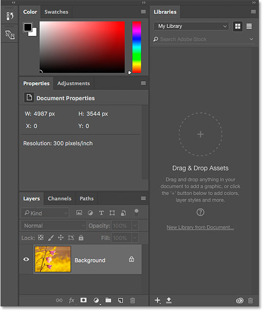
*The panels included in Photoshop's default Essentials workspace.*

## Photoshop's other workspaces

It may be the default, but Essentials is not the only workspace included with Photoshop. There are other workspaces to choose from as well. One place to find these other workspaces is in the Menu Bar along the top of the screen. Go up to the **Window** menu in the Menu Bar and choose **Workspace**. All of Photoshop's built-in workspaces (**Essentials**, **3D**, **Graphic and Web**, **Motion**, **Painting**, and **Photography**) are listed at the top of the menu. If you've saved any custom workspaces (we'll learn how to do that later), they would appear as well. The checkmark next to Essentials means that it's currently active. To choose a different workspace, simply click on its name to select it:

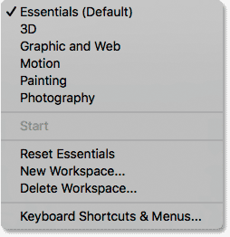
*Photoshop's workspaces can be found by going to Window > Workspace.*

Another way to access Photoshop's workspaces is by clicking the **Workspace icon** in the upper right of the interface (just above the panel columns):

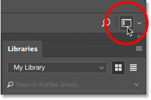
*Clicking the Workspace icon.*

Here, you'll find the same list of workspaces. The checkmark indicates the currently-active workspace. You can choose a different workspace by selecting it from the list:

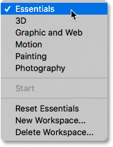
*The same list of workspaces appears.*

### Choosing a different workspace - Photography

With the menu open, let's try a different workspace. I'll choose the **Photography** workspace. As its name implies, the Photography workspace is a good choice for image editing and retouching:

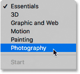
*Switching to the Photography workspace.*

Switching workspaces changes the panels that are displayed on your screen. Let's look at the differences between Photoshop's default Essentials workspace and the Photography workspace. Notice, for example, that the **Libraries** panel, which was in its own column on the right in the Essentials workspace, is now grouped in with the **Adjustments** panel in the middle column. This frees up more room for viewing the image in the document window.

In the Essentials workspace, the **Color** and **Swatches** panels were grouped together at the top of the middle column. Yet in the Photography workspace, they've been replaced with the **Histogram** and **Navigator** panels, two panels that are more useful for editing and retouching work. Also, the narrow column on the left held only two panels in the Essentials workspace (**History** and **Device Preview**). While the Photography workspace keeps the History panel, the Device Preview panel is gone. In its place are three new panels (**Actions**, **Info**, and **Clone Source**) along with the **Properties** panel, formerly in the middle column. In fact, the only thing that hasn't really changed between workspaces is that the **Layers**, **Channels** and **Paths** panels are still grouped together at the bottom of the main column:

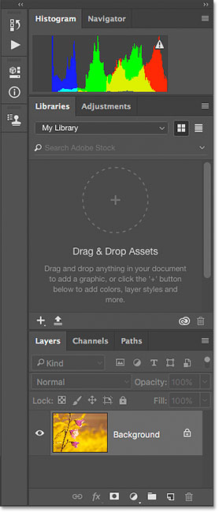
*The panel layout for the Photography workspace.*

### The Painting workspace

I won't go through every workspace here since you can easily do that on your own. But let's try one more. To choose a different workspace, I'll click once again on the **Workspace icon** in the upper right of the interface. Then, I'll select the **Painting** workspace from the list:

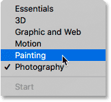
*Choosing the Painting workspace.*

Like the Photography workspace which is well suited for image editing, the Painting workspace is also streamlined for a specific task. In this case, it's digital painting. The **Histogram** panel, previously at the top of the main column in the Photography workspace, has been replaced with the **Swatches** panel. Below it, the **Libraries** and **Adjustments** panels have been swapped out for the **Brush Presets** panel. The narrow column on the left still holds the **History** panel and the **Clone Source** panel. But the **Actions**, **Properties** and **Info** panels from the Photography workspace have been replaced with the **Brush** and **Tool Presets** panels. The **Libraries** panel, formerly in the middle column, hasn't disappeared completely. Instead, it's been moved from the middle column into the left column where it now takes up less space:

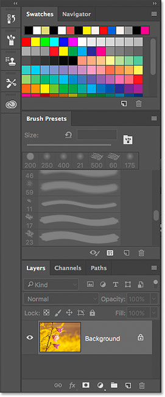
*The panel layout for the Painting workspace.*

## Restoring the default workspace

To switch back to Photoshop's default workspace, go up to the **Window** menu, choose **Workspace**, and then choose **Essentials**. Or, click on the **Workspace icon** above the panels and choose **Essentials** from the list:

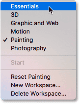
*Switching back to the default workspace.*

And now we're back to the default panel layout:

*The original panel layout has been restored.*

## Customizing the panel layout

Let's make a few quick changes to Photoshop's default panel layout. When we're done, we'll learn how to save the new layout as a custom workspace. I covered moving and arranging panels in the [Managing Panels](/basics/managing-panels-photoshop-cc/) tutorial, so I'll go through this quickly.

#### Moving a panel

First, let's move one of the existing panels. I'll group my Libraries panel in with the Layers, Channels and Paths panels. To do that, I'll click on the Libraries** tab** at the top of the column on the right. Then, with my mouse button still held down, I'll drag the Libraries tab into the Layers, Channels and Paths panel group at the bottom of the middle column. When the **blue highlight box** appears around the group, I'll release my mouse button to drop the Libraries panel into place:

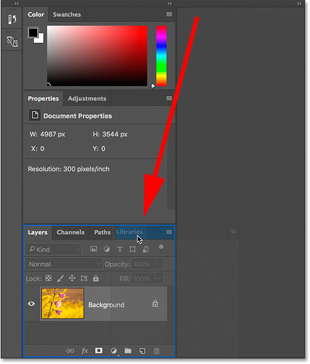
*Dragging the Libraries panel into the Layers, Channels and Paths group.*

#### Opening a new panel

Next, let's add a panel that isn't already open on the screen. I'll open the Styles panel by going up to the **Window** menu in the Menu Bar and choosing **Styles**:

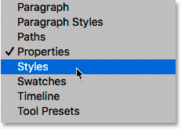
*Opening the Styles panel from the Window menu.*

By default, Photoshop groups the Styles panel in with the Properties and Adjustments panels in the middle column:

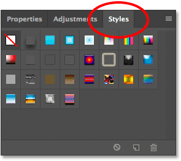
*The Styles panel opens in the same group as Properties and Adjustments.*

I'd rather have the Styles panel grouped in with the Color and Swatches panels. So, I'll move the Styles panel by clicking on its tab and dragging it up into the Color and Swatches group above it. When the blue highlight box appears around the group, I'll release my mouse button to drop the Styles panel into its new home:

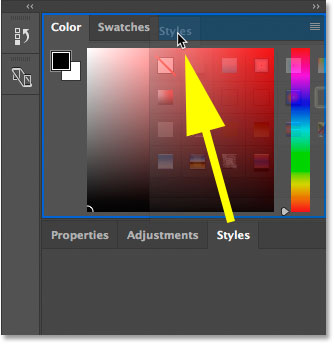
*Dragging the Styles panel into the Color and Swatches group.*

#### Closing a panel

Finally, let's close one of the panels. The **Device Preview** panel in the left column is collapsed into its icon. But even though it's not taking up much room, I don't really need it on the screen. To close the panel, I'll **right-click** (Win) / **Control-click** (Mac) directly on the panel's icon. Then, I'll choose **Close** from the menu:

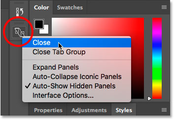
*Closing the Device Preview panel in the left column.*

After making my changes, I’m left with a custom panel layout. Before we continue, keep in mind that we’ve made these changes to Photoshop’s default Essentials workspace. The reason it’s important to remember that will become clear in a few moments:

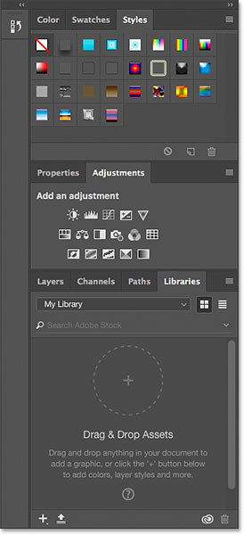
*The new layout.*

## Saving a new workspace

To save your custom layout as a new workspace, go up to the **Window** menu, choose **Workspace**, and then choose **New Workspace**. Or, click on the **Workspace icon** and choose **New Workspace**:

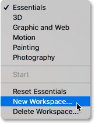
*Clicking the Workspace icon and choosing "New Workspace".*

In the New Workspace dialog box, give your custom workspace a name. I'll name mine "Steve's workspace". Unless your name also happens to be Steve, you may want to choose something different. At the bottom of the dialog box are options for including custom keyboard shortcuts and menus, as well as a custom Toolbar layout. We didn't create any of those, so leave them unchecked. Finally, to save your new workspace, click **Save**:

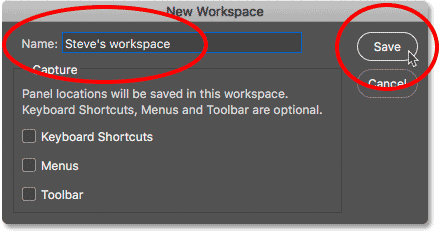
*Naming and saving the new workspace.*

With the workspace saved, I'll click on the Workspace icon once again to bring up my list of workspaces. And here, we see my new workspace at the top of the list, ready to be selected any time I need it:

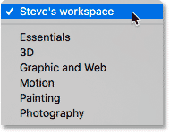
*The new workspace has been added to the list.*

## Updating a custom workspace

If you make further changes to your panel layout, you can save the changes by updating the workspace. You won't find an actual "Update Workspace" option anywhere. Instead, the steps for updating a workspace are the same as saving the workspace. We just save it using the same name as before. Go up to the **Window** menu, choose **Workspace**, and then choose **New Workspace**. Or, click on the **Workspace icon** and choose **New Workspace**. In the New Workspace dialog box, enter the *exact same name* as the existing workspace. In my case, it would be "Steve's workspace". Then, click **Save**. Photoshop will re-save the workspace with your changes.

## Resetting the default workspace

Earlier, we learned that to switch back to Photoshop's default workspace, we simply choose **Essentials** from the list:

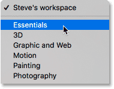
*Choose "Essentials" to return to the default workspace.*

But notice that even after selecting the Essentials workspace, my panel layout hasn't changed. Instead of seeing the default layout, I'm still seeing my custom layout:

*The custom layout remains even after choosing the Essentials workspace.*

Why are we still seeing the custom layout? Well, if you remember back to when we created our custom layout, I said to keep in mind that we created it by making changes to the Essentials workspace. The problem here is that panel layouts are "sticky". This means that Photoshop remembers our changes to the layout. And, it keeps those changes active until we specifically tell it to revert back to the default layout. So, since we've made changes to the Essentials workspace, it's not enough to simply select it again. To revert back to our default panel layout, we need to reset the workspace.

To reset the Essentials workspace, first make sure you've selected it as the active workspace (which we already did). Then, go up to the **Window** menu and choose **Workspace**, or click on the **Workspace icon** above the panels, and choose **Reset Essentials** from the menu:

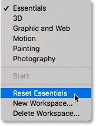
*Resetting the Essentials workspace.*

And now, after resetting the Essentials workspace, we're back to Photoshop's original, default panel layout:

*Resetting the Essentials workspace cleared the custom layout.*

## Deleting a custom workspace

Finally, let's learn how to delete a custom workspace. I'll delete "Steve's workspace". But before we do, it's important to know that Photoshop won't let you delete the currently-active workspace. So first, you'll need to choose any other workspace from the list to make it active. In this case, we've already switched back to the Essentials workspace, so we're good. To delete your custom workspace, go back to the Workspace menu, either by going to **Window** > **Workspace** or by clicking the **Workspace icon**, and choose **Delete Workspace**:

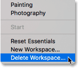
*Choosing the "Delete Workspace" command.*

In the Delete Workspace dialog box, choose the workspace you want to delete. I'll choose "Steve's workspace". Then, click **Delete**:

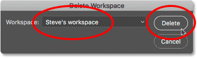
*Selecting and deleting my custom workspace.*

Photoshop will ask if you're sure you want to delete the workspace. Click **Yes**:

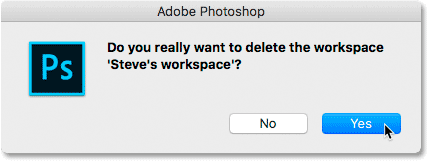
*Confirm that you want to delete the workspace.*

Now that I've deleted my custom workspace, if we look again at my Workspace menu, we see that "Steve's workspace" is no longer in the list:

*The custom workspace has been deleted.*