# How to Zoom in Photoshop Like a Pro

> Source: [https://www.photoshopessentials.com/basics/photoshop-zoom/](https://www.photoshopessentials.com/basics/photoshop-zoom/)
> Downloaded and converted to Markdown.

This tutorial shows you how to zoom, scroll and navigate images in Photoshop like a pro. You'll learn how to use the Zoom Tool, the Hand Tool, the View commands and more, along with some great tips and tricks to speed up your workflow!

If you’re new to Photoshop, one of the first things you need to know is how to navigate an image, meaning how to zoom in and zoom out, and how to pan or scroll an image from one area to another. So in this tutorial, I show you the best ways to work. I cover the basics of zooming and panning images, including the tools and commands you need to know. But I also show you lots of great tips and tricks to speed things up!

This is lesson 1 of 7 in [Chapter 4 - Navigating Images in Photoshop](/basics/photoshop-image-navigation/).

Let's get started!

## Which version of Photoshop do I need?

I'm using Photoshop 2022 but any recent version will work. You can [get the latest Photoshop version here](https://adobe.prf.hn/click/camref:1100lrdjJ/destination:https%3A%2F%2Fwww.adobe.com%2Fproducts%2Fphotoshop.html).

## How to zoom in and zoom out in Photoshop

You can follow along with your own image. I’ll use [this image from Adobe Stock](https://adobe.prf.hn/click/camref:1100lrdjJ/destination:https%3A%2F%2Fstock.adobe.com%2Fimages%2Fheadshot-of-attractive-female-coworker-in-blue-blouse-with-short-blonde-curly-hair-smiling-with-confident-and-friendly-expression-being-ready-to-help-customer-posing-over-gray-background%2F198969912).

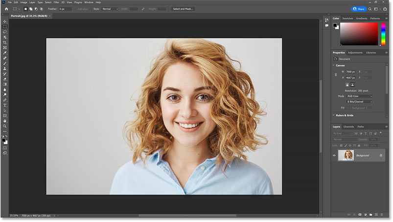
*Opening the image in Photoshop.*

### Where to find the current zoom level

When you first open your image, Photoshop zooms the image out so it fits entirely on the screen. And we can see the current zoom level in the [document tab](/basics/tabbed-and-floating-documents-in-photoshop/) at the top. In my case, it’s 33.3%. Your value may be different.

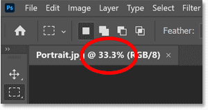
*Viewing the current zoom level in the tab.*

### Changing the zoom level

The zoom level is also displayed in the lower left of the document. But the difference is that we can change the zoom level from here.

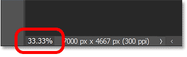
*Viewing the zoom level in the bottom left corner.*

Double-click on the current value to highlight it.

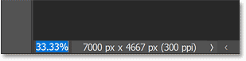
*Highlighting the current zoom level.*

Then enter a new value, like 50 for 50%.

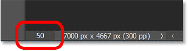
*Entering a new zoom level.*

Press **Enter** on a Windows PC or **Return** on a Mac. And the image instantly jumps to the new zoom level.

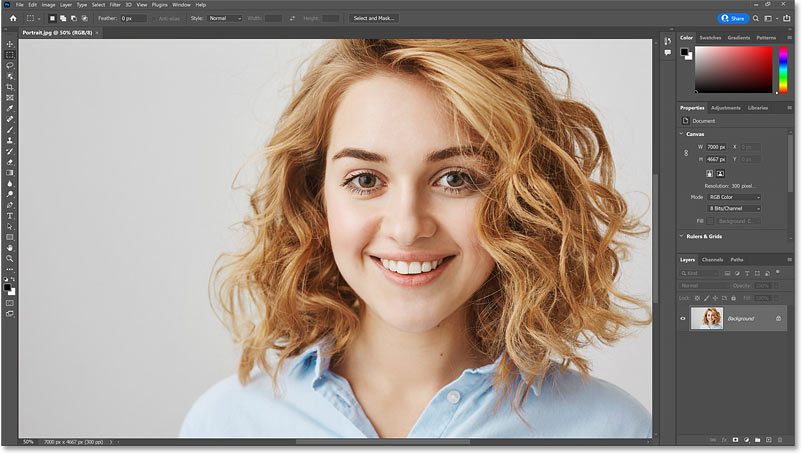
*The image is now zoomed to 50%.*

### Zooming with the Scrubby Slider

And here’s the first tip. If you hover your cursor over the zoom level in the lower left, and hold down the **Ctrl** key on your keyboard, or the **Command** key on a Mac, your cursor will change to a **scrubby slider**.

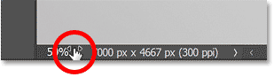
*Hover over the zoom level and hold Ctrl (Win) / Command (Mac).*

You can then drag to the right to zoom in, or drag to the left to zoom out. And if you add the **Shift** key (so that’s **Shift+Ctrl** in Windows or **Shift+Command** on a Mac) you’ll zoom in or out in larger 10% increments.

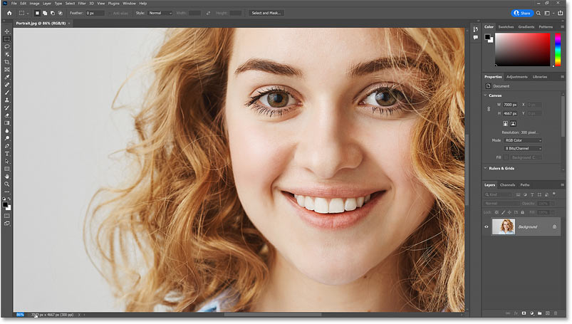
*Dragging with the scrubby slider to zoom in.*

### Photoshop's Zoom In and Zoom Out commands

Another way to zoom in and out of an image is by going up to the **View** menu in the Menu Bar and using the **Zoom In** and **Zoom Out** commands.

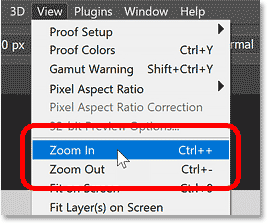
*The Zoom In and Zoom Out commands under the View menu.*

I’ll choose Zoom In, and Photoshop zooms the image in a bit closer. The only problem with these commands is that you would need to keep going back to the View menu and reselecting them to zoom in or out further.

*The result after selecting the Zoom In command.*

### The Zoom In and Zoom Out keyboard shortcuts

Thankfully, each command has a keyboard shortcut. And these are two of the most useful shortcuts in Photoshop to memorize. To zoom in, press and hold the **Ctrl** key, or the **Command** key on a Mac, and then press the **plus sign** (**+**). And to zoom out, hold the **Ctrl** key, or **Command** on a Mac, and press the **minus sign** (**-**).

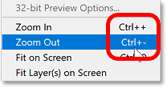
*The keyboard shortcuts for the Zoom In and Zoom Out commands.*

### Photoshop’s zoom level presets

Keep an eye on the zoom level in the document tab as you press **Ctrl++** (Win) / **Command++** (Mac) to zoom in on the image, and **Ctrl+-** (Win) / **Command+-** (Mac) to zoom out. Notice that the zoom level jumps to specific values.

For example, if you zoom out to **25%**:

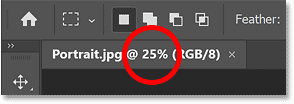
*Zoomed out to 25%.*

And then press **Ctrl++** (Win) / **Command++** (Mac) to zoom in, the zoom level will jump to **33.3%**.

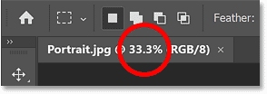
*The zoom level jumps from 25% to 33.3%.*

Continue zooming in and the zoom level jumps to **50%**, then **66.7%**, and then **100%**. And if you press **Ctrl+-** (Win) / **Command+-** (Mac) repeatedly to zoom out, the zoom level jumps from **100%** back to **66.7%**, then **50%**, **33.3%**, and then back to** 25%**.

These are not random values. These are the zoom levels that give us the most accurate view of the image. Any time we’re viewing the image at a zoom level less than 100%, we’re not seeing all of the pixels. So Photoshop needs to redraw the image with fewer pixels while still trying to make it look as accurate as possible.

But if you’re zoomed in at a value other than one of these presets, the image will look softer on your screen than it really is.

For example, on the left is the image zoomed in to an odd value, like 51.25%. And on the right is the image zoomed in to 50% (one of the presets). Notice how her eyelashes look softer on the left and sharper on the right. That’s because the 50% zoom level on the right is giving us a more accurate view.

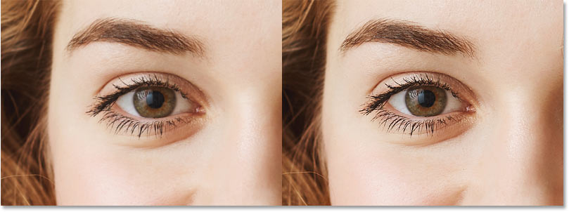
*A sharpness comparison with the zoom level at 51.25% (left) and 50% (right).*

So whenever you need a sharper view of your image,  use the keyboard shortcut **Ctrl++** (Win) / **Command++** (Mac) to zoom in, or **Ctrl+-** (Win) / **Command+-** (Mac) to zoom out to the nearest preset level (25%, 33.3%, 50%, 66.7%, 100% and so on).

### The Fit on Screen command

To go back to viewing the entire image at once, go up to the **View** menu and choose the **Fit on Screen** command. And notice that it has a keyboard shortcut, **Ctrl+0** or **Command+0** on a Mac.

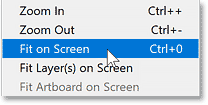
*Going to View > Fit on Screen.*

I’ll choose Fit on Screen, and now the entire image is once again visible.

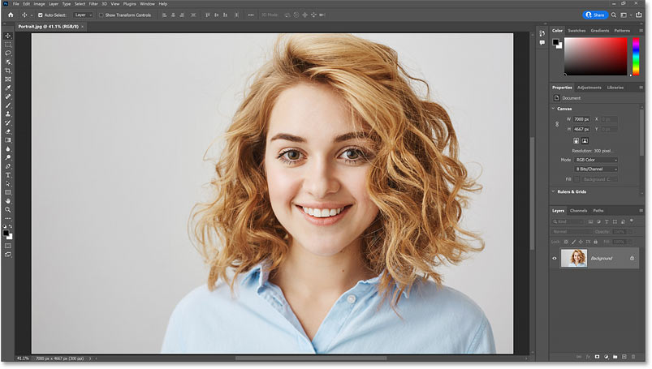
*The result after choosing Fit on Screen.*

### The 100% view

But to get the *most* accurate view possible, we need to view the image at a zoom level of 100%. And you can jump to 100% at any time by going up to the **View** menu and choosing **100%**. Or by pressing the keyboard shortcut, **Ctrl+1** or **Command+1** on a Mac.

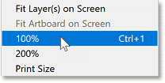
*Going to View > 100%.*

While we have the View menu open, notice that all of the main zoom commands share the same key for their shortcut. It’s the **Ctrl** key on a Windows PC and the **Command** key on a Mac. Once you know that, all you need to remember is to add the **plus sign** to zoom in, the **minus sign** to zoom out, **0** to fit the image on screen, and **1** to jump to 100%.

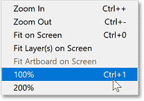
*The zoom command shortcuts.*

I’ll choose 100%, and the image jumps to the 100% zoom level.

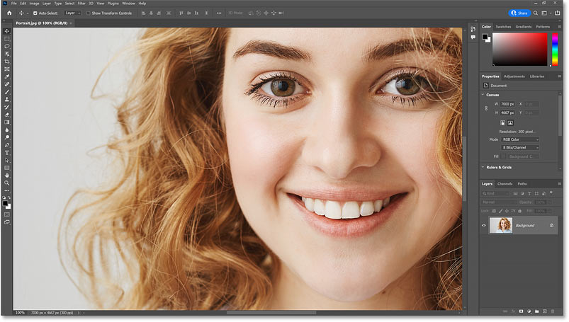
*Viewing the image at the 100% zoom level.*

It’s very important to understand that viewing the image at 100% is the *only* way to see a truly accurate view of your image with all of its detail. At 100%, each pixel in the image is displayed by a single pixel on your screen. And that is not true with any other zoom level.

So if you are [sharpening the image](/photo-editing/using-smart-sharpen-for-the-best-image-sharpening-in-photoshop/) or doing anything where you need the most accurate view possible, be sure to view it at 100%.

For now, I’ll go back to fitting it on the screen by pressing **Ctrl+0** (Win) / **Command+0** (Mac).

*Fitting the image on screen.*

### Using the Zoom Tool

So far, we’ve learned that we can zoom in and out using the Zoom in and Zoom Out commands. And you’ll use these commands all the time. But they do have one big drawback. They can only zoom on the center of the document window.

To control which part of the image we’re zooming in to, we use Photoshop’s **Zoom Tool**, found near the bottom of the [toolbar](/basics/photoshop-tools-toolbar-overview/). You can also select the Zoom Tool from your keyboard by pressing the letter **Z**.

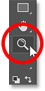
*Selecting the Zoom Tool from the toolbar.*

With the Zoom Tool active, your mouse cursor changes to a magnifying glass with a **plus sign** in the middle.

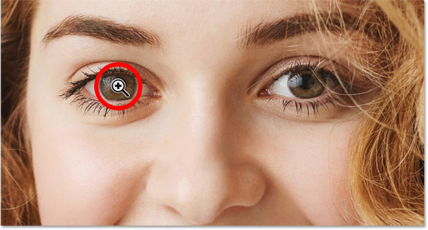
*The Zoom Tool's magnifying glass icon.*

Click on the area with the Zoom Tool to zoom in, and click repeatedly to zoom in closer. The Zoom Tool uses the same preset values as the Zoom In and Zoom Out commands that we looked at earlier (like 25%, 33.3%, 50%, 66.7%, 100%) so you're getting the most accurate view. 

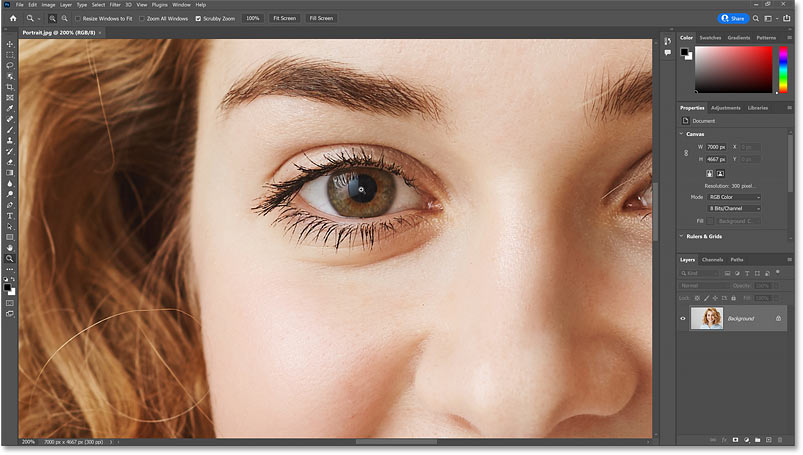
*Clicking with the Zoom Tool to zoom in on her eye.*

To zoom out with the Zoom Tool, press and hold the **Alt** key on your keyboard, or the **Option** key on a Mac. The plus sign will change to a **minus sign**.

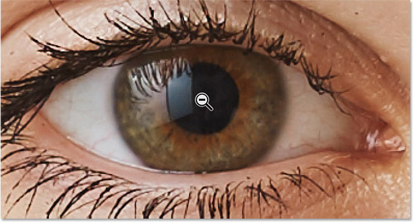
*Holding Alt (Win) / Option (Mac) to zoom out with the Zoom Tool.*

Then click on an area to zoom out, and click repeatedly to zoom out further.

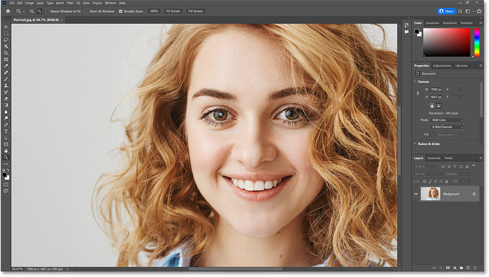
*Clicking with the Zoom Tool to zoom out.*

### Zooming in beyond 100%

You can zoom in beyond 100%. In fact, these days Photoshop lets you zoom all the way in to 12800%, although you may want to get your eyes checked if you need to zoom in that close. But once we go beyond 100%, we’re not seeing any more detail. We’re just making the pixels larger. 

Here I’m zoomed in to 800% and the image is looking quite blocky: 

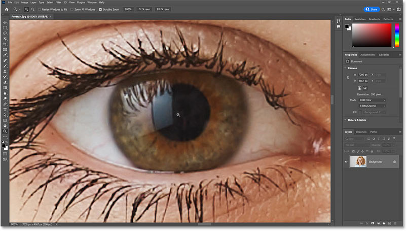
*Zooming in beyond 100% only makes the pixels bigger.*

### The Pixel Grid

If you continue zooming in closer and closer beyond 100%, you’ll eventually see an outline around the pixels known as the **Pixel Grid**. The grid won’t be visible when you save or print the image. It’s just for reference. And it will disappear when you zoom back out.

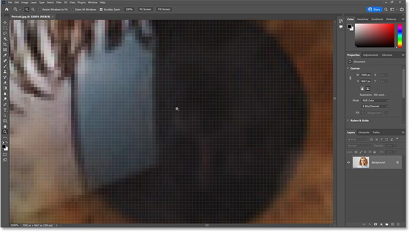
*The Pixel Grid appears when you zoom in far beyond 100%.*

You can disable the Pixel Grid by going up to the **View** menu, choosing **Show**, and then **Pixel Grid** to deselect it. To turn it back on later, just go back to the View menu and reselect it. Personally I just leave it on because I rarely zoom in close enough for it to appear.

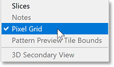
*Go to View > Show > Pixel Grid to turn the grid on and off.*

### How to temporarily switch to the Zoom Tool from your keyboard

So the Zoom Tool is great for zooming in on a specific area. But rather than selecting it from the toolbar every time you need to zoom in or out, a better way is to access the Zoom Tool temporarily from your keyboard.

Just hold down the **spacebar** and the **Ctrl** key on a Windows PC, or the **spacebar** and the **Command** key on a Mac. Mac users may need to hold the spacebar first, *then* the Command key, to avoid a conflict with the MacOS operating system.

You’ll have access to the Zoom Tool for as long as the keys are held down so you can click on an area to zoom in. To zoom out, add the **Alt** key, or the **Option** key on a Mac. Release the Alt or Option key to switch back to zooming in, and release all the keys to switch back to the previous tool so you can keep on working.

### Continuous Zoom

Another way to use the Zoom Tool is with a feature known as **Continuous Zoom**. With the Zoom Tool active, click on an area where you want to zoom in and keep your mouse button held down. After a second or so, Photoshop will start zooming in continuously until you release your mouse button. To zoom out continuously, add the **Alt** key or the **Option** key, and then click and hold.

### Scrubby Zoom

But my favorite way, and the fastest way, to use the Zoom Tool is with a feature called **Scrubby Zoom**. This feature should be turned on by default. But just to make sure, select the Zoom Tool from the toolbar.

*Selecting the Zoom Tool.*

And in the Options Bar, make sure **Scrubby Zoom** is checked.

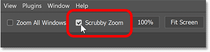
*The Scrubby Zoom option in the Options Bar.*

Then simply click and drag to the right to zoom in on an area, or drag to the left to zoom out. The faster you drag, the faster the zooming will be.

The only catch with Scrubby Zoom is that you need to start dragging immediately after you click. If you wait too long, Photoshop will assume you want to use Continuous Zoom instead. And once Continuous Zoom starts, dragging has no effect. So to use Scrubby Zoom, make sure you start dragging as soon as your mouse button is down.

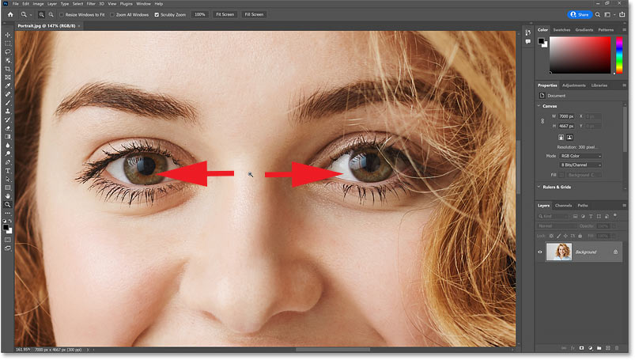
*Click and drag left or right with the Zoom Tool to use Scrubby Zoom.*

### Dragging a selection outline to zoom in

If you turn Scrubby Zoom off by unchecking it in the Options Bar:

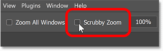
*Turning Scrubby Zoom off.*

Then the Zoom Tool behaves more like the [Rectangular Marquee Tool](/basics/selections/rectangular-marquee-tool/). You can click and drag a selection outline around an area:

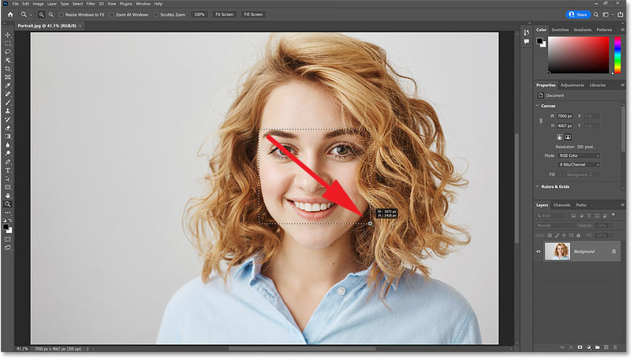
*With Scrubby Zoom off, click and drag a selection outline with the Zoom Tool.*

And when you release your mouse button, Photoshop instantly zooms in on that area. If you prefer to work this way, you can leave Scrubby Zoom unchecked. But if you like Scrubby Zoom better, just reselect it in the Options Bar.

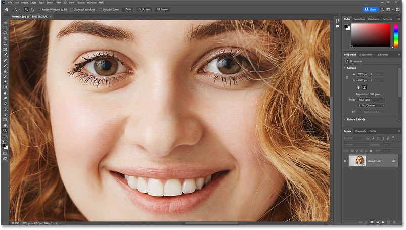
*Photoshop zooms in on the selected area when you release your mouse button.*

### Zooming with the scroll wheel

Finally, one more way to zoom in and out is by using the **scroll wheel** on your mouse. And this works with any tool active, not just the Zoom Tool.

Hover your cursor over the area where you want to zoom in. Press and hold the **Alt** key or the **Option** key on a Mac, and scroll the wheel up to zoom in or down to zoom out.

And if you add the **Shift** key, you’ll limit the zoom values to just those presets we looked at earlier that give you the sharpest and most accurate view. And that’s the basics of zooming in and zooming out in Photoshop.

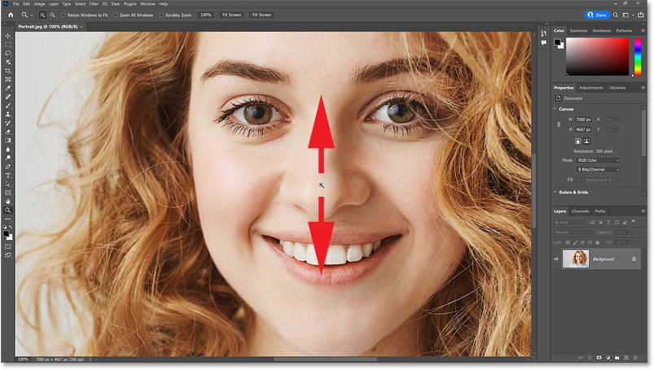
*Hold Alt (Win) / Option (Mac) and scroll up or down to zoom in or out.*

## How to pan or scroll an image in Photoshop

Next, let’s look at how to pan or scroll an image from one area to another. Panning or scrolling  is most useful when we’re zoomed in and can’t see everything at once. 

So I’ll zoom my image in to 100% by going up to the **View** menu and choosing **100%**. Or by pressing that keyboard shortcut we learned in the previous section, **Ctrl+1** or **Command+1** on a Mac.

*Viewing the image at 100%.*

### Using the Hand Tool

To pan the image from one area to another, we use Photoshop’s **Hand Tool** which is found in the toolbar directly above the Zoom Tool. You can also select the Hand Tool from the keyboard by pressing the letter **H**.

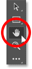
*Selecting the Hand Tool from the toolbar.*

With the Hand Tool active, your mouse cursor changes to a hand icon.

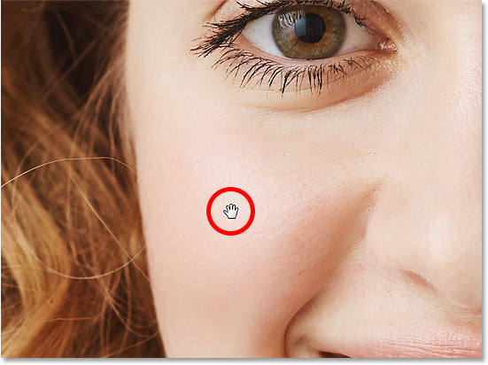
*The Hand Tool icon.*

Then simply click on the image, keep your mouse button held down, and drag the image around to view and inspect different areas. Release your mouse button to let go.

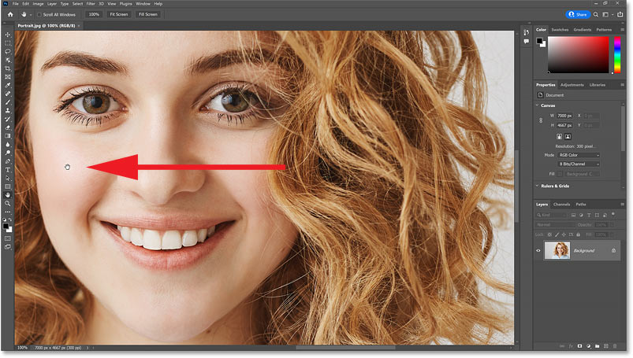
*Panning the image with the Hand Tool.*

### Flick Panning

If you release your mouse button while you are in the middle of a drag, you will toss or throw the image in that direction. And it will keep moving until it gradually comes to a stop. Or you can stop it manually by clicking on the image again. This is known as **Flick Panning**.

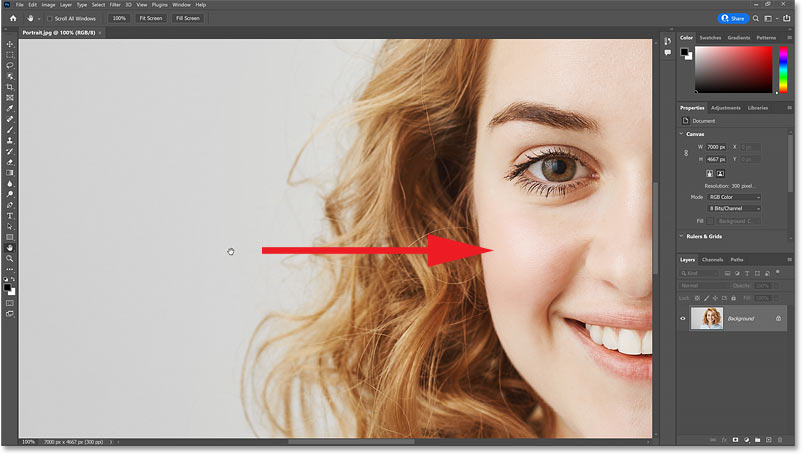
*Release your mouse button in the middle of a drag to throw the image in that direction.*

If Flick Panning is not working, check to make sure it’s enabled in Photoshop’s Preferences. On a Windows PC, go up to the **Edit** menu. On a Mac, go up to the **Photoshop** menu. From there, choose **Preferences**, and then **Tools**.

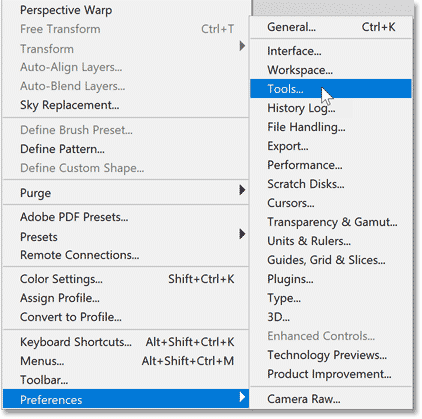
*Going to Edit (Win) / Photoshop (Mac) > Preferences > Tools.*

Make sure **Enable Flick Panning** is checked, and then click OK to close the Preferences dialog box.

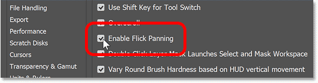
*Making sure Enable Flick Panning is turned on.*

### How to access the Hand Tool temporarily

Just like with the Zoom Tool that we looked at earlier, you won’t want to select the Hand Tool from the toolbar every time you need to pan to a different part of the image.

So a faster way to work is to access the Hand Tool temporarily from your keyboard. And you can do that by pressing and holding the **spacebar**. So holding the spacebar along with the Ctrl (Win) / Command (Mac) key lets you access the Zoom Tool temporarily, and holding the spacebar on its own gives you access to the Hand Tool.

Release the spacebar when you are done panning to switch from the Hand Tool back to your previous tool. 

### Panning the image with the scroll bars

You can move the image up or down using the **scroll bar** along the **right** of the document window. And you can pan left or right using the **scroll bar** along the **bottom**.

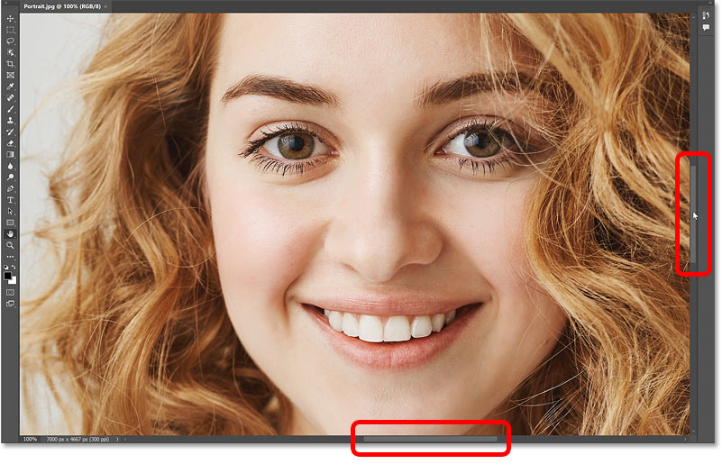
*Panning the image with the scroll bars.*

### Panning with the scroll wheel

But you can also pan the image up, down, left or right using the **scroll wheel** on your mouse (if your mouse has one). This works with any tool active, not just the Hand Tool. Scrolling the wheel up moves the image up, and scrolling down moves it down.

Hold the **Ctrl** key, or the **Command** key on a Mac, and scroll the wheel up to pan the image to the left, or scroll down to pan it to the right.

And just to recap from earlier, holding the Alt or Option key while scrolling your mouse wheel up or down lets you zoom in and out.

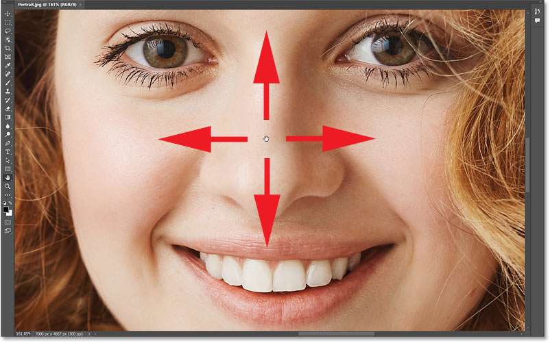
*Panning the image up, down, left or right using the mouse scroll wheel.*

### The Birds Eye View

Finally, a great way to pan an image  is by using a feature called **Bird’s Eye View**, which is not just useful but also a lot of fun.

I’ll zoom in close to my image so we can really see how it works. Here I'm zoomed in to 200%.

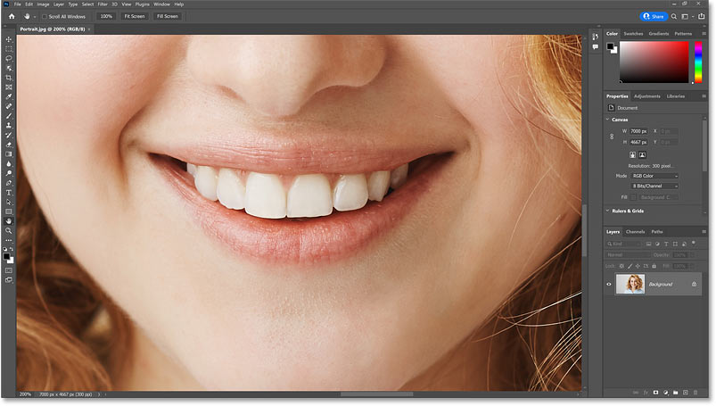
*Zooming in on a specific part of the image.*

Earlier, we learned that we can select the Hand Tool by pressing the letter **H** on the keyboard. To use the Bird’s Eye View, press and hold the letter H. It won’t work by holding the spacebar to temporarily access the Hand Tool, and you need to hold H even if the Hand Tool is already active in the toolbar.

With the H key down, click and hold on your image. Photoshop will zoom the image out so it fits entirely on the screen. And you’ll see a rectangle which represents the area you’ll zoom in to next. Drag the rectangle over the new area you want to inspect.

*Hold H, click and hold on the image to zoom out, and drag the rectangle over a different area.*

Release your mouse button, and Photoshop instantly zooms in on that area, at the same zoom level you were at previously (so in my case, 200%).

As long as the H key is still down, you can keep clicking and holding on the image to zoom out, dragging the rectangle to a different area, and then releasing your mouse button to zoom back in.

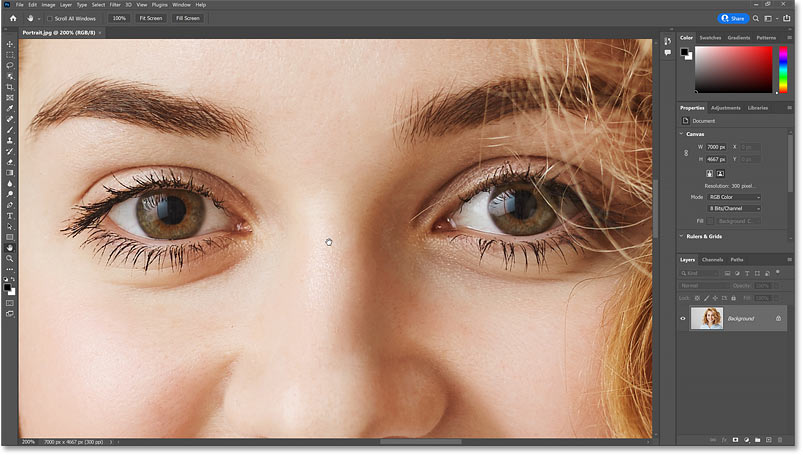
*Release your mouse button to zoom back on.*

### Selecting the Fit on Screen and 100% views from the toolbar

Here’s one last tip. If you ever need to jump to the Fit on Screen or 100% views but can't remember their keyboard shortcuts, you can quickly access them from the toolbar.

Double-click on the **Hand Tool** in the toolbar for **Fit on Screen**. Or double-click on the **Zoom Tool** to jump to **100%**.

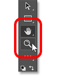
*Double-click the Hand Tool for the Fit on Screen view or the Zoom Tool for 100%.*

And there we have it! In the next lesson, we'll learn [how to navigate multiple open images](/basics/zoom-and-pan-all-images-at-once-in-photoshop/) at once! You can jump to any of my other lessons in this [Navigating Images in Photoshop](/basics/photoshop-image-navigation/) chapter. Or visit my [Photoshop Basics](/basics/) section for more topics!