# Photoshop’s Brush Tool Fixed in Latest Update

> Source: [https://www.photoshopessentials.com/basics/photoshops-brush-tool-fixed-in-latest-update/](https://www.photoshopessentials.com/basics/photoshops-brush-tool-fixed-in-latest-update/)
> Downloaded and converted to Markdown.

This tutorial covers the new Brush Tip Outline option in the latest Photoshop update that finally fixes Photoshop's Brush Tool so the cursor no longer gets lost as you paint!

If you have a tough time seeing Photoshop's brush cursor, especially in front of busy or noisy parts of your image, you’ll definitely want to update your copy of Photoshop to the latest version.

The December 2022 update, which brings Photoshop to version 24.1.0, adds a new option in the Preferences that lets you easily change the thickness of the brush cursor outline. Here’s how it works.

### Which version of Photoshop do I need?

To follow along, you'll need [Photoshop 2023](https://prf.hn/l/dlXjD2w).

You’ll also want to make sure that it’s updated to the latest version. At the time I’m writing this, the latest Photoshop version is **24.1.0**, released in December 2022. Of course, higher versions will work as well.

You can check your Photoshop version by going up to the **Help** menu in the Menu Bar and choosing **About Photoshop**.

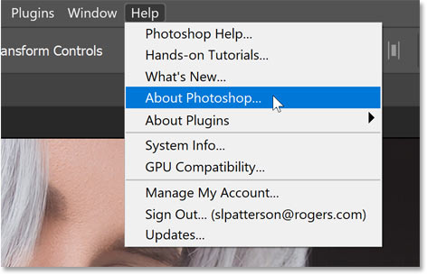
*Going to Help > About Photoshop.*

The About screen should show **24.1.0** (or higher). Check out my tutorial on [how to update Photoshop](/basics/update-photoshop-cc/) if needed.

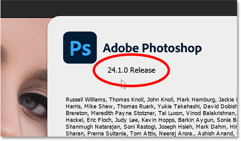
*The December 2022 update brings Photoshop to version 24.1.0.*

Let's get started!

## The problem with Photoshop’s Brush Tool

Let’s quickly look at the problem with Photoshop’s Brush Tool. I’ll use [this image](https://adobe.prf.hn/click/camref:1100lrdjJ/destination:https%3A%2F%2Fstock.adobe.com%2Fimages%2Fstylish-girl-with-healthy-long-grey-hair-outdoor%2F336723691) from Adobe Stock.

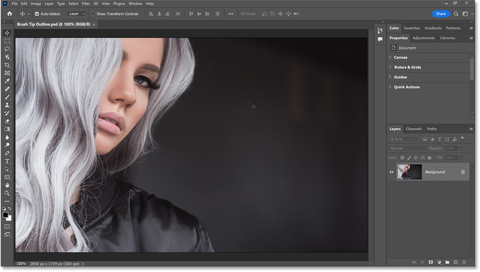
*The image open in Photoshop.*

And I’ll grab the **Brush Tool** from the [toolbar](/basics/photoshop-tools-toolbar-overview/).

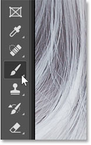
*Selecting the Brush Tool.*

If I move my brush cursor over a less detailed part of the image, like the dark gray area on the right, the cursor is fairly easy to see.

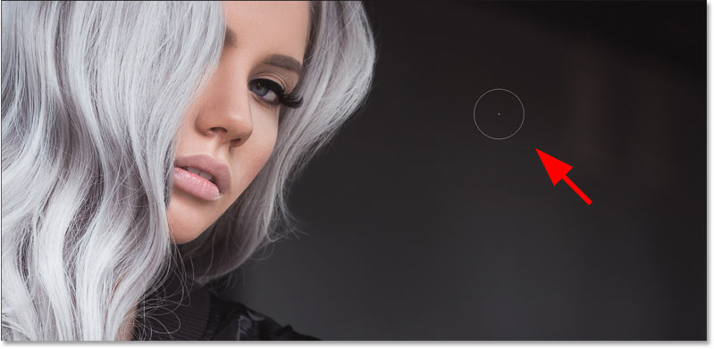
*The brush cursor is easy to see in front of simple backgrounds.*

But if I move the cursor over her hair, which is a much more detailed area with lots of different shades of gray, the cursor tends to get lost in the background. This has always been an issue with the Brush Tool, at least until now.

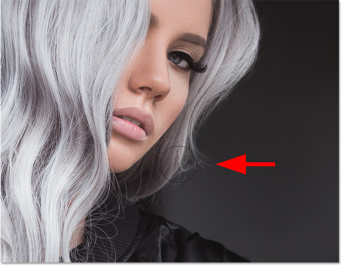
*The cursor is much harder to see over more detailed areas.*

[Related tutorial: Turn your brush into an eraser!](/basics/turn-a-photoshop-brush-into-an-eraser/)

## Where to find the new Brush Tip Outline option

But finally, the latest version of Photoshop (24.1.0) fixes the problem thanks to a new option in the Preferences called **Brush Tip Outline** which lets us change the thickness of the brush cursor.

To get to it, on a Windows PC, go up to the **Edit** menu. On a Mac, go up to the **Photoshop** menu.

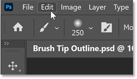
*Go to Edit (Windows) / Photoshop (Mac).*

From there, choose **Preferences** and then **Cursors**.

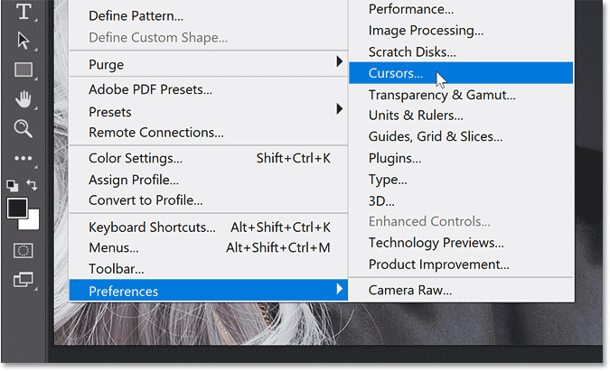
*Go to Preferences > Cursors.*

## The new brush cursor outline sizes

Here we find the new **Brush Tip Outline** option. I have it currently set to **Thin**, which seems to be the size the brush cursor was using in previous Photoshop versions.

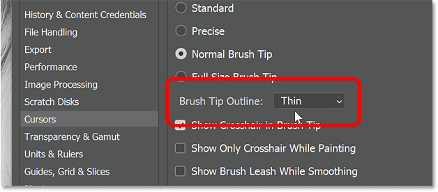
*The new Brush Tip Outline option.*

But along with Thin, you can also choose **Normal**, **Bold** or **Extra Bold**. The default size is **Bold**. So even if you were not aware of this new option, you would probably notice that your brush cursor is now easier to see.

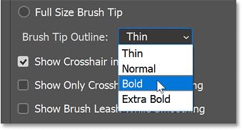
*The four brush cursor outline sizes.*

### Another helpful Brush Tool option

Unfortunately, you can’t preview the new cursor thickness until you close the Preferences dialog box. But while we’re here, I just want to quickly mention another option that I find helpful.

**Show Crosshair in Brush Tip**, which is not a new option, adds a small crosshair in the center of your brush cursor. This helps you see exactly where you’re painting. I recommend turning it on if you haven’t already.

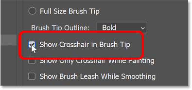
*Show Crosshair in Brush Tip is an old but useful option.*

[Related tutorial: More Brush Tool Tips and Tricks](/basics/photoshop-brush-tool-hidden-tips-tricks/)

## Choosing a new brush cursor thickness

Getting back to the new option, Brush Tip Outline, I’ll set the thickness to **Extra Bold**.

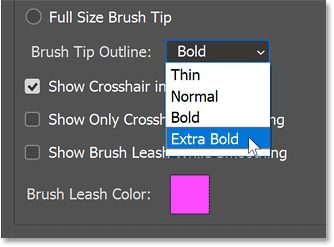
*Setting the brush cursor to Extra Bold.*

Then I’ll click OK to close the Preferences dialog box.

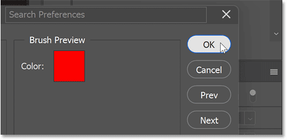
*Closing the Preferences dialog box.*

And now if I move my brush cursor over any part of the image, including her hair, the brush cursor remains easy to see thanks to my new new Brush Tip Outline setting.

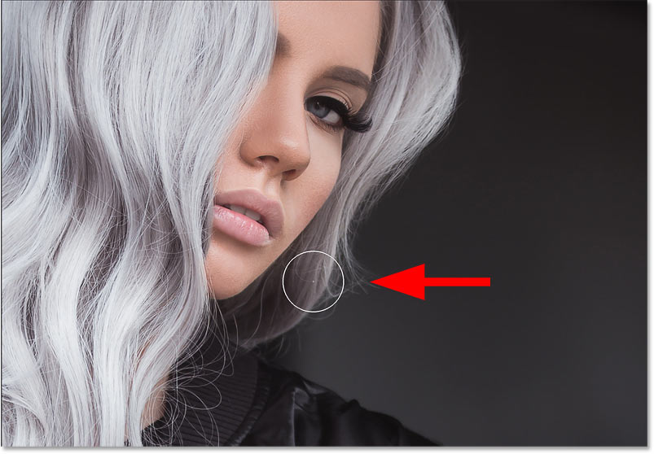
*The Brush Tool cursor no longer gets lost in the background.*

And there we have it! That’s a minor but welcome improvement in the latest update to Photoshop.