# Photoshop Free Transform Essential Skills

> Source: [https://www.photoshopessentials.com/basics/photoshops-free-transform-essentials/](https://www.photoshopessentials.com/basics/photoshops-free-transform-essentials/)
> Downloaded and converted to Markdown.

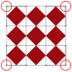

**\*UPDATE NOTE:** Adobe made changes to Free Transform as of Photoshop CC 2019. For the most up to date version of this tutorial, please see my new [Free Transform in CC 2019 - Complete Guide](/basics/transform-and-warp-images-with-free-transform-in-photoshop-cc-2019/).

In this tutorial, we'll learn **how to use the Free Transform command in Photoshop** to easily resize and reshape objects and images.

As we'll see, what makes the Free Transform command so useful is that not only does it allow us to freely move, resize and reshape things, but it also lets us easily switch between Photoshop's other transformation commands, like Skew, Distort, Perspective, and Warp. And, we can apply as many of these commands as needed as a single step, which helps minimize any loss of image quality that may result from our edits.

We can apply Free Transform to layers, selections, shapes, type, and more. We can even apply it to layer masks and vector masks. And when combined with the power of Smart Objects, everything we do with Free Transform becomes completely non-destructive! All of this makes knowing how to use Free Transform one of the most essential skills in Photoshop. Let's see how it works.

I'll be using **Photoshop CC** throughout this tutorial, but everything we'll be covering also applies to **Photoshop CS6.** Just a quick but important note though before we begin. In the November 2015 Creative Cloud updates, Adobe made some changes to the look of Photoshop's interface. This means that if you're using Photoshop CS6 or you haven't yet updated your copy of Photoshop CC to the latest version, some of my screenshots will look a bit different from what you'll see on your screen. The differences are purely cosmetic, though, as the basics of using the Free Transform command have not changed. So as long as you're using CS6 or CC (Creative Cloud), this tutorial is fully compatible with your version of Photoshop. Having said that, let's get started!

This tutorial is from our [How to make selections in Photoshop](/basics/make-selections-photoshop/) series.

## How To Use Free Transform In Photoshop

### Creating A New Document

If you just want to read about how Free Transform works, feel free to skip these first few steps and scroll down to the **Scaling An Object** section. If you want to follow along with me, we're going to start things off by creating a new document and then adding a custom shape that we can use to practice our Free Transform skills.

Let's begin, then, by creating a brand new Photoshop document. To do that, I'll go up to the **File** menu in the Menu Bar along the top of the screen and choose **New**. I could also just press the keyboard shortcut, **Ctrl+N** (Win) / **Command+N** (Mac). Either way works:

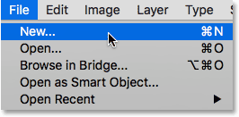
*Going to File > New.*

This opens Photoshop's New dialog box. For this tutorial, I'll set the **Width** of my new document to **1200 Pixels** and the **Height** to **800 Pixels**. You can leave the other options set to their defaults, but make sure **Background Contents** is set to **White**, since a white background will make it easier for us to see what we're doing.

Again, don't worry if you're using an earlier version of Photoshop and your New dialog box looks a bit different from mine. The options are exactly the same. When you're done, click OK to close out of the dialog box. A new document, filled with white, will appear on your screen:

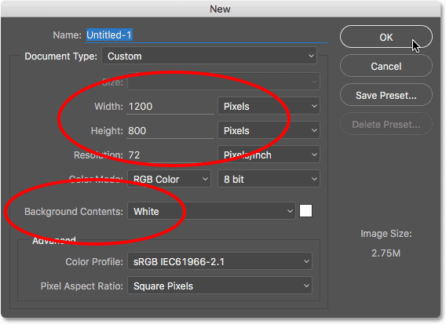
*Creating a new 1200 pixel by 800 pixel document with a white background.*

### Drawing A Custom Shape

Next, let's add an object to our document that we can transform. We'll use one of Photoshop's custom shapes. To add a custom shape, we need the **Custom Shape Tool**. By default, it's nested behind the Rectangle Tool in the Tools panel, so to select it, I'll **right-click** (Win) / **Control-click** (Mac) on the Rectangle Tool's icon and choose the Custom Shape Tool from the bottom of the fly-out menu:

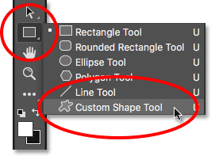
*Selecting the Custom Shape Tool.*

With the [Custom Shape Tool](/basics/how-to-use-the-custom-shape-tool-in-photoshop-cs6/) selected, the Options Bar along the top of the screen (directly below the Menu Bar) changes to show options specifically for the Custom Shape Tool. One of the most important options we have when using the Custom Shape Tool (or any of Photoshop's other Shape tools) is the **Tool Mode** option, which lets us choose whether we want to draw a *vector* shape, a *path* or a shape made out of *pixels*.

You can learn more about the differences between vector shapes and pixel shapes in our [Vector Shapes vs Pixel Shapes](/basics/vector-shapes-vs-pixel-shapes-in-photoshop/) tutorial, but the reason this is important when learning about Free Transform is because the Free Transform command actually goes by different names depending on what type of object is selected.

To show you what I mean, I'll start off by drawing a vector shape. To do that, I'll make sure the Tool Mode option near the far left of the Options Bar is set to **Shape** (short for Vector Shape):

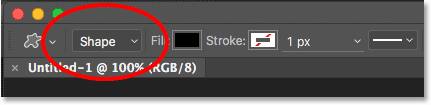
*Setting the Tool Mode option to Shape in the Options Bar.*

Next, we need to choose which custom shape we want to draw. The shape **preview thumbnail** in the Options Bar shows us the shape that's currently selected. Click on the thumbnail to choose a different shape:

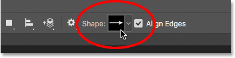
*Clicking the shape preview thumbnail.*

Clicking the thumbnail opens the **Custom Shape Picker**. The shape we want for this tutorial is the one that looks like a **3x3 grid of diamonds**. Click on its thumbnail to select it, then press **Enter** (Win) / **Return** (Mac) on your keyboard to close out of the Custom Shape Picker:

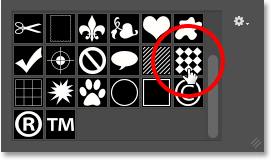
*Selecting the 3x3 grid of diamonds shape.*

To choose a color for the shape, click on the **Fill color swatch** in the Options Bar:

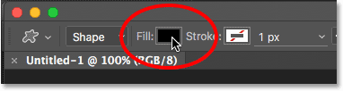
*Clicking the Fill color swatch.*

This opens the **Fill Type** dialog box. First, make sure the **Solid Color** icon is selected at the top (second icon from the left) so we're filling the shape with a solid color (as opposed to a gradient, a pattern or no color at all). Then, choose a color from the selection of swatches. You'll want a color that will be easy to see against the white background of the document. I'll choose a dark red by clicking on its swatch. Once you've chosen a color, press **Enter** (Win) / **Return** (Mac) on your keyboard to close the swatches:

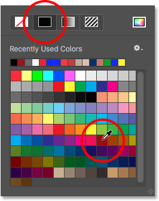
*Choosing a dark red.*

To draw the shape, click in the center of your document, then keep your mouse button held down and begin dragging away from the spot you clicked on. Once you've started dragging, press and hold the **Shift** key and the **Alt** (Win) / **Option** (Mac) key on your keyboard, then continue dragging. Holding the Shift key down will lock the shape to its original aspect ratio as you're drawing it, while the Alt (Win) / Option (Mac) key allows us to draw the shape outward from its center rather than from a corner, making it easier to center the shape in the document.

As you're dragging out the shape, you'll see only a thin outline of what the shape will look like. Don't make the shape too big since we'll need room around it to practice reshaping and resizing it:

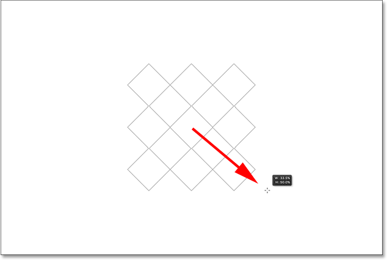
*Dragging out the custom shape from the center of the document.*

When you're happy with the size of the shape, release your mouse button, *then* release your Shift and Alt (Win) / Option (Mac) keys. Make sure you do it in that order (mouse button first, keys second) otherwise you'll get unexpected results. Photoshop fills the shape with your chosen color, and we now have our object that we can transform:

*Photoshop fills the shape with color when you release your mouse button.*

If we look in the [Layers panel](/basics/layers/layers-panel/), we see that Photoshop has placed our shape on its own separate **Shape layer** above the Background layer. We can tell that it's a Shape layer and not a normal pixel layer by the small **shape icon** in the lower right of the layer's preview thumbnail:

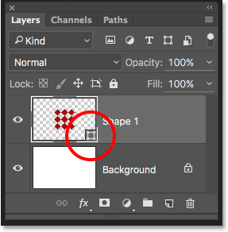
*The Layers panel showing the new Shape layer.*

### Free Transform, Free Transform Path and Free Transform Points

Earlier, I mentioned that the Free Transform command goes by different names depending on which type of object is selected. Regardless of what it's called, you'll always find it listed under the **Edit** menu at the top of the screen, but in this case, because I've drawn a vector shape, if I go up to the Edit menu and look for Free Transform, we see that it's actually named **Free Transform Path**. That's because in Photoshop, a vector shape is really just a *path* (the thin outline of the shape) that's filled with a color. Since vector shapes are beyond the scope of this tutorial, we won't go into detail about them here, but just be aware that whenever you're working with a vector shape, the Free Transform command will appear under the Edit menu as Free Transform Path:

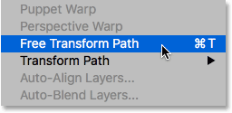
*When transforming vector shapes, the command is named Free Transform Path.*

I'm not going to select the Free Transform Path command. Instead, let's see what happens if, rather than the entire shape, I have only *part* of the shape selected. To select just one section of the shape, I'll need Photoshop's **Direct Selection Tool** (also known as the "white arrow" tool).

By default, it's nested behind the **Path Selection Tool** (the "black arrow" tool) in the Tools panel, so to get to it, I'll **right-click** (Win) / **Control-click** (Mac) on the Path Selection Tool and choose the Direct Selection Tool from the fly-out menu:

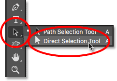
*Choosing the Direct Selection Tool.*

The difference between these two tools is that, as its name implies, the Path Selection Tool selects entire paths while the Direct Selection Tool can select individual *points* along the path (the "points" are those little squares you see around the diamond shapes). Again, we won't go into details here about how paths work, but just as a quick example, I'll click and drag with the Direct Selection Tool around a single diamond in the shape (the one in the upper left):

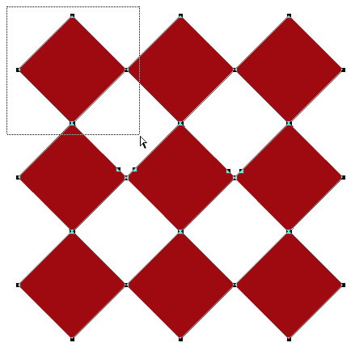
*Dragging a selection around part of the shape with the Direct Selection Tool.*

With just that one part of the shape now selected, if I go looking for Free Transform under the Edit menu, we see that even though it was named Free Transform Path a moment ago, it's now named **Free Transform Points**. Exact same command, but two slightly different names depending on what is currently selected:

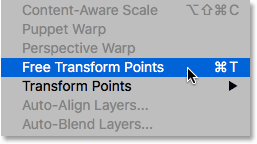
*With only part of the vector shape selected, the command is named Free Transform Points.*

Finally, let's see what happens if we convert our vector shape into a pixel shape. Rather than changing the Tool Mode option in the Options Bar from Shape to Pixels and redrawing the shape from scratch, all I need to do is go up to the **Layer** menu at the top of the screen, choose **Rasterize**, and then chose **Shape**:

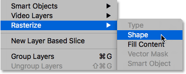
*Going to Layer > Rasterize > Shape.*

The term *rasterize shape* simply means "convert the shape into pixels". It may still look like the same shape in the document, but if we look again in the Layers panel, we no longer see the small shape icon in the lower right of the layer's preview thumbnail, which means our shape is no longer a vector shape; it's now made up of pixels:

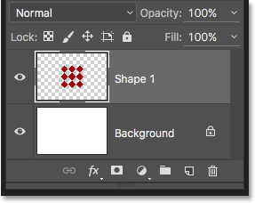
*The Shape layer is now a pixel-based layer.*

If I go back up to the **Edit** menu, we see that because I'm now working with a pixel-based object, the Free Transform command is named simply **Free Transform**. Again, don't let these variations on the name fool you. Whether it's called Free Transform, Free Transform Path or Free Transform Points (depending on what's selected), they're all the exact same command and they all behave exactly the same way:

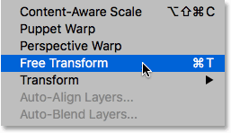
*When transforming pixels, the command is named Free Transform.*

### Scaling An Object

Let's see how Free Transform actually works. I'll select it by going up to the **Edit** menu and choosing **Free Transform**. Or, a faster way to select Free Transform is by pressing **Ctrl+T** (Win) / **Command+T** (Mac) on your keyboard. This keyboard shortcut works whether you're selecting Free Transform, Free Transform Path or Free Transform Points (which we covered in the previous section). Even if you're not the type who likes keyboard shortcuts, I highly recommend making an except with this one because you'll most likely be using Free Transform a lot in your Photoshop work.

As soon as you select Free Transform, you'll see a box appear around the object. This is the **transform box**. Notice that the box includes a series of squares around it. There's one on the top, bottom, left, and right, as well as one in each of the four corners. These squares are known as **transformation handles**, or simply **handles** for short, and we use them to resize and reshape whatever is inside the box:

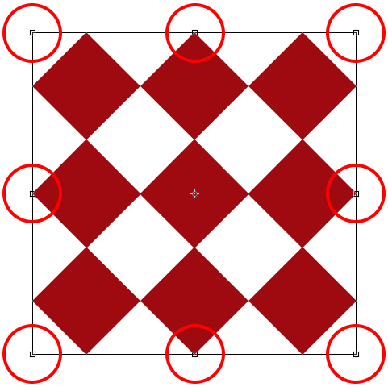
*The handles around the Free Transform box.*

With its default behavior, Free Transform allows us to move, scale and rotate objects. To adjust the **width** of an object without affecting the height, click on either the **left or right handle** and, with your mouse button still held down, drag the handle horizontally. If you press and hold your **Alt** (Win) / **Option** (Mac) key as you drag, you'll adjust the width from the **center** of the object rather than from the opposite side, in which case both sides will move at the same time but in opposite directions. Here, I'm dragging the right side handle outward. Notice that the diamond shapes are stretching wider:

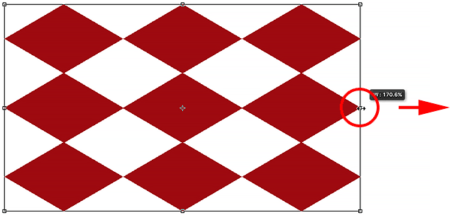
*Drag the left or right handle to scale the width.*

To adjust the **height** without affecting the width, click on either the **top or bottom handle** and, again with your mouse button still held down, drag the handle vertically. Pressing and holding **Alt** (Win) / **Option** (Mac) as you drag will scale the height from the **center** of the object, causing the opposite side to move along with you in the opposite direction. Here, I'm dragging the top handle upward and as I drag, the diamond shapes are stretching taller:

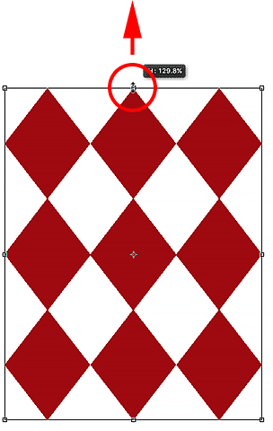
*Drag the top or bottom handle to scale the height.*

To scale both the width and height at the same time, click and drag any of the four **corner handles**. By default, you can drag the corner handles around freely, but this can easily lead to the original shape of the object becoming distorted. To lock the original aspect ratio of the object in place as you drag, press and hold your **Shift** key. Pressing and holding **Shift+Alt** (Win) / **Shift+Option** (Mac) as you drag a corner handle will both lock the aspect ratio and scale the width and height from the center of the object rather than from the opposite corner. Here, I'm making the shape smaller by dragging the top left corner inward:

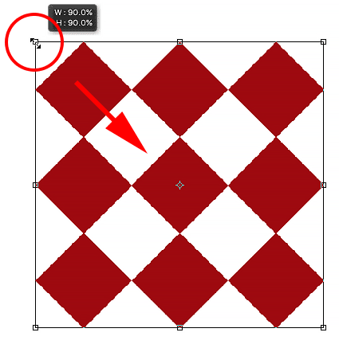
*Drag a corner handle to scale the width and height at the same time.*

### A Quick Note About Using Modifier Keys

It's important to note that whenever you're using a modifier key like Shift or Alt (Win) / Option (Mac) as you're dragging a handle, you always want to make sure that when you're done, you **release your mouse button first, *then* the modifier key(s)**. It may sound nitpicky, but if you release the modifier key(s) before releasing your mouse button, you'll lose the effect and the Free Transform box will suddenly jump to the way it would have looked without the modifier(s). So just remember to always release your mouse button first, *then* the modifier key(s), and you'll avoid any unexpected results.

### Adjusting The Width And Height From The Options Bar

You don't actually need to drag the Free Transform handles to scale the width and height of an object. If you know the exact values you need, you can enter them directly into the **Width** (**W**) and **Height** (**H**) fields in the Options Bar. Clicking the **link icon** between the values will lock the aspect ratio of the object in place, so when you change either the width or the height, Photoshop will automatically change the other one for you. Here, I've entered a Width value of 150%, and because I selected the link icon, Photoshop changed the Height to 150% as well:

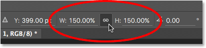
*Entering values directly into the Width and Height fields is another way to scale an object with Free Transform.*

### Rotating An Object

To rotate an object, move your mouse cursor outside of the Free Transform box. When you see the cursor change into a **curved, double-sided arrow**, simply click and drag to rotate it. Pressing and holding **Shift** as you drag will rotate the object in 15° increments (you'll see it snapping into place as it rotates):

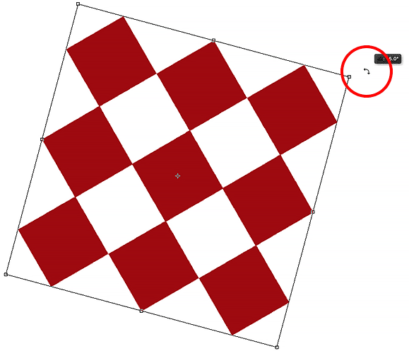
*Move your mouse cursor outside the transform box, then click and drag to rotate it.*

### Rotating From The Options Bar

You can also enter an exact rotation value, in degrees, into the **Rotation** field in the Options Bar. You'll find it directly to the right of the Height (H) field:

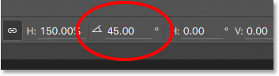
*Entering a value into the Rotation field.*

### Changing The Rotation Point

If you look in the center of the Free Transform box, you'll see a little target icon. This icon represents the **transformation reference point**. In other words, it's the spot around which everything rotates:

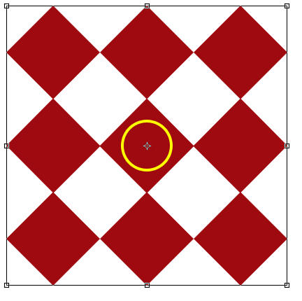
*The transformation reference point icon.*

By default, it's in the center, but it doesn't have to be. You can click on the icon and drag it anywhere you need it, and that new spot will become the new rotation point. You can even drag it outside of the Free Transform box. If you drag the icon near one of the handles, it will snap to that handle. Here, I've dragged it onto the handle in the lower left corner, and now when I rotate the object, it rotates around that corner:

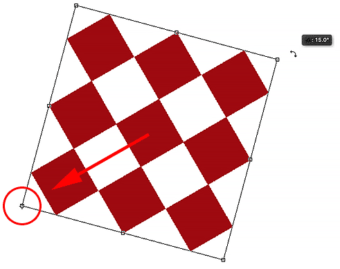
*With the reference point moved to the lower left handle, everything now rotates around that handle.*

### The Reference Point Locator

You can also reposition the reference point using the **Reference Point Locator** in the Options Bar. It's a bit small so I've enlarged it here to make it easier to see. The Reference Point Locator may look like just a regular icon but it's actually interactive. Notice that the locator is divided into a 3x3 grid. Each square around the grid represents a corresponding handle on the Free Transform box. Simply click on a square to move the reference point to that handle. To move it back to the center (as I'm going to do), click on the center square:

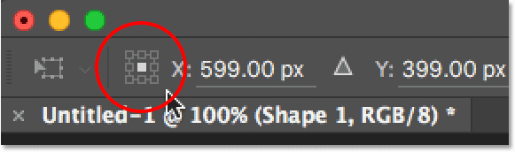
*The Reference Point Locator.*

### Moving An Object

We can use Free Transform to move the selected object from one location to another within the document. One way to do that is by clicking anywhere inside the Free Transform box (anywhere *except* on the reference point icon in the center) and dragging the object around freely with your mouse:

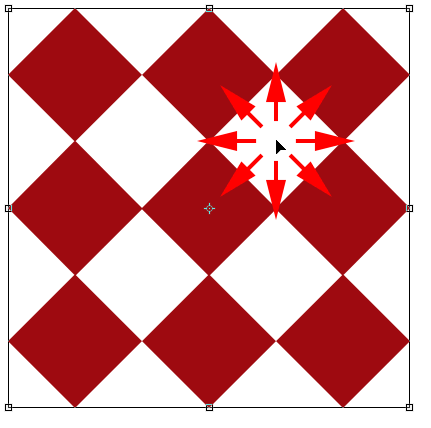
*Click and drag inside the Free Transform box to reposition the object inside the document.*

You can also set a new location for the object by entering specific pixel coordinates into the **X** (horizontal position) and **Y** (vertical position) fields in the Options Bar. Note that these values are based not on the object itself but on the location of its **reference point** that we looked at in the previous section. For example, if the reference point is located in the center of the object, the object will be centered at those X and Y coordinates. If it’s in the upper left corner, then the upper left corner will move to those coordinates, and so on. If things don’t seem to be lining up properly, check the Reference Point Locator to make sure the reference point is in the correct spot.

If you click the small **triangle** between the X and Y fields, instead of serving as actual coordinates, the pixel values you enter will move the object a specific distance in relation to the object's **current position**. In other words, entering 50 px for the X value will move the object 50 pixels to the right, while entering 100 px for the Y value would move it 100 pixels down. Enter negative values to move the object in the opposite directions:

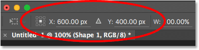
*Use the X and Y fields to move the object to exact pixel coordinates, or click the triangle to move it relative to its current position.*

### Undo Or Cancel The Transformation

Before we continue on and look at more ways to transform an object, we should first learn how to undo or cancel a transformation, which will make it easier to follow along. Photoshop gives us one level of undo when working with Free Transform. To **undo your last step**, you can either go up to the **Edit** menu at the top of the screen and choose **Undo**, or you can press **Ctrl+Z** (Win) / **Command+Z** (Mac) on your keyboard:

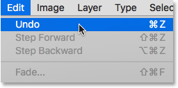
*Going to Edit > Undo.*

To **cancel the transformation** entirely and exit out of Free Transform, which will reset your object back to its original shape and size, click the **Cancel** button in the Options Bar, or press the **Esc** key on your keyboard:

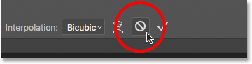
*Clicking the Cancel button in the Options Bar.*

As you're following along with the rest of this tutorial, you may find it helpful to reset your shape from time to time by canceling out of Free Transform. You can then reselect Free Transform and start over again by either going up to the **Edit** menu and choosing **Free Transform** or by pressing **Ctrl+T** (Win) / **Command+T** (Mac) on your keyboard.

### Skew

Along with moving, scaling and rotating an item, Free Transform also gives us quick and easy access to Photoshop's other transformation commands (Skew, Distort, Perspective, and Warp). To select any of them, all we need to do is **right-click** (Win) / **Control-click** (Mac) anywhere inside the document and then choose the one we want from the menu. Let's start with **Skew**. I'll select it from the list, but you can also temporarily switch to Skew at any time without actually selecting it from the menu by pressing and holding **Shift+Ctrl** (Win) / **Shift+Command** (Mac) on your keyboard. As long as you hold the keys down, you'll be in Skew mode. Release the keys to exit out of Skew mode:

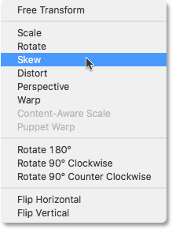
*Selecting Skew from the list of transform commands.*

With Skew selected, if you hover your mouse cursor over any of the side handles (top, bottom, left, or right), you'll see your cursor change into a **white arrowhead** with a **double-sided arrow**. Clicking on the top or bottom handle and dragging left or right will skew the object horizontally. Press and hold **Alt** (Win) / **Option** (Mac) while dragging to skew the object from its center:

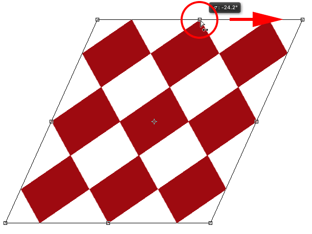
*Skewing the object horizontally by dragging the top handle towards the right.*

Clicking the left or right handle and dragging up or down will skew the object vertically. Again, pressing and holding **Alt** (Win) / **Option** (Mac) as you drag will skew it from its center:

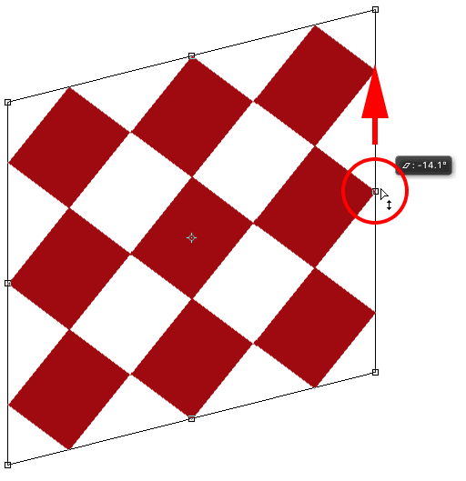
*Skewing the object vertically by dragging the right handle upwards.*

If you click and drag a corner handle while in Skew mode, you'll scale the two sides that meet at that corner. Pressing and holding **Alt** (Win) / **Option** (Mac) while dragging the corner will move the diagonally-opposite corner in the opposite direction at the same time:

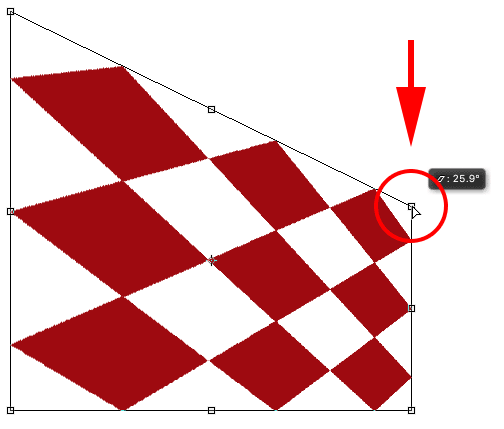
*Dragging a corner handle with Skew selected scales the two sides that are connected to it.*

You can also enter specific values, in degrees, into the **Horizontal** (**H**) and **Vertical** (**V**) skew fields in the Options Bar. Values can be either positive or negative depending on your skew direction:

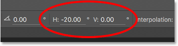
*The Horizontal (H) and Vertical (V) skew fields in the Options Bar.*

### Distort

Next, let's look at **Distort**. To select it, I'll **right-click** (Win) / **Control-click** (Mac) inside my document and choose Distort from the menu. You can also switch temporarily to Distort mode without selecting it from the menu by pressing and holding the **Ctrl** (Win) / **Command** (Mac) key on your keyboard. As long as you keep the key held down, you'll be in Distort mode. Release the key to exit out of Distort mode:

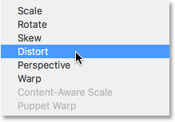
*Selecting the Distort command from the menu.*

In Distort mode, you have complete freedom of movement. Simply click on any handle and drag it around in any direction to reshape the object. In doing so, you'll lose the original aspect ratio, but of course, that's why it's called Distort. Pressing and holding **Alt** (Win) / **Option** (Mac) as you drag will distort the object from its center:

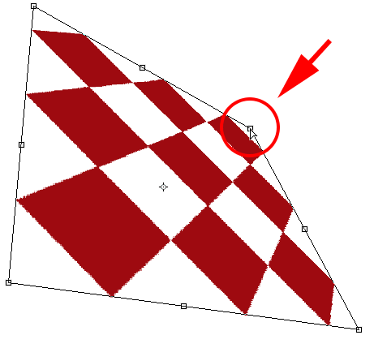
*In Distort mode, you're free to drag any handle in any direction.*

Dragging a side handle (top, bottom, left, or right) while in Distort mode gives you a result similar to Skew in that it skews the object in the direction you're dragging. But since you have complete freedom of movement while in Distort mode, you can also scale the object at the same time. Here, I'm dragging the top handle to both skew the object towards the right and lower its height:

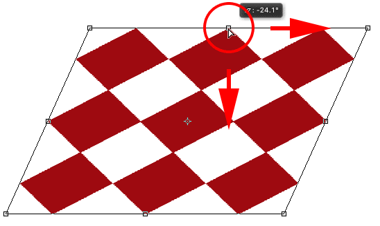
*Dragging the top handle to skew and scale the object while in Distort mode.*

### Perspective

Next, we'll look at the **Perspective** command. I'll once again **right-click** (Win) / **Control-click** (Mac) inside my document, then I'll choose Perspective from the menu. To temporarily switch to Perspective mode from your keyboard, press and hold **Shift+Ctrl+Alt** (Win) / **Shift+Command+Option** (Mac):

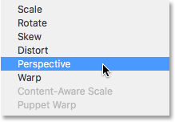
*Choosing Perspective from the menu.*

In Perspective mode, dragging a corner handle horizontally or vertically causes the handle in the opposite corner to move along with it but in the opposite direction, creating a pseudo-3D effect. Here, I'm dragging the top left corner inward towards the right. As I drag, the top right corner moves inward towards the left:

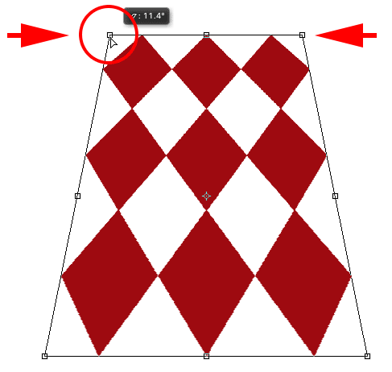
*Dragging a corner handle inward causes the opposite corner to also move inward.*

Then, while still in Perspective mode, I'll drag the bottom left corner outward towards the left, which moves the bottom right corner outward towards the right. You can do the same thing vertically by dragging the corner handles up or down:

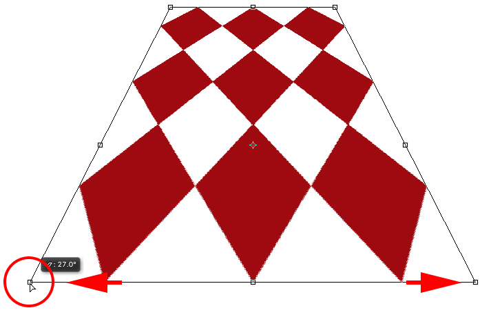
*Dragging a corner handle outward causes the opposite corner to also move outward.*

### Warp

So far, we've learned that we can move, scale and rotate an object using Free Transform's default behavior, and we've seen how to easily switch between other commands like Skew, Distort and Perspective when we need to perform other types of transformations. But by far, the mode that gives us the most power and control when it comes to reshaping an object is **Warp**. In fact, Warp is really more like an advanced version of Free Transform, but it's just as easy to use. Let's see how it works.

There's a couple of different ways to select Warp. One is by **right-click**ing (Win) / **Control-clicking** (Mac) inside your document and choosing **Warp** from the menu, just like we choose any of the other transform modes:

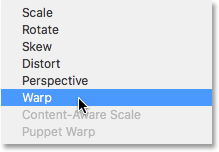
*Choosing Warp from the transform mode menu.*

The other is by clicking the **Warp button** in the Options Bar. This button serves as a toggle between Free Transform mode and Warp mode, so clicking on it again will return you to Free Transform:

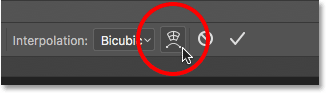
*Clicking the Warp / Free Transform toggle button in the Options Bar.*

With Warp mode active, the first thing you'll notice is that the standard Free Transform box around the object has been replaced by a more detailed **3x3 grid**. If you look closely, you'll notice that we're now missing the handles that were on the top, bottom, left, and right of the Free Transform box, but we still have handles in each of the four corners:

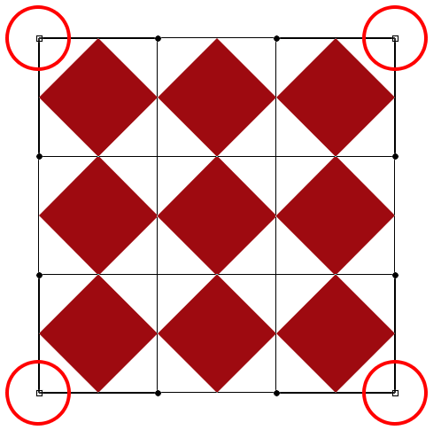
*Only the corner handles remain when in Warp mode.*

To reshape, or "warp", the object, start by clicking and dragging any of the corner handles. Just as in Distort mode, Warp gives us complete freedom of movement, letting us drag the handles around freely. As you drag the handles, you'll notice that the grid itself reshapes along with the object inside it:

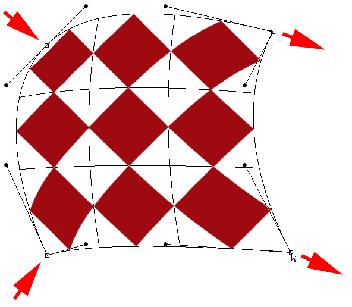
*Dragging the corner handles reshapes both the object and the grid.*

See those lines with the little round dots on the end that extend out from the corners? Those are **direction handles**, and each corner has two of them. You can further reshape the object (and the grid) by clicking on the round ends of the direction handles and dragging them around. This will add more or less curvature depending on which direction you drag. To adjust the length of a direction handle (and the length of its curve), drag it inward or outward from its corner:

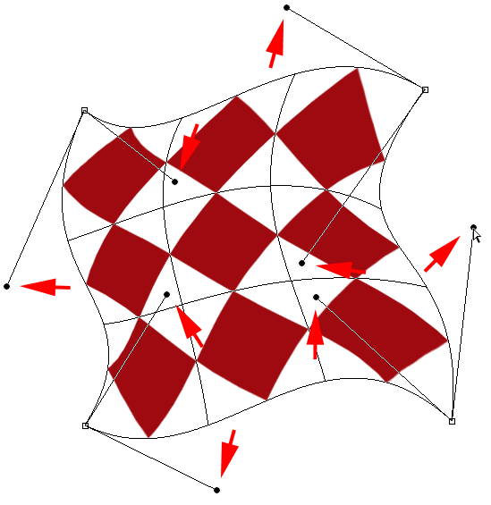
*Dragging the direction handles to add some crazy curvature to the shape.*

If the corner handles and the direction handles aren't enough, you can fine-tune things even further by clicking and dragging anywhere inside the grid to reshape it. Here, I've clicked on the diamond in the center of my shape and dragged it towards the upper right, which added more roundness to that middle section:

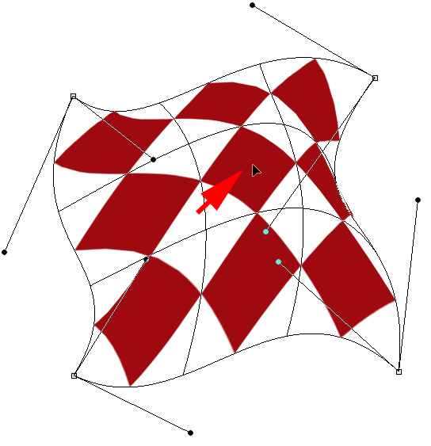
*You can click anywhere inside the grid and move it around.*

### Warp Styles

Another feature of Photoshop's Warp mode is that it includes several warp style presets, all of which are available from the **Warp Style** menu in the Options Bar. A warp style instantly transforms the item into a preset shape. They're most often applied to text but they can be applied to any kind of object or selection.

By default, Warp Style is set to **Custom**, which is what allows us to freely reshape the grid:

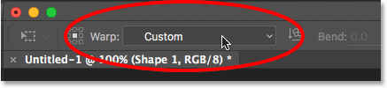
*The Warp Style option.*

Click on the word "Custom" to open a menu with various warp styles to choose from, then select the one you want from the list. I'll choose the first one, **Arc**:

*Choosing Arc from the Warp Styles menu.*

This instantly transforms my object into an arc shape:

*The Arc warp style.*

Notice that we now have only one handle. With the Arc style selected, the handle appears at the top center of the grid, but it may appear in other locations depending on which warp style you've selected. This single handle controls the amount of **bend** in the shape. I'll click on the handle and drag it downward, which reduces the amount of bend. Dragging the handle upward would increase it:

*With a warp style selected, drag the handle to adjust the amount of bend.*

You can also enter a specific bend value, in percent, into the **Bend** field in the Options Bar:

*The Bend option for the selected warp style.*

To swap the orientation of the warp style from horizontal to vertical and vice versa, click the **Warp Style Orientation** button directly to the left of the Bend field:

*The Warp Style Orientation button.*

You can control the amount of horizontal and vertical distortion independently of each other by entering values, in percent, into the **H** (horizontal distortion) and **V** (vertical distortion) fields in the Options Bar:

*The H (horizontal) and V (vertical) distortion options.*

To gain more control after applying a warp style, change the **Warp Style** option back to **Custom**:

*Switching the Warp Style option back to Custom.*

This brings back the four corner handles, as well as their direction handles, allowing you to fully customize the look of your chosen style:

*The corner and direction handles re-appear after changing the Warp Style from Arc back to Custom.*

### Other Transformation Options

In addition to Skew, Distort, Perspective, and Warp, Photoshop's Free Transform command also gives us access to more standard transformation options, like **Rotate 180°** and **Rotate 90° Clockwise** or **Counter Clockwise**, as well as **Flip Horizontal** and **Flip Vertical**. You'll find these options at the bottom of the menu when you **right-click** (Win) / **Control-click** (Mac) inside the document:

*The Rotate and Flip transformation options.*

### Commit Or Cancel The Transformation

When you're done transforming the object and you're ready to commit your changes, you can do so either by clicking the **checkmark** in the Options Bar or by pressing **Enter** (Win) / **Return** (Mac) on your keyboard. If you decide you don't want to keep your changes, click the **Cancel** button in the Options Bar (directly to the left of the checkmark) or press **Esc** on your keyboard. This will exit you out of Free Transform and return the object to its original shape and size:

*The Commit (checkmark) and Cancel buttons in the Options Bar.*