# Photoshop’s Image Size Command – Features and Tips

> Source: [https://www.photoshopessentials.com/basics/photoshops-image-size-command-features-and-tips/](https://www.photoshopessentials.com/basics/photoshops-image-size-command-features-and-tips/)
> Downloaded and converted to Markdown.

Learn all about Photoshop CC's powerful Image Size command and how to get the most from its great image resizing features!

In this tutorial, the second in my series on resizing images in Photoshop, we'll take a quick tour of the features you'll find in Photoshop's powerful **Image Size dialog box**, redesigned in Photoshop CC. The Image Size dialog box lets us not only view the current size of the image but also change it. Whether you need to enlarge the image for print or downsize it for the web, it's all done with this one Image Size command.

We'll start by looking at the best new feature in the Image Size dialog box, the preview window, and how to get the most from it. From there, we'll look at some preset image sizes you can choose from, and how to enter your own width, height and resolution values. We'll take our first look at the difference between *resizing* and *resampling* an image. And we'll finish off by learning how to make sure that any layer effects you've added to the document are scaled along with the image!

If you're new to the world of digital images, be sure to check out the first tutorial in this series where you'll learn all about [pixels, image size and resolution](/basics/pixels-image-size-resolution-photoshop/), the three key ingredients to getting great results when resizing your photos! To follow along with this tutorial, you can open any image in Photoshop. I'll use [this image](https://prf.hn/l/DRqoypb) that I downloaded from Adobe Stock:

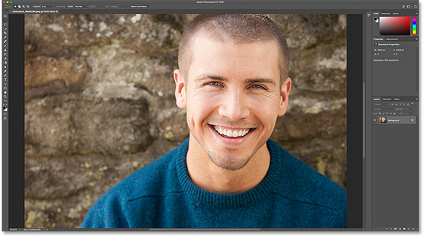
*The original image. Photo credit: Adobe Stock.*

This is lesson 2 is my [Resizing Images in Photoshop](/basics/how-to-resize-images-in-photoshop-complete-guide/) series.

Let's get started!

## Where to find the Image Size command

Photoshop's Image Size dialog box is Command Central for resizing images. To open it, go up to the **Image** menu in the Menu Bar and choose **Image Size**. You can also open it from your keyboard by pressing **Ctrl+Alt+I** (Win) / **Command+Option+I** (Mac):

*Going to Image > Image Size.*

In [Photoshop CC](https://prf.hn/l/dlXjD2w), the Image Size dialog box features a preview window on the left, and options for viewing and changing the size of the image on the right:

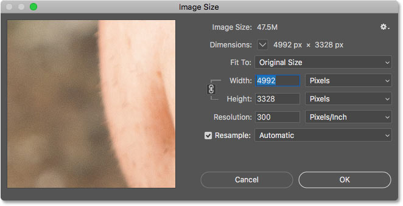
*The Image Size dialog box in Photoshop CC.*

## The new image preview window

Adobe redesigned the Image Size dialog box in Photoshop CC, and the biggest change is the new **preview window**. No matter how far you've zoomed in or out from your image in the document, the preview window lets you preview your image at the **100% view size**. This means that each pixel in your image takes up exactly one pixel on your screen. And that's important because it means you're getting the most accurate view of your image as you're resizing it.

### Scrolling the image inside the preview window

When you first open the Image Size dialog box, the preview window may be centered on an area that isn't very useful. In my case, I'm seeing the side of the man's face. But you can scroll to any area you need just by clicking and dragging *inside* the window:

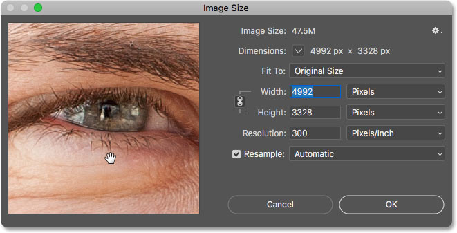
*Click and drag inside the preview window to move the image around.*

### Jumping the preview to a specific area

Along with scrolling, you can also jump to a specific part of the image by clicking on it. If you move your mouse cursor into the image, you'll see the cursor change into a small square. The square represents the preview window. Click on a spot to preview it, and that spot will instantly be centered in the window:

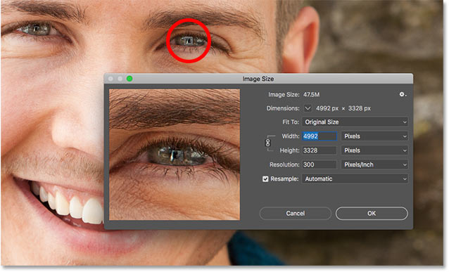
*Click anywhere on the image to preview that spot.*

### Changing the zoom level of the preview window

I mentioned that the preview window lets you preview your image at the all-important 100% view size. But you can also change the zoom level if needed. Moving your mouse cursor inside the preview window will display zoom options along the bottom. The current zoom level is shown in the middle. Click the **plus button** (**+**) to zoom in or the **minus button** (**-**) to zoom out.

Along with clicking the buttons, if you press and hold the **Ctrl** (Win) / **Command** (Mac) key on your keyboard and click in the preview window, you'll zoom in. To zoom out, hold the **Alt** (Win) / **Option** (Mac) key and click. In most cases, though, you'll want to leave the zoom level at 100%:

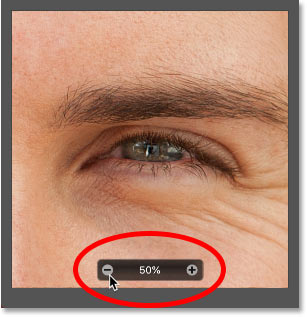
*Changing the zoom level of the image inside the preview window.*

### Getting a larger preview

Finally, to get an even bigger preview of your image, you can make the Image Size dialog box itself larger. In fact, you can resize it so that it takes up nearly the full size of your screen. To resize the dialog box, click and drag any of the corners outward:

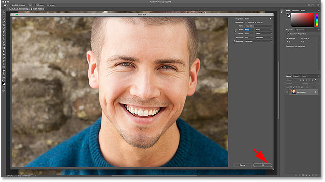
*The preview window resizes as you resize the dialog box.*

## Viewing the current image size

To the right of the preview window is where you'll find the various options for both viewing and changing the size of the image. The current image size, both in megabytes (M) and in pixels, is shown at the top.

### The current image size, in megabytes (M)

The first number, next to the words **Image Size**, is the amount of space the image is taking up in your computer's memory (RAM). In my case, it's 47.5M. This number has nothing to do with the number of layers in the document, or how large the file size will be if you were to save the image as a JPG, PNG, or other file type. It's simply the size of the image in memory, and it depends entirely on the number of pixels in your image. As you change the number of pixels, adding or removing them, this number will change:

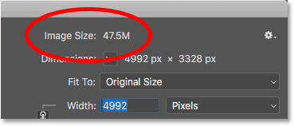
*The current image size, in megabytes.*

### The current image size, in pixels

Below that, next to the word **Dimensions**, is the current image size shown in pixels. In my case, my image has a width of 4992 pixels and a height of 3328 pixels. We can't change the number of pixels here. This is just showing us the current size. And again, as you make changes to the size, the changes will be updated here:

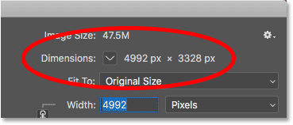
*The current image size, in pixels.*

#### Changing the measurement type

Along with pixels, you can view the current dimensions using other measurement types as well. Click the arrow next to the word "Dimensions" to choose a different type from the list, like inches or percent. In most cases though, the most useful way to display the dimensions is in pixels:

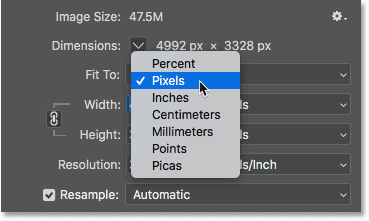
*The current dimensions can be shown in various measurement types.*

## The "Fit To" image size presets

Along with letting us manually change the size of the image, as we'll be learning how to do, the Image Size dialog box also gives us preset sizes to choose from. You'll find them in the **Fit To** option directly below the current image size:

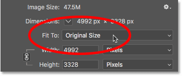
*The "Fit To" option.*

Clicking the default setting (Original Size) opens the list of presets. They include specific measurement types, like pixels or inches, as well as preset resolutions. Some are designed for print, while others are for the web or general screen viewing:

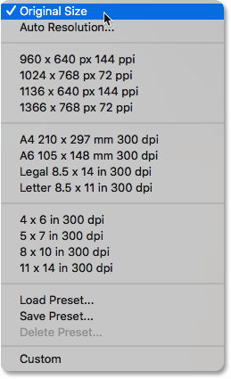
*The preset image sizes.*

### Fitting the image *within* a certain size

It's tempting to think of these presets as a quick and easy way to resize your image. But note that this option is called *Fit* To, not *Resize* To, and there's an important difference. Choosing one of these presets will resize your image so that it fits *within* the chosen size. But it may not fit exactly right. It all depends on the aspect ratio of your image.

For example, let's say I want to print my image as a 4 x 6, so I'll choose the **4 x 6 in 300 dpi** preset:

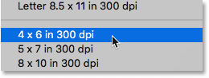
*Choosing the 4 x 6 preset.*

This *should* set the new width of my image to 4 inches and the height to 6 inches. But right away, we have a problem. This preset assumes that my image is in *portrait orientation*, where the height is larger than the width. But it's actually in *landscape orientation*, with the width larger than the height. And because of that, the aspect ratio and the preset size don't match.

So while the new Width value is set correctly at 4 inches, the Height is set to just 2.667 inches. In other words, the image will still fit *within* the new 4 x 6 size, but because of its aspect ratio, it won't fill the entire height:

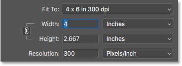
*The problem when the preset size doesn't match the aspect ratio of the image.*

### Swapping the orientation

In this case, there's an easy fix. Since the only problem is the orientation of my image, I can swap the width and height of the preset by manually changing the Width value from 4 inches to 6 inches. This automatically sets the Height to 4 inches, and now my image will fit correctly:

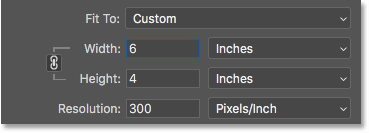
*Depending on the aspect ratio, swapping the orientation may fix the problem.*

### What if the preset size and the aspect ratio don't match?

The real problem is when the aspect ratio and the preset size don't match at all. For example, if I try to resize my image to print as an 8 x 10 by choosing the **8 x 10 in 300 dpi** preset:

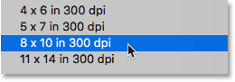
*Choosing the 8 x 10 preset.*

Then no matter what I do, I can't get the image to match the new size. If I leave the Width set to 8 inches, the Height is wrong:

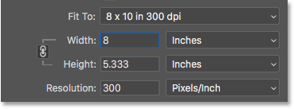
*At a width of 8 inches, the height doesn't match the preset.*

And if I try swapping the orientation by manually changing the Width to 10 inches, the Height is *still* wrong:

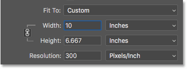
*Swapping the orientation doesn't fix the problem.*

There's simply no way to resize an image with a 4 x 6 aspect ratio as an 8 x 10. The only way to do it, at least without stretching and distorting the image, would be to crop the image to the new aspect ratio first *before* resizing it. I'll be covering how to do that in the next tutorial when we learn how to resize images for print.

## How to reset the Image Size settings

So we've seen that the Fit To presets are not all that useful. But before we look at the main way to resize images, let's quickly learn how to reset the values.

If you've made changes within the Image Size dialog box (and haven't yet committed them by clicking the OK button), you can restore the original image size by pressing and holding the **Alt** (Win) / **Option** (Mac) key on your keyboard. This changes the Cancel button at the bottom to a **Reset** button. Click the Reset button to restore the original settings:

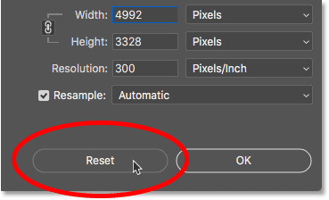
*Hold Alt (Win) / Option (Mac) to change Cancel to Reset.*

## How to manually change the image size

The main way to resize images in Photoshop is by entering your own custom values into the **Width**, **Height** and **Resolution** fields. And notice that there's also a fourth option directly below Resolution called **Resample**. That fourth option is there because there are really *two* things we can do here; we can *resize* the image, or we can *resample* it:

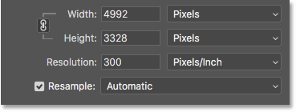
*The Width, Height, Resolution and Resample options.*

### What's the difference between *resizing* and *resampling*?

*Resizing* an image means that we're **not changing the number of pixels**. All we're doing is changing the size that the image will **print**. Since the number of pixels doesn't change, resizing has no effect on the file size of the image or on how the image looks on screen. It only affects the print size.

*Resampling* an image **changes the number of pixels**. We can add more pixels, known as *upsampling*, or we can remove pixels, known as *downsampling*. Upsampling is used to enlarge an image, usually when we need to print a photo larger than what its current pixel dimensions will allow. And downsampling is most often used to reduce the overall file size of the image when we want to email it or upload it to the web.

### Resizing an image

I'll be covering resizing and resampling in more detail in the next tutorial. But in short, if you just want to resize the image to change its print size, turn the **Resample** option off:

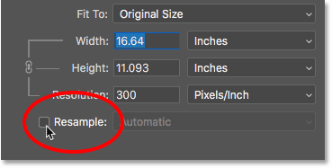
*Turning Resample off to resize the image.*

Then, enter the new size into the **Width** and **Height** fields. Both fields are linked together, so changing one will automatically change the other. Remember, you can only choose a size that matches the aspect ratio. So if your image has a 4 x 6 aspect ratio, trying to print it as a 5 x 7 or an 8 x 10 won't work. I'll show you how to get around that problem in the next tutorial.

### What is image resolution?

Notice that with Resample turned off, the **Resolution** field is also linked to the Width and Height fields. So as you change the width or height, the resolution changes with it. And if you change the resolution, the width and height change. In my case, by lowering the print size to 6 inches x 4 inches, the resolution has increased from 300 pixels/inch all the way up to 832 pixels/inch:

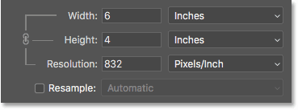
*Turning Resample off to resize the image.*

So what *is* resolution? *Resolution* controls the number of pixels in the image that will be packed into every inch of paper, both vertically and horizontally. That's why resolution is measured in pixels per inch, or "ppi". Since we're not changing the total number of pixels in the image, we change the print size by changing how tightly the pixels are crammed together on the page. Higher resolution values result in smaller print sizes, and lower resolutions create larger print sizes. I covered the basics of [image size and resolution](/basics/pixels-image-size-resolution-photoshop/) in the previous tutorial, and we'll be learning more about it, including how much resolution you need for high quality prints, in the next one.

### Resampling an image

To resample an image and change the number of pixels, turn the **Resample** option on. You can then upsample or downsample the image as needed:

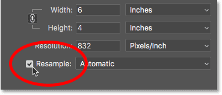
*Turning Resample on.*

#### Upsampling

With Resample turned on, the Width and Height are no longer linked to the Resolution. So if I double the Width value, from 6 inches up to 12 inches, Photoshop automatically doubles the Height, from 4 inches to 8 inches, to keep the aspect ratio from changing. But while the Width and Height have both doubled, the Resolution value remains the same:

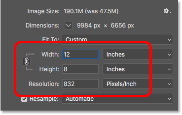
*Changing the width and height no longer changes the resolution.*

What *has* changed, though, is the actual number of pixels in the image. If we look at the Dimensions at the top, we see that because Resample was turned on, the width, in pixels, has now doubled, from 4992 pixels up to 9984 pixels. And the height has also doubled, from 3328 pixels to 6656 pixels. And, since we now have *four times* the number of pixels in the image (twice the width and twice the height), the size of the image in memory has grown four times as large, from 47.5M all the way up to roughly 190M:

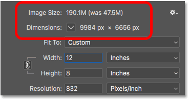
*Upsampling the image increases the image size.*

#### Downsampling

If I lower the resolution, from 832 pixels/inch down to something more reasonable, like 300 pixels/inch, notice that the width and height, in inches, haven't changed. But, again because Resample was turned on, both the pixel dimensions and the size of the image in memory have decreased:

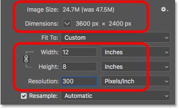
*Downsampling the image decreases the image size.*

### The Interpolation method

To the right of the Resample option is the **Interpolation** option. *Interpolation* refers to the method Photoshop uses to redraw the image when you add or remove pixels, and by default, it's set to **Automatic**. Since it only applies to resampling, this option is grayed out when Resample is turned off:

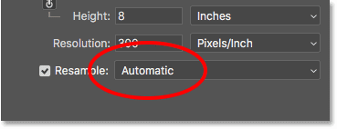
*The Interpolation option.*

If you click on the option, you'll open a list of interpolation methods to choose from. Some are best for upsampling, and some for downsampling. These can have a big impact on image quality, so in most cases, leaving it set to Automatic is the best choice. The only time I would change it is if you're using Photoshop CC 2018 (or later) and you need to enlarge the image. In that case, I would change the interpolation method to **Preserve Details 2.0,** which I cover in more detail in a [separate tutorial](/basics/upscale-images-photoshop-cc-2018/):

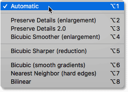
*The interpolation methods.*

## How to scale your layer effects

And finally, if your document uses **layer effects** (drop shadows, strokes, outer glows, etc.), you'll most likely want the effects to scale along with the image. So before you click OK to accept the new image size, click the **gear icon** in the upper right of the Image Size dialog box and make sure that **Scale Styles** is selected:

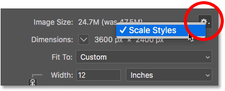
*Turn on Scale Styles to resize layer effects with the image.*

## Accepting or canceling the new image size

When you're ready to resize the image, click the **OK** button to accept your settings and close the Image Size dialog box. Or to cancel your settings without making any chances, click the **Cancel** button instead:

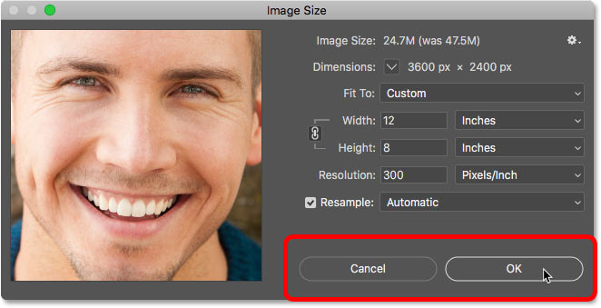
*Click OK to resize the image, or Cancel to skip any changes.*

And there we have it! That's a quick tour of the Image Size dialog box in Photoshop! In the next lesson, we'll learn how to [resize an image for print](/basics/how-to-resize-images-for-print-with-photoshop/)!

You can jump to any of the other lessons in this [Resizing Images in Photoshop](/basics/how-to-resize-images-in-photoshop-complete-guide/) chapter. Or visit our [Photoshop Basics](/basics/) section for more topics!