# Pixels, Image Size and Image Resolution in Photoshop

> Source: [https://www.photoshopessentials.com/basics/pixels-image-size-resolution-photoshop/](https://www.photoshopessentials.com/basics/pixels-image-size-resolution-photoshop/)
> Downloaded and converted to Markdown.

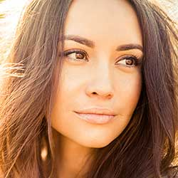

Want the best results when resizing images in Photoshop? Start by learning all about pixels, image size and resolution!

In this tutorial, I'll introduce you to three important topics that are essential for working with digital images in Photoshop, and these are **pixels**, **image size** and **image resolution**. Having a solid understanding of how pixels, image size and resolution are related to each other is essential for getting the best results when resizing images, both for print and for the web.

We'll start by learning about pixels, the basic building blocks of all digital images. Then we'll learn how pixels are related to image size. And we'll finish off by learning how image size and image resolution work together to control the print size of your image! We'll even debunk a popular belief that resolution has anything to do with the file size of your image.

We'll be learning all about image resizing in [later lessons](/basics/how-to-resize-images-in-photoshop-complete-guide/ "View the complete Image Resizing guide") in this chapter. For now, let's start at the beginning by learning about pixels, image size and resolution!

## What are pixels?

The term *pixel* is short for "picture element", and pixels are the tiny building blocks that make up all digital images. Much like how a painting is made from individual brush strokes, a digital image is made from individual pixels.

In Photoshop, when viewing an image at a normal zoom level (100% or less), the pixels are usually too small to notice. Instead, we see what looks like a continuous image, with light, shadows, colors and textures all blending together to create a scene that looks much like it would in the real world ([image](https://prf.hn/l/dlgEoZq) from Adobe Stock):

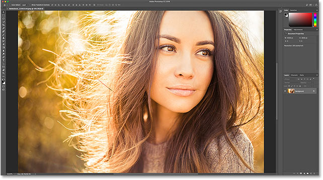
*At normal viewing distances, pixels blend together to create the photo. Image credit: Adobe Stock.*

### A closer look at pixels

But like any good magic trick, what we're seeing is really an illusion. And to break the illusion, we just need to look closer. To view the individual pixels in an image, all we need to do is zoom in. I'll select the [Zoom Tool](/basics/photoshop-zoom/ "View tutorial") from the Toolbar:

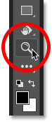
*Selecting the Zoom Tool.*

Then, I'll click a few times on one of the woman's eyes to zoom in on it. Each time I click, I zoom in closer. And if I zoom in close enough, we start seeing that what looked like a continuous image is really a bunch of tiny squares. These squares are the pixels:

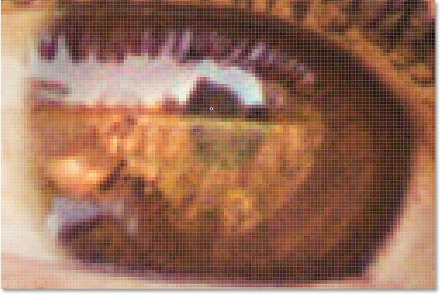
*Zooming in closer reveals the individual pixels.*

And if I zoom in even closer, we see that each pixel displays a single color. The entire image is really just a grid of solid-colored squares. When viewed from far enough away, our eyes blend the colors together to create an image with lots of detail. But up close, it's pixels that create our digital world:

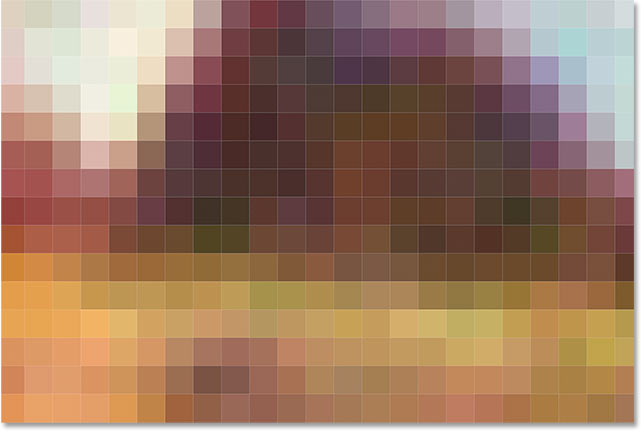
*A close-up view of image pixels, each displaying a single color.*

#### The Pixel Grid

Notice that once you zoom in close enough (usually beyond 500%), you start seeing a light gray outline around each pixel. This is Photoshop's **Pixel Grid**, and it's there just to make it easier to see the individual pixels. If you find the Pixel Grid distracting, you can turn it off by going up to the **View** menu in the Menu Bar, choosing **Show**, and then choosing **Pixel Grid**. To turn it back on, just select it again:

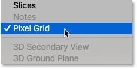
*Going to View > Show > Pixel Grid.*

### Zooming back out to view the image

To zoom out from the pixels and view the entire image, go up to the **View** menu and choose **Fit on Screen**:

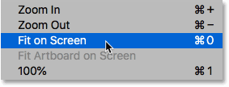
*Going to View > Fit on Screen.*

And now that we're zoomed out, the individual pixels are once again too small to notice, and we're back to seeing the illusion of a detailed photo:

*At normal viewing distances, pixels blend together to create the image.*

[See our complete guide to navigating images in Photoshop](/basics/photoshop-image-navigation/ "View tutorials")

## What is image size?

So now that we know that pixels are the tiny squares of color that make up a digital image, let's look at a related topic, **image size**. *Image size* refers to the width and height of an image, in pixels. It also refers to the total number of pixels in the image, but it's really the width and height we need to care about.

### The Image Size dialog box

The best place to find the image size information is in Photoshop's Image Size dialog box. To open it, go up to the **Image** menu and choose **Image Size**:

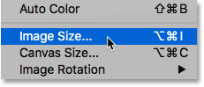
*Going to Image > Image Size.*

In [Photoshop CC](https://prf.hn/l/dlXjD2w), the Image Size dialog box shows a preview area on the left, and details about the image size on the right. I'll be covering the Image Size dialog box in more detail in the [next tutorial](/basics/photoshops-image-size-command-features-and-tips/ "View tutorial"). For now, we'll just look at the information we need:

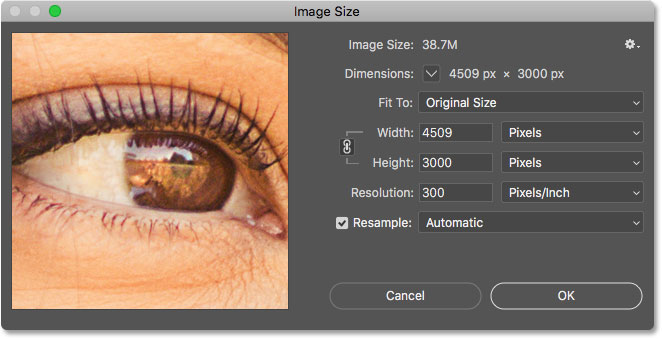
*The Image Size dialog box in Photoshop CC.*

### The pixel dimensions

The width and height of an image, in pixels, are known as its *pixel dimensions*, and in Photoshop CC, we can view them next to the word **Dimensions** near the top of the dialog box. Here we see that my image has a width of 4509 pixels (px) and a height of 3000 pixels:

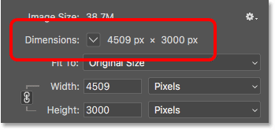
*Photoshop CC includes a new Dimensions option at the top.*

If the dimensions are shown in a measurement type other than pixels, like inches or percent, click the small arrow next to the word "Dimensions" and choose **Pixels** from the list:

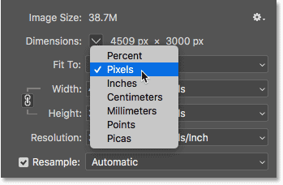
*The dimensions can be displayed in different measurement types.*

This tells us that my image contains 4509 pixels from left to right, and 3000 pixels from top to bottom:

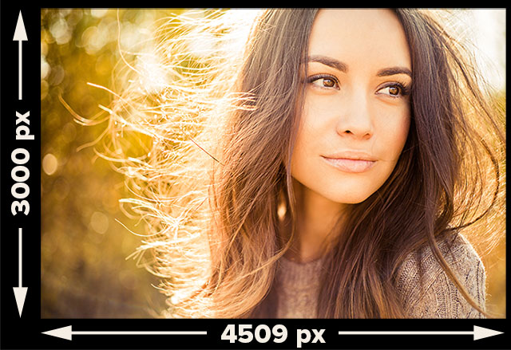
*The pixel dimensions of the image.*

#### Finding the total number of pixels

To figure out the total number of pixels in the image, we just need to multiply the width and height values together. So in this case, 4509 x 3000 = 13,527,000, or roughly 13.5 million pixels. You don't really need to know the total number of pixels. But as you gain more experience with resizing images, you'll find that knowing the total number of pixels beforehand will give you a good idea of how large you can print the image, as we'll see next when we look at image resolution.

## What is image resolution?

So if *pixels* are the tiny squares of color that make up all digital images, and *image size* is the number of pixels in the image from left to right (the width) and from top to bottom (the height), what is *image resolution*? **Image resolution** controls how large or small the photo will *print* based on its current image size.

It's important to understand up front that image resolution only affects the size of the *printed* version of the image. It has no effect at all when viewing the image on screen. I cover this topic in more detail in my [72 ppi web resolution myth](/essentials/the-72-ppi-web-resolution-myth/ "View tutorial") tutorial, and we'll look at it again at the end of this tutorial.

### The Width, Height and Resolution connection

In the Image Size dialog box, if you look below the word "Dimensions", you'll find the **Width**, **Height** and **Resolution** fields. This is where we can not only view the current settings but also change them:

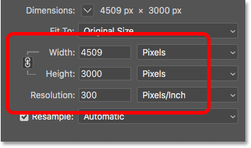
*The Width, Height and Resolution options.*

### The Resample option

Before we go any further, if you look below the Resolution value, you'll find another important option called **Resample**. And by default, Resample is turned on. We'll be learning all about the Resample option when we look at how to resize images. But in short, Resample allows us to change the number of pixels in the image:

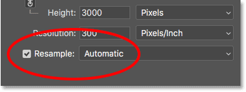
*The Resample option.*

Why would you want to change the number of pixels? If the current image size is too small to print your photo at the size you need, you can use Resample to add more pixels, known as *upsampling*. Or, if you want to email your photo to friends or upload it to the web, and the current size is too large, Resample would let you reduce the number of pixels, known as *downsampling*.

Again, we'll be learning all about upsampling and downsampling when we look at how to resize images. For now, to see how resolution affects the print size of the image, uncheck Resample to turn it off:

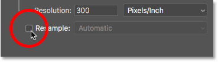
*Unchecking the Resample option.*

### Changing the print size, not the image size

As soon as you turn Resample off, you'll notice that the measurement type for the Width and Height values changes. Instead of viewing the width and height in pixels as I was a moment ago, I'm now seeing them in **inches**. And instead of telling me that my image is 4509 pixels wide and 3000 pixels tall, I'm now being told that it's 15.03 inches wide and 10 inches tall:

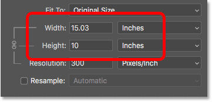
*The Width and Height measurements are now shown in inches instead of pixels.*

In fact, if you click on the measurement type box for either the Width or the Height, you'll notice that Pixels is now grayed out and unavailable. That's because, with Resample turned off, we're not able to change the physical number of pixels in the image. All we can do is change the size that the image will *print*, and print size is usually measured in inches (or centimeters depending on where you are in the world):

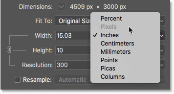
*Turning Resample off prevents us from adding or removing pixels.*

### How does image resolution work?

Resolution controls the print size of an image by setting the number of pixels that will be squeezed into every inch of paper, both vertically and horizontally. That's why the resolution value is measured in **pixels per inch**, or "**ppi**". Since the image has a limited number of pixels, the more we cram those pixels together on the paper, the smaller the image will print.

For example, my resolution value is currently set to 300 pixels/inch. This means that when I go to print the image, 300 of its pixels from the width, and 300 pixels from the height, will be squeezed into every square inch of paper. Now 300 pixels may not sound like much. But remember, it's 300 from both the width *and* the height. In other words, it's 300 *times* 300, for a total of 90,000 pixels per square inch:

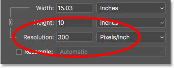
*The current resolution, measured in pixels/inch.*

### How to determine the print size

To figure out the print size of the image, all we need to do is divide its current width and height, in pixels, by the resolution value. If we look again at the Dimensions section at the top, we see that the width of my image is still 4509 pixels:

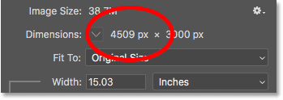
*The current width, in pixels.*

If we divide 4509 by the current resolution value of 300, we get 15.03. In other words, the width of my image, when printed, will be 15.03 inches, the exact value shown in the Width field:

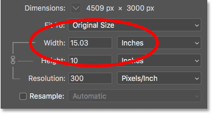
*4509 pixels ÷ 300 pixels/inch = 15.03 inches.*

And back in the Dimensions section, we see that the height of my image is still 3000 px:

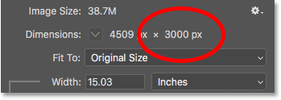
*The current height, in pixels.*

If we divide 3000 by the current resolution of 300, we get 10. Which means that the height of the image, when printed, will be 10 inches, just like it shows in the Height field:

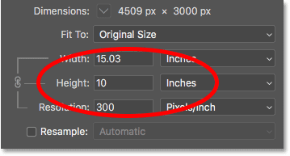
*3000 pixels ÷ 300 pixels/inch = 10 inches.*

### Changing the resolution changes the print size

If we change the resolution value, the number of pixels in the image doesn't change, but the print size does. Notice that if I lower the resolution from 300 pixels/inch down to 150 pixels/inch, the pixel dimensions remain the same at 4509 px x 3000 px. But the width and height both increase. Since I'll only be squeezing half as many pixels per inch onto the paper, both horizontally and vertically, the width and height have both doubled:

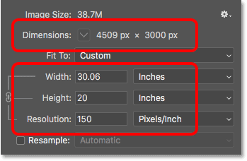
*Lowering the resolution increases the print size.*

### Changing the print size changes the resolution

And since all we're changing is the print size, then changing the width or height will change the resolution. In fact, when the Resample option that we looked at earlier is turned off, all three values (Width, Height and Resolution) are linked together. Changing one automatically changes the others.

If I lower my Width value down to 10 inches, then to keep the aspect ratio of the image the same, Photoshop automatically changes the Height value to 6.653 inches. And to fit the entire image into the new, smaller print size, the pixels will need to be packed in tighter, so the Resolution value has increased to 450.9 pixels/inch:

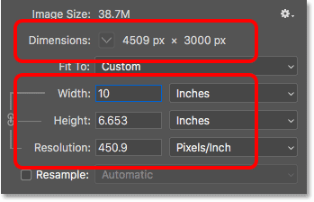
*Changing the width and height changes the resolution.*

### Does image resolution affect file size?

A common misconception with image resolution is that it somehow affects the image's file size. Many people believe that, before you email a photo or upload it to the web, you need to lower its resolution to make the file size smaller. This is simply not true. Since changing the resolution does not change the number of pixels in the image, it has no effect at all on the file size.

If you look next to the words "Image Size" at the top of the dialog box, you'll see a number, usually shown in megabytes (M). In my case, it's 38.7M. This number represents the size of the image in your computer's memory. When you open an image in Photoshop, the image is copied from your hard drive, uncompressed from whatever file format it was saved in, and then placed into memory (RAM) so you can work on it more quickly. The number shown in the Image Size dialog box is the actual, uncompressed size of the image:

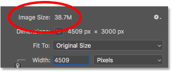
*The image size, in megabytes, is shown at the top.*

#### Lower resolution vs file size

Proving that image resolution has no effect on the file size is easy. Just keep an eye on the size while you change the resolution. As long as the Resample option is turned off so you're not changing the number of pixels in the image, then no matter what you choose for the resolution value, the file size at the top will always remain the same.

Here, I've lowered the resolution from 300 pixels/inch all the way down to 30 pixels/inch. With so few pixels being crammed into an inch of paper, the print size has increased to a whopping 150.3 inches x 100 inches. But even with this very low resolution value, the size of the image in memory remains unchanged at 38.7M:

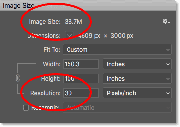
*Lowering the print resolution has no effect on the file size.*

#### Higher resolution vs file size

And here, I've increased the resolution all the way up to 3000 pixels/inch. This reduces the print size down to just 1.503 inches x 1 inch, but again has no effect on the file size, which is still 38.7M. The only way to reduce the file size of an image is to either reduce the number of pixels in the image (using the Resample option), or save the file in a format that supports compression (like JPEG), or both. Simply changing the print resolution will not change the file size:

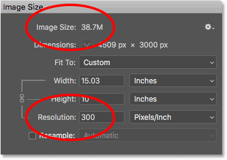
*Increasing the print resolution also has no effect on the file size.*

So how *do* you reduce the number of pixels in the image? And what resolution value do you need to get high quality prints? I'll answer these questions and more in separate tutorials in this chapter.

And there we have it! That's a quick look at pixels, image size and image resolution, three important topics you need to know about to get the best results when resizing images in Photoshop! In the next lesson, we'll take a closer look at Photoshop CC's powerful [Image Size command](/basics/photoshops-image-size-command-features-and-tips/ "View next tutorial")!

You can jump to any of the other lessons in this [Resizing Images in Photoshop](/basics/how-to-resize-images-in-photoshop-complete-guide/ "View the complete Image Resizing guide") chapter. Or visit our [Photoshop Basics](/basics/ "Learn more") section for more topics!