# Place an Image in a Shape with the Frame Tool in Photoshop 2025

> Source: [https://www.photoshopessentials.com/basics/place-an-image-in-a-shape-with-the-frame-tool-in-photoshop-2025/](https://www.photoshopessentials.com/basics/place-an-image-in-a-shape-with-the-frame-tool-in-photoshop-2025/)
> Downloaded and converted to Markdown.

Photoshop’s **Frame Tool** was designed to be the easiest way to place an image into a shape. But until recently, the Frame Tool was limited to just rectangular or elliptical shapes.

Now in **Photoshop 2025**, the Frame Tool has been upgraded to include custom shapes, which means you can use any of the custom shapes included with Photoshop, or any custom shape you created yourself, and place your image into it using the Frame Tool.

I should mention that the Frame Tool is not Photoshop’s best way, or the most flexible way, to place an image into a shape. But it is the easiest way, especially if you are a Photoshop beginner. So here’s how it works.

### Which Photoshop version do I need?

You'll need [Photoshop 2025](https://adobe.prf.hn/click/camref:1100lrdjJ/destination:https%3A%2F%2Fwww.adobe.com%2Fproducts%2Fphotoshop.html) to use the Frame Tool with custom shapes. Use the Creative Cloud Desktop app to make sure that your copy of Photoshop is up to date.

Let's get started!

For this tutorial, I’ve gone ahead and created a new Photoshop document with a white background.

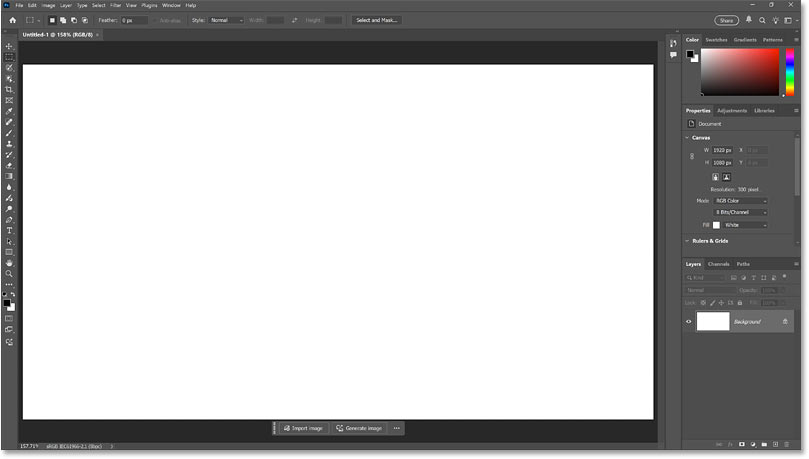
*Starting with a blank Photoshop document.*

## How to use Photoshop's Frame Tool

Here are the basic steps for placing an image in a shape using Photoshop's Frame Tool, regardless of which shape you're using. We'll look specifically at custom shapes once we've covered the basics.

### Step 1: Select the Frame Tool

Start by selecting the **Frame Tool** from the [toolbar](/basics/photoshop-tools-toolbar-overview/). 

By default it’s located directly below the [Crop Tool](/basics/how-to-crop-images-photoshop-cc/).

*Selecting the Frame Tool.*

### Step 2: Choose a frame shape

In the Options Bar, choose a shape for your frame. As of Photoshop 2025, we can choose a rectangular shape, an elliptical shape, a triangle shape (new) or a custom shape (new).

To learn the basics of how the Frame Tool works, let’s keep things simple and choose the **rectangular shape**. But everything we cover here applies to the other shapes as well, including custom shapes. I’ll show you where to find all of Photoshop’s custom shapes later on.

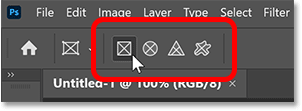
*Choosing the rectangle shape for the frame.*

### Step 3: Drag out a frame

With the Frame Tool and your frame shape selected, click inside the document and drag out a frame.

As you drag, you’ll see only a rectangular bounding box for the frame, regardless of which frame shape you selected.

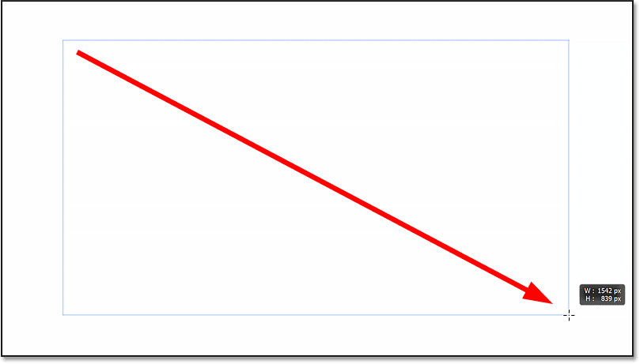
*Dragging out the frame.*

Release your mouse to complete the shape. 

Since we chose the rectangle shape, we get a rectangular frame.

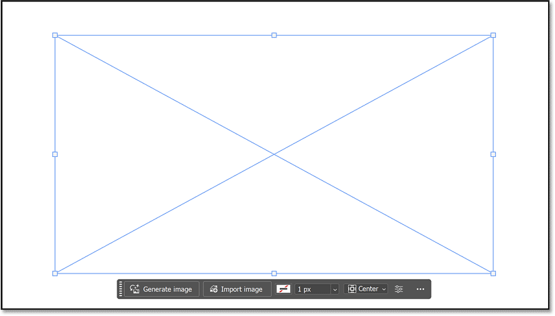
*The frame appears.*

In the [Layers panel](/basics/layers/layers-panel/), we have a new **frame layer**, which includes a **frame** thumbnail on the left and a thumbnail showing the **contents** of the frame to its right. 

Notice that the frame itself is selected (the frame thumbnail has a white border around it). And currently the frame has no contents so we’re seeing the white background.

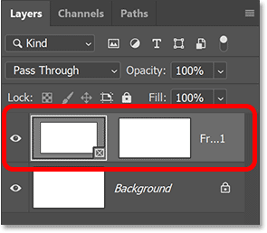
*The new frame layer.*

### Step 4: Resize or reposition the frame if needed

To resize the frame, click and drag any of the **transform handles** (the little squares).

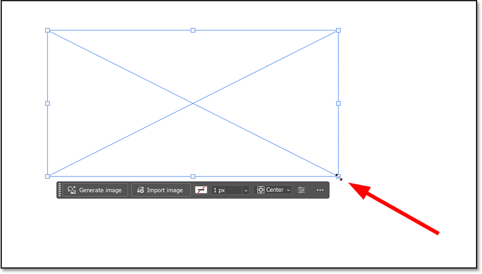
*Dragging the handles to resize the frame.*

And to reposition the frame on the canvas, click and drag on the frame itself.

Here I’m centering the frame.

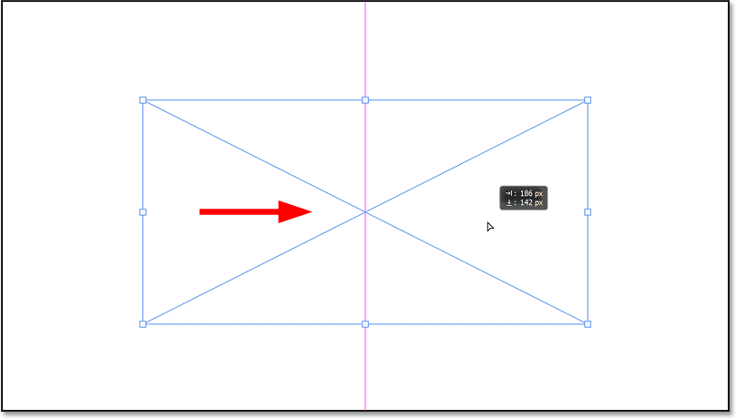
*Repositioning the frame.*

### Step 5: Place your image into the frame

Now that we have a frame, how do we place an image inside it?

For that we use the **Contextual Task Bar** which should appear directly below the frame. If you’re not seeing the Task Bar, select it from the **Window** menu in the Menu Bar.

### Placing an AI generated image into the frame

Adobe is [all about AI these days](/photo-editing/using-generative-ai-with-the-remove-tool-in-photoshop/), and if you don’t have an image to place into the frame, you can click **Generate image** in the Task Bar to create an image using [Adobe Firefly](/photo-effects/using-structure-reference-and-style-reference-in-adobe-firefly/).

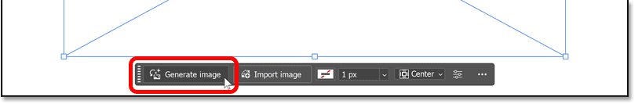
*Clicking the Generate image button.*

The Generate Image dialog box opens where you can enter a prompt, choose whether you want an artistic (Art) or photorealistic (Photo) image, add effects, and choose an image to use as a style reference.

Since this is not a tutorial on [how to generate images in Photoshop](/photo-effects/how-to-generate-ai-images-in-photoshop-using-adobe-firefly/) (I have a separate tutorial for that), I’ll quickly choose one of the “prompt inspiration” thumbnails on the right to load its prompt and settings. 

Then I’ll click **Generate**.

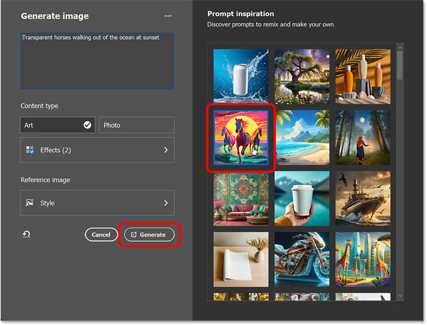
*The Generate Image dialog box.*

After a few seconds, Photoshop fills the frame with an AI generated image.

*The AI image in the frame.*

In most cases though, you’ll have your own image that you want to place into the frame. 

So I’ll undo that to remove the AI image and return to the blank frame.

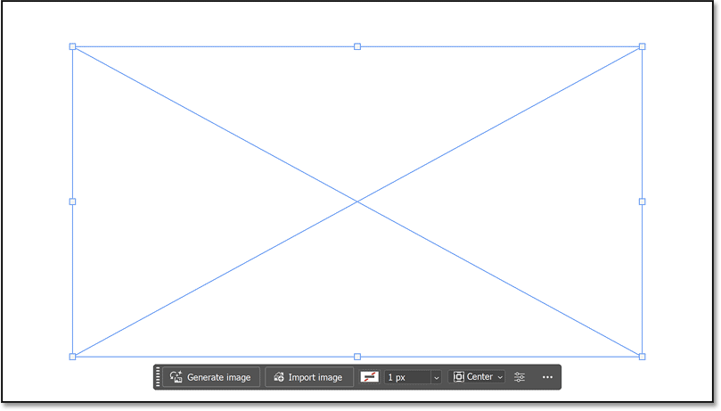
*Back to the empty frame.*

### Placing your own image into the frame

To place your own image into the frame, click **Import image** in the task bar.

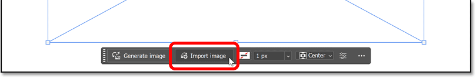
*Clicking the Import image button.*

Navigate to the image on your computer, click on it to select it and click the **Place** button.

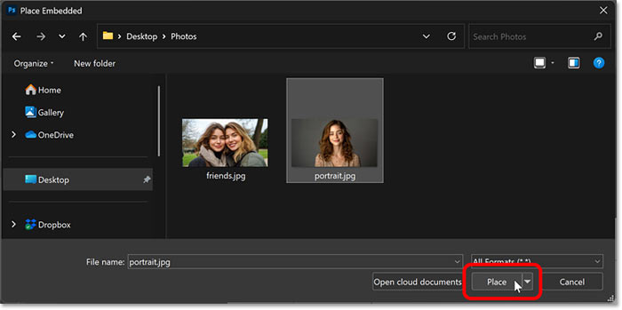
*Selecting the image to place into the frame.*

Photoshop places the image into the frame and resizes the image to fit within the frame proportionally.

*Photoshop places the image into the frame.*

### Step 6: Resize and reposition the image in the frame

In the Layers panel, the image now appears inside the **contents thumbnail** of the frame layer. Notice that the contents thumbnail is now selected (it has a white border around it), which means that we can now reposition the image within the frame.

Also notice the [smart object](/basics/how-to-edit-and-replace-smart-object-contents-in-photoshop/) icon in the lower right of the content thumbnail. Photoshop automatically converts the image into a smart object when placing it into the frame. That means we can resize the image inside the frame as many times as needed [without losing quality](/basics/scale-resize-images-smart-objects-photoshop/), and it makes it easy to replace the image with a different one, as we’ll see in a moment.

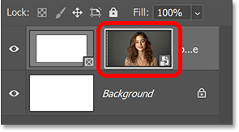
*The image in the contents thumbnail of the frame layer.*

But before I do anything with the image, I’ll click on the **frame thumbnail** to select it.

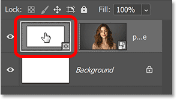
*Selecting the frame thumbnail.*

With the frame thumbnail selected, the transform handles reappear around the frame so we can resize it independently of the image.

Here I’m making the frame smaller.

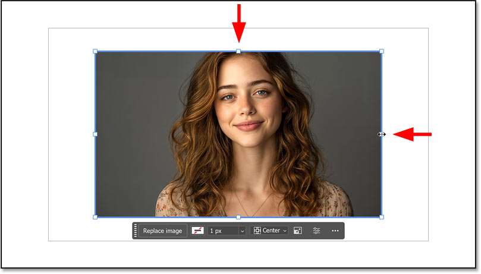
*Resizing the frame but not the image inside it.*

Then I’ll click on the **contents thumbnail** to select it so I can make adjustments to the image inside the frame.

*Selecting the contents thumbnail.*

I can then click and drag the image around inside the frame to reposition it, without moving the frame.

Here I’m dragging the image to the right.

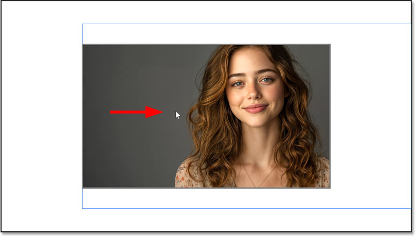
*Repositioning the image but not the frame.*

What if we need to resize the image inside the frame? 

In the Contextual Task Bar, click the **Transform image** icon. If you’re not seeing it, make sure you have the contents thumbnail selected on the frame layer, not the frame thumbnail. The task bar displays different options depending on which one is selected.

*Clicking the Transform image icon.*

Clicking the Transform image icon places the [Free Transform](/basics/transform-and-warp-images-with-free-transform-in-photoshop-cc-2019/) box and handles around the image. You can then drag the handles to resize the image inside the frame. 

To resize the image proportionally, first go up to the Options Bar and make sure the link icon between the Width and Height fields is selected.

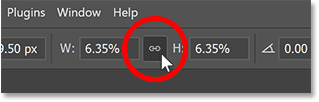
*Linking the Width and Height together.*

This will lock the aspect ratio of the image as you drag the handles to resize it. 

To resize the image from its center, hold the **Alt** key on your keyboard (Windows) or the **Option** key (Mac) as you drag any of the handles.

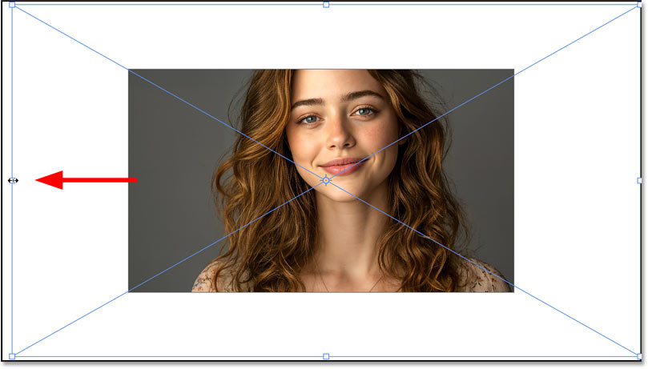
*Resizing the image inside the frame.*

And with Free Transform still active, you can click and drag on the image itself to reposition it within the frame.

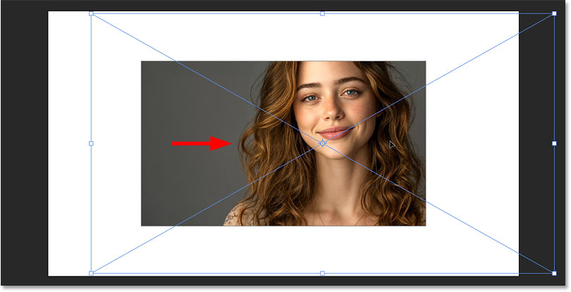
*Moving the image inside the frame with Free Transform.*

Click **Done** in the task bar to accept it and close Free Transform.

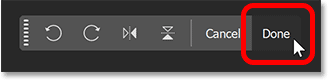
*Clicking the Done button.*

If, after resizing the image, you change your mind and want to fit the image within the frame again, click the **frame thumbnail** in the Layers panel to make the frame active.

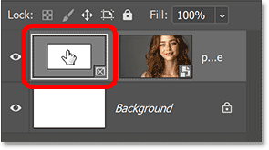
*Selecting the frame.*

Then in the task bar, click the **Fill Options** icon.

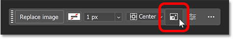
*The Fill Options icon.*

Here you have three choices. **Fill frame proportionally** will reset the image size to fit it proportionally within the frame. **Fit frame to content** will resize the frame to fit the entire image inside it. And **Center content in frame** will keep the frame at its current size and center the image.

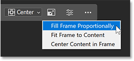
*The fill options.*

I’ll choose **Fill Frame Proportionally** so Photoshop resizes the image to fit within the frame.

*The image now fits within the frame.*

### How to replace the image inside the frame

Swapping the current image in the frame with a different image is easy. 

First, make sure the **frame thumbnail** is selected in the Layers panel.

*Selecting the frame.*

Then in the task bar, click the **Replace image** button. 

You’ll see two options, **Generate image** and **Import image**. I’ll click Import image.

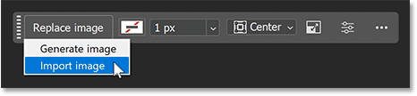
*Clicking Replace image and then Import image.*

Navigate to the new image on your computer, click on it to select it and click **Place**.

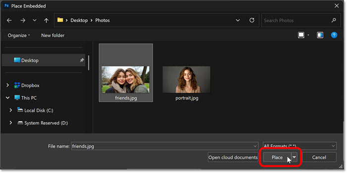
*Selecting the replacement image and choosing Place.*

And just like that, Photoshop swaps the old image for the new one and fits it proportionally within the frame.

*The original image is instantly replaced with the new image.*

### Adding a stroke around the frame

One of the limitations of Photoshop’s Frame Tool is that it does not give us many options for adding effects. In fact, the only effect we can add is a **stroke** around the frame.

To add a stroke, make sure the **frame thumbnail** is selected in the Layers panel.

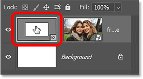
*Selecting the frame thumbnail.*

Then in the task bar, click the **stroke color swatch**.

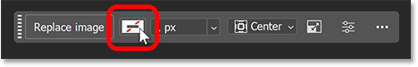
*The stroke color swatch in the Task Bar.*

Choose one of the preset stroke colors, or click the **Custom Color** icon in the upper right to open the **Color Picker** to choose your own color.

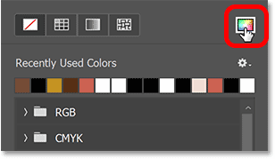
*Clicking the Custom Color icon.*

I like to choose a stroke color directly from the image. To do that, hover your mouse cursor over the image. The cursor will change to an eyedropper icon. Then click on a color to sample it.

Here I’m sampling a color from the woman’s jacket (lower right of the image).

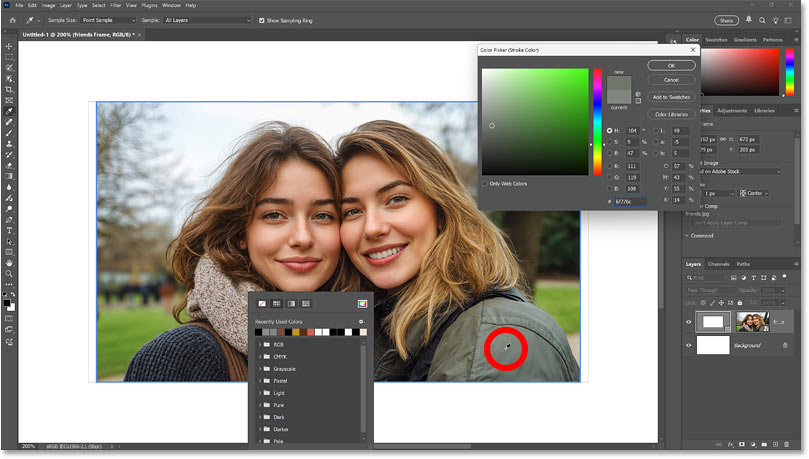
*Sampling a stroke color from the image.*

Click OK to close the Color Picker. Then press Enter (Windows) or Return (Mac) to close the stroke color dialog.

Back in the task bar, set the **stroke width**. To make the stroke easy to see, I’ll go with a size of 20 pixels.

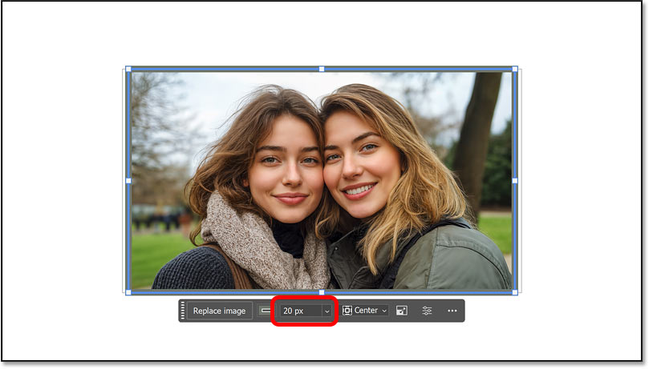
*Setting the stroke width.*

Then still in the task bar, click on the **Stroke Alignment** option (set to Center by default) and choose whether you want the stroke to appear **inside** the frame outline, **centered** on the outline or **outside** the outline.

I’ll choose Outside.

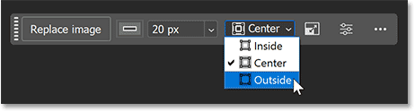
*The stroke alignment options in the Task Bar.*

To hide the outline around the frame, select a different layer in the Layers panel.

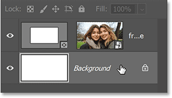
*Selecting the Background layer.*

And here’s my rectangular frame with the image inside it and the stroke around it.

*The frame with the stroke added.*

And that’s the basics of how to use Photoshop’s Frame Tool to place an image into a shape. 

So now let’s look specifically at using custom shapes, which is a new feature of the Frame Tool in Photoshop 2025.

## How to load all of Photoshop’s custom shapes

As of [Photoshop 2025](https://adobe.prf.hn/click/camref:1100lrdjJ/destination:https%3A%2F%2Fwww.adobe.com%2Fproducts%2Fphotoshop.html), the Frame Tool can now place an image into any of Photoshop’s custom shapes. That includes the [custom shapes that ship with Photoshop](/basics/how-to-draw-custom-shapes-in-photoshop/), along with any shapes you downloaded off the web, and any custom shapes you created yourself.

Photoshop has lots of built-in custom shapes to choose from, but only a few of them are loaded by default. To access the rest, we need to load them ourselves. Here’s how.

### Step 1: Open the Shapes panel

Photoshop’s custom shapes are loaded from the **Shapes panel**. But the Shapes panel is not open by default.

To open it, go up to the **Window** menu and choose **Shapes**.

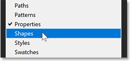
*Opening the Shapes panel from the Window menu.*

The Shapes panel opens with four groups of shapes (Wild Animals, Leaf Trees, Boats and Flowers). 

You can twirl any of the groups open to view the shapes inside it. But there are lots more shapes available than what we see here.

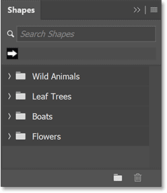
*Photoshop’s default shapes.*

### Step 2: Load the Legacy Shapes and more

Click the Shapes panel **menu icon** in the upper right corner.

Then choose **Legacy Shapes and More**.

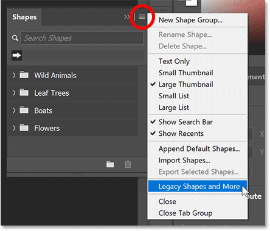
*Loading Photoshop’s hidden shapes.*

A new **Legacy Shapes and More** group appears.

Twirl it open to find two more groups, **2019 Shapes** and **All Legacy Default Shapes**. 

You can then twirl these groups open to access all of the shapes that were missing from the Shapes panel.

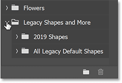
*All of Photoshop’s custom shapes are now loaded.*

## How to use a custom shape with the Frame Tool

Now that we have loaded all of Photoshop’s custom shapes, we can choose any of them to use with the Frame Tool.

With the Frame Tool active, click the **Custom Shape** icon in the Options Bar.

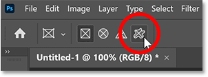
*Choosing the custom shape for the Frame Tool.*

Then click the **shape thumbnail** to choose a shape.

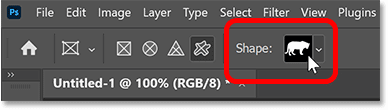
*Clicking the shape thumbnail in the Options Bar.*

Twirl open the groups and choose the shape you want for your frame.

I’ll go to the **Legacy Shapes and More** group, then the **All Legacy Default Shapes** group, and I’ll twirl open the **Legacy Default Shapes** folder so I can choose a **heart** shape.

I’ll double-click on the heart shape to both select it and close the shape picker.

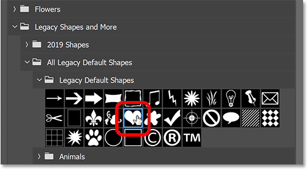
*Selecting a heart shape.*

At this point, all of the steps for placing an image into the frame are exactly the same as what we covered earlier with the rectangular shape.

I’ll drag out my heart shape on the canvas, resize it with the transform handles and reposition it in the center.

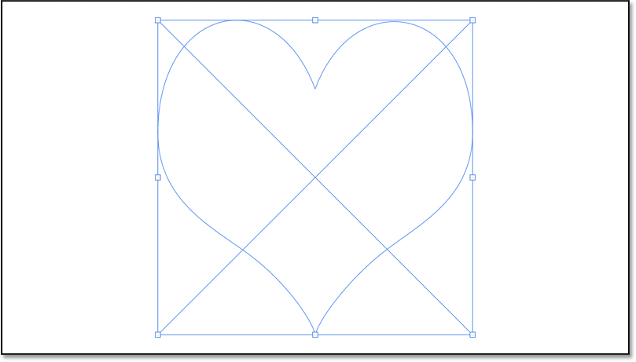
*The heart frame added to the document.*

Then I’ll click the **Import image** button in the Task Bar.

*Clicking the Import image button.*

I’ll choose the image I want to use and click **Place**.

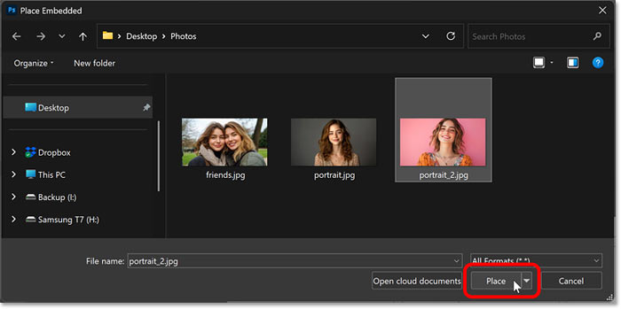
*Selecting the image to place into the frame.*

Photoshop places the image into the frame.

*The image inside the custom shape.*

Finally, I’ll drag the image over to the right to reposition the woman inside the frame.

*Moving my subject inside the frame.*

### How to move the frame and the shape together

We’ve seen that we can move and resize the image inside the frame. But how do we move the image and the frame together?

To reposition both the frame and the image on the canvas, hold the **Shift** key on your keyboard and click on whichever thumbnail on the frame layer is not currently selected. This will select both the frame and the image together. 

In my case, the content thumbnail is selected so with my Shift key held down, I’ll click on the frame thumbnail to select them both.

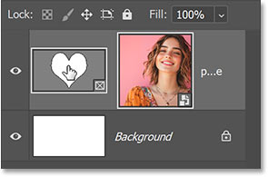
*Shift-click on the inactive thumbnail to select both*

Then simply drag them into position. Here I’m dragging both the frame and the image over to the right.

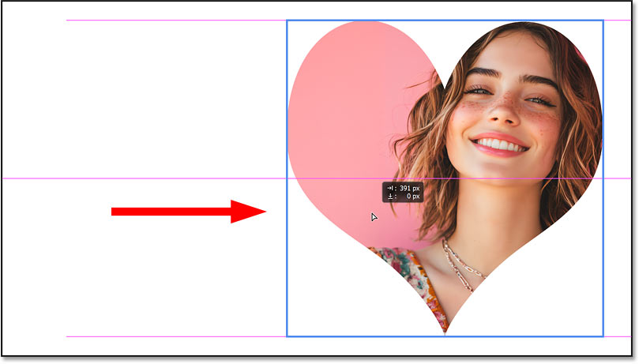
*Moving the frame and the image together.*

And there we have it! That’s the basics of how to place an image into a shape using the upgraded Frame Tool in Photoshop 2025.