# Place Images into Shapes with the Frame Tool in Photoshop

> Source: [https://www.photoshopessentials.com/basics/place-images-into-shapes-with-the-new-frame-tool-in-photoshop-cc-2019/](https://www.photoshopessentials.com/basics/place-images-into-shapes-with-the-new-frame-tool-in-photoshop-cc-2019/)
> Downloaded and converted to Markdown.

The Frame Tool, a new feature in Photoshop CC 2019, makes it easy to place images into shapes! Learn how to draw shapes with the Frame Tool, how to place images into your shapes, how to instantly swap images with other images, and more!

Photoshop CC 2019 introduces a brand new tool to Photoshop's Toolbar known as the Frame Tool. The Frame Tool is designed to make placing images into shapes both simple and intuitive, especially for users who are new to Photoshop. It's great for designing layouts, and in fact, if you've used a page layout program like Adobe InDesign, then you're already familiar with how the Frame Tool works. You just drag out a frame where you want to place an image on the page (or in this case, in your Photoshop document), and then drag your image into the frame!

To be fair, Photoshop's new Frame Tool is not necessarily the best way to work. That's because anything you can do with the Frame Tool can also be done using Photoshop's more flexible [clipping masks](/basics/clipping-masks-essentials/). But the Frame Tool *is* easier, especially if you're new to Photoshop. And, the Frame Tool takes full advantage of Photoshop's powerful smart objects. So even if you're a more experienced Photoshop user, the Frame Tool still has something to offer. Let's see how it works.

To follow along, you'll need the [latest version of Photoshop](https://prf.hn/l/dlXjD2w). And if you're already an Adobe Creative Cloud subscriber, make sure that your copy of Photoshop CC is [up to date](/basics/update-photoshop-cc/). Let's get started!

## How to use the Frame Tool in Photoshop CC 2019

Using the new Frame Tool in Photoshop CC 2019 to place images into shapes is easy. We just select the Frame Tool, draw a frame, drag an image into the frame, and then move or resize the image inside the frame. You can add a stroke around the frame to help with your design, and even swap the existing image with a new image just by dragging and dropping the new image into the frame.

To show you how it works, I've gone ahead and created a new document:

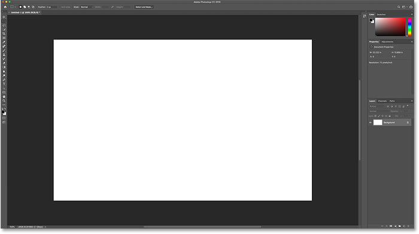
*A new document in Photoshop CC 2019.*

### Step 1: Select the Frame Tool

Photoshop's new Frame Tool is found in the [Toolbar](/basics/photoshop-tools-toolbar-overview/). It's the tool that looks like a box with an X through it. Click on it to select it. You can also select the Frame Tool from your keyboard by pressing the letter **K**:

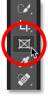
*Selecting the Frame Tool from the Toolbar.*

### Step 2: Choose a shape for your frame from the Options Bar

With the Frame Tool selected, choose a shape for your frame from the Options Bar. By default, you'll draw a rectangular frame, but you can also draw elliptical frames. Select the shape you need by clicking on its icon. I'll stick with the rectangular shape for now:

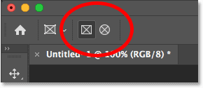
*Choose a shape (rectangular or elliptical) for the frame.*

### Step 3: Draw a frame where you want to place an image

Then, drag out a frame where you want to place an image inside your document:

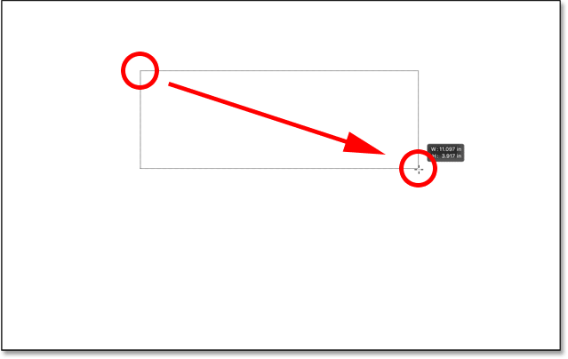
*Click and drag to draw your frame.*

#### Using modifier keys with the Frame Tool

To reposition the frame as you're drawing it, press and hold your **spacebar**, drag the frame into position, and then release your spacebar to continue drawing the frame. To force a rectangular frame into a perfect square, hold your **Shift** key as you drag. Or if you're drawing an elliptical frame, hold **Shift** to force it into a perfect circle:

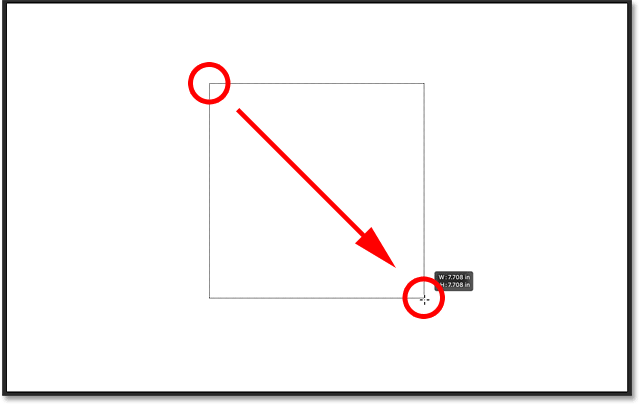
*Hold Shift to force rectangular frames into squares or elliptical frames into circles.*

In my case, I'll draw a wide frame in the upper half of the document:

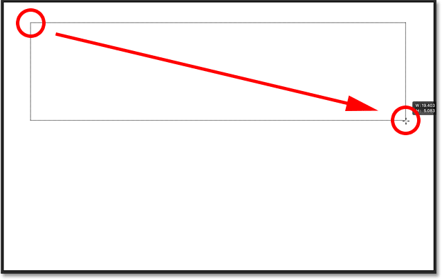
*Drawing a rectangular frame where I want to place an image.*

Release your mouse button, and the frame appears. The frame is a container for an image. But since the frame has no content yet, it starts out empty:

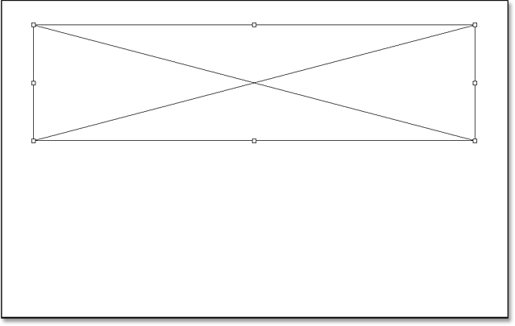
*An empty frame has been added to the document.*

### The new Frame layer in the Layers panel

If we look in the [Layers panel](/basics/layers/layers-panel/), we see that Photoshop added the frame on its own separate **Frame layer**, which is also new in CC 2019. The thumbnail on the left represents the frame itself (indicated by the small **frame icon** in the lower right). And the thumbnail on the right is for the content inside the frame. Since there is no content yet, the thumbnail is just filled with white:

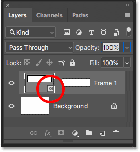
*The icon in the lower right tells us it's a Frame layer.*

### Step 4: Place an image into the frame

To place an image into the frame, go up to the **File** menu in the Menu Bar and choose **Place Embedded**. Or you can choose **Place Linked**. The difference is that Place Embedded will embed the image into your document, while Place Linked will just link to the image on your computer. In most cases, Place Embedded is the better choice:

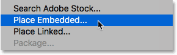
*Going to File > Place Embedded.*

Then navigate to the image on your computer, select it, and click **Place**:

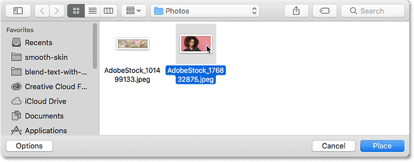
*Selecting the image to place inside the frame.*

Photoshop places the image into the frame. And it automatically resizes the image to match the frame's size ([photo](https://prf.hn/l/me41Mo0) from Adobe Stock):

*The image is placed and resized in the frame. Photo credit: Adobe Stock.*

#### Placing the image as a smart object

If we look again at the Frame layer in the Layers panel, we see the content of the frame now appearing in the thumbnail on the right. Also, notice the **smart object icon** in the lower right of the thumbnail, telling us that Photoshop has automatically converted the image into a [smart object](/basics/how-to-create-smart-objects-in-photoshop/).

If you're new to Photoshop, this may not mean much to you, but smart objects are a good thing. It means we can resize the image inside the frame [without losing quality](/basics/scale-resize-images-smart-objects-photoshop/). And, we can easily [replace the image](/basics/how-to-edit-and-replace-smart-object-contents-in-photoshop/) with another one, as we'll see how to do in a few moments:

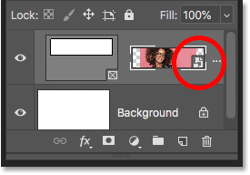
*The Frame layer showing the content added as a smart object.*

## How to switch between the frame and the image

Now that we've placed an image into the frame, let's look at how to switch between the frame and its contents.

### From the Layers panel

One way to switch between the frame and the image is from the Layers panel. Notice the **white border** around the content's thumbnail. This tells us that the image inside the frame is selected:

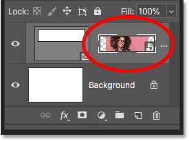
*The border tells us which one (the frame or the image) is selected.*

#### Selecting the frame

To select the frame itself, click on the frame's thumbnail on the left:

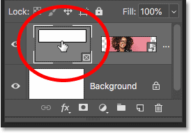
*Selecting the frame by clicking the left thumbnail.*

Along with the border around the thumbnail, another way to tell that the frame is selected is that we can see the **transform handles** around the frame in the document. We use the handles to resize the frame, and we'll come back to them shortly:

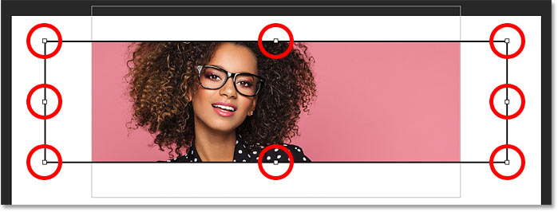
*The transform handles mean that the frame is selected.*

#### Selecting the image

To switch back to the image, click the thumbnail on the right:

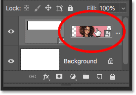
*Selecting the image by clicking the right thumbnail.*

And with the image selected, the transform handles around the frame disappear:

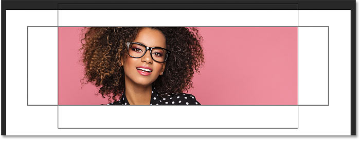
*The frame's transform handles are gone.*

#### Selecting both the frame and the image

To select both the frame *and* the image at the same time, press and hold your **Shift** key and click on the one that's not currently selected. The white border appears around both thumbnails:

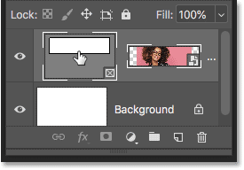
*Shift-click on the other thumbnail to select them both at once.*

#### Deselecting the frame or the image

And then to switch back to having just the frame *or* the image selected, click on the one you need. I'll reselect the frame, and this deselects the image:

*When both are selected, click on a thumbnail to deselect the other one.*

### From the document

Another way to switch between the frame and its contents is from the document.

#### Selecting the image

To select the image, simply click on it inside the frame. Notice the outline around the image, and that it includes the parts of the image that are hidden because they extend beyond the frame's boundaries:

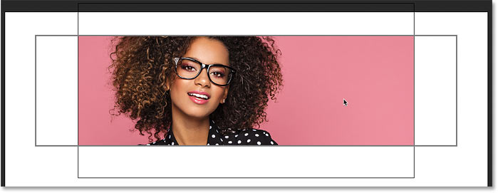
*Clicking on the image to select it.*

#### Selecting the frame

To select the frame, click directly on the frame's outline. The transform handles reappear:

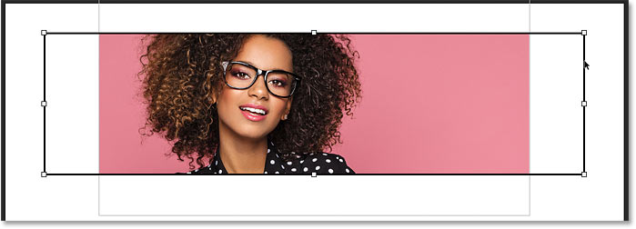
*Clicking on the frame to select it.*

#### Selecting the frame and the image

And to select both the frame *and* the image, **double-click** on the image. The outline around the image disappears and you'll see only the outline around the frame:

*Double-clicking on the image to select both the frame and the image at once.*

With both the frame and the image selected, you can click and drag both of them together inside the document:

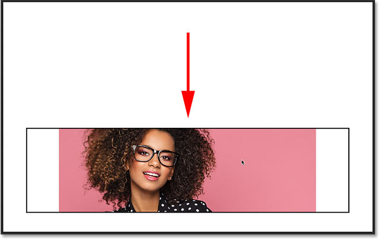
*Click and drag the frame and the image when both are selected.*

#### How to undo a step with the Frame Tool

I'll undo that by going up to the **Edit** menu and choosing **Undo Move**. Photoshop gives us multiple undos with the Frame Tool. To move backwards through your steps, press **Ctrl+Z** (Win) / **Command+Z** (Mac) repeatedly. And to redo a step, press **Shift+Ctrl+Z** (Win) / **Shift+Command+Z** (Mac):

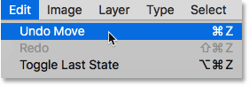
*Undoing the last step with the Frame Tool.*

#### Deselecting the frame when both are selected

Finally, when you have both the frame and the image selected, you can switch back to selecting just the image by again **double-clicking** on it. So, when the image *or* the frame is selected, double-clicking on the image will select them both. And when they're *both* selected, double-clicking will select only the image:

*Double-clicking again to select only the image.*

## How to move and resize the frame's contents

So now that we know how to select and switch between the frame and its contents, let's learn how to move and resize the image inside the frame.

### How to move the image in the frame

To move the image, just click and drag it. Only the area inside the frame remains visible:

*Click and drag to reposition the image inside the frame.*

### How to resize the image in the frame

To resize the image, we don't use the Frame Tool directly. Instead, we use Photoshop's Free Transform command. Go up to the **Edit** menu and choose **Free Transform**:

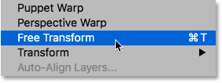
*Going to Edit > Free Transform.*

Then, drag the handles to resize the image. In Photoshop CC 2019, Free Transform automatically locks the aspect ratio, so there's no need to hold Shift as you drag. But if you want to resize the image from its center, press and hold **Alt** (Win) / **Option** (Mac). When you're done, press **Enter** (Win) / **Return** (Mac) to accept it:

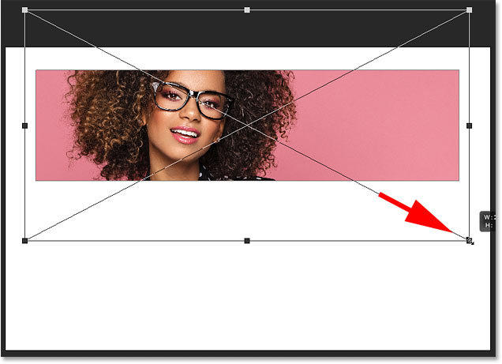
*Resizing the image inside the frame with Free Transform.*

## How to resize the frame

To resize the frame, not the contents, first click on the frame's outline to select it:

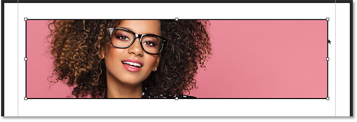
*Selecting the frame by clicking directly on its outline.*

Then drag any of the handles to reshape and resize it. If you press and hold your **Shift** key while dragging a corner handle, you'll lock in the frame's original aspect ratio:

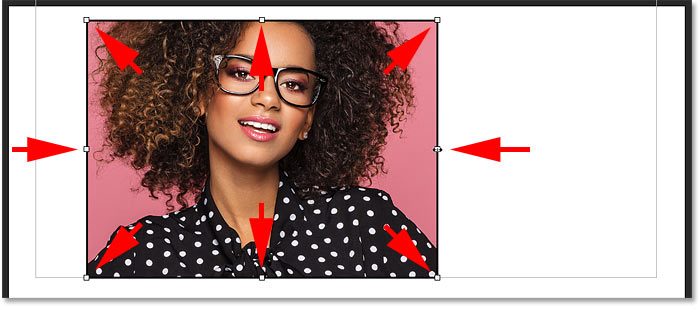
*Resizing the frame by dragging the transform handles.*

Once you've resized the frame, you can click and drag the image inside the frame to reposition it:

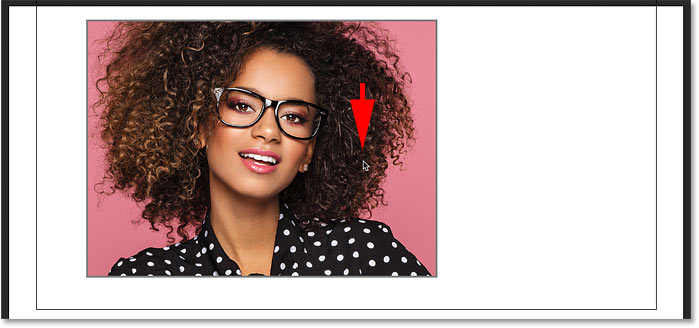
*Moving the image after resizing the frame.*

## How to move the frame and the image together

To move both the frame *and* the image at the same time, double-click on the image to select them both:

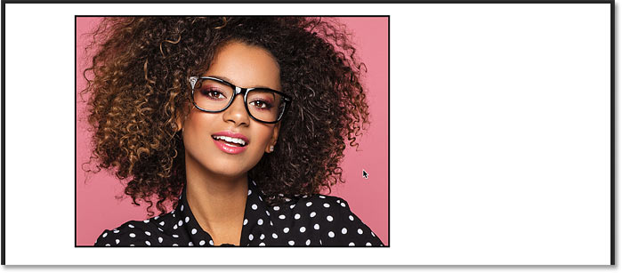
*Double-clicking to select the frame and the image.*

And then click and drag to move both of them together:

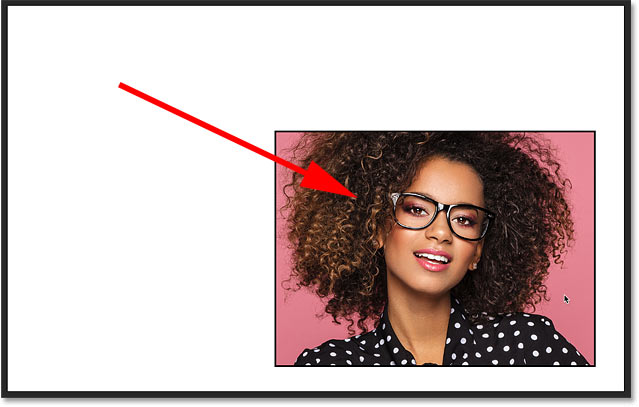
*Dragging the frame and its content at the same time.*

## How to resize the frame and the image together

To resize both the frame and the image at once, again make sure both are selected. Go up to the **Edit** menu and choose **Free Transform**:

*Going back to Edit > Free Transform.*

And then drag the handles to resize the frame and its contents:

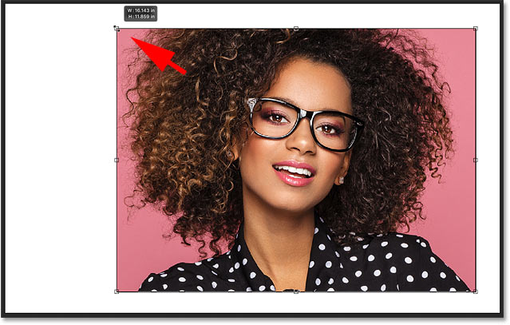
*Dragging the Free Transform handles to resize the frame and its contents.*

You can also reposition the frame and its contents by clicking and dragging inside the Free Transform box. Here I've centered the frame and the image in the document. Press **Enter** (Win) / **Return** (Mac) when you're done to accept it:

*Centering the frame and the image in the document with Free Transform.*

## How to replace the frame's contents

A great feature of Photoshop's new Frame Tool is that we can easily swap out one image for another.

I'll press **Ctr+Z** (Win) / **Command+Z** (Mac) a few times to undo my steps and return my frame to its original size and location:

*The frame at its original size and location in the document.*

### Method 1: Using the Place Embedded or Place Linked command

One way to replace the current image with a different image is to go up to the **File** menu and choose **Place Embedded** (or **Place Linked**):

*Going to File > Place Embedded.*

Navigate to the new image on your computer. Then select it and click **Place**:

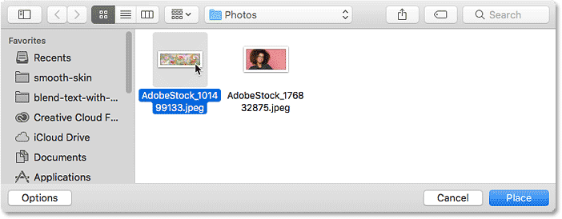
*Selecting and placing the new image into the frame.*

### Method 2: Drag and drop

Or, if you already have the image open in a File Explorer (Win) or Finder (Mac) window, you can drag and drop the new image onto the existing one:

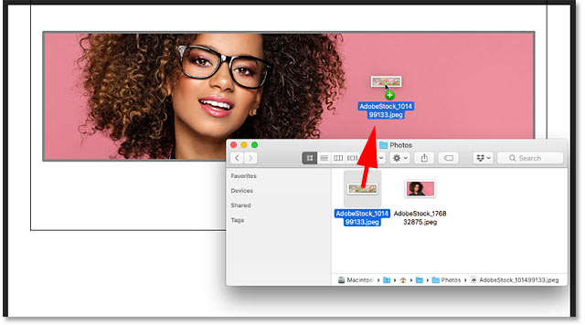
*Dragging and dropping the replacement image into the frame.*

### Method 3: From the Libraries panel

And yet another way to add or replace the contents is by dragging an image from your **Libraries** panel onto the frame:

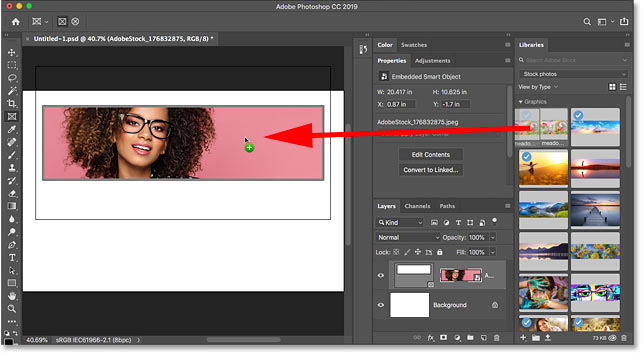
*Dragging the replacement image from the Libraries panel onto the frame.*

Photoshop instantly replaces the previous image with the new one. You can then use [Free Transform](/basics/photoshops-free-transform-essentials/) to resize the image inside the frame if needed ([photo](https://prf.hn/l/5Njb1dR) from Adobe Stock):

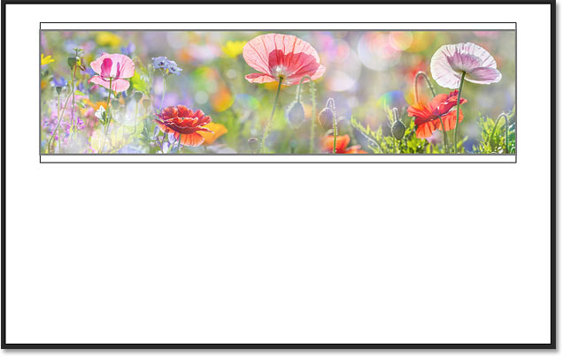
*The Frame Tool makes it easy to replace one image with another. Photo credit: Adobe Stock.*

## How to add a stroke around the frame

Next, let's look at how to add a stroke around the frame. Photoshop's normal layer styles, found at the bottom of the Layers panel, won't work with frames. But we *can* add a stroke. You'll find the **Stroke** option in the **Properties panel**:

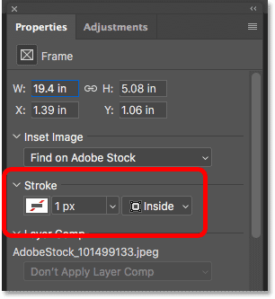
*The Stroke option for the Frame Tool in the Properties panel.*

### Why can't I see the Stroke option?

If you're not seeing the Stroke option, make sure you have the frame itself selected in the Layers panel:

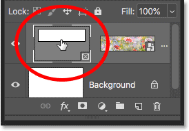
*The Stroke option is only available when the frame is selected.*

### Choosing the stroke color, position and size

Click the **swatch** below the word "Stroke" to choose a color. Then choose a **position** (Inside, Center or Outside) and **size**:

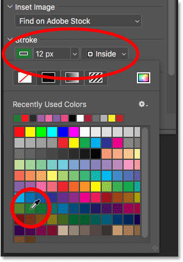
*Setting the stroke's color, position and size.*

The stroke appears around the frame:

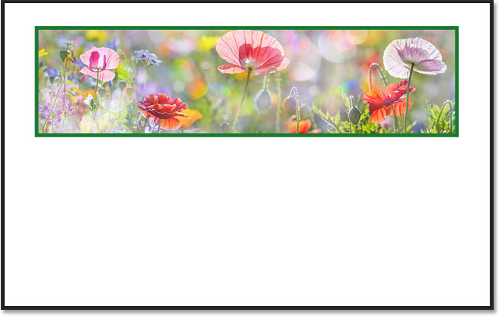
*The frame with the stroke added.*

### How to remove the stroke from around the frame

To remove the stroke, click again on the **color swatch** below the word "Stroke" and choose **No color** (the swatch with the red line through it):

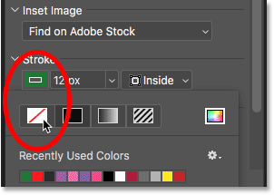
*Removing the stroke by clicking the "No color" swatch.*

## How to add a frame around an existing image

Finally, let's look at one more way to use the Frame Tool, and that's by adding a frame to an existing image. We'll also look at how to remove a frame from an image. I'll switch over to another [image](https://prf.hn/l/lGRvgoY) I've opened in Photoshop:

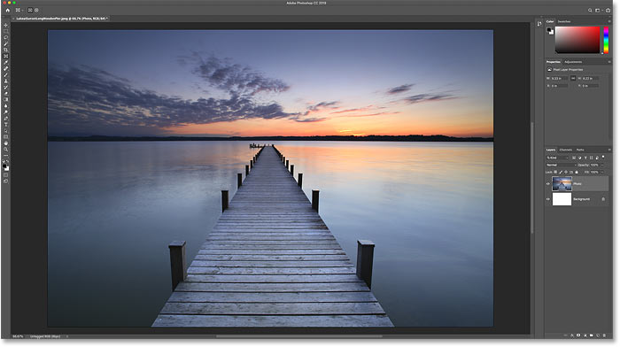
*An image open in a separate document. Photo credit: Adobe Stock.*

And if we look in the Layers panel, we see the image on a layer above the [Background layer](/basics/background-layer-photoshop-cc/). Note that we can't add a frame to the Background layer. So for this to work, you'll need your image to be on a separate layer above it:

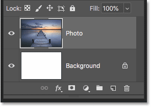
*Frames can't be added to images on the Background layer.*

### How to place the image into a rectangular frame

With the layer selected, and the Frame Tool selected in the Toolbar, click and drag out a frame inside the image:

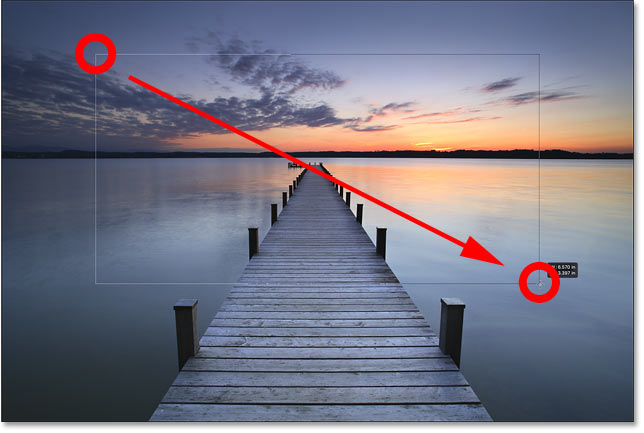
*Drawing a frame inside the image.*

When you release your mouse button, Photoshop adds the frame and places the image inside it:

*The image now sits inside the frame.*

And in the Layers panel, we see that Photoshop converted the image into a smart object, just like it did before:

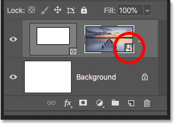
*The image, converted to a smart object, on the Frame layer.*

### How to remove a frame from an image

I've added a rectangular frame to the image. But what if I meant to add an elliptical frame instead? In that case, I can remove the existing frame by **right-clicking** (Win) / **Control-clicking** (Mac) on the Frame layer in the Layers panel:

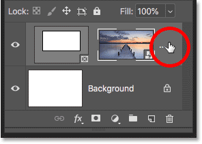
*Right-click (Win) / Control-click (Mac) on the Frame layer.*

And then choosing **Remove Frame from Layer**:

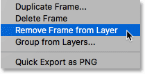
*Choosing "Remove Frame from Layer" from the menu.*

This removes the frame but keeps the image:

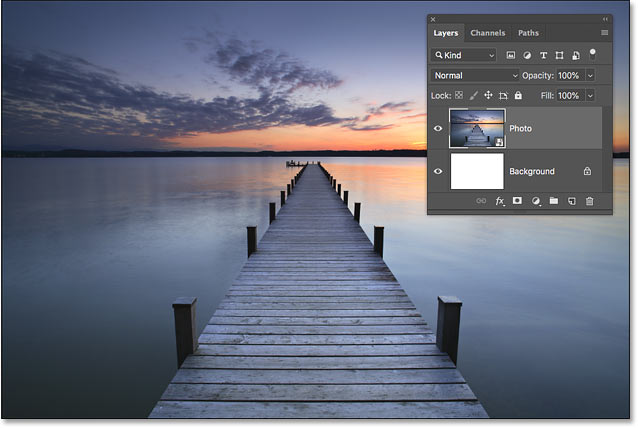
*The frame is gone but the image remains.*

### Placing the image into an elliptical frame

I'll switch from a rectangular frame to an **elliptical frame** in the Options Bar:

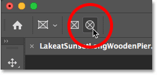
*Selecting the Elliptical frame shape.*

And then I'll click and drag out an elliptical frame inside the image. To force the frame into a perfect circle, I'll press and hold my **Shift** key as I drag. At first, it looks like I'm drawing a square frame:

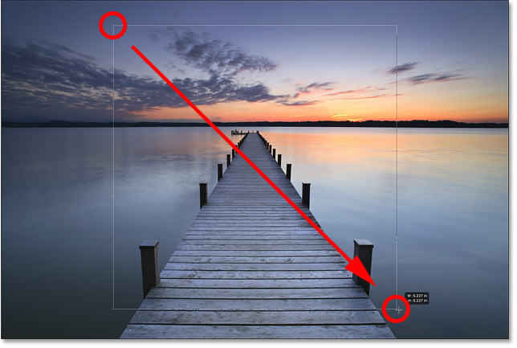
*Holding Shift while dragging to force the frame into a circle.*

But when I release my mouse button, the circle frame appears with the image inside it:

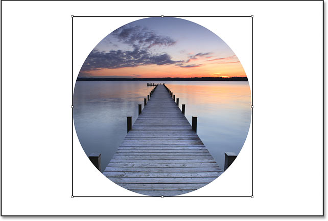
*The image has been placed into the circle frame.*

[Related tutorial: How to crop images into circles!](/basics/crop-image-circle-photoshop/)

And there we have it! That's the basics of how to use the new Frame Tool in Photoshop CC 2019! Check out our [Photoshop Basics](/basics/) section for more tutorials!