# The Polygonal Lasso Tool In Photoshop

> Source: [https://www.photoshopessentials.com/basics/selections/polygonal-lasso-tool/](https://www.photoshopessentials.com/basics/selections/polygonal-lasso-tool/)
> Downloaded and converted to Markdown.

Photoshop's **Polygonal Lasso Tool**, another of its basic selections tools, is a bit like a cross between the **Rectangular Marquee Tool** and the standard **Lasso Tool**, both of which we looked at in previous tutorials. It allows us to easily draw freeform selection outlines based on straight-sided polygonal shapes. But while the Rectangular Marquee Tool limits us to drawing 4-sided polygons (rectangles or squares), the Polygonal Lasso Tool lets us draw as many sides as we need, with as much freedom as the Lasso Tool gives us to move in any direction we need!

This tutorial is from our [How to make selections in Photoshop](/basics/make-selections-photoshop/) series.

By default, the Polygonal Lasso Tool is hiding behind the standard Lasso Tool in the Tools panel. To get to it, click on the Lasso Tool, then hold your mouse button down until a fly-out menu appears showing you the additional tools that are available. Select the Polygonal Lasso Tool from the list:

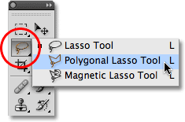
*The Polygonal Lasso Tool is hiding behind the standard Lasso Tool in the Tools panel.*

Once you've selected the Polygonal Lasso Tool, it will appear in place of the standard Lasso Tool in the Tools panel. To switch back to the Lasso Tool later, click and hold on the Polygonal Lasso Tool, then select the Lasso Tool from the fly-out menu:

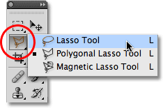
*Whichever of the three lasso tools you selected last will appear in the Tools panel. Select the others from the fly-out menu.*

You can cycle through Photoshop's three different lasso tools (Lasso Tool, Polygonal Lasso Tool and the Magnetic Lasso Tool, which we'll look at later) by holding down your **Shift** key and pressing the letter **L** repeatedly.

### Drawing Straight-Sided Polygonal Selections

Drawing selections with the Polygonal Lasso Tool is a lot like drawing straight-sided paths with the **Pen Tool**. Begin by clicking somewhere along the edge of the object or area you need to select, then release your mouse button. This adds a point, commonly called an anchor or fastening point, to the document. As you move the Polygonal Lasso Tool away from the point, you'll see a thin straight line extending out from your mouse cursor, looking a bit like a spider weaving a web, with the other end of the line attached to the anchor point. Click again to add a second point, then release your mouse button. The line will become "fastened" to the new point, with both points now joined together by the straight line.

Continue moving around the object or area, clicking to add a new point anywhere where the line needs to change direction, fastening the end of the line to each new point as you go along. Unlike the standard Lasso Tool, as well as many of Photoshop's other selection tools, there's no need to keep your mouse button held down as you move from point to point. Simply click to add a point, release your mouse button, move to the next spot where the line needs to change direction, then click to add a new point:

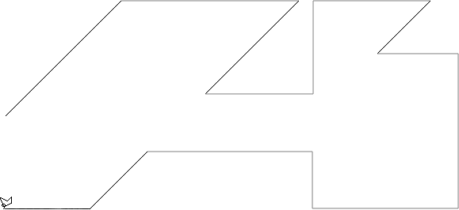
*Click to add points around the object or area where you need the line to change direction.*

Once you've made your way around the object or area, complete the selection by clicking once again on the initial point you added. Photoshop will convert all of the straight lines into a selection outline. A small circle will appear in the bottom right corner of the cursor icon when you're close enough to the initial point to complete the selection. I've enlarged things here to make the circle easier to see:

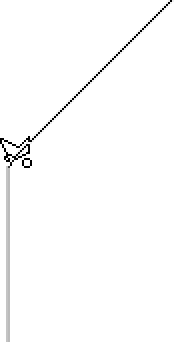
*A small circle appears in the bottom right of the cursor icon when you're close enough to the initial point to complete the selection.*

You can also close a selection simply by double-clicking anywhere with the Polygonal Lasso Tool. Photoshop will automatically close the selection with a straight line from the point you clicked on to your initial starting point.

Here's a photo I have open in Photoshop showing a large blank billboard hanging on the side of a building. I want to add a photo to the billboard, which means I'll first need to select it:

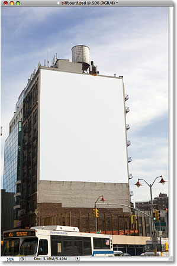
*A blank billboard.*

At first glance, you may think the billboard is shaped like a rectangle, so why bother with the Polygonal Lasso Tool when the Rectangular Marquee Tool should work just fine? Let's give it a try. I'll press the letter **M** on my keyboard to quickly select the Rectangular Marquee Tool, then I'll click in the top left corner of the billboard to begin my selection and drag down to the bottom right corner. To complete the selection, I'll release my mouse button:

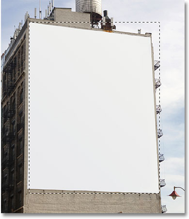
*Attempting to select the billboard with the Rectangular Marquee Tool.*

As we can see, even though the billboard probably would appear rectangular to us if we were standing directly in front of it, the angled perspective of the photo is distorting its shape, and the Rectangular Marquee Tool ends up doing a rather lousy job of selecting it.

I'll press **Ctrl+D** (Win) / **Command+D** (Mac) to remove my failed selection outline. This time, let's try selecting the billboard with the Polygonal Lasso Tool. I'll grab the Polygonal Lasso Tool from the Tools panel as we saw earlier, then to begin my selection, I'll click in the top left corner of the billboard and release my mouse button. This sets my initial starting point for the selection. I'll move to the top right corner and click to add a second point. Photoshop joins the two points together with a thin straight line. I'll click to add a third point in the bottom right corner, then click to add a fourth point in the bottom left corner, fastening the straight line to each new point as I make my way around the billboard. Again, I'm not holding my mouse button down as I move from point to point. I'm simply clicking to add points, then releasing my mouse button each time:

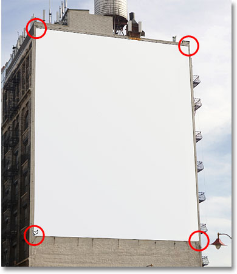
*Clicking in each of the four corners with the Polygonal Lasso Tool, beginning with the top left and moving clockwise.*

If you make a mistake and click to add a point in the wrong spot, there's no need to start over. Just press the **Backspace** (Win) / **Delete** (Mac) key on your keyboard to undo the last point you added. If you need to undo multiple points, continue pressing **Backspace** (Win) / **Delete** (Mac) to undo points in the reverse order they were added.

To complete my selection, I'll click back on the initial starting point for the selection in the top left corner of the billboard, then release my mouse button. Photoshop converts all of the straight lines between the points into my selection outline, and as we can see, we were able to do a much better job of selecting the billboard this time:

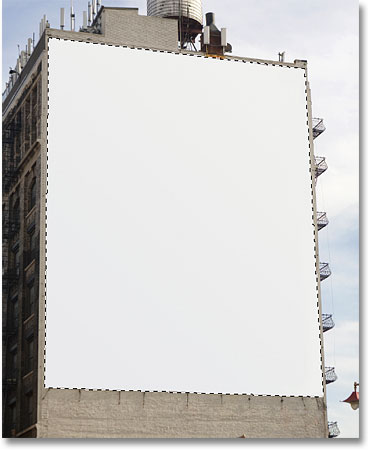
*The Polygonal Lasso Tool made it easy to select the billboard.*

Now that the billboard is selected, I'll open up the image I want to add to it:

*The soon-to-be billboard photo.*

I'll press **Ctrl+A** (Win) / **Command+A** (Mac) to quickly select the entire image, then **Ctrl+C** (Win) / **Command+C (Mac)** to copy it to the clipboard. To add the image to the billboard, I'll switch back over to my original photo, then I'll go up to the **Edit** menu at the top of the screen and choose the **Paste Into** command:

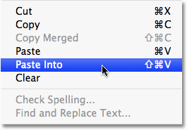
*Photoshop's Paste Into command allows us to paste an image directly into a selection.*

This places the second photo directly into the selection, and after a little resizing with Photoshop's Free Transform command, the image appears on the billboard for all to see:

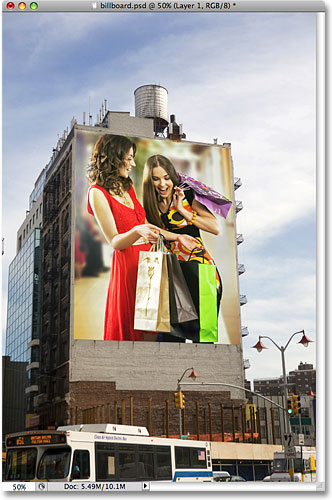
*Who wouldn't be excited to be larger than life on a billboard?*

For a more detailed explanation of how to paste one image into another, be sure to check out our **Placing An Image Inside Another Image in Photoshop** tutorial.

Up next, we'll look at how the Polygonal Lasso Tool handles something a little more complex than four-sided billboard, and what happens when we come across part of an object that's rounded or curved!

Not everything you'll want to select with the Polygonal Lasso Tool will be as simple as a four-sided billboard, but the steps are always the same. Simply click to add points along the object at the spots where your selection outline needs to change direction, then click back on the initial starting point to complete the selection.

Here's a photo of an old building. I want to replace the sky in the photo, which means I'll need to select the sky, drawing part of my selection around the top and sides of the building. Since the building is made up almost entirely of straight, flat surfaces, the Polygonal Lasso Tool should make it easy:

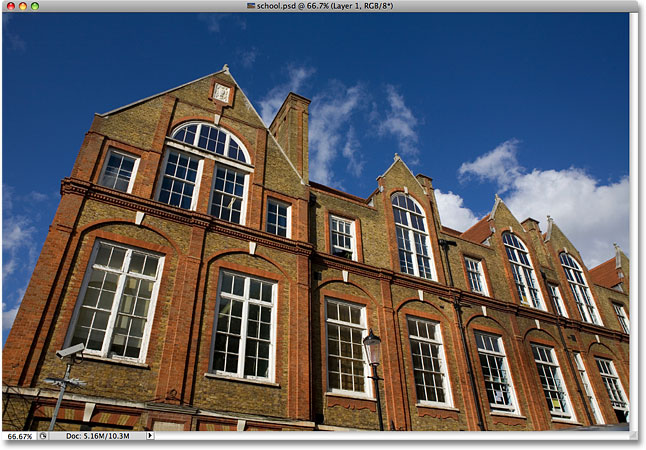
*To select the sky in the photo, I'll need to select around the sides and top of the building.*

I'll begin my selection somewhere along the left side of the building by clicking to set my starting point, then I'll slowly make my way around the outside of the building, clicking to add points as needed. I'll **zoom in** a little to make it easier to see what I'm doing by pressing **Ctrl++** (Win) / **Command++** (Mac) a couple of times. To scroll the image around inside the document window, hold down your **spacebar**, which temporarily switches you to the **Hand Tool**, then click and drag the image to move it. Release your spacebar to switch back to the Polygonal Lasso Tool:

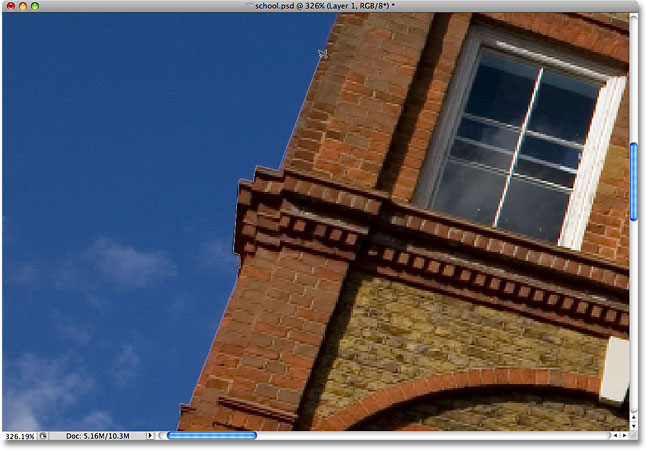
*Better lock your windows. The Polygonal Lasso Tool has no trouble climbing up the sides of buildings.*

### Switching Between The Polygonal Lasso Tool And The Standard Lasso Tool

As I make my way along the top of the building, I come across what appears to be a problem. Part of the design in the roof is actually rounded, which is bad news for the Polygonal Lasso Tool since it can only draw straight-sided selections. Fortunately, Photoshop makes it easy to switch between the Polygonal Lasso Tool and the standard Lasso Tool for occasions such as this. Simply hold down your **Alt** (Win) / **Option** (Mac) key, then begin dragging with your mouse. This temporarily switches you to the standard Lasso Tool, and with it, we can easily trace around any rounded or curved areas of an object:

*Hold Alt (Win) / Option (Mac) and begin dragging to temporarily switch to the standard Lasso Tool.*

Once you've traced along the edge of the rounded or curved surface, release your Alt / Option key, then release your mouse button. You'll switch back to the Polygonal Lasso Tool, at which point you can continue moving around the object and clicking to add more points:

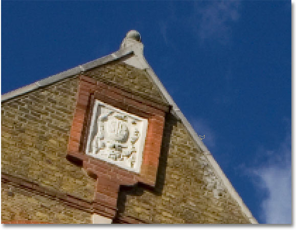
*Release your Alt (Win) / Option (Mac) key, then release your mouse button to switch back to the Polygonal Lasso Tool.*

Once I've finished drawing my selection around the building, I'll make sure I get all of the edge pixels in the sky along the sides and top of the photo by clicking with the Polygonal Lasso Tool into the gray pasteboard area around the photo. If you can't see the pasteboard area, press **Ctrl+-** (Win) / **Command+-** (Mac) a few times to zoom out until the pasteboard appears. Photoshop won't select the pasteboard, it will select only the pixels in the image:

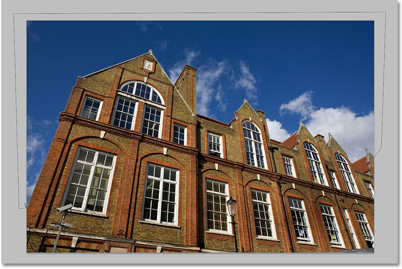
*Clicking inside the pasteboard area around the image is a good way to make sure you select all the edge pixels.*

To complete the selection, I'll click once again on my initial starting point, and with that, the sky in the photo is now selected:

*The sky is ready to be replaced.*

I'm going to zoom back to the 100% zoom level by pressing **Ctrl+Alt+0** (Win) / **Command+Option+0** (Mac). If we look in my Layers panel, we can see that my document is made up of two layers. The photo of the building is on the top layer, and a photo of a dark, cloudy sky sits on the Background layer below it:

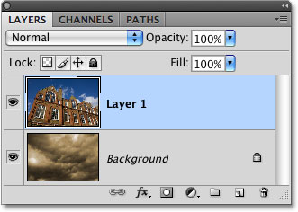
*The clouds I want to replace the sky with are sitting on a layer below the image of the building.*

With the top layer selected, I'm going to hold down my **Alt** (Win) / **Option** (Mac) key and click on the **Layer Mask** icon at the bottom of the Layers panel. This converts my selection into a **layer mask**, and we can see that a **layer mask thumbnail** has been added to the top layer. Normally, the object or area that was selected would remain visible in the document while everything that was not selected would be hidden from view, but by holding down the Alt / Option key, I *inverted* the layer mask, which will hide the sky (the selected area) and keep the building (the unselected area) visible:

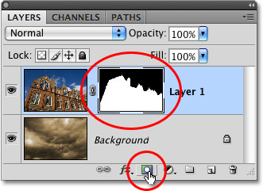
*Black areas in a layer mask are hidden from view in the document. White areas remain visible.*

With the sky in the building photo now hidden, the clouds in the photo below it show through in the document:

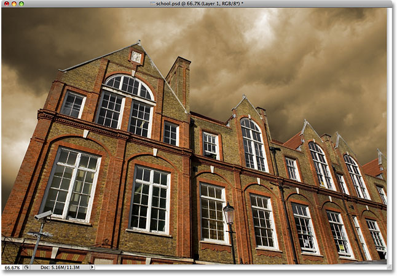
*If you don't like the weather in Photoshop, just wait a few minutes. It'll change.*

### Removing A Selection

In the example above, the selection outline disappeared when we converted it to a layer mask, but normally, when you're done with a selection created with the Polygonal Lasso Tool, you can remove it by going up to the **Select** menu at the top of the screen and choosing **Deselect**, or you can press the keyboard shortcut **Ctrl+D** (Win) / **Command+D** (Mac). You can also simply click anywhere inside of the document with the Polygonal Lasso Tool or with any of Photoshop's other selection tools.