# Photoshop CS3 Essential Preference Settings

> Source: [https://www.photoshopessentials.com/basics/preferences-cs3/](https://www.photoshopessentials.com/basics/preferences-cs3/)
> Downloaded and converted to Markdown.

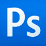

If you've just installed **Photoshop CS3**, whether you've upgraded from an earlier version of Photoshop or this is your first experience with the program, one of the first things you should do is make sure you have everything set up properly in Photoshop's **Preferences**, which have been changed quite a bit in CS3.

You may not find any options here that would, say, cause your computer to explode if set incorrectly, but there are definitely some options that will help both you and Photoshop work more efficiently. We're not going to cover every single preference, since your head would undoubtedly fall onto the keyboard before we made it to the end, but we'll look at some of the more essential ones, the ones that give us the biggest bang for the buck. Or at least, they would if it actually, you know, cost something to make changes to the options, which it doesn't. But if it did, boy, these are the ones I'd be changing if I was looking to get my money's worth.

### How To Access The Preferences

If you've been using a previous version of Photoshop, one of the things you'll notice with CS3 is that Adobe has reorganized and renamed some of the Preferences and even added a couple of brand new categories which we'll look at in a moment. Before we do though, we need to know how to access the Preferences. If you're on a Windows system, go up to the **Edit Menu** at the top of the screen, choose **Preferences**, and then choose **General**. On a Mac, it's a little different. Rather than going up to the Edit menu, go up to the **Photoshop** menu instead, then choose **Preferences**, and then choose **General**. Or, an even faster way to access the Preferences is to use the keyboard shortcut, **Ctrl+K** (Win) / **Command+K** (Mac). Regardless of how you get there, you'll be presented with the Photoshop Preferences dialog box, set to the "General" options:

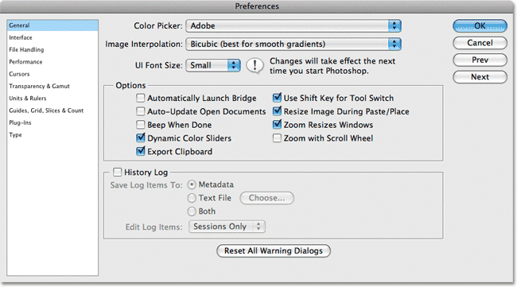
*Photoshop CS3's Preferences dialog box set to the General options.*

One difference to note right away between Photoshop CS3's Preferences dialog box and previous versions of it is that there is no longer a drop-down list at the top where you go to select the various categories. Instead, they're now all listed conveniently along the left-hand side:

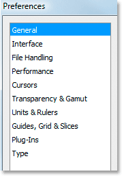
*The various categories are now listed along the left-hand side of the Preferences dialog box.*

Since we already have the "General" Preferences open, let's start by looking at a few important General options.

### General Preferences: Image Interpolation

In the **General** Preferences section, the first option we need to look at is the second one from the top, **Image Interpolation**:

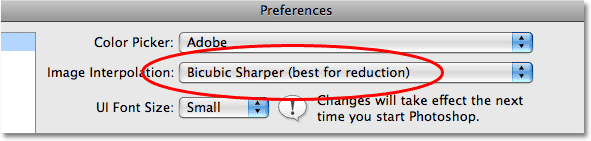
*The "Image Interpolation" option in the General Preferences.*

"Image interpolation" has to do with how Photoshop handles the pixels in your images when you resize them. Photoshop CS3 comes with the same interpolation options that we've had since version CS, so there's nothing new here, but it's important that we set this option correctly because it affects image quality.

The general rule with the interpolation options is that we use **Bicubic Sharper** for **reducing** the size of an image, and **Bicubic Smoother** when **enlarging** images. There's also another general rule though that says we never, ever enlarge images in Photoshop unless we have no other choice because enlarging images forces Photoshop to create new image information out of thin air, which hardly ever works out well. So, since we'll be making our images smaller 99.99% of the time, it's a good idea to set our Image Interpolation option to Bicubic Sharper. Setting this option here also affects other areas in Photoshop, like what happens when we crop or transform images. So go ahead then and set this option to "Bicubic Sharper".

### General Preferences: Automatically Launch Bridge

The next option worth looking at in the General Preferences is **Automatically Launch Bridge**:

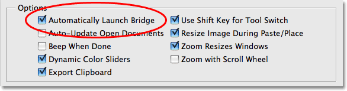
*The "Automatically Launch Bridge" option in the General Preferences.*

This one isn't quite as important as the Image Interpolation option we just looked at, and in fact it's really more of a personal preference, but worth looking at anyway. This option determines whether or not Adobe Bridge will launch automatically when you open Photoshop CS3. If you find that you use Bridge a lot when working in Photoshop, turn this option on. Bridge usually takes a few seconds to load, so if you have it launch with Photoshop instead of manually launching it later, you won't have to sit there waiting for it. If, on the other hand, you don't find yourself using Bridge all that often, leave the option unchecked.

### General Preferences: Export Clipboard

Another option definitely worth looking at in the General Preferences is **Export Clipboard**:

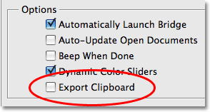
*The "Export Clipboard" option in the General Preferences.*

Unless you're in the habit of copying Photoshop files and pasting them into other programs, which is *highly* unlikely, turn this option off (uncheck it). Leaving it on will only slow your computer down for no good reason and may even throw up a nice little error message from time to time. No need for it.

### General Preferences: Use Shift Key For Tool Switch

Another one of those personal preferences options is **Use Shift Key For Tool Switch**:

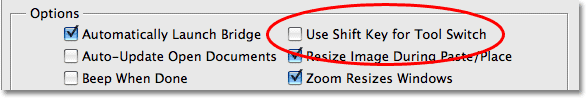
*The "Use Shift Key For Tool Switch" option in the General Preferences.*

This option has to do with how you access tools in Photoshop's Tools palette which are hidden behind other tools. For example, the **[Elliptical Marquee Tool](/basics/selections/elliptical-marquee-tool/)** is hidden by default behind the **[Rectangular Marquee Tool](/basics/selections/rectangular-marquee-tool/)** , yet both of them have a keyboard shortcut of **M**. With this option checked, you would access the Elliptical Marquee Tool by holding down the **Shift** key and then pressing **M**. With the option unchecked, you'd simply press **M** twice, once for the Rectangular Marquee Tool and then again for the Elliptical Marquee Tool. Maybe I'm just lazy, but having to add the Shift key to the keyboard shortcut seems like an unnecessary step. I'd rather just press the letter twice, or three times depending on which tool I'm after. Your choice.

That covers the essential options in the General Preferences. Now let's look at a brand new category in Photoshop CS3 - the **Interface**.

### Interface

Click on the **Interface** option in the list of Preferences categories along the left to bring up the new "Interface" options:

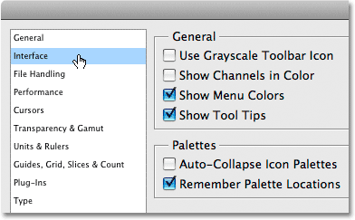
*Photoshop CS3's new "Interface" Preferences category.*

The "Interface" category may be new to Photoshop CS3, but many of the options here are not new at all. They've simply been moved here, and in some cases renamed, from other categories. The **Show Channels In Color** option, which you want to leave unchecked, used to be called "Color Channels in Color" and was found in the "Display & Cursors" category in previous versions of Photoshop. **Show Menu Colors** and **Show Tool Tips** were both previously found in the "General" category, along with **Remember Palette Locations**, which was previously called "Save Palette Locations".

The new option at the top, **Use Grayscale Toolbar Icon**, determines whether the "PS" icon at the top of the Tools palette appears in blue or gray. Here it is in blue, which is the default:

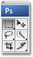
*The 'PS' icon at the top of Photoshop's Tools palette appearing in its default blue color.*

And here it is in gray:

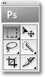
*The 'PS' icon at the top of Photoshop's Tools palette appearing in gray.*

It may not seem like an important option, but I find it helpful to set the icon's color to gray so that the blue color doesn't distract me when working on images. If you prefer to leave it blue, simply leave this option unchecked.

If you're new to Photoshop, I'd suggest leaving **Show Tool Tips** on. Tool Tips are those helpful little descriptions that appear whenever you hold your mouse over something for a second or two. Even if you've been using Photoshop for a while, I'd recommend leaving the Tool Tips on until you become more familiar with CS3, since the interface is quite different now than what we've been used to. Once you become more comfortable inside Photoshop CS3, you can simply return to the Preferences and turn this option off.

You'll want to leave **Remember Palette Locations** checked. With it checked, the next time you launch Photoshop, all of your palettes will appear in the same locations as they were when you last closed out of the program. With it unchecked, the palettes will be reset to their default locations each time you open the program. You can always reset your palette locations any time you want by going up to the **Window menu** at the top of the screen, choosing **Workspace**, and then choosing **Default Workspace**.

That covers everything new and/or important in the "Interface" category. Let's move on to the next one, **File Handling**.

### File Handling

Click on the words "File Handling" in the list along the left to bring up the options in the **File Handling** category. There's really only one option here that we need to look at for now - **Maximize PSD and PSB File Compatibility**:

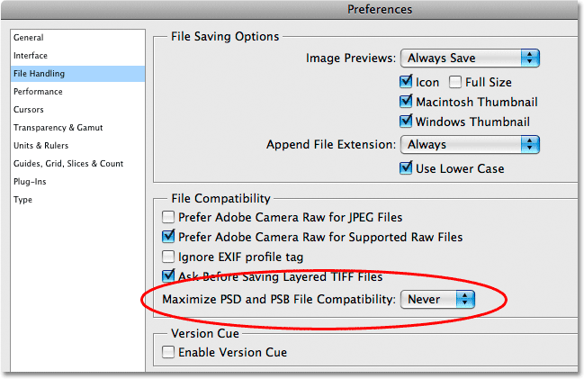
*The "File Handling" Preferences.*

What "Maximize PSD and PSB File Compatibility" does is it saves a flattened version of your image inside your Photoshop document along with all of your layers. You need to have that flattened version included if you're importing your files into, say, a page layout program like InDesign or even a multimedia program like Flash. If you know that you're going to be importing your Photoshop files into other programs like that, go ahead and set this option to **Ask**, which will cause Photoshop to ask you when you go to save the file if you want to include that flattened version of the image. The problem is, that flattened version of the image can increase the size of your file by as much as 30-50%, so if you have no intention of ever importing your files into some other application, there's no need to add to your file size, in which case I highly recommend you set this option to **Never**.

There's a couple of options here that are new to Photoshop CS3 - **Prefer Adobe Camera Raw for JPEG Files** and **Prefer Adobe Camera Raw for Supported Raw Files**:

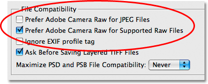
*Photoshop CS3 includes two new "File Handling" options.*

Photoshop CS3 allows us to open both JPEG and TIFF files inside the Camera Raw dialog box, but by default, this option is turned off, and I'd suggest leaving it turned off for now because it's not quite as fun or straightforward as it sounds. The second option simply tells Photoshop to use Camera Raw for raw files, which makes sense and is turned on by default. I'd leave both of these options alone for the time being, but just know that they're there and they're new to CS3.

### Photoshop CS3 Essential Preferences: Performance

Click on the **Performance** category on the left to bring up the new "Performance" options:

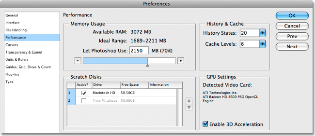
*The new "Performance" Preferences category in Photoshop CS3.*

As you can probably tell from the name, this one has a lot to do with how well Photoshop performs. The "Performance" category in Photoshop CS3 is really a combination of the "Memory & Image Cache" and "Plug-Ins & Scratch Disks" categories from previous versions of Photoshop. It also now contains the "History States" option which used to be located in the "General" Preferences. Let's take a look at each section separately, since they're all important.

### Performance Preferences: Memory Usage

The "Memory Usage" section is where we can set how much of our system memory Photoshop is allowed to use:

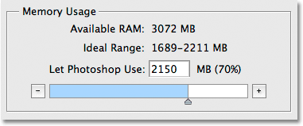
*The "Memory Usage" section in Photoshop CS3's "Performance" Preferences.*

In Photoshop CS3 we can see an "Ideal Range" listed, which is the amount of memory that Adobe recommends we assign to Photoshop based on the amount of available system memory we have. Photoshop automatically assigns an amount for itself based on that ideal range. As we can see in the screenshot above, it's giving itself 70% of my available memory. You can drag the slider bar left or right to increase or decrease the amount of memory available to Photoshop.

It may be tempting to slide the bar all the way to the right and hand over all your system memory to Photoshop, but that's not a good idea. Keep in mind that there's other programs running on your computer as well which all require system memory. I'd recommend leaving this option alone. Chances are, you won't notice any huge performance benefits by giving more memory to Photoshop, since you can never have enough system memory with Photoshop anyway. You're more likely to notice your computer running slower because you've assigned Photoshop too much memory.

### Performance Preferences: Scratch Disks

Below the "Memory Usage" section, we find the all-important **Scratch Disks** option:

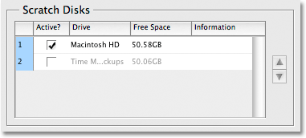
*The "Scratch Disks" section in Photoshop CS3's "Performance" Preferences.*

If there's one option in all of Photoshop's Preferences that has the biggest impact on performance, it's this one. I mentioned a moment ago that you can never have enough system memory with Photoshop. It will always need more memory than what you have. So what does Photoshop do when it runs out of system memory? It turns to the "scratch disk".

What's a scratch disk? It's an area on your computer's hard drive that Photoshop uses as memory. Unfortunately, hard drives are nowhere near as fast as system memory is, so you'll definitely notice a performance decrease whenever Photoshop has to use the scratch disk. There's no way around this, though. Such is life with Photoshop. However, decreased performance is better than the alternative, which is *no* performance. If Photoshop runs out of both system memory and scratch disk space, you'll get an error message telling you that it can't do what you've asked because your scratch disk isn't large enough. To make sure you never run into this problem, it's highly recommended that you buy yourself a second hard drive and then assign that new drive as Photoshop's scratch disk, which you would do here in the Scratch Disk options. You can partition your computer's original hard drive and then assign one of the partitions as your scratch disk, but even that isn't ideal. Your best bet for maximizing Photoshop's performance is to have a second hard drive installed in your computer and assign it as your scratch disk.

### Performance Preferences: History States

Over in the top right corner of the Performance options, you'll find the **History States** option:

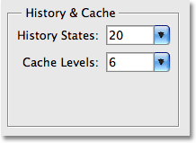
*The "History States" option in Photoshop CS3's "Performance" Preferences.*

This option determines how many undo's you get when working in Photoshop, which you can see in the "History" palette. I usually set mine to 50, which allows me to step back through my last 50 steps. You can set it up to a maximum of 1000 if you like, but you'll most likely run into performance problems if you do. I'd recommend setting your History States to somewhere between 25-50 depending on how much system memory you have. If you find you need more and you haven't noticed any performance problems, you can always come back here and increase it. Likewise, if you're noticing some performance problems, you can come back and try a lower amount. You'll need to close out of Photoshop and relaunch it for the changes to be applied.

That takes care of our look at the essential options in the Performance Preferences. There's only a couple more options we need to look at, and the first one is in the **Cursors** category, which is where we're headed next.

### Cursors

Click on the **Cursors** category on the left to bring up the "Cursors" options:

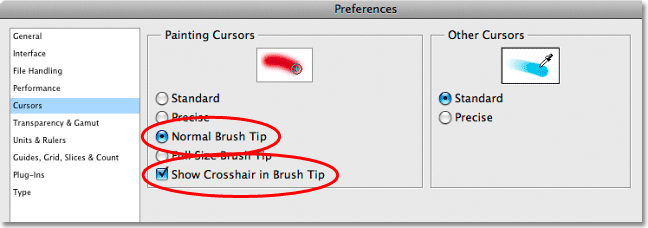
*The "Cursors" Preferences category in Photoshop CS3.*

The "Cursors" category in Photoshop CS3 used to be called "Display & Cursors" in previous versions of Photoshop, but other than the slight name change, the options are mostly the same. As we already saw, the old "Color Channels in Color" option has now been moved to the "Interface" category and renamed "Show Channels in Color", and Adobe has removed the "Use Pixel Doubling" option completely in CS3, since no one knew what it was for anyway.

We won't find any options here that will impact performance, but there is one option we should look at, **Show Crosshair in Brush Tip**, along with the two options directly above it, **Normal Brush Tip** and **Full Size Brush Tip**. I like to have "Show Crosshair in Brush Tip" turned on because it tells Photoshop to display a small crosshair icon directly in the middle of my brush as I'm painting so I always know exactly where the center of my brush is, and I'd recommend you turn it on as well.

As for the two options above it, it's really a personal choice. With "Full Size Brush Tip" selected, Photoshop will make the brush cursor the full size of the brush so you can see exactly how large your brush is, regardless of whether you're using a hard-edge or soft-edge brush. With "Normal Brush Tip" selected, which is what I prefer, if you're using a soft-edge brush, Photoshop reduces the size of the brush cursor to include only the areas where the pixel opacity is 50% or higher, which means the edges of the brush will extend out beyond the size of the brush cursor. Again, it's really a personal preference. Regardless of which type of brush tip you use though, I'd definitely recommend turning "Show Crosshair in Brush Tip" on.

There's just one more Preferences category we need to look at - **Units & Rulers**.

### Units & Rulers

Click on the **Units & Rulers** category on the left to bring up the "Units & Rulers" options:

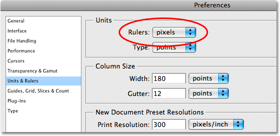
*The "Units & Rulers" category in Photoshop CS3's Preferences.*

The "Units & Rulers" category has been around for a long time in Photoshop, and yet every time a new version of Photoshop comes out, one option is always set wrong, and that's the one at the very top, **Rulers**. Set your rulers to use **pixels**, not inches, centimeters, or anything else. Photoshop is a pixel-based program. Everything inside Photoshop deals with pixels. There's a time and a place for worrying about how large your image will print in inches, and this isn't it, so make sure you set your rulers to use pixels.