# Photoshop CS5 Essential Preferences

> Source: [https://www.photoshopessentials.com/basics/cs5/preferences/](https://www.photoshopessentials.com/basics/cs5/preferences/)
> Downloaded and converted to Markdown.

**Photoshop CS5** is without a doubt the most amazingly powerful version of Photoshop to date, but getting the program to run as smoothly and efficiently as possible means we need to take a look through Photoshop's **Preferences** and make sure everything is set up correctly. Not only can this help to avoid any performance problems, it also gives us the chance to customize Photoshop to better suit our own individual work style.

Of course, if you're just starting out with Photoshop, you probably don't have a "work style" just yet, but one of the nice things about the Preferences is that they can be changed at any time, so once you're more comfortable with the program, you can use this guide to start customizing Photoshop CS5 in ways that feel more natural to you.

Some of Photoshop's Preferences directly affect the program's performance, while others are simply a personal choice (which explains why they're called "Preferences" and not "You Better Use These Settings Or Else-es"). We won't be covering every single option in this tutorial, since most are perfectly fine with their default settings, but there's a few important ones we definitely need to look at, starting with one that can have a major impact on the results you get when resizing images! Let's get started!

### General Preferences

If you're working on a Windows system, you can access Photoshop's Preferences by going up to the **Edit** menu in the Menu Bar along the top of the screen, choosing **Preferences** way down at the bottom of the list of options, and then choosing **General**. On a Mac, which is what I'm using here (it makes no difference which one you're using), go up to the **Photoshop** menu in the Menu Bar, choose **Preferences**, and then choose **General**. Or, for a faster way to access the Preferences, press **Ctrl+K** (Win) / **Command+K** (Mac) on your keyboard. Either way opens up the Preferences dialog box set to the General category. Other categories, like Interface, File Handling, Performance, and so on, can be found and accessed along the left column of the dialog box. We'll get to some of these other categories a bit later:

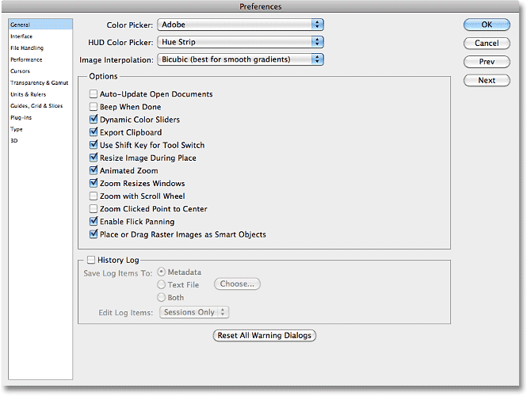

*The Preferences dialog box.*

### Image Interpolation

As I mentioned, we're not going to go through every single option in every single category because most of them are fine just the way they are (and also, we'd both die of boredom), but the first option we do need to look at is **Image Interpolation** up near the top of the dialog box. Image interpolation deals with how Photoshop handles the [pixels](/essentials/pixels.php) in your image when you [resize it](/essentials/resizing-vs-resampling.php). The general rule with Photoshop is that it's okay to make images smaller than their original size, but you want to avoid making them larger whenever possible, since enlarging an image usually results in it looking soft, dull and otherwise blah.

Most of the time (as in 99.99% of the time), if we're resizing a photo, we're making it smaller, so we should choose an interpolation option that will give us the best results when reducing the size of an image, and that option is **Bicubic Sharper**. By default, Image Interpolation is set to Bicubic. Click on the drop-down menu and choose Bicubic Sharper from the list. This preference affects the results we get when resizing images using Photoshop's Image Size dialog box, as well as the Crop Tool and the Free Transform command, which is why it's so important to set it properly here:

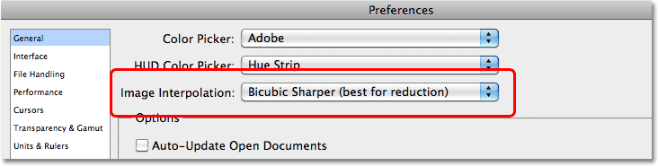

*Change the Image Interpolation option to Bicubic Sharper.*

### Export Clipboard

Another important option in the General Preferences category than can affect your system's performance is **Export Clipboard**. With Export Clipboard enabled, you can copy an image from Photoshop to your computer's memory (the "clipboard") and then paste the image directly into another program you have open, like InDesign, Microsoft Word, and so on. The problem is, images you're working on in Photoshop can be extremely large in file size, and copying these large files to the clipboard can cause serious performance issues. It's not very often (if ever) that you'll find yourself copying images from Photoshop and pasting them into other programs, so unless you work mainly with very small images (like for the web), it's a good idea to leave Export Clipboard disabled by unchecking it:

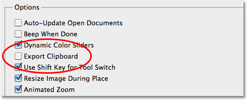

*Turn the Export Clipboard option off.*

### Use Shift Key For Tool Switch

This next option won't affect Photoshop's performance but *will* affect how you select Photoshop's various tools, at least if you're the type who likes to select them using their handy keyboard shortcuts. Photoshop comes with so many tools that Adobe couldn't fit them all inside the Tools panel without nesting some of the tools behind others. For example, the [Polygonal Lasso Tool](/basics/selections/polygonal-lasso-tool/) and the [Magnetic Lasso Tool](/basics/selections/magnetic-lasso-tool/) are both nested behind the standard [Lasso Tool](/basics/selections/lasso-tool/). To select either of them from the Tools panel, we need to click on the Lasso Tool and keep our mouse button held down for a second or two until a fly-out menu appears, then select them from the menu:

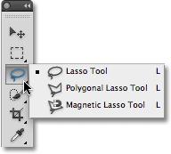

*Many tools are nested behind others in the Tools panel.*

What if we want to select them using their keyboard shortcut? All three tools share the same letter **L** as their keyboard shortcut, just as other tools nested behind each other in the same slot also share the same letter (for example, the [Rectangular Marquee Tool](/basics/selections/rectangular-marquee-tool/) and the [Elliptical Marquee Tool](/basics/selections/elliptical-marquee-tool/) both share the letter M as their shortcut). With the **Use Shift Key For Tool Switch** option enabled in Photoshop's Preferences, we can cycle through all of the tools in the same slot by holding down the Shift key while pressing the keyboard shortcut repeatedly. With the option disabled, there's no need to hold down the Shift key. Simply press the keyboard shortcut repeatedly to cycle through the tools. This is entirely a personal preference, but I prefer leaving this option disabled (unchecked) since having to add the Shift key when cycling though tools just seems like an unnecessary added step:

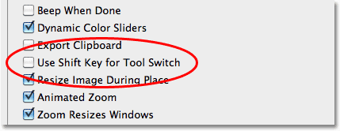

*Leave this option enabled if you prefer adding in the Shift key when cycling through tools with their keyboard shortcuts.*

### Zoom Preferences

The next three options we need to look at all have to do with Photoshop's behavior when [zooming in an out of images](/basics/photoshop-zoom/), and I'd recommend enabling all three of these options. If you're working in Standard screen mode (which is Photoshop's default screen mode), the **Zoom Resizes Windows** option tells Photoshop to resize the document window for you as you zoom in and out. With the **Zoom Clicked Point to Center** option enabled, Photoshop will re-center the image on screen at the spot you clicked on with the Zoom Tool. Finally, if you have a scroll wheel on your mouse, the **Zoom with Scroll Wheel** option lets you zoom in and out of the image using... you guessed it, the scroll wheel:

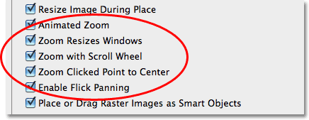

*The Zoom Resizes Windows, Zoom with Scroll Wheel and Zoom Clicked Point to Center options.*

### Interface Preferences

Select the **Interface** category on the left of the dialog box to view options for setting up Photoshop's user interface:

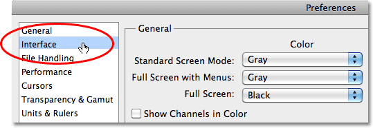

*Select Interface from the list of categories along the left.*

### Image Border

Photoshop CS5 lets us fancy up the screen a little bit by adding a thin border, a drop shadow, or both to the image we're working on. Neither of them are actually part of the image and won't be saved with it. They also won't appear if you print the image. They're simply an attempt to make your work area look a bit more interesting on the screen. This is entirely a personal preference, but you may find, as I do, that they're more distracting than anything else. I'd recommend turning both of them off by setting the **Border** option to **None** for each of Photoshop CS5's three screen modes (Standard, Full Screen with Menus and Full Screen):

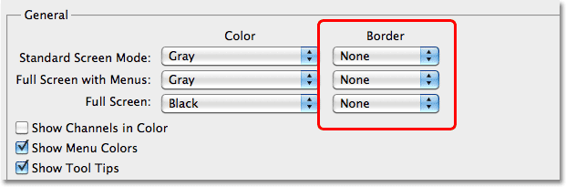

*The border and drop shadow may look cool but can also be distracting. Best to turn them off.*

### Show Tool Tips

Another personal preference is the **Show Tool Tips** option. With Show Tool Tips enabled (as it is by default), Photoshop will display a short description of interface items when you hover your mouse over them. This can be very useful if you're just starting out with Photoshop or if you've upgraded to CS5 and are still trying to learn where the new stuff is and what it does. If you're fairly comfortable with Photoshop CS5, though, having the Tool Tips always popping up can get a little annoying, so in that case, I'd recommend turning them off. You can always come back here later to enable or disable them as needed:

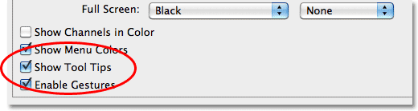

*Photoshop's Tool Tips can be helpful or distracting depending on how familiar you are with the program.*

### Tabbed Documents

Back in Photoshop CS3 and earlier, whenever we opened two or more images at once, each image would appear on screen in its own independent, floating document window. Photoshop CS4 introduced [tabbed document windows](/basics/photoshop-cs4/tabbed-document-windows/), where all of the images appeared nested inside a single document separated by a series of name tabs along the top. Switching between the images was done by clicking on their tabs, sort of like switching between folders in a filing cabinet.

Photoshop CS5 also uses tabbed documents by default, and while some people think they're great, others prefer the old floating document windows, which do make it easier to drag images or layers from one document to another. If you're a fan of tabbed documents, there's no need to change anything in the Preferences, but if you'd rather have your images open in independent document windows, uncheck the **Open Documents As Tabs** and **Enable Floating Document Window Docking** options in the Panels & Documents section of the dialog box. As with any of Photoshop's preferences, you can always come back here at any time to enable or disable these options:

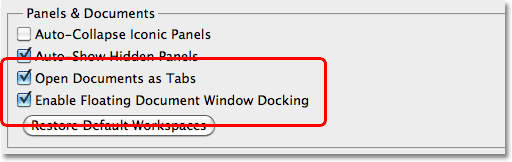

*If you're comfortable working with tabbed documents, leave these two options checked.*

### UI Font Size

If you find that Photoshop's interface text is a little too small for comfort, you can increase its size by changing the **UI Font Size** option to either **Medium** or **Large**. And no, this option isn't just for old folks with poor eye sight. Working on a very high resolution monitor can make Photoshop's interface text appear very small. Personally, I like to set my font size to Large which I find helps to avoid eye strain. You'll need to close and then re-open Photoshop for the change to take effect:

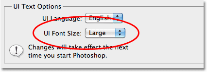

*Change the font size to increase some of the text in Photoshop's interface.*

### File Handling Preferences

Select the **File Handling** preferences category on the left of the dialog box:

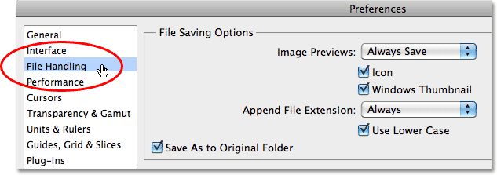

*Select the File Handling preferences category on the left.*

### Ask Before Saving Layered TIFF Files

One of the most popular file formats used in Photoshop is the TIFF format thanks to its excellent image quality and its ability to work with layers. The only annoying problem with it is that every time you go to save your TIFF file, Photoshop asks if you want to save the layers with the file, as if there's any reason why you would not want to keep them. To stop Photoshop from asking, uncheck the **Ask Before Saving Layered TIFF Files** option in the File Compatibility section:

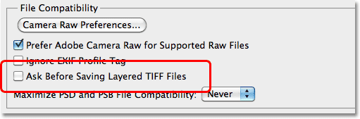

*Do I want to keep my layers? Of course I want to keep my layers! Stop asking me that! Geez.*

### Maximize PSD and PSB File Compatibility

Another important option here is **Maximize PSD and PSB File Compatibility**. What this does is it saves a flattened version of your image along with your layered Photoshop file to make the file compatible with other programs, or with older versions of Photoshop, that can't open or work with the file without that flattened version being included. The problem is that including the flattened version can add as much as 50% more to your file size, which means you don't want to include it if you don't have to. So the question then becomes, do I need to include it?

If you only ever work on your images in Photoshop, and only in a recent version of the program, the answer is no, so I'd recommend setting this option to **Never**. If, on the other hand, you're also a **Lightroom** user, Lightroom needs that flattened version to be included in the file, so in that case, set the option to **Ask**, which means Photoshop will ask you if you want to maximize file compatibility when you go to save the Photoshop file, at which point you can click either Yes or No depending on whether or not the file will also be used with Lightroom:

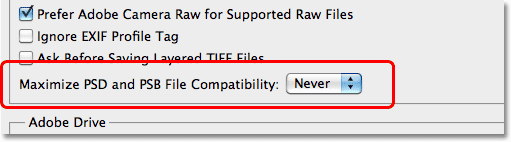

*For Lightroom users, set this option to Ask, otherwise set it to Never.*

### Recent File List

The third and final option we should look at in the File Handling category is the **Recent File List**, which sets the number of recently opened files you can access in Photoshop when you go up to the **File** menu at the top of the screen and choose **Open Recent**. The default value is 10, which is pretty low. I'd recommend increasing it to at least 20 since it won't have any negative impact on Photoshop's performance:

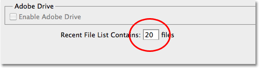

*Increase this option to 20 or more to access more recently opened files.*

### Performance Preferences

Moving down the list, select the **Performance** category of preferences on the left of the dialog box:

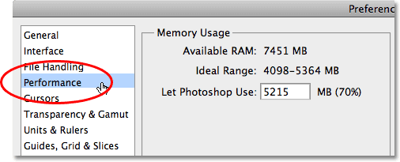

*Select the Performance category.*

### Memory Usage

As the category name implies, these options can have a big impact on Photoshop's performance, beginning with the first option we'll look at - **Memory Usage**. Photoshop *loves* memory. The more memory (RAM) you have in your computer, the better, especially if you work with very large files with lots of layers. In fact, adding more memory to your system (along with upgrading your video card) is the best way to give Photoshop CS5 a performance boost. By default, Photoshop will reserve around 70% of your computer's available memory for itself, which leaves some available for other programs you may have open at the same time. For most users, this default setting is good enough, but if you're a power user needing every last byte of memory, try turning off all other programs (you can chat with your friends later) and increasing Photoshop's memory usage percentage to around 90% by dragging the slider towards the right:

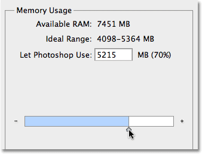

*The default memory usage percentage of 70% is usually fine, but power users may want to increase it.*

### History & Cache

The **History & Cache** section in Photoshop CS5 has some rather strange sounding options - **Tall and Thin**, **Default** (okay, Default isn't so strange sounding), and **Big and Flat**. Don't worry, those first and third options have nothing to do with your body shape. Instead, they help customize Photoshop's performance to the type of file you're working on. If you're working on a relatively small size image but you've added lots of layers, try selecting the **Tall and Thin** option and see if Photoshop runs any better. If you're working on a big image with only a few layers, try the **Big and Flat** option. In most cases though, sticking with the **Default** option is fine.

The **History States** option determines how many undos you get when working on an image (and how many steps are displayed in the History panel). Increasing it beyond the default value of 20 will give you more undos but will also take up more system memory. If you're working on a large file and Photoshop seems to be slowing down, try reducing the number of history states to free up some memory:

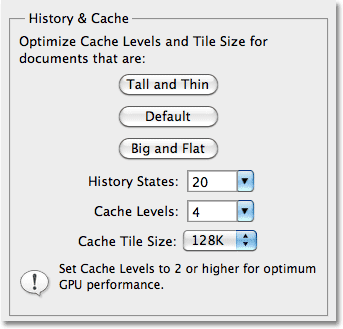

*The new History & Cache section.*

### Scratch Disks

If your computer runs out of memory while you're working on an image, Photoshop doesn't suddenly stop working. Instead, it uses part of your computer's hard drive as if it was system memory. The part of the hard drive Photoshop uses is known as the **scratch disk**. Unfortunately, your hard drive is nowhere near as fast as actual system memory, so whenever Photoshop has to use the scratch disk, it will run much slower. As I mentioned earlier, the best way to improve Photoshop's performance is to add more memory to your computer, but sometimes, no amount of memory is enough.

We can help the situation a little by making sure that Photoshop is using the fastest hard drive in our system for the scratch disk. If you only have one hard drive in your system (as I do in my iMac), obviously you have no choice but to use that drive. Ideally though, if you have the option, installing a second, fast, internal hard drive and assigning it as your scratch disk will give you the best results. Don't use an external USB drive as your scratch disk since the connection speed is too slow. To assign an internal hard drive as your scratch disk, simply place a checkmark beside its name in the list and leave any other hard drives unchecked:

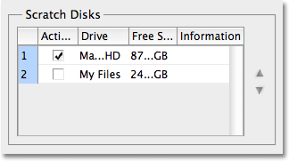

*Scratch Disks tells Photoshop which hard drive to use if it runs out of system memory.*

### Enable OpenGL Drawing

One of Photoshop CS5's big strengths is its ability to take advantage of the OpenGL technology found in most of today's higher end video cards. To use the OpenGL features, make sure the **Enable OpenGL Drawing** option is selected in the GPU Settings section. If you have a newer video card that supports OpenGL, Photoshop CS5 will most likely recognize it and automatically select the option for you. If the option is grayed out and you can't select it, first make sure you have the latest drivers installed for your video card, otherwise your video card is probably outdated and you'll need to upgrade to a newer one that supports OpenGL:

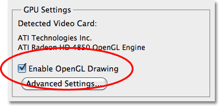

*Photoshop CS5 supports OpenGL technology as long as your video card does as well.*

### Cursors Preferences

Next, select the **Cursors** preferences category on the left of the dialog box:

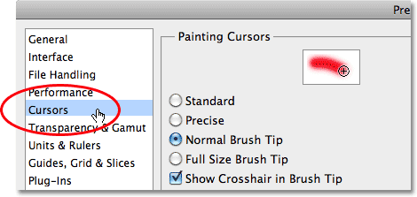

*Choose Cursors from the list on the left.*

Most of the options in the Cursors category have to do with cursors for the brush-related tools (the actual [Brush Tool](/basics/photoshop-brushes/brush-dynamics/), [Healing Brush](/photo-editing/healing-brush/), the [Spot Healing Brush](/photo-editing/spot-healing-brush/), etc). By default, the **Normal Brush Tip** option is selected and that's fine. The only other option here that you may want to select is **Show Crosshair in Brush Tip**, which places a small crosshair in the center of the brush cursor, making it easy to see its exact midpoint as you paint. I like to work with this option enabled, but it's another one of those personal preferences:

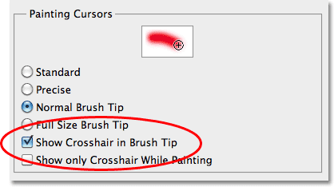

*Check the Show Crosshair in Brush Tip option if you want a small crosshair in the center of the brush cursor.*

### Units & Rulers Preferences

We can skip over the Transparency & Gamut category since there's nothing there we need to change. Choose the **Units & Rulers** category on the left of the dialog box:

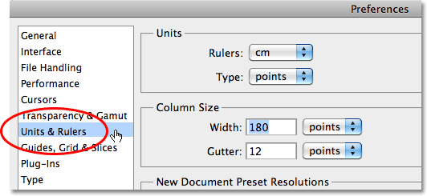

*Choose Units & Rulers on the left.*

### Rulers

The one important option we need to change here is up at the top of the dialog box in the Units section. By default, **Rulers** is set to **inches** which makes no sense. Photoshop is a [pixel-based program](/essentials/pixels.php). The whole point of Photoshop is to change the pixels in your image in some way. Measurement types like inches, centimeters and so on have nothing at all to do with the image until you go to [print](/essentials/image-resolution.php) it later. Since we work with pixels, change the measurement type for the Rulers option to **pixels**:

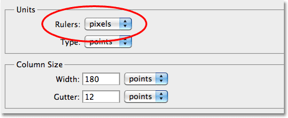

*Photoshop is a pixel-based program, so the rulers should be measuring pixels, not inches or any other print-related type.*

### Type Preferences

Finally, skip down to the **Type** category on the left of the dialog box:

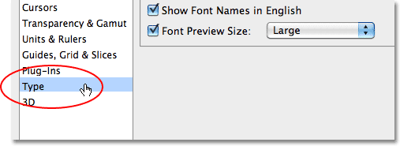

*Choose the Type category on the left.*

### Font Preview Size

When choosing a font from the Options Bar (with the Type Tool selected), Photoshop CS5 shows us a preview of what the font looks like to the right of each font's name. Depending on the font, though, its preview can appear too small to be of any use. We can increase the font preview size by changing the appropriately-named Font Preview Size option here in Photoshop's Preferences. The default value is Medium. I like to change mine to **Large** (you can also choose either Extra Large or Huge if you want to get really crazy):

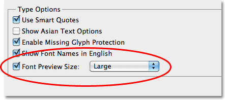

*Increase the Font Preview Size for larger font previews in the Options Bar.*

With the option set to Large, I now get a nice, easy to see preview of each font while scrolling through them in the Options Bar:

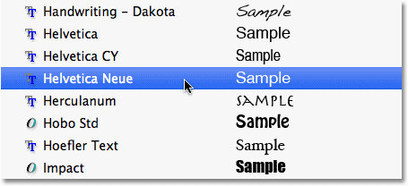

*The name of each font is listed on the left with a preview of it on the right.*