# Preview Layer Blend Modes on the Fly in Photoshop

> Source: [https://www.photoshopessentials.com/basics/preview-layer-blend-modes-photoshop-cc-2019/](https://www.photoshopessentials.com/basics/preview-layer-blend-modes-photoshop-cc-2019/)
> Downloaded and converted to Markdown.

Choosing layer blend modes is now easier than ever with blend mode live previews, a new feature in Photoshop CC 2019! Preview the effects of blend modes before you select them!

With so many layer blend modes to choose from in Photoshop, finding the one you need can be a challenge. Or at least, it *was* a challenge in previous versions of Photoshop. But with CC 2019, we can now preview the effects of blend modes on our image before selecting them. And this makes choosing the right blend mode for the job easier than ever.

Of course, you can still cycle through blend modes from your keyboard, just like we could in previous versions. But by the end of this tutorial, I think you'll agree that the live preview feature in CC 2019 is the new best way to experiment and try out different blend modes in Photoshop! You'll need the [latest version of Photoshop](https://prf.hn/l/dlXjD2w) to follow along. And if you're already an Adobe Creative Cloud subscriber, make sure that your copy of Photoshop is [up to date](/basics/update-photoshop-cc/). Let's get started!

## Blending images in Photoshop

For this quick lesson, I'll blend a texture with an image using layer blend modes. I'll use [this image](https://prf.hn/l/9myqby9) that I downloaded from Adobe Stock:

*The original image. Photo credit: Adobe Stock.*

And if we look in the [Layers panel](/basics/layers/layers-panel/), we see that I also have a texture sitting on a layer above it. I'll turn the texture on by clicking its **visibility icon**:

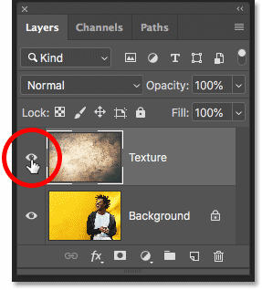

*Turning on the texture image.*

And here we see the [texture](https://prf.hn/l/ER9eXpL), also from Adobe Stock:

*The texture that will be blended with the image. Photo credit: Adobe Stock.*

### Where are the blend modes in Photoshop CC 2019?

In Photoshop CC 2019, the **Blend Mode** option is found in the same place it has always been, in the upper left of the Layers panel:

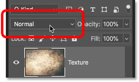

*The Blend Mode option in the Layers panel.*

And while CC 2019 does not give us any *new* blend modes, it *does* make finding the one we need a whole lot easier. Which is great since Photoshop includes 27 blend modes to choose from (if you include the Normal blend mode at the top):

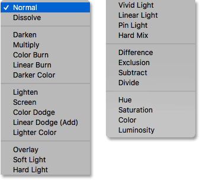

*The complete list of layer blend modes.*

## How to cycle through blend modes from your keyboard

Before Photoshop CC 2019 came along, the easiest way to try out different blend mode was to cycle through them from your keyboard. And you can still do that in CC 2019. First, make sure you have a tool selected in the [Toolbar](/basics/photoshop-tools-toolbar-overview/) that does not include its own blend modes. The **Move Tool** works great:

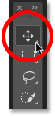

*Selecting the Move Tool.*

Then, to cycle through the blend modes from your keyboard, press and hold your **Shift** key, and press the **plus** key ( **+** ) to move down through the list. Or press the **minus** key ( **-** ) to move back up:

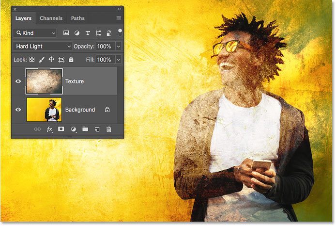

*Hold Shift and press + or - to cycle through the blend modes.*

[Learn more layer blend mode tips and tricks!](/basics/blend-mode-tips-tricks/)

## How to preview blend modes in Photoshop CC 2019

While that's one way to work, in Photoshop CC 2019, there's now an even *faster* way to test out layer blend modes. And that's by previewing the blend modes on the fly.

### Step 1: Open the Blend Mode menu in the Layers panel

Just click on the **Blend Mode** option in the Layers panel to bring up the menu:

*Clicking the Blend Mode option.*

### Step 2: Hover your cursor over a blend mode

Then, simply hover your mouse cursor over a blend mode in the list. There's no need to select it. Just hover over it:

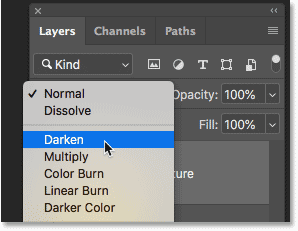

*Hovering the cursor over a blend mode's name.*

### Step 3: View the blend mode preview in the document

And just by hovering over its name, Photoshop now shows you a **live preview** of what that blend mode will look like in your document. As you make your way down the list, hovering over each blend mode, the preview will instantly update. This makes it super easy to find the effect you're looking for:

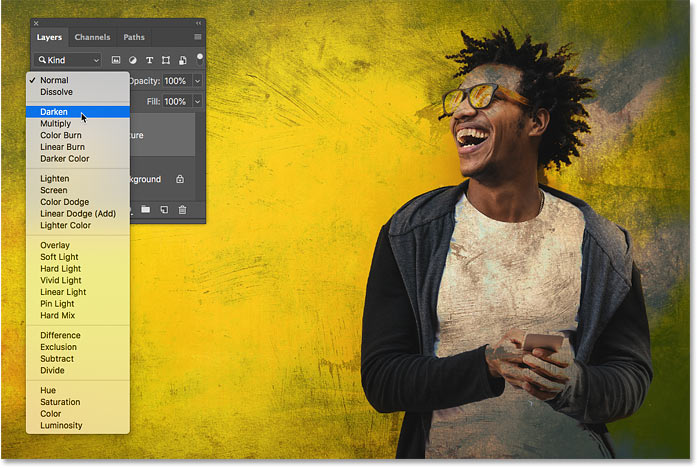

*A live preview of the blend mode appears when you hover over its name.*

#### Previewing the Darken group of blend modes

For example, I can try out the different Darkening modes, starting with **Darken** and ending with **Darker Color**, just by hovering over each one in the group. Here's a preview of what the **Multiply** blend mode will give us. Again, I'm just hovering over its name. I'm not actually selecting it:

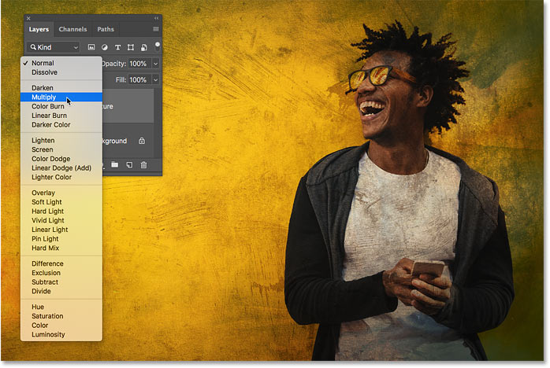

*Previewing the Multiply blend mode.*

#### Previewing the Lighten blend modes

If those are too dark, I can preview the blend modes in the Lighten group, starting with **Lighten** and ending with **Lighter Color**. And here's a preview of what the **Screen** blend mode would look like. In this case, I think it's too bright, but that's okay because we haven't actually selected anything. We're just previewing the results:

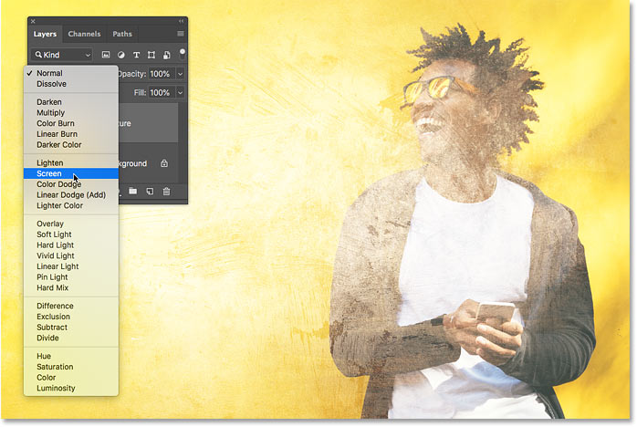

*The Screen blend mode preview.*

#### Previewing the Contrast blend modes

For a higher contrast effect, I can hover over the blend modes from the Contrast group, which include **Overlay** and **Soft Light**, all the way down to **Hard Mix**. And here's a preview of what the **Hard Light** blend mode will give us:

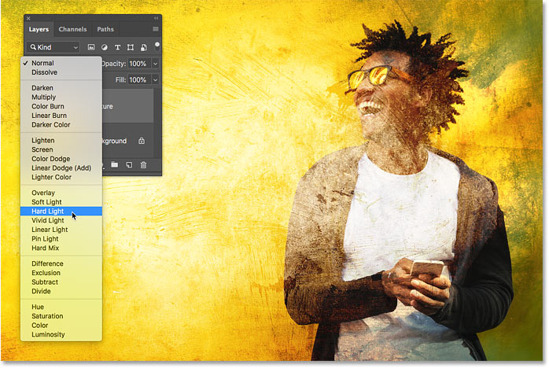

*Previewing the Hard Light blend mode.*

### Step 4: Select the blend mode you need

You can preview the other blend modes as well, again just by hovering your cursor over their name. Once you've found the effect you like best, click on the blend mode to select it. In my case, I'll go with **Multiply**:

*After previewing them, click on a blend mode to select it.*

### Step 5: Lower the intensity of the blend mode (optional)

Finally, if the effect of the blend mode is too strong, you can reduce it by lowering the **Opacity** value, found directly beside the Blend Mode option. I'll lower mine to 60%:

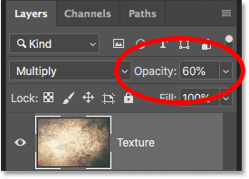

*Lowering the layer opacity to reduce the intensity of the blend mode.*

And here, thanks to the new blend mode previews, is my final result with the texture now blended in with the image:

*The final blending effect.*

And there we have it! That's how to preview layer blend modes on the fly, a brand new feature in Photoshop CC 2019! Check out our [Photoshop Basics](/basics/) section for more tutorials. And don't forget, all of our Photoshop tutorials are now availabel to [download as PDFs](/print-ready-pdfs/)!