# The Quick Selection Tool In Photoshop

> Source: [https://www.photoshopessentials.com/basics/selections/quick-selection-tool/](https://www.photoshopessentials.com/basics/selections/quick-selection-tool/)
> Downloaded and converted to Markdown.

In a previous Photoshop tutorial, we learned how the [Magic Wand Tool](/basics/selections/magic-wand-tool/) works and why it can be a great choice for selecting areas of similar tone and color. In that tutorial, we used the Magic Wand to easily select the clear blue sky in an image, which we then replaced with one that was a bit more interesting. But if any of Photoshop's selection tools deserve to be called "magic", it's not the Magic Wand. It's the tool we'll be looking at in this tutorial - the **Quick Selection Tool**.

First introduced in Photoshop CS3, the Quick Selection Tool is somewhat similar to the Magic Wand in that it also selects pixels based on tone and color. But the Quick Selection Tool goes far beyond the Magic Wand's limited abilities by also looking for similar textures in the image, which makes it great at detecting the edges of objects. And unlike the Magic Wand where we click on an area and hope for the best, the Quick Selection Tool works more like a brush, allowing us to select areas simply by "painting" over them!

In fact, as we'll see in this tutorial, it often works so well and so quickly that if you're using Photoshop CS3 or higher (I'm using Photoshop CS5 here), the Quick Selection Tool could easily become your main selection tool of choice.

This tutorial is from our [How to make selections in Photoshop](/basics/make-selections-photoshop/) series.

### Selecting The Quick Selection Tool

To select the Quick Selection Tool, click on its icon in Photoshop's Tools panel, or press the letter **W** on your keyboard to select it with the shortcut:

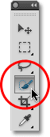

*The Quick Selection Tool is found near the top of the Tools panel.*

### Making Selections

Here's an image I have open in Photoshop:

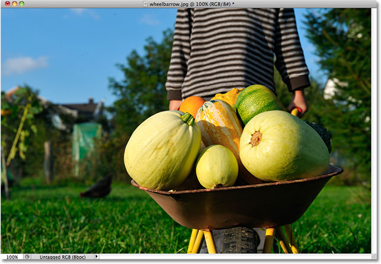

*The original image.*

For this image, I'd like to keep the original colors in the main subject (the child pushing the wheelbarrow filled with pumpkins) and colorize the rest of the background with a single color. To do that, I'll first need to select the main subject. I could try drawing a freehand selection around everything with the [Lasso Tool](/basics/selections/lasso-tool/), but Lasso Tool selections tend to look rough and unprofessional. The [Pen Tool](/basics/pen-tool-selections/) would work great with this image thanks to all the sharp edges and smooth curves, but drawing a path around the main subject would take some time. The [Magnetic Lasso Tool](/basics/selections/magnetic-lasso-tool/) would also work well due to the strong contrast between the main subject and the background. But let's see how well the Quick Selection Tool can select the area we need.

To begin my selection, I'll move the Quick Selection Tool's cursor into the top left corner of the child's sweater and I'll click once with my mouse. An initial selection outline appears around the area I clicked on:

*An initial selection outline appears in the top left of the sweater.*

So far so good, but obviously there's much more I still need to select, which means I'll need to add to my existing selection. Normally, to [add to a selection](/photo-editing/basic-selections/), we need to hold down the Shift key on the keyboard to switch the tool to its "Add to selection" mode, but the Quick Selection Tool is different. It's already in "Add to selection" mode by default, indicated by the small plus sign (+) displayed in the center of the tool's cursor.

If you look in the Options Bar along the top of the screen, you'll see a series of three icons which let us switch between the tool's three selection modes (from left to right - **New selection**, **Add to selection** and **Subtract from selection**). The "Add to selection" option (middle one) is already chosen for us, since the whole point of the Quick Selection Tool is to continue adding to the selection until you've selected everything you need:

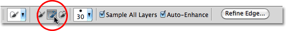

*The "Add to selection" mode is already chosen by default with the Quick Selection Tool.*

There's two ways to use the Quick Selection Tool. One is to simply click on different areas of the image just like we would with the Magic Wand, and just as I did a moment ago to begin my selection. The more common way, though, is to click and drag over the area you need to select as if you were painting with a brush. As you drag, Photoshop continuously analyzes the area, comparing color, tone and texture, and does its best job to figure out what it is you're trying to select, often with amazing results.

To add to my initial selection, then, I'll simply click and drag along the left edge of the sweater. The area I drag over is added to the selection. As long as I keep the cursor inside the sweater and don't drag over the sky or the trees in the background, only the sweater itself gets added:

*Keep the cursor over the area you want to add to the selection.*

If I do accidentally extend my cursor into the background area, the background gets added to the selection as well, which isn't what I want. If that happens, press **Ctrl+Z** (Win) / **Command+Z** (Mac) on your keyboard to undo it and try again. A bit later on, we'll see how to remove unwanted areas of a selection with the Quick Selection Tool, but a good habit to get into here is to not try to select everything in a single drag. If you do, and you make a mistake and need to undo it, you'll undo everything you've done. Using a series of short drags, releasing your mouse button between each one, is a better and safer way to work:

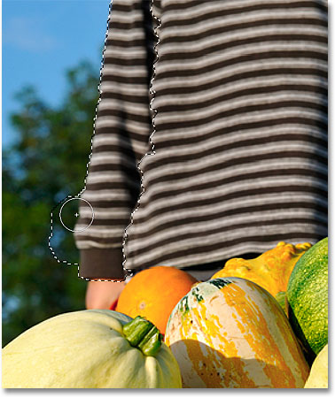

*Part of the background is accidentally selected. Press Ctrl+Z (Win) / Command+Z (Mac) to undo.*

I'll continue clicking and dragging over the sweater to add it to my selection:

*Adding the rest of the sweater to the selection was as easy as dragging over it.*

**Resizing The Cursor**
If you have a large area to select, you may want to increase the size of the cursor so you won't need to drag as much (I know, us Photoshop users can be a lazy bunch sometimes). Likewise, selecting smaller areas often requires a smaller cursor. The Quick Selection Tool's cursor can be resized quickly from the keyboard the same way we'd resize a brush. Press the **left bracket key** ( **[** ) to make the cursor smaller or the **right bracket key** ( **]** ) to make it larger. Typically, a smaller cursor will give you more accurate results.

I'll increase my cursor size a little and continue dragging over the pumpkins and the wheelbarrow to add them to my selection. In the few seconds it took me to drag over things with the Quick Selection Tool, Photoshop was able to do a pretty outstanding job of selecting my main subject for me:

*The initial selection of the main subject is complete. Estimated time: 10 seconds.*

### Subtracting From A Selection

The Quick Selection Tool did an impressive job with the initial selection of my main subject, but it's not perfect. There's a few areas here and there that need to be removed from the selection, like this gap between the sweater and the child's arm where the background is showing through:

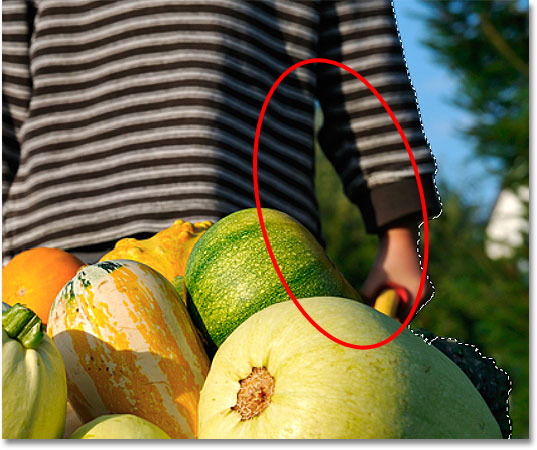

*The Quick Selection Tool selected a few areas that shouldn't have been included.*

To remove an area from a selection, hold down your **Alt** (Win) / **Option** (Mac) key, which temporarily switches the Quick Selection Tool to **Subtract from selection** mode (you could also select the "Subtract from selection" option in the Options Bar but you'd need to remember to switch it back to the "Add to selection" mode when you're done). The small plus sign in the center of the cursor will be replaced with a minus sign (-). Then, with Alt / Option still held down, click and drag inside the area you need to remove. I'll need to make my cursor smaller here by pressing the left bracket key a few times:

*Hold down Alt (Win) / Option (Mac) and drag over areas you need to remove from the selection.*

I'll do the same thing along the bottom of the wheelbarrow where the background is showing through. It often helps to [zoom in](/basics/photoshop-zoom/) on the image to remove smaller areas like these:

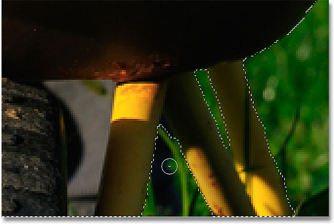

*A few more unwanted areas to remove.*

And with that, my selection is complete! Not bad at all for a minute or two's worth of effort:

*The final selection.*

With my main subject now selected, to colorize the background, I'll **invert** the selection by pressing **Shift+Ctrl+I** (Win) / **Shift+Command+I** (Mac), which will deselect my main subject and select everything around it instead. Then I'll click on the **New Adjustment Layer** icon at the bottom of the Layers panel:

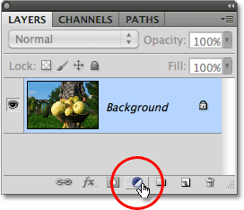

*The New Adjustment Layer icon.*

I'll choose a **Hue/Saturation** adjustment layer from the list:

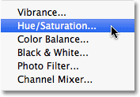

*Choosing a Hue/Saturation adjustment layer.*

If you're using Photoshop CS5 as I am, the Hue/Saturation controls will appear in the Adjustments Panel. In CS4 and earlier, the Hue/Saturation dialog box will appear. To colorize the image, I'll select the **Colorize** option by clicking inside its checkbox. Then I'll drag the **Hue** slider a little towards the right to select a brown color similar to the color of the wheelbarrow:

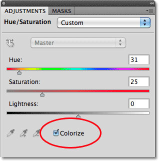

*Select "Colorize", then dial in a color with the Hue slider.*

Click OK to exit out of the Hue/Saturation dialog box when you're done (Photoshop CS4 and earlier only). Finally, I'll change the **[blend mode](/photo-editing/layer-blend-modes/)** of my adjustment layer to **Color** so that only the colors in the image, not the brightness values, are affected:

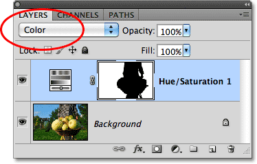

*Change the blend mode to "Color".*

Here, after changing the blend mode to Color, is my final result:

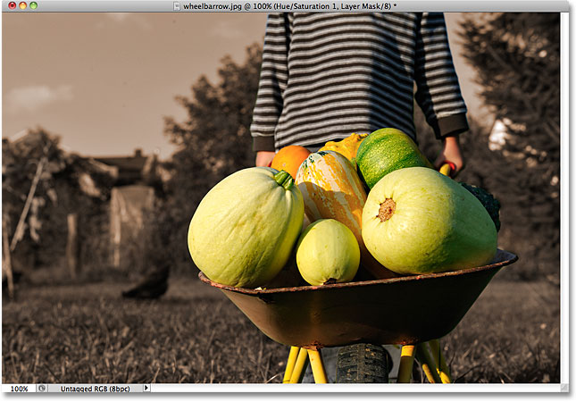

*The Quick Selection Tool made colorizing the background easy.*

### Additional Options

The Quick Selection Tool includes a couple of additional options in the Options Bar. If your document contains multiple layers and you want Photoshop to analyze all the layers when making the selection, check the **Sample All Layers** option. Leaving it unchecked tells Photoshop to include only the layer that's currently active (highlighted in blue) in the Layers panel:

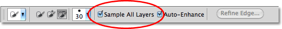

*Choose "Sample All Layers" if you want to include multiple layers in the selection.*

If you're running Photoshop on a fairly powerful computer, selecting the **Auto-Enhance** option can produce smoother, higher quality selection edges (they tend to look a bit blocky on their own), but you may find the Quick Selection Tool takes slightly longer to do its thing with Auto-Enhance enabled. I'd suggest turning Auto-Enhance on unless you find yourself running into performance problems:

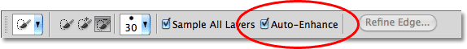

*Auto-Enhance can give smoother results but may result in slower performance.*

And there we have it! For more about Photoshop's selection tools, see our [How to make selections in Photoshop](/basics/make-selections-photoshop/) series. Visit our [Photoshop Basics](/basics/) section for more Photoshop tutorials!