# Adobe Bridge CS4 Quick Tour

> Source: [https://www.photoshopessentials.com/basics/adobe-bridge-cs4/quick-tour/](https://www.photoshopessentials.com/basics/adobe-bridge-cs4/quick-tour/)
> Downloaded and converted to Markdown.

Thanks to digital cameras and the ever-expanding storage capacity of memory cards, photographers everywhere now have the freedom and flexibility to snap as many photos as we like of family, friends, special occasions, or whatever happens to catch our eye or capture our interest and imagination.

Often, we end up taking far more photos than we'll ever need because it's just so darn easy to keep pressing the shutter button until the memory card is full. And even then, if you have an extra card or two (or ten) in your pocket, it takes all of a few seconds to swap out the old card, pop in a new one  and you're off to the races once again. It never fails to amaze me how quickly I can fill up a memory card with hundreds of images without realizing it, which is why I never leave home without first making sure I have extra memory cards  tucked safely into my camera bag. Now, if I can just remember to bring the camera bag with me, but then life would be just a little too easy.

The problem, though, with all this newly acquired photographic freedom is that it can quickly lead to chaos, confusion and frustration if we don't realize that what we do with our photos at the end of the day is every bit as important as the images themselves. If all you have is a hand full, or even a few dozen photos, organizing them is no big deal. But if you have hundreds, thousands or tens of thousands of photos stored on your computer, keeping track of them can become a nightmare, and there's not much point in taking photos if you can never find them when you need them.

Fortunately, Adobe has created a great program to help us  organize and manage our images called **Adobe Bridge**, or simply Bridge. Bridge is a standalone application,  but it's included free with Photoshop, whether you purchased Photoshop on its own or as part of a Creative Suite package. It first appeared with Photoshop CS2 as a replacement for the old File Browser from previous versions of Photoshop, and it's gotten better and better with each new release. In this series of tutorials, we're going to look specifically at **Bridge CS4** which ships with **Photoshop CS4**. We'll start with a quick, general tour of the program to see what's what and where it all is, then we'll look at how to use Bridge CS4 to download our photos from the camera or memory card to the computer. Once we have the images safely downloaded, we'll see how easy it is to preview, review, rate, label, move, copy, reject and delete, rename, rotate and filter images, how to save them as collections, how to add metadata and keywords, and more, all from directly within Bridge!

Let's get started!

#### Launching Bridge

There's a few different ways to launch Bridge. If you already have Photoshop CS4 open, you can go up to the **File** menu at the top of the screen in Photoshop and choose the **Browse in Bridge** command, or you can press the keyboard shortcut **Ctrl+Alt+O** (Win) / **Command+Option+O** (Mac) (that's a letter O, not a zero). The fastest and most common way, though, to open Bridge is by clicking on the **Launch Bridge** icon in the **[Application Bar](http://www.photoshopessentials.com/basics/photoshop-cs4/interface/)**. If you're on a Mac as I am here, the Application Bar is located directly below the Menu Bar along the top of the screen. On a PC, the Application Bar is located to the right of the Menu Bar:

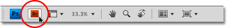
*The easiest way to launch Bridge is by clicking on the Launch Bridge icon in the Application Bar.*

Whichever way you choose, the Bridge interface will appear on your screen, with three main columns of panels dividing up the interface vertically and a series of icons and options along the top, as well as a few more in the bottom right corner. By default, the column in the middle is where we find the **Content** panel which displays thumbnail versions of the images inside the currently selected folder:

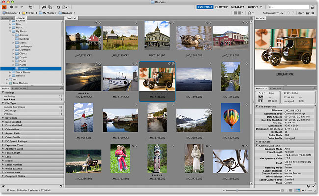
*The Bridge CS4 interface gives us three main columns of panels, plus some icons and options above and below them.*

Bridge isn't that difficult to learn, but there's a lot to cover to get the most out of the program. Before we go digging into specifics, let's take a quick tour of all the different panels and options we're seeing on the screen, starting with the icons in the top left corner.

#### The Browse Buttons

In the top left corner of the Bridge CS4 interface are the **Browse** buttons (the left and right-pointing arrows) which act just like the Browse buttons in your favorite web browser. As you navigate through different folders on your computer using Bridge, you can click on the Back and Forward icons to move back and forth through your browsing history:

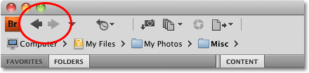
*Use the Back (left) and Forward (right) arrows to move through your folder browsing history.*

#### Parent Or Favorites

To the right of the Browse buttons is a small, down-pointing arrow. Clicking on it opens a menu that let's you quickly select any of the parent folders of the folder you're currently in, or you can jump to any of the folders or directories that appear in your Favorites panel, which is a topic we'll save for later:

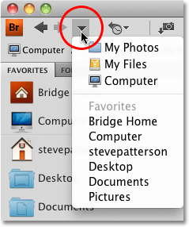
*Click the down-pointing arrow to quickly select any parent folders or any of your Favorites.*

#### Recent Files Or Folders

Next to the down-pointing arrow is the **Recent Files or Folders** icon. Click on it to reveal a list of the files you've recently viewed and the folders you've visited. Bridge works with all of the programs in the Creative Suite, not just Photoshop, so if you've opened any files for Illustrator, InDesign, Flash, etc., they'll appear here, too. To clear the list, click on the **Clear Recent Files** and **Clear Recent Folders** options at the bottom of the menu:

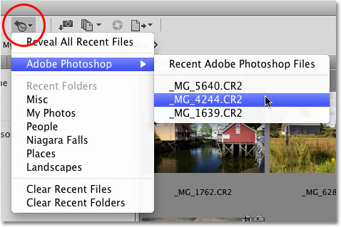
*Click the Recent Files or Folders icon to quickly access any recently viewed files or folders.*

#### The Path Bar

All of the icons we've looked at so far have had something to do with navigating through our files and folders, and directly below these icons is one of my  favorite navigation options in Bridge CS4, the **Path Bar**. The Path Bar shows us the full file path to the folder we're currently looking at. For example, I'm currently viewing a bunch of random images I've collected inside a folder appropriately named  "Random", which is inside the larger "My Photos" folder, which is inside the "My Files" directory, and so on. We can see this entire file path in the Path Bar. But what makes the Path Bar so useful is that if you click on any of the directories listed in the Path Bar, you'll jump instantly to that folder:

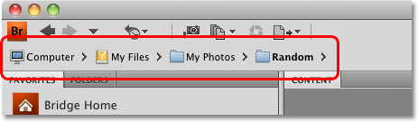
*Click on any of the directories listed in the Path Bar to jump right to it.*

#### Get Photos From Camera

As we continue  with the icons along the top left of the Bridge CS4 interface, we arrive at a small camera icon with a down-pointing arrow. This is the **Get Photos From Camera** option, which we'll look at in the very next tutorial. Clicking on this icon opens the **Photo Downloader**, which is where we can select the device we want to download our photos from and set various options for where we want to save the images, file naming conventions, and so on. Again, we'll cover these details in the next tutorial:

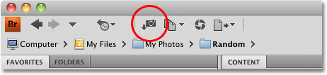
*Click on the Get Photos From Camera icon to  download your images to your computer.*

#### Refine

Directly to the right of the Get Photos From Camera icon is the **Refine** option. The name is a little vague, but clicking on the icon gives us quick access to three important features - **Review Mode**, which lets us  view and compare multiple images in a cool, 3D carousel-style format, **Batch Rename** for renaming multiple images at once, and **File Info**, which let's us view and edit tons and tons of information about the currently selected image:

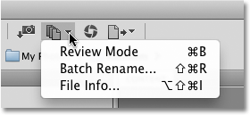
*The Refine option gives us quick access to Bridge's Review Mode, as well as the Batch Rename and File Info commands.*

#### Camera Raw

Next is the **Open In Camera Raw** icon. Camera Raw is a whole other topic for a whole other series of tutorials, but if you shoot with a high end camera and your images were saved in your camera's native raw format, click this icon to open and edit them in the Camera Raw dialog box. You can also open JPEG and TIFF images inside Camera Raw:

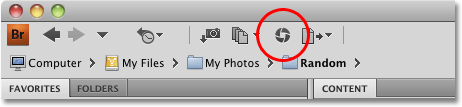
*Click the Camera Raw icon to open raw images in the Camera Raw dialog box.*

#### Output To Web Or PDF

The last icon along the top left of  Bridge CS4 is the **Output** option. Clicking on it switches you to the Output workspace (we'll cover workspaces in another tutorial) with options for outputting images to either a web gallery or to the PDF format:

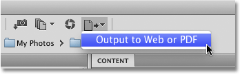
*Select the Output option to output images to a web gallery or to the PDF format.*

#### Workspaces

Along the top right of the Bridge CS4 interface is a series of **workspaces** (Essentials, Filmstrip, Metadata, etc.) that we can choose from simply by clicking on the name of the one we want to select. Workspaces change the layout of the panels in Bridge as well as the panels that are displayed on screen. The currently selected workspace is highlighted:

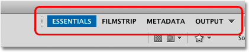
*Click on the various workspace names to change the layout of the Bridge interface.*

The default workspace is Essentials,  but different workspaces can be better suited to what we're doing in Bridge. For example, the Essentials workspace offers a good general purpose layout, but if you're trying to preview your images, those little thumbnails in the Content panel aren't much use, and neither is the not-much-bigger Preview panel in the top right corner. A better workspace for previewing images is **Filmstrip**. I'll select it by clicking on its name, and we can see that we now have a much bigger preview of the image, with the Content panel now moved to the bottom and displaying the thumbnails in a more convenient horizontal row:

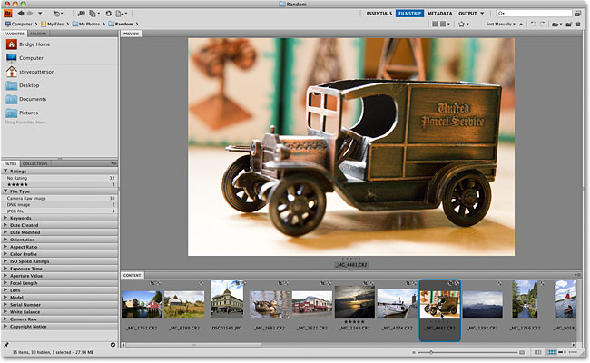
*The Filmstrip workspace gives us a better layout for previewing images.*

The four workspaces shown along the top of Bridge are not the only ones available to us. Click on the down-pointing triangle directly to the right of the word Output to view the complete list of workspaces, including any custom workspaces you've created. I'm going to switch back to the default Essentials workspace so we can carry on with our tour.

#### The Search Box

To the right of the workspaces is your standard **search box**, which allows you to use Bridge to search for files within either the current folder or any sub folders inside the current folder:

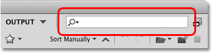
*The search box is limited to searching within the current folder or any of its sub folders.*

#### Compact Mode

In the very top right corner of Bridge is the **Compact Mode** icon:

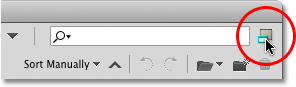
*The Compact Mode icon.*

Clicking on it switches Bridge to Compact mode, which, true to its name, is a small, compact version of Bridge that displays only your image thumbnails and a few navigation options along the top. This mode is handy when you want to keep Bridge open on your screen as you're working in Photoshop (or any of the other Creative Suite programs) because it always remains in front of any open programs. It's also handy for moving or copying files between different folders, since you can have two separate copies of Bridge open at once, making it easy to drag images and files from one Bridge window to another. We'll see how to do that later. To switch back to Bridge's normal size while in Compact mode, click on the **Full Mode** icon in the top right corner:

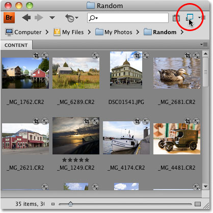
*When in Compact mode, Bridge always appears on your screen in front of any other open programs.*

You can also switch between Compact and Full modes by pressing the keyboard shortcut **Ctrl+Enter** (Win) / **Command+Return** (Mac).

#### Thumbnail Quality Options

Below the workspaces in the top right of Bridge are two icons that allow us to change the quality of the thumbnails we see in the Content panel. The reason we'd want to change the quality of them is because it can take a long time for Bridge to generate high quality previews, especially if you're working with lots of high resolution images. Clicking the icon on the left tells Bridge not to generate previews at all. Instead, it will use the preview that's already embedded with the image file. This is the fastest way to load the thumbnails but it's not recommended. 

Clicking the icon on the right opens a menu with a few quality choices. Selecting the first option, **Prefer Embedded (Faster)** is the same thing as clicking the icon on the left. Why Adobe would give us two different ways to choose the worst possible option, I don't know. The default option is **Always High Quality** which is the one I use and I'd recommend you leave it selected if you don't run into any serious performance problems. Some people prefer the **High Quality On Demand** option, which loads low quality thumbnails to begin with and only generates high quality versions when you click on a thumbnail. This is a faster method, but I like to always see high quality thumbnails. The choice is yours:

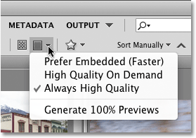
*Lower quality thumbnails load faster, but higher quality thumbnails look better.*

#### Filtering Images By Rating

One of the best features of Bridge is that it allows us to assign different star ratings and labels to our images. Ratings make it easy to separate our best images (5 stars) from the worst (no stars), while labels can be used, for example, to separate images that are still waiting for client approval from ones already approved. We'll see how to add ratings and labels later, but we can filter the images we see in the Content panel according to their rating or label by clicking on the **Filter Items By Rating** icon (the star) to the right of the thumbnail quality options and choosing a filter option from the list. To go back to viewing all images, select the **Clear Filter** option at the top:

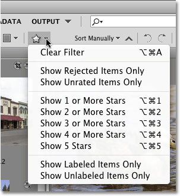
*The star icon allows us to filter the images displayed in the Content panel.*

#### Sorting Options

To the right of the Filter option is the **Sorting** option which changes the criteria for how the thumbnails are displayed in the Content panel. Here, I'm sorting my images manually, but if you click on the option, a menu will appear with lots of different options we can select, including by file name, file type, file size, and so on. Click on the upward-pointing arrow to the right of the sorting option to change the order from ascending to descending, or the down-pointing arrow (it flips direction when you click on it) to switch from descending to ascending:

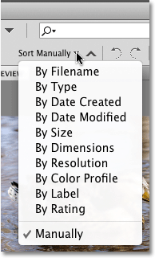
*The two sorting options allow us to change how the thumbnails are listed, as well.*

#### Rotating Images

If an image in the Content panel is sitting on its side and needs to be rotated, simply click on it to select it, then click on one of the two **Rotate** icons directly below the search box. The left icon will rotate the image 90° counterclockwise, the right icon rotates it 90° clockwise (if you didn't guess that one already). You can rotate multiple images at once by holding down your **Ctrl** (Win) / **Command** (Mac) key and clicking on the ones you need, then clicking on one of the Rotate icons:

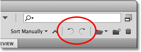
*Use the Rotate icons to rotate images 90° clockwise or counterclockwise as needed.*

#### Open Recent Files

To the right of the Rotate icons is the **Open Recent Files** option, which is yet another way to jump to any files we've recently opened. Click on the icon to view a list of the files, then click on the name of the one you want to open:

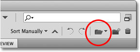
*Click on the Open Recent Files icon to select from a list of recently opened files.*

#### Create A New Folder

To create a new folder inside the folder that's currently open, click on the **New Folder ** icon. When the new folder appears in the Content panel, its name will automatically be highlighted. Simply type the name you want to give it, then press **Enter** (Win) / **Return** (Mac) to accept it:

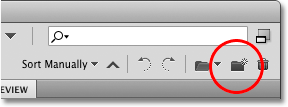
*Click on the New Folder icon to add a new folder inside the current one.*

#### Deleting An Item

Finally, rounding out the icons and options along the top of the Bridge CS4 interface is the **Delete Item** icon. Click on the item you want to delete, then click on the trash bin icon. Then click OK when Bridge asks  if you're absolutely certain you want to delete it:

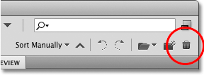
*Select the image or item you want to delete, then click on the Delete Item icon.*

#### Folders And Favorites

At the top of the left column in Bridge CS4 is where we find the **Folders** and **Favorites** panels. By default, the Folders panel is open, but we can switch between the two panels simply by clicking on their name tabs. The Folders panel is our main way of navigating through the folders on our computer, displaying them in a familiar "tree" structure. Click on the triangle to the left of a folder to twirl it open and reveal the folders inside it. Continue making your way down through the folder structure until you reach the one that contains your images, then click directly on the folder's name to display its contents in the Contents panel:

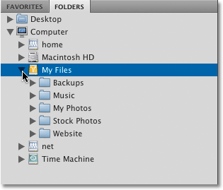
*The Folders panel allows us to navigate easily through the folders on our computer.*

Clicking on the Favorites name tab will switch us to the **Favorites** panel, which is where we can store folders that we access often so we can get to them quickly without having to manually navigate to them each time in the Folders panel. In fact, Favorites acts very much like Bookmarks in a web browser. We'll see how to add our own favorites later, but by default, Adobe adds a few of its own that they assume we'll need to access often, like our Desktop, as well as our main Documents and Pictures folders. Click on any of them to jump right to them:

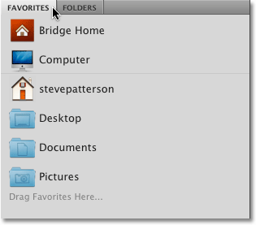
*The Favorites panel acts like web browser Bookmarks, giving us a quick access to commonly used folders.*

#### Filter And Collections

Below the Folders and Favorites panels in the left column are the **Filter** and **Collections** panels. The Filter panel is open by default, but again, we can switch between them by clicking on their name tabs. Earlier, we saw that we can filter the images displayed in the Content panel according to star ratings and labels, but you ain't seen nothin' yet. The Filter panel takes it to a whole new level. In fact, the amount of options we're given for narrowing down exactly which images are displayed borders on crazy. We can filter images based on file type, date created, aspect ratio, the ISO speed, aperture and exposure time, the lens and focal length that was used, the type of camera, the serial number of the camera, and more! We can even combine multiple filter options to really narrow things down. Like I said, crazy!

To turn any of the filter options on, simply click on the triangle to the left of a category's name to twirl it open, then click on any of the filter options inside it. For example, here I've twirled open the **Orientation** category, which tells me that 16 of the images in the current folder are in Landscape mode while the other 16 are in Portrait mode. The Filter panel automatically searches through all of the images in the folder and populates itself with this information. If I want to view only the Landscape images, I can just click on the Landscape option, which places a checkmark to the left of the option's name, letting me know the filter is now active:

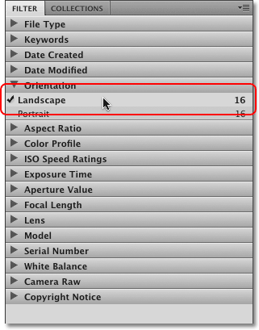
*With the Filter panel, we can get extremely specific about which images are displayed in the Content panel.*

To turn a filter off, simply click on it again. Or, if you have multiple filters active and need to turn them all off at once, click on the circle with the diagonal line through it (the universal symbol for Ghostbusters) in the bottom right corner of the Filter panel to clear all filters instantly.

We'll save the discussion on the Collections panel for later, but essentially, Collections allow us to gather up multiple images, whether they're all in the same folder or scattered all over your computer's hard drive, and save them as a collection so we can view them all together as if they were in the same folder. We can even create Smart Collections which let's Bridge automatically add images to a collection for us based on criteria we set, but again, we'll save that for later.

#### The Content Panel

The middle column in Bridge CS4 is home to the **Content** panel, which displays thumbnail versions of the images inside the folder we've selected. The default size of the thumbnails is very small, too small to make them of much use, but we can easily increase the size of the thumbnails by dragging the slider along the bottom of the Bridge interface. Drag it towards the right to increase their size, or towards the left to decrease it. You can also click on the rectangle icons on either end of the slider to jump to the next largest size (the right rectangle) or the next smallest size (the left rectangle):

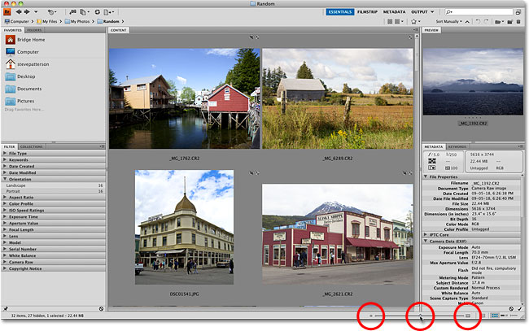
*Use the slider below the Contents panel to change the size of the thumbnails, or click the icons on either end.*

There's lots of other ways we can customize the display in the Contents panel which we'll look at later.

#### Preview Panel

At the top of the right column in Bridge CS4 is the Preview panel, which displays a larger preview of the image that's selected in the Content panel. At least, the idea of the Preview panel is that it should display a larger version of the image. The problem is, by default, the preview image is not much bigger than the thumbnails in the Content panel, and you don't have to increase the size of the thumbnails very much for them to actually appear larger than the preview! However, what we're seeing here is only the default size and location of the Preview panel. As with most things in Bridge CS4, there's ways to customize it, which we'll see later:

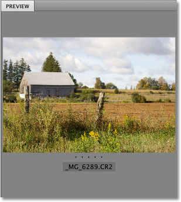
*The Preview panel is of limited use with its default size and location.*

#### Metadata And Keywords

Below the Preview panel in the right column in Bridge CS4 are the **Metadata** and **Keywords** panels, both extremely valuable and important when it comes to viewing information about an image and being able to search for and find images later. The Metadata panel is open by default and displays all the details we need, like the date the photo was taken, the camera settings, file size, file type, color mode and bit depth, whether or not the flash fired, and lots more! Use the scroll bar along the right to scroll through all of the information. We can also use the Metadata panel to add additional details to the image, like the photographer's name and contact information. We'll take a closer look at the Metadata panel later:

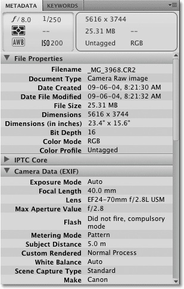
*The Metadata panel shows us everything we'd ever need to know about our image.*

If we click on the Keywords name tab at the top, we switch from the Metadata panel to the **Keywords** panel which allows us to assign descriptive keywords to our images so we can easily find them later simply by searching for images that contain those keywords. We can even use the keywords to have Bridge automatically add images to Smart Collections. We'll look at Smart Collections and everything we need to know to use the Keywords panel effectively in another tutorial:

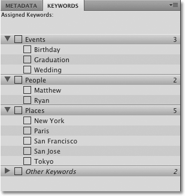
*Use the Keywords panel to add descriptive keywords to images, making it easy to find them later.*