# Photoshop Actions – Recording An Action

> Source: [https://www.photoshopessentials.com/basics/photoshop-actions/record-action/](https://www.photoshopessentials.com/basics/photoshop-actions/record-action/)
> Downloaded and converted to Markdown.

If you've been following along from the [**very beginning**](/basics/photoshop-actions/) of our look at Photoshop actions, give yourself a pat on the back because we've covered a lot of information! If you skipped everything and jumped right to this page, well, that's okay, too, but you've missed a lot. We looked at what actions are, we explored the Actions palette, we learned the difference between an action and an action set, we looked at the Default Actions set that Photoshop loads automatically for us as well as the additional sets that install with Photoshop, we learned how to see exactly what's going on inside an action by playing through it one step at a time, and we learned how to edit an action!

And let's not forget all the little extras we've covered, like how to view the details of an action, including the specific details of each step, how to show and hide dialog boxes when playing an action, how to turn individual steps on an off, and even where to find Photoshop's "classic" default actions if you're using Photoshop CS2! At this point, we've covered pretty much everything we need to know about actions, which means we're ready to record our very own actions in Photoshop!

In this section, we'll look at how to record a simple "Soft Glow" effect as an action. Once we're done recording it, you'll be able to instantly apply the effect to any image you want! Here's the image I'll be using:

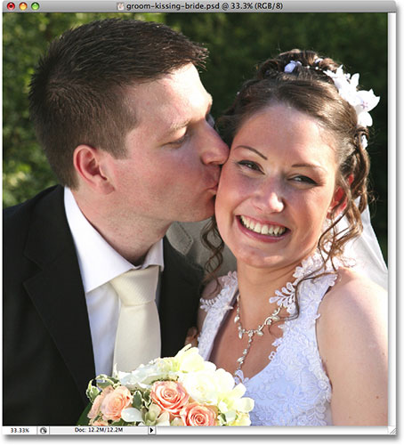
*The photo that will be used while recording the action.*

Let's get started!

#### Step 1: Create A New Action Set If Needed

As I mentioned previously, all actions must be placed inside an action set. You can have hundreds of actions in a set or a single action, it makes no difference. All Photoshop cares about is that you place all of your actions inside action sets. Back when we looked at how to [**edit an action in Photoshop**](/basics/photoshop-actions/editing-an-action/), we learned that to create a new action set, all we need to do is click on the *New Action Set* icon at the bottom of the Actions palette. It's the icon that looks like a small folder, since action sets are really just folders that we store actions in:

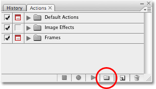
*Create a new action set by clicking on the New Action Set icon at the bottom of the Actions palette.*

This brings up the *New Set* dialog box where you can enter a name for your new action set. I've already created a new action set, which I named "My Actions". If you've already worked through the "Editing An Action" section of these tutorials, you'll most likely have already created a new action set as well, in which case there's no need to create a new one here. If you haven't yet created your own action set, go ahead and create one now. We can see in the screenshot that I've entered the name "My Actions" for my set, but of course you can name your set whatever you like:

*The "New Set" dialog box allows you to enter a name for your new action set.*

Click OK when you're done to exit out of the dialog box, and if you look in your Actions palette, you'll see your new set appear below any other action sets you currently have loaded into Photoshop. Since I'm using the same set that I created previously, we can see that I also have the "Improved Photo Corners" action, which we edited earlier, already available inside the set. If you just created a new set, your set will appear empty for the moment:

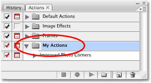
*The new action set appears inside the Actions palette.*

Keep in mind that you don't have to create a new action set every time you want to create a new action. As long as you already have an action set to place your new action in, you can place as many actions inside the set as you like. It's a good idea, though, not to place any of your own actions inside any of the sets that are installed with Photoshop, like the Default Actions set, the Image Effects set, the Frames set, and so on. Keep the actions you create yourself inside your own action set or sets.

#### Step 2: Create A New Action

Now that we an action set to place our new action in, let's create our action! To create a new action, click on the **New Action** icon at the bottom of the Actions palette:

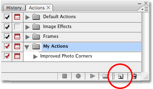
*Click on the "New Action" icon to create a new action.*

This brings up the **New Action** dialog box. Here, we can enter a name for our new action, as well as choose the action set to place the action in. Since we'll be recording the steps needed to create a simple soft glow effect, I'm going to name my action "Soft Glow". Directly below the input box where you entered the name of your action, you'll find the *Set* option. This is where we select which action set to place the action in. If your new action set is not already selected, select it from the list. Here, we can see that I'll be placing my "Soft Glow" action inside the "My Actions" set:

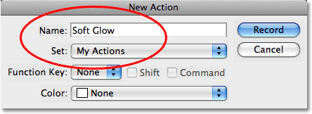
*Enter a name for your new action and select the action set to place your action in.*

You'll notice a couple of other options at the bottom of the New Acton dialog box. The *Function Key* option allows you to assign a keyboard shortcut to your new action if you wish, using any of the Function Keys, along with the Shift key and / or the Ctrl (Win) / Command (Mac) key. Personally, I wouldn't bother with this since it's already very easy to play an action simply by clicking on the *Play* icon in the Actions palette. You'll also find a *Color* option here, allowing you to assign a color to your action. This is only relevant if you're viewing your actions in Button Mode, which there's no need to get into here. You can safely ignore the Color option, and I would ignore the Function Key option as well, but that's just me.

#### Step 3: Click The "Record" Button

When you're done, click on the **Record** button in the top right corner of the dialog box:

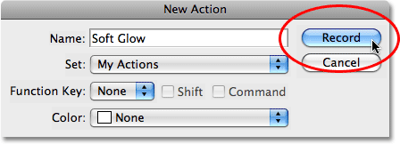
*Click on the "Record" button to begin recording your new action.*

As soon as you click on the Record button, you'll see your new action appear in your action set inside the Actions palette. You'll also see that the Record icon at the bottom of the palette has turned red, letting you know that you're now in record mode:

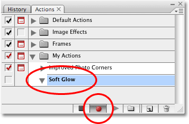
*The action now appears in the Actions palette, and the Record icon turns red.*

Remember, there's no reason to panic. Yes, we're now in record mode, but this isn't like recording a movie. Actions are not recorded in real time. All Photoshop is going to record are the actual steps we perform, not how long it takes us to complete them.

Okay, let's begin recording the steps for our action!

#### Step 4: Make Snapshot

For the first step in my "Soft Glow" effect action, I'm going to tell Photoshop to take a snapshot of how the image looks just before the effect is applied. You don't necessarily have to include this as the first step in an action, but since it gives us an easy way to undo the effect if we need to, it doesn't hurt to include it. So, with Photoshop recording what I'm doing, I'm going to switch over to my **History palette** for a moment, which by default is sitting next to the Actions palette, and I'll click on the **New Snapshot** icon at the bottom of the palette:

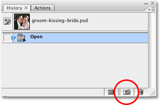
*Taking a snapshot of the image as the first step in the "Soft Glow" action.*

This adds a new snapshot to the top of the History palette:

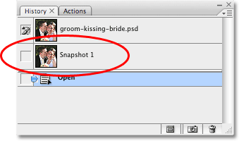
*The snapshot appears at the top of the History palette.*

By adding this snapshot of how the image appears before the effect is applied, if I need to undo the effect after running the action on an image, I can simply switch over to the History palette and click on the snapshot.

I'll switch back over to my Actions palette now, and we can can see that the first step, *Make snapshot*, appears in the "Soft Glow" action. Our first step has successfully been recorded:

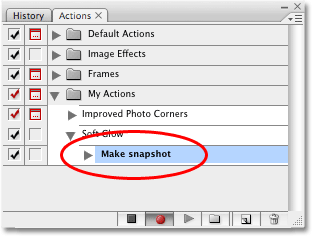
*The first step now appears in the action.*

#### Step 5: Duplicate The Background Layer

Now that we've given ourselves a way to quickly undo the effect if we need to, we can begin creating it! The first thing we need to do is duplicate the Background layer. The Background layer is the layer that contains our original image, and currently, it's the only layer we have. To duplicate it, go up to the *Layer* menu at the top of the screen, choose **New**, and then choose **Layer via Copy**, or for a quicker way, use the keyboard shortcut *Ctrl+J* (Win) / *Command +J* (Mac).

Either way tells Photoshop to create a duplicate of the Background layer for us (or at least, a duplicate of whatever layer we currently have selected, which in this case happens to be the Background layer). If we look in the Layers palette, we can see that we now have two layers. The original Background layer is on the bottom, and a copy of the Background layer, with the descriptive name "Layer 1", is sitting above it:

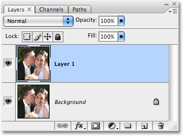
*The duplicate of the Background layer, "Layer 1", now appears in the Layers palette.*

If we look in the Actions palette now, we can see that a second step, **Layer Via Copy**, has been added to our "Soft Glow" action:

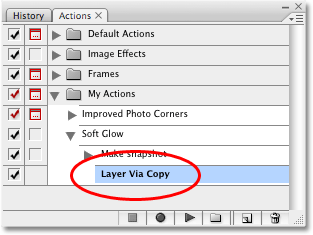
*The second step, "Layer Via Copy", appears in the action.*

#### Step 6: Rename The New Layer

Before we continue, let's rename this layer. I'm not a big fan of generic layer names like "Layer 1", and giving layers more meaningful names is always a good idea. To rename the layer, *double-click* directly on the layer's name, type in a new name, and then press *Enter* (Win) / *Return* (Mac) to accept it. In a moment, we're going to be applying Photoshop's Gaussian Blur filter to this layer, so let's name this layer "gaussian blur":

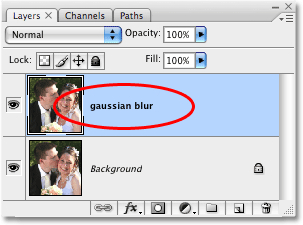
*Double-click directly on the name "Layer 1" and rename the layer "gaussian blur".*

Checking our Actions palette, we can see that a third step, **Set current layer**, has been added to our action. The name of the step doesn't really tell us much, other than it sets the currently selected layer to something, but if we twirl open the step by clicking on the triangle to the left of its name, we can see that this step will rename the currently selected layer to "gaussian blur", which is exactly what we want:

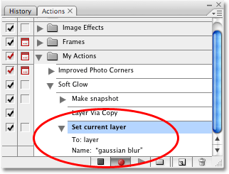
*The third step, "Set current layer", now appears in the action.*

#### Step 7: Change The Blend Mode Of The New Layer To "Overlay"

So far, even though we've recorded three steps already in our action, the image in the document window doesn't look any different from when we started, but that's about to change. We're going to change the **blend mode** of the new layer. With the "gaussian blur" layer selected, go up the Blend Mode option at the top of the Layers palette. It's the drop-down box that's currently set to "Normal". Click on the drop-down box to open it, then select the **Overlay** blend mode from the list:

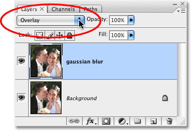
*Change the blend mode of the "gaussian blur" layer to "Overlay".*

With the blend mode of the layer set to Overlay, the image in the document window now appears with much higher contrast and the colors appear more saturated:

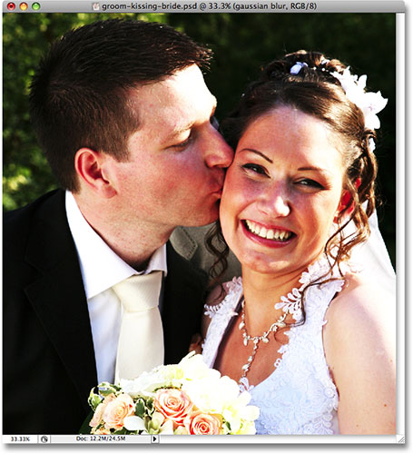
*Both the contrast and color saturation have now increased in the image.*

Let's look at our Actions palette again, where we can see that we now have a fourth step, also named **Set current layer**, added to our action. Let's twirl the step open to view the details, and we can see that this step will change the blend mode of the currently selected layer to Overlay:

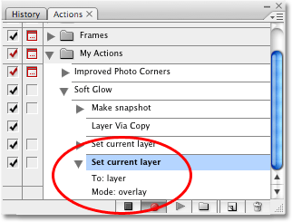
*A fourth step has been added to the "Soft Glow" action.*

We've successfully added our fourth step to the "Soft Glow" action. Only a couple more steps to go, and then we'll have an effect that we can instantly apply to any image in Photoshop, any time we want!

#### Step 8: Apply The "Gaussian Blur" Filter

To create the soft glow effect, we need to blur the image on our "gaussian blur" layer. Go up to the *Filter* menu at the top of the screen, choose *Blur*, and then choose *Gaussian Blur*. This will bring up Photoshop's Gaussian Blur dialog box. Drag the *Radius slider* at the bottom of the dialog box towards the right to increase the amount of blurring that's being applied to the layer, or drag the slider to the left to decrease the blur amount. Keep an eye on your image in the document window as you drag the slider so you can see what's happening, and select a radius value that gives your image a nice soft glow effect. I'm going to set my radius value to *13 pixels*, which works nicely for my image:

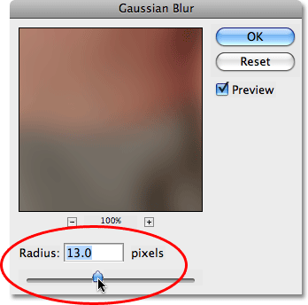
*Create the soft glow effect by adjusting the Radius value in the Gaussian Blur dialog box.*

Click OK when you're done to accept the blur effect and exit out of the dialog box. Here's my image after applying the Gaussian Blur filter:

*The image after applying the Gaussian Blur filter.*

If we look in our Actions palette, we can see that a fifth step, **Gaussian Blur**, has been added to our "Soft Glow" action, and if we twirl open the step, we can see from the details that the radius value in the Gaussian Blur dialog box will automatically be set to 13 pixels every time we run this action:

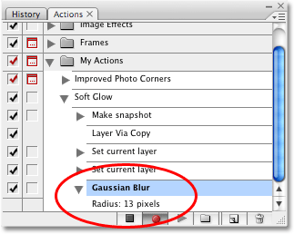
*The fifth step, "Gaussian Blur", appears in the action.*

That's great, but what if a radius value of 13 pixels doesn't work as well with the next image we use with this action? What if the next image needs an even higher radius value to achieve the desired glow effect, or a smaller radius value? Maybe, instead of using the same radius value each time the action is played, we should have Photoshop pop open the Gaussian Blur dialog box for us so we can adjust the radius value, if needed, and customize the effect for each image.

As we've already learned, we can easily enable or disable dialog boxes when an action plays by simply clicking on on the *dialog box toggle icon* to the left of the step. By default, the toggle icons appear empty, which means that the dialog box associated with the step will not appear when the action plays. Since I want the Gaussian Blur dialog box to appear each time I run the action, I'm going to click inside the empty toggle icon to the left of the step. When I do, a small gray dialog box icon appears, telling me that the dialog box will now pop open for me when I play the action:

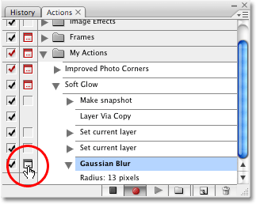
*Click on the dialog box toggle icon for the Gaussian Blur step to have Photoshop pop open the dialog box when the action plays.*

#### Step 9: Lower The Opacity Of The Layer To 65%

To complete the action, let's lower the opacity value of the "gaussian blur" layer so the effect isn't quite as intense. To lower the opacity of the layer, go up to the **Opacity** option in the top right corner of the Layers palette, directly across from the Blend Mode option. By default, the opacity value is set to 100%. Click on the small arrow to the right of where it says "100%", which will bring up a small slider bar. Use the slider to drag the opacity value down to 65%:

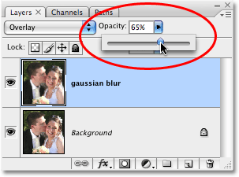
*Use the small slider to lower the opacity value of the "gaussian blur" layer to 65%.*

**Important:** As you're dragging the slider to lower the opacity of the layer, make sure you **don't release your mouse button** until you've dragged the slider to the desired value. Each time you release your mouse button, Photoshop will consider it a new step in the action and you'll end up with multiple steps for lowering the opacity. For example, if you dragged the slider down to 90%, released your mouse button, then dragged the slider to 75%, released your mouse button, and then dragged the slider down to 65%, you'd end up with three steps listed in the action, one lowering the opacity to 90%, another lowering it to 75%, and finally, a third step lowering the opacity to 65%. If this happens to you, wait until you're done recording the action, then simply click on the extra steps you don't need and drag them down on to the Trash Bin at the bottom of the Actions palette to delete them.

**Even More Important:** Also, if you're using Photoshop CS or later, **do not use the scrubby slider** to lower the opacity value of the layer. This one, I can't stress enough. Do not use scrubby sliders when recording actions. If you try lowering the opacity of the layer to 65% using the scrubby slider, you'll end up with 35 individual steps in your action, each one lowering the opacity of the layer by 1%. So, no scrubby sliders when recording actions, otherwise you'll be deleting a lot of extra steps when you're done. Been there, done that.

Having said that, once you've lowered the opacity of the layer, you're done recording all the steps needed for the action! Let's look in our Actions palette, where we can see the final step, another one named **Set current layer**, listed, and if we twirl the step open to view the details, we can see that this final step will lower the opacity of the layer to 65%:

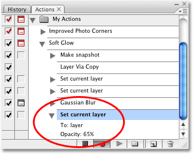
*The final step appears in the action.*

Here, after lowering the layer opacity, is my image with the completed "Soft Glow" effect:

*The wedding photo with the finished "Soft Glow" effect.*

#### Step 10: Stop Recording The Action

We're done recording our action, which means we need to tell Photoshop to stop recording what we're doing. To do that, click on the *Stop* icon at the bottom of the Actions palette:

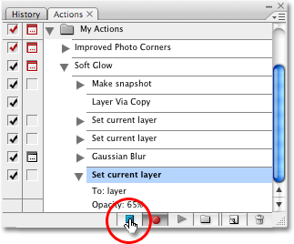
*Click on the "Stop" icon to finish recording the action.*

And with that, we're done! We've successfully recorded our very first action, and we now have an effect that we can instant apply to any other image we want! Let's quickly make sure the action works as expected. I'll open another image in Photoshop:

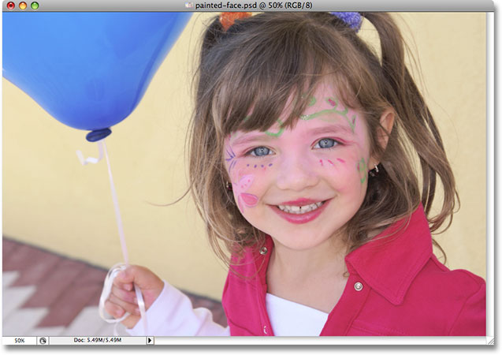
*A new image opened in Photoshop.*

To run the new action on the image, I'll select the "Soft Glow" action from inside my "My Actions" set in the Actions palette, then I'll click on the **Play** icon at the bottom of the palette:

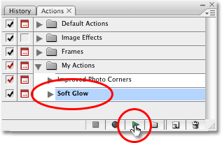
*Select the "Soft Glow" action, then click on the Play icon in the Actions palette.*

As soon as I click on the Play icon, Photoshop begins running through the steps in the action, first creating a snapshot of the image in the History palette, then duplicating the Background layer, renaming the new layer "gaussian blur", and changing the blend mode of the new layer to Overlay. When it reaches the step where the Gaussian Blur filter is applied to the image, it pauses the action and pops open the Gaussian Blur dialog box for me so I can re-adjust the Radius value if needed:

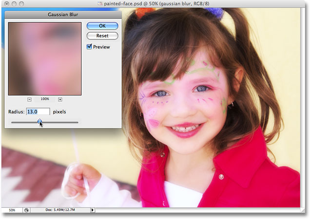
*Photoshop pauses the action and displays the Gaussian Blur dialog box.*

Notice how the radius value in the dialog box is already set to 13 pixels, since that's the value we used when we recorded the action. I could change the value here if I wanted to, but I think 13 pixels works well for this image, so I'll simply click OK in the top right corner of the dialog box to accept the setting, exit out of the dialog box, and allow Photoshop to continue running through the steps in the action.

Photoshop continues on, lowering the opacity value of the "gaussian blur" layer to 65% for me, at which point the effect is complete, and it was completed in a fraction of the time it would have taken me to run through all those steps again on my own! Here is the image with the final "Soft Glow" effect:

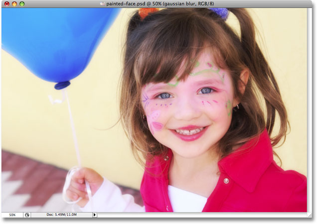
*The "Soft Glow" effect has been easily applied to a second image using the action.*