# The Rectangular Marquee Tool In Photoshop

> Source: [https://www.photoshopessentials.com/basics/selections/rectangular-marquee-tool/](https://www.photoshopessentials.com/basics/selections/rectangular-marquee-tool/)
> Downloaded and converted to Markdown.

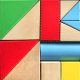

Before we begin... This tutorial was original written for Photoshop CS4 but is fully compatible with newer versions including Photoshop CS6 and CC.

In a previous tutorial, we looked at reasons [why we need to make selections](/basics/why-make-selections/) at all in Photoshop. We learned that Photoshop sees the world very differently from how you and I see it. Where we see independent objects, Photoshop sees only pixels of different colors, so we use Photoshop's various selection tools to select objects or areas in a photo that Photoshop would never be able to identify on its own.

I mentioned in that same tutorial that Photoshop gives us lots of different tools for selecting things in an image, some basic and some more advanced (although it's funny how even so-called "advanced" tools can seem quite basic once you're comfortable with  them). In this tutorial, we'll look at one of the most common and easiest selection tools to use, the **Rectangular Marquee Tool**,  one of Photoshop's basic selection tools that, along with the Elliptical Marquee Tool and the Polygonal Lasso Tool, is designed for making selections based on simple geometric shapes. As the name implies, the Rectangular Marquee Tool is perfect for times when you need to draw a selection in the shape of a rectangle or a square.

This tutorial is from our [How to make selections in Photoshop](/basics/make-selections-photoshop/) series.

You'll find the Rectangular Marquee Tool sitting at the very top of the Tools panel in Photoshop. It's the tool with the icon that looks like the outline of a square. Click on it to select it:

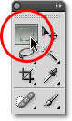

*The Rectangular Marquee Tool is located at the top of the Tools panel.*

If you're using Photoshop CS4 as I am here, or Photoshop CS3, and you have your Tools panel set to a single column layout, the Rectangular Marquee Tool will be the second icon from the top:

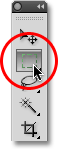

*The Tools panel in Photoshop CS3 and higher can be displayed in either a single or double column layout.*

### Drawing Rectangular Selections

Using the Rectangular Marquee Tool in its most basic form is easy. You simply click with your mouse at the point where you want to begin the selection, which will usually be in the top left corner of the object or area you need to select, then continue holding your mouse button down as you drag towards the bottom right corner of the object or area. When you release your mouse button, the selection is complete!

Here's a photo of some wooden blocks:

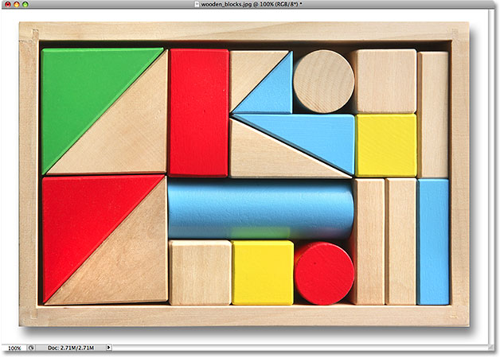

*Colorful wooden blocks.*

See that large red block in the top row? Let's say I wanted to change its color, a very simple thing to do. Now, if this was Star Trek, I could simply say "Computer, select  red block, top row", followed by "Change color to purple", or whatever color we wanted. Unfortunately, reality hasn't quite caught up to science fiction just yet, but that doesn't mean  life in this day and age is unbearably difficult. Far from it! Photoshop may not be able to identify the wooden block, since all it sees are pixels, but not only can you and I see it, we can see that it's very clearly in the shape of a rectangle, which means that the task of selecting it is perfectly suited for the Rectangular Marquee Tool.

First, I'll select the Rectangular Marquee Tool from the Tools panel as we saw a moment ago. You can also select tools using their keyboard shortcuts. Pressing the letter **M** on your keyboard will instantly select the Rectangular Marquee Tool. Then, to begin the selection, I'll click in the top left corner of the block. While still holding down my mouse button, I'll drag towards the bottom right corner of the block:

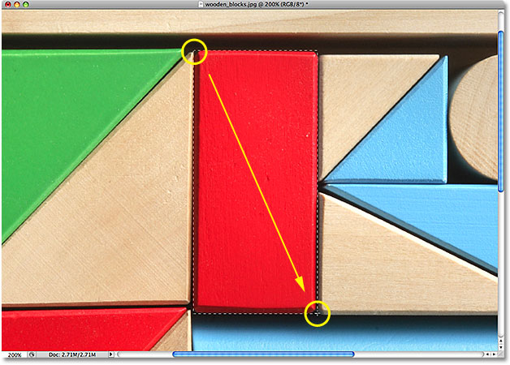

*Click in the top left corner to begin a selection, then drag down to the bottom right corner. Release your mouse button to complete it.*

If you find that you didn't begin your selection in exactly the right spot, there's no need to start over. Just hold down your **spacebar**, then drag your mouse to move the selection where you need it. When you're done, release your spacebar and continue dragging out the selection.

To complete the selection, all I need to do is release my mouse button. The wooden block is now selected (or at least, the pixels that make up what we see as the block are selected), and a selection outline appears around the block in the document window. Any edits I make at this point will affect that specific block and no others:

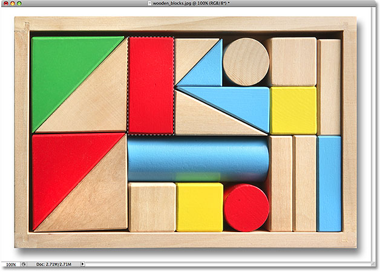

*Selection outlines appear as a series of moving dashed lines, also known as "marching ants".*

To change the color of the block, we'll use Photoshop's **Hue/Saturation** image adjustment. To select it, I'll go up to the **Image** menu at the top of the screen where I'll choose **Adjustments** and then **Hue/Saturation**:

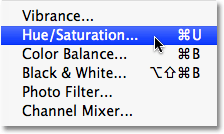

*The Hue/Saturation image adjustment is great for changing the color of objects in an image.*

This brings up the Hue/Saturation dialog box. I think I'll change the block's color to orange. I know I said purple earlier, but now that I've had a few more minutes to think about it, a nice bright orange would probably be a better choice. Changing the color is as easy as dragging the **Hue** slider left or right until you find the color you want. I'm going to drag mine towards the right to a value of 28 to select orange. Then, to bump up the color saturation a bit, I'll drag the **Saturation** slider towards the right to a value of around +25:

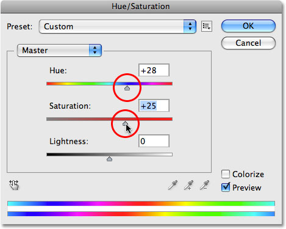

*Change an object's color by dragging the Hue slider. Increase or decrease color saturation with the Saturation slider.*

When I'm happy with the new color, I'll click OK to exit out of the dialog box. I don't need my selection anymore, so to remove it, I'll go up to the **Select** menu at the top of the screen and choose **Deselect**:

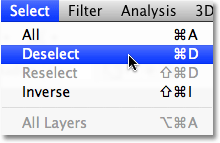

*Remove selections by choosing Deselect from under the Select menu.*

A faster way to remove a selection is with the keyboard shortcut, **Ctrl+D** (Win) / **Command+D** (Mac), but either way will work. With the selection outline now gone, we can see that only the area that was inside the rectangular selection outline was affected by the Hue/Saturation adjustment. The formerly red block is now an orange block, while the rest of the photo remains unchanged:

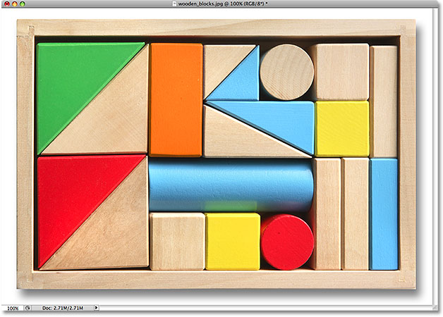

*Only the area inside the rectangular selection was affected by the Hue/Saturation adjustment.*

Selecting the wooden block with the Rectangular Marquee Tool was easy, but what if the object we need to select is perfectly square? We'll look at that next!

### Drawing Square Selections

So far, we've seen how easy it is to select a rectangular-shaped object or area in a photo with the Rectangular Marquee Tool, but what if you need to select something that's perfectly square? Is there a way to force the selection outline into a square? Not only is there a way to do it, there's actually *two* ways to do it, although one of them is much faster than the other.

Here's a photo I have open in Photoshop of some rather grungy looking  tiles:

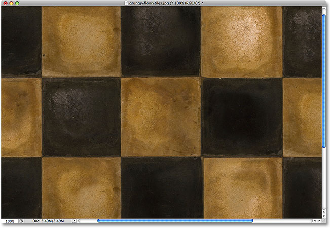

*Dirty, grungy looking tiles.*

Let's say I want to select the tile in the center so I can use it as an interesting background or texture for an effect. Since the tile is obviously square, we'll want to constrain our selection to a square. First, we'll look at the long way to go about it. 

Any time the Rectangular Marquee Tool is selected, the **Options Bar** at the top of the screen will display options specifically for this tool. One of the options is called **Style**, and by default, it's set to Normal, which means  we're free to drag out any size selection we need with any dimensions. To force the selection into a square, first change the Style option to **Fixed Ratio**, then enter a value of **1** for both the **Width** and **Height** options (1 is the default value for the Width and Height so you may not need to change it): 

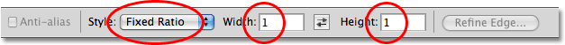

*Change the Style option to Fixed Ratio, then set both the Width and Height to 1.*

This forces the selection into a width to height aspect ratio of 1:1, which means the width and height of our selection will always be equal to each other, which means we can now easily draw out a perfect square. I'll click with my mouse in the top left corner of the tile to begin my selection, just as I did previously, and with my mouse button still down, I'll drag towards the bottom right corner of the tile. This time, thanks to the options I set in the Options Bar, my selection outline is constrained to a square:

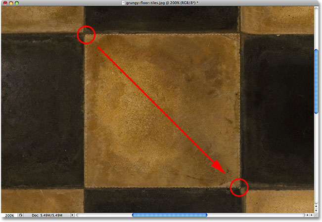

*No matter how large of a selection I draw, it remains a perfect square.*

Once again, there's no need to start over if you didn't begin your selection in the right spot. Just hold down your **spacebar**, drag the selection to its new location, then release the spacebar and continue dragging out the rest of the selection.

To complete the selection, I'll release my mouse button, and we can see in the document window that the square tile in the center is now selected, ready for whatever I decide to do with it:

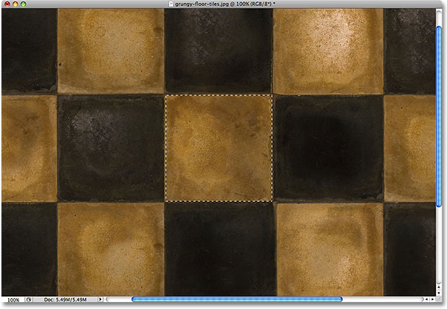

*The center tile is now selected.*

The only problem with using this method to force the selection into a square is that the options in the Options Bar are "sticky", meaning they don't automatically switch back to their default settings the next time you go to use the tool. I can't even begin to tell you how many times I've tried to drag out a rectangular selection only to have the selection constrained to a square or some other aspect ratio because I forgot to change the Style option back to Normal. So, before we go any further, let's change it back to **Normal** right now:

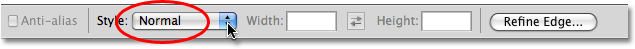

*Make sure to set the Style option back to Normal since Photoshop won't do it for you.*

**The Keyboard Shortcut**
    A much better way to constrain a selection to a square with the Rectangular Marquee Tool is with a simple keyboard shortcut. Click on the starting point and begin dragging out a rectangular selection as you normally would, then hold down your **Shift** key as you continue to drag. As soon as you press the Shift key, you'll see the selection outline jump to a perfect square. Keep holding the Shift key down until you're finished drawing the selection. Release your mouse button to complete the selection, then release the Shift key.

 The order you do things here is important. If you release your Shift key before releasing your mouse button to complete the selection, your selection outline will jump back into a rectangular shape and you'll have to press and hold the Shift key again to switch back to the square. Also, if you  hold the Shift key down before clicking to begin your selection, you'll enter the **[Add to Selection](../../../photo-editing/basic-selections/)** mode, which isn't something we need to get into here but it could give you unexpected results if you already have one selection active and try to start a new one. So remember, to constrain the selection to a square with the keyboard shortcut, first click to set a starting point and begin dragging, then hold down the Shift key. Release your mouse button to complete the selection, then release the Shift key.

Next, we'll learn how to drag a rectangular or square selection out from its center!

### Drawing Selections From The Center

Up to this point, we've been starting all of our rectangular or square selections from the top left corner of whatever it was that we were selecting, and in most cases that works just fine. But there's no rule that says you must always start in the top left corner. In fact, Photoshop gives us a simple keyboard shortcut that allows us to drag selections out from their center rather than from a corner. 

Click on your starting point in the center of the area you need to select with the Rectangular Marquee Tool and begin dragging out your selection, then hold down your **Alt** (Win) / **Option** (Mac) key and continue dragging. As soon as you add the Alt / Option key, your selection outline will begin extending out in all directions from the point you initially clicked on. Continue dragging the selection out from its center, release your mouse button to complete the selection, then release your Alt / Option key:

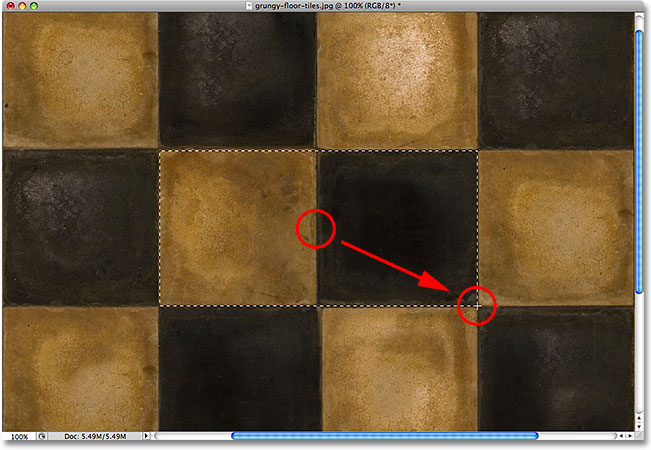

*Holding down Alt (Win) / Option (Mac) allows us to drag selections out from the center.*

Once again, the order you do things here is important. If you release your Alt / Option key before releasing your mouse button to complete the selection, the selection outline will jump back to its default behavior of extending out from the corner. You'll need to press and hold the Alt / Option key again to switch it back to the center. Also, if you press and hold Alt / Option before clicking to set a start point, you'll enter the **[Subtract from Selection](/photo-editing/basic-selections/)** mode which we won't get into here but can cause unexpected results if you already have one selection active and try to start a new one. The correct order for drawing rectangular selections from the center is to click to set a starting point and begin dragging, then hold down Alt / Option and continue dragging. Release your mouse button to complete the selection, then release your Alt / Option key.

You can drag out a square selection from its center as well. Simply add the **Shift** key to the keyboard shortcut. Click in the center of the square object or area you need to select and begin dragging out the selection, then hold down **Shift+Alt** (Win) / **Shift+Option** (Mac) which will snap the selection outline into a perfect square and force the selection to extend out in all directions from the point you clicked on. When you're done, release your mouse button, then release the Shift and Alt / Option keys.

### Quickly Remove A Selection

When you're done with a selection and no longer need it, you can deselect it by going up to the **Select** menu at the top of the screen and choosing **Deselect** as we saw earlier, or you can use the keyboard shortcut **Ctrl+D** (Win) / **Command+D** (Mac). Or, for an even faster way to deselect a rectangular or square selection, simply click anywhere inside the document window while you still have the Rectangular Marquee Tool active.

Up next, we'll look at the second of Photoshop's two main Marquee selection tools, the **[Elliptical Marquee Tool](/basics/elliptical-marquee-tool/)**! For more on making selections in Photoshop, see our complete [How to make selections in Photoshop](/basics/make-selections-photoshop/) series. Or visit our [Photoshop Basics](/basics/) section for more Photoshop topics!