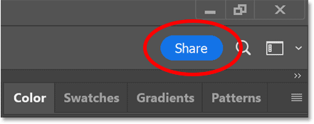
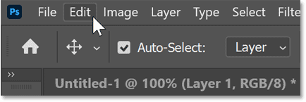
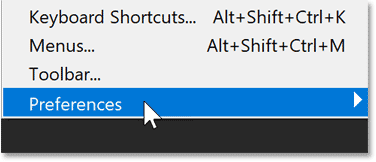
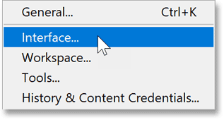
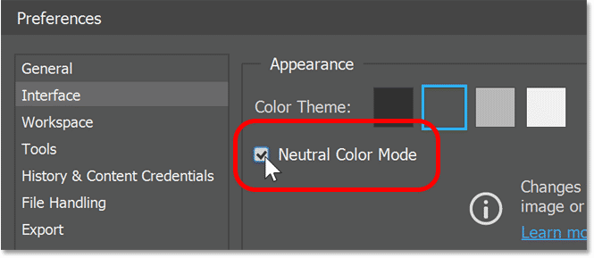
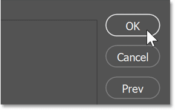
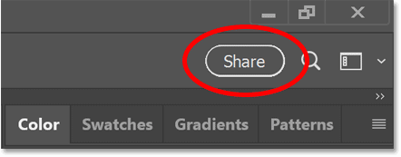

# Remove Distractions with Neutral Color Mode in Photoshop

> Source: [https://www.photoshopessentials.com/basics/remove-distractions-with-neutral-color-mode-in-photoshop-2022/](https://www.photoshopessentials.com/basics/remove-distractions-with-neutral-color-mode-in-photoshop-2022/)
> Downloaded and converted to Markdown.

Neutral Color Mode, a new feature in the August 2022 release of Photoshop, replaces distracting interface colors (like that blue Share button) with neutral colors. This quick tutorial shows you how to use it.

Everyone loves new Photoshop features. And in 2022, Adobe added a great new Share feature to [Photoshop](https://adobe.prf.hn/click/camref:1100lrdjJ/destination:https%3A%2F%2Fwww.adobe.com%2Fproducts%2Fphotoshop.html) that makes it easy for team members or other Photoshop users to collaborate with you on your project. But that same feature also adds a big blue Share button in the upper right of Photoshop’s interface that can be distracting while you work.

*A Share button is great. But why is it blue?*

Thankfully, Adobe seems to agree that blue was not the best choice. So the August 2022 release of Photoshop (version 23.5) adds another new feature called **Neutral Color Mode**. Found in Photoshop’s Preferences, this new option forces interface elements, like that blue Share button, to neutral gray. Here's how to switch to Neutral Color Mode.

## Step 1: Open Photoshop's Interface Preferences

On a Windows PC, go up to the **Edit** menu. On a Mac, go up to the **Photoshop** menu.

*Opening the Edit menu (Win) / Photoshop menu (Mac).*

From there, choose **Preferences**.

*Choosing Preferences.*

Then choose **Interface**.

*Opening the Interface Preferences.*

## Step 2: Turn on Neutral Color Mode

Then simply check the new **Neutral Color Mode** option, which is turned off by default.

Note that Neutral Color Mode does not change the colors in your image. And it has no effect on color-related interface elements like the Color Picker or the Gradient Editor. It only affects static elements like the Share button.

*Turning on Neutral Color Mode for the interface.*

## Step 3: Close the Preferences dialog box

Then click OK to close the Preferences dialog box.

*Clicking OK to close the dialog box.*

You don’t need to restart Photoshop for the change to take effect. With Neutral Color Mode enabled, the blue Share button instantly turns to gray.

*Same Share button, now in neutral gray.*

And there we have it! While Neutral Color Mode is a welcome addition, the big feature in the August 2022 release of Photoshop is better 1-click selections thanks to the [new Cloud option for Select Subject](/basics/select-subjects-powerful-new-cloud-option-in-photoshop-2022/). And the best new feature in Photoshop 2022 is the improved [Object Selection Tool](/basics/using-the-object-selection-tool-and-object-finder-in-photoshop-2022/). These tutorials and many more are now available to [download as PDFs](/print-ready-pdfs/)!