# Repeating Patterns In Photoshop – Adding Colors And Gradients

> Source: [https://www.photoshopessentials.com/basics/repeating-patterns-colors-gradients/](https://www.photoshopessentials.com/basics/repeating-patterns-colors-gradients/)
> Downloaded and converted to Markdown.

In the [previous tutorial](/basics/repeating-patterns/), we learned the basics of creating and using simple repeating patterns in Photoshop. We designed a single tile using the Elliptical Marquee Tool and the Offset filter. We then saved the tile as a pattern. Finally, we selected the pattern and used it to fill a layer, with the pattern seamlessly repeating as many times as needed to cover the entire area. This tutorial continues from where we left off, so you may want to complete the [previous section](/basics/repeating-patterns/) where we created and added our "Circles" pattern if you haven't done so already.

The main problem with the repeating pattern we've created so far is that it's not very interesting, and a big reason is that it's nothing more than a black pattern in front of a white background. In this tutorial, we'll learn how to spice things up a bit by adding colors and gradients! As before, I'll be using Photoshop CS5 here, but any recent version of Photoshop will work.

Here's our design as it appears so far:

*Black circles against a white background. Not terribly interesting.*

### Adding Solid Colors

Let's start by replacing the white background with a color. We *could* use Photoshop's Fill command to fill the Background layer with a color, but let's give ourselves more flexibility by using what's called a **fill layer** (we'll see what I mean by it being more flexible a bit later). First, click on the **Background layer** in the Layers panel to select it:

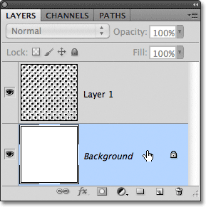
*Click on the Background layer to make it active.*

With the Background layer selected, click on the **New Fill or Adjustment Layer** icon at the bottom of the Layers panel:

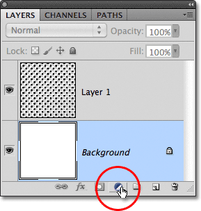
*Click on the New Fill or Adjustment Layer icon.*

Select **Solid Color** from the top of the list of fill and adjustment layers that appears:

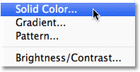
*Choose Solid Color from the top of the list.*

As soon as you choose Solid Color from the list, Photoshop will pop open the **Color Picker** so we can choose the color we want to use. This is the color that will become the new background color for the design. I'm going to choose a medium blue. Of course, you can choose any color you like, but if you want to use the same colors I'm using, look for the R, G and B options (which stand for Red, Green and Blue) near the bottom center of the Color Picker and enter **98** for the **R** value, **175** for **G**, and **200** for **B**:

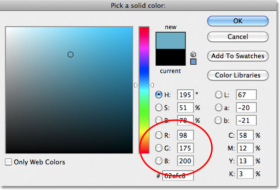
*Choose a color from the color picker to use as the background color for the design.*

Click OK when you're done to close out of the Color Picker, and if we look at the design in the document window, we see that we've easily replaced the white background with the new color:

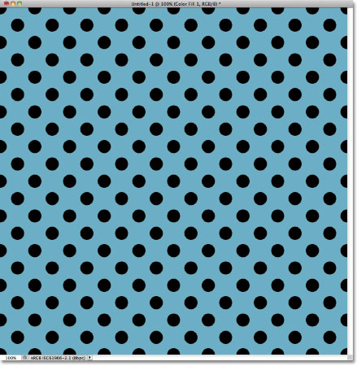
*The white background has been replaced with blue.*

If we look in the Layers panel, we can see what's happened. Photoshop has added a solid color fill layer, which it named Color Fill 1, between the white-filled Background layer and the black circle pattern on Layer 1. The reason we selected the Background layer before adding the fill layer was because Photoshop adds new layers directly above the layer that's currently selected and we needed the fill layer to appear above the Background layer but below the circle pattern. The circles remain black in our document because they're on a layer above the fill layer, which means they're not being affected by it:

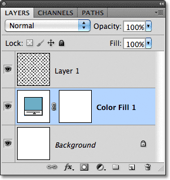
*A solid color fill layer now blocks the white Background layer from view in the document.*

We can use another fill layer to add a different color to the circle pattern itself. This time, we need Photoshop to add the fill layer above the circle pattern, so click on Layer 1 to select it:

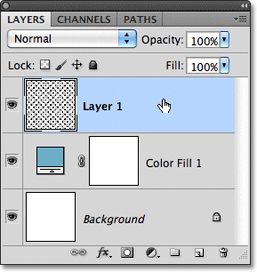
*Click on Layer 1 in the Layers panel to make it active.*

Then once again click on the **New Fill or Adjustment Layer** icon at the bottom of the Layers panel and choose **Solid Color** from the top of the list, just as we did before. Photoshop will again open the **Color Picker** so we can choose the color we want to use. I'll choose a very light blue this time by entering **216** for the **R** value, **231** for **G** and **239** for **B**:

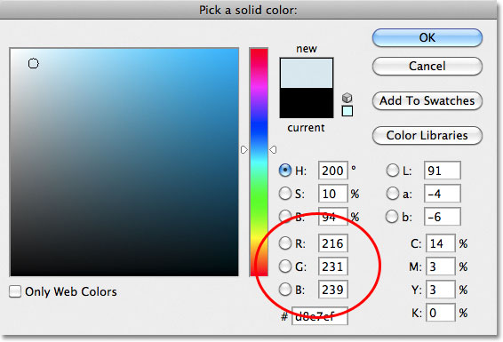
*Choose a light blue, or a different color if you prefer.*

Click OK to close out of the Color Picker, and just like that, our repeating circles now appear in the new light blue color:

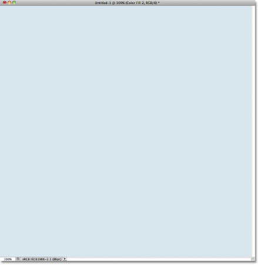
*The document after adding a solid color fill layer above the circles pattern.*

Wait a minute, what happened? Where did our circles go? Where's the background color we just added? Why is everything now light blue? If we look in the Layers panel, we see the problem, and the problem is that Photoshop did exactly what we asked it to do. It added a solid color fill layer named Color Fill 2, filled with the light blue color we chose in the Color Picker, above the circles pattern on Layer 1:

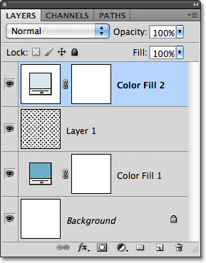
*The new fill layer appears above the other layers.*

Unfortunately, since the fill layer is sitting above all the other layers in the Layers panel, it's blocking everything else from view in the document, which is why all we see is light blue. We need a way to tell Photoshop that we want our new fill layer to affect only the circles pattern on Layer 1 below it, and we can do that using what's called a **clipping mask**.

Make sure the **Color Fill 2** layer is active in the Layers panel (active layers are highlighted in blue. Click on it to select it if for some reason it's not active). Go up to the **Layer** menu in the Menu Bar along the top of the screen and choose **Create Clipping Mask**:

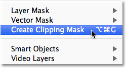
*Go to Layer > Create Clipping Mask.*

The Color Fill 2 layer will appear indented to the right in the Layers panel, telling us that it's now "clipped" to the contents of the layer below it, meaning that it's now affecting only the circle pattern on Layer 1:

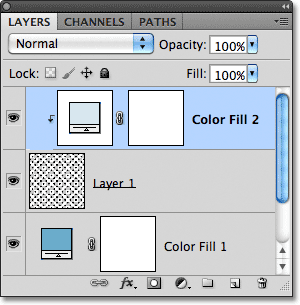
*An indented layer means it's clipped to the layer directly below it.*

And in the document window, we see the results we were expecting when we added the fill layer. The black circles now appear light blue against the darker blue background:

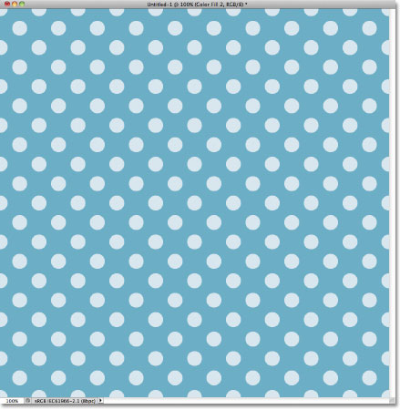
*The same black and white pattern, now in color.*

### Changing Colors

Earlier I mentioned that fill layers give us more flexibility than if we were to fill a layer with Photoshop's Fill command, and the reason is because we can change a fill layer's color any time we want! To change the color of a fill layer, simply **double-click** directly on its **thumbnail** in the Layers panel. Let's change the color of our background. Double-click on the thumbnail for the Color Fill 1 layer, which is sitting above the Background layer:

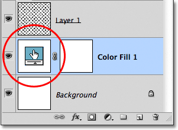
*Double-click directly on the thumbnail for the Color Fill 1 layer.*

This re-opens the Color Picker, allowing us to choose a different color. I'll choose a cherry color this time by entering **204** for my **R** value, **32** for **G** and **130** for **B**:

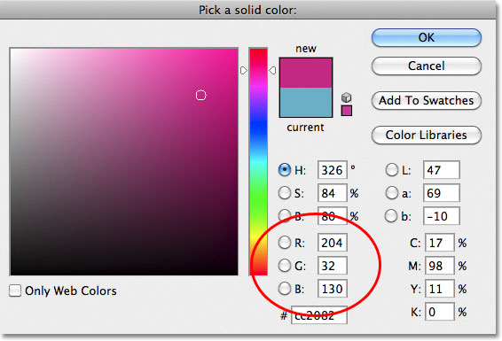
*Choosing a new color for the background.*

Click OK to close out of the Color Picker, and the document is instantly updated with our new background color:

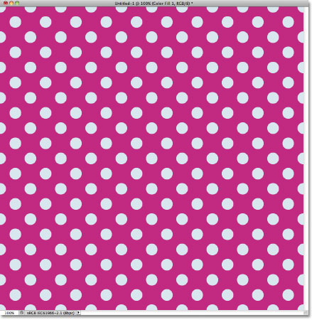
*The background color has been easily changed.*

Changing the color of the circles is just as easy. Simply double-click directly on the thumbnail for the Color Fill 2 layer:

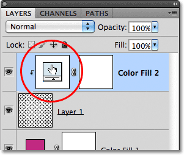
*Double-click on Color Fill 2's thumbnail.*

This again re-opens the Color Picker so we can choose a new color. I'll choose a lighter pink by entering **218** for my **R** value, **144** for **G** and **161** for **B**:

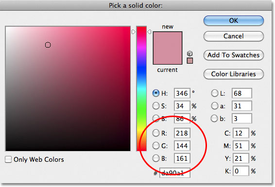
*Choosing a new color for the circle pattern.*

Click OK to close out of the Color Picker, and once again, the document is instantly updated, this time with the new color for the circles:

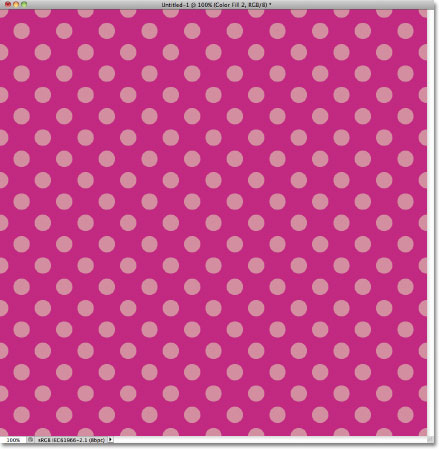
*Both the background and circle pattern colors have been changed.*

### Adding Gradients To Repeating Patterns

We can also add gradients to our pattern designs, and the steps are very similar. In fact, the only real difference is that instead of adding a Solid Color fill layer, we add a **Gradient** fill layer! I'll delete the two Solid Color fill layers I've added by clicking on each one and dragging it down onto the **trash bin** at the bottom of the Layers panel:

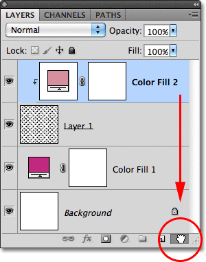
*Both the background and circle pattern colors have been changed.*

With the fill layers gone, the pattern reverts back to its original black and white:

*Black circles in front of a white background once again.*

Let's colorize the circles with a gradient. First, click on Layer 1 to select it so the Gradient fill layer we're about to add will be placed above it:

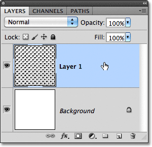
*Select Layer 1.*

Remember what happened when we added the Solid Color fill layer above the circle pattern? The entire document became filled with the color we chose until we fixed the problem using a clipping mask. We're going to need a clipping mask for our Gradient fill layer as well, but this time, let's take a shortcut. With Layer 1 selected, hold down your **Alt** (Win) / **Option** (Mac) key and click on the **New Fill or Adjustment Layer** icon:

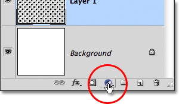
*Click on the New Fill or Adjustment Layer icon.*

Choose a **Gradient** fill layer from the list that appears:

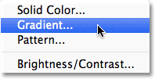
*Choose Gradient from the list.*

Holding down the Alt (Win) / Option (Mac) key while clicking the New Fill or Adjustment Layer icon tells Photoshop to pop open the **New Layer** dialog box where we can set some options for our Gradient fill layer before it's added. The option we're interested in is the one that says **Use Previous Layer to Create Clipping Mask**. Click inside its checkbox to select it. With this option selected, the Gradient fill layer will automatically be clipped to Layer 1 below it, saving us from having to do it ourselves later:

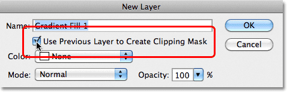
*Select the Use Previous Layer to Create Clipping Mask option.*

Click OK to close out of the New Layer dialog box. The **Gradient Fill** dialog box will open, which is where we can choose the gradient we want to use. Click on the gradient **preview thumbnail**:

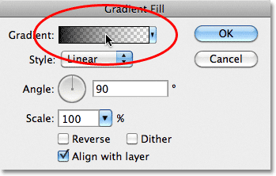
*Click on the gradient preview thumbnail.*

This opens Photoshop's **Gradient Editor**. At the top of the dialog box, in the **Presets** section, is a set of thumbnails showing previews of the ready-made gradients we can choose from. Simply click on a thumbnail to select the gradient. Each time you click on a thumbnail, you'll see a preview of how the gradient will look in the document window. For example, if you want something really bright and colorful, you can try the **Spectrum** gradient by clicking on its thumbnail:

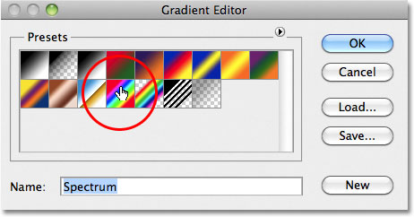
*Clicking on the Spectrum gradient's thumbnail to select it.*

In the document window, we can see what the Spectrum gradient will look like. Notice that only the circles themselves are being affected by the gradient thanks to that Use Previous Layer to Create Clipping Mask option we selected a moment ago in the New Layer dialog box:

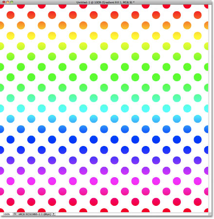
*The Spectrum gradient turns the black circles into a rainbow of color.*

By default, Photoshop doesn't give us many gradients to choose from, but there are other gradient sets available. To find them, click on the small arrow icon above the gradient thumbnails:

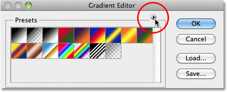
*Click on the small arrow icon.*

Clicking on the arrow opens a menu containing a list of additional gradient sets we can load in. Obviously we won't go through each one of them here since you can easily experiment with them on your own, but as an example, I'll select the **Color Harmonies 2** set from the list:

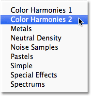
*Selecting the Color Harmonies 2 gradient set.*

Once you've chosen a gradient set, Photoshop will ask if you want to replace the current gradients with the new set or if you just want to append them, which will keep the current gradients and add the new ones to them. Choose **Append**:

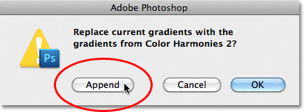
*Add the new gradients in with the current ones by choosing Append.*

The new gradients will appear after the original gradients in the Presets area of the Gradient Editor. Just as with the originals, you can select and preview any of the new gradients by clicking on their thumbnail. I'll click on the **Blue, Yellow, Pink** gradient to select it:

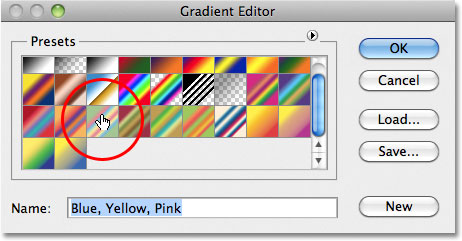
*Clicking on the Blue, Yellow, Pink gradient's thumbnail.*

The circle pattern is now colorized with the softer colors of the new gradient:

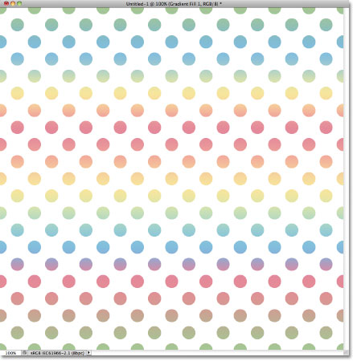
*The new gradient gives the pattern a softer, less intense look.*

Once you've found a gradient you like for your repeating pattern, click OK to close out of the Gradient Editor, then click OK to close out of the Gradient fill dialog box.

### Changing The Gradient

Just like we saw with the Solid Color fill layer, we can go back and change our gradient at any time. If we look in the Layers panel, we see our Gradient fill layer, which Photoshop named Gradient Fill 1, sitting above the circles pattern on Layer 1. Notice that it's indented to the right, telling us that it's clipped to Layer 1 below it. To change to a different gradient, simply **double-click** directly on the Gradient fill layer's **thumbnail**:

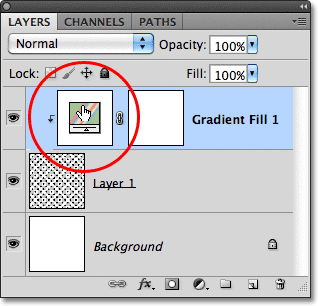
*Double-click on the Gradient fill layer's thumbnail.*

This re-opens the Gradient Fill dialog box. To change the gradient, click as we did before on the gradient **preview thumbnail**:

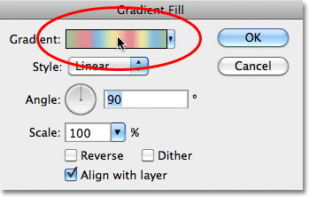
*Click again on the gradient preview thumbnail.*

This will re-open the Gradient Editor, where you can either choose from any of the other currently available gradients or you can load in a different gradient set. I'll click on the small arrow icon to open the menu listing the other gradient sets and this time, I'll choose the **Pastels** set from the list:

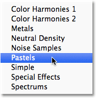
*Selecting the Pastels gradient set.*

I'll add these new gradients in with the others by selecting Append when Photoshop asks me, and the new gradient thumbnails appear in the Presets area of the Gradient Editor. I'll select the **Green, Purple, Blue** gradient this time:

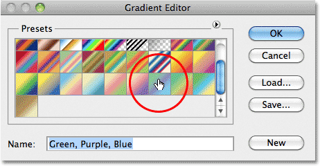
*Clicking on the Green, Purple, Blue gradient's thumbnail to select it.*

With my new gradient selected, I'll click OK to close out of the Gradient Editor, then I'll click OK to close out of the Gradient Fill dialog box. The circles have now changed to the new gradient's colors:

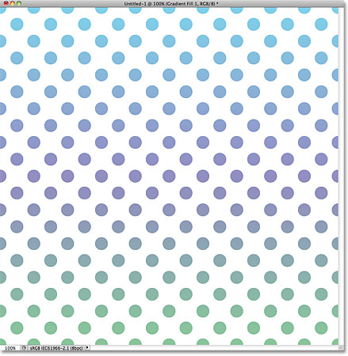
*It's easy to switch gradients at any time with Gradient fill layers.*

Of course, we don't have to stick with a white background. Here, I've used the steps we covered in the first part of the tutorial to add a Solid Color fill layer above the Background layer. I chose a medium purple from the Color Picker as the new color for my background (R:85, G:80, B:129):

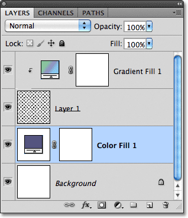
*A Gradient fill layer colorizes the pattern while a Solid Color fill layer now fills the background.*

And here, we see the combined efforts of the Gradient fill layer on the circle pattern and the Solid Color fill layer on the background:

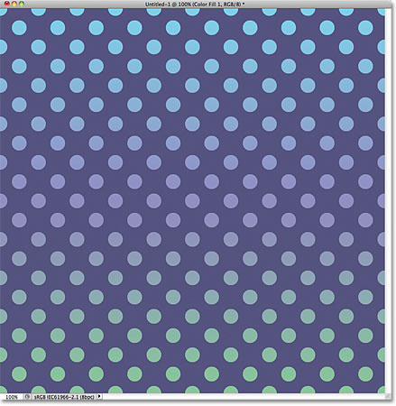
*The final result.*