# Repeating Patterns In Photoshop – The Basics

> Source: [https://www.photoshopessentials.com/basics/repeating-patterns-intro/](https://www.photoshopessentials.com/basics/repeating-patterns-intro/)
> Downloaded and converted to Markdown.

In this tutorial, we'll learn the basics of making and using simple repeating patterns in Photoshop. We're just going to cover the essential steps here to get things started, but once you understand how repeating patterns work and how easy they are to create, you'll quickly discover on your own that there's virtually no limit to their creative potential in your designs, whether you're building a simple background for a scrapbook or web page or using them as part of a more complex effect.

This tutorial will cover the three main parts to working with repeating patterns. First, we'll design a single tile which will eventually become our repeating pattern. Next, we'll learn how to save the tile as an actual pattern in Photoshop. Finally, with our new pattern created, we'll learn how to select the pattern and make it repeat across an entire layer! In the next set of tutorials, we'll take repeating patterns further by adding colors and gradients, using blend modes to blend multiple patterns together, creating patterns from custom shapes, and more!

I'll be using Photoshop CS5 here, but the steps apply to any recent version of Photoshop.

### Step 1: Create A New Document

Let's begin by creating a single tile for the pattern. For that, we need a new blank document, so go up to the **File** menu in the Menu Bar along the top of the screen and choose **New**:

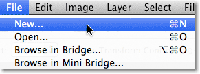

*Go to File > New.*

This opens the New Document dialog box. Enter **100 pixels** for both the **Width** and **Height**. The document's size will determine the size of the tile, which will affect how often the pattern repeats in the document (since a smaller tile will need more repetitions to fill the same amount of space than a larger tile would). In this case we'll be creating a 100 px x 100 px tile. You'll want to experiment with different sizes when creating your own patterns later.

I'll leave my **Resolution** value set to **72 pixels/inch**. Set the **Background Contents** to **Transparent** so our new document will have a transparent background:

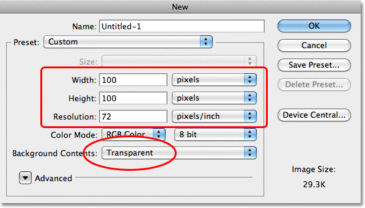

*Enter the width and height of your document and make sure Background Contents is set to Transparent.*

Click OK when you're done to close out of the dialog box. The new document appears on your screen. The checkerboard pattern filling the document is Photoshop's way of telling us that the background is transparent. Since the document is rather small at only 100 px x 100 px, I'll [zoom in](/basics/photoshop-zoom/) on it by holding down my **Ctrl** (Win) / **Command** (Mac) key and pressing the **plus sign** ( **+** ) a few times. Here, the document is zoomed in to 500%:

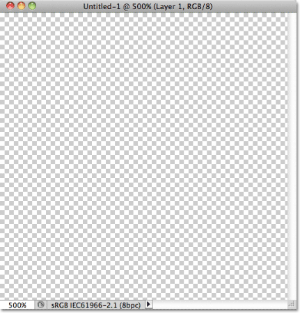

*The new blank document, zoomed in to 500%.*

### Step 2: Add Guides Through The Center Of The Document

We need to know the exact center of our document, and we can find it using Photoshop's guides. Go up to the **View** menu at the top of the screen and choose **New Guide**:

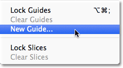

*Go to View > New Guide.*

This opens the New Guide dialog box. Select **Horizontal** for the **Orientation**, then enter **50%** for the **Position**. Click OK to close out of the dialog box, and you'll see a horizontal guide appear through the center of the document:

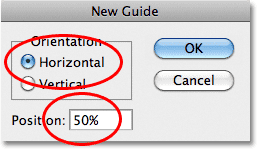

*Select Horizontal and enter 50% for the Position.*

Go back up to the **View** menu and once again choose **New Guide**. This time in the New Guide dialog box, select **Vertical** for the **Orientation** and again enter **50%** for the **Position**:

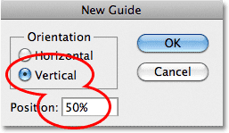

*Select Vertical and enter 50% for the Position.*

Click OK to close out of the dialog box, and you should now have a vertical and horizontal guide running through the center of the document. The point where they meet is the exact center. The default guide color is cyan so they may be a bit difficult to see in the screenshot:

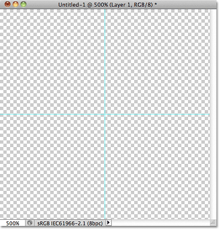

*A vertical and horizontal guide runs through the center of the document.*

### Changing The Guide Color (Optional)

If you're having trouble seeing the guides because of their light color, you can change their color in Photoshop's Preferences. On a PC, go up to the **Edit** menu, choose **Preferences**, then choose **Guides, Grid & Slices**. On a Mac, go up to the **Photoshop** menu, choose **Preferences**, then choose **Guides, Grid & Slices**:

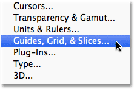

*Select the Guides, Grid and Slices Preferences.*

This opens Photoshop's Preferences dialog box set to the Guides, Grid & Slices options. The very first option at the top of the list is Guide **Color**. As I mentioned, it's set to Cyan by default. Click on the word Cyan and choose a different color from the list. You'll see a preview of the color in the document window. I'll change mine to **Light Red**:

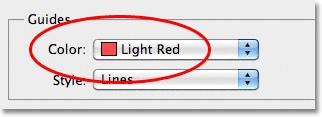

*Selecting Light Red as the new color for the guides.*

Click OK when you're done to close out of the Preferences dialog box. The guides in the document window now appear in the new color (note that Photoshop will continue to display guides in this new color until you go back to the Preferences and change the color back to Cyan or choose a different color):

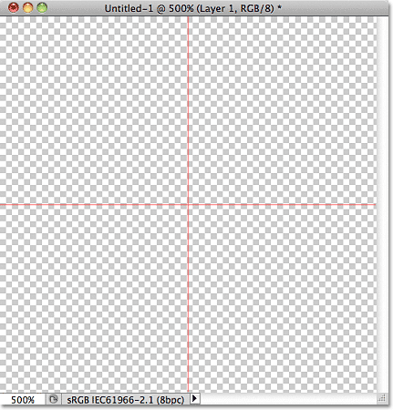

*The guides now appear in the new color, making them easier to see.*

### Step 3: Draw A Shape In The Center Of The Document

You can create very complex patterns in Photoshop, or they can be as simple as, say, a repeating dot or circle. Let's draw a circle in the center of the document. First, select the **[Elliptical Marquee Tool](/basics/selections/elliptical-marquee-tool/)** from the Tools panel. By default, it's hiding behind the [Rectangular Marquee Tool](/basics/selections/rectangular-marquee-tool/), so click on the Rectangular Marquee Tool and hold your mouse button down for a second or two until a fly-out menu appears, then select the Elliptical Marquee Tool from the list:

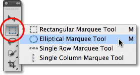

*Click and hold on the Rectangular Marquee Tool, then select the Elliptical Marquee Tool.*

With the Elliptical Marquee Tool selected, move the crosshair directly over the intersection point of the guides in the center of the document. Hold down **Shift+Alt** (Win) / **Shift+Option** (Mac), click in the center of the document, then with your mouse button still held down, drag out a circular selection. Holding the Shift key as you drag will force the shape of the selection into a perfect circle, while the Alt (Win) / Option (Mac) key tells Photoshop to draw the selection outline from the center. When you're done, your selection outline should look similar to this (don't worry about the exact size as long as it's close):

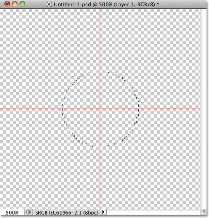

*Hold down Shift+Alt (Win) / Shift+Option (Mac) and drag out a circular selection outline from the center.*

### Step 4: Fill The Selection With Black

Go up to the **Edit** menu at the top of the screen and choose **Fill**:

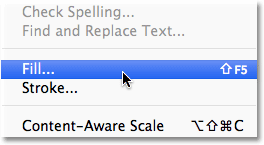

*Go to Edit > Fill.*

This opens the Fill dialog box, where we can choose a color to fill the selection with. Set the **Use** option at the top of the dialog box to **Black**:

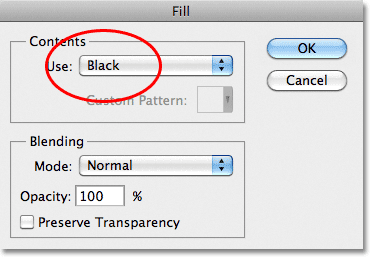

*Set the Use option to Black.*

Click OK to close out of the dialog box. Photoshop fills the circular selection with black. Press **Ctrl+D** (Win) / **Command+D** (Mac) to quickly remove the selection outline from around the shape (you could also go up to the **Select** menu at the top of the screen and choose **Deselect**, but the keyboard shortcut is faster). Keep in mind that my document is still zoomed in to 500%, which is why the edges of the circle appear blocky:

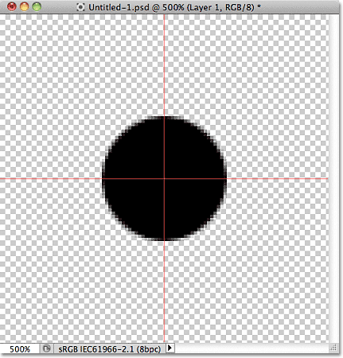

*The selection has been filled with black.*

### Step 5: Duplicate The Layer

With just this one circle added in the center of the tile, we could save the tile as a pattern, but let's make it look a bit more interesting before we do that. First, make a copy of the layer by going up to the **Layer** menu at the top of the screen, choosing **New**, then choosing **Layer via Copy**. Or, if you prefer keyboard shortcuts, press **Ctrl+J** (Win) / **Command+J** (Mac):

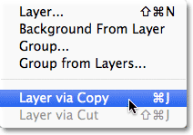

*Go to Layer > New > Layer via Copy.*

Nothing will happen yet in the document window, but a copy of the layer, which Photoshop names "Layer 1 copy", appears above the original in the Layers panel:

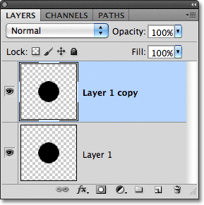

*The Layers panel showing a copy of Layer 1 above the original.*

### Step 6: Apply The Offset Filter

When designing tiles to use as repeating patterns, there's one filter you'll use almost every time, and that's **Offset**, which you can get to by going up to the **Filter** menu at the top of the screen, choosing **Other**, then choosing **Offset**:

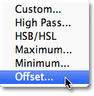

*Go to Filter > Other > Offset.*

This opens the Offset filter dialog box. The Offset filter moves, or offsets, the contents of a layer by a specified number of pixels either horizontally, vertically, or both. When creating simple repeating patterns like the one we're designing here, you'll want to enter half the width of your document into the Horizontal input box and half the height of your document into the Vertical input box. In our case, we're working with a 100 px x 100 px document, so set the **Horizontal** option to **50** pixels and the **Vertical** option also to **50** pixels. At the bottom of the dialog box, in the **Undefined Areas** section, make sure **Wrap Around** is selected:

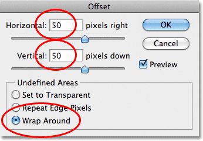

*Set the Horizontal and Vertical options to half the dimensions of the document and make sure Wrap Around is checked.*

Click OK to close out of the dialog box. In the document window, we see that the Offset filter has taken the copy of the circle we made in the previous step and split it into four equal parts, placing them in the corners of the document. The circle remaining in the center is the original circle we drew on Layer 1:

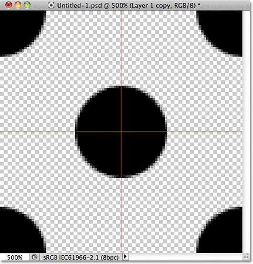

*The image after running the Offset filter.*

### Step 7: Define The Tile As A Pattern

With the tile designed, let's save it as an actual pattern, a process Photoshop refers to as "defining a pattern". Go up to the **Edit** menu at the top of the screen and choose **Define Pattern**:

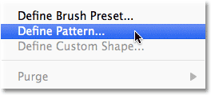

*Go to Edit > Define Pattern.*

Photoshop will pop open a dialog box asking you to name the new pattern. It's a good idea to include the dimensions of the tile in the name of the pattern in case you design several similar tiles at different sizes. In this case, name the tile "Circles 100x100". Click OK when you're done to close out of the dialog box. The tile is now saved as a pattern!

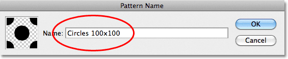

*Name the pattern "Circles 100x100".*

### Step 8: Create A New Document

We've designed our tile and defined it as a pattern, which means we can now use it to fill an entire layer! Let's create a new document to work in. Just as we did back in Step 1, go up to the **File** menu and choose **New**. When the New Document dialog box appears, enter **1000 pixels** for both the **Width** and **Height**. Leave the **Resolution** set to **72 pixels/inch**, and this time, set the **Background Contents** to **White** so the background of the new document is filled with solid white. Click OK when you're done to close out of the dialog box. The new document will appear on your screen:

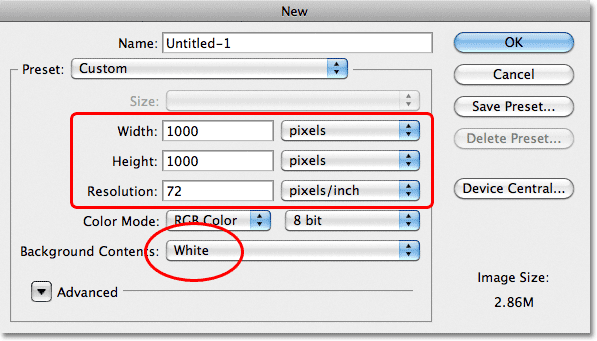

*Create a new 1000 px x 1000 px document with a white background.*

### Step 9: Add A New Layer

We *could* simply fill the document's Background layer with our pattern, but that would seriously limit what we can do with it. As we'll see in the next tutorial when we look at adding colors and gradients to patterns, a much better way to work is to place the repeating pattern on its own layer. Click on the **New Layer** icon at the bottom of the Layers panel:

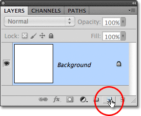

*Click on the New Layer icon.*

A new blank layer named "Layer 1" appears above the Background layer:

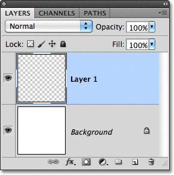

*The new layer appears.*

### Step 10: Fill The New Layer With The Pattern

With our new layer added, let's fill it with our pattern! Go up to the **Edit** menu and choose **Fill**:

*Go to Edit > Fill.*

Normally, Photoshop's Fill command is used to fill a layer or selection with a solid color, just as we did back in Step 4 when we used it to fill the circular selection with black. But we can also use the Fill command to fill something with a pattern, and we do that by first setting the **Use** option at the top of the dialog box to **Pattern**:

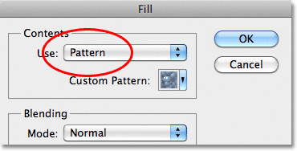

*Change the Use option to Pattern.*

With Pattern selected, a second option, **Custom Pattern**, appears directly below it, which is where we choose the pattern we want to use. Click on the pattern **preview thumbnail**:

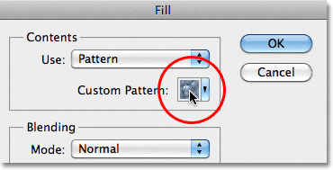

*Click directly on the Custom Pattern thumbnail.*

This opens the **Pattern Picker**, which displays small thumbnails of all the patterns we currently have to choose from. The circle pattern we just created will be the last thumbnail in the list. If you have Tool Tips enabled in Photoshop's Preferences (they're enabled by default), the name of the pattern will appear when your hover your cursor over the thumbnail. Double-click on it to select it and exit out of the Pattern Picker:

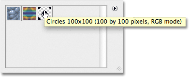

*Select the "Circles 100x100" pattern in the Pattern Picker.*

Once you've selected the pattern, all that's left to do is click OK to close out of the Fill dialog box. Photoshop fills the blank layer in the document with the circle pattern, repeating the tile as many times as needed:

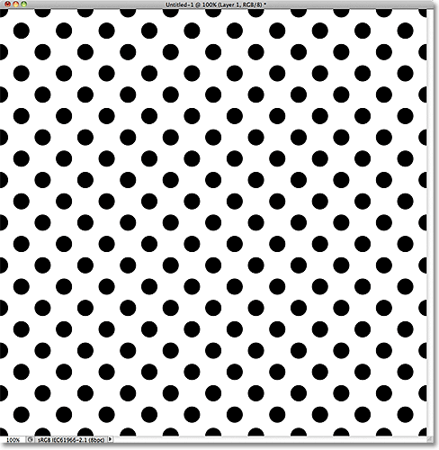

*Layer 1 is now filled with the repeating circle pattern.*