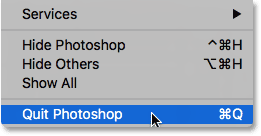
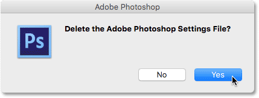
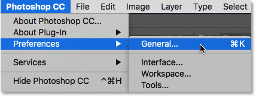
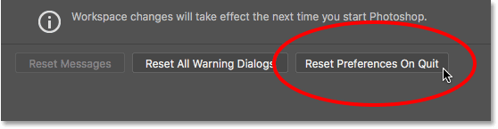
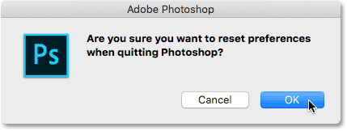

# How To Reset Photoshop Preferences

> Source: [https://www.photoshopessentials.com/basics/reset-photoshop-preferences/](https://www.photoshopessentials.com/basics/reset-photoshop-preferences/)
> Downloaded and converted to Markdown.

The most common cause of sudden performance issues with Photoshop is a corrupted Preferences file. Learn how to easily delete and reset the Photoshop Preferences to their defaults. We learn how to restore the Preferences in Photoshop CC and in earlier versions of Photoshop.

Is your copy of Photoshop acting strange? Panels or menu items disappearing? Tools misbehaving? Chances are, the problem is that your Photoshop Preferences file has become corrupted. I don't mean it's been accepting bribes from shady business associates (or at least, we haven't found anyone willing to talk). It means that the Preferences file has been damaged and the information inside of it is messed up.

The Preferences file is where Photoshop stores many of its performance settings. There's general display and interface settings, tool settings, file handling and saving options, type settings, scratch disk settings, plugin options, and more. We looked at some of the more important options in the previous tutorial in this series, [Essential Photoshop Preferences For Beginners](/basics/essential-photoshop-preferences-beginners/). Each time we close out of Photoshop, the Preferences file is re-written. Unfortunately, each time we re-write a file, there's a chance that something will go wrong. If that file happens to be your Preferences file, then that's when Photoshop starts acting up.

Luckily, there's an easy way to reset Photoshop's preferences back to their defaults. In fact, as of Photoshop CC 2015, there's *two* easy ways to do it. In this tutorial, we'll learn both ways. We'll start with the original way that works with any version of Photoshop. Then, as if that way isn't easy enough, we'll look at an even easier way to reset the Preferences file using a brand new option in Photoshop CC (Creative Cloud).

This is lesson 8 of 8 in [Chapter 1 - Getting Started with Photoshop](/basics/getting-started-photoshop/).

Let's get started!

### A Word Of Caution

Before we begin, note that resetting Photoshop's Preferences file will reset more than just the preferences. You'll also reset your [color settings](/basics/color-settings/) as well as any custom [keyboard shortcuts](/basics/custom-keyboard-shortcuts/) or workspaces you've created. If you want to keep these items, make sure you've saved them (using their respective dialog boxes) before you continue.

## How To Reset Photoshop Preferences (All Versions)

### Step 1: Quit Photoshop

Let's look at how to reset the Photoshop Preferences using a method that works with all versions of Photoshop. First, quit Photoshop. On a Windows PC, go up to the **File** menu in the Menu Bar along the top of the screen and choose **Exit**. On a Mac, go up to the **Photoshop** menu in the Menu Bar and choose **Quit Photoshop**:

*Go to File > Exit (Win) / Photoshop > Quit Photoshop (Mac).*

### Step 2: Relaunch Photoshop While Pressing The Keyboard Shortcut

With Photoshop closed, press and hold **Shift+Ctrl+Alt** (Win) / **Shift+Command+Option** (Mac) on your keyboard and relaunch Photoshop the way you normally would.

### Step 3: Delete The Photoshop Preferences File

Just before Photoshop opens, a message will pop up asking if you want to delete the Adobe Photoshop Settings file. This is your Preferences file. Choose **Yes**. Photoshop will then open with all of your preferences restored to their original, default settings:

*Choose Yes when asked if you want to delete the Settings file.*

## Reset Photoshop Preferences In Photoshop CC

Next, let's learn how to reset the Photoshop Preferences using a new method in Photoshop CC. You'll need to be using Photoshop CC and you'll want to make sure that your copy is [up to date](/basics/update-photoshop-cc/).

### Step 1: Open The Preferences Dialog Box

In Photoshop CC, Adobe has added a new option for resetting the preferences. The option is found in the Preferences dialog box. To open the dialog box, on a Windows PC, go up to the **Edit** menu at the top of the screen, choose **Preferences**, and then choose **General**. On a Mac, go up to the **Photoshop CC** menu, choose **Preferences**, then choose **General**:

*Go to Edit > Preferences > General (Win) / Photoshop CC > Preferences > General (Mac).*

### Step 2: Choose "Reset Preferences On Quit"

This opens the Preferences dialog box set to the General options. Here, you'll find the new **Reset Preferences On Quit** option. Click on it to select it:

*Clicking the new Reset Preferences On Quit option.*

### Step 3: Choose "Yes" To Delete The Preferences When Quitting

You'll be asked if you're sure you want to reset the preferences when you quit Photoshop. Click **OK**:

*Confirm that you want to reset the preferences.*

### Step 4: Close And Relaunch Photoshop

Quit Photoshop by going to **File** > **Exit** (Win) / **Photoshop** > **Quit Photoshop CC** (Mac). The next time you open Photoshop CC, it will launch with your preferences restored to their defaults.