# How to Reset the Tools And Toolbar In Photoshop

> Source: [https://www.photoshopessentials.com/basics/reset-toolbar-photoshop-cc/](https://www.photoshopessentials.com/basics/reset-toolbar-photoshop-cc/)
> Downloaded and converted to Markdown.

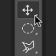

Learn how to quickly reset Photoshop's toolbar back to its default tool layout, and how to reset Photoshop's tools to their default settings in the Options Bar, using the Reset All Tools command in Photoshop!

Photoshop's **Reset All Tools** command has been around for a long time. In previous versions of Photoshop, choosing Reset All Tools would reset all of your tool settings in the Options Bar back to their defaults. This cleared away any previous, custom settings that were used. What Reset All Tools would *not* do, though, is reset the Toolbar itself back to its default layout. If you wanted to restore all of the default tools, you would need to go through each spot in the Toolbar one at a time and manually choose the default tool.

In Photoshop CC, we no longer need to do that. The Reset All Tools command still resets the tools back to their default settings in the Options Bar. But now, it also resets each spot in the Toolbar back to its default, primary tool.

The improved Reset All Tools command was first added in Photoshop CC 2014. But because it didn't get a lot of attention, many Photoshop users are unaware of it. To use it, and to follow along with this tutorial, you'll need to be running [Photoshop CC](https://prf.hn/l/dlXjD2w). You'll also want to make sure that your copy of Photoshop CC is [up to date](/basics/update-photoshop-cc/).

This is lesson 3 of 10 in our [Learning the Photoshop Interface](/basics/learning-the-photoshop-interface/) series.

Let's get started!

## The Photoshop Toolbar

In the previous tutorial in this series, we learned all about the [Toolbar](/basics/photoshop-tools-toolbar-overview/) in Photoshop. The Toolbar is where Photoshop stores all of its various tools, from selection tools to editing tools, type tools, shape tools, navigation tools, and more. There are [so many tools](/basics/photoshop-tools-toolbar-overview/), in fact, that not all of them can be displayed in the Toolbar at once. Many of Photoshop's tools are hidden behind other tools.

### The Default Tools

For example, Photoshop includes four basic, geometric selection tools—the [Rectangular Marquee Tool](/basics/selections/rectangular-marquee-tool/), the [Elliptical Marquee Tool](/basics/selections/elliptical-marquee-tool/), the **Single Row Marquee Tool**, and the **Single Column Marquee Tool**. To save space, all four of these tools are nested together in the same spot in the Toolbar. By default, the Rectangular Marquee Tool is the one that's visible. It's the **default tool** for the group:

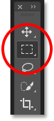
*The Toolbar showing the Rectangular Marquee Tool by default.*

### The Hidden Tools

Most of the default tools in the Toolbar have other tools hiding behind them, nested into the same spot. To view the other tools, either **click and hold**, or **right-click** (Win) / **Control-click** (Mac), on the default tool's icon. A fly-out menu will appear listing the other tools hiding behind it. Click on the name of a tool to select it. I'll choose the Elliptical Marquee Tool, just to pick something different:

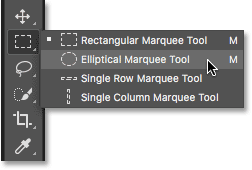
*Use the fly-out menu to select any of the hidden tools.*

### The Default Tool Is No Longer Displayed

Notice, though, that after choosing a different tool (in this case, the Elliptical Marquee Tool), the Toolbar is no longer displaying the default tool in that spot. Instead, it's displaying the new tool I selected. That's because Photoshop always shows *the last tool that was selected*, which means you won't always see the default tool. To select the default tool (the Rectangular Marquee Tool) at this point, I would need to **click and hold**, or **right-click** (Win) / **Control-click** (Mac), on the Elliptical Marquee Tool and then choose the Rectangular Marquee Tool from the fly-out menu:

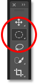
*The Elliptical Marquee tool has replaced the Rectangular Marquee Tool as the visible tool in the group.*

The same is true for Photoshop's freeform selection tools (the [Lasso Tool](/basics/selections/lasso-tool), the [Polygonal Lasso Tool](/basics/selections/polygonal-lasso-tool/) and the [Magnetic Lasso Tool](/basics/selections/magnetic-lasso-tool/)). The Lasso Tool is the default tool for the group, so it's the tool we see initially. To select one of the other tools in the group, we need to **click and hold**, or **right-click** (Win) / **Control-click** (Mac), on the Lasso Tool and then choose a different tool from the fly-out menu. I'll choose the Polygonal Lasso Tool:

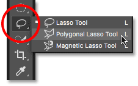
*By default, the Polygonal and Magnetic Lasso Tools are hiding behind the Lasso Tool.*

After selecting the new tool, we see that the Polygonal Lasso Tool has replaced the standard Lasso Tool as the visible tool in that spot. Again, it's because Photoshop always displays the last tool that was selected. In fact, we now have *two* spots in the Toolbar where a tool other than the default, primary tool is now visible:

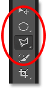
*The Polygonal Lasso Tool has replaced the standard Lasso Tool in the Toolbar.*

### Selecting More Tools

We won't go through every spot in the Toolbar, but I'll quickly change a few more of them. I'll **right-click** (Win) / **Control-click** (Mac) on the [Quick Selection Tool](/basics/selections/quick-selection-tool/) and choose the [Magic Wand Tool](/basics/selections/magic-wand-tool/) from the fly-out menu:

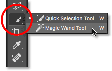
*Choosing the Magic Wand Tool from behind the Quick Selection Tool.*

Then I'll **right-click** (Win) / **Control-click** (Mac) on the [Crop Tool](/photo-editing/how-to-crop-images-photoshop-cc/) and select the [Perspective Crop Tool](/photo-editing/perspective-crop-tool-cs6/) hiding behind it:

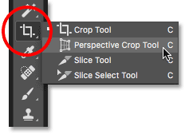
*Choosing the Perspective Crop Tool from behind the standard Crop Tool.*

Lastly, I'll **right-click** (Win) / **Control-click** (Mac) on the **Eyedropper Tool** and I'll choose Photoshop's **Ruler Tool** from the fly-out menu:

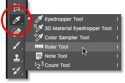
*Choosing the Ruler Tool from behind the Eyedropper Tool.*

After selecting these other tools, we see that my Toolbar is becoming cluttered with tools other than the defaults. It's not a huge problem, but it *can* make things confusing as you're learning Photoshop (especially if you're trying to follow along with tutorials that ask you to select default tools). It can also be a nuisance as you're working:

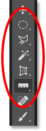
*The Toolbar showing several spots where the default tool has been replaced.*

## How To Reset The Photoshop Toolbar And Tool Settings

### Step 1: Select A Default Tool

Luckily, we now have a way to instantly reset Photoshop's Toolbar back to its default layout thanks to the improved Reset All Tools command. But before we reset the Toolbar, there's one important step we need to do. In order for this to work, we first need to select a spot in the Toolbar where the default tool is *still visible*. In my case (and most likely yours, too), the spot at the very top of the Toolbar is still showing the **Move Tool**. The Move Tool is the default tool for its group. Click on the Move Tool to select it. You can also select the Move Tool by pressing the letter **V** on your keyboard. Note that the Move Tool itself is not what's important here. You can select any tool as long as it's the default tool for its group:

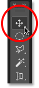
*Selecting the Move Tool at the top of the Toolbar.*

### Step 2: Choose "Reset All Tools" In The Options Bar

With a default tool selected in the Toolbar, if you look up in the **Options Bar** along the top of the screen, you'll find the **Tool Presets** option over on the far left. The Tool Presets option doesn't have an icon of its own. Instead, it displays the icon of whichever tool is currently selected. In my case, it's the Move Tool:

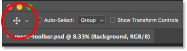
*The Tool Presets option on the far left of the Options Bar.*

To reset your Toolbar back to its default layout, **right-click** (Win) / **Control-click** (Mac) on the Tool Presets icon. Then choose **Reset All Tools** from the menu:

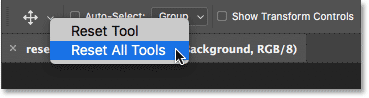
*Choosing the "Reset All Tools" command.*

### Step 3: Click OK

To confirm that you want to reset the tools and the Toolbar, click OK:

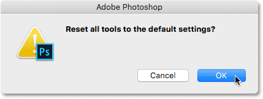
*Clicking OK to restore the default tool and Toolbar settings.*

And just like that, my Toolbar is back to its original layout, with all of the default tools once again visible. And, if I was to select any of the tools, I would see that all of its options in the Options Bar have been reset to the defaults:

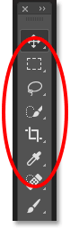
*Each spot has been instantly reset to its default tool thanks to the improved Reset All Tools command.*