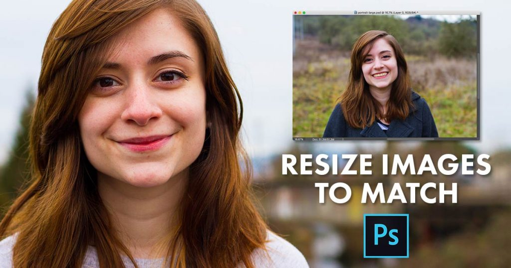
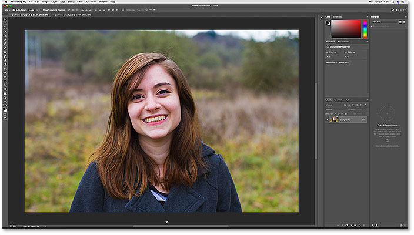
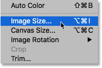
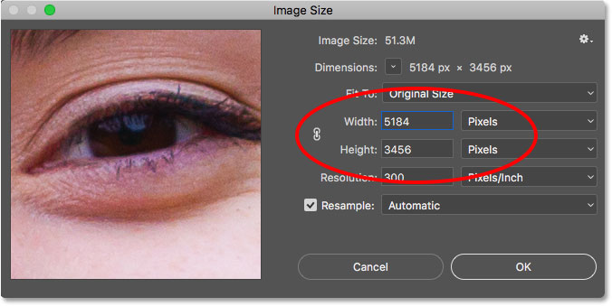
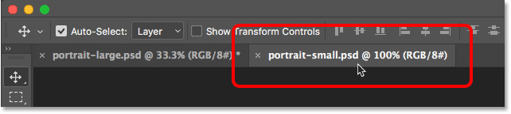
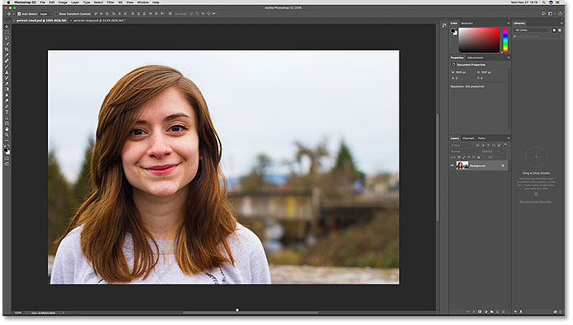
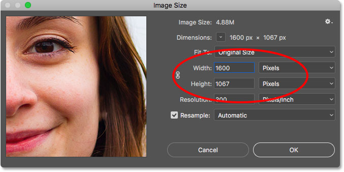
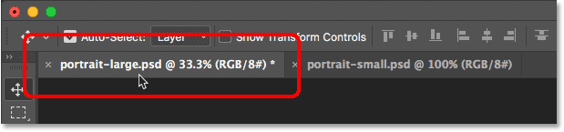
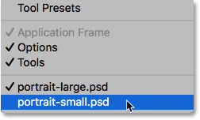
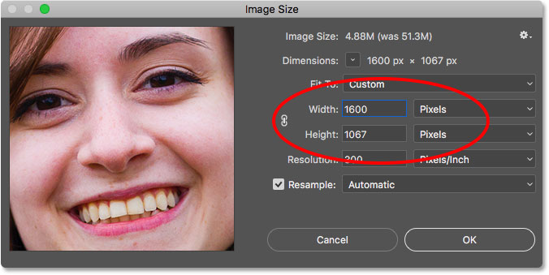

# How To Resize An Image To Match Another In Photoshop

> Source: [https://www.photoshopessentials.com/basics/resize-image-match-another-photoshop/](https://www.photoshopessentials.com/basics/resize-image-match-another-photoshop/)
> Downloaded and converted to Markdown.

This tutorial shows you how to instantly match the size (width and height) of two open images or documents in Photoshop using the Image Size dialog box and the Window menu. For Photoshop CC, CS6 and earlier.

If you're compositing images, designing a layout or uploading photos to the web, you'll often need to resize images in Photoshop so that they share the same dimensions (the same width and height). One way to do that would be to manually enter the same values for the width and height into Photoshop's Image Size dialog box for each image you need to resize. But if one of your images is already the size you need, here's a time-saving trick you can use to quickly resize another image to match! I'll be using [Photoshop CC 2018](https://prf.hn/l/dlXjD2w) but any recent version will work.

## Two Images, Two Different Sizes

Here I have two images open in Photoshop. This first image is the larger of the two and the one I need to resize ([portrait photo](https://prf.hn/l/Jz3eEep) from Adobe Stock):

*The first of two open images. Photo credit: Adobe Stock.*

To view the current size of the image, I'll go up to the **Image** menu in the Menu Bar and choose **Image Size**:

*Opening the Image Size dialog box.*

In the Image Size dialog box, we see that this image has a **Width** of **5184 pixels** and a **Height** of **3456 pixels**. I'll click Cancel for now to close the dialog box without making any changes:

*The Image Size dialog box showing the current width and height of the larger image.*

To switch to my second image, I'll click on its document [tab](/basics/tabbed-and-floating-documents-in-photoshop/). Notice in the tabs that my larger image is named "portrait-large" and my smaller image is named "portrait-small". The names of the images will become important when we go to resize one to match the size of the other:

*Clicking the tab to view the second image.*

After clicking the tab, we see my second, smaller image ([portrait photo](https://prf.hn/l/wzWPAa9) from Adobe Stock):

*The second of the two open images. Photo credit: Adobe Stock.*

The view its size, I'll again go up to the **Image** menu and choose **Image Size**. And here we see that this smaller image has a **Width** of **1600 pixels** and a **Height** of **1067 pixels**. I need to resize my larger image to match this exact size, but there's no need to write the numbers down. Instead, let's see how Photohop can enter the values for us! I'll again click Cancel to close the dialog box:

*The second image is already set to the width and height we need.*

## How To Resize An Image To Match The Size Of Another

### Step 1: Select The Image To Resize

To resize an image to match the size of another open image, first select the document that holds the image you need to resize by clicking on its tab. I'll select my "portrait-large" document:

*Selecting the image that needs to be resized.*

### Step 2: Open The Image Size Dialog Box

With the document selected, go up to the **Image** menu and choose **Image Size**:

*Going to Image > Image Size.*

This opens the Image Size dialog box where we see the current width and height of the image. As a quick refresher, here again we see that my larger image is 5184 pixels wide and 3456 pixels tall:

*The current width and height of the image.*

### Step 3: Choose The Image You Want To Match From The Window Menu

To resize the image to match the size of another image, go up to the **Window** menu in the Menu Bar. At the very bottom of the Window menu is the name of each image that's currently open in Photoshop. In my case, I have two open images, "portrait-large.psd" and "portrait-small.psd". The image you're currently viewing has a checkmark beside it. Choose the image you want to match from the list. I'll choose "portrait-small":

*Selecting the image with the size to match from the Window menu.*

Photoshop instantly changes the width and height values to match the dimensions of the image you selected. In my case, the larger image will now share the same width (1600 pixels) and height (1067 pixels) of the smaller image. Click OK to resize the image. Both images are now the same size:

*Photoshop automatically matches the width and height of the other image.*

And there we have it! That's how to quickly resize an image to match the size of another in Photoshop! To learn more about resizing images, see [How To Resize Images In Photoshop](/essentials/resize-images-photoshop-cc/). Or visit our [Photoshop Basics](/basics/) section for more tutorials!