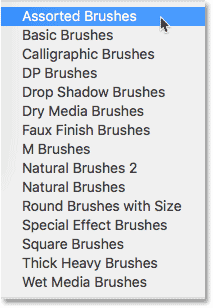
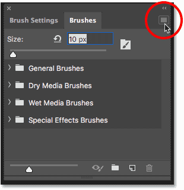
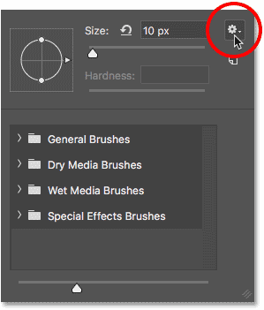
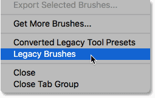
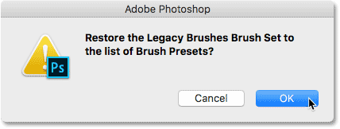
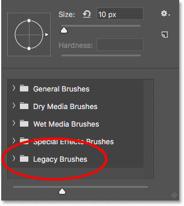
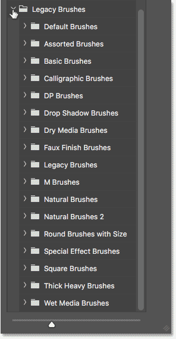

# How to Restore Legacy Brushes in Photoshop

> Source: [https://www.photoshopessentials.com/basics/restore-legacy-brushes-photoshop-cc-2018/](https://www.photoshopessentials.com/basics/restore-legacy-brushes-photoshop-cc-2018/)
> Downloaded and converted to Markdown.

Using Photoshop CC 2020 and can't find the additional brush sets from earlier versions of Photoshop? Learn how to restore all of Photoshop's missing brushes using the new Legacy Brushes set!

Back in earlier versions of Photoshop, clicking the menu icon in the Brush Presets panel, or the gear icon in the Brush Preset Picker, would open a list of additional brush sets that could be loaded into Photoshop. These sets included Assorted Brushes, Natural Brushes, Special Effect Brushes, and more:

*The additional brush sets found in earlier versions of Photoshop.*

But as of Photoshop CC 2018, Adobe has made big changes to the way Photoshop's brushes are organized. And at first glance, the additional brush sets from earlier versions of Photoshop seem to be missing. Fortunately, they haven't gone away. All of those additional brushes have been moved to a new set that Adobe calls the **Legacy Brushes**, and here's how to use it to find any brush you need!

## How to load the Legacy Brushes set

### Step 1: Open the menu

To load the brush sets from earlier versions of Photoshop, click the **menu icon** in the upper right corner of the **Brushes panel** (formerly the Brush Presets panel):

*The menu icon in the Brushes panel.*

Or, with the Brush Tool selected, click the **gear icon** in the upper right of the **Brush Preset Picker**:

*The gear icon in the Brush Preset Picker.*

### Step 2: Choose "Legacy Brushes"

Choose the new **Legacy Brushes** set from the menu:

*"Legacy Brushes" is where you'll find all of Photoshop's previous brushes.*

### Step 3: Click OK to restore the Legacy Brushes

Click OK when Photoshop asks if you want to restore the Legacy Brushes set:

*Loading the Legacy Brushes set into Photoshop.*

### Step 4: Choose a legacy brush set from the list

Back in the Brushes panel or the Brush Preset Picker, a new folder named "Legacy Brushes" appears below the default folders:

*The new "Legacy Brushes" set appears.*

Open the "Legacy Brushes" folder to find all of the additional brush sets from previous versions of Photoshop, including the old Default Brushes. To select a brush, twirl open any of the legacy sets and choose the brush you need:

*All of Photoshop's classic brushes are found in the Legacy Brushes set.*

And there we have it! That's how to use the new Legacy Brushes set to restore Photoshop's classic brushes in Photoshop CC 2018! If you're an Adobe Creative Cloud subscriber, then along with the classic brushes, you can also download over [1000 new Photoshop brushes](basics/get-more-brushes-photoshop-cc-2018/)! You'll also want to learn how to save your brushes as [custom brush presets](basics/save-custom-brush-presets-photoshop-cc2018/). Visit our [Photoshop Basics](/basics/) section for more tutorials!