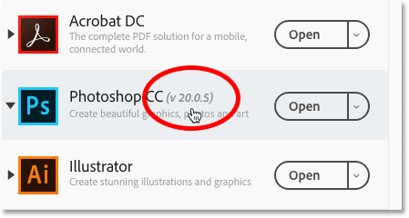
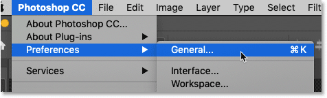
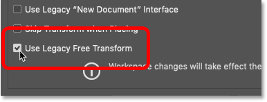
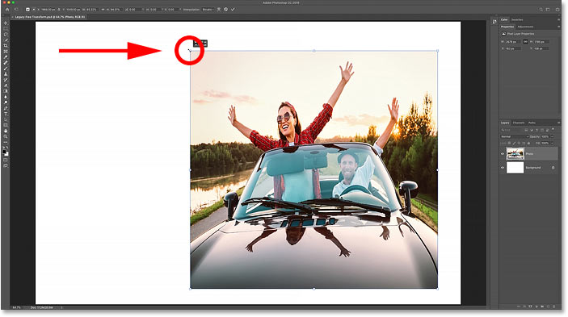
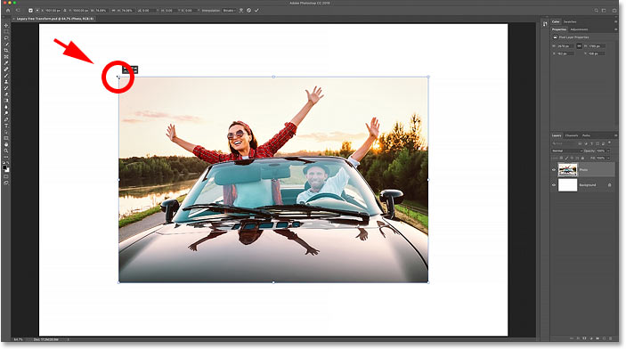

# Restore the Legacy Free Transform command in Photoshop CC 2019

> Source: [https://www.photoshopessentials.com/basics/restore-legacy-free-transform-photoshop-cc-2019/](https://www.photoshopessentials.com/basics/restore-legacy-free-transform-photoshop-cc-2019/)
> Downloaded and converted to Markdown.

Still struggling with Adobe's changes to Free Transform in Photoshop CC 2019? Learn how to restore the original Free Transform behavior with the new Use Legacy Free Transform option!

In Photoshop CC 2019, Adobe made a sudden and surprising change to the Free Transform command. For years, the default behavior of Free Transform was to scale images non-proportionally. Clicking and dragging a handle let you freely adjust the size of the image without worrying about the aspect ratio. To scale the image proportionally, you had to press and hold your Shift key while dragging a corner handle.

But in CC 2019, Adobe turned Free Transform upside down, and now the default behavior is to scale images *proportionally*. Dragging a corner handle or a side handle now scales the image with the aspect ratio locked in place. And holding Shift as you drag scales the image *non-proportionally*. Check out my previous tutorial to learn about all the [changes to Free Transform in CC 2019](/basics/free-transform-in-photoshop-cc-2019-new-features-and-changes/).

If you're a long-time Photoshop user and you've been frustrated with this change, you're not alone. But just when you thought you were finally getting used to it, Adobe has updated Photoshop with a brand new **Use Legacy Free Transform** option that lets you easily restore Free Transform to its original behavior. Here's how to use it!

## How to restore the legacy Free Transform behavior

### Step 1: Update Photoshop CC

To restore the original Free Transform behavior, the first step is to update your copy of [Photoshop](https://prf.hn/l/dlXjD2w). The option we need was added to Photoshop CC in version 20.0.5, released in June 2019.

I cover [how to update Photoshop](/basics/update-photoshop-cc/) in a separate tutorial, but the steps are easy. Just open your **Adobe Creative Cloud** app and select the **Apps** category at the top. Scroll down to **Photoshop CC** and look at the version number beside its name. The version number should say **20.0.5** or higher. If it doesn't, and you see an Update button instead of an Open button, click **Update**:

*The Use Legacy Free Transform option was added in version 20.0.5.*

### Step 2: Open Photoshop's Preferences

Next, open the [Photoshop Preferences](/basics/essential-photoshop-preferences-beginners/). On a Windows PC, go to **Edit** > **Preferences** > **General**. On a Mac, go to **Photoshop CC** > **Preferences** > **General**. Or you can open the Preferences from your keyboard by pressing **Ctrl**+**K** (Win) / **Command**+**K** (Mac):

*Opening Photoshop's Preferences.*

### Step 3: Select "Use Legacy Free Transform"

Then in the General category, select the new **Use Legacy Free Transform** option. Don't worry about the warning that says the change will take place after you restart Photoshop. The Use Legacy Free Transform option takes effect as soon as you select it. When you're done, click OK to close the Preferences dialog box:

*Selecting "Use Legacy Free Transform".*

### Step 4: Open Free Transform

Select the Free Transform command by going up to the **Edit** menu and choosing **Free Transform**, or by pressing **Ctrl**+**T** (Win) / **Command**+**T** (Mac) on your keyboard:

*Going to Edit > Free Transform.*

### Step 5: Drag the handles to scale the image

And now when you drag the handles, you're back to the original Free Transform behavior. Drag any handle to scale the image non-proportionally ([travel photo](https://prf.hn/l/MDmyzB9) from Adobe Stock):

*Drag a handle to scale the image with the aspect ratio unlocked. Photo credit: Adobe Stock.*

Or press and hold **Shift** and drag a **corner handle** to scale the image proportionally. And regardless of which version of Free Transform you're using, you can always press and hold the **Alt** (Win) / **Option** (Mac) key as you drag a handle to scale the image from its center:

*Hold Shift and drag a corner handle to lock the aspect ratio.*

And there we have it! That's how to easily bring back the original Free Transform behavior in Photoshop CC! Check out our [Photoshop Basics](/basics/) section for more tutorials! And don't forget, all of our tutorials are now available to [download as PDFs](/print-ready-pdfs)!