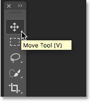
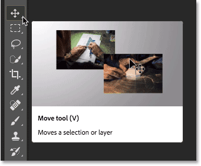
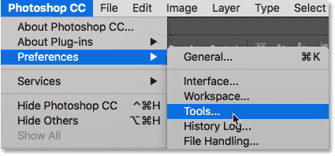
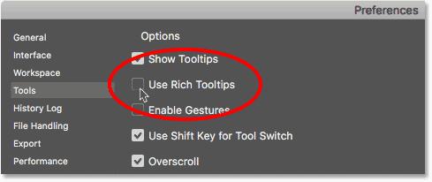

# Rich Tool Tips In Photoshop CC 2018

> Source: [https://www.photoshopessentials.com/basics/rich-tool-tips-photoshop-cc-2018/](https://www.photoshopessentials.com/basics/rich-tool-tips-photoshop-cc-2018/)
> Downloaded and converted to Markdown.

This tutorial introduces the new Rich Tool Tips feature in Photoshop CC 2018 which adds instructional video clips to the Tool Tips when you hover over a tool in the Toolbar. You'll also learn how to switch back to Photoshop's traditional Tool Tips.

Photoshop CC 2018 is here, adding great new features to Photoshop like better integration with Adobe Lightroom, the [Curvature Pen Tool](/basics/use-curvature-pen-tool-photoshop-cc-2018/), the redesigned Brushes panel, and more! But one new feature in CC 2018, **Rich Tool Tips**, maybe isn't quite as great as the others, at least in my opinion. In this quick tutorial, we'll look at the idea behind Rich Tool Tips and how they work. And then, if you agree with me that they're not as useful as Adobe was hoping for, you'll learn how to turn them off and restore the more traditional Tool Tips that Photoshop has been using for years.

Rich Tool Tips are only available as of [Photoshop CC 2018](https://prf.hn/l/dlXjD2w), so you'll need CC 2018 to use them. If you're a Creative Cloud subscriber and not sure how to update to CC 2018, see our [How To Keep Photoshop CC Up To Date](/basics/update-photoshop-cc/) tutorial for everything you need.

## Photoshop's Traditional vs Rich Tool Tips

Tool Tips have been around in Photoshop since forever, and they're a great way to help new Photoshop users [learn their way around](/basics/learning-the-photoshop-interface/) the program. With Tool Tips enabled (which they are by default), hovering your mouse cursor over a [tool in the Toolbar](/basics/photoshop-tools-toolbar-overview/) pops up the name of the tool along with its handy keyboard shortcut. Here's what a traditional Tool Tip looks like as I hover my cursor over the Move Tool:

*The way Tool Tips in Photoshop used to look.*

In Photoshop CC 2018, Adobe has introduced **Rich Tool Tips**. Instead of just a small, simple text box, we now have a much larger box that's, well, pretty much impossible to ignore. Along with the tool's name, keyboard shortcut and a brief description of what the tool is used for, Rich Tool Tips also include a video animation showing the tool in action:

*The new Rich Tool Tips in Photoshop CC 2018.*

### The Problem With Rich Tool Tips

In theory, Rich Tool Tips sound like a good idea. Who wouldn't want an animation showing how the tool works? Of course, the simple answer is, anyone who *already knows* how it works. And even if you haven't yet learned how to use the tool, you still won't know just by watching a 5 or 6 second animation. So while they sound great in theory, Rich Tool Tips don't offer much value in the real world. In fact, they can quickly become annoying, taking up too much space on the screen without any real purpose for being there.

### How To Disable Rich Tool Tips

If you like this new feature, great! Rich Tool Tips in Photoshop CC 2018 are enabled by default so there's nothing you need to do to keep using them. But if, like me, you prefer the older-style, traditional Tool Tips, here's how to bring them back.

The option for turning Rich Tool Tips on and off is found in the [Photoshop Preferences](/basics/essential-photoshop-preferences-beginners/). On a Windows PC, go up to the **Edit** menu in the Menu Bar, choose **Preferences**, and then choose **Tools**. On a Mac, go up to the **Photoshop CC** menu, choose **Preferences**, and then choose **Tools**:

*Opening the Tools preferences in Photoshop CC 2018.*

In the Tools preferences, to turn Rich Tool Tips off and switch back to the traditional Tool Tips, simply uncheck the **Use Rich Tooltips** option. Then, click OK to close the Preferences dialog box. The next time you hover your mouse cursor over a tool in the Toolbar, you'll be see the normal Tool Tip:

*Toggle Rich Tool Tips on and off using the "Use Rich Tooltips" option in the Preferences.*

And there we have it! That's a quick look at the new Rich Tool Tips feature in Photoshop CC 2018 and how to switch back to Photoshop's traditional Tool Tips. Also check out the brand new [Curvature Pen Tool](/basics/use-curvature-pen-tool-photoshop-cc-2018/) in Photoshop CC 2018. Or visit our [Photoshop Basics](/basics/) section for similar tutorials!