# How To Save Custom Brush Presets In Photoshop CC 2018

> Source: [https://www.photoshopessentials.com/basics/save-custom-brush-presets-photoshop-cc2018/](https://www.photoshopessentials.com/basics/save-custom-brush-presets-photoshop-cc2018/)
> Downloaded and converted to Markdown.

In this tutorial, you'll learn how to save your Photoshop brushes as custom brush presets using the new Brushes panel in Photoshop CC 2018! Along with the standard Brush Settings that Photoshop has always saved with presets, Photoshop CC 2018 now lets you save your Tool Settings from the Options Bar, as well as your brush color! And the new Brushes panel, which replaces the old Brush Presets panel from earlier versions of Photoshop, makes it easy to keep your brushes organized by saving them into folders. Let's see how it works! To follow along, you'll need [Photoshop CC or newer](https://prf.hn/l/dlXjD2w) and you'll want to make sure that your copy is [up to date](/basics/update-photoshop-cc/).

## Creating A Custom Photoshop Brush

### Step 1: Select The Brush Tool

Let's begin by creating a custom Photoshop brush that we can save as a preset. We'll make a simple highlighter brush. Select the **Brush Tool** from the [Toolbar](/basics/photoshop-tools-toolbar-overview/):

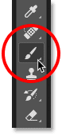
*Selecting the Brush Tool.*

### Step 2: Choose A Brush Color

Still in the Toolbar, click the **Foreground color swatch** to choose a brush color:

*Clicking the Foreground color swatch.*

In the Color Picker, choose orange. We'll save this brush color as part of the preset, but we'll also learn how to quickly save presets for other colors as well. Click OK to close the Color Picker:

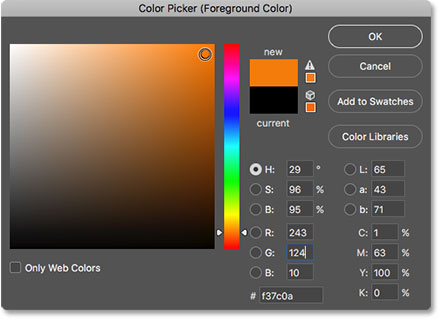
*The brush color can now be saved as part of your custom preset.*

### Step 3: Set The Brush Tool Options In the Options Bar

In Photoshop CC 2018, we can now save the Tool Settings in the Options Bar as part of the brush preset. This includes the Mode (the blend mode of the brush), the Opacity and Flow settings, and the new Smoothing option. For our highlighter brush, change the **Mode** from Normal to **Multiply**. This will allow our brush strokes to interact with each other, making each successive pass over the same stroke darker. Then, lower the **Opacity** of the brush to **60%**:

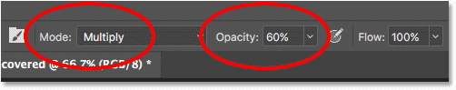
*The Brush Tool options can also be saved as part of the preset.*

### Step 4: Change The Brush Settings

Go up to the **Window** menu in the Menu Bar and choose **Brush Settings**:

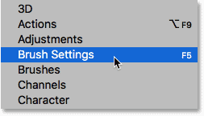
*Going to Window > Brush Settings.*

In the Brush Settings panel (formerly the Brush panel), set the **Size** of the brush to **100 px**, then set the **Angle** to **77°** and the **Roundness** to **20%**. Increase the **Hardness** to **100%**, and finally, lower the **Spacing** to **10%**. A preview of the brush stroke appears along the bottom of the panel:

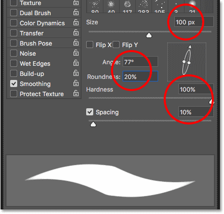
*The Brush Settings.*

I'll paint a couple of strokes inside my document so we can see what the highlighter brush looks like. The area where the two brush strokes overlap is darker than the rest thanks to the blend mode of the brush being set to Multiply:

*The simple highlighter brush we've created.*

## How To Save A Custom Brush Preset

### Step 1: Open The Brushes Panel

To save your brush as a custom preset, open the **Brushes panel**. If the Brush Settings panel is already open, you can switch to the Brushes panel by clicking its tab at the top:

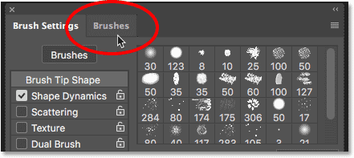
*Switching from the Brush Settings to the Brushes panel.*

Another way to open the Brushes panel is by going up to the **Window** menu in the Menu Bar and choosing **Brushes**:

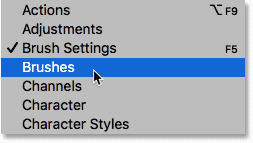
*Opening the Brushes panel from the Window menu.*

### Step 2: Create A New Preset Group

By default, the Brushes panel includes four groups, one for each of the four new brush sets (General, Dry Media, Wet Media, and Special Effects) that ships with Photoshop CC 2018. Each group is represented by a folder.

When saving your own custom brushes, it's best to place them inside a group to keep them organized. But rather than adding them to one of these default groups, click the **Create New Group** icon at the bottom of the panel. If you've already created a group for your presets, skip to the next step:

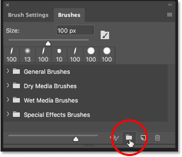
*Clicking the "Create New Group" icon.*

Give the new group a name. I'll name mine "My Group". Click OK when you're done to close the dialog box:

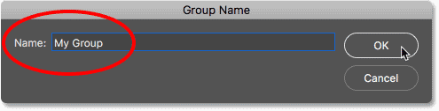
*Naming the new group.*

### Step 3: Create A New Brush Preset

Back in the Brushes panel, the new group appears as a folder below the others. To save your custom brush inside the group, make sure the group is selected, and then click the **Create New Brush** icon:

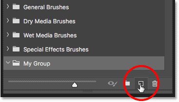
*Creating a new brush preset.*

### Step 4: Name The Brush Preset

Give your new brush preset a name. I'll name mine "Highlighter - Orange":

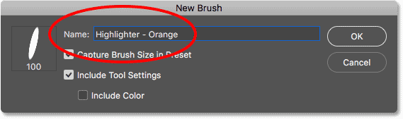
*Naming the custom brush preset.*

### Step 5: Choose Which Settings To Include In The Preset

Along with naming the brush, we can also choose which settings to include with the preset. Photoshop will automatically save your settings from the Brush Settings panel, but you can also save the current size of your brush by selecting **Capture Brush Size in Preset**. To include the Tool Settings from the Options Bar, select **Include Tool Settings**. And if you want to save the color of your brush as part of the preset, select **Include Color**. In my case, I'll select all three options:

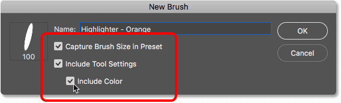
*Adding the brush size, tool settings and brush color to the preset.*

Click OK to close the dialog box, and the new brush preset appears as a thumbnail inside the group. The **tool icon** in the upper right corner of the thumbnail tells us that the Tool Settings have been saved with the preset, while the **color swatch** means that the brush color is saved as well. If either of these icons is missing from a thumbnail, it means that the preset does not include the Tool Settings, the brush color, or both:

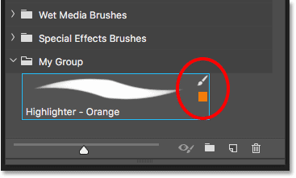
*Look for the icons to know which options are included in the brush preset.*

## Creating More Brushes From An Existing Preset

Now that we've saved the orange highlighter brush as a preset, what if we want to save variations of it? In other words, what if we want to create another highlighter, but this time with the brush color set to green (or yellow, or blue, or any other color)? We can use our existing preset as a starting point.

### Step 1. Select The Existing Brush Preset

Since everything other than the color of the two brushes will be the same, I'll start by selecting my "Highlighter - Orange" brush in the Brushes panel:

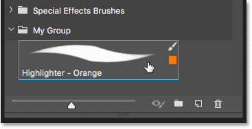
*Selecting the "Highlighter - Orange" brush.*

### Step 2: Change Your Settings

Then, in the Toolbar, I'll click the **Foreground color swatch** to choose a new brush color:

*Choosing a new color for the new brush.*

In the Color Picker, I'll choose green, and then I'll click OK:

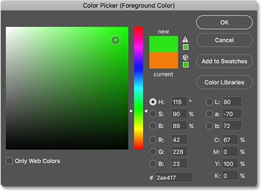
*Selecting green from the Color Picker.*

### Step 3: Save The Brush As A New Custom Preset

Back in the Brushes panel, I'll make sure I have the correct group selected ("My Group"), and then I'll click once again on the **Create New Brush** icon:

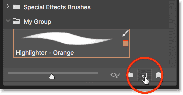
*Creating a second brush preset.*

I'll name this second brush "Highlighter - Green", and I'll make sure I have the same options selected as before so that I'm including the brush size, the Tool Settings in the Options Bar, and the new brush color as part of the preset. To save a generic highlighter brush without the color, simply uncheck the "Include Color" option:

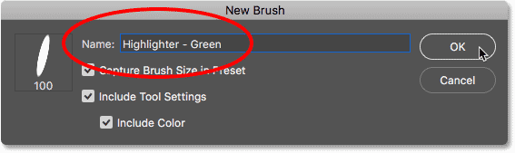
*Naming and saving the second brush preset.*

I'll click OK to close the dialog box, and now in the Brushes panel, I have two custom highlighter brushes, one set to orange and the other set to green (as shown in the color swatches), ready to select any time I need them:

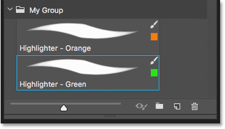
*Same brush, two different colors.*

I'll paint with the new brush so we can see that both highlighter brushes share the same settings, including the blend mode and opacity options in the Options Bar. The only difference is their color:

*The second preset uses the same Brush and Tool Settings as the first.*

And there we have it! That's how to easily save custom brush presets using the new Brushes panel in Photoshop CC 2018! Along with new brushes, Photoshop CC 2018 also includes the original brush sets from previous versions. See our [Legacy Brushes](/basics/restore-legacy-brushes-photoshop-cc-2018/) tutorial to learn how to restore them. Visit our [Photoshop Basics](/basics/) section for more Photoshop tutorials!