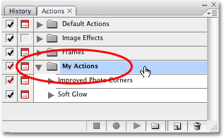
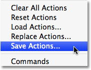
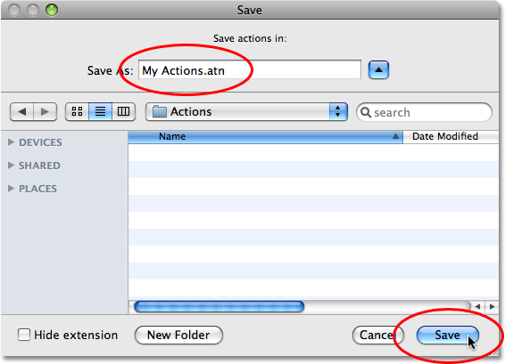
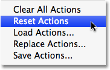
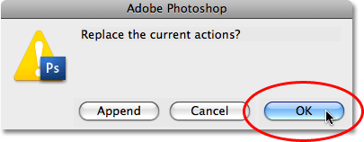
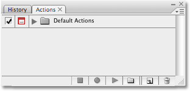
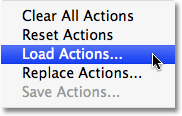
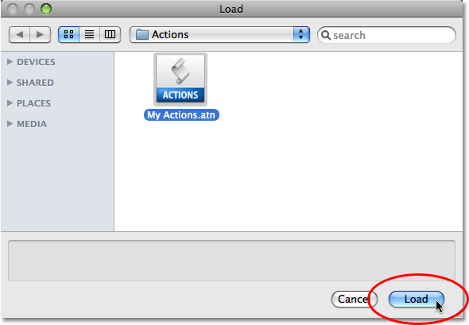
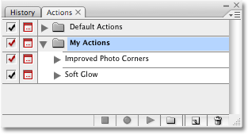

# Photoshop Actions – Saving And Loading Actions

> Source: [https://www.photoshopessentials.com/basics/photoshop-actions/save-load-actions/](https://www.photoshopessentials.com/basics/photoshop-actions/save-load-actions/)
> Downloaded and converted to Markdown.

If you've taken the time to [record an action in Photoshop](/basics/photoshop-actions/record-action/), or you've [edited an existing action](/basics/photoshop-actions/editing-an-action/), you're going to want to save it, otherwise you run the risk if losing it if Photoshop decides to crash on you. Thankfully, Adobe has made it easy for us to save our actions, although there is one thing you need to be aware of. Photoshop does not allow us to save individual actions. We can only save action sets. So if you record or edit an action and want to save it (which of course you'll want to do), you'll need to select and save the entire action set. This is one of the main reasons why I suggested earlier that you should avoid placing your own actions inside any of the action sets that Photoshop comes with. Keep all of your actions inside your own action sets, which will make it easy to save them, load them, and keep them organized.

To save an action set, first select the set you want to save in the Actions palette. I have a couple of actions inside my "My Actions" set - the "Soft Glow" action we created in the previous section and the "Improved Photo Corners" action, which is a customized version of the original "Photo Corners" action that comes with Photoshop. I want to save this action set, so I'll select it in the Actions palette:

*Select the action set you want to save in the Actions palette.*

With the action set selected, click on the menu icon in the top right corner of the Actions palette, or if you're using Photoshop CS2 or earlier, click on the small right-pointing arrow. This brings up the Actions palette's menu. Select **Save Actions** from the menu:

*Choose "Save Actions" from the Actions palette's menu.*

Photoshop will pop open the **Save** dialog box. Save your action set to a location on your computer where you'll be able to easily access it later. I've created a folder on my Desktop named "Actions" and I'll save the "My Actions" set into this folder. This will make it easy for me to find the action set later if I need to load it back into Photoshop. Make sure you save your action set with the extension ".atn" after the name if you want your actions to be playable on both a PC and a Mac. When you're ready, click on the **Save** icon in the dialog box to save your actions:

*Choose a location to save your action set, then click "Save".*

Your actions are now saved! If Photoshop crashes at this point, your actions will be safe. Of course, if your computer crashes, you'll probably lose Photoshop, your actions and everything else, so I would highly suggest backing up your actions on to a recordable CD or DVD, or on to an external hard drive just in case.

### Resetting The Actions Palette To The Defaults

Now that we've saved our actions, let's clear everything out of the Actions palette and reset it to just the Default Actions set. To do that, click once again on the menu icon in the top right corner of the Actions palette, or the small arrow if you're using a version of Photoshop prior to CS3, and select **Reset Actions** from the menu:

*Select "Reset Actions" from the Actions palette's menu.*

Photoshop will pop up a warning box, as if often does, asking if you really want to replace the existing actions with the Default Actions set. Click **OK** to close the dialog box and rest your actions:

*Click OK in the warning box that appears.*

If we look in our Actions palette now, we can see that all of the action sets have disappeared. Only the Default Actions set remains:

*The actions have now been reset in the Actions palette.*

### Loading Actions Into Photoshop

Now that we've cleared out and cleaned up our Actions palette, let's load the action set we saved a moment ago. Click on the menu icon (or the small right-pointing arrow) in the top right corner of the Actions palette to bring up the menu, then select **Load Actions** from the menu choices:

*Select "Load Actions" from the Actions palette's menu.*

This brings up the **Load** dialog box. Navigate to where you saved your action set on your computer, select the action set, then click on the Load button in the dialog box. My action set was saved to a folder named "Actions" on my Desktop, so that's where I'll navigate to. I'll click on the "My Actions" set, then I'll click **Load**:

*Navigate to your action set, select it, then click on the "Load" button.*

And now, if we look once again in the Actions palette, we can see that the "My Actions" set has been successfully loaded back in to Photoshop:

*The "My Actions" set has been loaded back in to Photoshop.*

Notice how the action set appears already twirled open in the Actions palette. That's because it was twirled open when I saved it. Action sets will appear either opened or closed after being loaded in to the Actions palette depending on how they appeared when they were saved.