# Saving, Loading and Reusing Layer Styles in Photoshop

> Source: [https://www.photoshopessentials.com/basics/saving-layer-styles/](https://www.photoshopessentials.com/basics/saving-layer-styles/)
> Downloaded and converted to Markdown.

In this Photoshop tutorial, we're going to learn how to save, load and reuse layer styles! Photoshop's layer styles are a great way to create fun and interesting photo effects and text effects without requiring a lot of effort, or even a lot of skill. You don't need to be a Photoshop guru or spend your life studying light and color theory to begin applying drop shadows, strokes, gradients, patterns, inner and outer glows and more to your images with layer styles, creating everything from subtle color effects to the wildest and craziest text effects anyone's ever seen. In fact, the only thing you really need to benefit from layer styles in Photoshop is a willingness to play around and experiment. That, plus it also helps to have some free time on your hands, since layer styles can become a bit of an addiction.

If free time is in short supply, not to worry. Photoshop makes it easy to save our layer style creations so we can easily re-apply them to other images without having to redo any of the steps! In this tutorial, to give us something to work with, we're going to be creating a simple photo frame using nothing but layer styles. When we're done, we're going to save the completed effect, and then we'll see how to apply the exact same photo frame to a different image instantly!

Here's the photo frame we'll be creating:

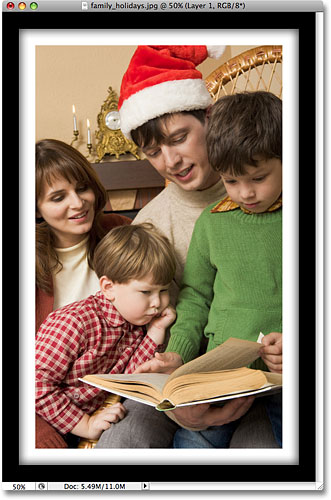
*A simple photo frame created with layer styles in Photoshop.*

Keep in mind that the photo frame itself is not the main focus of this tutorial, although you're certainly free to follow along with the steps and use the completed frame with your images. The point of the tutorial, though, is to learn how easy it is to save your own layer style effects, load them back into Photoshop when needed and then apply them instantly to other images.

Let's get started!

#### Step 1: Duplicate The Background Layer

With our photo newly opened in Photoshop, the first thing we need to do before we can begin adding any layer styles to it is duplicate the Background layer. If we look in our Layers palette, we can see that we currently have one layer and it's named *Background*. This is the layer that contains our original photo. We usually duplicate this layer before doing anything else so we don't harm our original **[pixel](/essentials/pixels.php)** information, but in this case, there' a different reason. Photoshop doesn't allow us to apply layer styles to Background layers. In fact, if you look at the **Layer Styles icon** at the bottom of the Layers palette, you'll see that it's currently grayed out and unavailable:

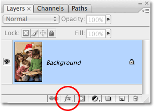
*The Layer Styles icon appears grayed out and unavailable for the Background layer.*

Let's get around this little problem by creating a copy of the Background layer. Go up to the **Layer** menu at the top of the screen, choose **New**, and then choose **Layer via Copy**:

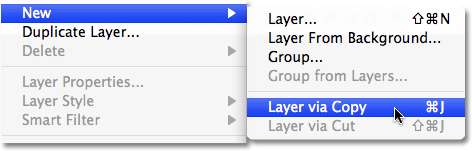
*Go to Layer > New > Layer via Copy.*

Or, for a much faster way to duplicate a layer, simply press the keyboard shortcut **Ctrl+J** (Win) / **Command+J** (Mac). If we look again at our Layers palette, we can see that we now have an identical copy of the Background layer sitting above the original. Photoshop has automatically named the copy "Layer 1":

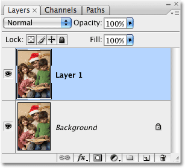
*A copy of the Background layer appears above the original in the Layers palette.*

Now that we have a copy of the Background layer to work with, we can begin adding our layer styles!

#### Step 2: Apply A Black Stroke To The Layer

As I mentioned at the beginning, we're going to be creating a simple photo frame using nothing but layer styles, and the first thing we'll do is create a black border around the edges of the photo. Click on the **Layer Styles** icon at the bottom of the Layers palette (which is now available to us) and select **Stroke** from the bottom of the list of layer styles that appears:

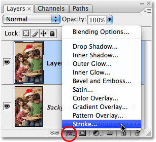
*Select Stroke from the list of layer styles.*

This brings up Photoshop's rather large Layer Style dialog box set to the Stroke options in the middle column. The first thing we want to change is the stroke's color. For some reason, the folks at Adobe set the default stroke color to red. I think I can count on one hand the number of times I've wanted red for my stroke color, but no matter. We can easily change it. We're going to use black for our stroke color, so click on the **color swatch** to the right of the word **Color**:

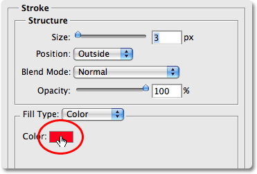
*Click on the color swatch to change the color of the stroke.*

This brings up Photoshop's **Color Picker**. Select **black** for the stroke color. If you're not sure how to use the Color Picker, simply enter a value of **0** for the **R**, **G** and **B** options, circled in red. This will select black. Click OK when you're done to exit out of the Color Picker:

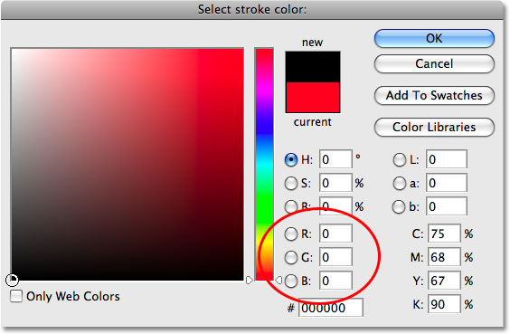
*Select black from the Color Picker.*

With the stroke color now set to black, change the **Position** option to **Inside**. This will place the entire stroke within the boundaries of our image. Then, to adjust the thickness of the stroke, drag the **Size** slider. Dragging the slider to the right increases the size of the stroke, while dragging it to the left decreases the stroke size. The value you end up choosing will depend on the size of the photo you're using, as well as how thick you want your frame to appear, so keep an eye on your image in the document window as you drag the slider. For my photo, I'm going to go with a value of **60 px** (pixels) for my stroke size:

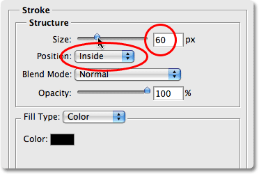
*Change the Position of the stroke to "Inside", then increase the Size to create the black border around the image.*

When you're done, your photo should have a black border around the inside edges:

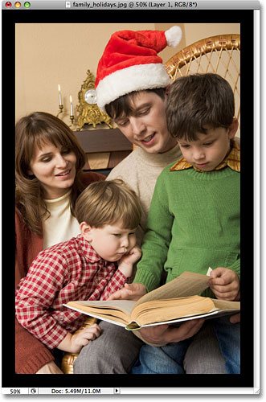
*A black border now appears around the inside edges of the photo.*

Don't click out of the Layer Style dialog box just yet. We still have a couple more layer styles to add before our photo frame is complete.

#### Step 3: Add A White Inner Glow

We've created the first part of our photo frame, using the Stroke layer style in Photoshop to add a black border around the inside edges of the photo. This time, let's add a white border just inside the black one. Unfortunately, we can only use a particular layer style once per layer, which means that since we've already used the Stroke layer style to add the black border, we can't use it again unless we create another new layer and apply a completely different set of layer styles to it, which isn't what we want to do. So, since we want to add something that looks like a white stroke, but we can't use the Stroke layer style because we've already used it, we're going to have to get a little creative.

Fortunately, there are other ways to create a stroke effect. One of them is by using the **Inner Glow** layer style. We'll just need to change a few options. First, with the Layer Style dialog box still open, select the **Inner Glow** style from over on the left of the dialog box. Make sure you click directly on the words "Inner Glow" and don't just click inside the checkbox. Clicking inside the checkbox will turn the layer style on but won't give us access to any of its options. To access the options, we need to click directly on the layer style's name:

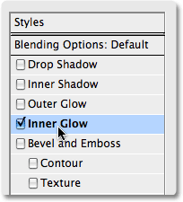
*Click directly on the words "Inner Glow" on the left of the Layer Style dialog box.*

Once you've selected Inner Glow, the middle column of the Layer Style dialog box will change to the Inner Glow options. The default color for the inner glow is yellow and we want to use white, so just as we did for the stroke a moment ago, click on the **color swatch** which this time is located directly below the word "Noise":

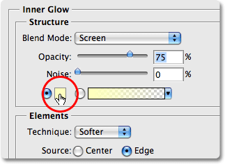
*Click on the color swatch to change the color of the inner glow.*

This brings up Photoshop's **Color Picker** once again. Choose **white** for the inner glow color. If you need help choosing white, simply enter a value of **255** for the **R**, **G** and **B** options, circled in red. This will select white. Click OK to exit out of the Color Picker when you're done:

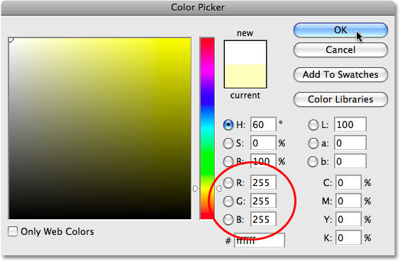
*Choose white for the inner glow color using the Color Picker.*

With the color now set to white, we have a few options that we need to change in order to make our inner "glow" look more like an inner "stroke". First, near the top of the dialog box, increase the **Opacity** of the inner glow to a full **100%**. Next, in the center of the dialog box, change the **Technique** option to **Precise**. Down at the bottom of the list of options, decrease the **Range** option down to **1%**. Finally, back in the center of the dialog box, drag the **Size** slider to increase the size of the glow, which will now appear as a stroke thanks to the options we've changed. The glow actually begins at the edges of the photo, not the edges of the black stroke that we applied a moment ago, which means that as you drag the Size slider to the right, you won't actually see the white border appearing in the image until you've increased it beyond the size of the black border. If you recall, I set the thickness of my black stroke to 60 pixels, which means I'll need to increase the size of my white inner glow beyond 60 pixels before I'll see it in my image.

I actually want my white border to appear to be the same thickness as my black border, which means I'll need to set the size of my inner glow to *twice* the size of my black stroke. Since my black stroke is set to 60 px, I'll set the size of my inner glow to **120 px**. Again, the value you enter may be different depending on the size of the image you're using:

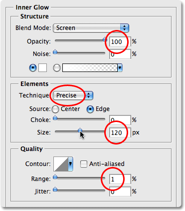
*Change the options circled in red to make the inner glow appear more like a stroke.*

Your image should now look something like this, with a black border around the edges of the photo and a white border inside the black one:

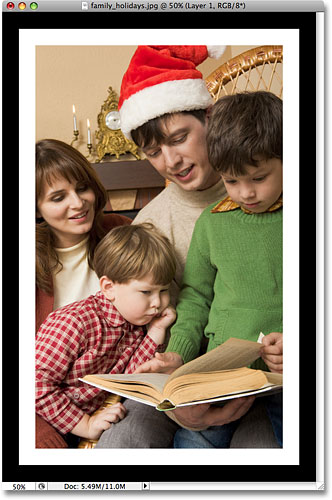
*The photo frame now has an inner white border and an outer black border.*

Let's add one more more layer style to complete the frame, and then we'll see how to save it so we can instantly apply it to a different photo without having to redo any of these steps!

#### Step 4: Add An Inner Shadow

Let's finish off our simple photo frame by giving it a bit of depth, as if the black outer border was in front of the white inner border. For that, we'll add an **Inner Shadow**. With the Layer Style dialog box still open, click directly on the words **Inner Shadow** on the left. Once again, make sure you click on the words themselves and don't just click inside the checkbox, otherwise we won't have access to the Inner Shadow's options:

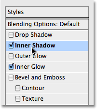
*Click directly on the words "Inner Shadow" on the left of the Layer Style dialog box.*

This changes the Layer Style dialog box to show the Inner Shadow options in the middle column. First, lower the **Distance** of the inner shadow all the way down to **0 px**. Set the **Choke** option to around **65%**, then increase the **Size** of the inner shadow to **100 px**:

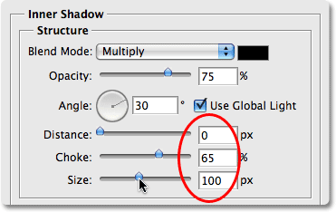
*Add some depth to the photo frame with the Inner Shadow layer style.*

You may need to experiment a little with the Choke and Size options depending on the size of your image, but if you've been following along using the same values for the Stroke and Inner Glow styles that I've used, the values above should work fine. When you're done, you should have a subtle shadow around the inside of the black border, as if it's raised up a bit from the white border below it. Here's my final photo frame result:

*The completed photo frame effect.*

#### Step 5: Save The Layer Style

Our photo frame is now complete! There may have only been a few steps involved in creating it, but this was just a simple example of what you can do with layer styles. Throw in an Outer Glow style, a Color, Gradient or Pattern Overlay, or a Bevel and Emboss effect, all with different options and settings you'll need to remember and suddenly, having a way to easily save the completed effect so you can instantly apply it again later seems like a pretty good idea.

To save the layer style, click on the **New Style** button in the top right corner of the Layer Style dialog box:

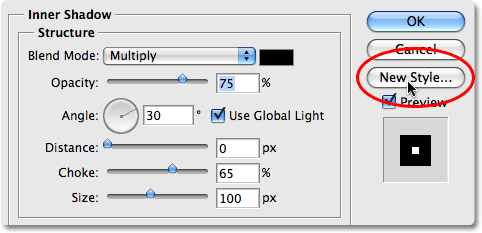
*Save the completed layer style by clicking on the "New Style" button.*

Photoshop will pop up the New Style dialog box, allowing us to name our new layer style. I'm going to name mine "Simple Photo Frame". At the bottom of the dialog box are couple of options that we can usually ignore because Photoshop does a good job of automatically selecting these options as needed, although it still helps to know what they're used for. The first one, **Include Layer Effects**, deals with whether or not we want to include the individual effects that we've used such as our Stroke, Inner Glow and Inner Shadow. Technically speaking, these individual styles are called layer "effects", and when you combine them for different results, you end up with a layer "style". However, most people just use the term "layer style" whether they're referring to an individual effect or a combination of several effects. Since we obviously want to include the individual effects that we've used to create our photo frame, this option is automatically selected for us.

The second option, **Include Layer Blending Options**, is more of an advanced topic and is only important if we made any changes in the main Blending Options section of the Layer Style dialog box. For example, if we had lowered the overall opacity of our photo frame to 50% and we want to use that same lowered opacity setting every time we apply the frame to a new image, we'd want to make sure this option is selected. We didn't do anything like that here, so we can leave this option unchecked:

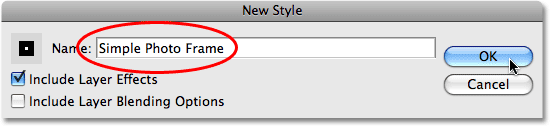
*The "New Style" dialog box.*

Click OK when you're done to have Photoshop save the layer style and exit out of the dialog box. You can also close out of the Layer Style dialog box at this point, since we're now finished with our photo frame.

#### Step 6: Open A New Photo

And with that, our photo frame is saved and ready to be applied instantly to any other image! To show you how easy it is to re-apply the layer style, open a new image. Here's the photo I'll use:

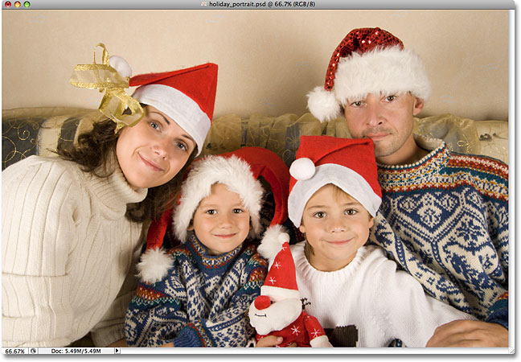
*Open a new photo.*

#### Step 7: Duplicate The Background Layer

Remember that Photoshop doesn't allow us to apply layer styles to Background layers, which means the first thing we'll need to do with our new image is duplicate the Background layer. Go up to the **Layer** menu at the top of the screen, choose **New**, and then choose **Layer via Copy**, or use the faster keyboard shortcut **Ctrl+J** (Win) / **Command+J** (Mac). Our Layers palette now shows the copy of the Background layer, named "Layer 1", above the original:

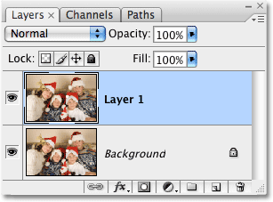
*Remember to duplicate the Background layer first before attempting to apply any layer styles.*

#### Step 8: Click On Your Layer Style In The Styles Palette

You'll find any and all layer styles that you've created and saved, along with the ones that Photoshop loads for us as part of the program, sitting in the **Styles** palette (with "Styles" being short for "Layer Styles"). By default, the Styles palette is grouped in with the Color and Swatches palettes. You'll need to click on the name tab at the top of the Styles palette to bring the palette to the foreground if it's hiding behind one of the other two palettes in the group. If you don't see the Styles palette at all on your screen, simply go up to the **Window** menu at the top of the screen and select the **Styles** palette from the list.

The Styles palette contains small thumbnails of all the layer styles that are currently loaded in to Photoshop, which includes the style we just created and saved. If you have Tool Tips enabled in Photoshop's Preferences, you'll see the names of the layer styles appear as you hover your mouse over the little thumbnails. Any time you save a new layer style, it appears at the bottom of the list in the Styles palette, which means that our "Simple Photo Frame" layer style will be the last one in the list. Simply click on the style's thumbnail to select and apply it:

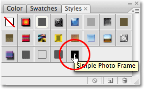
*Click on the layer style you want to apply in the Styles palette.*

And just like that, with a simple click of the mouse, the completed photo frame style is applied to the new image:

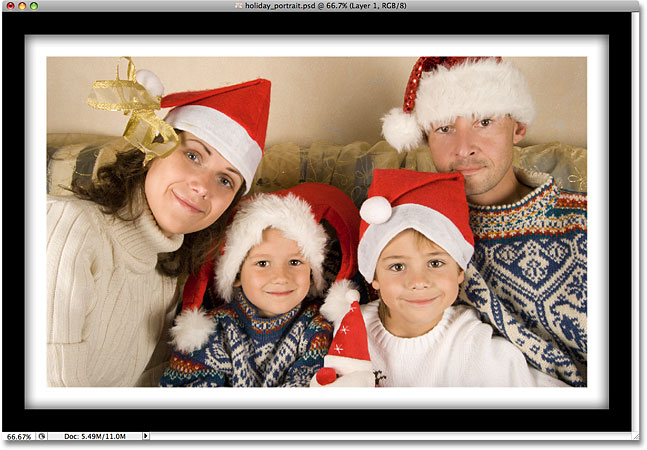
*The photo frame layer style is instantly applied to the new image.*

One important thing to keep in mind is that even though we've saved our photo frame layer style and it's appearing in the Styles palette for us to select and apply whenever we need it, it's currently only saved temporarily. Basically, it's saved inside Photoshop, which is fine until Photoshop crashes and we need to re-install it or we upgrade to a new version of Photoshop. If, for any reason, Photoshop needs to be re-installed, we'll lose our photo frame layer style, along with any other layer styles we've created. Fortunately, Photoshop allows us to save permanent copies of our layer styles (or at least, as permanent as you can get with computers) which we can load back in any time we need them. We'll see how to do that next!

#### Step 9: Open The Preset Manager

To save any layer styles we've created so that we won't lose them if we ever need to re-install Photoshop, we need to use Photoshop's **Preset Manager**, which you can find by going up to the **Edit** menu at the top of the screen and choosing **Preset Manager**:

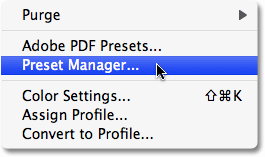
*Go to Edit > Preset Manager.*

There is an option directly in the Styles palette for saving layer styles, but it doesn't give us any control over which styles we save. All it can do is take every layer style that's currently loaded into Photoshop and save them all as one big group, which usually isn't what we want to do. The Preset Manager, on the other hand, allows us to pick and choose exactly which layer styles we want to save.

#### Step 10: Select "Styles" From The "Preset Type" List

When the Preset Manager dialog box appears, it defaults to show the list of Brushes that are currently available. Select **Styles** from the **Preset Type** selection box at the top:

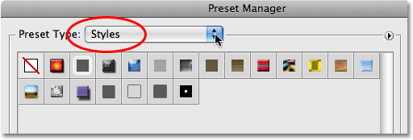
*Select "Styles" from the "Preset Type" option.*

#### Step 11: Select And Save Your Layer Style(s)

Once you select Styles from the list at the top, all of the layer styles that are currently loaded into Photoshop appear in the Preset Manager with the same thumbnails we saw in the Styles palette. To save the photo frame style, simply click on its thumbnail to select it. You'll see a black highlight border appear around the thumbnail to let you know it's selected. If you have other layer styles that you also want to save as part of this **style set**, hold down your **Ctrl** (Win) / **Command** (Mac) key and click on their thumbnails as well to select multiple styles at once. In my case here, I'm saving only the "Simple Photo Frame" style. Then click the **Save Set** button over on the right of the dialog box:

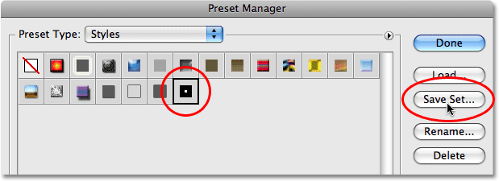
*Select your layer style(s), then click on the Save Set button.*

Photoshop will pop up another dialog box, this time asking you to name your style set and choose where you want to save it. Since I'm only saving one layer style, I'm going to name my set "Simple Photo Frame.asl". Make sure you include the three letter extension at the end of the name if you want to be able to use your style set on both a PC and a Mac. The easiest place to save your style set is to your Desktop. In my case, I've created a folder on my Desktop named "layer styles" which is where I'll save my set to. Of course, you can choose whichever location is most convenient for you. Once you've named the set and chosen a save location, click the Save button to save the set:

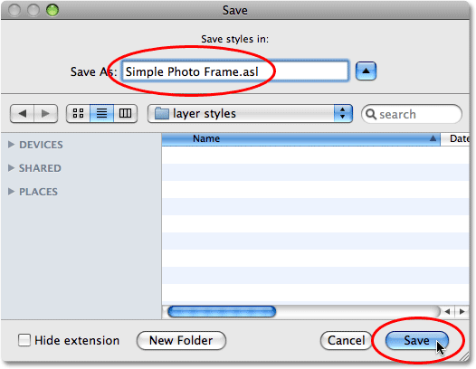
*Name your new style set and choose a location to save it to.*

When you're finished, click **Done** in the top right corner of the Preset Manager to exit out of it. Your layer style is now saved safely outside of Photoshop, so if Photoshop happens to die on you, it won't take your layer style along with it! Of course, if your entire hard drive crashes, well, that's another story.

#### Step 12: Select "Load Styles" From The Styles Palette Menu

If we ever need to load the layer style back in to Photoshop, we can do that easily from within the Styles palette. Simply click on the palette's **menu icon** in the top right corner of the palette (I'm using Photoshop CS3 here. In Photoshop CS2 and earlier the menu icon appears as a small arrow), which brings up a fly-out menu. Select **Load Styles** from the list of options:

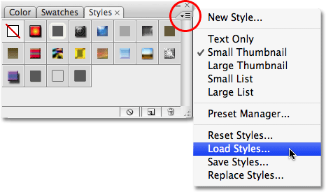
*Select the "Load Styles" option from the Styles palette fly-out menu.*

Photoshop will pop up a dialog box asking you which layer style set you want to load. Simply navigate to where you saved your style set, which in my case was a folder on my Desktop named "layer styles". Click on the name of the set you want to load, then click on the **Load** button to load the set into Photoshop:

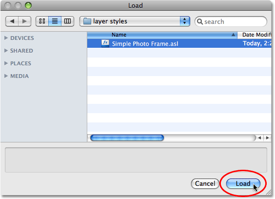
*Navigate to where you saved your style set, select it from the list, then click the "Load" button.*

Photoshop loads the layer style set, and the "Simple Photo Frame" style will appear once again inside the Swatches palette, ready to be applied to a new image:

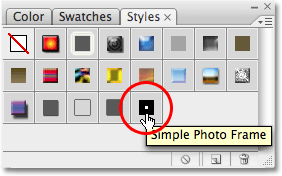
*The layer style is now loaded back into Photoshop and appears inside the Swatches palette.*