# Resize Images Without Losing Quality with Photoshop Smart Objects

> Source: [https://www.photoshopessentials.com/basics/scale-resize-images-smart-objects-photoshop/](https://www.photoshopessentials.com/basics/scale-resize-images-smart-objects-photoshop/)
> Downloaded and converted to Markdown.

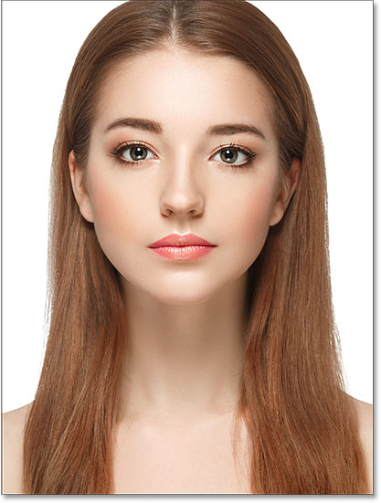
*The original image. Photo credit: Adobe Stock.*

Smart objects offer many advantages, but one of the biggest is that they allow us to resize images *non-destructively*. Normally when we scale an image to make it smaller, Photoshop makes it smaller by throwing away pixels. And once those pixels are gone, there's no way to get them back. This is known as a *destructive* edit because it makes a permanent change to the original image. In this case, we've lost pixels.

Later on, if we try to scale the image larger, or even back to its original size, the result doesn't look as good. That's because, by throwing away pixels, we lost detail in the image, and Photoshop can't magically recreate detail that's no longer there. All it can do is take the remaining detail and make it bigger. And depending on how *much* bigger you make it, you can end up with a blocky or blurry mess.

But smart objects in Photoshop are different. A smart object is a container that holds the image inside it and protects the image from harm. Anything we do to a smart object is done to the smart object itself, not to the image. If we scale a smart object to make it smaller, it *looks* like we've scaled the image. But all we've really done is scaled the smart object. The image inside it always remains at its original size with all of its pixels and detail intact. This means that if we need to make the image larger again, we can do so without any loss in quality. In fact, no matter how many times we resize a smart object, the image always looks crisp and sharp. Let's see how it works.

I'll be using [Photoshop CC](https://prf.hn/l/dlXjD2w) but since smart objects were first introduced way back in Photoshop CS2, any version from CS2 and up will work. Let's get started!

## Setting up a side-by-side comparison

To see the advantage of resizing an image as a smart object, let's quickly set up our document so we can view a side-by-side comparison between resizing a normal image and resizing a smart object. If you just want to skip to the actual comparison, you can jump ahead to the [Resizing Images vs Smart Objects](#compare) section below.

To follow along, you can open any image in Photoshop. I'll use this image that I downloaded from Adobe Stock:

*The original image. Photo credit: Adobe Stock.*

If we look in the [Layers panel](/basics/layers/layers-panel/), we see the image on the [Background layer](/basics/background-layer-photoshop-cc/):

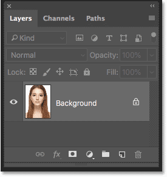
*The Layers panel showing the image on the Background layer.*

### Making two copies of the image

We need to make two copies of the image; one for the normal, pixel version and one for the smart object. To make the first copy, go up to the **Layer** menu in the Menu Bar, choose **New**, and then choose **Layer via Copy**:

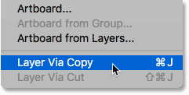
*Going to Layer > New > Layer via Copy.*

In the Layers panel, a copy of the image appears above the original:

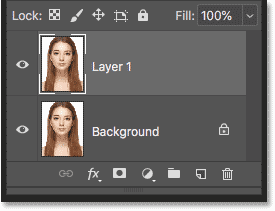
*The first copy appears.*

To make the second copy, I'll use the keyboard shortcut this time, which is **Ctrl+J** (Win) / **Command+J** (Mac). A second copy appears above the others:

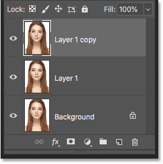
*The second copy appears.*

### Renaming the layers

Let's rename our copies so we know which is which. Double-click on the top layer's name ("Layer 1 copy") and rename it "Smart Object". Press **Enter** (Win) / **Return** (Mac) to accept it. Then double-click on the name "Layer 1" below it and rename it "Pixels". Again press **Enter** (Win) / **Return** (Mac) to accept it. We now have the layer we'll be converting to a smart object at the top and the layer that will remain a normal, pixel-based layer below it:

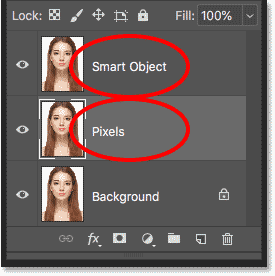
*Renaming the top two layers.*

### Filling the Background layer with white

We don't need the image on the Background layer anymore, so let's fill the background with white. Click on the **Background layer** to select it:

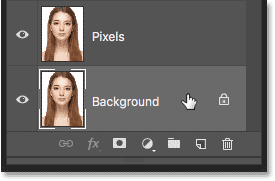
*Selecting the Background layer.*

Then go up to the **Edit** menu and choose **Fill**:

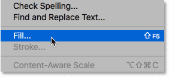
*Going to Edit > Fill.*

In the Fill dialog box, set the **Contents** option to **White**, and then click OK:

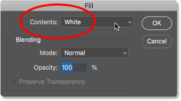
*Choosing white as the fill color.*

And if we look at the Background layer's thumbnail in the Layers panel, we see that the layer is now filled with white:

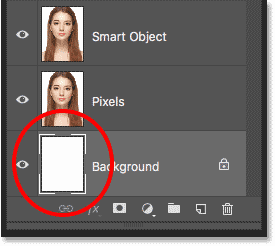
*The Background layer has been filled with white.*

### Adding more canvas space

To fit both versions of the image side-by-side, we need to add more canvas space. Go up to the **Image** menu and choose **Canvas Size**:

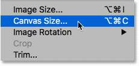
*Going to Image > Canvas Size.*

In the Canvas Size dialog box, set the **Width** to **200 Percent** and the **Height** to **100 Percent**. Leave the **Relative** option unchecked. And in the **Anchor** grid, choose the square in the middle left. This will place all of the extra space to the right of the image. Click OK to close the dialog box:

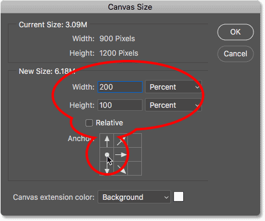
*The Canvas Size dialog box.*

To center the new canvas on the screen, I'll go up to the **View** menu and I'll choose **Fit on Screen**:

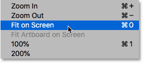
*Choosing the Fit on Screen view mode.*

And then, since my image is small enough to fit entirely on the screen at the 100 percent zoom level, I'll go back up to the **View** mode and I'll choose **100%**:

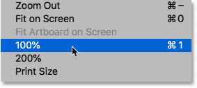
*Choosing the 100% view mode.*

And here, we see the extra canvas space that's been added:

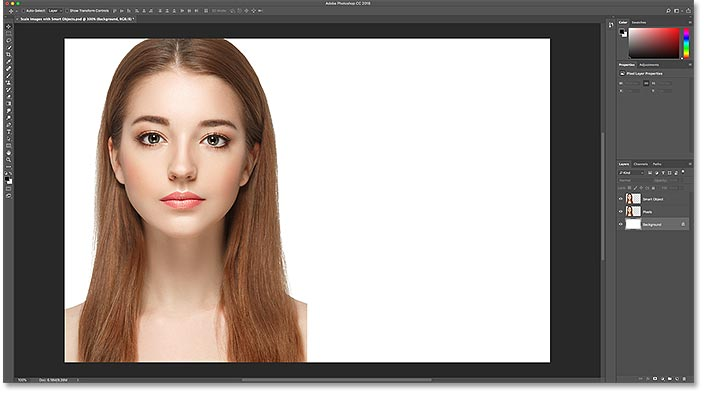
*The document with the extra canvas space on the right.*

### Moving the images side-by-side

To move one of the images into the new space, select the **Move Tool** from the Toolbar:

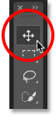
*Selecting the Move Tool.*

In the Layers panel, click on the "Smart Object" layer at the top to select it:

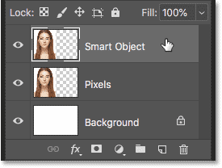
*Selecting the "Smart Object" layer.*

Then click on the image and drag it into the new space on the right. Press and hold your **Shift** key as you drag to limit the direction you can move, making it easier to drag straight across. We now have the image that will remain a pixel-based image on the left and the image that we'll convert to a smart object on the right:

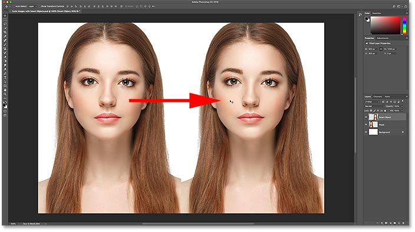
*Dragging the image on the "Smart Object" layer into the new canvas space.*

### Converting a layer into a smart object

Finally, to convert the image on the right into a smart object, make sure the "Smart Object" layer is selected in the Layers panel:

*The "Smart Object" layer should be selected.*

Click the **menu icon** in the top right corner of the Layers panel:

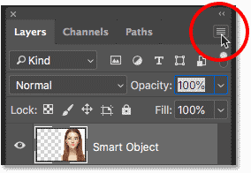
*Opening the Layers panel menu.*

And then choose **Convert to Smart Object** from the list:

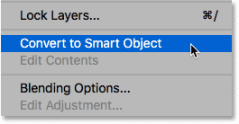
*Choosing 'Convert to Smart Object'.*

Photoshop converts the layer to a smart object, and a **smart object icon** appears in the layer's thumbnail:

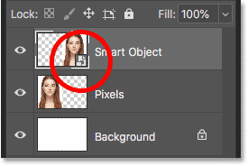
*Smart objects display an icon in the lower right of their thumbnail.*

[Related: How to create smart objects in Photoshop](/basics/how-to-create-smart-objects-in-photoshop/)

## Resizing images vs smart objects in Photoshop

Now that we have our document set up, let's see what happens when we resize a normal, pixel-based layer and compare it with what happens when we resize a smart object. We'll scale both versions down to make them smaller (known as *downscaling*), and then we'll enlarge them (*upscaling*) and compare the results.

### Downscaling the image

We'll start with the pixel version on the left. I'll click on the "Pixels" layer to select it:

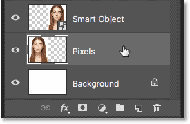
*Selecting the "Pixels" layer.*

To scale the image and make it smaller, I'll select Photoshop's Free Transform command by going up to the **Edit** menu and choosing **Free Transform**:

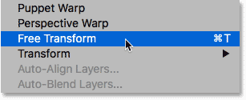
*Going to Edit > Free Transform.*

This places the Free Transform box and handles around the image:

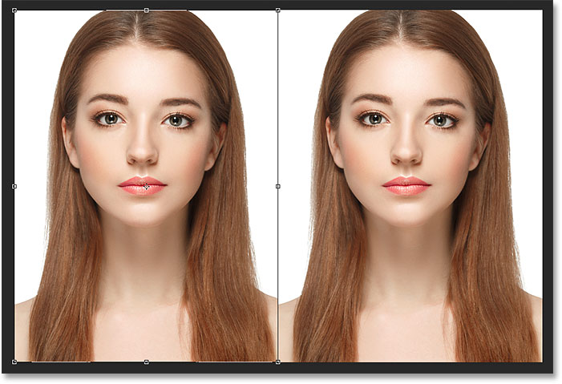
*The Free Transform box and handles appear around the pixel version on the left.*

[Learn Photoshop's Free Transform Essential Skills And Shortcuts](/basics/free-transform/)

Let's scale the width and height of the image down to just 10% of the original size. We *could* resize it by pressing and holding our Shift key and dragging any of the corner handles. But since we know the exact size we need, it's easier to just enter it in the Options Bar. First, make sure the **Width** (**W**) and **Height** (**H**) options are linked together by clicking the **link icon** between them:

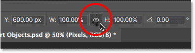
*Clicking the link icon.*

Then, change the **Width** value to **10%**. Since the Width and Height are linked together, the **Height** value changes to **10%** automatically:

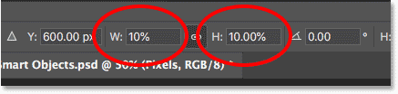
*Setting the new Width and Height of the image to 10 percent.*

Press **Enter** (Win) / **Return** (Mac) to accept the new values, and then press **Enter** (Win) / **Return** (Mac) again to close out of Free Transform. And here, we see that the pixel version on the left is now much smaller:

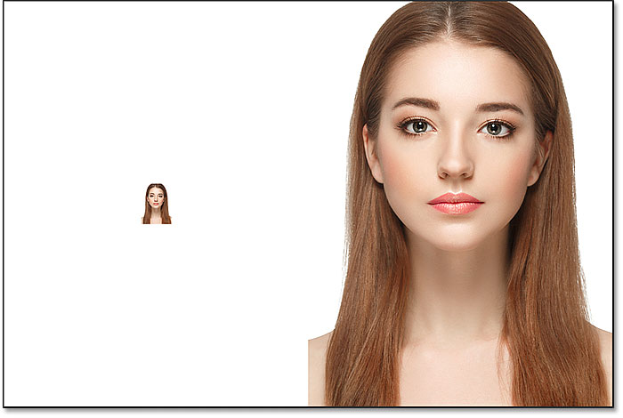
*The width and height of the pixel version have been scaled down to 10 percent.*

### Downscaling the smart object

Let's do the same thing with the smart object on the right. I'll click on the smart object in the Layers panel to select it:

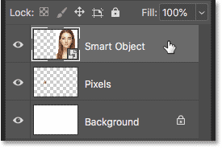
*Selecting the smart object.*

Then, I'll go back up to the **Edit** menu and I'll choose **Free Transform**:

*Going again to Edit > Free Transform.*

This time, the Free Transform handles appear around the smart object on the right:

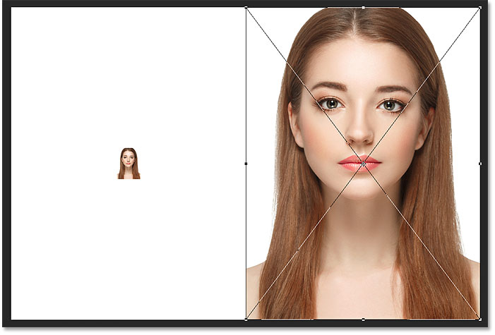
*The document showing the Free Transform handles around the smart object.*

In the Options Bar, I'll link the Width and Height fields together:

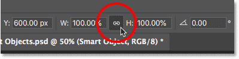
*Clicking the link icon.*

And then, I'll change the **Width** value to **10%**. The **Height** value changes along with it:

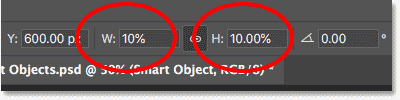
*Scaling the Width and Height of the smart object to the same 10%.*

### Comparing the results

I'll press **Enter** (Win) / **Return** (Mac) to accept the new values, and then I'll press **Enter** (Win) / **Return** (Mac) again to close out of Free Transform. Both versions of the image are now scaled down to the same size. And at this size, they both look exactly the same. There's no obvious difference yet between the pixel version and the smart object:

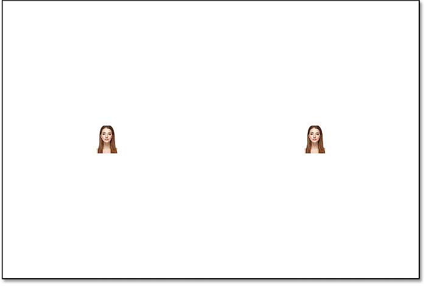
*The document after scaling both versions.*

### Upscaling the image

But now that we've made the images smaller, let's see what happens if we try making them larger. We'll start again with the pixel version on the left. I'll click on the "Pixels" layer in the Layers panel to select it:

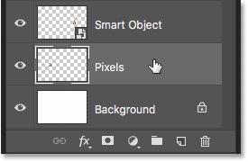
*Selecting the "Pixels" layer.*

Then I'll go back up to the **Edit** menu and I'll choose **Free Transform**:

*Going again to Edit > Free Transform.*

The Free Transform box again appears around the pixel version:

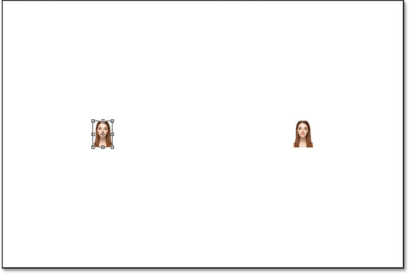
*The Free Transform box surrounds the pixel image on the left.*

#### The Width and Height values

But notice the Width and Height values in the Options Bar. Even though we scaled the width and height of the pixel version down to 10%, Photoshop is telling us that the image is somehow back to being **100%** of its original size:

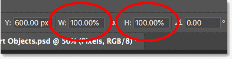
*The Width and Height values of the pixel version are back to 100 percent.*

If we can clearly see that the image is much smaller now than it was before, how can the Width and Height be back to 100 percent? The reason is that, when we scaled the pixel version and made it smaller, Photoshop made it smaller by throwing pixels away. In this case, it took 90% of the pixels from the width, and 90% of the pixels from the height, and just deleted them. This means we're down to just 1 out of every 100 pixels that we had before, or just 1 percent of the original image. So when Photoshop is telling us now that the Width and Height are back to 100%, it's not saying we're back to 100% of the *original* size. It's saying we're at 100% of the *new* size, meaning whatever pixels are left after we scaled it down.

#### Upscaling the image to 50% of its original size

Let's see what happens if we scale the image back up. We'll start by scaling the Width and Height from 10% up to 50% of the original size. To do that, I need to increase both the **Width** and **Height** values from 100% to **500%**:

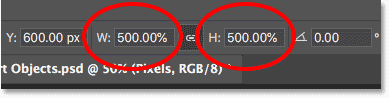
*Scaling the width and height of the pixel-based image by 500%.*

I'll press **Enter** (Win) / **Return** (Mac) on my keyboard to accept the new values. But before I close out of Free Transform, we can already see what's happening. Instead of adding new pixels and new detail to the image, Photoshop is just taking the pixels from the smaller version and making them bigger. *So* much bigger, in fact, that the square shapes of the pixels are now very obvious:

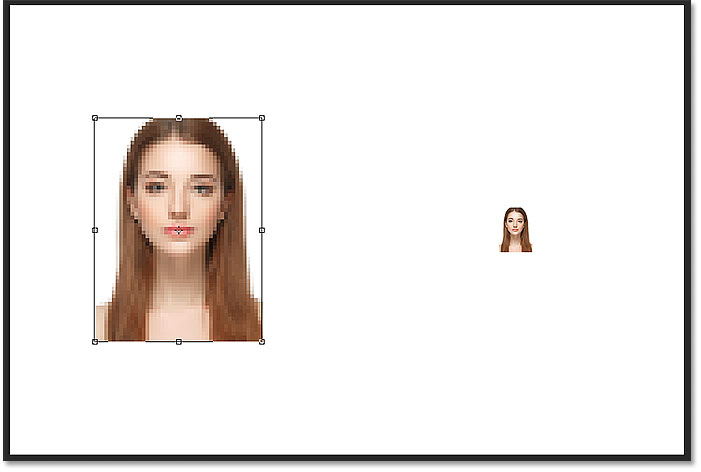
*Photoshop enlarges the pixel version by making the pixels bigger.*

I'll press **Enter** (Win) / **Return** (Mac) again on my keyboard to close out of Free Transform. At this point, Photoshop tries to clean up the image and blend the pixels together, but the result looks very soft and blurry. It's not something you would want to use:

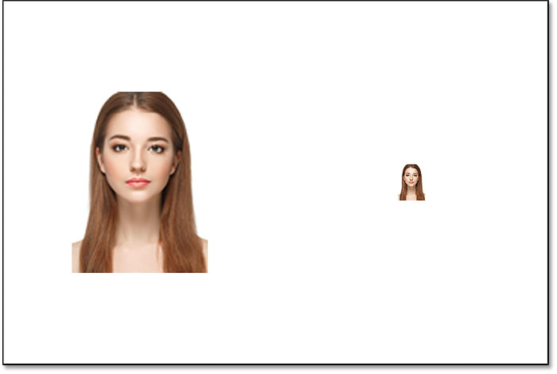
*The result after upscaling the pixel version on the left by 500%.*

[Learn the Best Way to Enlarge Images in Photoshop CC](/basics/upscale-images-photoshop-cc-2018/)

### Upscaling the smart object

Let's compare that to what happens when we upscale the smart object. I'll select the smart object in the Layers panel:

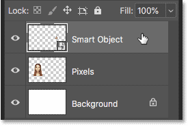
*Selecting the smart object.*

Then I'll go back once again to the **Edit** menu and I'll choose **Free Transform**:

*Going again to Edit > Free Transform.*

This time, the Free Transform handles appear around the smart object on the right:

*The Free Transform box surrounds the smart object on the right.*

#### The Width and Height values

If we look in the Options Bar, we can already see a difference between the pixel version of the image and the smart object. With the pixel version, Photoshop reset the Width and Height values to 100% after we resized it. But the smart object is still showing a Width and Height of just **10%**. Unlike the pixel version, Photoshop still remembers the original size of the smart object, and it knows that we're currently viewing it at something other than its original size:

*The Width and Height of the smart object are still set to 10%.*

#### Upscaling the smart object to 50% of its original size

I'll upscale the width and height from 10% of the original size to 50%. But rather than having to enter 500% like I did with the pixel version, with the smart object, it's much easier. I can just set both values to 50%:

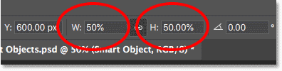
*Upscaling the width and height of the smart object from 10% to 50%.*

I'll press **Enter** (Win) / **Return** (Mac) to accept the new values. And before I close out of Free Transform, we again see a difference between the pixel version and the smart object. To upscale the image on the left, Photoshop just took the remaining pixels from the smaller version and made them bigger, resulting in a very blocky image. But the smart object on the right looks much better. In fact, it looks just as good as the original, only smaller:

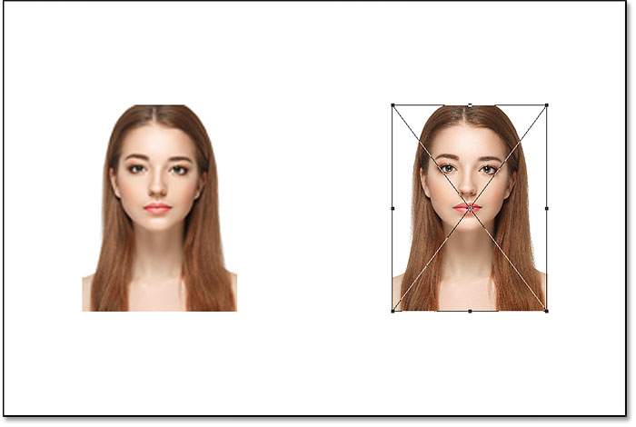
*The upscaled smart object is already looking better than the pixel version.*

I'll press **Enter** (Win) / **Return** (Mac) again to close out of Free Transform. And this time, Photoshop doesn't need to do anything to clean up the image because the smart object already looks great. When we compare it to the pixel version on the left, the smart object looks crisp and sharp with lots of detail, while the pixel version is looking much worse:

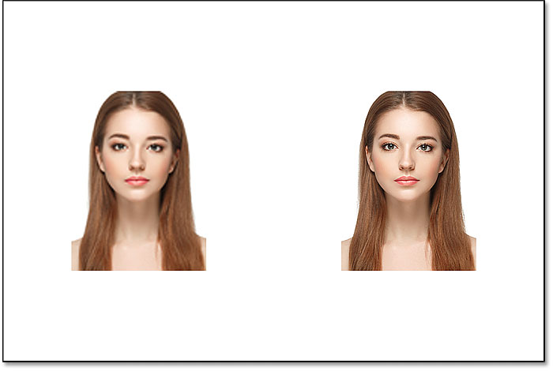
*The smart object survived the upscaling without a scratch. The pixel version wasn't so lucky.*

### Why the smart object looks better

So why does the smart object look so much better than the pixel version? It's because of how smart objects work. A smart object is just a container that holds something inside it. In this case, it's holding our image. When we scale a smart object to make it bigger or smaller, it's the size of the *container* that we're changing, not what's inside it. Making the container smaller makes the image inside it look smaller. And if we make the container bigger, the image inside it then looks bigger. But it's always the container (the smart object) that we're affecting, not its contents.

### Viewing the image inside the smart object

In fact, we can open a smart object and view its contents just by double-clicking on the smart object's **thumbnail** in the Layers panel:

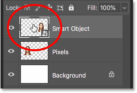
*Double-clicking on the smart object thumbnail.*

The contents of the smart object open in a separate document, and here we see the original image. Even though we've already scaled the width and height of the smart object twice, first down to 10% and then back up to 50%, the image inside it remains at its original size, with no loss in quality. No matter how many times we resize the smart object, it has no effect on the image inside it, which is why the smart object always looks great:

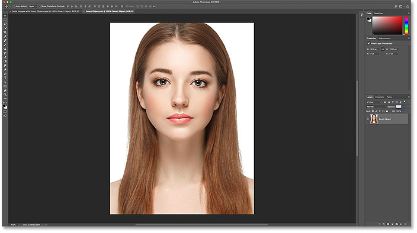
*Viewing the original image, still at its original size, inside the smart object.*

To close the smart object, go up to the **File** menu and choose **Close**:

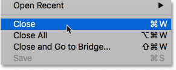
*Going to File > Close.*

And now we're back to the main document

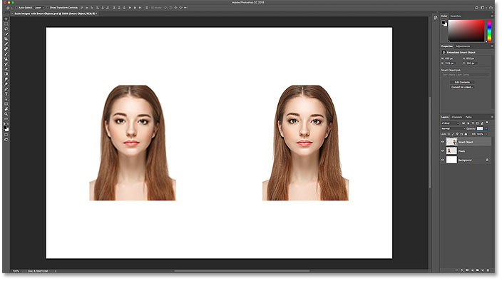
*Back to the main Photoshop document.*

[Related: How to edit a smart object's contents in Photoshop](/basics/how-to-edit-and-replace-smart-object-contents-in-photoshop/)

### Upscaling the image back to its original size

Finally, let's finish off by seeing what happens when we upscale both versions of the image back to their original size. I'll start with the pixel version on the left by selecting it in the Layers panel:

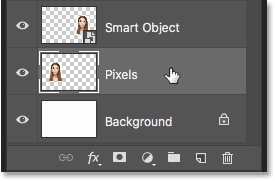
*Selecting the "Pixels" layer once again.*

Then I'll go back to the **Edit** menu and I'll choose **Free Transform**:

*Going to Edit > Free Transform.*

The Free Transform handles appear around the pixel version on the left. And in the Options Bar, Photoshop has again reset its Width and Height values back to 100%:

*The Width and Height values of the pixel version are again back to 100 percent.*

Since we know they're both actually at 50% of their original size, I need to double their size by setting both values to **200%**:

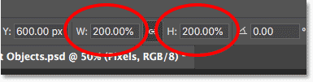
*Increasing the Width and Height of the pixel version by 200%.*

I'll press **Enter** (Win) / **Return** (Mac) on my keyboard once to accept the new values, and then again to close out of Free Transform. And here's what the pixel version looks like after scaling the Width and Height down to 10%, then up to 50%, and now back to 100%. As we can see, the result is looking very soft, and much of the original detail is missing:

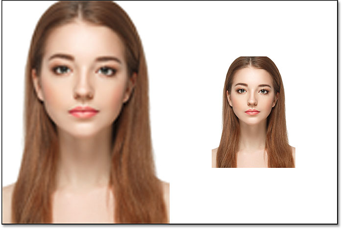
*The result after upscaling the pixel version back to its original size.*

### Upscaling the smart object back to its original size

Next, I'll click on the smart object in the Layers panel to select it:

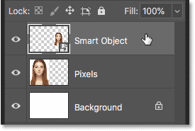
*Selecting the smart object.*

Then I'll go back one last time to the **Edit** menu and I'll choose **Free Transform**:

*Going to Edit > Free Transform.*

The Free Transform handles appear around the smart object on the right. But in the Options Bar, notice that again, Photoshop still remembers that we're viewing the smart object with its Width and Height set to just 50%:

*The smart object's Width and Height values are still set to 50 percent.*

To restore the original size of the smart object, all I need to do is change the Width and Height from 50% to **100%**:

*Setting the Width and Height values for the smart object back to 100%.*

I'll press **Enter** (Win) / **Return** (Mac) once to accept the changes, and then again to close out of Free Transform, and here's the result. While the pixel version on the left has clearly lost image quality, the smart object on the right looks good as new. Again, it's because we've been resizing the smart object itself, not its contents, so the image inside it was never affected:

*The result after upscaling both versions to their original size.*

### Going beyond the original size (and why you should avoid it)

One last thing to keep in mind is that while smart objects clearly have an advantage over pixel-based images when scaling and resizing them, the advantage only applies as long as you keep the smart object at, or smaller than, its original size. There's no advantage when trying to scale a smart object *larger* than its original size.

By going beyond 100%, you're asking Photoshop to create detail that isn't there, just like with a pixel-based image. And the result will be the same whether it's a smart object or not. Photoshop will just take the original pixels and make them bigger, and the result won't look as good. So, to benefit from smart objects, make sure you don't go beyond the original size of your image.

And there we have it! That's how to scale and resize images without losing quality using smart objects in Photoshop! For more on smart objects, learn how to [create](/basics/how-to-create-smart-objects-in-photoshop/) smart objects, how to [edit](/basics/how-to-edit-and-replace-smart-object-contents-in-photoshop/) smart objects, how to [copy](/basics/how-to-copy-smart-objects-in-photoshop/) smart objects, how to [merge layers](/basics/how-to-merge-layers-as-smart-objects-in-photoshop/) as smart objects, or how to work with editable [smart filters](/basics/how-to-use-smart-filters-in-photoshop/)! And don't forget, all of our Photoshop tutorials are now available to [download](/print-ready-pdfs/) as PDFs!