# Photoshop Brushes – Scattering Options

> Source: [https://www.photoshopessentials.com/basics/photoshop-brushes/brush-dynamics/scattering/](https://www.photoshopessentials.com/basics/photoshop-brushes/brush-dynamics/scattering/)
> Downloaded and converted to Markdown.

In the first tutorial in this series, we learned how we can dynamically control the size, angle and roundness of our brushes as we paint using Photoshop's **[Shape Dynamics](/basics/photoshop-brushes/brush-dynamics/shape-dynamics/)**, one of six **Brush Dynamics** categories found in the Brushes panel. In this tutorial, we'll look at the second set of dynamic brush options, **Scattering**, and how it allows us to scatter multiple copies of our brush tip along each brush stroke, creating the illusion that we're "spraying" the brush inside our document!

To access the Scattering controls, click directly on the word **Scattering** on the left side of the Brushes panel. Clicking inside the checkbox to the left of the word will turn the Scattering options on but won't give us access to any of its controls, so be sure to click directly on the word itself:

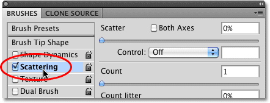
*Click directly on the word Scattering to gain access to its controls.*

As soon as you click on the word, the Scattering options appear on the right side of the Brushes panel. The options for Scattering are divided into two main sections - **Scatter** and **Count**. The Scatter options control how far the individual brush tips will be spread apart, while Count determines how many additional brush tips will be added:

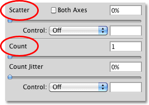
*Scattering is divided into two sections - Scatter and Count.*

Let's take a closer look at each section.

### Scatter

As I mentioned, the Scatter options allow us to control how far apart, or how "scattered", the individual brush tips will appear as we paint. To make it easy to see how these options work, I'll use one of Photoshop's standard round brushes, but you can use any brush you like.

With a Scatter value of 0%, no scattering is applied, as we can see in this horizontal brush stroke. I've increased the spacing between each brush tip so we can easily see that each one simply follows the previous one in a straight line:

*A Scatter value of 0% means that scattering is turned off. Each new brush tip follows predictably in line with the previous one.*

To increase the amount of scattering, simply drag the **Scatter slider** towards the right. Keep an eye on the preview area at the bottom of the Brushes panel to see what's happening. The further you drag the slider, the more the individual brush tips are spread apart:

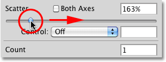
*Drag the Scatter slider towards the right to scatter the brush tips.*

I'll paint the same horizontal brush stroke, but now that I've added some scattering, we see that Photoshop randomly alters the position of each new brush tip along the stroke, creating a scatter effect. If I had dragged the Scatter slider even further towards the right, the tips would be spread apart even more:

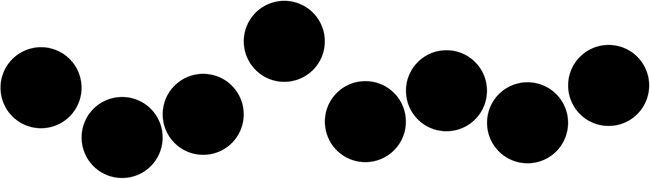
*The brush tips now scatter as I paint.*

**Both Axes**

For even more variety in the scattering, select the **Both Axes** option:

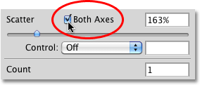
*Click inside the Both Axes checkbox to select it.*

This tells Photoshop to scatter the brush tips both along the stroke and perpendicular to it, causing some brush tips to overlap while leaving wider gaps between others:

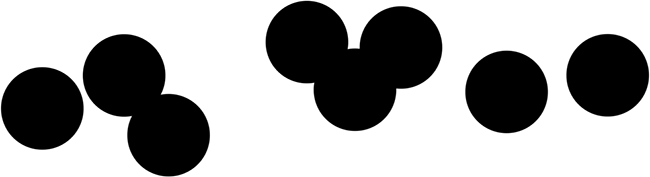
*With Both Axes selected, the brush tips appear to scatter randomly in all directions.*

**Scatter Control**

Just as we saw with the Size, Angle and Roundness options in the [**Shape Dynamics**](/basics/photoshop-brushes/brush-dynamics/shape-dynamics/) section, Photoshop gives us various ways to dynamically control the amount of scattering that's applied to our brush strokes as we paint, all of which can be selected from the **Control** drop-down list:

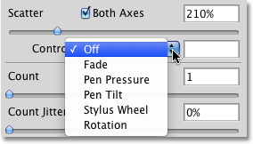
*The same options we saw with Shape Dynamics are available for controlling the amount of scattering.*

Most of these options, like Pen Pressure and Pen Tilt, require us to have a pen tablet installed on our computer before they'll work. Selecting **Pen Pressure** will vary the amount of scattering depending on the amount of pressure being applied to the tablet, while **Pen Tilt** changes the scattering amount as you tilt the pen while you paint. The only option that doesn't require the use of a pen tablet is **Fade**, which gradually reduces the amount of scattering based on the number of steps you specify. Once the scattering amount reaches 0%, no further scattering will be applied until you begin a new stroke:

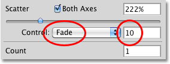
*Choose Fade, then enter the number of steps it will take to fade out the scattering completely.*

Make sure you've increased the Scatter value first before attempting to work with any of the Control options, otherwise no scattering will be applied no matter what you do. Here, I've painted another simple horizontal brush stroke, with scattering set to fade in 10 steps. Notice how the brush stroke continues on in a straight line once the scattering has faded completely:

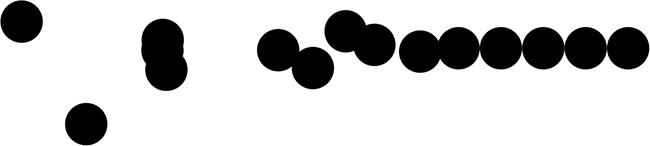
*The scattering gradually fades out over 10 steps before the brush stroke continues on in a straight line.*

### Count

We already know that the way Photoshop paints is by repeatedly stamping the brush tip along the path of our stroke. By default, Photoshop stamps only one brush tip each time, but we can change that using the **Count** options. In fact, we can have Photoshop stamp as many as 16 copies of the brush tip each time it would normally stamp just one!

To increase the count value, drag the **Count slider** towards the right, keeping an eye on the preview area at the bottom of the Brushes panel to preview the changes. Make sure you've increased the Scatter value first before increasing the Count value, otherwise you won't see much happening since you'll simply be stacking multiple copies of the brush tip directly on top of each other:

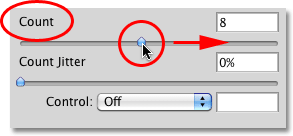
*Drag the Count slider towards the right to add more and more copies of the brush tip along the stroke.*

With my Count value set to 8 and Scatter set to 500%, the brush tips now appear to "spray" across the document as I paint:

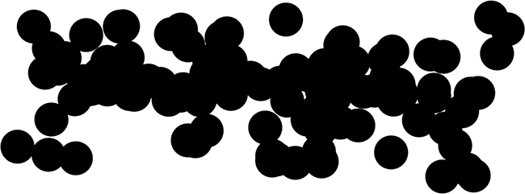
*Increase both the Scatter and Count values to get the full effect of the Scattering dynamics.*

**Count Control**

As with the Scatter section above, the Count section includes a **Control** option, giving us the same familiar ways to dynamically control the count value as we paint. Select any of them from the drop-down list:

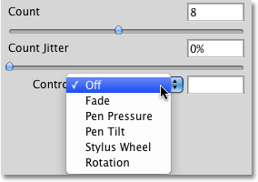
*Choose how you want to dynamically control the count value from the Control drop-down list.*

Before you select any of these options, make sure you've increased the Count value first with the slider, otherwise you'll never see more than one brush tip at a time no matter which option you choose. The Count value will determine the maximum number of brush tips that Photoshop will stamp each time. For example, if you select Pen Pressure with the Count value set to 8, applying maximum pressure with the pen will add 8 brush tips.

As is usually the case, the **Fade** option is the only one that does not require a pen tablet and will gradually lower the count value over the number of steps you specify. I'm going to select **Pen Pressure** this time, and I'll select it for both the Count and Scatter Control options so both are being dynamically controlled by the amount of force I'm applying to the tablet with my pen. Here's my brush stroke:

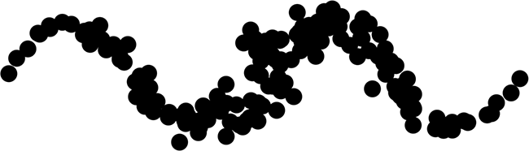
*Both the Scatter and Count values are being controlled with pen pressure.*

**Count Jitter**

Finally, we can let Photoshop randomly change the count value with the Jitter option. The further you drag the Jitter slider towards the right, the more randomness you'll apply to the number of additional brush tips being added. Keep in mind once again that you'll first need to increase the Count value beyond its default value of 1 to see any changes. The Jitter option can be used on its own to add nothing but random amounts of brush tips along the stroke, or combine it with any of the Count Control options:

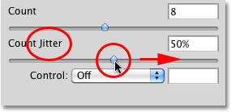
*Add random amounts of additional brush tips along the stroke by increasing the Jitter value.*