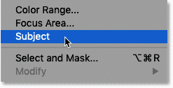
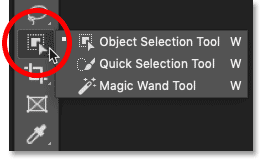
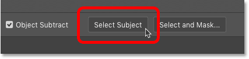
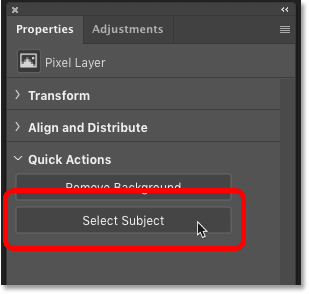
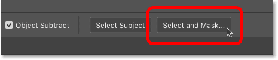
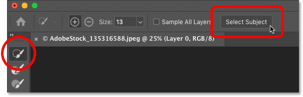
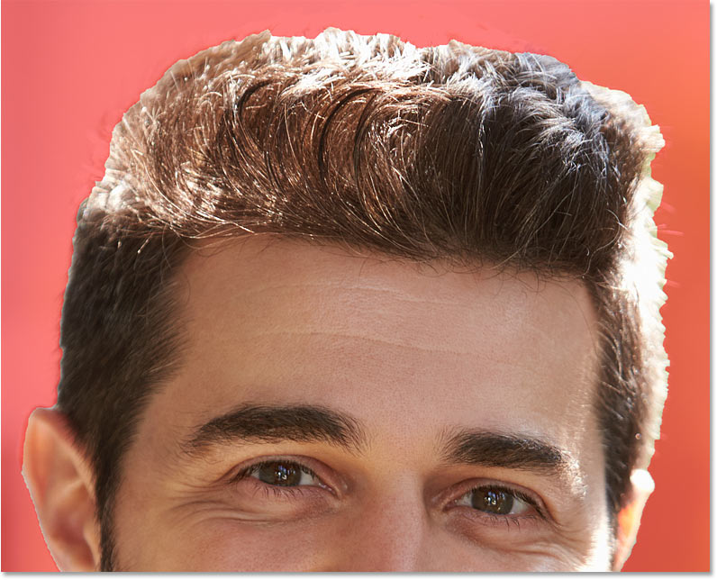
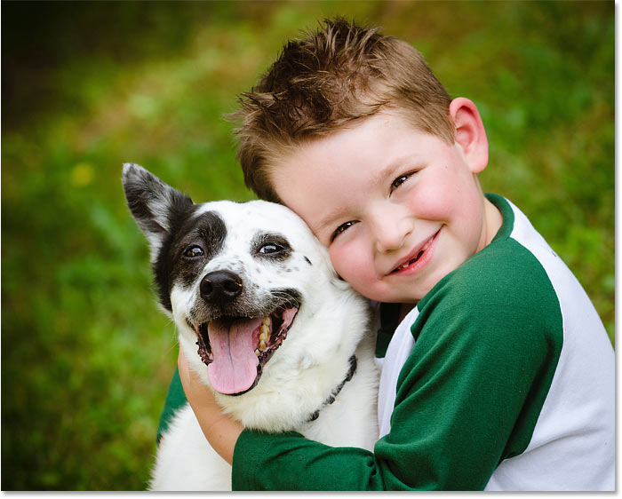
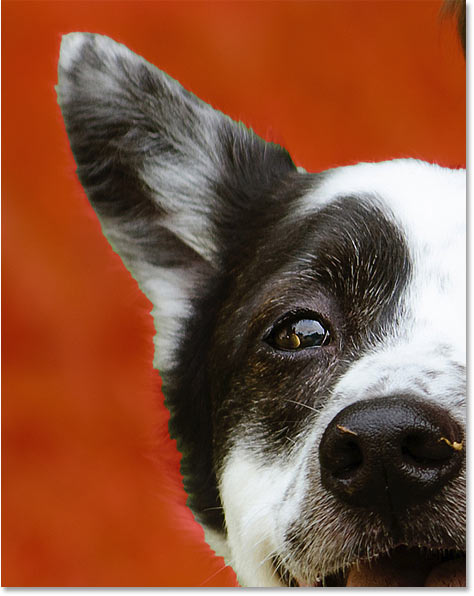

# How to use Select Subject in Photoshop for One-Click Selections

> Source: [https://www.photoshopessentials.com/basics/select-subject-select-and-mask-photoshop-cc-2018/](https://www.photoshopessentials.com/basics/select-subject-select-and-mask-photoshop-cc-2018/)
> Downloaded and converted to Markdown.

Learn how to select people, animals and more with a single click using the powerful and improved Select Subject command in Photoshop!

Not long ago, Photoshop looked at images as nothing more than a bunch of pixels. It knew that different pixels were different colors, and that some were brighter or darker than others. Yet for all its power, Photoshop couldn't see the bigger picture. It had no idea that there was a person, an animal, a tree, or any other type of object in the photo. Everything was just [pixels](/basics/pixels-image-size-resolution-photoshop/).

But that changed back in Photoshop CC 2018 thanks to some impressive artificial intelligence known as Adobe Sensei, Adobe's machine learning technology. Adobe Sensei powers the search engine in Adobe Stock that lets us quickly find images of people, animals or other subjects. In CC 2018, Adobe brought that same technology over to Photoshop as a brand new selection command known as **Select Subject**. And in CC 2020, Select Subject has been greatly improved.

Select Subject automatically finds the main subject in your image and selects it. And as we'll see, it works with just a single click! Of course, as with any automatic selection tool, the results will vary depending on your image. So along with learning how to use the command, we'll also look at a few examples of Select Subject in action. And we'll compare the results from CC 2020 with the previous version of Photoshop to see how much better the latest version of Select Subject really is.

To follow along, you'll want to be using Photoshop 2020 or later. You can [get the latest Photoshop version here](https://adobe.prf.hn/click/camref:1100lrdjJ/destination:https%3A%2F%2Fwww.adobe.com%2Fproducts%2Fphotoshop.html). And after you learn the basics with this tutorial, be sure to learn [how to run Select Subject on the Cloud](/basics/select-subjects-powerful-new-cloud-option-in-photoshop-2022/) in Photoshop 2022!

Let's get started!

## Where to find the Select Subject command

Photoshop gives us several ways to access the Select Subject command, including a way that's new as of CC 2020. They all produce the same result, so choose whichever way is easiest.

### From the Menu Bar

The main way to open Select Subject is by going up to the **Select** menu in the Menu Bar and choosing **Subject**:

*Going to Select > Subject.*

### From the Options Bar

Or if the [Object Selection Tool](/basics/object-selection-tool/), the [Quick Selection Tool](/basics/selections/quick-selection-tool/) or the [Magic Wand Tool](/basics/selections/magic-wand-tool/) is active in the toolbar:

*Choosing the Object Selection, Quick Selection or Magic Wand Tool.*

Then you'll find a **Select Subject button** in the Options Bar:

*The Select Subject button in the Options Bar.*

### From the Properties panel

New as of Photoshop 2020, the Select Subject button is also found in the **Properties panel** whenever a standard pixel layer is active in the [Layers panel](/photoshop-layers-learning-guide/):

*The Select Subject button in the Properties panel.*

### In the Select and Mask workspace

And Select Subject can be accessed from within Photoshop's **Select and Mask** workspace.

I'll open Select and Mask from the Options Bar:

*Clicking the Select and Mask button in the Options Bar.*

And in the Select and Mask workspace, the Select Subject button is found in the Options Bar along the top, but only if the Object Selection Tool or the Quick Selection Tool is active in the Select and Mask toolbar:

*The Select Subject option in the Select and Mask workspace.*

## How Select Subject works

Select Subject automatically detects the most prominent object in the image and draws a selection outline around it. You simply choose the Select Subject command and Photoshop does all the work. Sounds great, right?

But while the technology behind Select Subject is impressive, especially in CC 2020 and later, it's important to keep your expectations in check. Rather than thinking of Select Subject as a tool that will do the entire job for you, think of it instead as a time-saving first step.

Like the Object Selection Tool or the Quick Selection Tool, Select Subject can get you 90-95% of the way there. And the fact that it does so with a single click (as we're about to see) is pretty amazing. But in most cases, you will still need to refine your selection afterwards using Photoshop's Select and Mask workspace.

## Does Select Subject really work?

Let's look at some examples of Select Subject in action, starting with an image that should be an easy win for this great feature.

### Example 1: Selecting a single person in a photo

Here we have a close-up, outdoor portrait shot. Along with Adobe Sensei's ability to recognize people in a photo, this particular image has a few important advantages that can help Select Subject along. The subject himself is in sharp focus while the background behind him is blurred out. There's a good amount of contrast between the subject and the background, and the edges along the subject are nice and sharp.

Also, we're not dealing with lots of fly-away hair, which is always a problem for any of Photoshop's automatic selection tools ([portrait photo](https://adobe.prf.hn/click/camref:1100lrdjJ/destination:https%3A%2F%2Fstock.adobe.com%2Fstock-photo%2Foutdoor-head-and-shoulders-portrait-of-smiling-mature-man%2F135316588) from Adobe Stock):

*An example of an ideal candidate for Select Subject. Credit: Adobe Stock.*

#### Applying the Select Subject command

To see how good of a job Select Subject in Photoshop CC 2020 can do at isolating the man from his background, I'll open Select Subject by going up to the **Select** menu in the Menu Bar and choosing **Subject**.

There are no options or dialog boxes for Select Subject. The command is fully automatic:

*Going to Select > Subject.*

Photoshop analyzes the image, looking for a main subject. And after a few seconds, a selection outline appears:

*The selection outline appears around the man.*

#### Viewing the selection in Quick Mask mode

To make the selection easier to see, I'll turn on Photoshop's **Quick Mask** mode by clicking the Quick Mask icon in the [toolbar](/basics/photoshop-tools-toolbar-overview/). You can also toggle Quick Mask on and off by pressing the letter **Q** on your keyboard:

*Enabling Quick Mask mode.*

In Quick Mask mode, a red overlay fills the area outside the selection, making it easy to see that Select Subject had no trouble isolating the man from the rest of the photo:

*Select Subject easily recognized the man as the main subject.*

#### Zooming in for a closer look

If we [zoom in on the image](/basics/photoshop-image-navigation/), we see that Select Subject did a great job of selecting the man's hair. Many of the smaller strands of hair along the sides were included, and the edges along the top have a softer transition to them, which would help the hair blend more naturally with a different background.

But as we'll see in other examples, Select Subject's results will vary depending on the image. So don't be fooled into thinking of it as an automatic hair selection tool. However, with this image, other than a small mistake above his right ear, Select Subject did an excellent job:

*The Select Subject result in Photoshop CC 2020.*

#### Select Subject in Photoshop CC 2020 vs 2019

For comparison, here's the result from the previous version of Select Subject in Photoshop CC 2019. And notice how the selection around the hair looks rough and unnatural, as if someone cut the man out of the photo with scissors. There's no denying that Select Subject works much better in CC 2020:

*The Select Subject result in Photoshop CC 2019.*

### Example 2: Multiple subjects in the same photo

Next, let's see if Select Subject is able to recognize two people in the same photo ([ice cream photo](https://clk.tradedoubler.com/click?p(264303)a(2982769)g(22913540)url(https://stock.adobe.com/ca/stock-photo/young-people-with-ice-cream/106679004)) from Adobe Stock):

*Trying a second image, this time with two people. Credit: Adobe Stock.*

#### Applying the Select Subject command

I'll open Select Subject by going up to the **Select** menu and choosing **Subject**:

*Going to Select > Subject.*

And after a few seconds, selection outlines appear. So far it looks promising, with an outline surrounding both the woman on the left and the man on the right:

*Both subjects appear to be selected.*

#### Viewing the selection in Quick Mask mode

I'll turn on **Quick Mask** mode by clicking its icon in the toolbar:

*Clicking the Quick Mask icon.*

And sure enough, Select Subject had no trouble detecting both of our subjects even though they were on opposite sides of the image:

*Two people in the same photo are no problem for Select Subject.*

#### Zooming in for a closer look

I'll zoom in on the woman to see how Select Subject did at selecting her hair. And while the result is not bad, it's definitely not as good as what we saw with the previous image. Parts of her hair are missing from the selection, and other areas look pretty rough.

Overall, it's a decent starting point but I would still need to refine it using Photoshop's Select and Mask workspace:

*The Select Subject result in Photoshop CC 2020.*

#### Select Subject in Photoshop CC 2020 vs 2019

However, it's a noticeable improvement compared to this result from Select Subject in CC 2019. With the 2019 version, even more of the hair is missing from the selection, especially along the top. So while neither result is great, the CC 2020 version of Select Subject still did a better job:

*The Select Subject result in Photoshop CC 2019.*

### Example 3: Multiple subjects with only one in focus

In the previous example, both people in the photo were in sharp focus. But what happens when one person is in focus and other people in the background are out of focus? Will Select Subject try to select them all? Let's use this third image to find out ([people in background photo](https://clk.tradedoubler.com/click?p(264303)a(2982769)g(22913540)url(https://stock.adobe.com/ca/images/happy-african-american-man/19004601)) from Adobe Stock):

*Three people in the image but only one in focus. Credit: Adobe Stock.*

#### Applying the Select Subject command

Once again, I'll open Select Subject by going up to the **Select** menu and choosing **Subject**:

*Going to Select > Subject.*

And after a few seconds, a selection outline appears around the man in the foreground but *not* around the two people in the background. So along with being able to recognize people, Select Subject also uses other visual cues, like depth of field, when making selections:

*Only the man in focus in the foreground was selected.*

#### Zooming in for a closer look

I'll switch to **Quick Mask** mode, this time by pressing the letter **Q** on my keyboard, and then I'll zoom in. And notice the amazing job Select Subject in Photoshop CC 2020 did with the man's hair. Almost every strand and curl is selected:

*The CC 2020 result.*

#### Select Subject in Photoshop CC 2020 vs 2019

The result is even more impressive when compared to what we would have achieved back in CC 2019, where much of the outer fly-away hair was completely missed:

*The CC 2019 result.*

#### Example 4: Pets are people too!

Of course, Select Subject can detect more than just people. In this fourth and final example, we have a young boy with his pet dog. Can Select Subject select two different types of subjects in the same photo? Let's find out ([boy with dog photo](https://clk.tradedoubler.com/click?p(264303)a(2982769)g(22913540)url(https://stock.adobe.com/ca/stock-photo/child-lovingly-embraces-his-pet-dog-a-blue-heeler/52434114)) from Adobe Stock):

*Testing Select Subject on two very different subjects.*

#### Applying the Select Subject command

I'll choose the **Subject** command from under the **Select** menu:

*Going to Select > Subject.*

Then I'll press the letter **Q** on my keyboard to switch to **Quick Mask** mode.

And as it turns out, the answer is yes. Since the boy and his dog are both in sharp focus against the blurry background, Select Subject had no trouble figuring out that both are important and that both should be selected:

*Select Subject knew that a boy and his dog should always be together.*

#### Zooming in on the boy's hair

In fact, if we zoom in, look how great of a job Select Subject in CC 2020 was able to do at selecting the boy's hair. Very impressive indeed:

*The result using Photoshop CC 2020.*

Compare that with the CC 2019 version where it again looks like someone cut him out of the photo with scissors.

Also notice how much of the green background is still visible in his hair, while the green was almost completely removed in the CC 2020 version:

*The result using Photoshop CC 2019.*

#### Zooming in on the dog's fur

But what's interesting is that even though Select Subject did a great job with the boy's hair, the same cannot be said for the dog's fur. If we look around and below the dog's ear, the selection is very basic and rough. Even in CC 2020, Select Subject made no attempt to include the smaller, finer hairs along the edges. This isn't a big problem since it would be easy to refine the hair using the Select and Mask workspace, but it's still a bit disappointing.

However, no automatic selection will be perfect, and Select Subject in Photoshop CC 2020 did prove itself as a worthy upgrade with the boy's hair and with the other example images we looked at:

*Select Subject impressed with the hair but disappointed with the fur.*

## Summary

Select Subject is a powerful automatic selection command that can identify and select the main subject in your image. And as of Photoshop CC 2020, Select Subject's results are more impressive than ever. Use Select Subject as a time-saving first step when you need to isolate your subject from its background, and then refine the selection using Photoshop's Select and Mask workspace. I'll cover Select and Mask in detail in a separate tutorial.

In the next tutorial, we'll look at a brand new selection feature in Photoshop CC 2020 called [Remove Background](/basics/select-subject-vs-remove-background-in-photoshop/) which takes your Select Subject result even further! And in Photoshop 2022, you can now process your image on Adobe's servers by [running Select Subject on the Cloud](/basics/select-subjects-powerful-new-cloud-option-in-photoshop-2022/)! And if you haven't done so already, be sure to learn all about the amazing [Object Selection Tool](/basics/using-the-object-selection-tool-and-object-finder-in-photoshop-2022/) in Photoshop!