# Select Subject vs Remove Background in Photoshop

> Source: [https://www.photoshopessentials.com/basics/select-subject-vs-remove-background-in-photoshop/](https://www.photoshopessentials.com/basics/select-subject-vs-remove-background-in-photoshop/)
> Downloaded and converted to Markdown.

Learn how to use the Select Subject and Remove Background commands in Photoshop CC 2020 to quickly remove the background from your photos, and which one gives you the best results!

Photoshop now includes not one but two commands that can automatically select the main subject of your image and isolate it from its background. One of these commands is **Select Subject**, first introduced in CC 2018 and now greatly improved in CC 2020. And the other is **Remove Background** which is brand new as of CC 2020. Both Select Subject and Remove Background will analyze your image, look for the main subject, and select it. And both are fully automatic. Simply choose the command and Photoshop does all the work! 

So does this mean Photoshop now has two commands that do the same thing? While they sound similar, there is one important difference between them. Select Subject draws the selection and then leaves it up to you to decide what to do with that selection. In other words, Photoshop says, "Okay, here's your selection. Now do whatever you want with it." But Remove Background takes it a step further. It draws the same selection as Select Subject but then goes ahead and actually removes the background. 

In this tutorial, we'll look at how you can use either of these commands to remove the background from your photo, and why Select Subject may actually be easier even if Remove Background is faster. I'll also show you how the new Object Selection Tool can be used to fix any problem areas, including how to use the tool in Photoshop's Select and Mask workspace.

To follow along, you'll need Photoshop 2020 or later. You can [get the latest Photoshop version here](https://adobe.prf.hn/click/camref:1100lrdjJ/destination:https%3A%2F%2Fwww.adobe.com%2Fproducts%2Fphotoshop.html).

Let's get started!

### The document setup

For this tutorial, I'll use [this image](https://adobe.prf.hn/click/camref:1100lrdjJ/destination:https%3A%2F%2Fstock.adobe.com%2Fimages%2Fhandsome-grandfather-in-a-autumn-park-old-man-in-a-gray-jacket-and-hat%2F288984350) from Adobe Stock. We'll start by learning how to remove the man from the background using Select Subject, and then we'll compare the results with Remove Background:

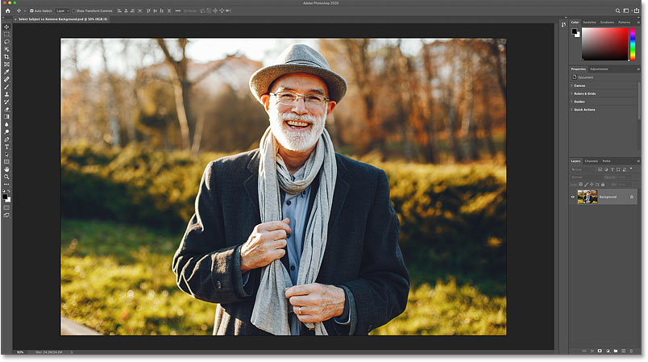
*The original photo. Credit: Adobe Stock.*

## Where to find Select Subject and Remove Background

Select Subject and Remove Background may be similar in what they do, but the way we access them in Photoshop is different. That's because there are [many ways to choose Select Subject](/basics/select-subject-select-and-mask-photoshop-cc-2018/), but only one place you'll find Remove Background. And even then, it won't always be there.

### The Properties panel

One place you'll find the Select Subject command, and the *only* place you'll find Remove Background, is in Photoshop's **Properties panel**. But for either of these commands to appear in the Properties panel, you first need to have a standard pixel layer selected in the Layers panel.

Notice in my [Layers panel](/basics/layers/layers-panel/) that the image is currently sitting on the Background layer. And while the Background layer is technically a pixel layer, it's not the same as a standard pixel layer. [Background layers](/basics/background-layer-photoshop-cc/) are really just the background of the document:

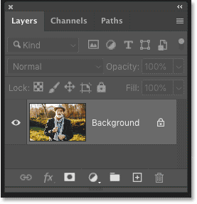
*The Layers panel showing the image on the Background layer.*

And if we look in the Properties panel, Select Subject and Remove Background are both missing. Normally they would appear under the **Quick Actions** menu. But because I don't have a standard pixel layer selected, neither command is available:

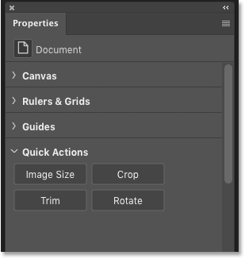
*Select Subject and Remove Background are missing from the Properties panel.*

### Converting the Background layer to a standard layer

To fix that, simply convert the Background layer into a [standard pixel layer](/photoshop-layers-learning-guide/) by clicking the **lock icon**:

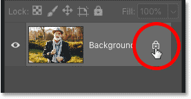
*Unlocking the Background layer.*

Photoshop renames the layer from "Background" to "Layer 0", which means it's now a standard layer:

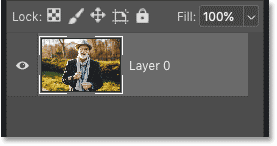
*The Background layer is now a standard layer.*

And in the Properties panel,  a **Select Subject** button and a **Remove Background** button appear:

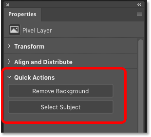
*The Remove Background and Select Subject options.*

## How to use Select Subject to remove a background

So now that the image is on a standard pixel layer, I'll try selecting the man and removing the background using Photoshop's Select Subject command. Then we'll try the same thing using the Remove Background command so we can compare the results.

### Applying the Select Subject command

Using Select Subject is easy. Just click the **Select Subject** button:

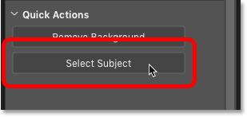
*Clicking Select Subject in the Properties panel.*

Photoshop analyzes the image looking for the subject, and after a few moments, a selection outline appears.

The result will depend on your image. But in my case, the initial selection looks pretty good. The outline appears only around the man and nothing in the background was included:

*The initial result using Select Subject.*

### Looking for problems with the selection

However, if I [zoom in for a closer look](/basics/photoshop-image-navigation/) at the initial selection, we see that Select Subject missed part of the man's hat. The increased brightness in that area from the sun shining on it is probably what threw it off:

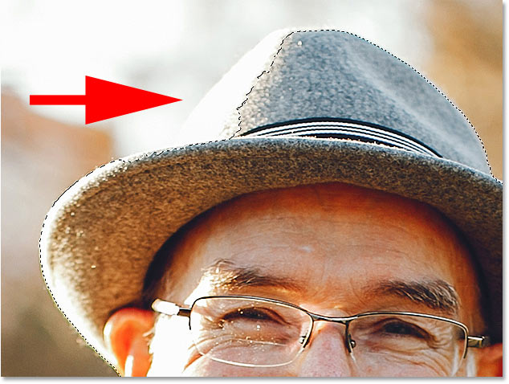
*Select Subject missed a spot.*

### Using the Object Selection Tool to add the missing area

But even though the selection isn't perfect, this does not mean that Select Subject didn't work. It still did most of the job for us and gave us a great starting point. And Photoshop includes [lots of other selection tools](/basics/make-selections-photoshop/) we can use to fix any problems. In this case, the [Object Selection Tool](/basics/object-selection-tool/) (new as of CC 2020) will work great.

I'll choose the **Object Selection Tool** from the [toolbar](/basics/photoshop-tools-toolbar-overview/):

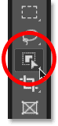
*Choosing the Object Selection Tool.*

Then in the Options Bar, I'll change the tool's **Mode** from Rectangle to **Lasso** so I can [draw a freehand selection](/basics/selections/lasso-tool/) around the missing area: 

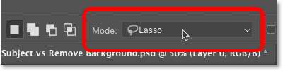
*Setting the selection mode to Lasso.*

Since I want to add the missing area to the existing selection, I'll press the **Shift** key on my keyboard. And then with the key held down, I'll drag an outline around the missing part of the hat. There's no need to be precise. Just stay close but outside the area you need to add:

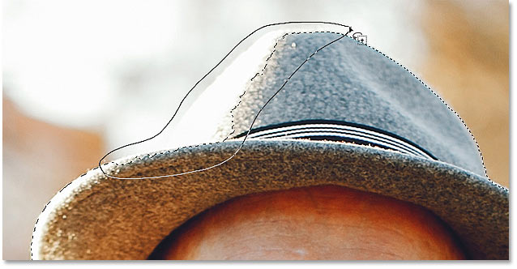
*Adding to the selection with the Object Selection Tool.*

When I release my mouse button, Photoshop analyzes the area inside the outline looking for anything that should be included in the selection. And after a few moments, the missing part of the hat is added. 

You can also subtract areas from the selection using the Object Selection Tool by pressing and holding the **Alt** (Win) / **Option** (Mac) key on your keyboard as you drag around them:

*The area that Select Subject missed has been added.*

### The final Select Subject result

And now, using a combination of Select Subject and the Object Selection Tool, the selection is looking good:

*The final result using Select Subject.*

## How to remove the background

Of course, if our goal was to remove the background, then we're still not done. Even though Select Subject did draw a selection around the man in the photo, it did nothing to remove him from the background. So if we want to remove the background, we need to do that ourselves. And one way would be to convert the selection into a layer mask. 

In the Layers panel, click the **Add Layer Mask** icon:

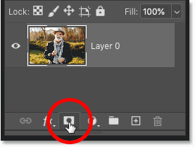
*Clicking the Add Layer Mask icon.*

And just like, the background disappears:

*The background is removed after adding a layer mask.*

Why did the background disappear? It's because Photoshop converted our selection into a [layer mask](/basics/understanding-photoshop-layer-masks/), as shown by the **layer mask thumbnail** in the Layers panel. The white area on the mask is our subject which remains visible, while the black areas surrounding him are hidden from view. 

And that's at least one way to remove your subject from the background using the Select Subject command:

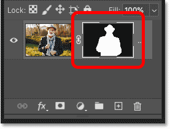
*The selection was turned into a layer mask.*

## How to use the Remove Background command

So far, we've seen that Select Subject automatically selects the main subject in a photo, but removing the background is an extra step we need to do ourselves. Next, let's see what happens when we try the Remove Background command.

### Restoring the original photo

First, I'll revert my image back to its original state by going up to the **File** menu in the Menu Bar and choosing **Revert**:

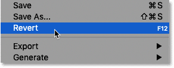
*Going to File > Revert.*

This restores the entire image:

*The original image once again.*

### Converting the Background layer to a standard layer

It also restores the Background layer in the Layers panel which prevents us from seeing the Select Subject and Remove Background buttons in the Properties panel. So to bring them back, I'll once again unlock the Background layer by clicking its **lock icon**:

*Unlocking the Background layer.*

### Applying the Remove Background command

Using Remove Background is just as easy as using Select Subject. Simply click the **Remove Background** button in the Properties panel:

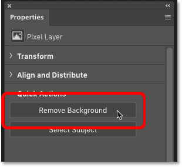
*Clicking the Remove Background button.*

Photoshop again analyzes the image looking for the main subject, and after a few moments, we see the result.

But this time, instead of just placing a selection outline around the man in the photo, the Remove Background command went further and actually removed the background:

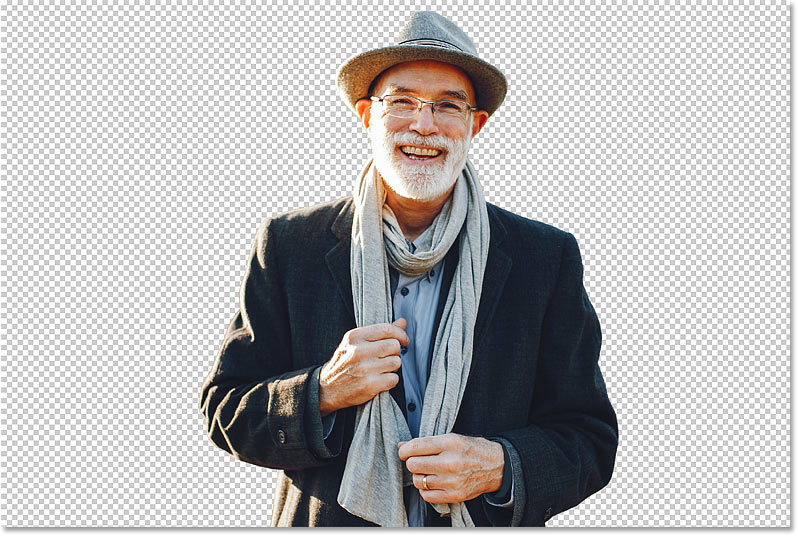
*The initial result using Remove Background.*

### How Remove Background works

The way Remove Background works is that it actually uses Select Subject to detect and select your subject, and then it takes that selection and converts it to a layer mask automatically. So Remove Background is not really a separate command. It's more like an extension, or an extended version, of Select Subject. 

In the Layers panel, we see the layer mask that was automatically created by the Remove Background command:

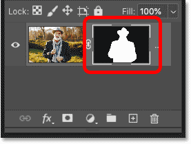
*The layer mask created by Remove Background.*

### The problem with Remove Background

At this point, you may be asking, "If Remove Background does all the work for us, and Select Subject only does half the job, why would anyone use Select Subject to remove a background? Why not just use Remove Background?" And this is where the problem with the Remove Background command comes in.

Remember back when Select Subject missed part of the man's hat? Well, if we zoom in on the image after running the Remove Background command, guess what? Remove Background missed it, too:

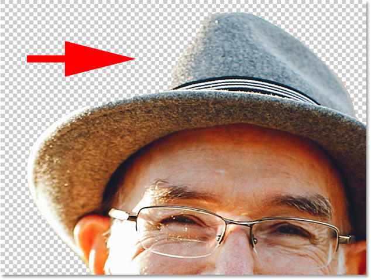
*Remove Background missed the same area as Select Subject.*

And here's the problem. With Select Subject, it was easy to add the missing area to the selection before the background was removed using the Object Select Tool. But how do we do that now when the background has *already* been removed and the area is still missing?

Fortunately, the solution is easy. To fix problems with a layer mask, we can use Photoshop's **Select and Mask** workspace. And as of Photoshop CC 2020, the Select and Mask workspace includes the same Object Selection Tool we used earlier!

## Using Select and Mask to add the missing area

Here's how you could use the Object Selection Tool in the Select and Mask workspace to restore a missing part of the image after applying the Remove Background command.

### Step 1: Select the layer mask

First, in the Layers panel, make sure the **layer mask thumbnail** is selected:

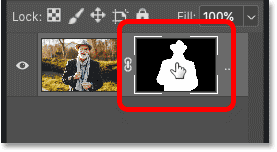
*Selecting the layer mask.*

### Step 2: Open Select and Mask

Then in the Properties panel, click the **Select and Mask** button:

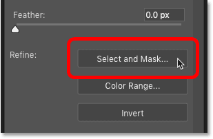
*Clicking the Select and Mask button.*

The image opens in Photoshop's Select and Mask workspace (or "taskspace" as Adobe likes to call it):

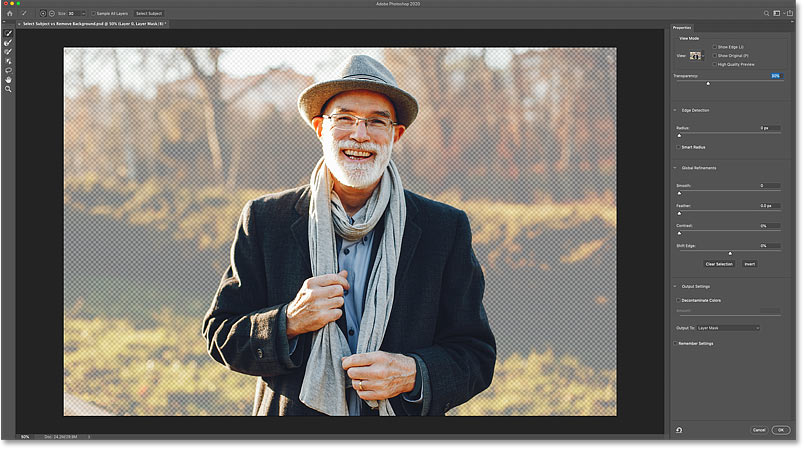
*The Select and Mask workspace.*

### Step 3: Set the View to Onion Skin and lower the transparency

To view the entire image so you can see the parts that are missing, set the **View Mode** in the upper right to **Onion Skin**:

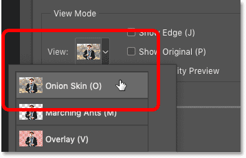
*Setting the view to Onion Skin.*

And then lower the **Transparency** to around **30 percent**:

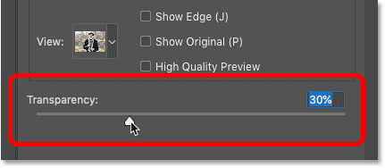
*Lowering the Transparency value.*

This allows the areas that are hidden by the layer mask to be faintly visible. And if I zoom in on the man's hat, we can now see the part that's missing:

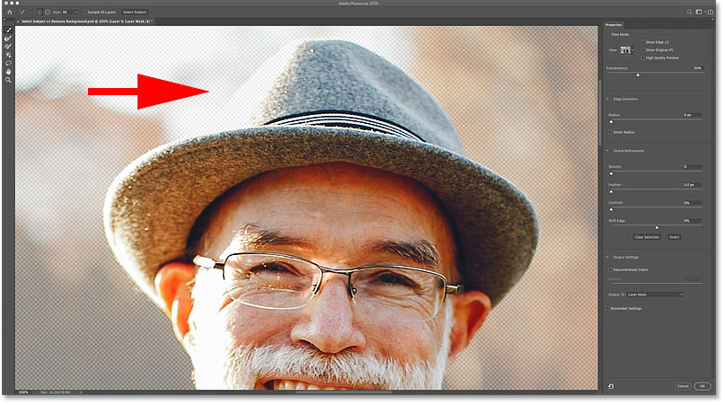
*Inspecting the image for missing parts of the subject.*

### Step 4: Choose the Object Selection Tool

In the toolbar along the left of the workspace, choose the **Object Selection Tool**:

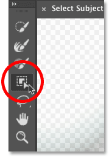
*Selecting the Object Selection Tool.*

### Step 5: Set the Mode to Lasso

And in the Select and Mask Options Bar, set the tool's **Mode** to **Lasso** so you can draw a freehand selection:

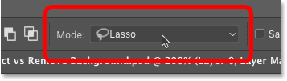
*Setting the selection mode to Lasso.*

### Step 6: Draw an outline around the missing area

Then simply click and drag an outline around the missing part of the image. 

There's no need to hold Shift as you drag this time because the Object Selection Tool in the Select and Mask workspace defaults to the **Add to Selection** mode. But if you need to remove an area from the selection, then you still need to hold **Alt** (Win) / **Option** (Mac) as you drag.

Here I'm dragging around the missing part of the hat:

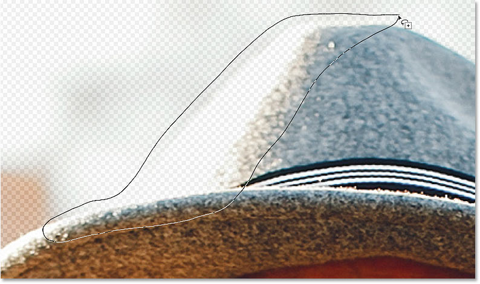
*Dragging around the missing area with the Object Selection Tool.*

Release your mouse button, and the missing area is added. We know it was added because the area becomes fully visible while the rest of the background (the area still hidden by the mask) remains partially transparent:

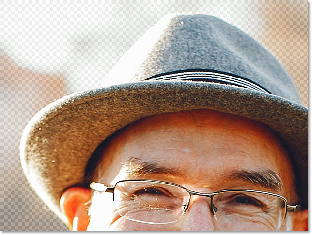
*The area missing from the layer mask has been added.*

### Step 7: Output the selection as a layer mask

Finally, in the lower right of the Select and Mask workspace, set the **Output To** option to **Layer Mask**. This will replace the existing layer mask with the new one that now includes the missing area.

You could also choose **New Layer with Layer Mask** if you want the original version and the new version to be on separate layers, but it's easier to just to overwrite the original since we really don't need it:

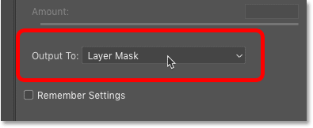
*Setting the **Output** option to **Layer Mask**.*

### Step 8: Close the Select and Mask workspace

Click OK to close the Select and Mask workspace. Back in our document, the missing part of the hat has been restored, and we now have the exact same result that we got by removing the background using the Select Subject command:

*The final result using Remove Background plus Select and Mask.*

## Summary: Select Subject vs Remove Background

Both the Select Subject and Remove Background commands in Photoshop CC 2020 can be used to quickly select your subject and remove the background from your photo. The difference between them is that Select Subject requires you to manually remove the background after it draws the selection, whereas Remove Background selects your subject *and* removes the background with a single click.

Yet while Remove Background is faster, Select Subject makes it easier and more intuitive to find and fix problems with the selection before the background is removed. And since you'll almost always need to refine the selection regardless of which command you choose, Select Subject is usually the better choice.

And there we have it! To learn more about topics I covered briefly in this lesson, check out my complete [Select Subject](/basics/select-subject-select-and-mask-photoshop-cc-2018/) tutorial or my [Object Selection Tool](/basics/object-selection-tool/) tutorial. And to learn how to use other selection tools, see my [Photoshop Selection Tools](/basics/make-selections-photoshop/) lesson guide.