# Select Subject’s New Cloud Option in Photoshop 2022

> Source: [https://www.photoshopessentials.com/basics/select-subjects-powerful-new-cloud-option-in-photoshop-2022/](https://www.photoshopessentials.com/basics/select-subjects-powerful-new-cloud-option-in-photoshop-2022/)
> Downloaded and converted to Markdown.

Photoshop's Select Subject command can now process your image on the Cloud using Adobe's powerful servers. But does more power mean better 1-click selections? Let's find out!

Photoshop’s Select Subject command lets you select the main subject in your image with a single click. At least, that was the idea when it was first introduced back in 2018. Since then, its automated 1-click selections have only improved thanks to a steady stream of updates.

But Select Subject may have just seen its biggest update yet in the August 2022 release of Photoshop (version 23.5). A new feature has been added that lets you run Select Subject not on your computer but on the Cloud. So instead of relying on your computer’s power, the selection can now be processed online using Adobe’s own servers.

Adobe claims that running Select Subject from the Cloud gives you more detailed selections, while running it from your computer gives you faster results. So in this tutorial, we put that claim to the test. I’ll start by showing you where to find the new Cloud option for Select Subject. Then I’ll run Select Subject twice on the same image, first on my computer and then on the Cloud. And after comparing the results, I’ll show you how to set the winner as the default mode for Select Subject to get the best possible selection every time.

### Which version of Photoshop do I need?

To follow along, make sure that your copy of Photoshop is up to date. You’ll need version 23.5 (the August 2022 release) or later. You can [get the latest version of Photoshop here](https://adobe.prf.hn/click/camref:1100lrdjJ/destination:https%3A%2F%2Fwww.adobe.com%2Fproducts%2Fphotoshop.html).

And for this tutorial, I’ll use this image ([group photo](https://adobe.prf.hn/click/camref:1100lrdjJ/destination:https%3A%2F%2Fstock.adobe.com%2Fca%2Fimages%2Fgroup-of-young-people%2F280874550) from Adobe Stock).

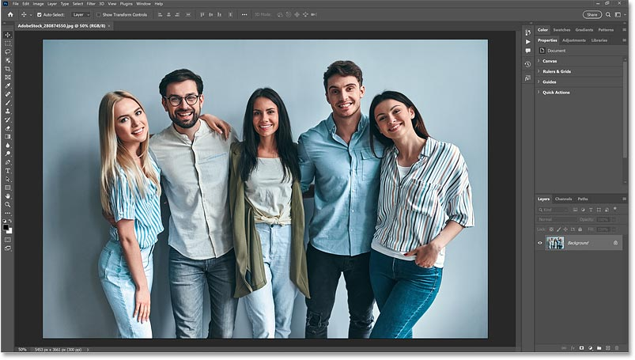
*The original image.*

Let's get started!

## Where to find Select Subject’s new Cloud option

There are a few places to access the new Cloud option for Select Subject. You’ll find it in the **Options Bar** when you have the Object Selection Tool, the Quick Selection Tool or the Magic Wand Tool active. You’ll also find it in the **Select and Mask** workspace. And as we’ll see at the end of this tutorial, there’s a new category in **Photoshop’s Preferences** specifically for the Select Subject command.

But the fastest way to try out Select Subject running on the Cloud is from the Options Bar. You’ll need to have either the [Object Selection Tool](/basics/using-the-object-selection-tool-and-object-finder-in-photoshop-2022/), the [Quick Selection Tool](/basics/selections/quick-selection-tool/) or the [Magic Wand Tool](/basics/selections/magic-wand-tool/) active.

All three tools are found in the same spot in the [toolbar](/basics/photoshop-tools-toolbar-overview/). I’ll choose the Object Selection Tool.

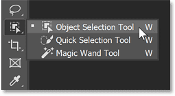
*Choosing the Object Selection Tool from the toolbar.*

### The new Device and Cloud choices

In the Options Bar, click the new **arrow** next to the Select Subject button.

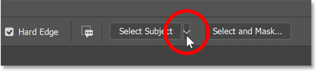
*Clicking the arrow.*

And here you’ll find two new choices. **Device** (the default mode) means that Select Subject will use your computer to process the selection. And **Cloud** will process the selection on Adobe’s servers. Of course, you’ll need to be connected to the internet for it to work. 

Let’s quickly run both versions to see which one gives us better results.

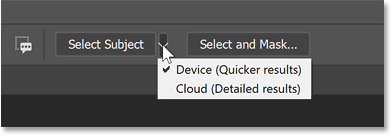
*The new Device and Cloud options for Select Subject.*

### How to run Select Subject on your computer

To run Select Subject on your computer, choose **Device**.

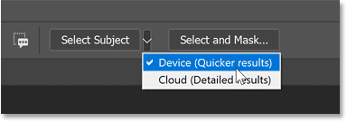
*Choosing the Device option.*

Then click the **Select Subject** button.

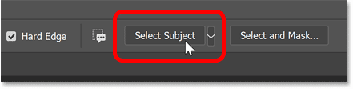
*Clicking Select Subject.*

#### The selection results

Adobe claims that choosing Device will give us quicker results. And sure enough, on my computer, it took only a few seconds for Select Subject to analyze the image, look for the main subject(s) and then draw the selection.

But the selection itself, at least with this image, is not that great. Ideally, only the people in the photo would be selected. But in the lower half of the image, most of the background between each person was included in the selection.

*The Select Subject result using my computer.*

If I zoom in closer, we find other problems as well. For example, notice the part of the man’s shirt that’s missing from the selection.

*This part of the shirt should have been selected.*

And there’s a large area of the background between the same man and the woman in the center that Select Subject failed to recognize as the background.

*This part of the background should not have been selected.*

### How to run Select Subject on the Cloud

Let’s run Select Subject again, but this time from the Cloud to see if Adobe’s servers do a better job.

To run Select Subject from the Cloud, click the **arrow** next to the Select Subject button in the Options Bar and choose **Cloud**.

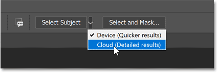
*Choosing the Cloud option.*

Then click **Select Subject**.

*Clicking the Select Subject button.*

If your original selection is still active, click OK in the warning box to tell Photoshop to discard it.

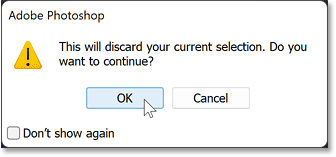
*Clicking OK to replace the original selection with the new one.*

#### The selection results

Running Select Subject on the Cloud means that the selection is processed over the internet using Adobe’s servers. So the first thing you’ll notice is that it takes longer. In fact, a progress bar will appear giving you an idea of how much longer you’ll need to wait. This will depend on the speed of your internet connection.

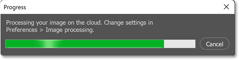
*The progress bar.*

But the wait seems to be worth it. Notice how much better the Cloud version of my selection turned out. In the lower half of the photo, Select Subject was able to do a much better job of selecting the people without selecting the background between them.

*The Select Subject result using the Cloud.*

Remember the part of the man’s shirt that was missing from the selection when Select Subject was run on my computer? It’s now selected. There is a small area still missing at the top, but overall it’s a big improvement.

*Adobe's servers did a better job with selecting the man's shirt.*

And the background area between the same man and the woman in the center was correctly identified this time as the background and excluded from the selection. So with this image, and with other images I’ve tested, Select Subject running on the Cloud did the better job, even though it took a bit longer.

*The Cloud version was better at detecting the background between the subjects.*

### Select Subject’s Cloud option in Select and Mask

You can also choose the new Cloud option for Select Subject in Photoshop’s Select and Mask workspace.

With any of Photoshop’s selection tools active, click the **Select and Mask** button in the Options Bar.

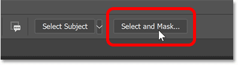
*Clicking the Select and Mask button.*

Then at the top of the Select and Mask workspace, click the same **arrow** to choose either **Device** or **Cloud** before clicking the **Select Subject** button.

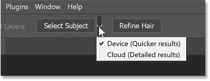
*Choosing Device or Cloud in the Select and Mask workspace.*

### Is Select Subject on the Cloud better for selecting hair?

With all the images I tested, Select Subject running on the Cloud resulted in better selections, at least in areas where the edges were well-defined. But can Adobe's servers do a better job at selecting fine details like hair? From my tests, the answer is yes... sort of... sometimes. You do get a *different* hair selection compared to running Select Subject on your computer. But whether or not it's a *better* hair selection seems to depend on the image.

#### The hair selection with Select Subject set to Device

Here’s a close-up of the hair  after running Select Subject on my computer. In the Select and Mask workspace, I’ve set the **View Mode** to **Black** and the **Opacity** to **100%** so we’re seeing the hair against a black background. Notice how the edges around his hair look fairly sharp and unnatural.

*The hair selection using my computer.*

#### The hair selection with Select Subject set to Cloud

And here’s the result after running Select Subject on the Cloud. The edges around the hair are a bit softer. And a few more strands of hair were added to the selection. So is the Cloud version better? Yes. Is it lots better? No. And neither result is anything close to perfect.

Your results with vary. But even with the added power of Adobe's servers, you’ll still need to refine the hair no matter which Select Subject mode you choose.

*The hair selection using the Cloud.*

### How to change Select Subject’s default mode to Cloud

Hair and fine details aside, running Select Subject on the Cloud produced noticeably better selections compared to running it on my computer. If you get similar results with your images, you can tell Select Subject to use the Cloud by default. Here’s how to do it.

On a Windows PC, go up to the **Edit** menu. On a Mac, go up to the **Photoshop** menu. From there, choose **Preferences**. Then choose the new **Image Processing** category.

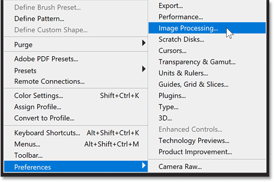
*Opening the new Image Processing Preferences.*

In the Preferences dialog box, change the **Select Subject Processing** option from Device to **Cloud**. Then click OK to close the dialog box.

The next time you run Select Subject, Cloud will already be selected. But you can still click the arrow in the Options Bar or the Select and Mask workspace and choose Device if you want faster results or your computer is not connected to the internet.

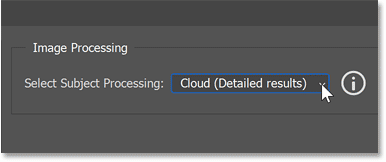
*Changing Select Subject Processing to Cloud.*

And there we have it! Check out my related tutorial for a [more detailed look at using Select Subject](/basics/select-subject-select-and-mask-photoshop-cc-2018/), as well as my comparison of Photoshop's [Select Subject vs Remove Background](/basics/select-subject-vs-remove-background-in-photoshop/) commands.  And don't forget, all of my tutorials are now available to [download as PDFs](/print-ready-pdfs/)!