# Photoshop Brushes – Shape Dynamics

> Source: [https://www.photoshopessentials.com/basics/photoshop-brushes/brush-dynamics/shape-dynamics/](https://www.photoshopessentials.com/basics/photoshop-brushes/brush-dynamics/shape-dynamics/)
> Downloaded and converted to Markdown.

As I mentioned in the [introduction](/basics/photoshop-brushes/brush-dynamics/) to this series of tutorials, all six of Photoshop's Brush Dynamics categories share similar types of controls so once we've taken a look at how the Shape Dynamics work, which we'll do in a moment, we'll already have a good understanding of how the rest of them work. Unfortunately, controls are not the only thing they share. As we'll see, the way the controls are laid out makes understanding them a bit more of a challenge than it should be. Don't worry, though. We'll figure it out.

To access the Shape Dynamics options, click directly on the words **Shape Dynamics** on the left side of the Brushes panel. We need to click directly on the words themselves for the controls to appear (clicking inside the checkbox to the left of a category's name will turn those options on but won't give us access to their controls):

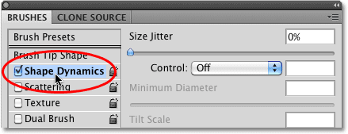
*Click directly on the words Shape Dynamics to access the controls.*

As soon as you click on Shape Dynamics, the controls for the various Shape Dynamics options will appear on the right side of the Brushes panel. The preview area on the bottom of the panel remains so we'll be able to see the effect we're having on the brush stroke as we make changes:

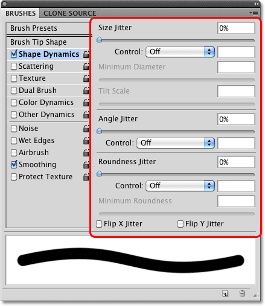
*The controls for the Shape Dynamics options appear.*

Shape Dynamics allows us to dynamically control the **size**, **angle** and **roundness** of the brush as we paint with it. In fact, with just these three controls alone, we can make our digital, lifeless Photoshop brushes behave as if we were painting with real brushes on paper!

I mentioned that the way the controls are laid out makes things more confusing than they should be, so let's clear this problem up right now. The Shape Dynamics options are divided into three sections - **Size**, **Angle**, and **Roundness**. Unfortunately, this isn't really clear because to the right of each of these headings is the word **Jitter** with a slider bar below it. For the moment, ignore the word "Jitter" (and the slider bar). The only thing we're interested in right now is the word that comes before "Jitter". This is the name of the section (Size, Angle, and Roundness):

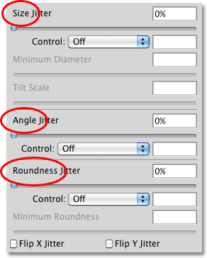
*The Shape Dynamics section is divided into three sections - Size, Angle and Roundness.*

Below each of these three headings is a **Control** option. Each Control option is tied directly to the heading above it. So, for example, the Control option at the top should be labeled **Size Control** (it isn't, but it should be). The middle one should be labeled **Angle Control** (again, it isn't but it should be), and the bottom one should be labeled **Roundness Control** (which of course it is... oh wait, no it isn't, but it should be):

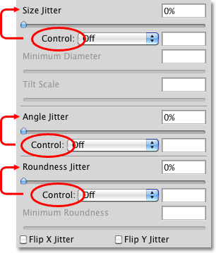
*Each of the three Control options is tied to the heading above it.*

These Control options give us various ways to dynamically control the size, angle and / or roundness of the brush as we paint. Most of the choices we're given require us to have a pen tablet installed, but there are some choices available if you don't have one (although you're seriously missing out if you don't have one). By default, each one is set to **Off**, which means we currently have no control over anything. Let's gain control by taking a closer look at each section individually.

### Size

The Size section gives us different ways to dynamically change the thickness of the brush stroke as we paint. To see a list of all the various ways we can choose from to control the brush size, simply click on the drop-down list to the right of the Control option. Click on any of the options in the list to select it:

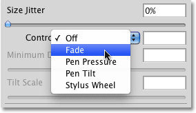
*Click on the drop-down list to view all the choices for controlling the size of the brush.*

**Fade**

The **Fade** option is the only choice we have for dynamically controlling the thickness of the brush that does not require a pen tablet. In fact, it works exactly the same way whether you're using a pen tablet or not. Fade gradually reduces the size of the brush as you drag out a stroke.

If you recall from our [Create Your Own Custom Photoshop Brushes tutorial](/basics/photoshop-brushes/make-brushes/), if we were painting on paper with a real brush, the brush would lay down a continuous coat of paint on the paper, but that's not how Photoshop works. What Photoshop does is it "stamps" a series of brush tips along the path of your brush as you drag it inside the document. The Fade option gradually makes each new stamp smaller than the previous one until the brush is no longer visible.

Exactly how long it takes for the brush stroke to fade out completely is determined by the number of **steps** we set for it in the input box to the right of the Control option. The default number of steps is 25:

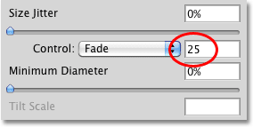
*Fade gradually makes the brush smaller in a series of steps, with 25 steps being the default.*

Think of "steps" as stamps, with each new stamp of the brush tip being one step. With the default value of 25, Photoshop will gradually reduce the size of the brush stroke over the course of 25 stamps. The easiest way to see this is by increasing the **spacing** between each stamp. Let's exit out of the Shape Dynamics controls for a moment by clicking on the words **Brush Tip Shape** directly above Shape Dynamics on the left side of the Brushes panel:

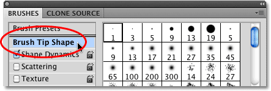
*Click directly on the words "Brush Tip Shape".*

This gives us options for adjusting the brush tip itself. You'll find the **Spacing** option near the bottom of the panel, just above the brush stroke preview area. The Spacing option allows us to adjust the distance between each stamp of the brush tip as we paint a stroke. I'm going to drag the Spacing slider towards the right to increase the amount of space between each new brush tip, which will make it easy for us to see how Fade is working. I still have one of Photoshop's standard round brushes selected. Notice how each new stamp of the brush tip is smaller than the previous one. If you count each stamp, you'll find that there's exactly 25 of them from the largest one on the left to the smallest one on the right. After that, the stroke disappears into oblivion:

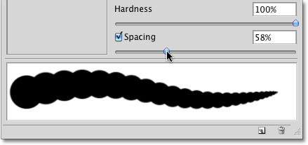
*With the Fade option set to 25 steps, it takes 25 "stamps" of the brush tip to fade out the brush.*

I'll click back on the words Shape Dynamics on the left of the Brushes panel so I can once again access the Size controls and I'll lower the number of Fade steps to 15:

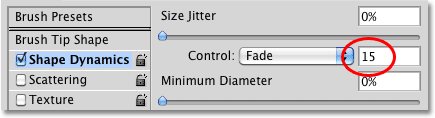
*Lowering the number of Fade steps to 15.*

If we look at the preview of the brush stroke at the bottom of the panel, we see that the stroke is now shorter since it's taking only 15 stamps of the brush tip for the size of the brush to fade out to nothing:

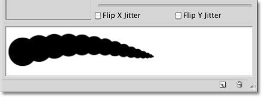
*A smaller number of steps the brush size will fade out faster.*

For best results when using Fade to control the size of the brush, you'll usually need to adjust the Spacing option as well to fine-tune the length and smoothness of the brush stroke. A smaller Spacing value will give you a smoother looking stroke. Larger values make the individual stamps more obvious and result in a more ridged appearance.

**Minimum Diameter**

If you don't want the brush size to fade out completely, you can use the **Minimum Diameter** option to set a limit for how small the brush can get. Once the brush is reduced to the minimum size, it will remain at that size for as long as you continue dragging out the stroke. You can adjust the Minimum Diameter option either by dragging its slider or by entering a specific value into the input box. The default value is 0%, which means the brush will fade out completely. I'm going to increase the minimum diameter of my brush to 10% so that once the brush reaches 10% of its original size, it won't go any smaller:

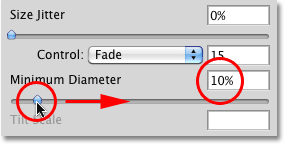
*Use the Minimum Diameter option to set the smallest possible size for the brush.*

If we look at the preview of the brush stroke at the bottom of the panel, we see that the stroke now continues on and never drops below its new minimum size:

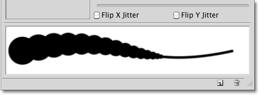
*Use the Minimum Diameter option to set the smallest possible size for the brush.*

**Pen Pressure**

By far the most common and natural way to dynamically control the thickness of a brush stroke as you paint is with **Pen Pressure**:

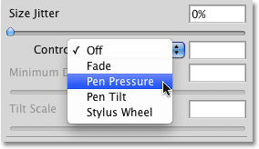
*Select Pen Pressure if you have a pressure-sensitive pen tablet installed.*

With Pen Pressure selected for the size Control option, the harder you press the pen into the tablet, the larger the stroke thickness becomes. Easing up on the pressure makes the brush stroke thinner. The preview area at the bottom of the Brushes panel will change to show the brush stroke tapered off at both ends when Pen Pressure is selected:

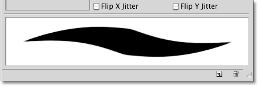
*Pen pressure makes controlling the thickness of a brush stroke more natural.*

Of course, you can only use this option if you have a pressure-sensitive pen tablet installed on your computer. Photoshop won't stop you from selecting Pen Pressure even if you don't have a pen tablet installed, but it will display a small warning icon to let you know that even though you've selected it, it's not going to work:

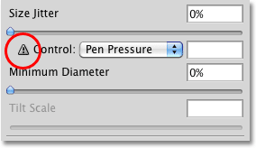
*The warning icon is Photoshop's way of saying "Nice try, buddy".*

**Pen Tilt**

If you do have a pen tablet installed and want even more dynamic control over the size of your brush stroke, try out the **Pen Tilt** option:

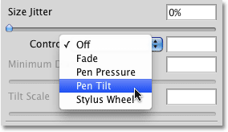
*Pen Tilt is another option specifically for pen tablet users.*

Pen Tilt includes all of the pressure-sensitive abilities of the Pen Pressure option and adds the ability to control the size of the brush by tilting the pen as you paint. The further you tilt the pen, the larger the stroke becomes. You can control how much of an impact tilting the pen has on the brush stroke with the **Tilt Scale** option, which is only available when Pen Tilt is enabled. Drag the slider left or right to adjust the scaling percentage:

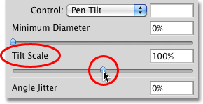
*The Tilt Scale option is grayed out and unavailable when Pen Tilt is not selected.*

Personally, I find that using Pen Tilt to control the brush size is more frustrating than anything so I usually stick with the Pen Pressure option, but that's just me. And by "just me", I mean probably you, too.

**Stylus Wheel**

Finally, the last option we have for dynamically controlling the brush size is **Stylus Wheel**:

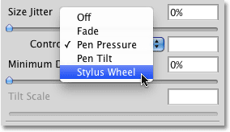
*The mysterious and confusing Stylus Wheel option.*

Many Photoshop users select this option thinking it will allow them to control the brush size with their mouse wheel, but nope, that's not the wheel Adobe is referring to here. This Stylus Wheel option is for people who not only have a pen tablet but also have an optional airbrush pen to go with it. The airbrush has a special stylus wheel built in to it, and if you happen to have an airbrush, you can use its stylus wheel to control your brush size.

At last check, Wacom was selling an airbrush pen for their new Intuos4 tablets for $99.95 (US), but since I haven't yet had a reason to buy one, I get the "Nice try, buddy" warning icon when I select the Stylus Wheel option, telling me I can select it if I want but it won't make any difference:

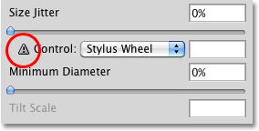
*If you have an airbrush pen, try out the Stylus Wheel option. The rest of us can just pretend.*

**Size Jitter**

Now that we've looked at the various ways Photoshop gives us for dynamically controlling the size of a brush as we paint, let's jump back to that initial option we purposely ignored earlier - **Jitter**. The term "jitter' is Photoshop-speak for **randomness**, which is actually the exact *opposite* of control. Whenever we see the word Jitter beside the name of a heading (Size, Angle, Roundness, etc), it means we can let Photoshop randomly make changes to that aspect of the brush as we paint with it. Jitter has absolutely *nothing* to do with the Control options we just looked at. You can use Jitter all by itself to add nothing but randomness to your brush, or you can combine it with any of the Control options for sort of a control/randomness hybrid. For example, you can control your brush size with pen pressure and still add some randomness to it as well.

By default, the Jitter option is set to 0%, which means "off". To have the size of the brush randomly change as you paint, drag the Jitter slider towards the right. The further you drag the slider, the more randomness you'll add:

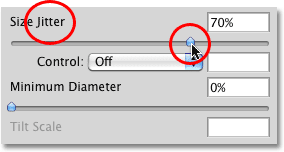
*Use the Jitter slider to randomly change the thickness of the brush stroke as you paint.*

Keep an eye on the preview area at the bottom of the Brushes panel to see the results as you drag the Jitter slider. Notice how the brush randomly changes size with each new stamp of the brush tip:

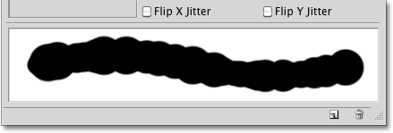
*Higher Jitter values result in more randomness to the size of each brush tip.*

As I mentioned, you can combine Jitter with any of the Control options for a little added excitement. Here's a brush stroke I painted with the size Control option set to Pen Pressure and combined with a size Jitter value of 50%:

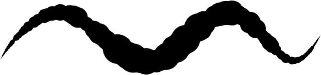
*Combine Control options with randomness for interesting results.*

Now that we've taken a detailed look at what the various options are for dynamically controlling the size of a brush and how they all work, let's quickly see how we can use many of these same options to control the **angle** of our brush!

### Angle

Photoshop's Shape Dynamics allows us to dynamically control the angle of our brush as we paint in much the same way that we can control its size. In fact, most of the choices we're given for controlling the angle are the same. Before we continue though, I'm going to select a different brush tip from the Brush Tip Shape options in the Brushes panel, for the simple reason that I currently have a round brush selected and a round brush looks, well, round no matter which angle you set it to. I'll choose the Hard Elliptical 45 pixel brush from the list:

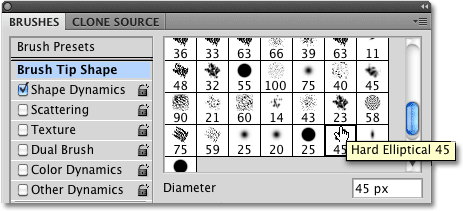
*Click on "Brush Tip Shape" in the top left corner of the Brushes panel to choose a new brush tip from the list.*

With my new brush tip now selected, I'll switch back over to the Shape Dynamics options. Click on the drop-down box to the right of the angle **Control** option to view our choices for controlling the brush angle:

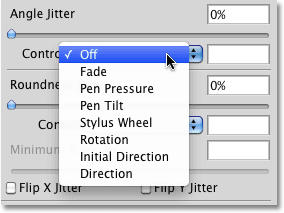
*Many of the Brush Dynamics sections share the same Control options, like Fade, Pen Pressure, etc.*

**Fade, Pen Pressure, Pen Tilt, Stylus Wheel**

As we can see in the list, Fade, Pen Pressure, Pen Tilt, and Stylus Wheel are all here again, and they all work in a similar fashion except that this time, they'll control the angle of the brush rather than its size. For example, Fade will rotate the brush 360° over a specified number of steps. The default number of steps is again 25. I'll select **Fade** and lower the number of steps to 15 just as I did with the Size control:

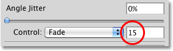
*Telling Photoshop to rotate the brush tip over the course of 15 steps with the Fade option.*

The preview area at the bottom of the Brushes panel updates to show us the result. The brush now rotates along the path of the stroke, taking exactly 15 stamps of the brush tip before it returns to its original angle:

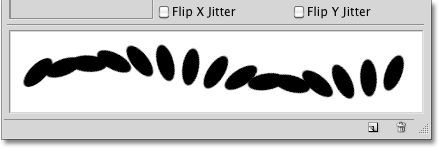
*"Fading" the angle of the brush simply means rotating the brush over a certain number of steps.*

Selecting **Pen Pressure** allows us to vary the angle of the brush based on the amount of pressure being applied to the pen tablet. Pen Tilt controls the angle by tilting the pen as we paint. Here's an example of a brush stroke I painted with the angle control set to **Pen Pressure**. I've increased the spacing between the individual brush tips to make things more obvious:

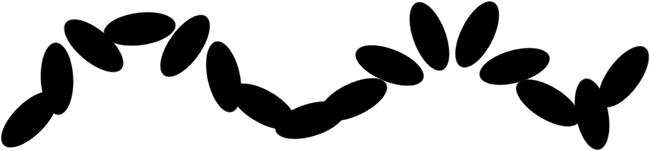
*With Pen Pressure selected, vary the amount of pressure applied to the pen tablet to rotate the brush.*

**Direction and Initial Direction**

Of all the choices available to us for controlling the brush angle, the one used most often is **Direction**:

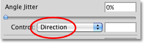
*It may be at the bottom of the list, but "Direction" is usually the top choice for controlling the brush's angle.*

The Direction option works exactly the same whether you're using a pen tablet or a standard mouse. The brush tip automatically rotates to follow the direction you're painting in:

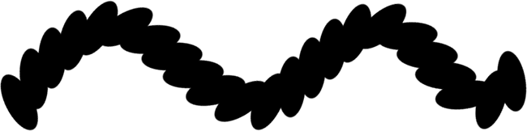
*The brush now follows the direction we paint in for a more natural look.*

You can also try the **Initial Direction** option:

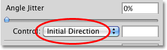
*The Initial Direction forces the angle to the initial direction you paint in.*

Initial Direction locks the angle of the brush to the direction you first drag your mouse or pen in. Regardless of which direction you move in after that, the angle remains unchanged:

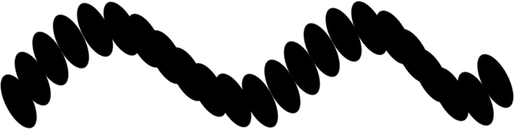
*With Initial Direction selected, the instant you move your mouse or pen, you lock in the brush's angle.*

**Angle Jitter**

Just as we saw with the Size section, the Angle section also includes a **Jitter** option directly above the Control option. We already know that "jitter" means randomness, and in this case, we can use the Jitter slider to tell Photoshop to randomly change the angle of the brush as we paint. The further we drag the slider towards the right, the more randomness will be applied:

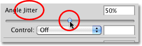
*Use the Jitter slider in the Angle section to randomly change the angle of the brush.*

Again, the Jitter slider has nothing to do with the Control option below it. We can use Jitter by itself to add nothing but randomness to the brush angle, or we can combine Jitter with one of the Control options for a "best of both worlds" effect. Here's a brush stroke I painted with the Control option set to Direction combined with a Jitter value of 20%:

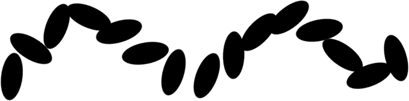
*With a Jitter value of 20%, a small amount of randomness has been added to the angle of the brush tip as it follows the direction of the stroke.*

### Roundness

The third aspect of the brush that we can dynamically control using options in the Shape Dynamics section is its **roundness**. Before we continue, I'm going to switch back to one of Photoshop's standard round brushes by clicking on its thumbnail in the Brush Tip Shape section of the Brushes panel. I'm doing this only to make it easier for us to see the effect we're having on the brush. You can use any brush tip you like. Once I've chosen my new brush tip, I'll switch back over to Shape Dynamics:

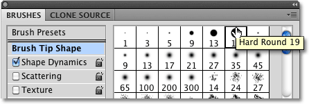
*Choosing the Hard Round 19 pixel brush from the Brush Tip Shape options.*

The term "roundness" here can be a bit misleading since it has nothing to do with whether or not the shape of your brush tip is actually round. It may help to think of roundness as "flatness", since what we're really doing is flattening the brush tip as we paint. A roundness value of 100% simply means that the brush tip looks completely normal, just as it appeared in its thumbnail when you selected it, whether it's an actual round brush like the one I've chosen, a leaf brush, snowflake, chalk brush, or whatever the case may be. By choosing a way to dynamically control the roundness, we can squish and flatten the brush tip along the length of the stroke.

Just as we've seen with the Size and Angle sections, the Roundness section contains its own **Control** option, and we simply click on its drop-down box to choose a control method from the list. The options for controlling the roundness are pretty much the same as what we're given for controlling the brush's size:

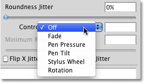
*The options for controlling the brush size and roundness are mostly the same.*

**Fade**

Choosing **Fade** in the Control option will tell Photoshop to gradually reduce the roundness of the brush over a specified number of steps. Once again the default number of steps is 25, but I'll reduce it to 10 and I'll increase the spacing between the brush tips so we can see what's happening. The brush starts out with its regular shape and gradually flattens, reaching its minimum roundness value on the last step:

*With the roundness control set to Fade in 10 steps, it takes 10 stamps of the brush tip to reach minimum roundness.*

Choosing **Pen Pressure** allows us to control the roundness of the brush based on the pressure being applied to the tablet with the pen. **Pen Tilt** makes it possible to adjust the roundness as we paint by tilting the pen. Holding the pen at a normal 90° angle from the tablet will set the brush to maximum roundness. Tilting it in any direction will reduce the roundness. Here, I've set the roundness control to Pen Tilt and painted a simple horizontal brush stroke, tilting the angle of the pen as I continued along the stroke:

*With Pen Tilt selected, the angle of the pen determines the roundness of the brush tip as you paint.*

**Minimum Roundness**

If you don't want the brush tip to flatten completely, we can control how flat it can become using the **Minimum Roundness** option. The default value is 1%, which means 1% of the brush tip's normal size. I'm going to increase it to 25%:

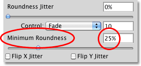
*Increase the minimum roundness value if you want to prevent the brush tip from going completely flat.*

I'll set the roundness control back to Fade and lower the number of steps to 5. Once the roundness reaches 25% of its original size, it remains at that level for the remainder of the stroke:

*Once the brush reaches 25% roundness, it stays there until you begin a new stroke.*

**Roundness Jitter**

Lastly, the roundness section includes the same **Jitter** option we've seen with the Size and Angle sections, and as with those other two sections, Jitter is completely separate from the Control option. Dragging the Jitter slider towards the right will add randomness to the roundness of the brush as we paint. Use the Jitter option on its own or combine it with any of the Control options:

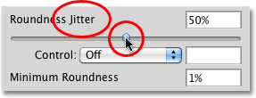
*Let Photoshop randomly change the flatness of the brush as you paint by increasing the Jitter value.*