# Applying Smart Filters To Editable Type In Photoshop

> Source: [https://www.photoshopessentials.com/basics/smart-filters-editable-type-photoshop/](https://www.photoshopessentials.com/basics/smart-filters-editable-type-photoshop/)
> Downloaded and converted to Markdown.

In this tutorial, we'll learn how to apply filter effects to live, editable type in Photoshop by taking advantage of Smart Objects and Smart Filters! I'll be using Photoshop CC.

Photoshop has lots of powerful features for working with type, but one thing we can't do is apply filters to Type layers. That's because Photoshop's filters are designed for manipulating *pixels*, and type in Photoshop is made from *vectors*. That's a shame, because if we could somehow apply filters to our type, it would unlock a world of creative possibilities. If only there was some way to do it.

Thankfully, as we'll see in this tutorial, there is! In fact, there's a couple of ways, but one way is definitely better than the other. The classic, old school way of applying filters to type is to first *rasterize* the Type layer, which means converting it from vectors into pixels. Since filters are designed to work with pixels, we can then apply any filters we like to the text. But there's a couple of drawbacks to this approach.

The main problem is that once we've converted the Type layer into pixels, the text is no longer editable. And, whenever we apply filters to normal, pixel-based layers, the filters are applied as *static effects*, which means that like the text itself, they're not editable after we've applied them. 

A better way to apply filters to type is to convert the Type layer into a *Smart Object*. A Smart Object is like a virtual container that holds the Type layer inside of it. Anything we do at that point is done not to the Type layer itself but to the Smart Object surrounding it. Photoshop lets us apply most of its filters to Smart Objects, all while keeping the Type layer inside fully editable. And, whenever we apply filters to Smart Objects, they're applied not as static effects but as *Smart Filters*! 

What's a Smart Filter? In many ways, a Smart Filter is just like a normal filter, except that it remains fully editable even after we apply it. We can go back at any time, re-open the Smart Filter's dialog box and try different settings without any loss in  quality, and without making permanent changes to the image (or in this case, to the type). Smart Filters have other features, too. We can turn Smart Filters on and off, apply multiple Smart Filters to the same Smart Object, and even change a Smart Filter's blend mode and opacity  independently of the Smart Object itself. And, Smart Filters  come with a built-in layer mask in case we don't want the effect(s) to be applied to the entire text. We'll be looking at all of these features throughout this tutorial.

Smart Objects and Smart Filters are two of the most powerful features in Photoshop, and when combined with Type layers, there's no limit to what we can do. Let's see how it works!

## How To Use Smart Filters With Type

Here's a document that I have open in Photoshop CC. To save us some time, I've already gone ahead and added some text (the words "Smart Objects"). I downloaded the background image from [Adobe Stock](https://prf.hn/l/OVRD0lm), but if you want to follow along, you can use anything you like for your background, just as long as you can see your text in front of it:

*A simple document open in Photoshop.*

If we look in my **Layers panel**, we see that my document is made up of two [layers](/basics/layers/); the  blue image is on the Background layer, and my type is on a separate **Type layer** above it. We know it's a Type layer because of the letter "T" in the thumbnail:

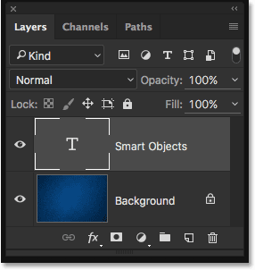
*The Layers panel showing the Type layer separate from the background image.*

### Converting The Type Layer To A Smart Object

Let's see what happens if I try to apply one of Photoshop's filters to the Type layer. First, I'll click on the Type layer to make sure it's selected:

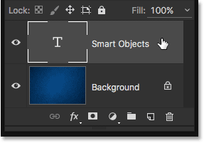
*Selecting the Type layer in the Layers panel.*

I'll try applying the Gaussian Blur filter. To do that, I'll go up to the **Filter** menu in the Menu Bar along the top of the screen, then I'll choose **Blur**, and then **Gaussian Blur**:

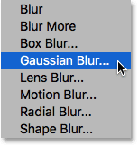
*Going to Filter > Blur > Gaussian Blur.*

Rather than applying the filter, Photoshop pops up a dialog box warning me that the Type layer will need to either be rasterized or converted to a Smart Object before proceeding, and that the text will no longer be editable if I choose to rasterize it. I want to keep everything editable, so I'll click on the **Convert To Smart Object** button:

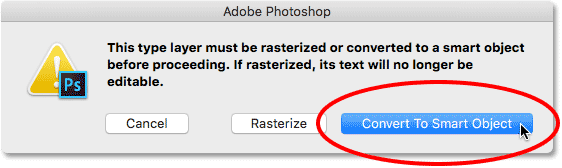
*Choosing  "Convert To Smart Object".*

As soon as I choose "Convert To Smart Object", the Gaussian Blur filter's dialog box opens. But before we look at it, let's look again in the Layers panel to see what just happened in the background.

Notice that the Type layer is no longer a Type layer. The thumbnail, which previously displayed nothing but a letter "T", is now showing us the actual contents of the layer. And, a small icon now appears in the lower right of the thumbnail. This is a **Smart Object icon**, and it tells us that the layer has been converted to a Smart Object. The Type  layer is still there, but it's now sitting *inside* the Smart Object. We'll see how to access and edit the Type layer a bit later on:

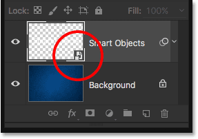
*The Layers panel showing the Type layer converted to a Smart Object.*

### Applying A Smart Filter

Now that we've confirmed that the Type layer has in fact been converted to a Smart Object, I'll go ahead and apply the Gaussian Blur filter. I'll start by setting the **Radius** value to around **6 pixels**. This tutorial isn't going to cover any specific filter in great detail. We're simply learning how to apply Smart Filters to type and the advantages that Smart Filters offer. Once you know the basics of how they work, you can easily experiment with your own filters and settings:

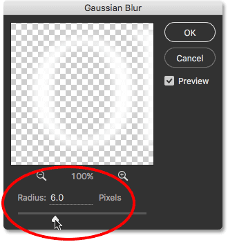
*Setting the Radius value in the Gaussian Blur dialog box.*

With the Radius value set, I'll click OK to close out of the Gaussian Blur dialog box, and here we see that I've added a fairly subtle blurring effect to the text:

*The type after applying Gaussian Blur.*

Now that I've applied the Gaussian Blur filter, what if I decide that I need to change the blur amount? If I had simply rasterized the text and then applied Gaussian Blur directly to the pixel-based layer, the filter would not be editable at this point. The only way I could change the blur amount would  be to either re-apply the filter over top of my initial blur effect (which means I'd be blurring the already-blurred text), or I would need to undo my last step and then re-apply the filter with a different setting.

Yet because I applied Gaussian Blur to a Smart Object, Photoshop automatically converted it into a Smart Filter! If we look again in my Layers panel, we can see  Gaussian Blur listed as a Smart Filter  below the Smart Object:

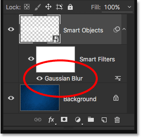
*The Layers panel showing the Gaussian Blur Smart Filter.*

### Editing A Smart Filter

That's really all there is to applying filters as Smart Filters in Photoshop. We simply need to convert the layer into a Smart Object first, and then apply the filter to the Smart Object. Photoshop will automatically convert it into a Smart Filter. 

As I mentioned earlier, the main benefit with Smart Filters is that they can be edited after we've applied them. To re-open a Smart Filter's dialog box and change its settings, all we need to do is **double-click** on the filter's **name** in the Layers panel. I'll double-click on "Gaussian Blur":

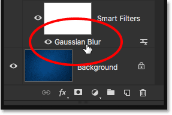
*Double-clicking on the Gaussian Blur Smart Filter.*

This re-opens the filter's dialog box to the settings that are currently being used (in my case, a Radius value of 6 pixels). Notice that I said the settings that are "currently being used", and that's because Smart Filters are entirely *non-destructive*. My Gaussian Blur filter wasn't actually applied to the type the way a normal filter would be permanently applied to a pixel-based layer. Instead, Photoshop is simply showing us a *live preview* of what the type looks like using my current Gaussian Blur settings. And because it's just a preview, we can change the settings at any time.

For example, I'll increase my Radius value from 6 pixels to **20 pixels**:

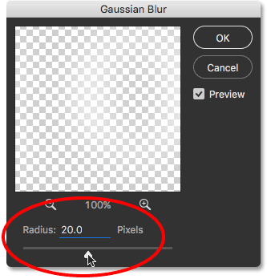
*Increasing the Radius value.*

I'll click OK to once again close the Gaussian Blur dialog box, and now we see that the blurring on the type appears much stronger. It's important to understand here that this is not a "second round" of blurring. In other words, Photoshop did not apply a 20 pixel blur on top of the previous 6 pixel blur. Instead, it replaced the previous setting with the new one, as if the previous one never happened:

*The effect after increasing the Gaussian Blur's Radius value.*

To prove it, if I wanted to reduce the amount of blurring, I could just double-click on the Gaussian Blur filter's name once again to re-open its dialog box:

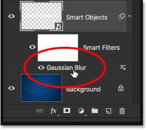
*Double-clicking again on the Gaussian Blur Smart Filter.*

I'll lower the Radius value down to **2 pixels** so it's even less than the initial amount (6 pixels):

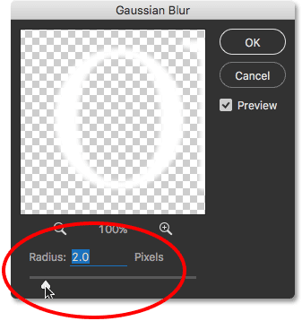
*Lowering the Radius value to 2 pixels.*

I'll click OK to close out of the dialog box, and here we see that I've gone from a very noticeable 20 pixel blur a moment ago down to a very subtle 2 pixel blur, something that wouldn't be possible if I was just re-applying the Gaussian Blur filter over and over again. Yet thanks to Smart Filters, nothing we do is permanent. We can go back and change a Smart Filter's settings at any time:

*The effect after decreasing the Radius value.*

### Undoing Smart Filter Edits

I'm going to quickly undo my last step by going up to the **Edit** menu at the top of the screen and choosing **Undo Edit Filter Effect (Gaussian Blur)**, or by pressing **Ctrl+Z** (Win) / **Command+Z** (Mac) on my keyboard:

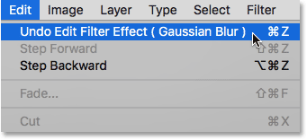
*Going to Edit > Undo Edit Filter Effect (Gaussian Blur).*

Notice that the name of the command is "Undo Edit Filter Effect", not "Undo Gaussian Blur". That's because my previous step wasn't *adding* the filter, it was *editing* the filter, and Photoshop considers adding and editing Smart Filters to be separate steps. When I choose the command, Photoshop undoes the last edit I made to the Gaussian Blur filter's settings, returning me back to my previous Radius value of 20 pixels. I could also have re-opened the dialog box and made the change manually, but undoing my last step was just faster. If I had additional filter edits I wanted to undo, I could step backwards through them one at a time by pressing **Ctrl+Alt+Z** (Win) /** Command+Option+Z** (Mac) repeatedly:

*The text is back to the previous blur amount after undoing the last Gaussian Blur edit.*

### Showing And Hiding Smart Filters

Another feature of Smart Filters is that we can easily hide the filter's effect without deleting or undoing the filter. If we look directly to the left of a Smart Filter's name in the Layers panel, we see a little *eyeball*. This is the Smart Filter's **visibility icon**. To temporarily hide the effect and view the text without the filter applied, simply click the icon to turn the filter off:

*Clicking the Gaussian Blur Smart Filter's visibility icon.*

With Gaussian Blur turned off, I'm back to seeing the original text without the blurring effect:

*The original text returns.*

To turn the Smart Filter back on, click on the empty spot where the eyeball used to be:

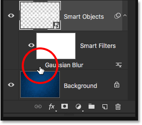
*Turning the Gaussian Blur Smart Filter back on.*

And now we're back to seeing the text with the blur applied:

*Turning the filter back on brings back the blur effect.*

### Deleting Smart Filters

What if I decide I don't need the Gaussian Blur filter at all? I *could* just turn it off by clicking its visibility icon like I did a moment ago, but if I really don't need it, I can just get rid of it.

One way to remove a Smart Filter is to **right-click** (Win) / **Control-click** (Mac) on the filter in the Layers panel and choose **Delete Smart Filter** from the menu that appears. I find that this is generally the faster way to do it:

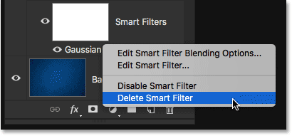
*Right-clicking (Win) / Control-clicking (Mac) on the Gaussian Blur filter and choosing Delete Smart Filter.*

The more common way to delete a Smart Filter, though, is to simply click and drag it down onto the **Trash Bin** at the bottom of the Layers panel:

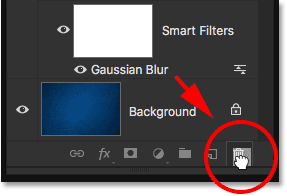
*Dragging the Gaussian Blur Smart Filter into the trash.*

Either way removes the filter from the Smart Object:

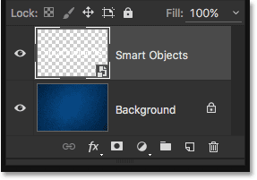
*The Layers panel after deleting the Smart Filter.*

Since I don't have any other Smart Filters applied at the moment, and since the Gaussian Blur Smart Filter didn't make any permanent changes to the document, my text returns to its original state:

*The type after deleting the Smart Filter.*

### Trying A Different Filter

Thanks to their non-destructive nature, it's easy to try out and experiment with different Smart Filters without worrying about messing things up, since, as we've seen, we can always hide or delete them if we don't like the results. I'll add a motion blur to my text using Photoshop's Motion Blur filter. To apply it, I'll go up to the **Filter** menu at the top of the screen, then I'll choose **Blur**, and then **Motion Blur**:

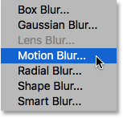
*Going to Filter > Blur > Motion Blur.*

This time, Photoshop doesn't warn me about first needing to either rasterize the Type layer or convert it to a Smart Object, and that's because it was already converted to a Smart Object back when I applied the Gaussian Blur filter. Instead, Photoshop goes ahead and opens the Motion Blur filter's dialog box.

I'll create a vertical blurring effect by setting the **Angle** to **90°**, and I'll increase the **Distance** to around **120 pixels**:

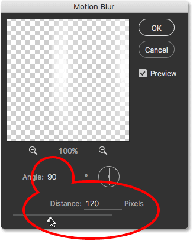
*The Motion Blur dialog box.*

I'll click OK to close out of the Motion Blur dialog box, and here we see the text with the motion blur applied:

*The text after applying the Motion Blur filter.*

If we look in the Layers panel, we see Motion Blur listed as a new Smart Filter under the text:

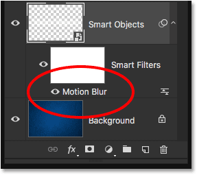
*The Layers panel showing the new Motion Blur Smart Filter.*

### Changing A Smart Filter's Blend Mode And Opacity

Another advantage that Smart Filters have over normal filters is that we can adjust the **blend mode** and **opacity** of a Smart Filter separately from the layer itself. If you're familiar with [layer blend modes in Photoshop](/photo-editing/layer-blend-modes/intro/), you know that we can change a layer's blend mode in the upper left of the Layers panel. I'll change the blend mode of my Smart Object from Normal (the default mode) to **Overlay**:

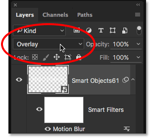
*Changing the blend mode of the text to Overlay.*

And here we see the result, with the entire effect (the type and the motion blur) blended in with the blue background:

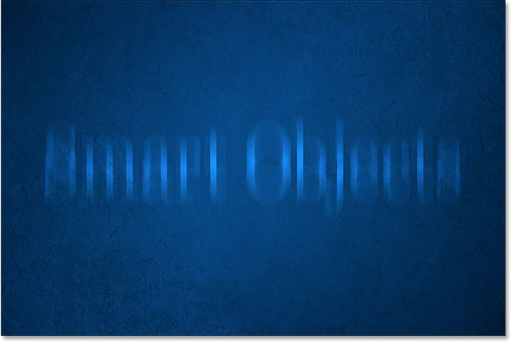
*The result after changing the Smart Object's blend mode to Overlay.*

I'll set the blend mode back to **Normal**:

*Setting the Smart Object's blend mode to Normal.*

This returns us back to the way things looked before:

*The text with the blend mode set to Normal.*

This time, I'll change the blend mode not of the layer (the Smart Object) but of the Motion Blur filter itself. To do that, I'll click on the **Blending Options** icon directly to the right of the Smart Filter's name. Each Smart Filter we add (we'll be learning how to add multiple Smart Filters in the next section) will have its own, independent Blending Options icon:

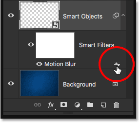
*Double-clicking on the Blending Options icon.*

This opens the **Blending Options** dialog box, with the same blend mode and opacity options at the top that we would find in the Layers panel. The difference here is that these options will affect only the Smart Filter, not the contents of the Smart Object.

For example, I'll once again change the blend mode from Normal to **Overlay**. And while I'm here, I'll lower the [opacity](/basics/layers/opacity-vs-fill/) down to **80%** so that the blurring effect isn't quite as intense:

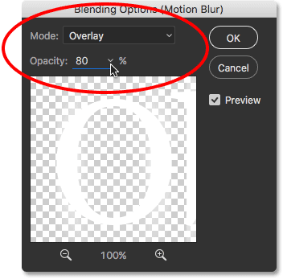
*The Smart Filter's Blending Options dialog box.*

I'll click OK to close out of the dialog box, and here we see a very different result. The Motion Blur filter is now blending not with the blue background but with the type inside the Smart Object, allowing the letters to show through the blurring effect. And, because I lowered the filter's opacity, the motion blur looks a little more faded than it did before, yet the type itself is not affected. It remains at 100% opacity:

*The effect after changing the blend mode and opacity of the Motion Blur Smart Filter.*

Watch what happens if I now change the Smart Object's blend mode in the Layers panel back to **Overlay**. Remember, I've already used the Blending Options dialog box to change the blend mode for the Motion Blur filter itself to Overlay, and now I'm also changing the blend mode for the Smart Object to Overlay:

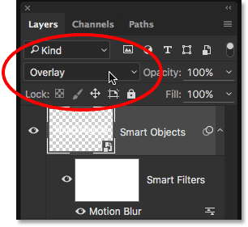
*Changing the Smart Object's blend mode back to Overlay.*

Here, we see  yet another  result that's different from the first two. Photoshop is first blending the Motion Blur filter in with the type, allowing the letters to show through the blurring effect. Then, it's blending the whole thing (the type and the blurring effect) in with the blue background. Being able to change a Smart Filter's blend mode and opacity separately from, or along with, the Smart Object itself lets us create unique looks for our text that wouldn't be possible using normal, static filters:

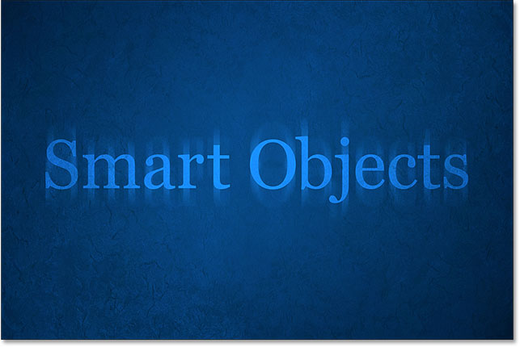
*The effect with the Motion Blur filter and the type both set to the Overlay blend mode.*

I'll set the Smart Object's blend mode back to **Normal**, but I'll leave the Motion Blur filter set to Overlay:

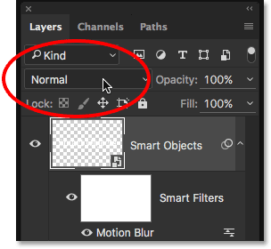
*Changing the Smart Object's blend mode back to Normal.*

And now that the Smart Object is no longer blending in with the blue background, we're back to seeing white text:

*The background is no longer showing through the letters.*

### Adding Multiple Smart Filters To The Type

So far, we've learned that to apply a Smart Filter to type in Photoshop, we first need to convert the Type layer into a Smart Object, at which point any filter we apply to it automatically becomes a Smart Filter. We've seen how to apply a single Smart Filter, but we can also apply *multiple* Smart Filters to the same Smart Object. 

Let's say I'm happy with my motion blur effect, and now I'd like to add a second filter to my text. We've already tried a couple of the blur filters, so this time, I'll try something different. I'll go up to the **Filter** menu, then I'll choose **Distort**, and then **Ripple**:

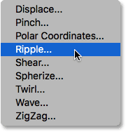
*Going to Filter > Distort > Ripple.*

This opens the Ripple filter's dialog box. To make the effect easy to see in the screenshots, I'll set the **Amount** value to **200%**, and I'll leave the **Size** set to **Medium**:

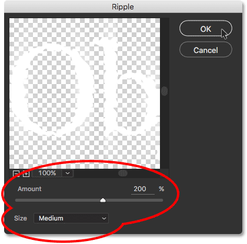
*The Ripple filter dialog box.*

As its name implies, Photoshop's Ripple filter creates a water ripples effect. I'll click OK to close out of the dialog box, and here's the result. I now have two filters being applied to my type; first the Motion Blur filter and then the Ripple filter:

*The result after applying the Ripple filter along with the Motion Blur filter.*

### Changing The Order Of Smart Filters

If we look in the Layers panel, we see that Ripple has been added as a new Smart Filter above the Motion Blur filter:

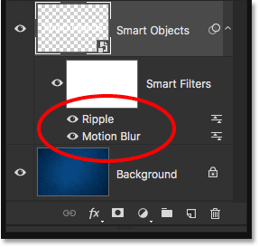
*The Layers panel showing the new Ripple Smart Filter.*

The order in which the Smart Filters are listed is important. That's because Photoshop applies the filters from the *bottom up*. In this case, it means that the Motion Blur filter is being applied to the type first (since it's the one at the bottom of the list) and then Ripple is applied after.

You may wonder why that matters, and it's because the order in which the filters are applied can change the overall appearance of the effect. For example, if I zoom in close, notice that at the moment, the motion blur streaks are showing the same ripple effect as the type. The reason is that the Ripple filter is being applied *after* the Motion Blur filter, so the ripple effect is being added not just to the type but also to the blur streaks:

*The Ripple filter is affecting both the type and the motion blur.*

To change the order of the filters, all we need to do is click on them in the Layers panel and drag them above or below the other filters. In my case, I'll click on the Ripple filter and drag it below Motion Blur. The **white horizontal bar** that appears tells me where the filter will be moved to when I release my mouse button:

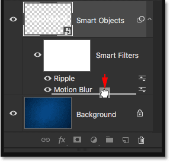
*Clicking and dragging Ripple below Motion Blur.*

I'll go ahead and release my mouse button, at which point Photoshop drops the Ripple filter below Motion Blur:

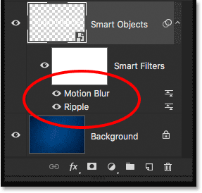
*The order of the Smart Filters has changed.*

Since  Ripple  is now at the bottom of the list, it's being applied to the type first, and then  Motion Blur  is applied after it. If I zoom in again on the effect, we see that the blur streaks no longer have the ripple effect applied. Instead, we're seeing the opposite; the motion blur is now being applied to the ripples:

*This time, Ripple is applied first, and then Motion Blur on top of it.*

I think I liked it better before, so I'll undo my change and return the Motion Blur filter to the bottom of the list by going up to the **Edit** menu and choosing **Undo Move Filter Effect**, or by pressing **Ctrl+Z** (Win) / **Command+Z** (Mac) on my keyboard:

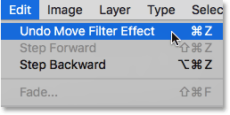
*Going to Edit > Undo Move Filter Effect.*

### Adding A Third Filter

I'll add one more filter to my type, just for fun. I'll go up the **Filter** menu, then I'll choose **Stylize**, and then **Wind**:

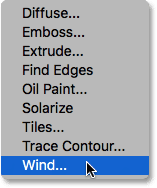
*Going to Filter > Stylize > Wind.*

When the Wind dialog box appears, I'll leave the options set to their defaults, with **Method** set to **Wind** and **Direction** set to **From the Right**:

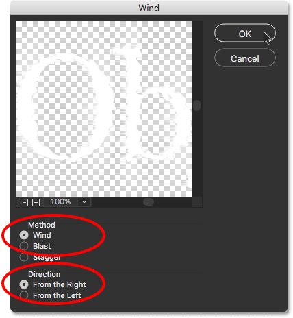
*The Wind filter's dialog box.*

I'll click OK to close out of the dialog box, and here's the result, with the letters now looking like they're being blown toward the left by the wind. Again, if you look closely, you'll notice that the motion blur streaks also show the same wind effect as the type, and that's because the Motion Blur filter is being applied first, then the Ripple filter, and then the Wind filter on top of it:

*The effect after adding the Wind filter into the mix.*

Here in the Layers panel, we see that Wind has been added as a new Smart Filter above the Ripple and Motion Blur filters. At this point, I could drag them up or down to change their order, or double-click on a filter's name to edit its settings. I could turn a filter off temporarily by clicking its visibility icon, or I could change a filter's blend mode or opacity by double-clicking on its Blending Options icon. There's  so many possibilities with Smart Filters, but to keep us on track, I'll fight the urge to experiment and just leave everything the way it is:

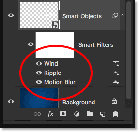
*The Layers panel showing all three Smart Filters being applied to the type.*

### Editing The Text

Even with three Smart Filters being applied to it, the text inside the Smart Object remains fully editable. The only issue that may cause a bit of confusion at first is that we can't simply grab the Type Tool, click on the text in the document and then edit it the way we normally would. That's because the text is sitting inside the Smart Object, so to get to the text, we first need to open the Smart Object.

To do that, **double-click** directly on the Smart Object's **thumbnail** in the Layers panel:

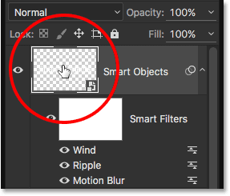
*Double-clicking on the Smart Object's thumbnail.*

This will open your text in its own separate Photoshop document:

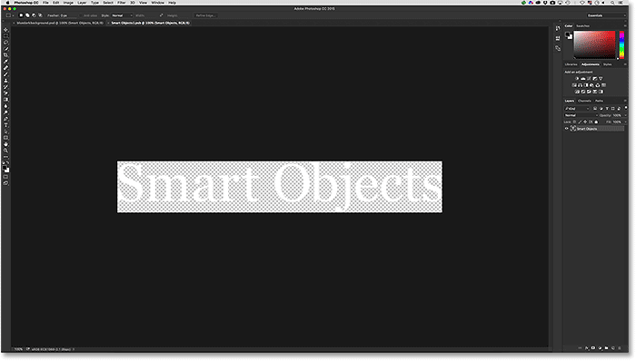
*The type appears in a document that's separate from the main document.*

If we look in the Layers panel, we see that the document contains nothing more than a single Type layer:

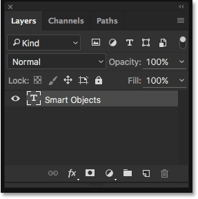
*The Layers panel showing the Type layer.*

At this point, we can edit the text the way we normally would. I'll grab the **Type Tool** from the Toolbar along the left of the screen:

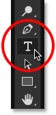
*Selecting the Type Tool.*

With the Type Tool in hand, I'll change my text from "Smart Objects" to "Smart Filters" by clicking and dragging over the word "Objects" to highlight it:

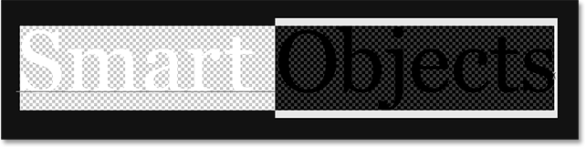
*Highlighting part of the text.*

Then, I'll simply change it from "Objects" to "Filters":

*Editing the text.*

To save our changes, we need to save the document by going up to the **File** menu at the top of the screen and choosing **Save**:

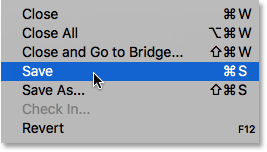
*Going to File > Save.*

Then, since we don't need to have this document open anymore, we can close it by going back up to the **File** menu and choosing **Close**:

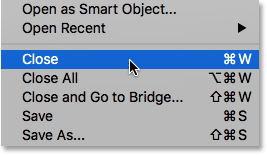
*Going to File > Close.*

This closes the Smart Object's document and returns us to our main document where we find our text, along with our Smart Filter effects, updated with the changes we made:

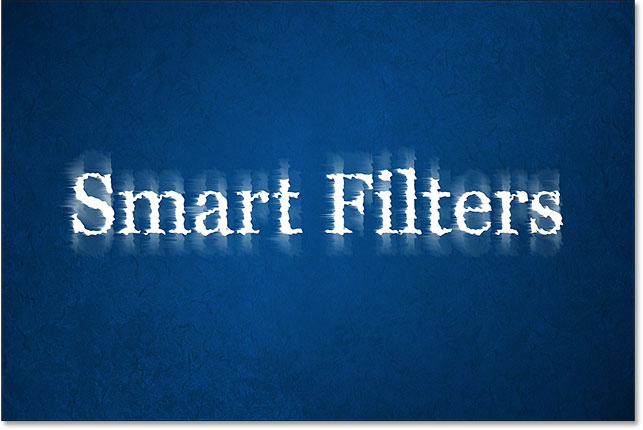
*The text remains fully editable even with multiple Smart Filters applied.*

### Isolating The Filter Effects With The Layer Mask

One last but important feature of Smart Filters in Photoshop is that they come with a built-in **layer mask**, which lets us isolate the filter effects to just a certain part of the text. If we look in the Layers panel, we can see the white-filled **layer mask thumbnail** directly above the list of Smart Filters. All filters in the list share the same mask.

To use the layer mask, we first need to click on its thumbnail to select it:

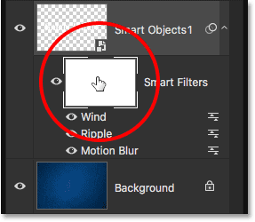
*Clicking the layer mask thumbnail.*

You can learn all about layer masks in our [Understanding Layer Masks In Photoshop](/basics/layers/layer-masks/) tutorial, but in short, the way the mask works is that areas filled with **white** on the mask are the areas where the effects of the Smart Filters are *visible* in the document. At the moment, as we can see in the thumbnail, the entire mask is filled with white, which is why we can see the filter effects across the entire text.

To *hide* the filter effects over a certain part of the text, we just need to fill that area of the mask with **black**. For example, let's say I want to hide the  effects from the word "Smart" and leave them visible only on the word "Filters". To quickly do that, I'll grab Photoshop's [Rectangular Marquee Tool](/basics/selections/rectangular-marquee-tool/) from the Toolbar:

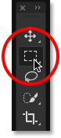
*Selecting the Rectangular Marquee Tool.*

With the Rectangular Marquee Tool in hand, I'll drag out a selection box around the word "Smart" and its filter effects:

*Dragging a selection around the area where I want to hide the Smart Filters.*

Then, with the layer mask selected, I'll fill the selection with black using Photoshop's Fill command. To get to it, I'll go up to the **Edit** menu and choose **Fill**:

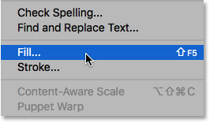
*Going to Edit > Fill.*

When the Fill dialog box appears, I'll set the **Contents** option at the top to **Black**, and I'll leave the other options set to their defaults:

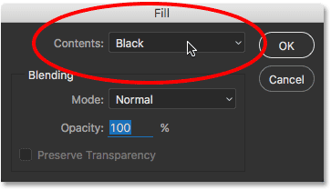
*Changing "Contents" to "Black".*

I'll click OK to close out of the dialog box, at which point Photoshop fills the selected area of the layer mask with black. To remove the selection outline, I'll go up to the **Select** menu and choose **Deselect**, or I could quickly press **Ctrl+D** (Win) / **Command+D** (Mac) on my keyboard. Either way works:

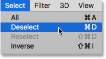
*Going to Select > Deselect.*

And now, after filling the selection with black, the filter effects no longer appear around the word "Smart", yet they're still visible around the word "Filters":

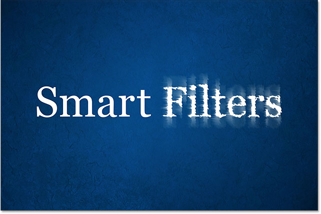
*The layer mask made it easy to hide the effects over part of the text.*

Let's take one last look in the Layers panel where  we can see the area of the layer mask that's now filled with black. Again, to learn more about layer masks, be sure to check out our [Understanding Layer Masks](/basics/layers/layer-masks/) tutorial:

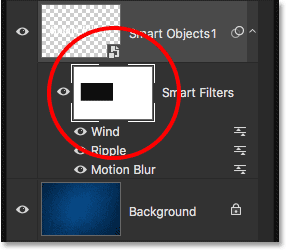
*The black area on the mask is where the filter effects are no longer visible in the document.*