# Photoshop Actions – Stepping Through An Action

> Source: [https://www.photoshopessentials.com/basics/photoshop-actions/step-through/](https://www.photoshopessentials.com/basics/photoshop-actions/step-through/)
> Downloaded and converted to Markdown.

We've covered a lot of information so far in our look at [Photoshop actions](/basics/photoshop-actions/). We've learned what an action is and that actions are stored in action sets. We've looked at the Actions palette and the palette menu. We've explored the [default actions](/basics/photoshop-actions/default-actions/) that Photoshop automatically loads for us, and we've seen how to load the [additional action sets](/basics/photoshop-actions/more-built-in-actions/) that install with Photoshop. We know that Photoshop can run through an entire action from beginning to end completely on its own, or it can pop open dialog boxes which give us the chance to change various command options and settings to better suit the image we're working on. And we've learned how to twirl open an action in the Actions palette so we can view the specific steps involved, right down to the details of each step.

A moment ago, we ran the Photo Corners action, which is found in the Frames action set, on an image and we ended up with a very basic photo corners effect. I wasn't too thrilled with the colors that the action used, though, so I'd like to edit the action and choose different colors. To do that, I'll first need to figure out which steps in the action are responsible for setting the colors it uses.

We've already learned how to view the individual steps, as well as the details of those steps, in the Actions palette, but an even better way of figuring out exactly what's going on with an action is to take the action one step at a time. And when I say "take" it one step at a time, I mean "play" it one step at a time! You simply start at the beginning of the action and play each step individually while keeping an eye on your image and on the Layers palette to see what just happened!

Unfortunately, Adobe didn't include an obvious way of stepping through an action like this. There is no "Play Single Step" button anywhere to be found. To play a single step in an action, hold down your *Ctrl* (Win) / *Command* (Mac) key on your keyboard and *double-click* on the step in the Actions palette. This will play the step you double-clicked on and advance you to the next step in the Actions palette. If you keep an eye on your image and on the Layers palette, you'll be able to see exactly what's happening. Let's work our way through the Photo Corners action one step at a time to see exactly how Photoshop creates the frame effect and to learn which steps we'll need to edit to change the colors it uses. This also gives us a chance to see what sort of things we can record as part of an action, although there's lots more we can do than what we'll find here.

Before I begin, I'm going to revert my image back to its original state by going up to the *File* menu at the top of the screen and choosing *Revert*:

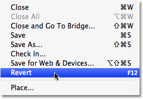

*Select the Revert command from the File menu to revert an image to its original or previously saved state.*

This returns my photo back to the way it looked before running the action:

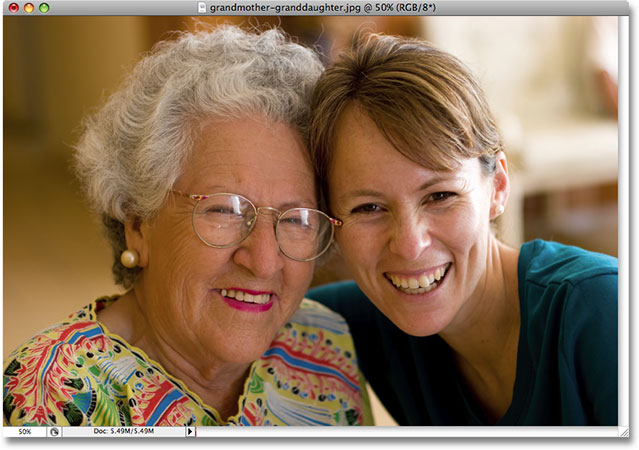

*The photo is now back to its original state.*

If I look in my Layers palette, I can see that I'm back to having only one layer, the Background layer, which contains my image:

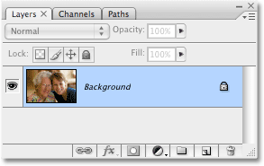

*The Layers palette showing the original image on the Background layer.*

#### Step 1: Make snapshot

Let's begin working our way through the Photo Corners action one step at a time so we can see exactly what Photoshop is doing. With the Photo Corners action twirled open in the Actions palette, I'll hold down my *Ctrl* (Win) / *Command* (Mac) key on the keyboard and *double-click* on the very first step, *Make snapshot*:

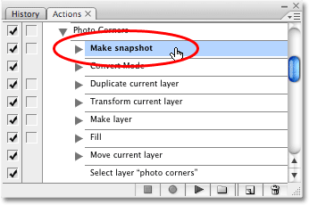

*Hold down Ctrl (Win) / Command (Mac) and double-click on the first step in the action to play it.*

The "Make snapshot" step takes a snapshot of the current state of the image and places it in the **History palette**. This way, if we want to revert back to the way the image looked immediately before running the action, we can simply switch over to the History palette and click on the snapshot. After playing this step, switch to your History palette for a moment. You'll see the snapshot, named "Snapshot 1", at the top of the palette:

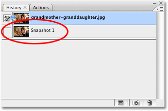

*A snapshot of the current state of the image now appears in the History palette.*

#### Step 2: Convert Mode

Switch back to your Actions palette when you're done. Let's move on to the second step in the action, Convert Mode. I can't really tell just from the name of this step what it's going to do, so I'll twirl it open to view the details:

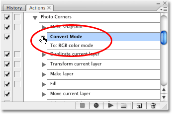

*Viewing the details of the second step in the Photo Corners action.*

With the details of the step visible, I can see that all this second step does is converts the image to the **RGB color** mode. Well, my image is already in the RGB color mode, and yours probably is, too, so this second step isn't really necessary. I'm going to skip it for now, but later, when we go to actually edit the action, we'll learn how to turn individual steps on and off.

#### Step 3: Duplicate current layer

The third step in the Photo Corners action is *Duplicate current layer*. I'll select the step, then twirl it open so we can view the details:

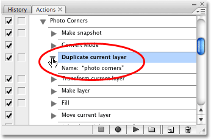

*The details of the "Duplicate current layer" step.*

It looks like this third step in the action is going to create a duplicate of the Background layer (since the Background layer is our only layer at the moment), and it's going to name the new layer "photo corners". Let's see what happens. I'll hold down *Ctrl* (Win) / *Command* (Mac) and *double-click* on the step to play it. If I look in my Layers palette after playing the step, I can see that I now have two layers. The new layer (the one on top) is a duplicate of the Background layer, and Photoshop named it "photo corners", exactly as we expected:

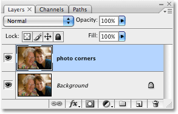

*The copy of the Background layer named "photo corners" now appears in the Layers palette.*

#### Step 4: Transform current layer

As we make our way through the individual steps of the Photo Corners action, we come to the fourth step, *Transform current layer*. I'll twirl open the step in the Actions palette and with the details now visible, it looks like this step is going to use Photoshop's Transform command to scale the image on the "photo corners" layer down to 95% of it's original size:

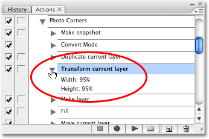

*Viewing the details of the fourth step in the Photo Corners action.*

I'll play the step by *Ctrl+double-clicking* (Win) / *Command+double-clicking* (Mac) on it, and while nothing appears to have happened in the Layers palette, I can see if I look at my document window that the image on the "photo corners" layer has in fact been made smaller, while the original image below it on the Background layer remains full size:

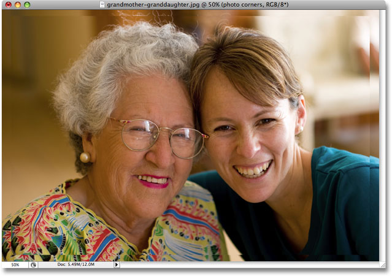

*The image on the "photo corners" layer has been scaled down to 95% its original size.*

So far, no sign of the step that controls the colors in the frame effect, but we're getting a good sense of how the action was put together. Let's carry on.

#### Step 5: Make layer

We're working our way through the Photo Corners action in Photoshop by playing each step individually from beginning to end, looking for the steps that control the colors the action uses so we can edit them, and we're getting a good idea of how actions work. The fifth step in the action is **Make layer**, and if I twirl it open to view the details, we can see that a new blank layer is going to be created and given the name "new background":

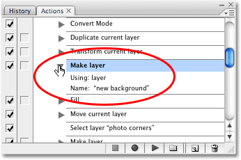

*The fifth step should create a new blank layer named "new background".*

I'll play the step by once again holding down *Ctrl* (Win) / *Command* (Mac) and *double-clicking* on the step in the Actions palette, and a quick look at the Layers palette shows us that we do in fact now have a new blank layer above the other two, and this new layer has been named "new background":

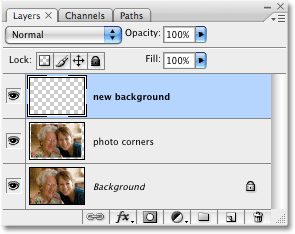

*A new blank layer named "new background" appears at the top of the layer stack.*

#### Step 6: Fill

Moving along through the Photo Corners action, we come to the sixth step, *Fill*. This one looks interesting. I know that Photoshop's Fill command is used to fill layers or selections with color, and if I twirl open the action to view the details, it looks like this step is going to fill our new layer with gray. I think we've found the first step that controls color in the action!

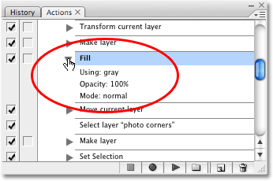

*The sixth step in the action appears to fill the new layer with gray.*

Let's play the step by holding down *Ctrl* (Win) / *Command* (Mac) and *double-clicking* on it to see what happens. Sure enough, the "new background" layer becomes filled with gray. Since the "new background" layer is currently above the other two layers in the Layers palette, it blocks the two layers below it from view and our entire document window appears as solid gray:

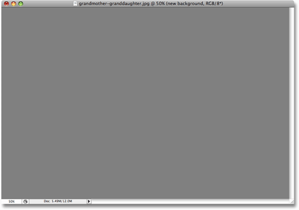

*The "new background" layer is now filled with solid gray.*

We now know that this is the step we'll need to edit to change the color used for the background in the Photo Corners frame effect! Let's keep going.

#### Step 7: Move current layer

The seventh step in our action is **Move current layer**. "Current layer" refers to the currently selected layer, and since our currently selected layer is the "new background" layer that was filled with gray a moment ago, the name of this step makes it fairly obvious that the "new background" layer is about to be moved to a new location in the Layers palette. If we twirl open the step to view the details, we can see that it will be moved into the "layer 1" position, which will place it directly above the Background layer:

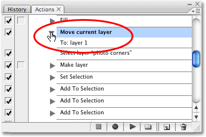

*The seventh step in the action looks like it will move the "new background" layer directly above the Background layer in the Layers palette.*

I'll play the step by *Ctrl+double-clicking* (Win) / *Command+double-clicking* (Mac) on it, and we can see now in the Layers palette that the "new background" layer has swapped positions with the "photo corners" layer, making the "photo corners" layer now the top-most layer in the layer stack:

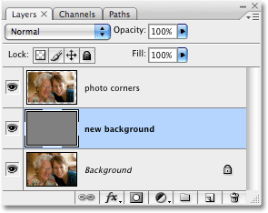

*The "new background" and "photo corners" layers have now swapped positions in the Layers palette.*

Since the "photo corners" layer is now at the top of the layer stack, the image on the layer is now visible in front of the gray background in the document window:

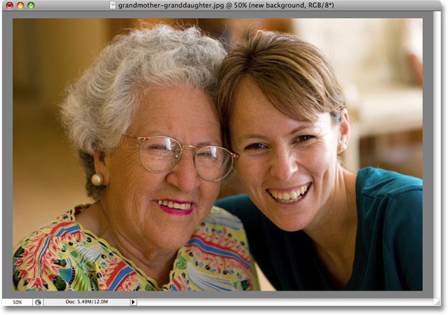

*The image on the "photo corners" layer is now visible in front of the gray background.*

#### Step 8: Select layer "photo corners"

The Photo Corners frame effect is beginning to take shape. Step 8 in the action is a simple one, **Select layer "photo corners"**. This step is so straightforward, in fact, that there are no extra details for us to view which is why the step doesn't have a twirly triangle beside its name. This step should simply select the "photo corners" layer in the Layers palette:

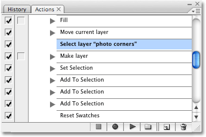

*Step 8 in the Photo Corners action is a simple one.*

I'll hold down *Ctrl* (Win) / *Command* (Mac) and *double-click* on it to play it, and we see in the Layers palette that the "photo corners" layer is now selected:

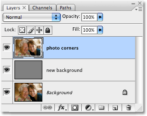

*The "photo corners" layer is now selected after playing the step.*

#### Step 9: Make layer

The ninth step in the action is **Make layer**. Since the fifth step in our Photo Corners action was also named "Make layer", we know from what we saw in Step 5 that this step is going to create a new blank layer for us. By default, new layers are added directly above the currently selected layer, and since the "photo corners" layer was selected in the previous step, this new layer will be placed directly above it, which will position it at the very top of the layer stack. If we twirl open the step to view the details, we can see that the new layer will be named "4 corners":

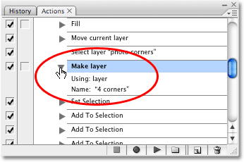

*The ninth step in the action should create a new blank layer named "4 corners" directly above the "photo corners" layer.*

I'll *Ctrl+double-click* (Win) / *Command+double-click* (Mac) on the step to play it, and the Layers palette now shows us a new blank layer named "4 corners" directly above the "photo corners" layer:

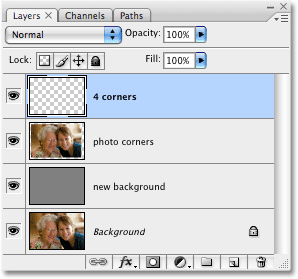

*A new blank layer named "4 corners" appears above the "photo corners" layer in the Layers palette.*

#### Steps 10 - 13: Creating The Selections For The Photo Corners

As we make our way through the Photo Corners action in the Actions palette, we come to step 10, *Set Selection*. This step, along with the three *Add To Selection* steps that follow it, creates a triangular selection in one of the four corners of the photo. To save us a little time, and as an opportunity to show you a little trick for playing several actions at once, I'm going to select the first step, "Set Selection", then I'll hold down my *Shift* key and click on the third "Add To Selection" step (step 13), which will select all four steps at once in the Actions palette:

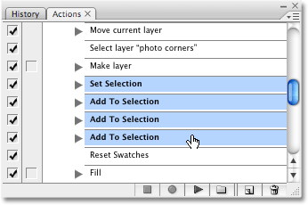

*To select multiple steps in a row, click on the top one, then Shift-click on the bottom one.*

To tell Photoshop to play all four steps one after the other once you have them selected, simply click on the *Play* icon at the bottom of the Actions palette:

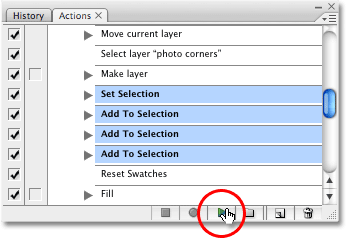

*Click the Play icon to have Photoshop play all four steps.*

If we look at the image in the document window now, we can see a triangular-shaped selection in each of the four corners of the photo:

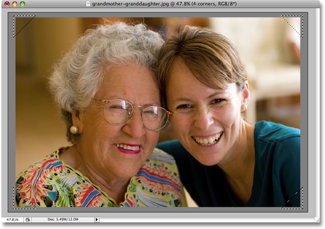

*A triangular selection now appears in each corner of the photo.*

The only minor downside to playing several steps at once like this is that Photoshop doesn't automatically advance you to the next step in the action when it's done, so you'll need to click on the next step yourself to select it. Not a huge deal, but worth mentioning anyway.

#### Step 14: Reset Swatches

Arriving at step 14, **Reset Swatches**, we find another step that seems to have something to do with color in the action. This step, which again is so straightforward that no additional details are needed in the Actions palette, resets the **Foreground and Background colors** to their defaults, with *black* becoming the foreground color and *white* as the background color:

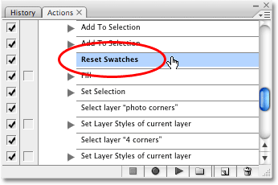

*The "Reset Swatches" step will reset the Foreground and Background colors to their defaults.*

I'll hold down *Ctrl* (Win) / *Command* (Mac) and *double-click* on the step to play it, and we can see if we look at the Foreground and Background color swatches in the *Tools palette* that the foreground color (the left swatch) is now set to black while the background color (the right swatch) is set to white:

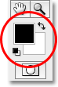

*The Foreground and Background color swatches in the Tools palette.*

Your foreground and background colors may have already been set to the default colors before playing this step. In fact, we may not even need this step, so it may end up being one we can delete, or at least turn off, when we go to edit the action later.

#### Step 15: Fill

Step 15 in the Photo Corners action brings us to another step named **Fill**. If you recall, the sixth step in the action was also a Fill step, and it filled the "new background" layer with gray. Let's twirl open this step to see the details:

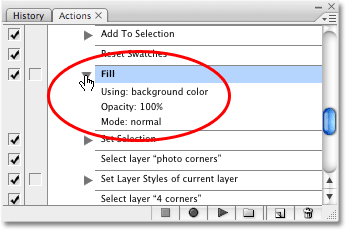

*Viewing the details of step 16 in the Photo Corners action.*

It looks like this time, we'll be filling those four triangular selections we just made with our current background color, which explains why we reset the foreground and background colors in the previous step. Since our background color is now set to white, the four selections will be filled with white. I'll play the step (I think we all know how to play the step at this point so I won't bother explaining how), and if we look at the image in the document window, we can see that the four selections are now filled with white, giving us the photo corners:

*The selections in the four corners of the image are now filled with white.*

Okay! We've found the steps that control the colors used in the action! We now know which steps to edit. Two of the steps are named "Fill", with the first one controlling the color of the background and the second setting the color for the photo corners themselves. We also found a couple of steps that are probably not needed, with one converting our image to the RGB color mode and the other resetting our foreground and background colors. Let's quickly finish making our way through this action so we can see a few more examples of the kinds of things you can record with an action, and then we'll go about editing our own custom version!

#### Step 16: Set Selection

We're almost at the end of our step-by-step journey through the Photo Corners action in Photoshop. Set 16 is *Set Selection*, and if we twirl it open to view the details, we see that it tells Photoshop to set the selection to "none":

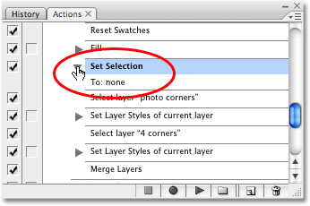

*To select multiple steps in a row, click on the top one, then Shift-click on the bottom one.*

What the heck does that mean, setting a selection to none? Well, as you may have noticed, the language Photoshop uses to describe the details of steps in the Actions palette isn't always so easy to follow. Setting a selection to "none" is Photoshop's way of telling us that it's going to deselect the selection. You'll find yourself getting better and better at translating Photoshop-speak as you gain more experience with using actions. I'll play the step, and when I do, the four selection outlines disappear in the document window:

*The four selection outlines have now disappeared.*

#### Step 17: Select layer "photo corners"

Moving along, we come to step 17, *Select layer "photo corners"*, which is another one of those straightforward steps that doesn't require any additional details. It will simply select the "photo corners" layer in the Layers palette:

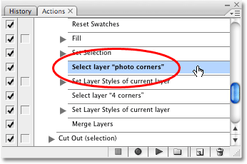

*Step 17 will make the "photo corners" layer active.*

I'll play the step, and we can see in the Layers palette that the "photo corners" layer is now highlighted in blue, telling us that it's selected:

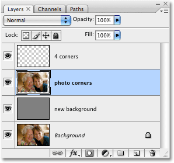

*The "photo corners" layer is now selected in the Layers palette.*

#### Step 18: Set Layer Styles of current layer

With only a few steps remaining in the action, we come to step 18, *Set Layer Styles of current layer*. As you can probably tell from the name of the step, this one adds a layer style, or styles, to the currently selected layer. Layer styles can easily be recorded as part of actions. In this case, if we twirl open the step to view the details, we can see that we're about to add a *drop shadow* to the image on the "photo corners" layer. The settings that will be used with the drop shadow are also included for us, with a **Distance** of **2 pixels** and a **Size** of **4 pixels**:

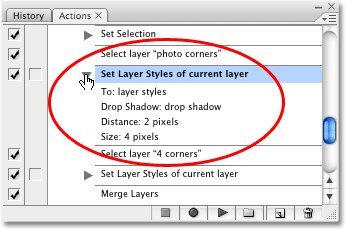

*Layer Styles are one of the many things that can be recorded as part of an action.*

After playing the step, we can see a slight drop shadow effect added to the image on the "photo corners" layer, although it's a bit hard to see in the screenshot since it's such a subtle effect:

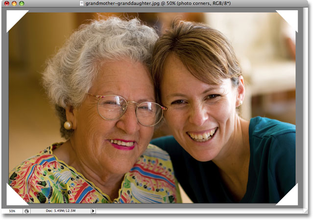

*A subtle drop shadow has been added to the image on the "photo corners" layer.*

#### Step 19: Select layer "4 corners"

Only three more steps to go. Step 19 is **Select layer "4 corners"**, another simple step with no additional details needed:

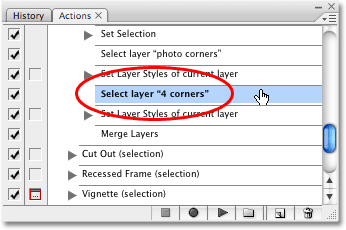

*Step 19 will select the "4 corners" layer in the Layers palette.*

This step will select the "4 corners" layer in the Layers palette, and when I play it, we can see that the "4 corners" layer is now selected:

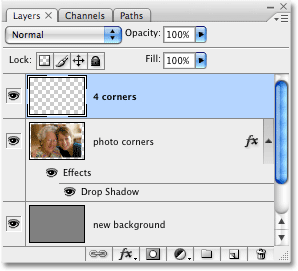

*The Layers palette showing the "4 corners" layer now selected.*

#### Step 20: Set Layer Styles of current layer

With just two steps left to go, the second last step in the Photo Corners action looks very similar to step 18 which we looked at a moment ago. It's also named **Set Layer Styles of current layer**, which again tells us that our currently selected layer (the "4 corners" layer) is about to have one or more layer styles applied to it. This time, it will be a *Bevel and Emboss* style, with the *Highlight Opacity* option set to *100%*, *Style* set to *inner bevel*, and *Depth* set to *2 pixels*:

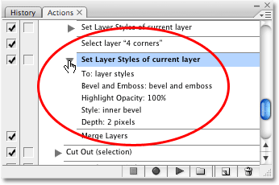

*A Bevel and Emboss layer style will be applied to the "4 corners" layer.*

I'll play the action, and if we look at the image in the document window, we can see that the four white photo corners, which are sitting on the "4 corners" layer, now have a subtle inner bevel effect applied to them, giving the effect a bit of depth:

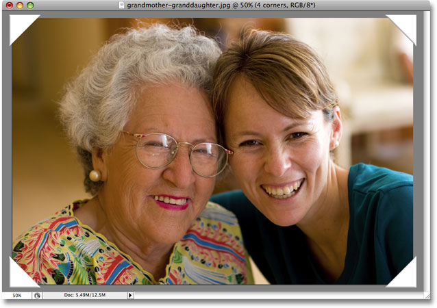

*The four photo corners now have an inner bevel effect applied to them.*

#### Step 21: Merge Layers

We've arrived at the final step in the action. Step 21 is **Merge Layers**, another step which needs no further details. It will simply merge the "4 corners" layer, which is our currently selected layer, with the "photo corners" layer directly below it:

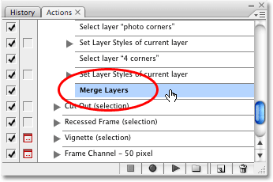

*The final step in the Photo Corners action is "Merge Layers".*

I'll play the step to complete the action, and we can see that the "4 corners" layer has disappeared from the Layers palette now that it's been merged with the "photo corners" layer, which is now the top-most layer in the layer stack:

*The "4 corners" layer has now been merged with the "photo corners" layer in the Layers palette.*