# Sync Photoshop’s Color Settings With All Creative Cloud Apps

> Source: [https://www.photoshopessentials.com/basics/sync-photoshops-color-settings-creative-cloud-apps/](https://www.photoshopessentials.com/basics/sync-photoshops-color-settings-creative-cloud-apps/)
> Downloaded and converted to Markdown.

Using Photoshop as part of the larger Creative Cloud or Creative Suite? Learn how to synchronize Photoshop’s color settings with your other Adobe apps, like Illustrator and InDesign, to keep the colors in your images accurate and consistent.

In the previous tutorial in this Getting Started series, we looked at Photoshop's [Color Settings](/basics/color-settings/ "Learn more about the Color Settings in Photoshop"). We learned about **color spaces** and how they determine the range of colors we have to work with. And we learned that by default, Photoshop sets its working color space to **sRGB**. We explored the reasons why Adobe chose sRGB as the default color space, and why sRGB is not the best choice for editing images because of its relatively small color gamut. A better choice is **Adobe RGB** with its greatly expanded range of colors. We learned how to change Photoshop's working space from sRGB to Adobe RGB. And finally, we saved our custom settings as a new **preset** so we can quickly choose them again when needed.

If Photoshop is the only app you use in the Adobe Creative Cloud or Creative Suite, then changing Photoshop's color settings is all you need to do. But if you use other Adobe apps as well, like Illustrator and InDesign, then maintaining accurate colors between apps becomes very important. As we'll learn in this tutorial, Adobe made it easy to synchronize Photoshop's color settings with the entire Creative Cloud or Creative Suite. But you won't find the option to do so anywhere in Photoshop. Instead, we synchronize our color settings using [Adobe Bridge](/basics/what-is-adobe-bridge/ "Learn more about Adobe Bridge").

This is lesson 6 of 8 in [Chapter 1 - Getting Started with Photoshop](/basics/getting-started-photoshop/ "Learn more").

Let's get started!

### Before we begin...

If you're a Creative Cloud subscriber, you'll want to make sure that you've [downloaded and installed Adobe Bridge CC](/basics/install-adobe-bridge-cc/ "How to install Adobe Bridge CC") before you continue. In Photoshop CS6 and earlier, Adobe Bridge installs automatically with Photoshop so there's no need to install Bridge separately. Also, if you have not done so already, be sure to read through the previous [Essential Photoshop Color Settings](/basics/color-settings/ "How to change Photoshop's color settings") tutorial. That's where we changed Photoshop's color settings and saved them as a new preset. This tutorial uses the preset we created.

## Viewing Your Custom Photoshop Color Settings

### Opening The Color Settings Dialog Box

Let's quickly recap the color settings we changed in the previous tutorial. To access Photoshop's color settings, go up to the **Edit** menu at the the top of the screen and choose **Color Settings**:

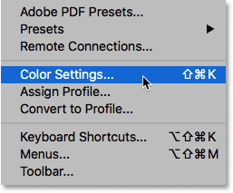
*Going to Edit > Color Settings.*

### Choosing Your Custom Preset

The Color Settings dialog box will open. If you followed along with the previous tutorial, your **Settings** option at the top should already be set to your custom preset. In my case, I named my preset "My Color Settings":

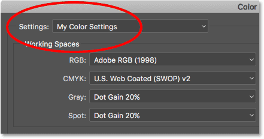
*Your custom color settings preset should already be selected.*

If, for some reason, your custom preset is not already selected, click on the name of the current preset. Then choose your custom preset from the list:

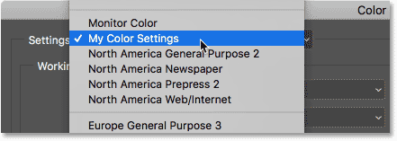
*Selecting "My Color Settings" from the list of presets.*

#### The RGB Working Space

With the custom preset active, we see that our **RGB working space** has been changed from sRGB to **Adobe RGB**:

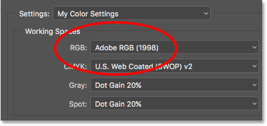
*Our custom preset uses Adobe RGB as the RGB working space.*

#### The Color Management Policies

And in the **Color Management Policies** section, we've made sure that the **RGB** option (along with CMYK and Gray) is set to **Preserve Embedded Profiles**. Also, the **Profile Mismatches** and **Missing Profiles** checkboxes are all unchecked. We learned about these options in the [previous tutorial](/basics/color-settings/ "Learn about the Color Management Policies options in Photoshop"):

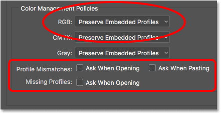
*The Color Management Policies options.*

Notice that the Color Settings dialog box is telling us that, at the moment, our custom settings only apply to Photoshop. They have not yet been synchronized with our other Creative Cloud or Creative Suite apps:

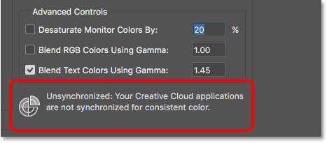
*The custom setting has not yet been synchronized with the other apps.*

### Closing The Color Settings Dialog Box

To close Photoshop's Color Settings dialog box, click **OK**:

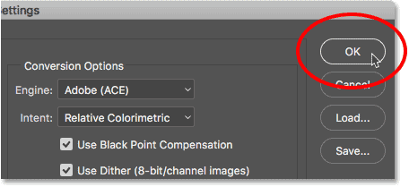
*Clicking OK to close the Color Settings dialog box.*

## How To Sync Your Color Settings

### Step 1: Open Adobe Bridge

Let's synch our custom Photoshop color settings with the rest of the Creative Cloud or Creative Suite. To do that, we'll need [Adobe Bridge](/basics/what-is-adobe-bridge/ "Learn more about Adobe Bridge"). To open Adobe Bridge from within Photoshop, go up to the **File** menu at the top of the screen and choose **Browse in Bridge**:

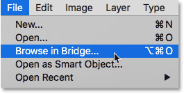
*In Photoshop, go to File > Browse in Bridge.*

### Step 2: Open The Color Settings Dialog Box

Then in Bridge CC, go up to the **Edit** menu and choose **Color Settings**. In Bridge CS6, go up to the **Edit** menu and choose **Creative Suite Color Settings**. This opens the Color Settings dialog box:

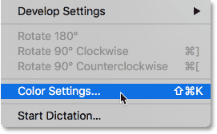
*In Bridge, go to Edit > Color Settings (CC) or Creative Suite Color Settings (CS6).*

### Step 3: Choose Your Custom Color Settings Preset

Notice that the Color Settings dialog box in Bridge looks different from the one we saw back in Photoshop. Rather than choosing individual color settings, here we choose a color settings **preset**. The preset will then be synchronized across every app in the Creative Cloud or Creative Suite. By default, the **North America General Purpose 2** preset is selected. This is the same preset Photoshop was using before we changed it. At the top of the dialog box, we see another message telling us that our color settings are not yet synchronized:

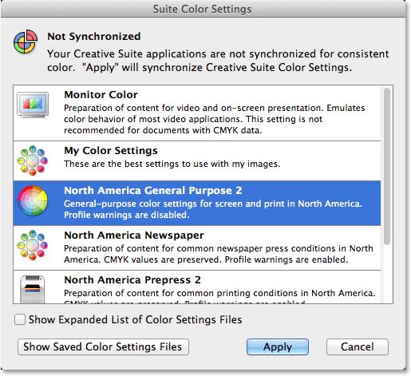
*The Color Settings dialog box in Adobe Bridge.*

Choose your custom preset (the one you created in Photoshop) from the list. I'll choose the "My Color Settings" preset. Notice that the description we added for the preset back in Photoshop appears below the preset's name:

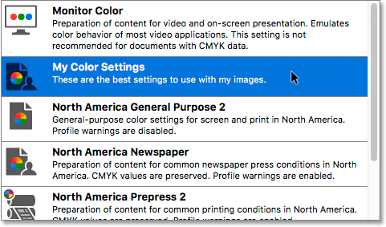
*Selecting my custom "My Color Settings" preset.*

### Step 4: Click "Apply"

To sync your preset across every app in the Creative Cloud or Creative Suite, click **Apply** at the bottom of the dialog box:

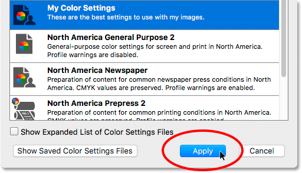
*Clicking "Apply" to sync the color settings.*

Bridge closes the Color Settings dialog box after you click the "Apply" button. To see what has actually happened, let's quickly re-open it. Go up to the **Edit** menu and choose **Color Settings** (CC) or **Creative Suite Color Settings** (CS6). This time, the Color Settings dialog box opens with our custom preset already selected. And, the message at the top of the dialog box now tells us that we've successfully synced the preset will every app in the Creative Cloud / Creative Suite:

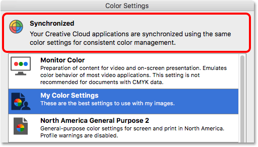
*Every app in the Creative Cloud / Creative Suite is now using your custom color settings.*