# Working With Tabbed Documents And Floating Windows In Photoshop

> Source: [https://www.photoshopessentials.com/basics/tabbed-and-floating-documents-in-photoshop/](https://www.photoshopessentials.com/basics/tabbed-and-floating-documents-in-photoshop/)
> Downloaded and converted to Markdown.

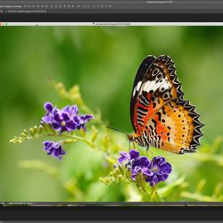

Photoshop gives us two main ways to view our images on the screen as we're working. We can view them as **tabbed documents** or as **floating document windows**. In this tutorial, we'll learn the difference between tabbed and floating document windows in Photoshop. We'll also learn how to switch between tabbed and floating documents. And we'll learn how to set up Photoshop's Preferences to automatically open future documents in whichever style you like best. I'll be using Photoshop CC but this tutorial is fully compatible with Photoshop CS6.

This is lesson 6 of 10 in our [Complete Guide to Learning the Photoshop Interface](/basics/learning-the-photoshop-interface/).

Let's get started!

## Opening Images Into Photoshop

Before we look at tabbed and floating documents, let's first [open some images into Photoshop](/basics/opening-images-photoshop/). Here I've used [Adobe Bridge](/basics/what-is-adobe-bridge/) to navigate to a folder containing three photos. I want to open all three of them at once into Photoshop. To do that, I'll click on the image on the left to select it. Then, I'll press and hold my **Shift** key and I'll click on the image on the right. This selects all three images at once, including the one in the middle. Then, to open all three into Photoshop, I'll double-click on any one of the thumbnails:

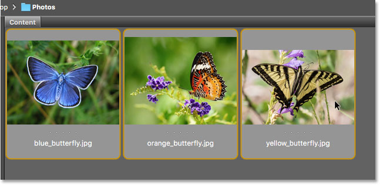
*Selecting three images in Adobe Bridge.*

## Tabbed Documents

By default, Photoshop opens our images as tabbed documents. We'll look at what that means in a moment. But at first glance, something doesn't seem right. I've opened three photos, but where are they? Only one of the three is displayed on the screen ([swallowtail butterfly photo](//prf.hn/l/pm0LVxW) from Adobe Stock):

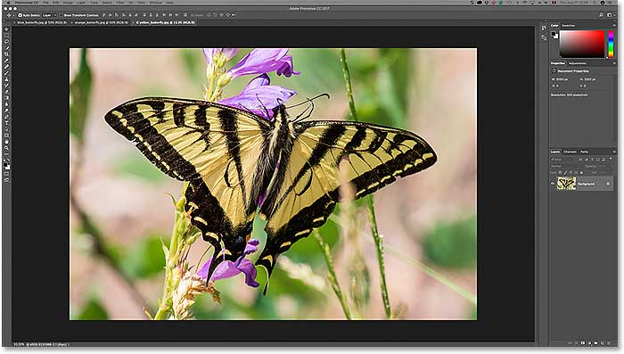
*After opening three images in Photoshop, only one is visible.*

### The Tabs

It may not look like it, but the other two images are open as well. We just can't see them at the moment. That's because Photoshop opened the images as a series of tabbed documents. If we look along the top of the photo, we see a row of **tabs**. Each tab represents one of the open images. The name of each photo appears in its tab. The tab that's highlighted is the one that's currently active, meaning it's the one we're seeing on the screen. The other tabs are hiding behind it and not currently visible:

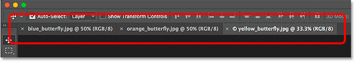
*The row of tabs along the top. Each image gets its own tab. The highlighted tab is currently active.*

### Switching Between Tabbed Documents

To switch between tabbed documents, simply click on the tabs. At the moment, my third image (the tab on the right) is active. I'll click on the tab in the middle to select it:

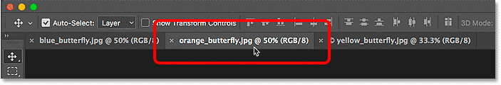
*Choosing a different photo by clicking on its tab.*

And now we see a different image on the screen. By default, we can only view one image at a time. So the image that was visible a moment ago is now hiding in the background ([butterfly on flower photo](https://prf.hn/l/9mo9V9D) from Adobe Stock):

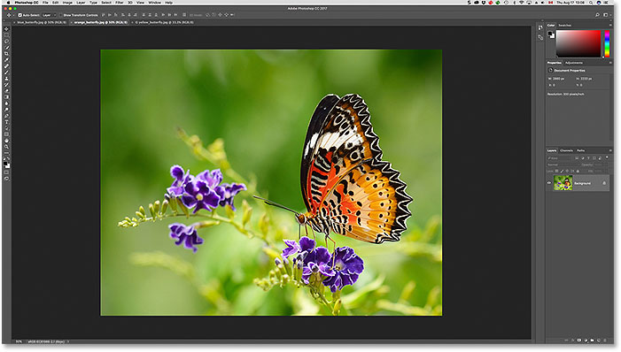
*The second of three open images is now visible after clicking on its tab.*

I'll click on the tab on the left to select it and make it active:

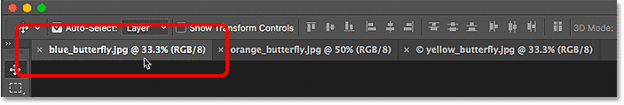
*Clicking on the first tab in the row.*

And now we see the other image I've opened ([blue butterfly photo](https://prf.hn/l/Gl3BN5D) from Adobe Stock):

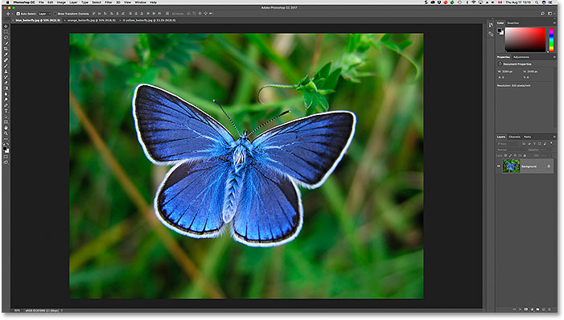
*The third of the three photos is now visible after selecting its tab.*

### Switching Between Tabbed Documents From The Keyboard

Along with clicking the tabs, we can also switch between tabbed documents from the keyboard. On a Windows PC, press **Ctrl+Tab** to move left to right from one tab to another. On a Mac, press **Control+Tab**. To move between tabs in the opposite direction (from right to left), press **Shift+Ctrl+Tab** (Win) / **Shift+Control+Tab** (Mac).

### Changing The Order Of The Tabs

To change the order of tabbed documents, click and hold on a tab and drag it to the left or right of other tabs. Release your mouse button to drop the tab into place. Make sure, though, that you drag straight across horizontally. If you drag diagonally, you may accidentally create a floating document window. We'll look at floating windows next:

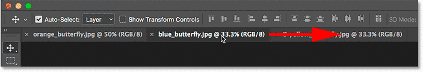
*Click and drag tabs left or right to change the order of the documents.*

## Floating Document Windows

The other way to view your open images in Photoshop is by displaying them as **floating document windows**. Let's say you have multiple images open as tabs, as I do here. To turn one of the tabs into a floating window, click on the tab and, with your mouse button held down, drag the tab down and away from the other tabs:

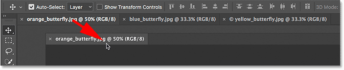
*Clicking and dragging one of the tabs away from the others.*

When you release your mouse button, the image appears in a floating window in front of the other tabbed documents. You can move floating windows around on the screen by clicking in the gray tab area along the top of the window and, with your mouse button held down, dragging it around with your mouse:

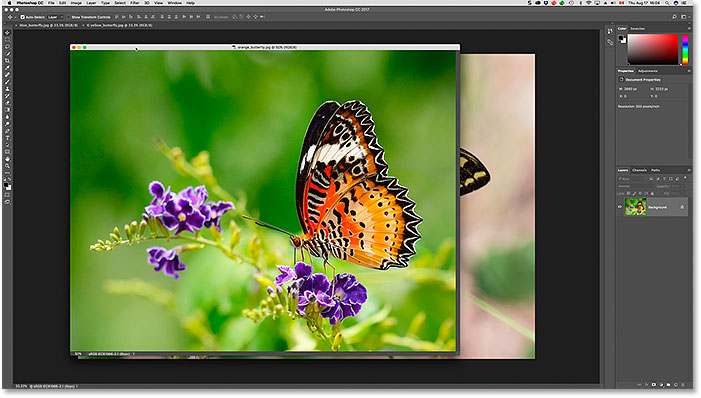
*The image now appears as a floating document.*

### Displaying All Open Images As Floating Windows

If you want to switch *all* of your tabbed documents into floating windows, go up to the **Window** menu in the Menu Bar along the top of the screen, choose **Arrange**, and then choose **Float All in Windows**:

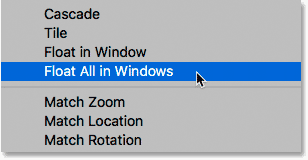
*Going to Window > Arrange > Float All in Windows.*

And now all three of my images appear in floating windows, with the currently active window displayed in front of the others. Again, we can move the windows around on the screen to reposition them by clicking and dragging the tab area along the top of each window. To make a different window active and bring it to the front, just click on it:

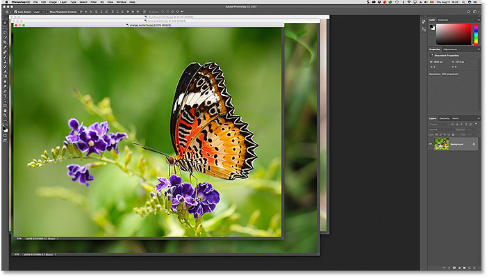
*All three images now appear in floating windows.*

### Viewing A List Of Open Documents

One of the main advantages to viewing our images as floating documents is that we can see more than one image at a time. But that can also cause problems. Too many floating windows open at once can clutter up the screen. Also, some of the windows can completely block others from view. Fortunately, there's an easy way to select any image that's open in Photoshop, even if you can't see it.

Go up to the **Window** menu at the top of the screen. Then, look down at the very bottom of the menu. You'll see a handy list of every image that's open. The currently-active image has a checkmark beside it. Click on any image in the list to select it, which will make it active and bring it to the foreground:

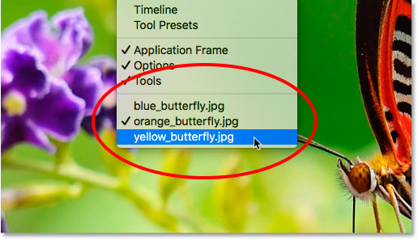
*Photoshop provides a list of all open documents at the bottom of the Window menu.*

### Switching Back To Tabbed Documents

To switch from floating windows back to tabbed documents, go up to the **Window** menu, choose **Arrange**, and then choose **Consolidate All to Tabs**:

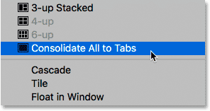
*Going to Window > Arrange > Consolidate All to Tabs.*

And now my images once again appear as tabbed documents, with only one image visible at a time:

*All floating windows have reverted back to tabbed documents.*

## Setting Photoshop's Preferences

Once you decide which viewing style you like best (tabbed documents or floating windows), you can tell Photoshop to open all future images in that style using an option found in the Preferences. If you're using **Photoshop CC**, then on a Windows PC, go up to the **Edit** menu at the top of the screen, choose **Preferences**, and then choose **Workspace**. On a Mac, go up to the **Photoshop CC** menu, choose **Preferences**, then choose **Workspace**:

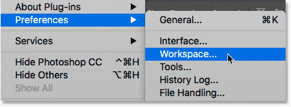
*In Photoshop, the document options are found in the Workspace preferences.*

If you're using **Photoshop CS6**, then on a Windows PC, go up to the **Edit** menu, choose **Preferences**, and then choose **Interface**. On a Mac, go up to the **Photoshop** menu, choose **Preferences**, then choose **Interface**:

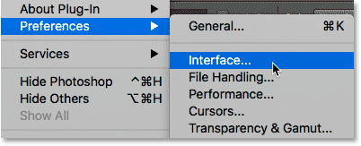
*In Photoshop CS6, the document options are in the Interface preferences.*

### Open Documents As Tabs

This opens the Photoshop Preferences dialog box set to either the Workspace (Photoshop CC) or Interface (Photoshop CS6) category. Look for the option that says **Open Documents as Tabs**. By default, this open is checked, which means that all of your images will open as tabbed documents. If you'd prefer to have them open as floating windows, uncheck this option:

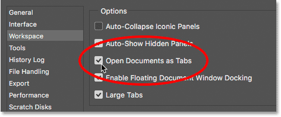
*The Open Documents as Tabs option.*

### Enable Floating Document Window Docking

There's a second option directly below it that's also important. **Enable Floating Document Window Docking** (say it five times fast) controls whether or not we can drag one floating window into another and nest them together, creating tabbed documents inside a floating window:

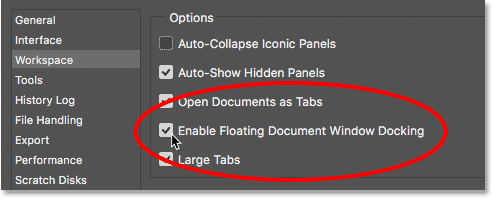
*The Enable Floating Document Window Docking option.*

To show you what I mean, here I have two of my images open side by side as floating windows. I'll click on the tab area along the top of the window on the left and begin dragging it *into* the window on the right. As I drag up towards the top of the window on the right, we see a **blue highlight box** appearing around its edges. This highlight box tells me that if I release my mouse button at this point, Photoshop will dock both of the images together inside the same floating window:

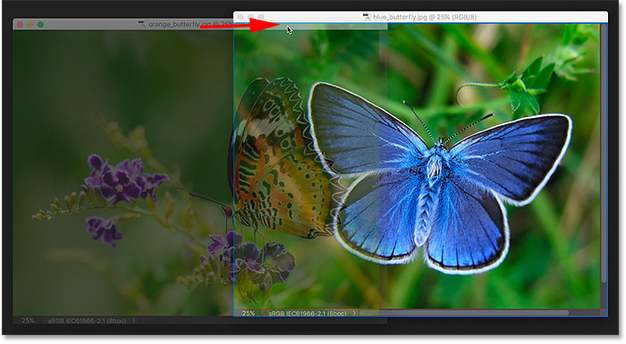
*Dragging an image from one floating window into another.*

I'll release my mouse button, and now both of my images are grouped together as tabbed documents inside a single floating window. This can be a handy feature for keeping related images organized on the screen. Just as with normal tabbed documents, I can easily switch between them by clicking on their tabs. To separate the images again and place them back into their own floating windows, all you need to do is click and drag one of the tabs away from and outside of the window, then release your mouse button:

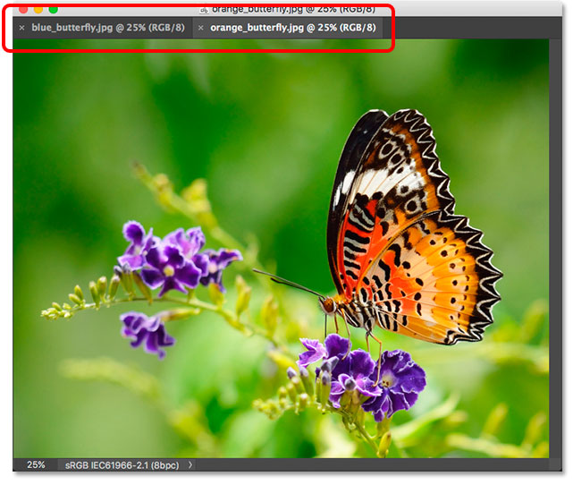
*The two images are now docked together as tabs inside a floating window.*

The Enable Floating Document Window Docking option is enabled (checked) by default. If you decide you don't like this feature, you can easily turn it off by unchecking the option in Photoshop's Preferences.

### Closing A Single Tabbed Document Or Floating Window

Finally, to close a single image that's open as a tabbed document, click on the small "x" icon on the edge of its tab. On a Windows PC, the "x" is on the right of the tab. On a Mac (which is what I'm using here), it's on the left:

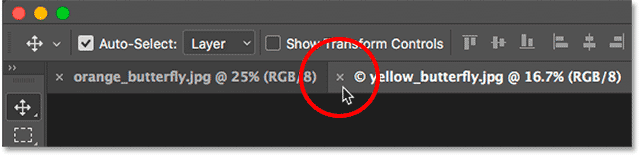
*Closing a single tabbed document.*

To close an image open in a floating window, on a Windows PC, click the "x" icon in the top right corner of the window. On a Mac, click the red "x" icon in the top left corner:

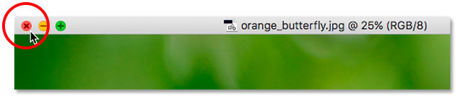
*Closing a single floating window.*

### Closing All Open Documents

To [close all open images](/basics/close-images-photoshop/) regardless of whether you're viewing them as tabs or floating windows, go up to the **File** menu at the top of the screen and choose **Close All**:

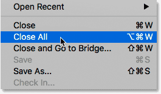
*Going to File > Close All.*