# Photoshop CS4 New Features – Tabbed Document Windows

> Source: [https://www.photoshopessentials.com/basics/photoshop-cs4/tabbed-document-windows/](https://www.photoshopessentials.com/basics/photoshop-cs4/tabbed-document-windows/)
> Downloaded and converted to Markdown.

Working with multiple images open at once in Photoshop has always felt a bit clumsy and frustrating, usually requiring us to click and drag several document windows around on the screen to get to the one we want. If you've been wishing for a better way to manage multiple documents in Photoshop, you'll definitely want to check out the new **tabbed document windows** feature in Photoshop CS4!

To see how great the new tabbed document windows feature is, I have several images saved inside a folder on my desktop that I want to open all at once inside Photoshop CS4. To do that, I'll go up to the **File** menu at the top of the screen and choose **Open**. Normally, I'd open the images using **Adobe Bridge**, but to keep things simple for this tutorial, I'll just open them from inside Photoshop:

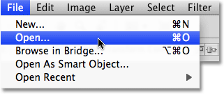
*Choose File > Open to open images from inside Photoshop.*

I'll navigate to the folder on my desktop that contains my photos, and to open them all at once, I'll click on the first one to select it, then I'll hold down my **Shift** key and click on the last one. This selects the first image, the last image and all images in between:

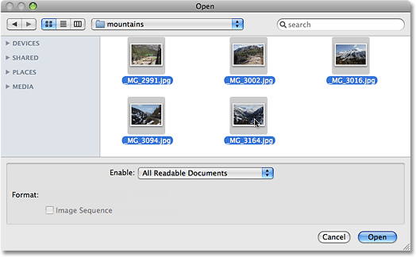
*Select the first image, then Shift-click the last image to select all images at once.*

With all images selected, I'll click **Open** and Photoshop opens each image for me. In versions prior to Photoshop CS4, each photo would open in its own independent document window, but with the default behavior of CS4, the images appear nested inside a single document. Only one image is visible at a time, but if we look above the image, we see a series of tabs, with each tab containing the name of one of the images. The tab of the image that's currently visible is highlighted:

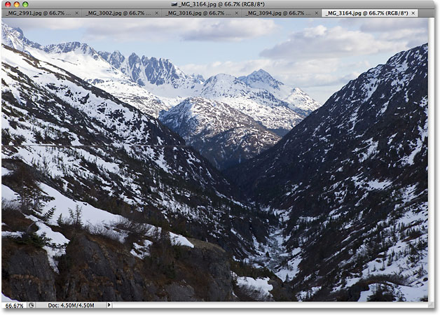
*The images appear nested in a single document, with each image given its own name tab at the top.*

### Switching Between Images

To switch to a different image, simply click on another image's tab, similar to how you switch between Photoshop's **[panels](http://www.photoshopessentials.com/basics/photoshop-cs4/interface/)** on the right of the screen by clicking on their tabs:

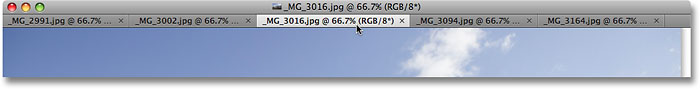
*Switch between images by clicking on the name tabs.*

Each tab contains the exact same information you'd expect to find at the top of a standard **[document window](http://www.photoshopessentials.com/basics/photoshop-cs4/interface/)** in Photoshop, including the name of the image, the current zoom level, the color mode, and the current bit depth.

### Re-Arranging The Order Of The Images

To move an image and change the order the documents are appearing in, just click on its tab and drag it left or right. Release your mouse button and the image will drop into its new location:

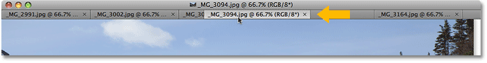
*Drag the tabs left or right to change the order of the images.*

### Cycle Forward And Backward Through The Images

You can cycle through the images using a couple of handy keyboard shortcuts. Press **Ctrl+~** (Win) / **Command+~** (Mac) to move forward through the tabs, or **Ctrl+Shift+~** (Win) / **Command+Shift+~** (Mac) to move backwards. The "~" is the tilde key which you'll find in the top left corner of the keyboard below the Esc key. In previous versions of Photoshop, you could cycle forward through multiple document windows using **Ctrl+Tab** (Win) / **Control+Tab** (Mac) or backwards with **Ctrl+Shift+Tab** (Win) / **Control+Shift+Tab** (Mac). These older keyboard shortcuts still work in Photoshop CS4, so its your choice which ones you want to use.

One potential bit of confusion to keep in mind is that Photoshop moves through the images in the order they were *opened*, not necessarily the order they appear in on screen. If you've re-arranged the order of the images in the tabs and then use the keyboard shortcuts to cycle through them, Photoshop may move through them in an order different from what you expected.

### The Fly-Out Image Selection Menu

If you have so many images open at once that Photoshop can't fit all of their name tabs on the screen, you'll see a **double-arrow icon** appear to the right of the tabs. Clicking on the icon brings up a fly-out menu allowing you to select any of the images from a list:

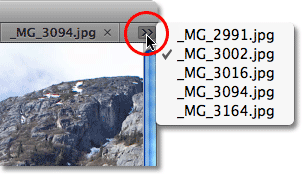
*Select images from the fly-out menu if not all name tabs can fit on the screen.*

### Floating An Image Into A Separate Document Window

To separate an image from the rest of the tabbed documents in Photoshop CS4 and have it float on screen in its own document window, there's a couple of ways to do it. The quickest way is to simply click on the image's tab and drag it down and away from the other tabs. When you release your mouse button, the image will appear in its own document window:

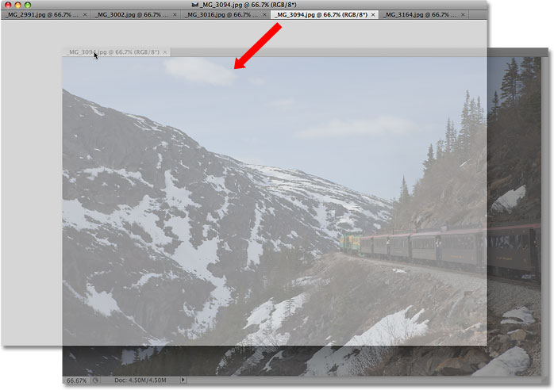
*Drag an image away from the other tabs to float it in its own document window.*

The other way is to click on the image's tab to select it, then go up to the **Window** menu at the top of the screen, choose **Arrange**, and then choose **Float in Window**:

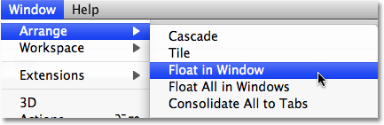
*You can also choose Window > Arrange > Float in Window.*

### Floating All Images Into Separate Document Windows

If you want to get rid of the tabs completely and have all open images floating in separate document windows, go up to the **Window** menu, choose **Arrange**, and then choose **Float All in Windows**:

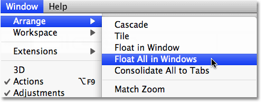
*Go to Window > Arrange > Float All in Window to move all open images into independent document windows.*

### Move An Image Back Into The Tabbed Group

To move a single image back into the group, click anywhere in the gray title bar at the top of its document window and drag it back into the tabs. When you see a blue highlight border appear, release your mouse button and the image will drop back in with the rest of the tabbed documents:

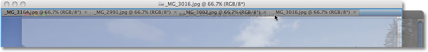
*Simply click and drag the image back into the tabs to return it to the group. Release your mouse button when the blue highlight border appears.*

### Group All Floating Document Windows Into Tabs

If you have more than one image floating in a separate document window and you want to quickly group them all back into tabbed documents, go up to the **Window** menu, choose **Arrange**, and then choose **Consolidate All to Tabs**. You can use this option to regroup a single floating document as well:

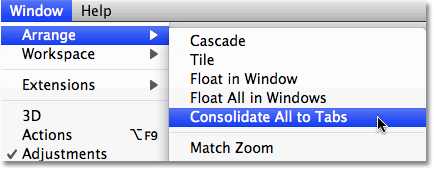
*Go to Window > Arrange > Consolidate All To Tabs to quickly regroup any floating document windows.*

### Close A Single Tabbed Window

To close a single image inside the tabbed group, click on the small **x** on the far right of the image's tab:

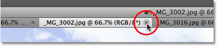
*Click the small "x" icon to close a single image.*

### Close All Tabbed Document Windows

To close all tabbed document windows at once, go up to the **File** menu in the Menu Bar and choose **Close All**:

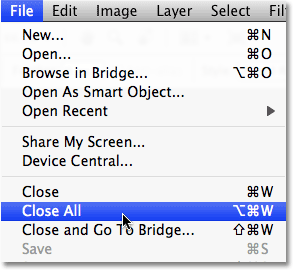
*Go to File > Close All to quickly close all tabbed document windows.*

### Disabling The Tabbed Document Windows Feature

If you prefer the old way of working in Photoshop with each image floating in its own document window, you can disable the new tabbed document windows feature from inside Photoshop CS4's Preferences. On a Mac, go up to the **Photoshop** menu, choose **Preferences**, and then choose **Interface**. On a Windows system, go up to the **Edit** menu, choose **Preferences**, and then choose **Interface**. This brings up the Preferences dialog box set to the Interface options. Here, you'll find a section called **Panels & Documents**. To disable the tabbed document windows feature, simply uncheck the bottom two options, **Open Documents as Tabs** and **Enable Floating Document Window Docking**:

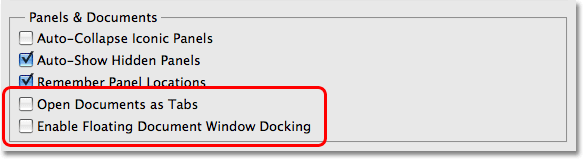
*Uncheck the "Open Documents as Tabs" and "Enable Floating Document Window Docking" options disable the tabbed document windows feature.*

Click OK when you're done to accept the changes and exit out of the dialog box. To enable the tabbed document windows feature at any time, simply return to the Preferences and select those two options again. To quickly bring up Photoshop's Preferences, press **Ctrl+K** (Win) / **Command+K** (Mac), then select **Interface** from the menu on the left of the dialog box.