# Combining Text With Shapes In Photoshop

> Source: [https://www.photoshopessentials.com/basics/text-shapes/](https://www.photoshopessentials.com/basics/text-shapes/)
> Downloaded and converted to Markdown.

In this **Photoshop Basics** tutorial, we'll learn how to create fun designs and interesting logos by **combining text with custom shapes**! First we'll learn how to convert the text itself into a shape. Then we'll learn how to add other shapes to it and even how to cut shapes out of letters! The design I'll be creating here is very simple, but you can use these same steps to design anything you can imagine, especially if you know how to [make your own custom shapes](/basics/custom-shapes/) in Photoshop! I'll be using Photoshop CS5 for this tutorial, but any recent version of Photoshop will work.

Here's what my final result will look like after converting the text into a shape, then easily combining the text with other shapes:

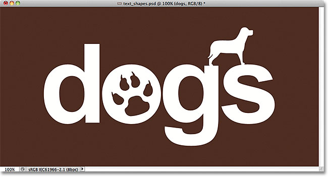
*The final result.*

Let's get started!

### Step 1: Convert The Text Into A Shape

Here's the document I'm starting with, a simple background with the word "dogs" added in front of it (sorry to all the cat lovers out there):

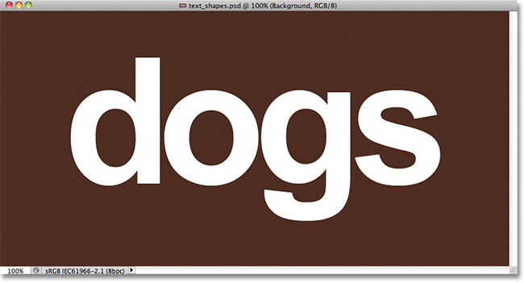
*Some text in front of a simple background.*

If we look in the Layers panel, we see that the document is made up of two layers - the Background layer on the bottom and a **Type layer** above it:

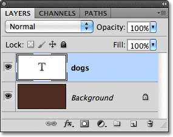
*The text appears on a Type layer, one of several different types of layers in Photoshop.*

Before we can combine our text with shapes, we first need to convert the text itself into a shape. Before you do, though, make sure you have everything spelled correctly because once the text has been converted into a shape, it will no longer be editable. Once you're sure everything looks right, go up to the **Layer** menu in the Menu Bar along the top of the screen, choose **Type**, then choose **Convert to Shape**:

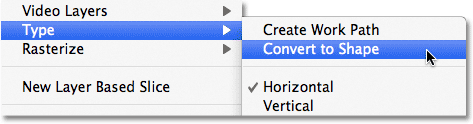
*Go to Layer > Type > Convert to Shape.*

The text will still look like text in the document, but in the Layers panel, we see that the Type layer has become a **Shape layer**. In other words, what we have now is a shape that just happens to *look* like text:

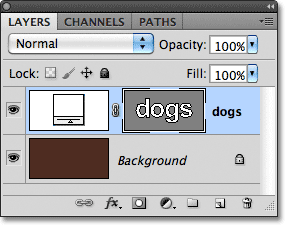
*The text is now a shape that looks like text. It's also no longer editable.*

### Step 2: Select The Direct Selection Tool

We're going to learn how to add other shapes to our text and how to subtract shapes from the text. Let's start by seeing how to subtract a shape, or in other words, how to cut a hole out of a letter with a shape! In a moment, I'm going to use one of Photoshop's **custom shapes** to replace the hole in the center of the letter "o" with something that looks more interesting.

Before I do that, I should remove the hole that's already there, which means I need to delete part of the shape. To do that, we need to select the part we want to delete using Photoshop's **Direct Selection Tool**. By default, it's hiding behind the **Path Selection Tool** in the Tools panel, so I'll click on the Path Selection Tool and keep my mouse button held down for a second or two until a fly-out menu appears, then I'll select the Direct Selection Tool from the list:

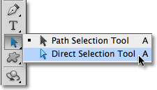
*Click and hold on the Path Selection Tool, then choose the Direct Selection Tool from the menu.*

### Step 3: Select The Area To Delete

The difference between the Path Selection Tool (sometimes referred to simply as the "black arrow") and the Direct Selection Tool (the "white arrow") is that the Path Selection Tool is used for selecting entire shapes at once, while the Direct Selection Tool can select just the part(s) we need. Before we select anything though, make sure the shape's **thumbnail** is selected in the Layers panel. You'll know it's selected because it will have a **white highlight border** around it. If it's not selected, click on the thumbnail to select it before you continue, otherwise you won't be able to select the shape (or any part of it):

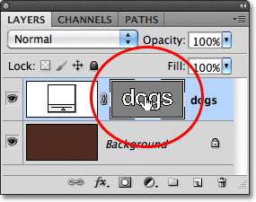
*Make sure the shape's thumbnail is highlighted in the Layers panel.*

With the shape's thumbnail selected and highlighted, I'll select the hole in the center of the letter "o" by clicking and dragging a thin box around it with the Direct Selection Tool, similar to how you would select pixels in an image with the [Rectangular Marquee Tool](/basics/selections/rectangular-marquee-tool/):

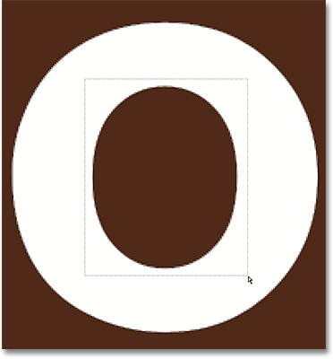
*Click and drag around the area you want to delete.*

When I release my mouse button, small squares known as **anchor points** appear around the shape. It's hard to see in the screenshot, but if you look closely at the shape in your document, you'll notice that the anchor points within the area you dragged around appear as **solid squares**, while the others appear as **hollow outlines**. The solid squares are the anchor points we've selected:

*Selected anchor points appear as solid squares. Unselected ones appear as hollow outlines.*

To delete the selected part of the shape, simply press the **Backspace** (Win) / **Delete** (Mac) key on your keyboard. The selected area is instantly removed:

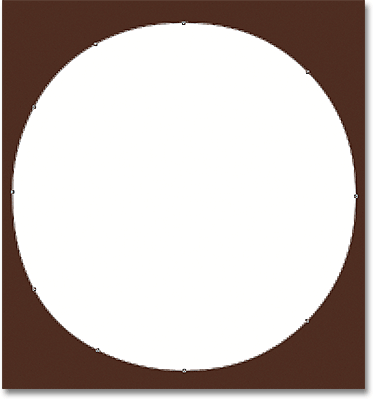
*Press Backspace (Win) / Delete (Mac) to delete the selected part of the shape.*

### Step 4: Select The Custom Shape Tool

Select Photoshop's **Custom Shape Tool** from the Tools panel. By default, it's hiding behind the **Rectangle Tool**, so click and hold on the Rectangle Tool for a couple of seconds until a fly-out menu appears, then select the Custom Shape Tool from the bottom of the list:

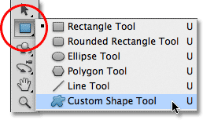
*Click and hold on the Rectangle Tool, then select the Custom Shape Tool from the fly-out menu.*

### Step 5: Select The Shape Layers Option

With the Custom Shape Tool selected, make sure the **Shape Layers** option is selected in the Options Bar along the top of the screen. It's the icon that looks like a square with an anchor point in each corner:

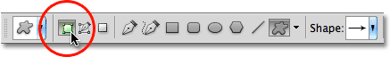
*Click on the Shape Layers icon to select it if its not already selected.*

### Step 6: Choose A Shape

Click on the shape **preview thumbnail** in the Options Bar:

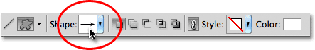
*Click on the shape preview thumbnail.*

This opens the **Shape Picker**, which displays small thumbnails of all the shapes we currently have to choose from. Rather than use any of the default shapes, I'm going to load one of the other **[shape sets](/basics/custom-shape-sets/)** included with Photoshop. To load one of the other sets, click on the small **arrow icon** in the top right corner of the Shape Picker:

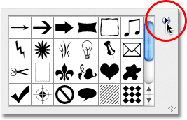
*If you want to load one of the other shape sets, click on the arrow icon.*

This pops open a menu with various options, and at the bottom of the menu is a list of the other shape sets we can choose from. I'm going to choose the **Animals** shape set by selecting it from the list:

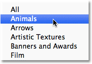
*Selecting the Animals shape set from the Shape Picker's menu.*

Photoshop will ask me if I want to replace the current shapes with the new shapes or if I just want to append the new ones to the end of the list. I'll click **Append** to add the new ones in with the others:

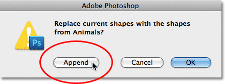
*Choose Append to add the new shapes in with the original ones.*

If I look back in my Shape Picker and scroll down, I see that I now have some new animal shapes to choose from. To select a shape, simply click on its thumbnail. I'll choose the Dog Print shape by clicking on it. Press **Enter** (Win) / **Return** (Mac) once you've chosen a shape to close out of the Shape Picker:

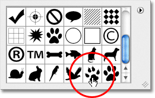
*Click on a shape's thumbnail to select it.*

### Step 7: Draw The Shape In "Subtract From Shape" Mode

Directly to the right of the shape preview thumbnail in the Options Bar is a series of five icons, most of which look like overlapping squares. Clicking on these different icons allows us to switch between different **drawing modes**, like **Add to shape**, **Subtract from shape**, **Intersect shapes**, and others. The icon on the left, **Create new shape**, is always selected by default because usually, we want to create a new shape when we draw one in the document:

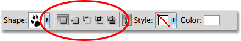
*Photoshop gives us five different drawing modes to choose from, like "Add to shape" and "Subtract from shape".*

The problem with choosing drawing modes by clicking on these icons in the Options Bar is that each time you need to switch to a different mode, you have to drag your mouse up to the Options Bar and select it manually. Also, it's too easy to forget which one is selected, so you'll go to draw a new shape only to end up adding it to an existing shape because the "Add to shape" option is the one you used previously and you forgot to change it back. A better way to switch between drawing modes is with the much faster keyboard shortcuts, which allow us to switch between modes temporarily and always revert back to the default "Create new shape" mode as soon as we release the key!

For example, to subtract a shape from an existing shape, rather than choosing the **Subtract from shape** option in the Options Bar, simply hold down your **Alt** (Win) / **Option** (Mac) key on your keyboard. You'll see a small **minus sign** ( **-** ) appear in the bottom right of your mouse cursor letting you know you've temporarily switched to the "Subtract from shape" mode (if you see the **Eyedropper icon** appear when you hold down your Alt (Win) / Option (Mac) key, it's because you don't have the shape's thumbnail selected in the Layers panel. Make sure it's selected before you continue).

With the Alt (Win) / Option (Mac) key held down, click inside the shape you want to cut a hole through and drag out your new shape. You'll see a thin outline of the new shape appearing inside the original shape. To constrain the aspect ratio of the new shape as you're drawing it, hold down your **Shift** key as well. To move and reposition the shape as you're drawing it, hold down your **spacebar**, drag the shape to a new spot with your mouse, then release your spacebar and continue dragging. Here, I'm dragging out a Dog Print shape inside the letter "o":

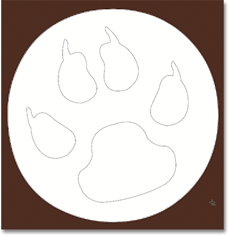
*Hold down Alt (Win) / Option (Mac) and drag out the new shape inside the original one.*

When you're done, release your mouse button and Photoshop subtracts the new shape from the original, effectively cutting a hole through it:

*Photoshop subtracts the new shape from the original when you release your mouse button.*

### Step 8: Select And Draw A Different Shape In "Add To Shape" Mode

This time, let's add a new shape to the text. Click once again on the shape **preview thumbnail** in the Options Bar to open the Shape Picker, then click on a different shape to select it. I'll choose the Dog shape this time. Press **Enter** (Win) / **Return** (Mac) when you're done to close out of the Shape Picker:

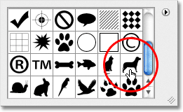
*Choosing a new shape from the Shape Picker.*

To add the new shape to the text shape, we need to be in the **Add to shape** mode, and we can switch to it temporarily by holding down the **Shift** key. You'll see a small **plus sign** ( **+** ) appear in the bottom right of your mouse cursor, letting you know you're about to add the new shape to the existing one. With the Shift key held down, click inside the document and begin dragging out the new shape (again, make sure the shape thumbnail is selected in the Layers panel). A thin outline of the shape will appear as you drag. I'm going to place the dog above the last two letters of the word so it looks like he's standing on them:

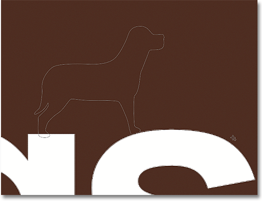
*Hold Shift and drag out the shape to add it to the text.*

When you release your mouse button, Photoshop adds the shape to the original:

*The new shape is added to the text shape.*

Here's what my text looks like now after cutting a hole in the letter "o" with one shape and adding another shape above the last two letters:

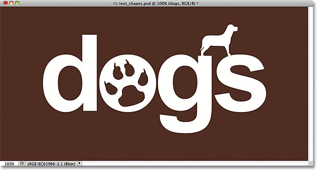
*The text after adding and subtracting other shapes.*

It may look like we have more than one shape in the document, but we can see in the Layers panel that we still just have the one. The new shapes were simply added to, or removed from, the original:

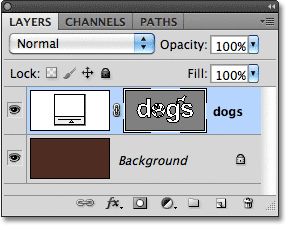
*Everything we've done has been to the text shape.*

### Step 9: Select A Shape To Edit With The Path Selection Tool

Don't worry if you didn't position or size the new shapes exactly right on the text. You can easily go back and make changes. For example, I'd like to move and resize the dog shape I added a moment ago. To do that, I first need to select the shape using the **Path Selection Tool**. If you previously selected the Direct Selection Tool as I did, the Path Selection Tool will now be hiding behind it in the Tools panel, so click and hold on the Direct Selection Tool until the fly-out menu appears, then choose the Path Selection Tool from the list:

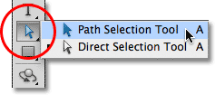
*Whichever tool you used previously will be the one appearing in the Tools panel. The other tool(s) will be hiding behind it.*

Click with the Path Selection Tool anywhere inside the shape you want to select. In my case, I want to select the dog so I'll click inside of it. Solid anchor points will appear around the shape letting you know it's been selected:

*Select a shape by clicking on it with the Path Selection Tool.*

### Step 10: Use Free Transform To Move Or Resize The Shape

With the shape selected, go up to the **Edit** menu at the top of the screen and choose **Free Transform Path**, or press **Ctrl+T** (Win) / **Command+T** (Mac) to select Free Transform with the keyboard shortcut:

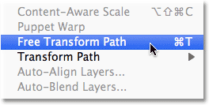
*Go to Edit > Free Transform Path.*

This bring up Photoshop's Free Transform Path box and handles around the shape. To resize the shape, simply drag any of the four **corner handles**. To keep the aspect ratio of the shape intact as you resize it, hold down your **Shift** key and you drag the handles. To move the shape, click anywhere inside the bounding box and drag it around with your mouse. You can also rotate the shape if needed by clicking anywhere outside the bounding box, then dragging with your mouse.

When you're done, press **Enter** (Win) / **Return** (Mac) to accept the changes and exit out of the Free Transform Path command:

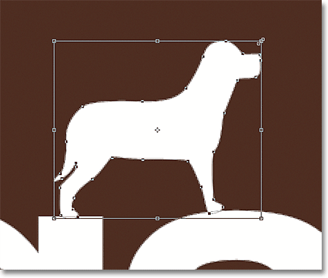
*Use Free Transform Path to resize and move the shape as needed.*

I'll do the same thing with the Dog Print shape I used to cut a hole in the letter "o". Even though the Dog Print shape is being used to subtract an area from the letter, the shape itself is still fully editable. First, I'll select it by clicking anywhere inside of it with the Path Selection Tool. Then I'll press **Ctrl+T** (Win) / **Command+T** (Mac) to quickly bring up the **Free Transform Path** box and handles around the shape, and I'll resize it by dragging one of the corner handles. I'll also move the shape over to the right a bit so the overall design of the letter looks more like the design of the other letters:

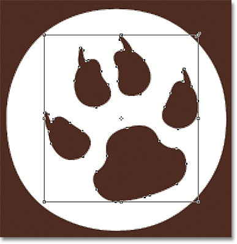
*Shapes being used to cut holes out of other shapes can be moved and resized just like any other shape.*

I'll press **Enter** (Win) / **Return** (Mac) when I'm done to accept the changes and close out of the Free Transform Path command, and I'm done! Here's my final "dogs" text design:

*The final result.*