# Photoshop Brushes – Texture Options

> Source: [https://www.photoshopessentials.com/basics/photoshop-brushes/brush-dynamics/texture/](https://www.photoshopessentials.com/basics/photoshop-brushes/brush-dynamics/texture/)
> Downloaded and converted to Markdown.

So far in our look at Photoshop's powerful and amazing **Brush Dynamics**, we've seen how we can dynamically control the size, angle and roundness of our brushes as we paint using the options found in the **[Shape Dynamics](/basics/photoshop-brushes/brush-dynamics/shape-dynamics/)** section of the Brushes panel, and how we can scatter multiple copies of our brush tip along each stroke with the [**Scattering**](/basics/photoshop-brushes/brush-dynamics/scattering/) options. In this tutorial, we'll look at the **Texture** options, which give us the ability to add a texture to our brush, perfect for creating the illusion of painting on a textured surface like paper or canvas, or just for adding more interest to the shape of our brush tip!

To access the Texture options, click directly on the word **Texture** on the left side of the Brushes panel. Just as with the Shape Dynamics and Scattering sections that we looked at previously, we need to click on the word itself to gain access to the options. Clicking inside the checkbox to the left of the name will turn the Texture options on but won't let us change any of them:

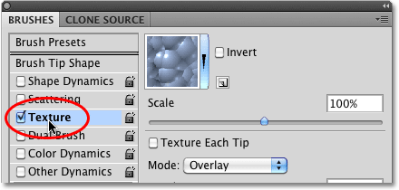
*Click directly on the word Texture to view its options.*

Once you've clicked on the word Texture, the Texture options will appear on the right side of the Brushes panel. By default, the bottom half of the options are grayed out and unavailable. We'll see how to enable them a bit later on:

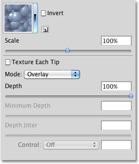
*The Texture options. Only the top half of the options are available at first.*

### Choosing A Texture

Even though Photoshop calls them Texture options, what you'll usually be working with here is **patterns**, and we can use any of the patterns that Photoshop installed for us, as well as any patterns we've created ourselves. To choose a pattern, click on the **pattern preview** thumbnail at the top of the list of options:

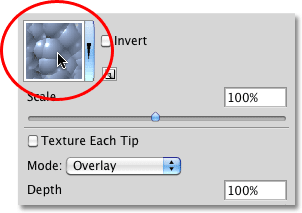
*Click on the pattern preview thumbnail to view all of the available patterns.*

This opens the **Pattern Picker**, which shows small thumbnail previews of all the patterns that are currently loaded into Photoshop. By default, there isn't much to choose from. That's because all we see are the patterns that Photoshop initially loads for us, but there are other pattern sets available. To load any of the additional pattern sets that Photoshop comes with, click on the small triangle icon in the top right corner of the Pattern Picker:

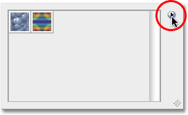
*To load additional pattern sets, click on the small triangle icon.*

A fly-out menu will appear. If you look near the bottom of the menu, you'll see a list of other pattern sets we can choose from. To load one of them, simply click on its name. I'm going to select the first one - Artistic Surfaces:

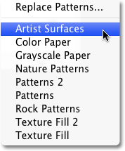
*Select any of Photoshop's other pattern sets from the list.*

Photoshop will pop open a small dialog box asking if you want to replace the current patterns with the new ones. Click on **Append** to simply add the new patterns in with the existing ones:

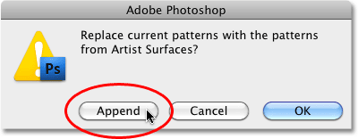
*Choose "Append" to load in the new patterns without removing the ones that are already loaded.*

The newly loaded patterns will appear in the Pattern Picker after the patterns that were already loaded previously. To select a pattern, click on its thumbnail. I'm going to select the Parchment pattern, but you can choose any one you like. If you have Tool Tips enabled in Photoshop's Preferences, the name of each pattern will appear as you hover your mouse cursor over the thumbnails. Once you've chosen a pattern, press **Enter** (Win) / **Return** (Mac) to close out of the Pattern Picker:

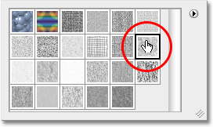
*Select a pattern by clicking on its thumbnail.*

Even though I've selected a pattern, if I look down at the **preview area** along the bottom of the Brushes panel, I'm not seeing any changes to the appearance of my brush stroke (I'm still using the same standard round brush tip):

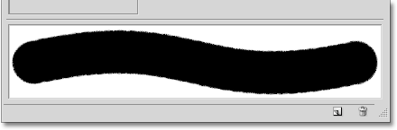
*You may or may not see changes in the brush preview area. In my case, nothing has happened yet.*

You may be seeing the same thing I'm seeing, or you may see your pattern clearly visible inside the brush stroke. The reason has to do with two main options that determine how our brush and our texture (pattern) interact with each other, which we'll look at next.

### Mode

In the center of the Texture options is an option named **Mode**, which is short for **Blend Mode** (or Brush Mode, but I find it makes more sense to think of it as Blend Mode). This option is one of two main options (the other being Depth which we'll look at in a moment) that determine how the brush and the texture interact, or blend, with each other. If you click on the drop-down box to the right of the word Mode, you'll see a list of various blend modes we can choose from:

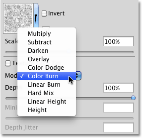
*Click on the Mode drop-down box to see a list of available blend modes.*

If you've been working with Photoshop for a while and using **[layer blend modes](/photo-editing/layer-blend-modes/)**, most of the modes in the list, like Multiply, Overlay, Color Dodge and so on, will look familiar to you. Each of these modes will change how the texture appears inside the brush. The effect you get from each one will depend on the brush tip and texture you're using, so the easiest way to see what sort of results you'll get is by trying each mode out while keeping an eye on the preview of your brush stroke at the bottom of the Brushes panel.

The original mode I had selected was Color Burn, but as we saw in the preview area a moment ago, Color Burn completely blocked my texture from view. I'll select **Multiply** to see what effect I get:

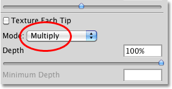
*Trying out the Multiply mode.*

If I look at the preview of my brush stroke, I see that my texture has suddenly appeared inside the shape of the stroke:

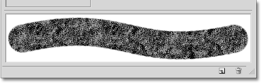
*The texture (pattern) now becomes visible inside the brush stroke.*

Let's try a different mode. I'll select **Subtract** this time:

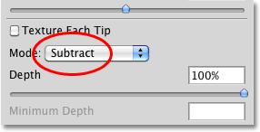
*Seeing what difference (if any) the Subtract mode will make.*

With the Subtract mode selected, the texture is still visible inside the brush stroke, but it now appears much lighter:

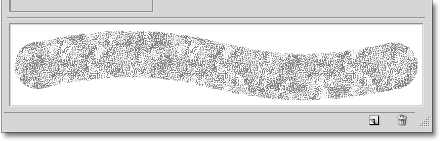
*Subtract gave us much lighter results than what we saw with Multiply.*

Try each mode out with your brush and choose the one that gives you the results you're looking for.

### Depth

The second main option that controls how our brush and texture interact is **Depth**, which is found directly below the Mode option we just looked at. Depth determines how visible the texture appears inside the shape of the brush. At a depth value of 0%, the texture is completely hidden from view and only the brush itself is visible. As we increase the depth value by dragging its slider towards the right, the texture becomes more and more visible until finally, at a depth value of 100%, the texture appears at full strength inside the brush. Keep an eye on the preview area at the bottom of the Brushes panel as you drag the Depth slider to see the effect it has:

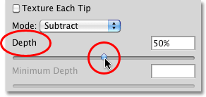
*Drag the Depth slider left or right to control the visibility of the texture inside the brush.*

Here's a simple brush stroke with Depth set to 0%. The texture is completely hidden:

*Depth value = 0%. No texture is visible.*

The same brush stroke with Depth set to 50%. The texture is now partially visible (Mode is set to Multiply):

*Depth value = 50%. The brush and texture are now blended evenly.*

And here's the brush stroke with Depth set to 100%. The texture is now fully visible inside the brush (Mode set to Multiply):

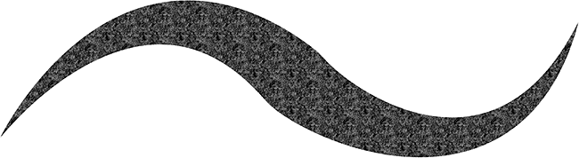
*Depth value = 100%. The texture appears at full strength.*

### Texture Each Tip

If you look closely at the brush strokes in the above examples, you'll notice that the texture (pattern) repeats over and over again inside the area I've painted. In other words, I'm simply painting the texture into the document. This is Photoshop's default behavior for the Texture dynamics, and it's exactly the behavior we want if we're trying to create the illusion that we're painting on some sort of textured surface like canvas.

Photoshop gives us another option, though, and that's to apply the texture directly to the brush tip itself, which means that the texture will be re-applied each time Photoshop stamps a new copy of the brush tip as we paint, giving us much more of a textured brush appearance and less of the repeating pattern we see by default.

To enable this feature, select the **Texture Each Tip** option directly above the Mode option:

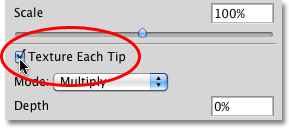
*Turn on the Texture Each Tip option to apply the texture to each brush tip instead of the entire stroke.*

By turning on the Texture Each Tip option, we enable the other options (Minimum Depth, Depth Jitter and Control) that were initially grayed out and unavailable:

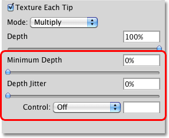
*Minimum Depth, Depth Jitter and Control all become available when Texture Each Tip is selected.*

### Control

Just as we've seen with the Shape Dynamics and Scattering sections, Photoshop gives us various ways to dynamically control the depth value of the texture as we paint, all of which are found in the **Control** drop-down list at the bottom of the Texture options:

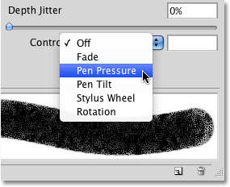
*Choose how you want to control the depth of the texture from the Control options.*

By now, if you've been following along from the **[beginning](/basics/photoshop-brushes/brush-dynamics/)** of this series, these options should look familiar to us. **Fade** will gradually reduce the visibility of the texture inside the brush stroke over the number of steps we specify (25 is the default number of steps). **Pen Pressure** allows us to control the depth by adjusting the amount of pressure we apply to the tablet with the pen, and **Pen Tilt** changes the depth value as we tilt the pen forward and back. Here's a brush stroke with Control set to Pen Pressure. I've increased the spacing between the individual brush tips to make it easier to see the changes in the depth value (Mode is set to Subtract this time):

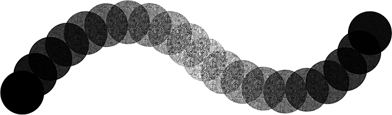
*More pen pressure in the middle of the stroke increased the depth value and made the texture more visible.*

### Minimum Depth

If you want the texture to be visible to some degree at all times, use the **Minimum Depth** option to control the lowest depth value that Photoshop will use. Drag the slider left or right to adjust the minimum value. I'm going to set my minimum depth to 50%:

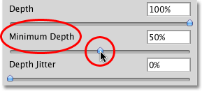
*Use the Minimum Depth option to prevent the texture from being completely hidden as you paint.*

Here's the same brush stroke as before (with Control set to Pen Pressure), but with the Minimum Depth value now set to 50%, the depth never drops to the point where the texture is no longer visible:

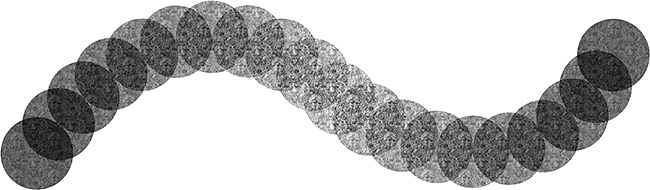
*With Minimum Depth set to 50%, the texture always remains visible.*

### Jitter

Finally, we can let Photoshop randomly change the depth value for us as we paint using the **Jitter** option. Drag the Jitter slider towards the right to increase the amount of randomness that Photoshop will apply to the depth:

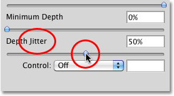
*Increase the Jitter value to add randomness to the depth value as you paint.*

As always, we can use Jitter by itself to add nothing but randomness to the depth value, or we can combine it with any of the Control options to add a little randomness while we dynamically control the depth value with pen pressure or any of the other options. Here, I've set Jitter to 100% and turned the Control option to Off, letting Photoshop randomly choose the depth value of each new brush tip. I've also set the Minimum Depth value to 0%, giving Photoshop a complete range of depth values to choose from:

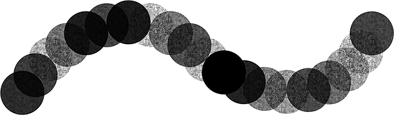
*With Jitter set to 100% and Minimum Depth set to 0%, we see a wide range of depth values along the stroke.*

### Invert and Scale

There's two additional options found at the top of the Texture dynamics section. **Invert** will swap the original brightness values of your texture, making dark areas light and light areas dark. I don't find much use for this option but it's there if you need it. Use the **Scale** slider to change the size of the texture as it appears inside your brush. Keep in mind, though, that textures (and patterns) are pixel-based and follow the same general rules for resizing as images. Making the texture smaller is usually okay, but scaling it much beyond it's default size of 100% can make it appear soft and dull:

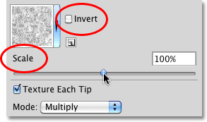
*Use Invert if you need to swap the brightness values of your texture. Use the Scale slider to change the size of the texture inside the brush.*

We've now covered the first three of Photoshop's six Brush Dynamics categories! Up next, we'll look at how to combine two different brushes together using the **[Dual Brush](/basics/photoshop-brushes/brush-dynamics/dual-brush/)** options! Or, jump to any of the other Brush Dynamics categories using the links below:

- [**Shape Dynamics**](/basics/photoshop-brushes/brush-dynamics/shape-dynamics/)
- [**Scattering**](/basics/photoshop-brushes/brush-dynamics/scattering/)
- [**Color Dynamics**](/basics/photoshop-brushes/brush-dynamics/color-dynamics/)
- [**Other Dynamics**](/basics/photoshop-brushes/brush-dynamics/other-dynamics/)