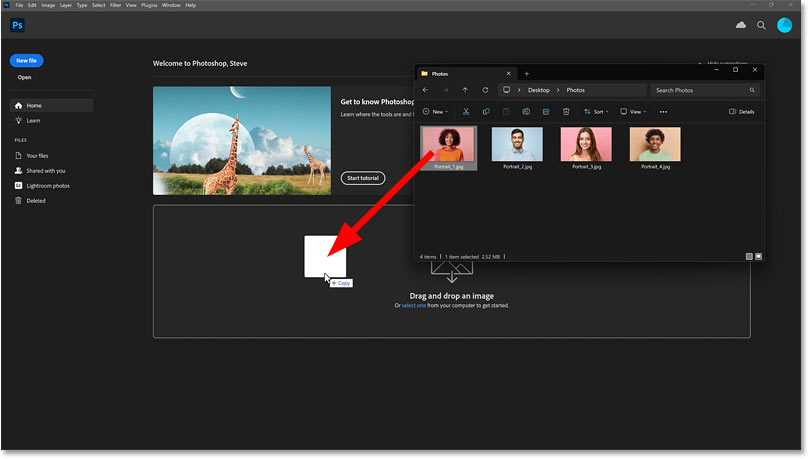
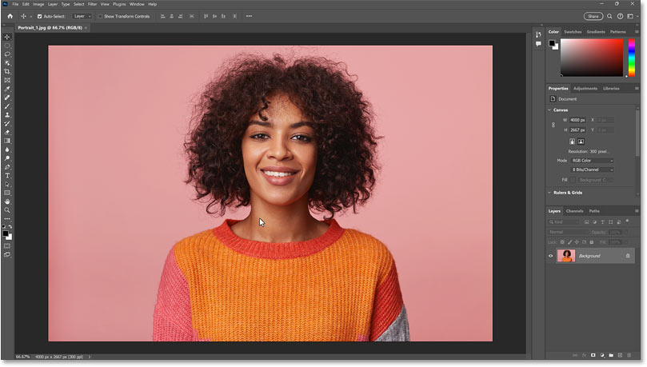
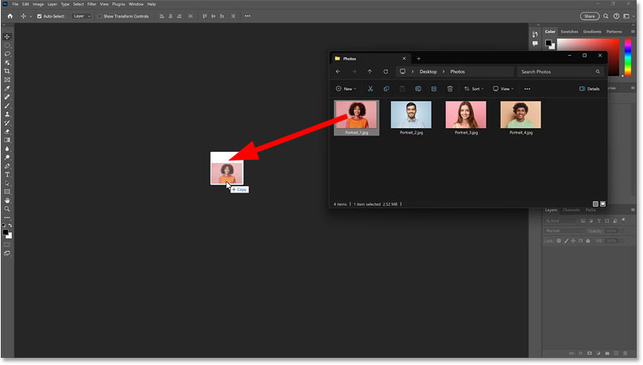
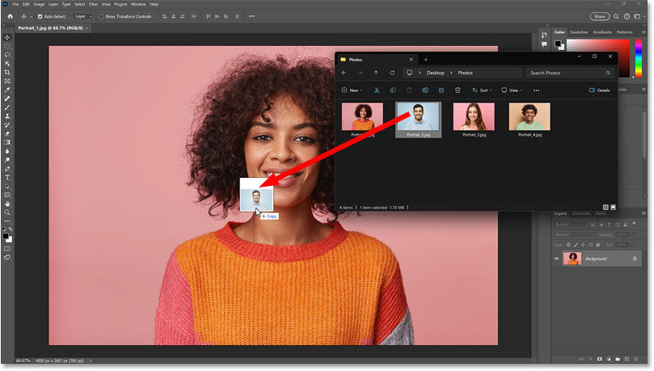
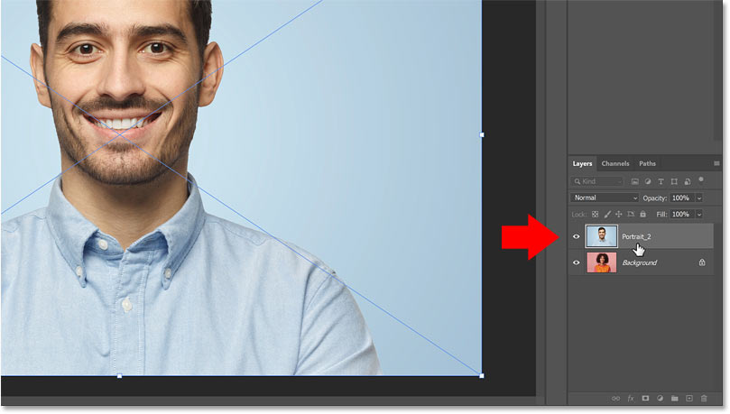
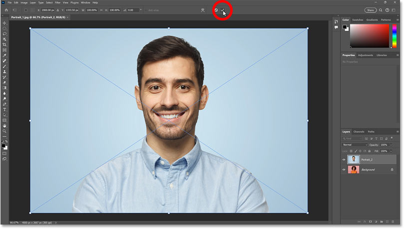
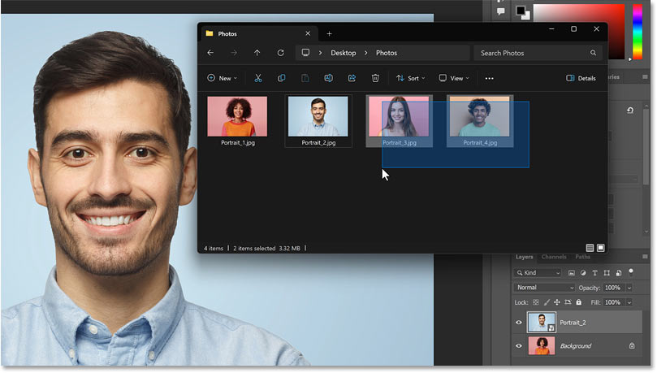
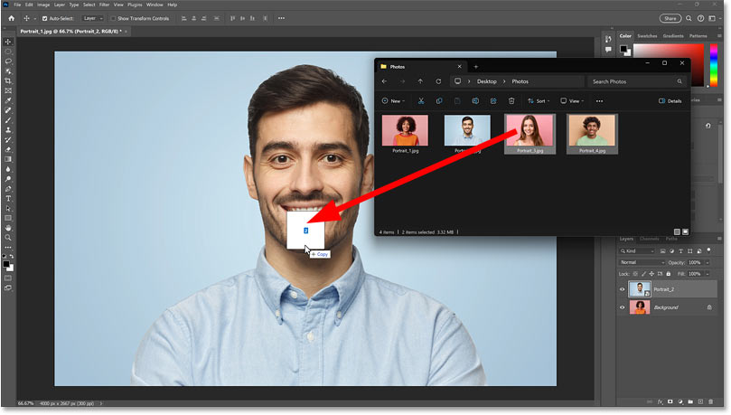
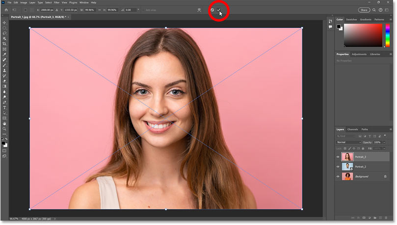
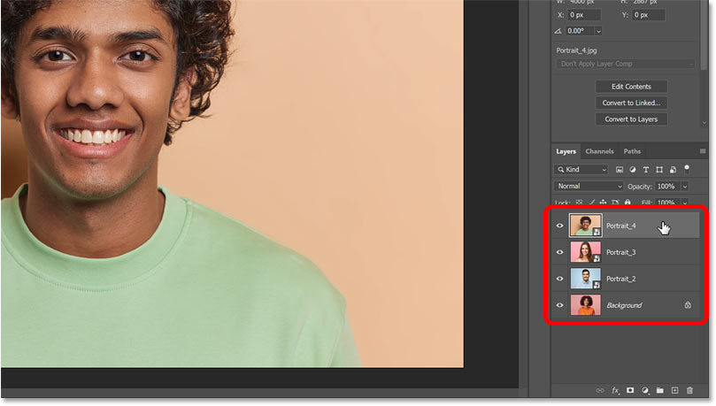

# How to Open or Add Images in Photoshop the Easy Way

> Source: [https://www.photoshopessentials.com/basics/the-easy-way-to-open-or-add-images-in-photoshop/](https://www.photoshopessentials.com/basics/the-easy-way-to-open-or-add-images-in-photoshop/)
> Downloaded and converted to Markdown.

Learn the fast and easy way to open an image as a new document, or import images as layers in your document, just by dragging and dropping them into Photoshop.

Photoshop has "official" ways to open or import images, like the [Open button](/basics/open-images-photoshop-cc/ "Learn how to open images in Photoshop") on the Home Screen for opening an image as a new document, or the [Place Embedded](/basics/open-image-vs-place-image/ "Learn more about Place Embedded") and [Load Files into Stack](/basics/open-multiple-images-as-layers-in-photoshop/ "Learn how to open multiple images as layers in Photoshop") commands for importing images as layers into an existing document.

But the easiest and fastest way to open or add images is to simply **drag and drop** them from your computer's operating system (using Windows Explorer or the Mac Finder) directly into Photoshop.

In this tutorial, you'll learn how to drag and drop images to:

- Open an image as a new Photoshop document
- Add an image as a layer to an existing document
- Import multiple images as layers in Photoshop

## Which Photoshop version do I need?

I'm using [Photoshop 2025](https://adobe.prf.hn/click/camref:1100lrdjJ/destination:https%3A%2F%2Fwww.adobe.com%2Fproducts%2Fphotoshop.html "Get Photoshop") but any recent version will work.

Let's get started!

## Drag and drop to open an image in Photoshop

To open an image from Photoshop's Home Screen, the official way is to:

- Click the **Open** button.
- Navigate to your image and select it, then
- Click **Open**.

But the faster way is to drag your image from Windows Explorer, or Finder on a Mac, and drop it directly onto the Home Screen.

In this example, I'm dragging and dropping an image onto the Home Screen from Windows Explorer on a PC.

*Dragging and dropping an image onto Photoshop’s Home Screen to open it.*

The image instantly opens in a new Photoshop document when you release your mouse button.

*The image opens in a new document.*

If you [disabled Photoshop's Home Screen](/basics/hide-the-home-screen/ "Learn how to hide the Home Screen in Photoshop"), and no document is open, you can drag and drop the image into the blank area of the interface and it will open in a new document.

*Dragging and dropping an image into Photoshop’s standard workspace.*

## Drag and drop to add an image as a layer in Photoshop

The official way to add an image as a layer to an existing Photoshop document is to:

- Open the **File** menu.
- Choose the **Place Embedded** command.
- Navigate to your image and select it, then
- Click **Place**.

But the faster way is to drag your image from Windows Explorer or the Mac Finder and drop it directly into the document.

Here I'm dragging and dropping my second image onto the first image.

*Dragging and dropping an image into an existing document.*

Photoshop adds the image and places it on a new layer.

*The image is added on a new layer in the document.*

When placing an image, either with the Place Embedded command or by dragging and dropping it, Photoshop first opens [Free Transform](/basics/transform-and-warp-images-with-free-transform-in-photoshop-cc-2019/) so you can resize or reposition the image if needed.

Click the **check mark** in the Options Bar to close Free Transform and add the image to the document.

*Clicking the check mark to close Free Transform.*

## Drag and drop to import multiple images as layers

Finally, to import multiple images as layers into your Photoshop document, the official way is to:

- Open the **File** menu, choose **Scripts** and then **Load Files into Stack**.
- Click **Browse** to navigate to your images.
- Select the images you want to import, then
- Click **OK**.

But the fastest way to import images as layers is to select the images you want to import in Windows Explorer or the Mac Finder and then (you guessed it) drag and drop them into your document.

Here I'm selecting my third and fourth images in Windows Explorer.

*Selecting the images to import as layers.*

Then I'll drag and drop them into the document.

*Dragging and dropping the selected images into the document.*

When importing multiple images, Photoshop will pause after each image is imported so you can resize or reposition it using **Free Transform**.

You'll need to click the **check mark** in the Options Bar repeatedly to proceed through the images until they have all been added.

*Clicking the check mark to close Free Transform as each image is imported.*

Once all your images are in the document, they appear on individual layers in the Layers panel.

*Photoshop’s Layers panel showing the images imported as layers.*

And there we have it! That's how to quickly open or import images just by dragging and dropping them into Photoshop.