# The New Gradients and Gradients Panel in Photoshop CC 2020

> Source: [https://www.photoshopessentials.com/basics/the-new-gradients-and-gradients-panel-in-photoshop-cc-2020/](https://www.photoshopessentials.com/basics/the-new-gradients-and-gradients-panel-in-photoshop-cc-2020/)
> Downloaded and converted to Markdown.

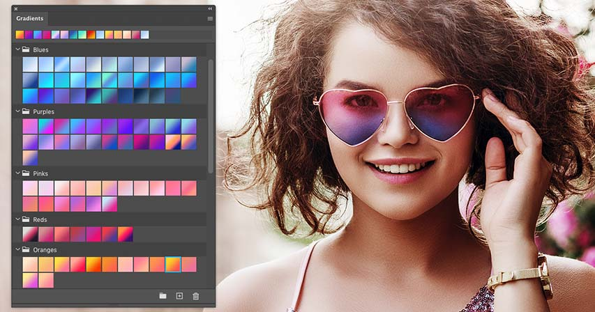

Learn all about the new Gradients panel in Photoshop CC 2020, the amazing new gradient presets now included with Photoshop, and how to create and save your own gradients and gradient sets!

In this tutorial, you'll learn all about the brand new Gradients panel in Photoshop CC 2020, which replaces the Preset Manager as the new home for all your gradients. I show you how the Gradients panel works, and we look at the many new and impressive gradients now included with Photoshop CC 2020. I also show you how to restore the legacy gradients from earlier versions of Photoshop so you'll have even more gradients to choose from.

Of course, you'll also want to create your own gradients. So after a quick tour of the Gradients panel, we jump over to Photoshop's Gradient Editor where I show you how to create, edit and save your own gradients and gradient sets!

To follow along, you'll need [Photoshop 2020 or newer](https://prf.hn/l/dlXjD2w). If you're already using Photoshop CC, make sure that your copy is up to date.

Let's get started!

## The new Gradients panel in Photoshop CC 2020

Let's start by learning about the Gradients panel itself, which is brand new as of Photoshop CC 2020 and is the new home for all of Photoshop's gradients.

### Where do I find the Gradients panel?

By default, the Gradients panel is nested in with the Color, [Swatches](/basics/drag-and-drop-colors-swatches-in-photoshop-cc-2020/) and Patterns panels:

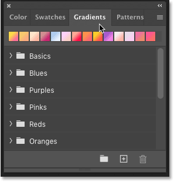
*The new Gradients panel in Photoshop CC 2020.*

If you don't see the Gradients panel, you can open it by going up to the **Window** menu in Photoshop's Menu Bar and choosing **Gradients**. But if you see a checkmark next to the word Gradients, it means that the panel is already open somewhere on your screen, and selecting it from the Window menu will close the panel:

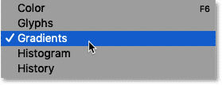
*Going to Window > Gradients.*

### Photoshop's new default gradients

Along with the new Gradients panel, Photoshop CC 2020 also includes all new default gradients. The gradients are divided into groups, or sets, and each set is represented by a folder.

The sets are all based on color themes. So we have sets for Blues, Purples, Pinks, Reds, Greens, and so on:

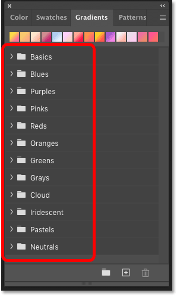
*The new default gradient sets in Photoshop CC 2020.*

[How to drag and drop colors in Photoshop CC 2020!](/basics/drag-and-drop-colors-swatches-in-photoshop-cc-2020/)

### How to open and close the gradient sets

To twirl a single gradient set open or closed, click the **arrow** next to the set's folder icon. Here I'm opening the Blues set, and inside the set are lots of new gradients to choose from:

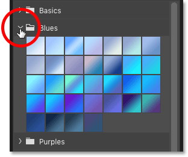
*Opening one of the new default gradient sets.*

You can also open and close all of the gradient sets at once by pressing and holding the **Ctrl** (Win) / **Command** (Mac) key on your keyboard and clicking the **arrow** for any of the sets. Then use the scroll bar along the right of the panel to scroll through the thumbnails:

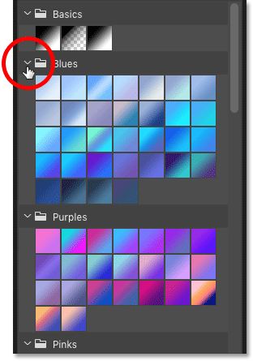
*Opening all of the gradient sets at the same time.*

### How to change the size of the gradient thumbnails

To change the size of the thumbnails in the Gradients panel, click the panel's **menu icon**:

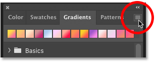
*Clicking the panel's menu icon.*

And choose either **Small** or **Large Thumbnail**. Or you can choose to view the gradients as a **Small** or **Large List** which includes the name of each gradient along with its thumbnail:

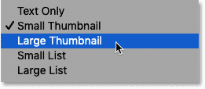
*The gradient thumbnail display choices.*

### Your recent gradients

Along the top of the Gradients panel is a row showing the gradients you've used recently. Click on any of the thumbnails to reselect the gradient:

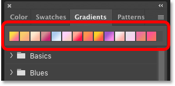
*The recently-used gradients.*

You can also hide the recent gradients by clicking the Gradients panel **menu icon**:

*Opening the Gradients panel menu.*

And turning off **Show Recents**:

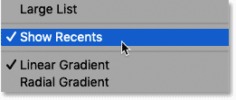
*The "Show Recents" option.*

[Create rainbow eye color effects with Photoshop!](/photo-effects/rainbow-colored-eyes-effect-with-photoshop/)

### The New Group, New Gradient and Delete Gradient options

The bottom of the Gradients panel is where you'll find the **Create New Group**, **Create New Gradient**, and **Delete Gradient** options. We'll come back to these options in a moment when we look at how to create our own gradients:

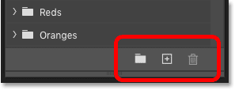
*From left to right: New Group, New Gradient, and Delete Gradient.*

### How to load Photoshop's legacy gradients

And finally, to load the gradients from earlier versions of Photoshop, click the Gradients panel **menu icon**:

*Opening the Gradients panel menu.*

And choose **Legacy Gradients**:

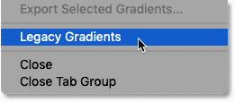
*Loading the legacy gradients.*

A new Legacy Gradients set will appear below the default sets. Twirl the set open to view all the gradients inside it:

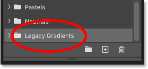
*The new Legacy Gradients set.*

## How to create new gradients in Photoshop CC 2020

Photoshop CC 2020 includes lots of impressive new gradients to choose from. But it's still more fun to create our own. Here's how to do it.

### Step 1: Create a new gradient set

First, you'll want to create a new set to hold your gradients. So start by clicking the **Create New Group** icon at the bottom of the Gradients panel:

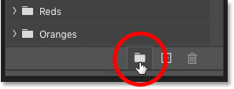
*Clicking the Create New Group icon.*

Then give the set a name, like "My Gradients", and click OK:

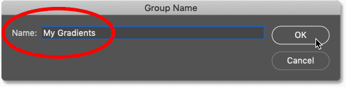
*Naming the new gradient set.*

Back in the Gradients panel, your new set appears below the others:

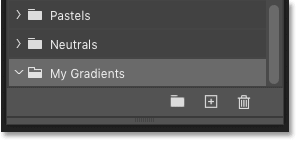
*The new "My Gradients" set appears.*

### Step 2: Click the Create New Gradient icon

Next, click the **Create New Gradient** icon:

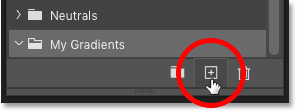
*Clicking the Create New Gradient icon.*

This opens Photoshop's **Gradient Editor**, which by default is set to the **Black, White** gradient. To create a new gradient, all we need to do is edit this existing one.

Note that you don't need to start with the Black, White gradient. You can choose any gradient in the **Presets** section at the top of the Gradient Editor. These are the same gradients found in the Gradients panel:

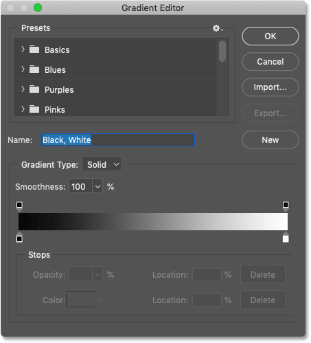
*The Gradient Editor dialog box.*

### Step 3: Edit an existing gradient

To change a color in the gradient, double-click on its **color stop** below the gradient preview bar:

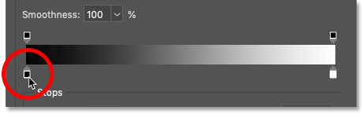
*Double-clicking on a color stop.*

Then choose a new color in the **Color Picker** and click OK:

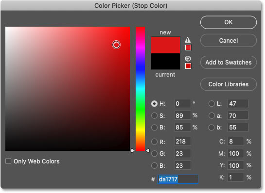
*Choosing a new gradient color.*

The gradient preview bar updates with the new color. I'll edit the second color as well by double-clicking on its color stop:

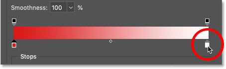
*Double-clicking on the other color stop.*

Then I'll choose another new color in the Color Picker and I'll again click OK:

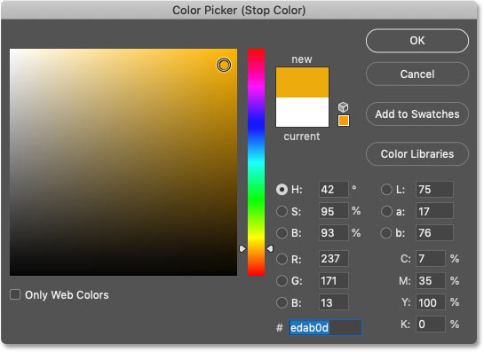
*Choosing another new gradient color.*

[How to turn images into color swatches with Photoshop!](/basics/create-color-swatches-from-images-in-photoshop-cc-2020/)

### How to add more colors to a gradient

To add more colors to the gradient, click on a spot below the preview bar to add a new color stop:

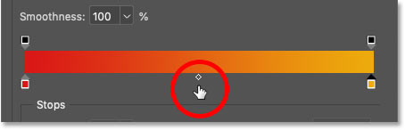
*Clicking to add a new color stop.*

And then double-click on the new stop to change its color:

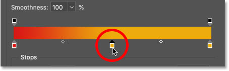
*Editing the new color.*

Choose your new color in the Color Picker:

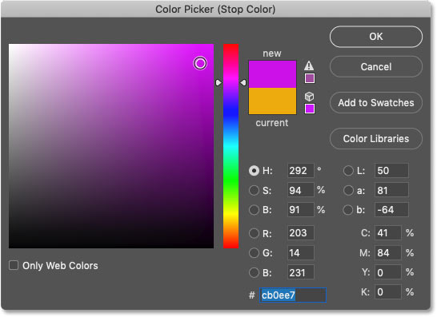
*Choosing a third color for the gradient.*

Then click OK, and we now have three main colors in the gradient. You can add as many colors as you need:

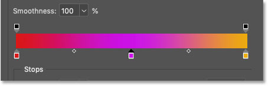
*The new color has been added.*

### How to move colors in the gradient

To move a color to a different location in the gradient, click on its color stop and drag it left or right:

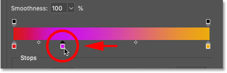
*Dragging a color stop to move it along the gradient.*

Or with the color stop selected, you can specify an exact location as a percentage by entering a value into the **Location** field. A value of 0 percent would place the color stop on the far left of the gradient, 100 percent would place it on the far right, and 50 percent would place it in the middle:

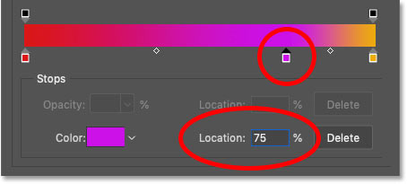
*Setting an exact location with the Location option.*

### How to remove a color from a gradient

To remove a color, simply click on its color stop and drag it down and away from the gradient until the stop disappears:

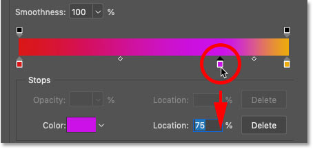
*Click and drag a color stop away from the preview bar to remove it.*

After removing the middle color, I'm back to a two-color gradient:

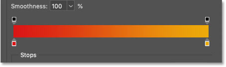
*The result after removing the third color stop.*

### How to add transparency to a gradient

We've looked at how to edit colors in the gradient, but you can also add transparency.

Above the gradient preview bar are the **opacity stops**. There's one on the left and another on the right. Opacity stops control the opacity, or transparency, of different parts of the gradient. You can add more opacity stops by clicking anywhere along the top of the preview bar:

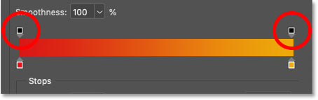
*The gradient's opacity stops.*

In most cases, you'll want to leave the opacity stops at their default value of 100 percent, which keeps the colors in the gradient fully visible. But to add transparency, click on an opacity stop to select it and then lower its value in the **Opacity** option. 

Here I've selected the opacity stop on the right and I've lowered its Opacity value to **0 percent**. And notice in the preview bar that the gradient now goes from red on the left to transparency on the right. The checkerboard pattern in the preview bar is how Photoshop represents transparency:

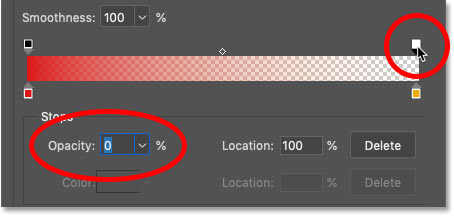
*Using an opacity stop to add transparency to the gradient.*

I'll set the Opacity value back to **100 percent** to bring back the color:

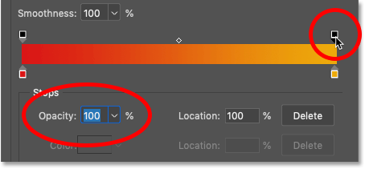
*Resetting the stop's opacity back to 100 percent.*

[How to choose text colors from images with Photoshop!](/basics/how-to-choose-type-colors-from-images-with-photoshop/)

### Step 4: Select a gradient set

When you're ready to save the gradient, first go up to the **Presets** area in the Gradient Editor and choose the set where you want to save the gradient. I'll choose the "My Gradients" set that I created earlier:

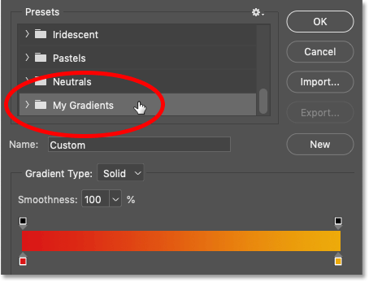
*Choosing the set that will hold the gradient.*

### Step 5: Name the gradient and click New

Give your new gradient a name, and then click the **New** button:

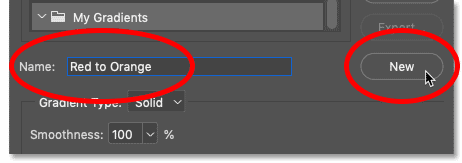
*Naming the gradient and clicking New.*

Your new gradient appears in the set:

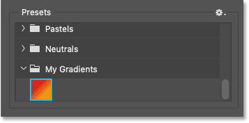
*The new gradient has been saved.*

### Step 6: Close the Gradient Editor

Click OK to close the Gradient Editor:

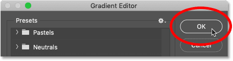
*Closing the Gradient Editor.*

And back in the Gradients panel, the new gradient appears, ready to be added to your document:

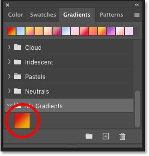
*The new gradient in the Gradients panel.*