# The New Start Screen And Recent Files Panel In Photoshop CC 2015

> Source: [https://www.photoshopessentials.com/basics/the-new-start-screen-and-recent-files-panel-in-photoshop-cc-2015/](https://www.photoshopessentials.com/basics/the-new-start-screen-and-recent-files-panel-in-photoshop-cc-2015/)
> Downloaded and converted to Markdown.

In this Photoshop tutorial, we'll learn all about the new **Start screen** and **Recent Files panel** that were first introduced to **Photoshop CC** in the November 2015 Creative Cloud updates.

No matter what we plan on doing with Photoshop, the first step is always the same; we either open an existing image or document to work on, or we create a brand new document from scratch. In the latest version of Photoshop CC, Adobe has made this first step easier and more intuitive by introducing a new Start screen as well as a new Recent Files panel.

The Start screen gives us quick access to our most recently-opened files, along with options for opening other files, creating new documents, and more. It appears every time we launch Photoshop and whenever we close out of a document (with no other documents still open on the screen). The Recent Files panel offers many of the same options as the Start screen but without needing to close out of the document. Let's see how they work.

### The New Start Screen

If you've been using Photoshop for a while, including earlier versions of Photoshop CC, the new Start screen may seem a bit confusing at first, not because of what you're seeing but rather for what you're *not* seeing. Traditionally when opening Photoshop, we've been greeted by the familiar Tools panel along the left and a larger column of panels along the right:

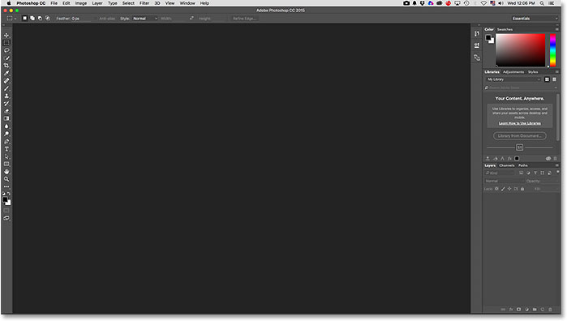
*The standard Photoshop workspace.*

Now, when we launch Photoshop, all of those panels are missing; no Tools panel, no Layers panel, nothing. In their place is a list of recently-opened files in the center of the screen. This is Photoshop's new Start screen:

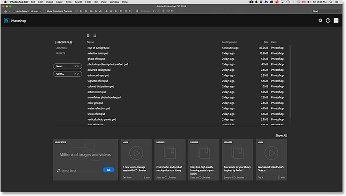
*The new Start screen in Photoshop CC 2015.*

Since the Start screen effectively changes the layout of Photoshop's interface, Adobe has saved it as a new *workspace*. You'll find it already selected in the **Workspace** option in the upper right of the screen. As I mentioned, Photoshop now switches by default to this new Start workspace each time we launch Photoshop and whenever we close out of a document (as long as there are no other documents still open). We'll learn how to change this default behavior a bit later:

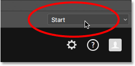
*The new Start workspace.*

If you need reassurance that your Tools panel, Layers panel and other panels haven't really gone anywhere, you can click on the word Start and switch to any of Photoshop's other workspaces by choosing one from the menu, including the **Essentials** workspace (the one most people are familiar with):

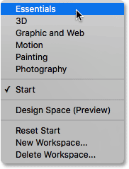
*Selecting the Essentials workspace.*

This closes the Start screen and brings back the traditional Photoshop layout:

*The Essentials workspace.*

To switch back to the Start workspace, simply reselect it from the Workspace menu:

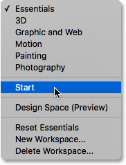
*Selecting the Start workspace.*

This takes us back to the Start screen once again:

*Back to the Start workspace.*

### The Recent Files List

Let's take a closer look at what the Start screen has to offer. Along the bottom of the Start screen is a collection of cards you can click on to learn more about what's new in Photoshop, view various tutorials, add free assets to your Creative Cloud libraries, and more. There's also a convenient search box for finding royalty-free stock images and graphics from Adobe Stock (Adobe's new stock image service).

But the main feature of the new Start screen is its **Recent Files** list, which displays a list of recently-opened images and documents. Depending on the number of files in the list, you may need to use the scroll bar along the right of the list to scroll through it:

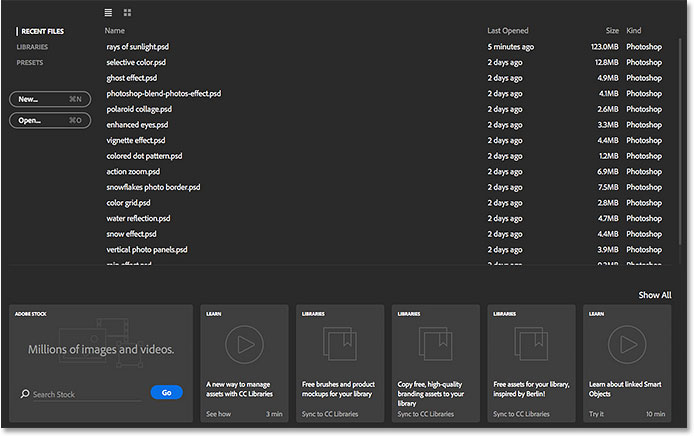
*The Recent Files list in the center of the Start screen.*

By default, the files are displayed as a text-based list, showing only the names of the files, but we can also view them as thumbnails. If you look directly above the column of file names, you'll see two icons. Clicking the icon on the left will select **List View** (the text-based view we're already seeing). Click the icon to its right (as I'm going to do) to switch to **Thumbnail View**:

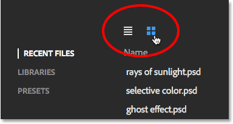
*The List View and Thumbnail View icons.*

And now, my recently-opened files are displayed as thumbnails. Note that if you're not seeing some (or any) of your thumbnails, it's because you first need to open a file in this latest version of Photoshop for its thumbnail to appear:

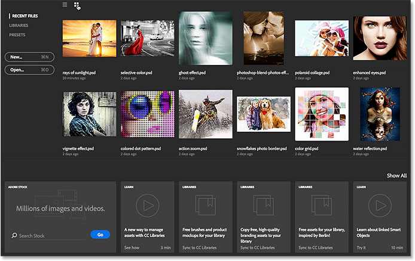
*Viewing the recent files as thumbnails.*

If the file you're looking for is not found anywhere in the Recent Files list, click the **Open** button to the left of the list to navigate to the file on your hard drive. This is the same as selecting **Open** from the **File** menu at the top of the screen:

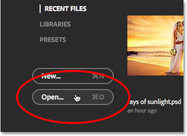
*Click the Open button to open files not found in the Recent Files list.*

To open an image or document from the Recent Files list, simply click on its thumbnail (or on its name in List View). I'll open the first image in my list:

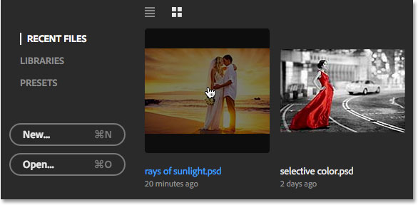
*Clicking on a file in the Recent Files list to open it.*

Photoshop closes the Start screen and opens the image in the familiar interface layout with the Tools panel along the left and other panels along the right:

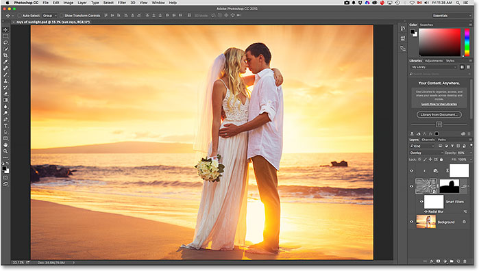
*Opening an image closes the Start screen.*

[Learn how to add rays of sunlight to your photos](photo-effects/add-rays-of-sunlight-to-a-photo-with-photoshop/)

When you're finished working and you close your document, Photoshop returns you to the Start screen. I'll close my document by going up to the **File** menu at the top of the screen and choosing **Close**:

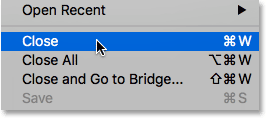
*Going to File > Close.*

And now, I'm back to seeing the Start screen once again:

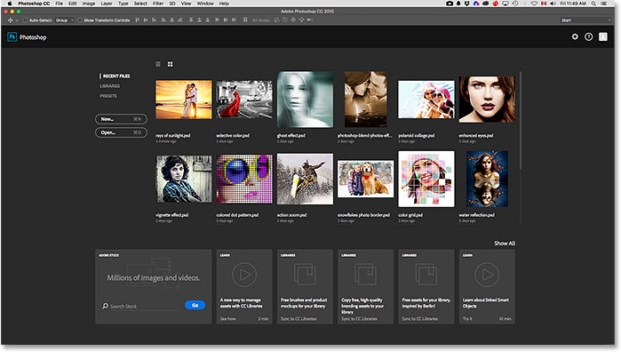
*Closing the document returns you to the Start screen.*

### Creating A New Document

Along with opening recent files, we can also create new documents from the Start screen. One way to do that is by clicking on the word **PRESETS** in the upper left:

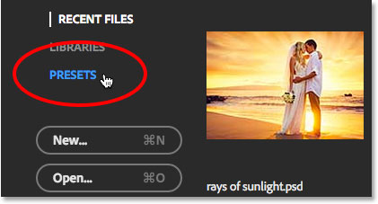
*Switching from Recent Files to Presets.*

This opens a list of preset document sizes that we can choose from, including common sizes for print, web, mobile devices, and more. To choose one, select it from the list. If none of these preset sizes will work, choose **Custom Document** from the bottom of the list (as I'm going to do):

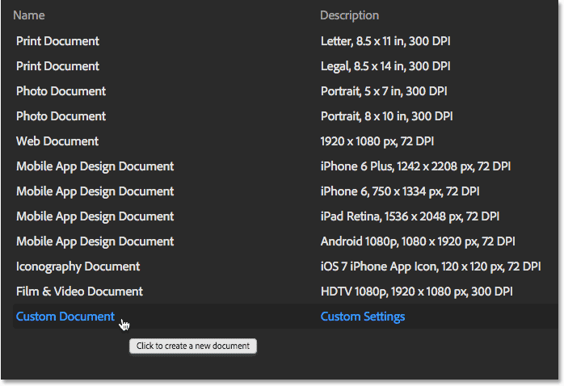
*Clicking Custom Document at the bottom of the Presets list.*

This will open Photoshop's New dialog box where you can enter the exact dimensions you need. When you click OK, Photoshop will close the Start screen and open your new document. When you're done working in your new document and close out of it, you'll be returned once again to the Start screen. In my case, I don't really want to open a new document so I'll click the **Cancel** button to close out of the dialog box:

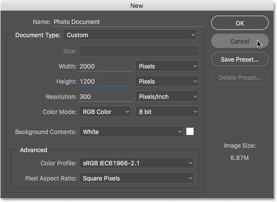
*The New dialog box.*

If you need to create a new Photoshop document and you already know that none of the preset sizes will work, you can skip the presets list entirely and jump straight to the New dialog box by clicking the **New** button. This is the same as selecting **New** from the **File** menu at the top of the screen:

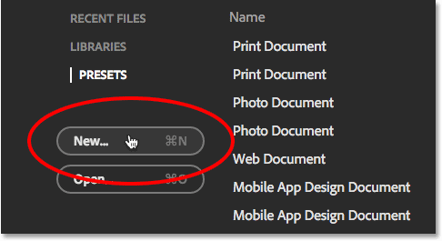
*Click the New button to open the New dialog box.*

To switch back to your list of recently-opened files, click on the words **RECENT FILES**:

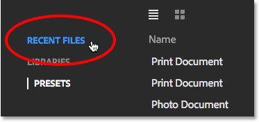
*Clicking on "RECENT FILES".*

This returns you to your Recent Files list. You may have noticed that, along with the RECENT FILES and PRESETS options, there's also a LIBRARIES option. This option allows you to manage your Creative Cloud libraries from the Start screen. Libraries are a bit beyond the scope of this tutorial so we'll cover them in a separate tutorial:

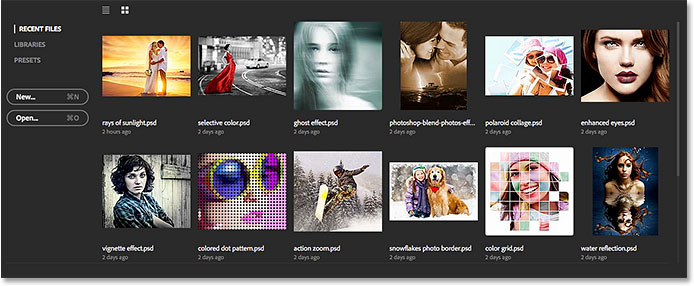
*Back to the Recent Files list.*

### Turning The Start Screen On And Off

Photoshop's new Start screen is a handy feature, but if you don't want to see it, you can tell Photoshop not to display the Start screen using a new option found in the Preferences. To get to the Preferences, on a Windows PC, go up to the **Edit** menu at the top of the screen, choose **Preferences** way down at the bottom of the list, and then choose **General**. On a Mac, go up to the **Photoshop** menu, choose **Preferences**, and then choose **General**:

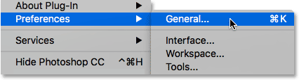
*Go to Edit > Preferences > General (Win) / Photoshop > Preferences > General (Mac).*

Here, you'll find a new option that says **Show "Start" Workspace When No Documents Are Open**. By default, this option is selected (checked). If you don't want the Start screen to appear, simply uncheck this option. If you decide later that you want to turn it back on, you can return to the Preferences and re-select it. Note that you'll need to quit and restart Photoshop for the change to take effect:

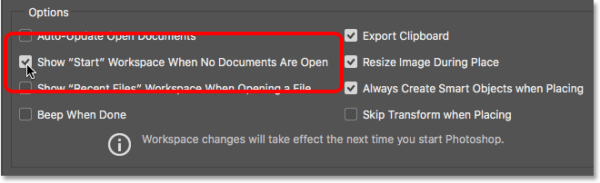
*Use this option to enable or disable the new Start screen.*

### The New Recent Files Panel

Along with the new Start screen, Photoshop CC 2015 also introduces a new **Recent Files panel** which gives us access to most of the Start screen's features but without needing to close out of our document. By default, the Recent Files panel is turned off, so let's keep it off for a moment and see how things have traditionally worked without it. I'll re-open my document by once again clicking on its thumbnail in the Start screen:

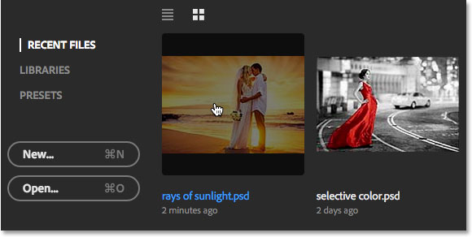
*Re-opening the document.*

As we learned previously, this closes the Start screen and opens the file:

*The re-opened file.*

With this first document open, let's say I need to open a second one as well. To do that, I would go up to the **File** menu at the top of the screen and choose **Open**:

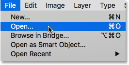
*Going to File > Open.*

Traditionally, this would open the File Explorer on a Windows PC or the Finder on a Mac where I could select or navigate to the file I need on my computer's hard drive. This is still the default behavior in Photoshop CC 2015, but as we'll see in a moment, there's now a new option:

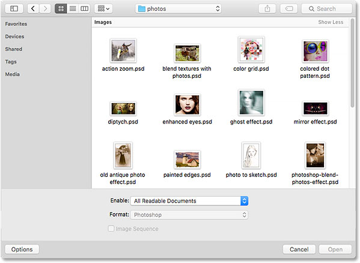
*Choosing File > Open normally opens the File Explorer (Win) or Finder (Mac).*

I'm going to simply cancel out of that window so we can see how the new Recent Files panel works. As I mentioned, by default the Recent Files panel is turned off. To turn it on, all we need to do is enable it in Photoshop's Preferences. To get to the Preferences, once again go to **Edit** > **Preferences** > **General** (Win) / **Photoshop** > **Preferences** > **General** (Mac). Then, look for the new option that says **Show "Recent Files" Workspace When Opening a File**. You'll find it directly below the new 'Show "Start" Workspace' option that we looked at a moment ago. Select the option by clicking inside its checkbox:

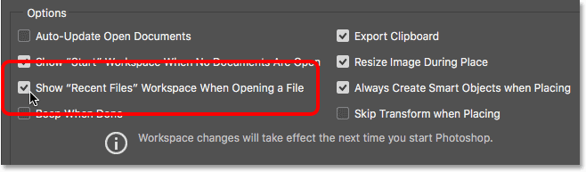
*Use this option to enable or disable the new Recent Files panel.*

Note that you'll need to quit and restart Photoshop for the change to take effect. I'll go ahead and restart my copy of Photoshop, and then with my document also re-opened, I'll once again go up to the **File** menu and chose **Open**:

*Going back up to File > Open.*

This time, rather than opening a File Explorer (Win) or Finder (Mac) window, the new Recent Files panel opens along the right of the screen (I've dimmed the rest of the interface in the screenshot just to make the Recent Files panel more obvious):

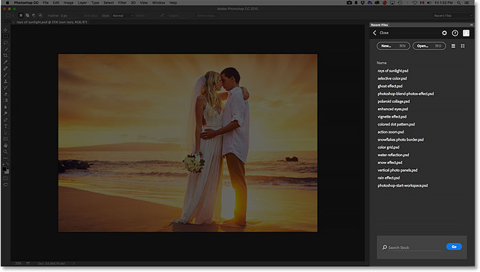
*The new Recent Files panel appears along the right.*

Taking a closer look at the panel, we see the same Recent Files list that we saw in the Start screen, giving us quick access to any image or document we've opened recently:

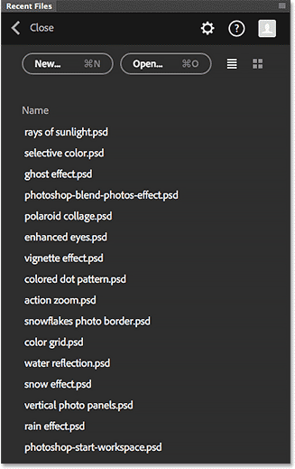
*The same Recent Files list appears in both the Start screen and the Recent Files panel.*

Also just as with the Start screen, we can switch between a simple list of names or thumbnails using the **List View** and **Thumbnails View** icons at the top:

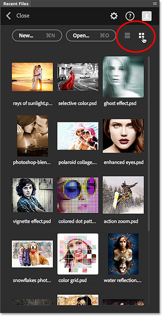
*Switching to the thumbnails view in the Recent Files panel.*

We can access files not found in the Recent Files list by clicking the **Open** button, or create new Photoshop documents by clicking the **New** button, both found at the top of the panel:

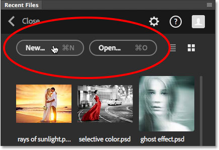
*The New and Open buttons.*

Opening a file (or creating a new document) from the Recent Files panel will close the panel automatically, but if you want to close the panel without opening or creating a file, just click the word **Close**:

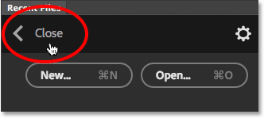
*Clicking the Close button.*

Just as with the Start screen, Adobe has saved the Recent Files panel as a new workspace in Photoshop, which means that along with going up to the File menu and choosing Open, we can also open it by clicking on the **Workspace** option in the upper right corner of the interface (here, it's set to the default **Essentials** workspace):

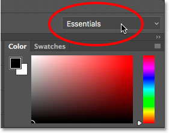
*Clicking the Workspace option.*

Then, choose **Recent Files** from the list of workspaces in the menu. Note that Recent Files will only be available as a workspace if the 'Show "Recent Files" Workspace When Opening a File' option is selected in the Preferences:

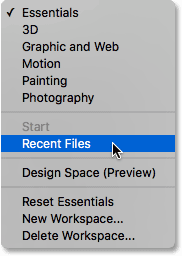
*Choosing the new Recent Files workspace.*

When you're done working and you've closed any and all document that were open, Photoshop will return you to the Start screen once again:

*Back to the Start screen.*