# The Truth About Image Resolution, File Size and the Web

> Source: [https://www.photoshopessentials.com/basics/the-truth-about-image-resolution-and-file-size-in-photoshop/](https://www.photoshopessentials.com/basics/the-truth-about-image-resolution-and-file-size-in-photoshop/)
> Downloaded and converted to Markdown.

Still think you need to lower the resolution of your images before uploading them to the web? In this tutorial, you'll learn why it's just not true, and why resolution has no effect at all on file size or download speed!

In this lesson, the sixth in my series on resizing images in Photoshop, we'll look at image resolution, file size, the popular belief that the two are somehow related, and why that belief is completely wrong.

Many people think that lowering the resolution of an image also lowers the file size of the image, allowing it to download faster over the web. But while it's true that smaller files sizes download faster, the resolution of your image has *nothing* to do with its file size. In this lesson, I'll show why there's no such thing as a "web resolution" for an image, and how easy it is to prove it!

To follow along, you can open any image in Photoshop. I downloaded [this photo](https://prf.hn/l/xnZpbNd) from Adobe Stock:

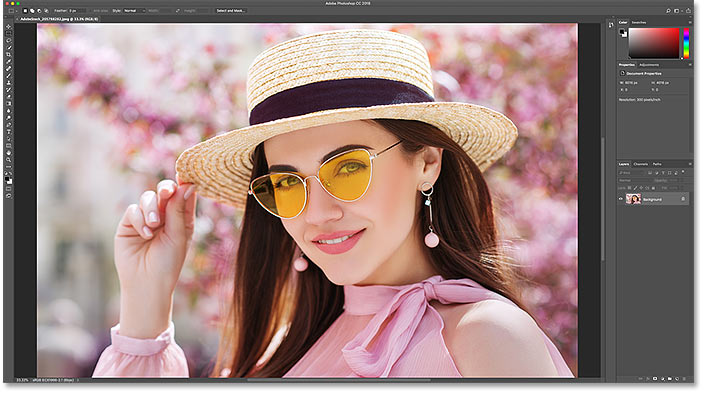
*The original image. Photo credit: Adobe Stock.*

This is lesson 6 in my [Resizing Images in Photoshop](/basics/how-to-resize-images-in-photoshop-complete-guide/) series.

Let's get started!

## Viewing the current image size

To view the current size of your image, go up to the **Image** menu in the Menu Bar and choose **Image Size**:

*Going to Image > Image Size.*

This opens Photoshop's [Image Size dialog box,](/basics/photoshops-image-size-command-features-and-tips/) with a preview window on the left and the image size options along the right. The preview window is only available in [Photoshop CC or newer](https://prf.hn/l/dlXjD2w):

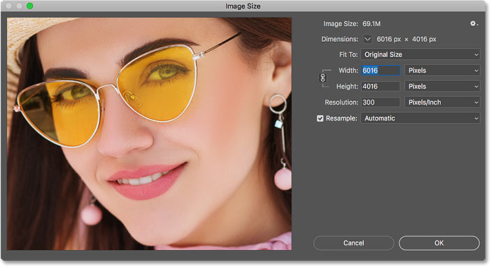
*The Image Size dialog box.*

The current image size, both in pixels and in megabytes, is found at the top. Next to the words **Image Size**, we see that my image is currently taking up **69.1M** (megabytes) in memory. And next to the word **Dimensions**, it shows that my image has a **width** of **6016 pixels** and a **height** of **4016 pixels**:

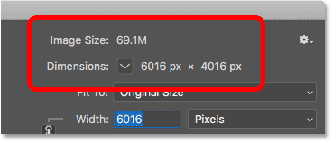
*The current size of the image.*

## The current resolution value

If you look further down, you'll find the **Resolution** option. For my image, the resolution is currently set to **300 pixels per inch**. Yours may be set to a different value, and that's fine:

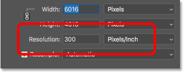
*The current image resolution.*

## What is image resolution?

So what exactly *is* image resolution, and what does this option in the Image Size dialog box actually do? There's a lot of confusion out there regarding the resolution value, especially when it comes to uploading images to the web. So let's start by learning what image resolution really means.

*Image resolution* does one thing and one thing only; it controls the size that your image will *print*. The Resolution value in Photoshop's Image Size dialog box sets the number of pixels from your image that will print per *linear inch of paper*. Higher resolution values pack *more* pixels into a linear inch, resulting in a *smaller* print size. And lower resolution values pack *fewer* pixels per inch, giving us a *larger* print size.

### How image resolution affects print size

For example, a resolution of 300 pixels per inch means that 300 pixels from the width of the image will be packed into every inch of paper from left to right. It also means that 300 pixels from the height of the image will be packed into every inch of paper from top to bottom.

To figure out the actual print size, we just divide the width and height of the image, in pixels, by the resolution value. So with my image, a width of **6016 pixels**, divided by the resolution value of **300 pixels/inch**, means that my image will print at a width of roughly **20.053 inches**. And we can do the same thing with the height. A height of **4016 pixels** divided by **300 pixels/inch** means that the height of my image, when printed, will be roughly **13.387 inches**.

### Viewing the current print size

Directly above the Resolution value in the Image Size dialog box are the **Width** and **Height** options. To view the current print size of your image, change the **measurement type** for the Width and Height from Pixels to **Inches**. And here we see that sure enough, at a resolution of 300 pixels/inch, my image will print 20.053 inches wide and 13.387 inches tall. And that's all that image resolution does. It controls the size that your image will print, and nothing else:

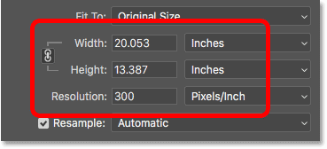
*The print size based on the current resolution.*

## Why image resolution does not affect file size

So now that we know that image resolution controls the print size of an image, let's look at why the resolution value has no effect on your photo's *file size*.

Many people believe that, before you email an image or upload it to the web, you need to lower its resolution, usually to something like 72 pixels/inch. The idea is that by lowering the resolution, you lower the file size, allowing the image to download faster. And yes, smaller file sizes *do* download faster. But lowering the resolution does *not* make the file size smaller.

The reason is that, as we learned in the [previous lesson](/basics/how-to-calculate-image-size-in-photoshop/), the file size of an image depends entirely on its *pixel dimensions*. That is, the number of pixels in the width and the number of pixels in the height. Changing the print resolution does not change the number of pixels, and therefore has no effect on the file size. And we can prove it very easily in Photoshop's Image Size dialog box.

### The Resample option

First, we need to make sure that we're changing *only* the resolution and not the number of pixels. And we do that by making sure that the **Resample** option directly below the Resolution value is turned **off** (unchecked). *Resampling* means that we're changing the number of pixels. And if we change the resolution while Resample is turned on, the pixel dimensions will change along with it. In this case, we want to change only the resolution value, so make sure Resample is off:

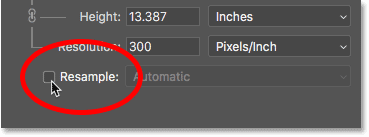
*Turning the Resample option off.*

### The current image size, pixel dimensions and resolution

Notice that, at a resolution of 300 pixels/inch, my image currently has a file size of **69.1 megabytes**. And, it has a width of **6016 pixels** and a height of **4016 pixels**. I show you exactly how image size and pixel dimensions are related in my [how to calculate image size](/basics/how-to-calculate-image-size-in-photoshop/) tutorial:

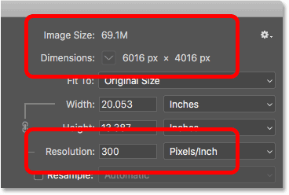
*The current file size and resolution.*

### Lowering the resolution value

I'll lower the resolution from 300 pixels/inch down to that popular "web resolution" of **72 pixels/inch**:

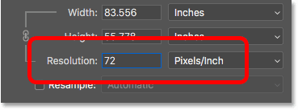
*Lowering the image resolution.*

But even though the resolution value has been lowered, the pixel dimensions have not changed. The image is still **6016 pixels** wide and **4016 pixels** tall. And because the pixel dimensions have not changed, the file size also has not changed. It's still exactly the same as before at **69.1M**:

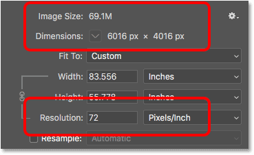
*Lowering the resolution did not change the file size or pixel dimensions.*

In fact, the only thing that *did* change was the *print size* of the image. By lowering the resolution to just 72 pixels/inch, the width of the image, when printed, has increased from 20 inches to over **83 inches**. And the height of the print has increased as well, from 13 inches to nearly **56 inches**. But, while the print size has changed dramatically, the file size has not changed at all, and so the image would not download any faster if you were to upload it to the web:

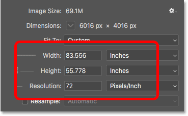
*Lowering the resolution did increase the print size.*

You can learn more about where the idea of a "web resolution" comes from in my article on the [72ppi web resolution myth](/essentials/the-72-ppi-web-resolution-myth/).

### Increasing the resolution value

Let's see what happens if we do the opposite and *increase* the resolution. I'll raise it from 72 pixels/inch up to something crazy, like **3000 pixels/inch**, which is way beyond anything you would ever need. I show you exactly how much resolution you need for high quality prints in my [resizing images for print](/basics/how-to-resize-images-for-print-with-photoshop/) lesson in this series:

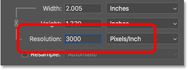
*Increasing the image resolution.*

Again, we see that while the resolution has changed, the pixel dimensions have not. And because the pixel dimensions are the same, the file size also remains the same:

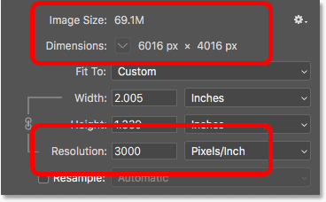
*Increasing the resolution did not change the file size or pixel dimensions.*

As expected, the only thing that *did* change was the print size. At a resolution of 3000 pixels/inch, the image will now print at only **2.005 inches** wide and just **1.339 inches** tall. But it won't look any different on your screen, and it won't download any faster or slower:

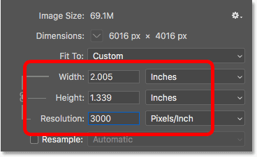
*Increasing the resolution again changed the print size but not the file size.*

If you *do* need to change the file size of your image, you'll need to change the number of pixels. I show you exactly how to do that in my [resizing images for email and photo sharing](/basics/how-to-resize-images-for-email-and-photo-sharing-with-photoshop/) tutorial.

And there we have it! That's a quick look at how image resolution and file size are related, or *not* related, in Photoshop! In the next lesson, we'll look at the challenges of [resizing pixel art](/basics/how-to-resize-pixel-art-in-photoshop/), screenshots and similar types of graphics, and how to get the best results!

You can jump to any of the other lessons in this [Resizing Images in Photoshop](/basics/how-to-resize-images-in-photoshop-complete-guide/) chapter. Or visit our [Photoshop Basics](/basics/) section for more topics!