# How to Blend Two Images in Photoshop

> Source: [https://www.photoshopessentials.com/basics/three-ways-to-blend-two-images-together-photoshop/](https://www.photoshopessentials.com/basics/three-ways-to-blend-two-images-together-photoshop/)
> Downloaded and converted to Markdown.

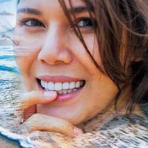

Learn how to blend two images together in Photoshop using layer opacity, layer blend modes and layer masks. Watch the video or follow along with the written tutorial below it!

In this tutorial, I'll show you three easy ways to blend two images together in Photoshop! We'll start with the most basic way to blend images, and that's by using the Opacity option in the Layers panel. Then we'll look at how to get more interesting and creative results using Photoshop's layer blend modes. And finally, we'll learn how to blend two images seamlessly together using a layer mask. I'll also include a quick tip in each of the three sections to help speed up your workflow and get the best results.

Let's get started!

## How to blend images In Photoshop

I used Photoshop CC here but everything from CS6 to Photoshop 2022 or newer will work. You can [get the latest version of Photoshop here](https://prf.hn/l/dlXjD2w).

You can also [download this tutorial as a PDF](/print-ready-pdfs/) and get my [Complete Guide to Layer Blend Modes](/get-our-photoshop-layer-blend-modes-complete-guide-pdf/) PDF as bonus!

### Method 1: The Layer Opacity Option

The first way we'll look at for blending two images together is by using Photoshop's **layer opacity** option. Here's the [first image](https://prf.hn/l/aQXvJyq) I'll be using:

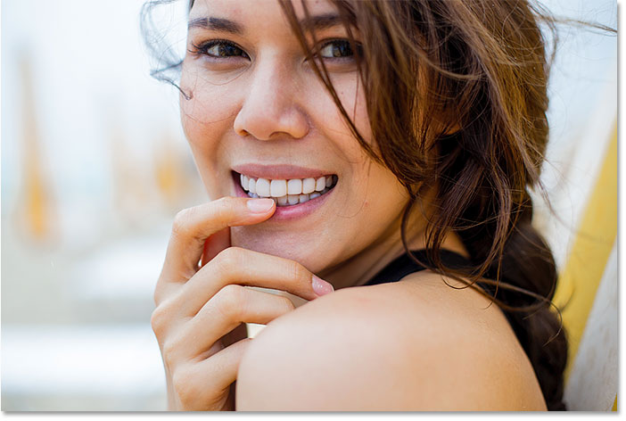
*The first image. Photo credit: Adobe Stock.*

And here's the [second image](https://prf.hn/l/Gl8w54Z):

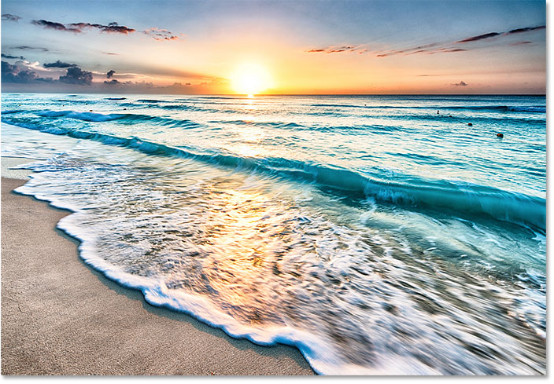
*The second image. Photo credit: Adobe Stock.*

If we look in the [Layers panel](/basics/layers/essential-layers-panel-preferences/), we see both images on their own separate layers. The beach photo is on the [Background layer](/basics/background-layer-photoshop-cc/), and the portrait is on "Layer 1" above it:

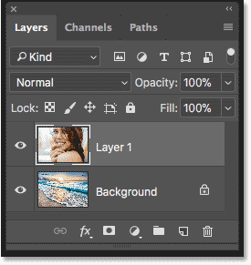
*The Layers panel showing each image on a separate layer.*

[Related: How to move images into the same Photoshop document](/basics/5-ways-move-images-photoshop-documents/)

#### The Opacity Value

The **Opacity** option is found in the upper right of the Layers panel. By default, it's set to 100%, which means that the currently-selected layer ("Layer 1") is completely blocking the layer below it from view:

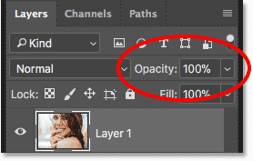
*The Opacity option, set to 100% by default.*

The Opacity value controls a layer's level of transparency. By simply lowering the value, we make the layer more transparent, allowing some of the image below it to show through. The more we lower the opacity, the more the top image will fade into the bottom image. I'll lower the opacity from 100% down to 75%:

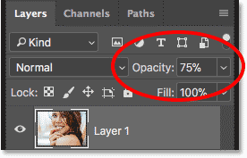
*Lowering the opacity of the top layer to 75%.*

This means that we're now blending 75% of the image on the top layer with 25% of the image on the bottom layer. And here we see that the woman is starting to blend in with the beach photo:

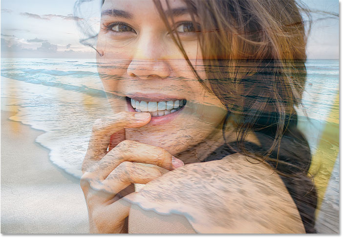
*The result with the top layer's opacity lowered to 75%.*

If I wanted to fade her even more into the background, I could simply lower the opacity value even further. I'll lower it to 30%:

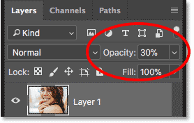
*Setting the Opacity value to 30 percent.*

At 30% opacity, we're seeing just 30% of the top image and 70% of the bottom image, creating a nice blending effect. You'll want to adjust the opacity value as needed for your images:

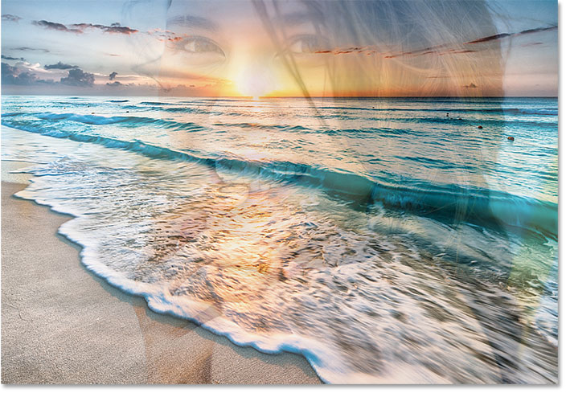
*The result with the top layer's opacity at 30%.*

#### Quick Tip: Setting the Opacity value from the keyboard

Here's a quick tip to speed up your workflow. You can change a layer's opacity value directly from the keyboard. Press 1 for 10%, 2 for 20%, 3 for 30%, and so on. Press two numbers quickly, one right after the other, for more specific values (like 2 and then 5 for 25%). You can also press 0 for 100% opacity, or quickly press 0 twice for 0%.

### Method 2: Layer Blend Modes

The second way we'll look at for blending two images together is by using Photoshop's **layer blend modes**. Blend modes are great for blending any two images together, but they're especially useful for blending a texture with a photo. Here's a portrait [image](https://prf.hn/l/1MYazZl) that I have open:

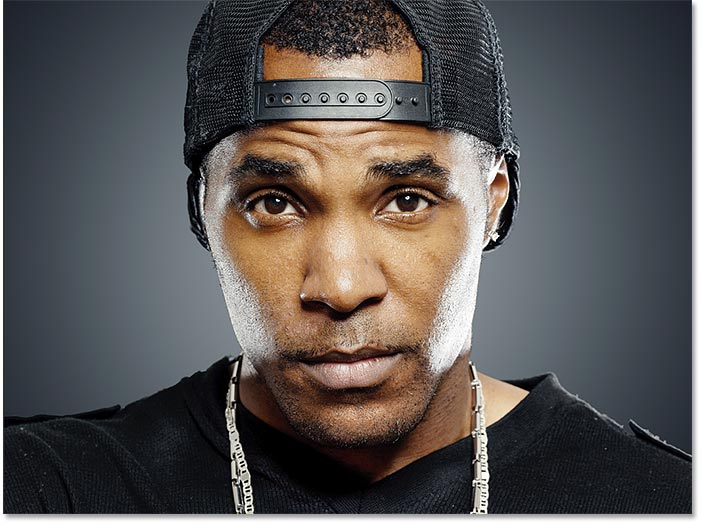
*The first image. Photo credit: Adobe Stock.*

I'll blend the portrait with this [texture](https://prf.hn/l/PJRede5) image:

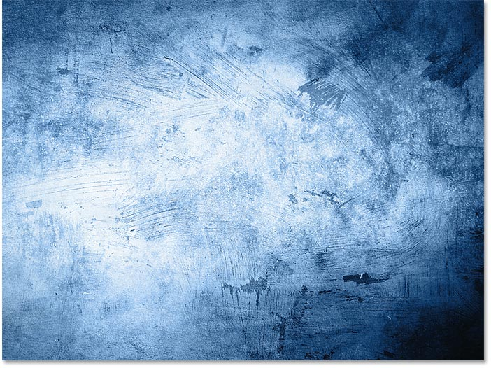
*The second image. Photo credit: Adobe Stock.*

Again if we look in the Layers panel, we see each image on a separate layer. The portrait is on the Background layer and the texture is on the layer above it:

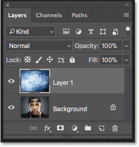
*The Layers panel again showing each image on a separate layer.*

#### The Blend Mode Option

Blend modes in Photoshop are different ways that layers can interact with each other. The Blend Mode option is found in the upper left of the Layers panel, directly across from the Opacity option. By default, a layer's blend mode is set to Normal. "Normal" just means that the layer is not blending at all with the layers below it:

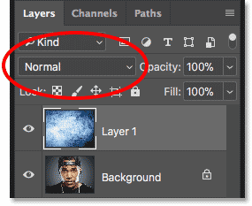
*The Blend Mode option.*

Click on the word "Normal" to open a menu with lots of different blend modes to choose from. We won't go through all of them here, but I cover the most important ones in detail in my [Essential Blend Modes](/photo-editing/layer-blend-modes/intro/) tutorial. Three of the most popular and useful blend modes you'll want to try are **Multiply**, **Screen** and **Overlay**. The [Multiply](/photo-editing/layer-blend-modes/multiply/) blend mode creates a darkening effect, [Screen](/photo-editing/layer-blend-modes/screen/) creates a brightening effect, and [Overlay](/photo-editing/layer-blend-modes/overlay/) blends the two layers to increase the overall contrast:

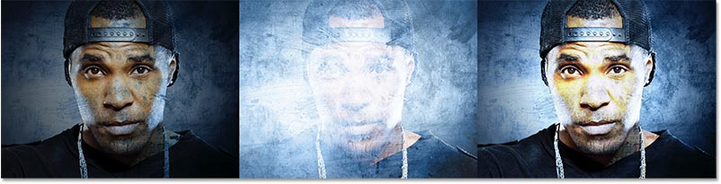
*The result with the blend mode set to Multiply (left), Screen (center) and Overlay (right).*

The results you get from the various blend modes will depend entirely on your images. In my case, I get the best result using the **Soft Light** blend mode:

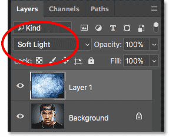
*Changing the blend mode to Soft Light.*

Like the Overlay blend mode, Soft Light blends the two images together in a way that boosts the overall contrast. The difference is that Soft Light produces a more subtle and natural looking effect:

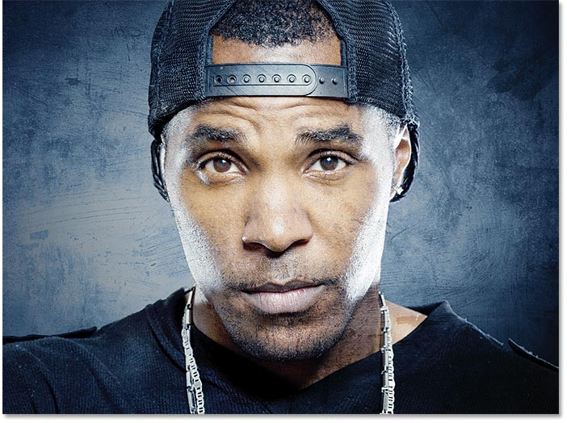
*The result with the blend mode of the texture layer set to Soft Light.*

Another blend mode that works really well with these two images is **Divide**:

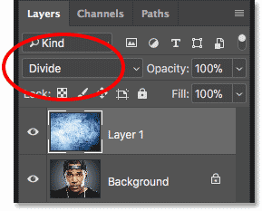
*Changing the blend mode to Divide.*

Divide is one of the lesser-known and rarely-used blend modes in Photoshop. But with these two images, the effect actually looks pretty cool:

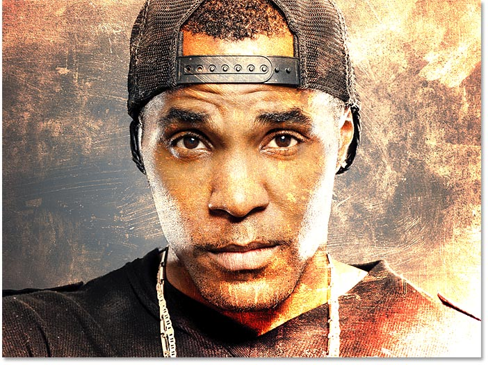
*The blending effect with the texture layer set to Divide.*

#### Combining blend modes with layer opacity

Once you've chosen a blend mode, you can fine-tune the result by adjusting the layer's opacity, just as we saw earlier. I'll leave the blend mode of the texture layer set to Divide and I'll lower the opacity from 100% down to 50%:

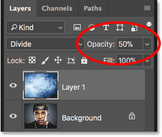
*Leaving the blend mode set to Divide and lowering the opacity to 50%.*

And here's the result:

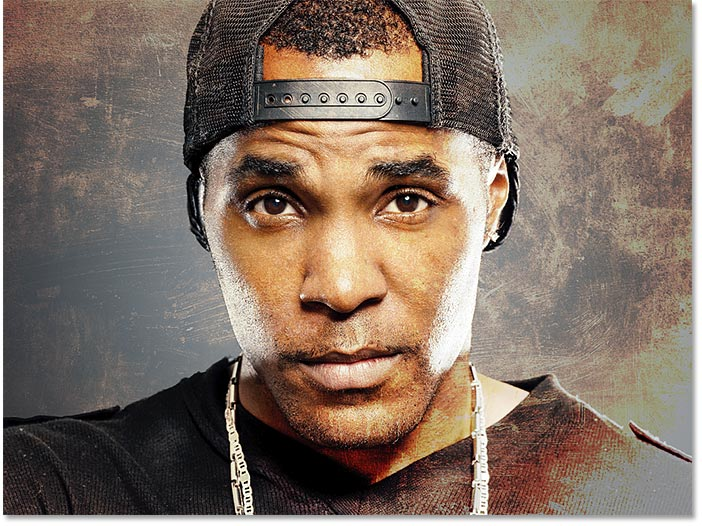
*Combining the blend mode with a lower opacity produces a less intense effect.*

#### Quick Tip: How to cycle through blend modes from the keyboard

Here's another quick tip to help speed up your workflow and make working with blend modes easier. You can cycle through Photoshop's various blend modes directly from your keyboard. Press the letter **V** to quickly select the **Move Tool**. Then, press and hold your **Shift** key and use the **plus** ( **+** ) and **minus** ( **-** ) keys to move up or down through the list. This lets you quickly try out the different blend modes to find the one that works best.

### Method 3: Using A Layer Mask

The third way we'll look at for blending two images in Photoshop, and by far the most popular way, is by using a **layer mask**. Unlike the layer opacity option or the blend modes which blend entire images as a whole, layer masks let us control exactly where the two images blend together. There's lots that we can do with layer masks, more than we could cover in a single tutorial. So here, we'll just learn the basics.

Here's the first [image](https://prf.hn/l/kxW1y1g) I'll be using:

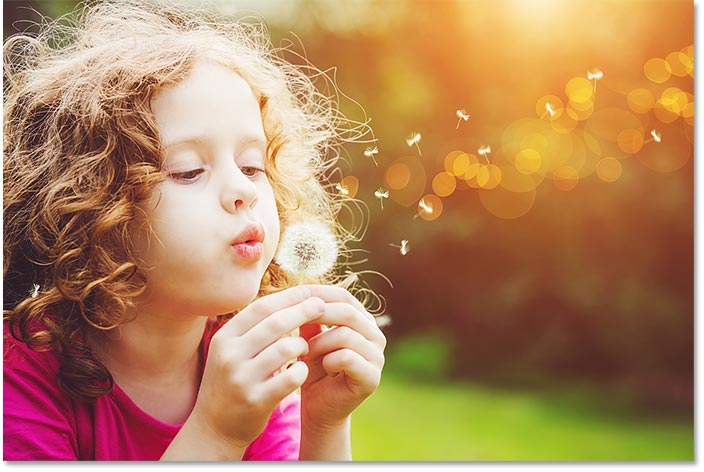
*The first image. Photo credit: Adobe Stock.*

And here's the second [image](https://prf.hn/l/eYL8l1Y):

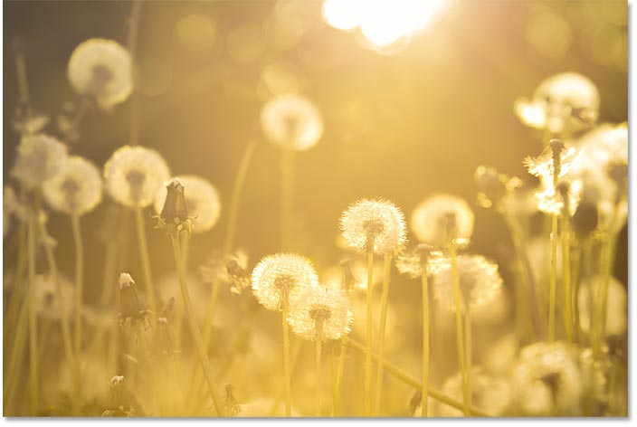
*The second image. Photo credit: Adobe Stock.*

Again looking in the Layers panel, we see each photo on a separate layer. The dandelion photo is on the Background layer and the girl is on "Layer 1" above it:

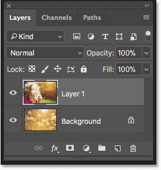
*Each photo is on a separate layer.*

#### Adding a layer mask

To add a layer mask, first make sure the top layer is selected. Then, click the **Add Layer Mask** icon at the bottom of the Layers panel:

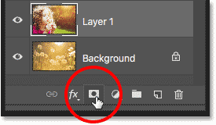
*Clicking the Add Layer Mask icon.*

A **layer mask thumbnail** appears next to the layer's preview thumbnail:

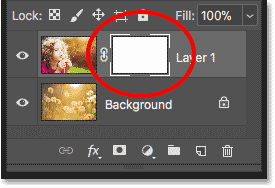
*The new layer mask thumbnail.*

#### How a layer mask works

Layer masks control the transparency of a layer, just like we saw with the Opacity option in the Layers panel. But while the Opacity option affects the transparency of the entire layer as a whole, a [layer mask](/basics/understanding-photoshop-layer-masks/) lets us add different levels of transparency to different parts of the layer. In other words, we can use a layer mask to show some areas while hiding others, making layer masks perfect for blending images.

They work by using black and white. Any part of the layer where the layer mask is filled with white remains visible. And any part of the layer where the mask is filled with black is hidden. Let's see how we can quickly blend our two images together by drawing a black-to-white gradient on the layer mask.

#### Selecting the Gradient Tool

Select the [Gradient Tool](/basics/how-to-draw-gradients-with-the-gradient-tool-in-photoshop/) from the Toolbar:

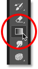
*Selecting the Gradient Tool.*

#### Choosing the Black, White gradient

With the Gradient Tool selected, go up to the Options Bar and click on the down-pointing arrow next to the gradient swatch:

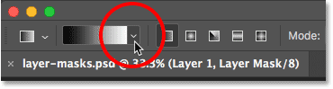
*Clicking the arrow beside the gradient swatch.*

In the Gradient Picker, choose the **Black, White** gradient by double-clicking on its thumbnail (third from the left, top row):

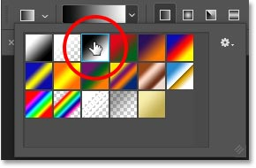
*Choosing the Black, White gradient.*

#### Blending the two images together

Make sure the layer mask, not the image itself, is selected by clicking on the layer mask thumbnail. You should see a highlight border around it:

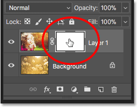
*Clicking the thumbnail to select the layer mask.*

Then, click on the image and drag out a black-to-white gradient. Remember that black will hide that part of the layer, and white will show it. In my case, I want to keep the left side of the photo (the part with the girl) visible, so the left side of the mask will need to be white. I want the right side to be hidden, which means the right side of the mask needs to be black. Since the gradient will start with black and end with white, I'll click on the right side of the image and drag horizontally over to the left. Press and hold your **Shift** key as you drag to move straight across:

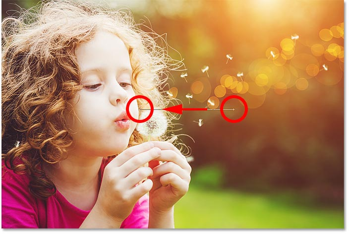
*Drawing a black-to-white gradient on the layer mask from right to left.*

When you release your mouse button, Photoshop draws the gradient on the layer mask and blends the two photos together. Here, we're seeing the girl from the top image blending into the dandelions from the bottom image. If you're not happy with the first result, simply draw another gradient on the mask to try again:

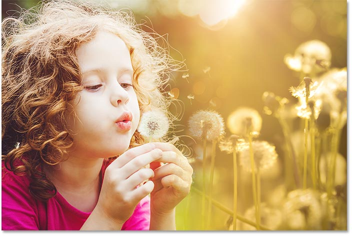
*The two photos are now blending together.*

#### Viewing the layer mask

If we look at the layer mask thumbnail in the Layers panel, we see where the gradient was drawn. The black area on the right is where the top image is hidden in the document, allowing the photo on the Background layer to show through. And the white area on the left is where the top image remains visible:

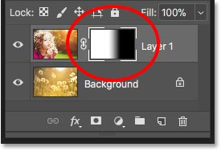
*The layer mask thumbnail showing the gradient.*

We can also view the actual layer mask itself in the document. If you press and hold the **Alt** (Win) / **Option** (Mac) key on your keyboard and click on the layer mask thumbnail, you'll switch your view in the document from the images to the layer mask. This makes it easier to see exactly what's going on. Again, the area of black on the right is where the top layer is hidden from view, and the white area on the left is where it's visible.

But notice the gray area in the middle, where the gradient gradually moves from black to white. This area creates a smooth transition between the two layers, allowing them to blend seamlessly together. To switch your view from the layer mask back to the images, again press and hold your Alt (Win) / Option (Mac) key and click on the layer mask thumbnail in the Layers panel:

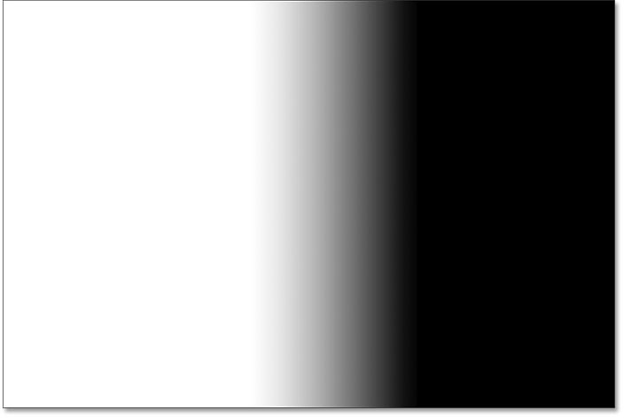
*The dark to light gradient in the middle is what allows the two images to blend seamlessly together.*

#### Quick Tip: How to toggle a layer mask on and off

Here's a quick tip for working with layer masks. You can toggle a layer mask on and off by pressing and holding your **Shift** key and clicking the **layer mask thumbnail** in the Layers panel. Click the thumbnail once to temporarily disable the mask and view the entire layer. A red "X" will appear in the thumbnail, letting you know that the mask is disabled. Hold Shift and click the thumbnail again to turn the layer mask back on:

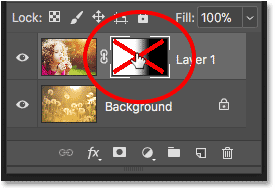
*Hold Shift and click the thumbnail to toggle the layer mask on and off.*

And there we have it! That's a quick look at how to blend two images together using the layer opacity option, layer blend modes, and a layer mask, in Photoshop!

To learn more about blending images with layer masks, see our [Layer Masks and Gradients](/basics/blending-photos-with-layer-masks-and-gradients-in-photoshop/) tutorial. Use our [Layers Learning Guide](/photoshop-layers-learning-guide/) to learn more about Photoshop layers, or visit our [Photoshop Basics](/basics/) section for more tutorials!