# How to use Free Transform in Photoshop

> Source: [https://www.photoshopessentials.com/basics/transform-and-warp-images-with-free-transform-in-photoshop-cc-2019/](https://www.photoshopessentials.com/basics/transform-and-warp-images-with-free-transform-in-photoshop-cc-2019/)
> Downloaded and converted to Markdown.

Learn how to scale, rotate, flip, skew and distort images using the Free Transform command in Photoshop! Now fully updated for Photoshop CC 2020!

In this tutorial, I show you how to use Photoshop's Free Transform command to scale, rotate, flip, skew and distort images. You'll learn tips for getting the most out of Free Transform, and how to transform images without losing quality.

We'll start with the basics and learn how to scale and rotate images. Then we'll look at Photoshop's more advanced transformations, like Skew, Distort and Perspective, along with the best ways to use them. And at the end, I'll show you how to get more impressive results from the standard Rotate and Flip commands, including how to create a four-way mirror image effect!

This tutorial includes changes Adobe made to Free Transform as of Photoshop CC 2019, along with additional improvements in Photoshop 2020. So for best results, you'll want to be using the [latest version of Photoshop](https://adobe.prf.hn/click/camref:1100lrdjJ/destination:https%3A%2F%2Fwww.adobe.com%2Fproducts%2Fphotoshop.html). If you've been using Photoshop for a while and just need to catch up on the most recent changes to Free Transform, check out my [New Features and Changes](/basics/free-transform-in-photoshop-cc-2019-new-features-and-changes/) tutorial.

Let's get started!

### The document setup

To follow along, go ahead and open any image. I'll use [this image](https://adobe.prf.hn/click/camref:1100lrdjJ/destination:https%3A%2F%2Fstock.adobe.com%2Fimages%2Fabstract-painting-butterfly%2F233158132) from Adobe Stock:

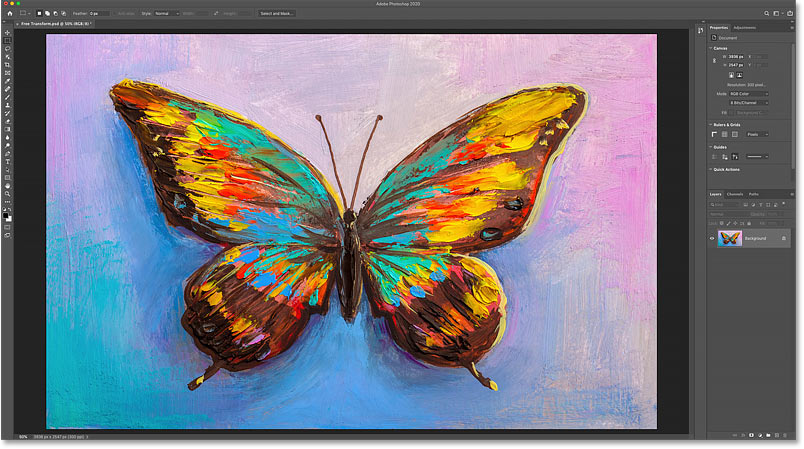
*The original image. Credit: Adobe Stock.*

In the [Layers panel](/photoshop-layers-learning-guide/), the image appears on the Background layer:

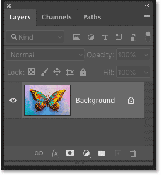
*The Layers panel showing the image on the Background layer.*

## Which types of layers can we transform in Photoshop?

Photoshop lets us transform virtually any type of layer, including pixel layers, type layers, shape layers, and even smart objects.

But one layer we *can't* transform is the [Background layer](/basics/background-layer-photoshop-cc/), and that's because the Background layer is locked:

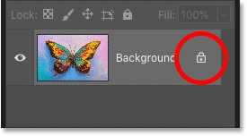
*The Background layer's lock icon.*

The Free Transform command is found under the **Edit** menu in the Menu Bar. But with the Background layer locked, the command is grayed out:

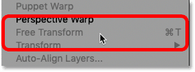
*Free Transform is not available.*

### How to unlock the Background layer

To fix that, simply unlock the Background layer by clicking the **lock icon**:

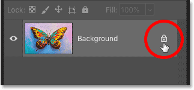
*Clicking the lock icon.*

Then go back up to the **Edit** menu and you'll see Free Transform ready to be selected:

*Free Transform is now available.*

## How to avoid transparency when transforming a layer

The only problem now is that if I select Free Transform, and then I scale my image smaller by clicking and dragging one of the handles, I end up with a *checkerboard pattern* behind the image. The checkerboard pattern is how Photoshop represents transparency:

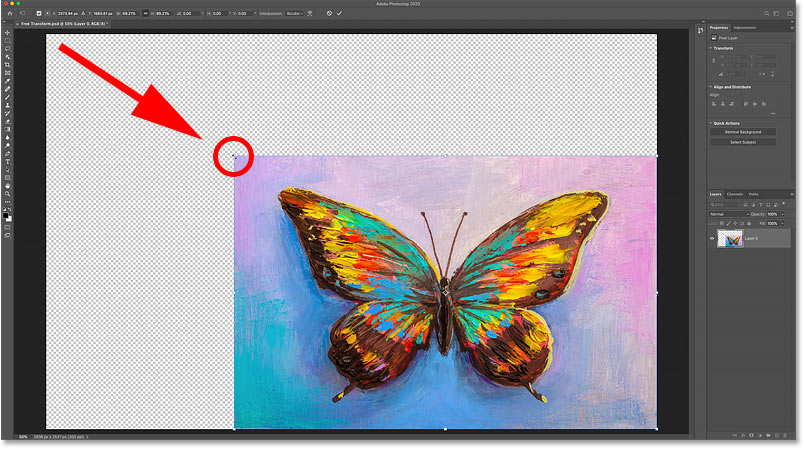
*Scaling the image smaller fills the empty canvas space with transparency.*

And the reason we're seeing transparency is because I currently have no other layers below my image:

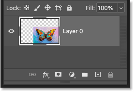
*The document contains a single layer.*

### Adding a new layer below the image

So to fix that, I'll add a new layer. And my favorite type of layer to use for a background is a Solid color fill layer.

First, I'll press the **Esc** key on my keyboard to cancel the Free Transform command without saving my changes. Then I'll click the **New Fill or Adjustment Layer** icon at the bottom of the Layers panel:

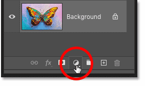
*Clicking the New Fill or Adjustment Layer icon.*

And I'll choose **Solid Color** from the list:

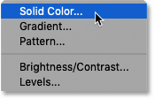
*Adding a Solid Color fill layer.*

The great thing about a Solid Color fill layer is that it's easy to choose any color you need from the Color Picker. For this tutorial, I'll keep things simple and choose white for my background, and then I'll click OK to close the Color Picker:

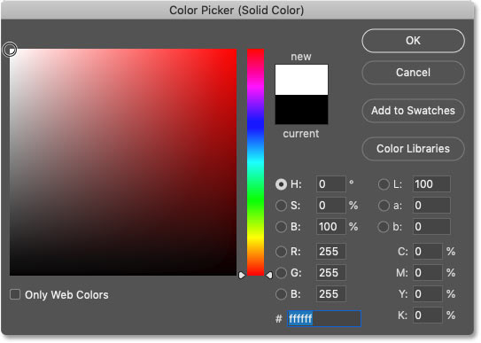
*Choosing white from the Color Picker.*

Then back in the Layers panel, I'll drag the Solid Color fill layer below the image:

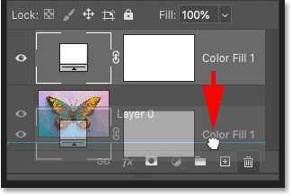
*Dragging the fill layer below the image.*

I'll click on the image layer to select it:

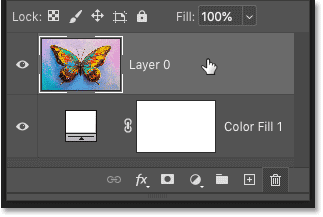
*Selecting the image layer.*

And this time, if I select Free Transform from the Edit menu, and then I drag a handle to scale the image smaller, we see the white background behind the image instead of transparency. Again, I'll press the **Esc** key on my keyboard to cancel my changes:

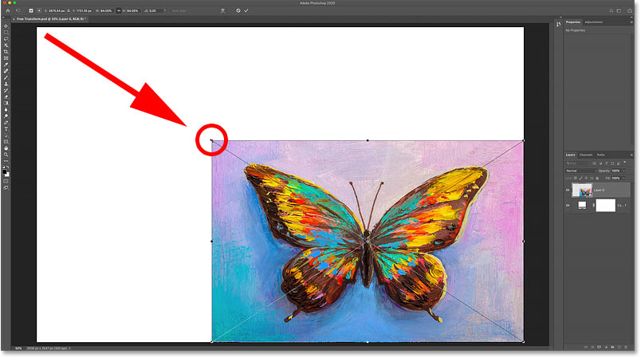
*Scaling the image smaller reveals the Solid Color fill layer behind it.*

## How to transform images without losing quality

Before we look at all the ways to transform images in Photoshop, there's one more important topic we need to cover, and that's the difference between *destructive* and *non-destructive* transformations.

Each time we scale, rotate, or in some way transform a pixel-based layer, we lose image quality. That's because Photoshop needs to redraw the pixels every time. This is known as a destructive edit because we're making permanent changes to the image.

To avoid losing quality, a better way to work is to first convert your layer into a smart object. [Smart objects](/basics/how-to-edit-and-replace-smart-object-contents-in-photoshop/) are like containers that protect the image inside them. Any transformations we make to a smart object are applied to the smart object itself, while the image inside it remains unharmed. And each time we apply a new transformation, Photoshop redraws the smart object based on that original image data. So no matter how many transformations we apply to a smart object, the result always looks great.

You can learn more about smart objects in my [Resizing Images Without Losing Quality](/basics/scale-resize-images-smart-objects-photoshop/) tutorial.

### How to convert a layer to a smart object

To convert your layer into a smart object, **right-click** (Win) / **Control-click** (Mac) on the layer in the Layers panel:

*Right-clicking (Win) / Control-clicking (Mac) on the layer.*

And then choose **Convert to Smart Object** from the menu:

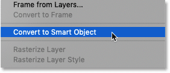
*Choosing "Convert to Smart Object".*

A **smart object icon** appears in the lower right of the **preview thumbnail**, telling us that the layer is now inside a smart object, and we're ready to start transforming the image:

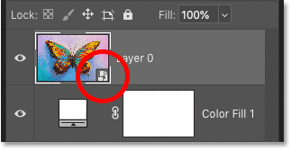
*A smart object icon appears.*

## Which Transform options are available in Photoshop?

All of Photoshop's Transform options can be accessed by going up to the **Edit** menu and choosing **Transform**:

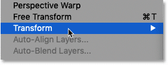
*Going to Edit > Transform.*

From here, we can choose to Scale or Rotate the image, Skew it, perform Distort and Perspective transformations, and even Warp the image. I cover [how to warp images](/basics/warp-images-with-the-enhanced-warp-tool-in-photoshop-cc-2020/) in a separate tutorial.

We also have standard options for rotating the image 90 or 180 degrees. And we can flip the image either horizontally or vertically:

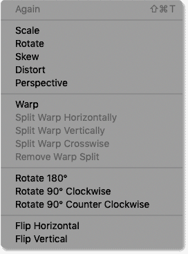
*Photoshop's Transform options.*

## What is Free Transform?

But while you *can* keep coming back to the Edit menu to select these different options, there's really no point. That's because all of Photoshop's Transform commands can be selected using a single command known as **Free Transform**, a one-stop-shop for all your image transformation needs.

You can select Free Transform from here in the Edit menu. But a faster way is to use the keyboard shortcut, **Ctrl**+**T** (Win) / **Command**+**T** (Mac). Even if you don't like keyboard shortcuts, this one is definitely worth knowing:

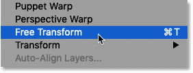
*Going to Edit > Free Transform.*

### The transform box and handles

As soon as you select Free Transform, you'll see the **transform box and handles** around the image. There's a handle on the top, bottom, left and right, plus one in each corner:

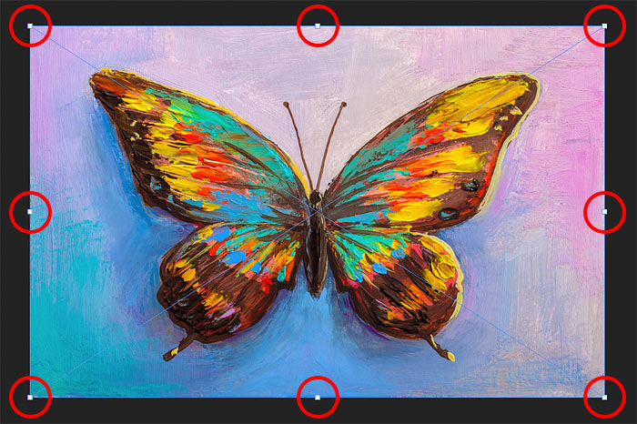
*The Free Transform box and handles.*

### How to change the color of the transform box

If the color of the transform box outline is hard to see in front of your image, you can choose a different color.

First, press the **Esc** key on your keyboard to cancel the Free Transform command . Then open [Photoshop's Preferences](/basics/reset-photoshop-preferences/). On a Windows PC, go up to the **Edit** menu. On a Mac, go up to the **Photoshop CC** menu. From there, choose **Preferences**, and then **Guides, Grid & Slices**:

*Opening the Guides, Grid & Slices Preferences.*

Down at the bottom of the dialog box is the **Control Color** option. This is the current color of the transform box:

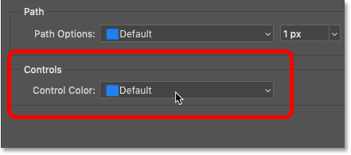
*The Control Color option.*

The default color is a light blue, but you can click on the option and choose a different color from the list. The **Classic** option is a great choice because it displays a dark outline over light areas of the image and a light outline over dark areas, making it very easy to see.

Once you've chosen a color, click OK to close the Preferences dialog box. And the next time you open Free Transform, you'll see the new color:

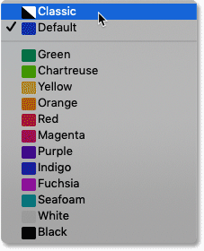
*The various color choices for the Free Transform box.*

## How to scale an image with Free Transform

Let's look at all the ways we can transform images using Photoshop's Free Transform command, starting with **Scale**.

### Scaling an image proportionally

To scale an image, click and drag any of the handles. As of Photoshop CC 2019, the default behavior of Free Transform is to scale images proportionally. So no matter which handle you drag, you'll scale the image with the aspect ratio locked in place.

Here I'm dragging the top left corner handle inward:

*Dragging a handle to scale the image proportionally.*

### Scaling non-proportionally

To scale non-proportionally, hold your **Shift** key as you drag a handle.

Here I'm squishing the image by holding Shift while dragging the left side handle inward:

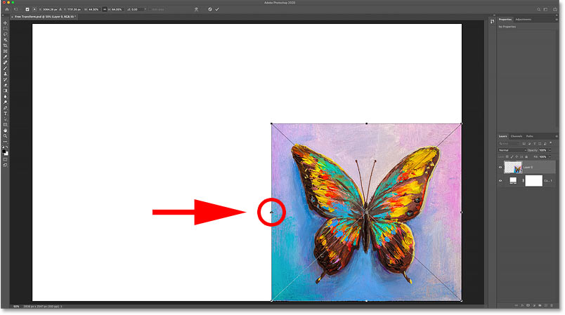
*Holding Shift while dragging a handle to scale non-proportionally.*

To switch back to scaling proportionally, release your Shift key and then drag a handle.

But notice that Photoshop does not restore the original aspect ratio of the image. Instead, we're locked into the *new* aspect ratio that we created after scaling non-proportionally:

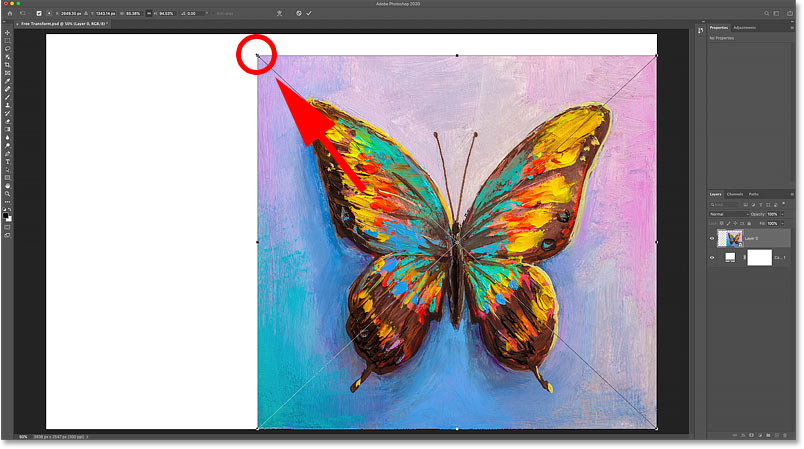
*Photoshop does not restore the original aspect ratio automatically.*

### How to undo steps while in Free Transform

New as of Photoshop CC 2020, we can now undo multiple steps while in Free Transform. So if you need to get back to the original aspect ratio, or to some other previous step, go up to the **Edit** menu and choose **Undo**. Or press **Ctrl+Z** (Win) / **Command+Z** (Mac) on your keyboard. Press the shortcut repeatedly to undo as many steps as needed.

To redo a step, press **Shift+Ctrl+Z** (Win) / **Shift+Command+Z** (Mac). Press repeatedly to redo multiple steps:

*Going to Edit > Undo.*

And after undoing a couple of steps, I'm back to the original aspect ratio:

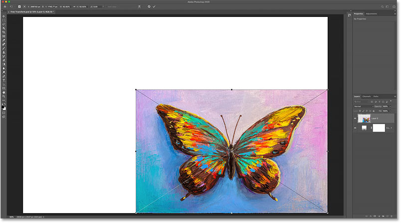
*The original aspect ratio is restored.*

### Photoshop CC 2020 Update: Scaling shape layers

Back in Photoshop CC 2019, Free Transform behaved differently with [shape layers](/basics/drawing-custom-shapes-with-the-shapes-panel-in-photoshop-cc-2020/) than it did with pixel or type layers. Dragging a handle *without* holding Shift would scale the shape layer non-proportionally. And holding Shift would scale it proportionally.

Thankfully, this issue has been fixed as of Photoshop CC 2020. Pixel layers, type layers and shape layers now behave the same way. Drag a handle without holding Shift to scale proportionally, or hold Shift to scale non-proportionally.

### How to move the image with Free Transform

To move the image around inside the canvas while transforming it, click and drag inside the Free Transform box:

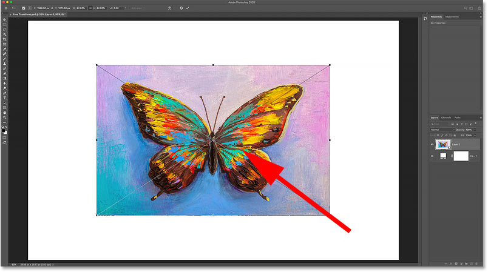
*Dragging the image back into the center of the canvas.*

### How to scale an image from its center

To scale an image proportionally from its center, press and hold your **Alt** (Win) / **Option** (Mac) key as you drag a handle.

Or to scale non-proportionally from the center, hold **Shift**+**Alt** (Win) / **Shift**+**Option** (Mac) as you drag:

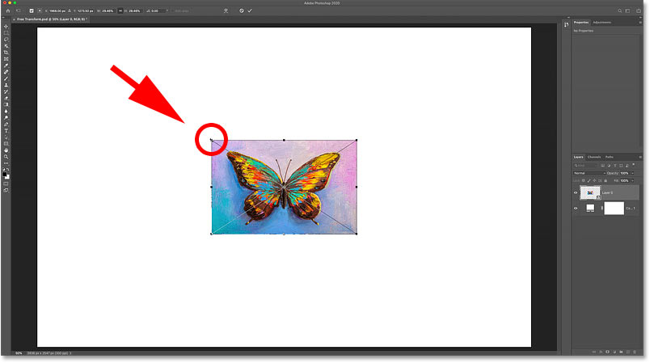
*Holding Alt (Win) / Option (Mac) to scale from the center of the image.*

[Related: How to restore the classic Free Transform behavior in Photoshop](/basics/restore-legacy-free-transform-photoshop-cc-2019/)

## How to accept the transformation

I'll scale my image to the size I need:

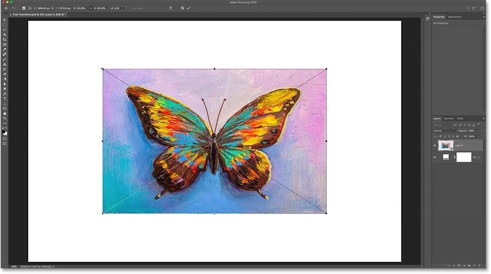
*Scaling the image to the new size.*

And then, if you're happy with the size of the image and you have no other Transform commands to apply, you can accept your changes and close Free Transform by clicking the **checkmark** in the Options Bar. Or press **Enter** (Win) / **Return** (Mac) on your keyboard:

*Clicking the checkmark in the Options Bar.*

## How to restore the original image size

If you converted your image to a smart object as I showed you how to do earlier, then it's easy to restore the original size of your image even after you've scaled it and closed Free Transform.

First, press **Ctrl**+**T** (Win) / **Command**+**T** (Mac) to re-select the Free Transform command. Then, notice in the Options Bar that the **Width** and **Height** fields are both showing values less than 100%. In my case, I'm seeing a value of 60% for both the Width and the Height:

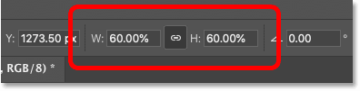
*The current Width and Height of the scaled image.*

Because we're working with a smart object, Photoshop knows that the original image inside the smart object is larger than the scaled size. To restore the original size, first make sure the **link icon** between the Width and Height fields is selected:

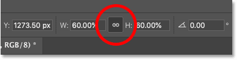
*Make sure the Width and Height values are linked.*

Then simply change the Width or Height value to **100%**. The other value will change along with it. Press **Enter** (Win) / **Return** (Mac) to accept the new size:

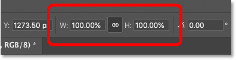
*Manually setting the Width and Height back to 100%.*

And now the image is back to its original size, and with no loss in quality:

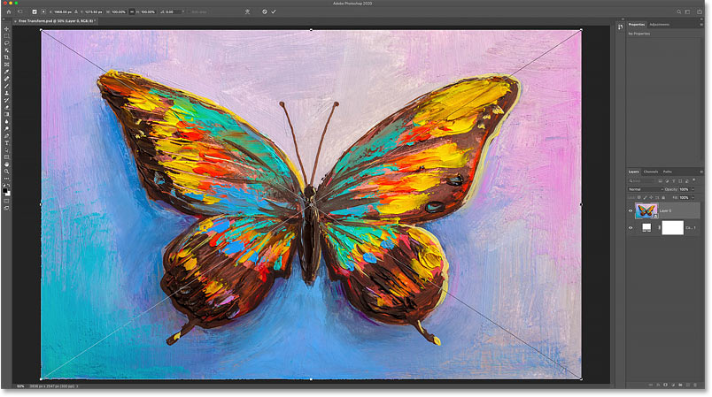
*The original image size has been restored.*

### How to cancel Free Transform without saving your changes

That's not actually what I wanted to do, so to cancel Free Transform without saving your changes, click the **Cancel** button in the Options Bar. Or press the **Esc** key on your keyboard:

*Clicking the Cancel button in the Options Bar.*

And now I'm back to the scaled size:

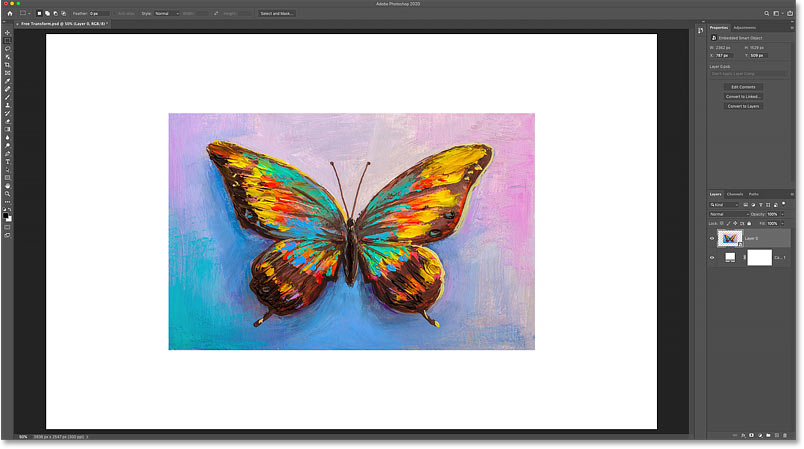
*Canceling Free Transform restored the scaled version.*

## How to rotate an image with Free Transform

To [rotate an image](/basics/photoshop-rotate-view-tool/), move your mouse cursor outside the Free Transform box. Your cursor will change into a curved, double-sided arrow:

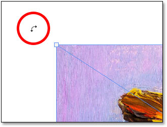
*The rotate cursor.*

Then click and drag to rotate the image freely. Or hold **Shift** as you drag to constrain the angle of the rotation to increments of 15 degrees:

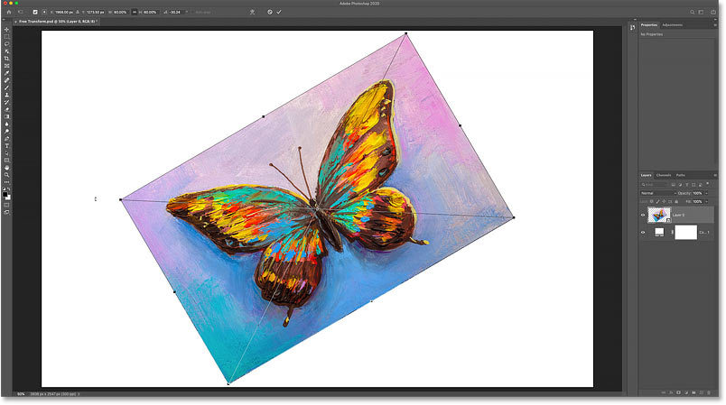
*Click and drag outside the image to rotate it.*

### Entering a specific rotation angle

Instead of dragging your mouse to rotate the image, you can also enter a rotation value directly into the **Angle** option in the Options Bar:

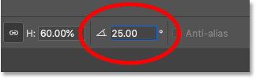
*Entering a rotation angle manually in the Options Bar.*

### How to reset the rotation angle

And to reset the angle at any time, just enter **0**:

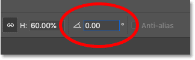
*Enter 0 to reset the angle of the image.*

## The transformation Reference Point

In earlier versions of Photoshop, the Free Transform box included a target icon in the center. The target icon is known as the **Reference Point** because it marks the center of the transformation. We'll look at what that means in a moment.

But for whatever reason, Adobe decided to hide the Reference Point in the most recent versions of Photoshop. It's still there, but we can't see it unless we turn it on.

### How to show the Reference Point

To turn the Reference Point on, go up to the Options Bar and click the **Toggle Reference Point** checkbox:

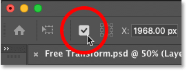
*The Toggle Reference Point checkbox.*

Then look in the center of the Free Transform box and you'll see the **target icon**:

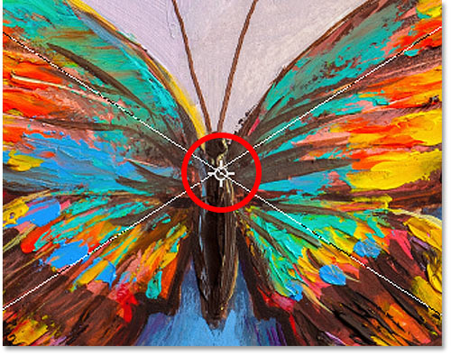
*The Reference Point (target icon) in the center of the Free Transform box.*

### Moving the Reference Point

Earlier when we scaled the image from its center by holding Alt (Win) / Option (Mac) and dragging a handle, what we were really doing was scaling the image from the Reference Point. And we can move the Reference Point just by dragging the target icon to a different spot.

I'll move the Reference Point onto the tip of the butterfly's wing:

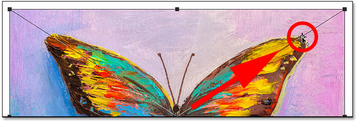
*Dragging the target icon to move the transform Reference Point.*

And now if I hold **Alt** (Win) / **Option** (Mac) and drag a handle, I'm scaling the image with the tip of the wing as the new center point:

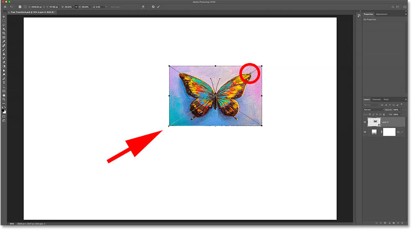
*Scaling the image from the new Reference Point.*

And if I rotate the image, the image now rotates around the wing:

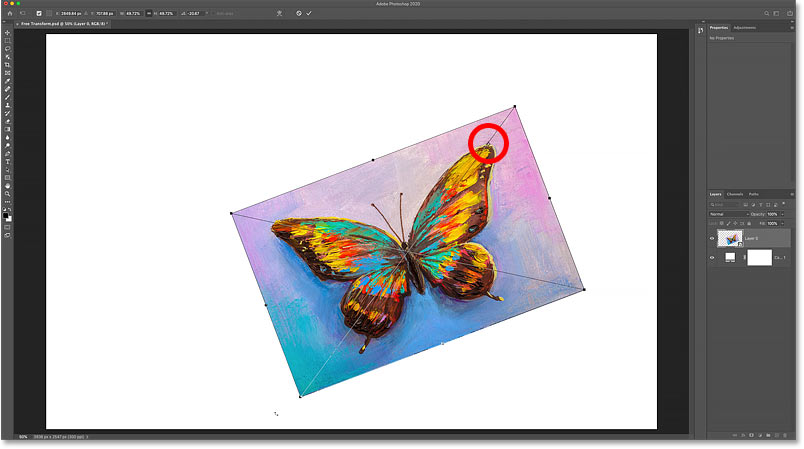
*Rotating the image around the new Reference Point.*

**Tip:** A faster way to move the Reference Point is to hold **Alt** (Win) / **Option** (Mac) and simply click on the spot where you want the target icon to appear.

### The Reference Point Grid

Another way to move the Reference Point is by using the **Reference Point Grid** in the Options Bar (directly beside the Toggle Reference Point checkbox). Each outer square in the grid represents one of the handles around the transform box.

To move the Reference Point to a specific handle, click on its square in the grid. It's pretty small, so you may want to keep a magnifying glass handy:

*Using the Reference Point Grid to move the target icon to a handle.*

### How to center the Reference Point

And to move the Reference Point back into the center of the transform box, click the **center square** in the grid:

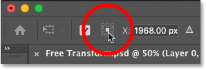
*Clicking the center square to reset the target icon.*

### How to turn the Reference Point on permanently

If you want to see the Reference Point all the time without needing to click the Toggle Reference Point icon in the Options Bar, you can do that from Photoshop's Preferences.

If Free Transform is active, press the **Esc** key to cancel it. Then press **Ctrl**+**K** (Win) / **Command**+**K** (Mac) to open the Preferences dialog box. Select the **Tools** category on the left, and then choose **Show Reference Point when using Transform**. Click OK to close the dialog box:

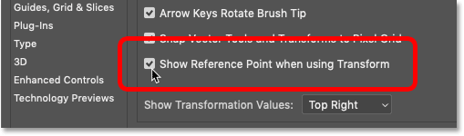
*Turning the transform Reference Point on permanently in the Preferences.*

## How to access any transform command from Free Transform

So far, we've looked at how to scale and rotate an image with Free Transform. But what about Photoshop's other transform commands that we saw under the Edit menu, like Skew, Distort and Perspective?

With Free Transform active, that same menu of options can be accessed by **right-clicking** (Win) / **Control-clicking** (Mac) inside the Free Transform box. Then just choose the one you need:

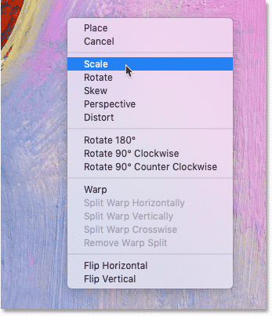
*Free Transform lets you choose any Transform command any time.*

## How to skew an image

Let's look at the next three commands in the list (Skew, Distort and Perspective), starting with Skew. Select **Skew** from the menu:

*Selecting the Skew command.*

With Skew selected, click on either the **top or bottom handle** and drag to skew the image left or right:

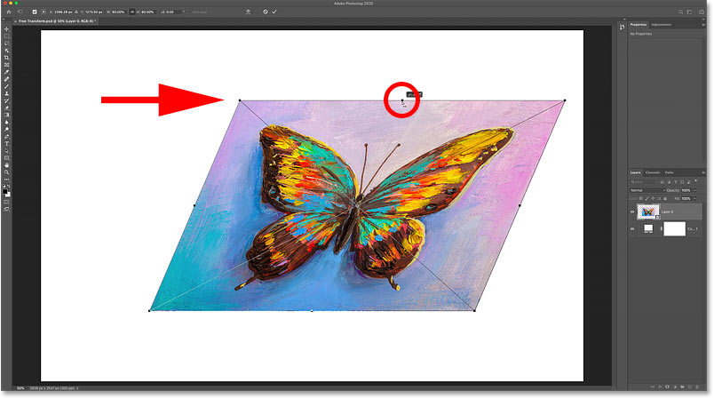
*Drag the top or bottom handle to skew left or right.*

I'll press **Ctrl**+**Z** (Win) / **Command**+**Z** (Mac) to undo that.

And to skew the image up or down, click and drag one of the **side handles**:

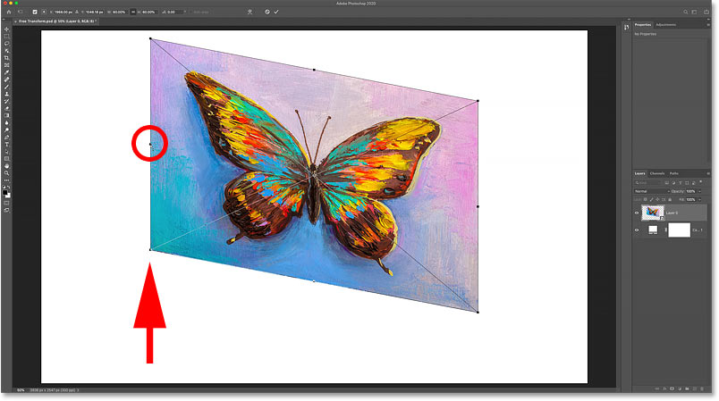
*Drag a side handle to skew up or down.*

Again I'll undo that by pressing **Ctrl**+**Z** (Win) / **Command**+**Z** (Mac).

You can skew opposite sides at once (the top and bottom or the left and right) by holding **Alt** (Win) / **Option** (Mac) as you drag:

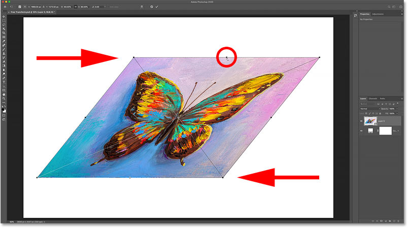
*Holding Alt (Win) / Option (Mac) to skew opposite sides at the same time.*

## How to distort an image

To distort an image, **right-click** (Win) / **Control-click** (Mac) inside the Free Transform box and choose **Distort**:

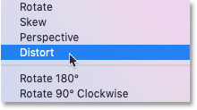
*Selecting the Distort command.*

Then click and drag any of the **corner handles**. This is known as a *four-point distortion* because you're distorting the image from its four corner points:

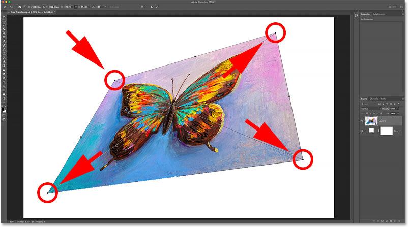
*Drag any of the corner handles to freely distort the image.*

### How to undo a distortion

As I mentioned earlier, Photoshop CC 2020 now gives us multiple undos while in Free Transform. So to undo a step in your distortion, press **Ctrl+Z** (Win) / **Command+Z** (Mac). Press repeatedly to undo multiple steps.

## How to distort an image in perspective

Along with performing a four-point distortion, we can also perform a perspective distortion. **Right-click** (Win) / **Control-click** (Mac) inside the Free Transform box and choose **Perspective**:

*Selecting the Perspective command.*

### What's the difference between Distort and Perspective?

The difference between Distort and Perspective is that Distort lets us move each corner handle independently, but Perspective moves the opposite handle at the same time, in the opposite direction.

Here I'm dragging the top left corner handle towards the right. And notice that the top right handle moves along with it, but to the left:

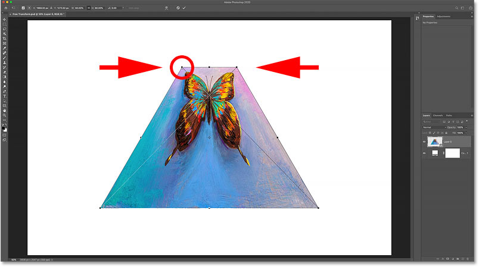
*In Perspective mode, opposite corner handles move together in opposite directions.*

Or if I drag a corner handle up or down, the opposite handle again moves along with it. Perspective mode is great when you need to reshape an object to match the perspective of the image, or to create simple 3D effects:

*Dragging a bottom corner handle upward moves the top corner handle down.*

[RelatedD: How to use Distort and Perspective with text in Photoshop!](/photoshop-text/text-effects/distort-perspective-text/)

## The Skew, Distort and Perspective keyboard shortcuts

The problem with selecting transform commands from the menu is that the commands are sticky, meaning that you can't do anything else unless you select a different command. For example, if you select Skew, and then you try to scale or rotate the image, you won't be able to. You would need to first select Scale or Rotate from the menu, which can quickly become tedious.

A better way to select Skew, Distort or Perspective is to *temporarily* switch to them using their keyboard shortcuts. Again, even if you don't like keyboard shortcuts, these ones are worth knowing.

### Skew

With Free Transform active, press and hold **Ctrl** (Win) / **Command** (Mac) on your keyboard to temporarily switch to **Skew** mode. Then click and drag a top, bottom or side handle to skew the image.

To constrain your movement to horizontal or vertical, hold **Shift**+**Ctrl** (Win) / **Shift**+**Command** (Mac) and drag.

Add the **Alt** (Win) / **Option** (Mac) key to skew opposite sides at the same time. Then release the key(s) to exit Skew mode and return to Free Transform.

### Distort

To perform a four-point distortion, hold **Ctrl** (Win) / **Command** (Mac) and drag any of the corner handles.

To constrain your movement to horizontal or vertical, add the **Shift** key. Release the key(s) to return to Free Transform.

### Perspective

And to temporarily switch to Perspective mode, hold **Shift**+**Ctrl**+**Alt** (Win) / **Shift**+**Command**+**Option** (Mac) and drag a corner handle. Then release the keys to return to Free Transform.

## The Rotate and Flip commands

And finally, if you **right-click** (Win) / **Control-click** (Mac) inside the Free Transform box, you'll find standard options for rotating the image 180°, rotating it 90° clockwise or counter clockwise, and for flipping the image horizontally or vertically:

*The Rotate and Flip transform commands.*

## Create a four-way mirror image effect with Free Transform

On their own, Photoshop's Rotate and Flip commands are pretty straightforward. But if we combine them with the transformation Reference Point (the target icon) that we looked at earlier, we can do more interesting things. For example, let's learn how to quickly create a four-way [mirror image effect](/photo-effects/mirror-image-effect-with-photoshop/) using the Free Transform command.

I'll scale my image a bit smaller, and I'll move it over to the right side of the canvas. Then I'll press **Enter** (Win) / **Return** (Mac) to accept it and close Free Transform:

*The image after scaling and moving it to the right.*

### Making a copy of the image

I'll make a copy of my layer (or in this case, my smart object) by pressing **Ctrl**+**J** (Win) / **Command**+**J** (Mac). And now in the Layers panel, we see two copies of the image.

I'll make the sure the top smart object is selected:

*Selecting the copy of the smart object.*

### Moving the Reference Point

Then I'll press **Ctrl**+**T** (Win) / **Command**+**T** (Mac) to select Free Transform. But before I select one of the transform commands, I'll click on the Reference Point in the center of the Free Transform box and I'll drag it over the left side handle:

*Moving the Reference Point from the center to the side of the image.*

### Flipping the image horizontally

Then I'll **right-click** (Win) / **Control-click** (Mac) inside the Free Transform box and I'll choose **Flip Horizontal** from the menu:

*Choosing the Flip Horizontal command.*

And because I moved the Reference Point over to the side, Photoshop flips the image using the left side as the center of the transformation, creating a mirrored version of the image. I'll press **Enter** (Win) / **Return** (Mac) to accept it:

*Flipping horizontally from the side creates a mirror copy of the image.*

### Moving the images

Back in the Layers panel, I'll select both smart objects at once by holding **Shift** and clicking the bottom smart object:

*Selecting both smart objects.*

Then I'll select Photoshop's **Move Tool** from the [toolbar](/basics/photoshop-tools-toolbar-overview/):

*Selecting the Move Tool.*

And in the Options Bar, I'll make sure **Auto-Select** is unchecked:

*Auto-Select should be turned off.*

Then I'll drag both copies of the image into the upper half of the canvas. I'll hold **Shift** as I drag to make it easier to drag straight up:

*Using the Move Tool to move both images into the upper half of the canvas.*

### Making a copy of the two images

With both copies of the image still selected in the Layers panel, I'll press **Ctrl**+**J** (Win) / **Command**+**J** (Mac) to copy them:

*Pressing Ctrl+J (Win) / Command+J (Mac) to copy the smart objects.*

### Flipping the images vertically

And then back in the document, I'll press **Ctrl**+**T** (Win) / **Command**+**T** (Mac) to select Free Transform. This places the Free Transform handles around both images at once.

I'll click on the Reference Point in the center, and this time, I'll drag it down onto the bottom handle. This way, the bottom of the images will become the center of the transformation:

*Moving the Reference point onto the bottom handle.*

Then I'll **right-click** (Win) / **Control-click** (Mac) inside the Free Transform box and I'll choose **Flip Vertical**:

*Choosing the Flip Vertical command.*

Photoshop flips the copies vertically, again using the Reference Point as the center of the transformation, creating a four-way mirror reflection of the image. Press **Enter** (Win) / **Return** (Mac) to accept it:

*A four-way mirror reflection effect created with Free Transform.*