# How to Resize a Selection in Photoshop with Transform Selection

> Source: [https://www.photoshopessentials.com/basics/selections/transform-selection/](https://www.photoshopessentials.com/basics/selections/transform-selection/)
> Downloaded and converted to Markdown.

Learn how to resize a selection outline, including how to skew, distort and even warp your selection, without resizing the pixels inside it using the Transform Selection command in Photoshop! A step-by-step tutorial.

Did you know that Photoshop has a feature that lets you resize a selection outline without resizing the pixels inside it? It's called **Transform Selection**. And in this tutorial, I show you how it works!

## Which version of Photoshop do I need?

I'm using Photoshop 2022 but Transform Selection has been around forever so any recent version will work. You can [get the latest Photoshop version here](https://adobe.prf.hn/click/camref:1100lrdjJ/destination:https%3A%2F%2Fwww.adobe.com%2Fproducts%2Fphotoshop.html).

Let's get started!

## Opening the image

For this tutorial, I'll use [this image](https://adobe.prf.hn/click/camref:1100lrdjJ/destination:https%3A%2F%2Fstock.adobe.com%2Fimages%2Fa-young-man-fashionably-dressed-standing-in-the-street-at-night-illuminated-signboards-neon-lights%2F234140674) from Adobe Stock.

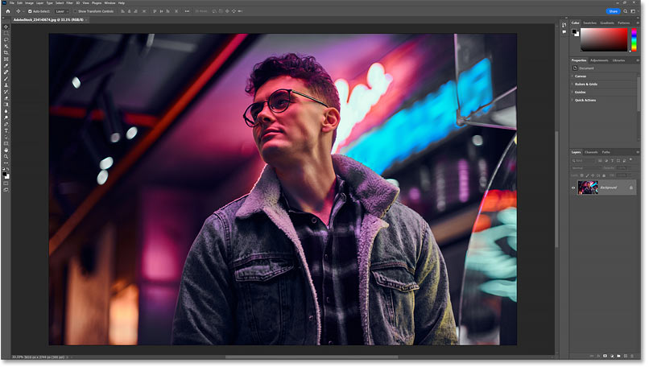
*The original image.*

## Drawing an initial selection outline

Transform Selection works best with geometric selection outlines, the kind you draw with the [Rectangular or Elliptical Marquee Tool](/basics/photoshop-selection-basics-the-rectangular-and-elliptical-marquee-tools/). So I'll select the Rectangular Marquee Tool from the [toolbar](/basics/photoshop-tools-toolbar-overview/).

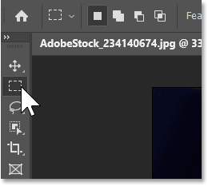
*Selecting the Rectangular Marquee Tool.*

Then I'll drag out an initial selection outline.

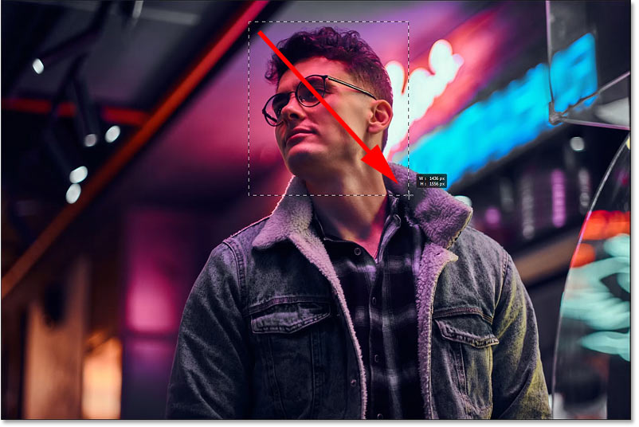
*Drawing an initial selection outline with the Rectangular Marquee Tool.*

## Resizing the image with Free Transform

To show you the difference between Photoshop's [Free Transform](/basics/transform-and-warp-images-with-free-transform-in-photoshop-cc-2019/) command and Transform Selection, I'll go up to the **Edit** menu in the Menu Bar and choose **Free Transform**.

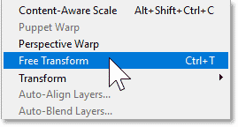
*Going to Edit > Free Transform.*

Photoshop places a transform box and handles around the selection. And because I'm using Free Transform, if I drag one of the handles, I resize the image inside the selection.

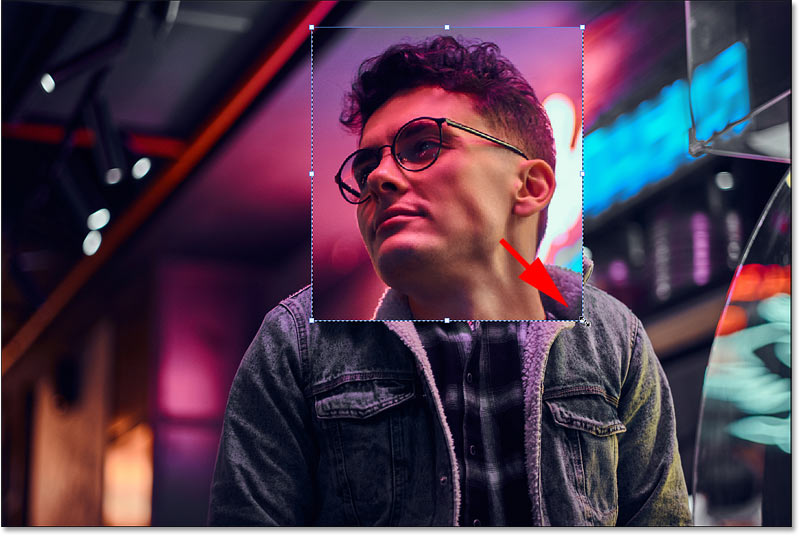
*Free Transform resizes the pixels that were selected.*

I'll click the **Cancel** button in the Options Bar to undo that.

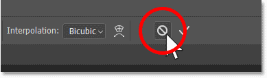
*Clicking the Cancel button.*

## Where to find the Transform Selection command

To resize just the selection outline, go up to the **Select** menu and choose **Transform Selection**.

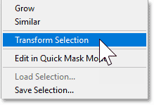
*Going to Select > Transform Selection.*

Or **right-click** inside the selection outline and choose **Transform Selection** from the menu.

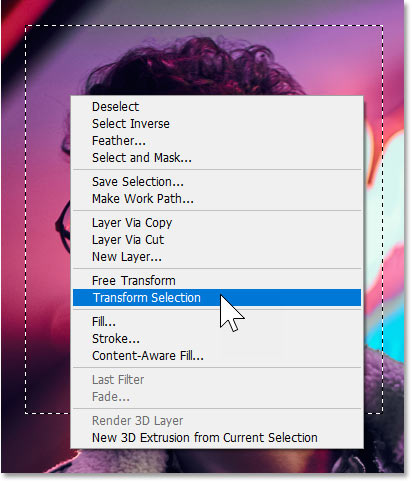
*Right-clicking in the outline and choosing Transform Selection.*

## Resizing the selection outline with Transform Selection

With Transform Selection active, the same transform box and handles that we saw with Free Transform appear around the selection. But this time when we drag a handle, the image remains in place and we resize the selection outline itself.

*Transform Selection resizes the selection outline, not the pixels inside it.*

### How to unlock the aspect ratio

In the Options Bar, the **link icon** between the **Width** and **Height** fields is active by default, which is why dragging a handle resizes the selection outline with the aspect ratio locked.

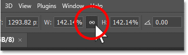
*By default, the aspect ratio of the selection outline is locked.*

To unlock the aspect ratio, hold the **Shift** key on your keyboard as you drag the handles.

*Unlocking the aspect ratio by holding Shift while dragging the handles.*

### How to reposition the selection outline

You can click and drag inside the transform box to reposition the outline.

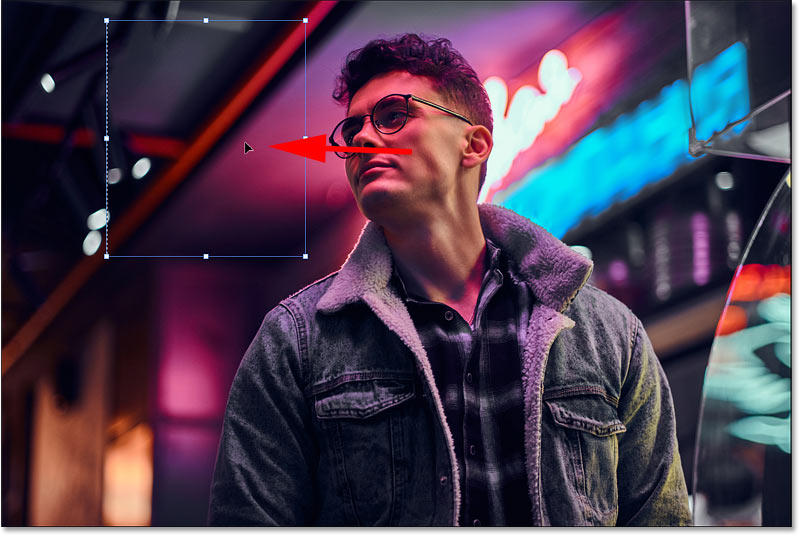
*Moving the selection outline by dragging inside the transform box.*

### How to rotate the selection outline

And you can rotate the outline by clicking and dragging just outside it. Hold the **Shift** key as you drag to rotate the outline in 15 degree increments.

*Rotating the selection outline by dragging outside it.*

### How to undo a transformation

To undo your last step with Transform Selection, press **Ctrl+Z** on a PC or **Command+Z** on a Mac. Press repeatedly to undo multiple steps.

## The Skew, Distort and Perspective options

If you right-click inside the transform box, you have access to the same options that you have with Free Transform, including **Skew**, **Distort**, **Perspective**, and even **Warp**. But with Transform Selection, these options apply to the selection outline itself.

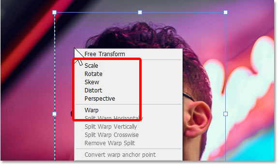
*Right-clicking inside the transform box to access the transform options.*

### Skew

If you choose **Skew** from the menu:

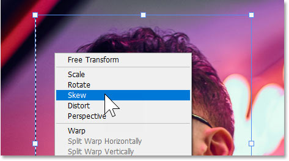
*Choosing the Skew option.*

You can drag the top or bottom handle left or right to skew the outline horizontally. Hold the **Alt** key on a PC or the **Option** key on a Mac as you drag to move both handles together in opposite directions.

*Skewing the selection outline horizontally.*

And you can drag the left or right handle up or down to skew the outline vertically. Again hold **Alt** on a PC or **Option** on a Mac to move both side handles together in opposite directions.

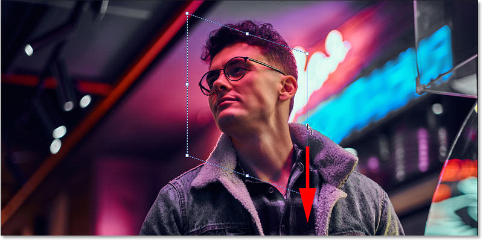
*Skewing the selection outline vertically.*

### Distort

If you right-click inside the transform box and choose **Distort**:

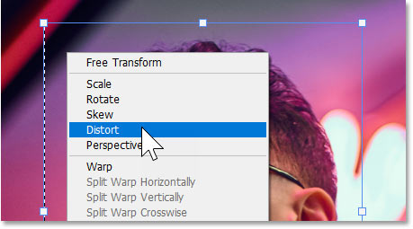
*Choosing Distort from the menu.*

Then you can drag any of the **corner handles** on their own.

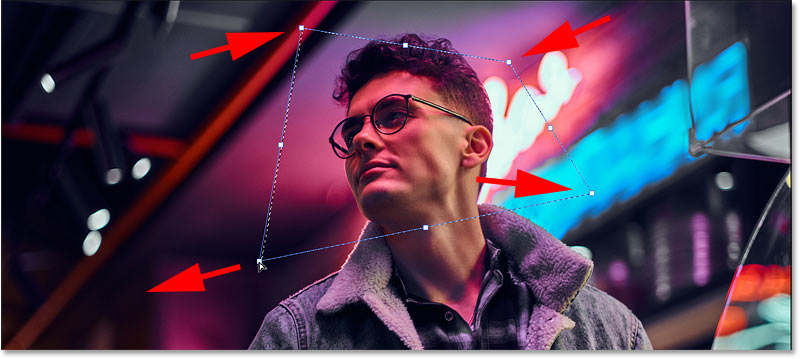
*Distort lets you drag each corner handle independently.*

### Perspective

And if you choose **Perspective**:

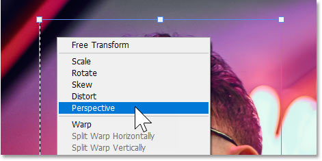
*Choosing Perspective from the menu.*

Then dragging a corner handle horizontally or vertically moves the opposite corner at the same time but in the opposite direction.

Here I'm dragging the top left handle inward, which moves the top right handle inward as well. And I'm dragging the bottom left handle outward which also moves the bottom right handle outward.

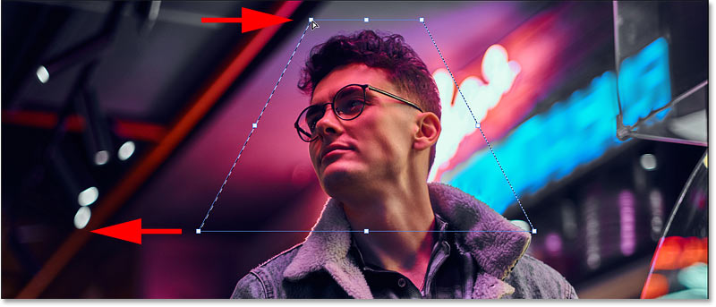
*Perspective moves the opposite corner handles together in opposite directions.*

## How to warp a selection outline with Transform Selection

If you right-click inside the Transform Selection box and choose **Warp**:

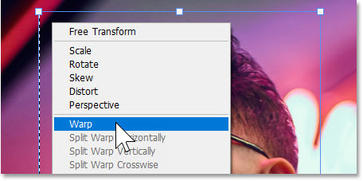
*Choosing Warp from the transform menu.*

A grid appears in your selection outline. You can use the grid to warp the outline into different shapes.

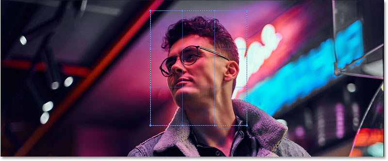
*The warp grid.*

You can drag a **corner point**. Each point can be moved independently of the others.

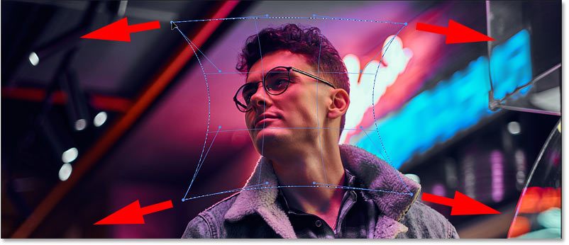
*Warping the selection outline by dragging the corner grid points.*

Or you can drag the **direction handles** that extend outward from the corner points.

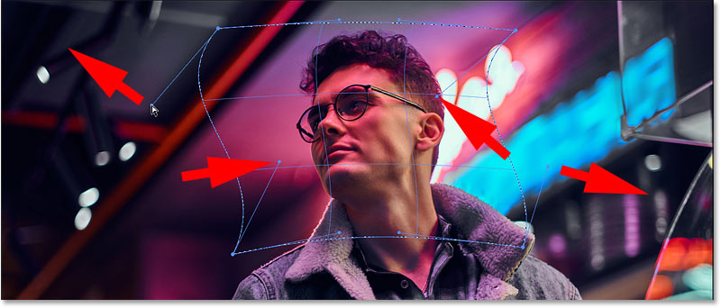
*Warping the outline by dragging the direction handles.*

And you can even click and drag directly on the **grid outline** itself (although clicking exactly on the grid outline can be tricky). Here I'm dragging the bottom of the grid downward.

*Warping the outline by dragging directly on the grid.*

### How to reset the warp grid

If you totally mess things up while in Warp mode (it's easy to do), click the **Reset** button in the Options Bar to reset the grid and start over.

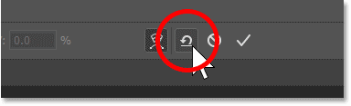
*Resetting the grid by clicking the Reset button.*

I'll do a simple warp by dragging the left and right sides of the grid outward and the top and bottom in towards the center.

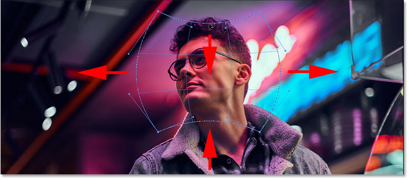
*Dragging the left and right sides outward and the top and bottom inward.*

## How to accept the transformation

To accept your changes to the outline and close the Transform Selection command, click the **checkmark** in the Options Bar. Or you can click the **Cancel** button next to the checkmark to close Transform Selection without saving your changes. But I'll click the checkmark.

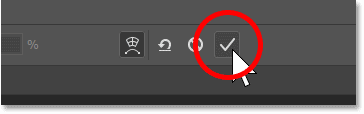
*Clicking the checkmark to commit the transformation.*

And now my selection outline appears with its new shape.

*The selection outline has been resized and reshaped.*

## How to undo Transform Selection

I'll undo the transformation and restore the original size and shape of my selection outline by going up to the **Edit** menu and choosing **Undo Free Transform Selection**.

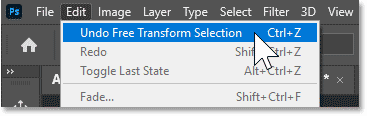
*Going to Edit > Undo Free Transform Selection.*

## Resizing the selection outline into a diagonal strip

What I want to do with this image is select a narrow strip that runs diagonally from top to bottom, so I can then place the strip either on a transparent background or on a solid color background.

### Selecting Transform Selection

So with my original selection outline back in place, I'll right-click inside the outline and choose **Transform Selection**.

*Right-clicking in the selection outline and choosing Transform Selection.*

### Resizing the selection outline

Then I'll hold the **Shift** key on my keyboard to unlock the aspect ratio so I can drag the top handle to the top of the image and the bottom handle to the bottom of the image.

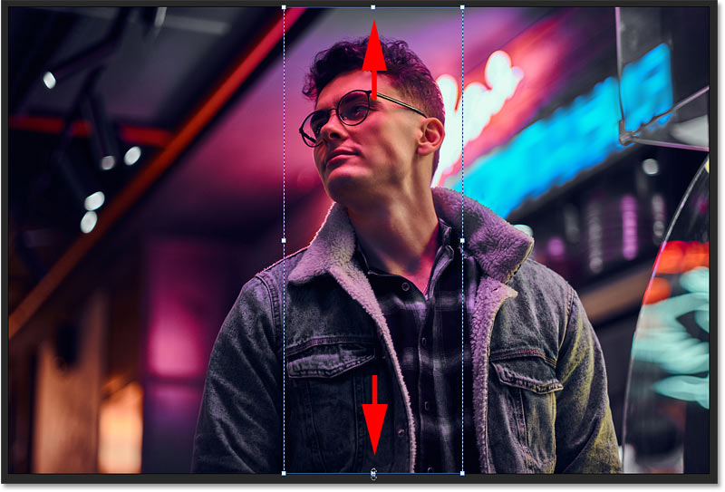
*Holding Shift and dragging the top and bottom transform handles.*

### Skewing the selection outline

Since I want the outline to be diagonal, not vertical, I need to skew it. So I'll right-click inside the transform box and choose **Skew**.

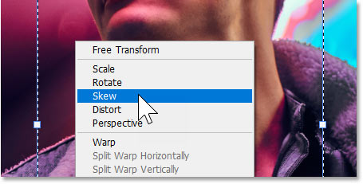
*Right-clicking and choosing Skew.*

Then I'll drag the top handle to the right. While I'm dragging, I'll hold the **Alt** key on a PC or the **Option** key on a Mac so that the bottom handle moves along with it in the opposite direction.

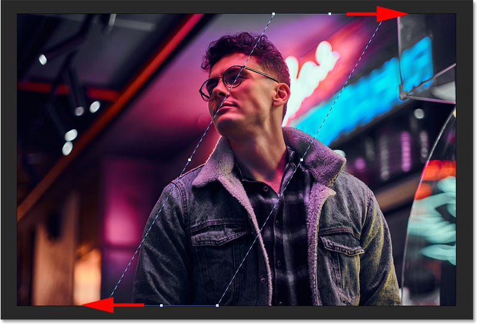
*Skewing the selection outline into a diagonal strip.*

### Resetting Transform Selection back to the default mode

To adjust the width of the outline, I'll drag the side handles. But because I'm still in Skew mode, I first need to right-click inside the transform box and reset Transform Selection back to its default mode which is **Free Transform**.

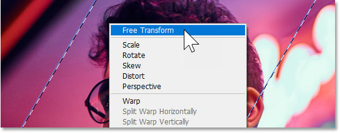
*Resetting Transform Selection back to Free Transform mode.*

Then I can hold **Shift** on my keyboard and drag the side handles as needed to resize the outline.

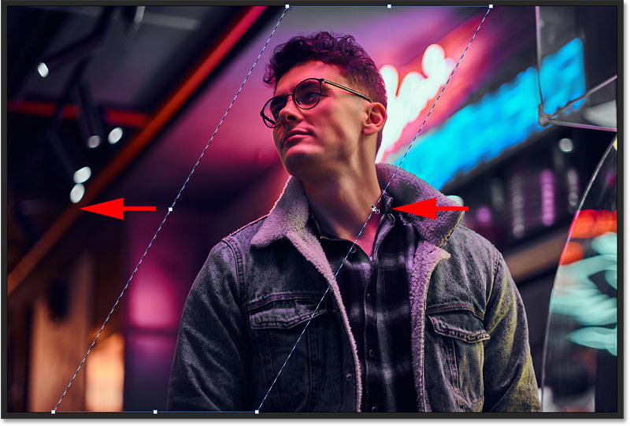
*Adjusting the width of the outline by holding Shift and dragging the side handles.*

### Accepting the transformation

To accept it and close Transform Selection, I'll click the **checkmark** in the Options Bar.

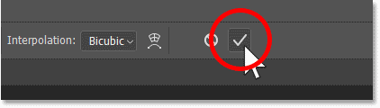
*Clicking the checkmark to accept it.*

And my selection outline is now at the size and shape that I need.

*The initial rectangular selection outline has been resized.*

## Completing the effect

At this point, we've covered everything you need to know to resize selection outlines with Photoshop's Transform Selection command. But if you want to keep reading, I'll quickly finish off the effect.

### Converting the selection outline into a layer mask

I want to hide everything outside the selection outline and replace it with transparency. So I'll convert the outline into a **layer mask**.

In the [Layers panel](/basics/layers/layers-panel/), we see the image on the Background layer.

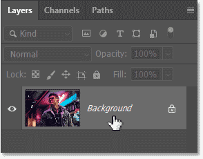
*The Layers panel showing the Background layer.*

To turn a selection outline into a mask, all you need to do is click the **Add Layer Mask** icon at the bottom of the Layers panel.

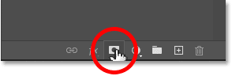
*Clicking the Add Layer Mask icon.*

And everything that was outside the outline is instantly replaced with transparency.

*The areas around the selection are now transparent.*

Back in the Layers panel, we see that Photoshop converted the selection outline into a [layer mask](/basics/understanding-photoshop-layer-masks/). The white part of the mask is where the image is visible and the black part is where it's hidden.

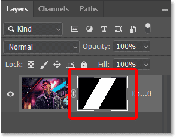
*The layer mask thumbnail.*

### Adding a solid color background

But instead of a transparent background, I want to fill the background with a solid color. So I'll add a Solid Color fill layer by clicking the **New Fill or Adjustment Layer** icon at the bottom of the Layers panel:

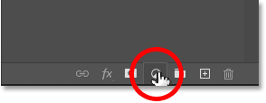
*Clicking the New Fill or Adjustment Layer icon.*

And choosing **Solid Color**.

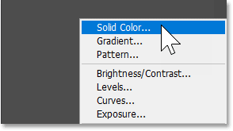
*Adding a Solid Color fill layer.*

I'll accept the default fill color for now, which is black, by clicking OK in the Color Picker.

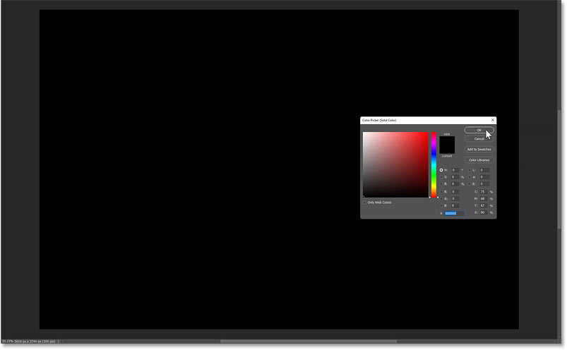
*Accepting the default black fill color for now.*

Then back in the Layers panel, I'll drag the fill layer below the image.

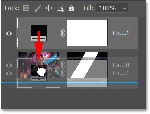
*Dragging the fill layer below the image layer.*

And the area around the selection is now filled with black.

*The transparent areas are now filled with black.*

### Sampling a background color from the image

To change the background color, I'll double-click on the fill layer's **color swatch** in the Layers panel.

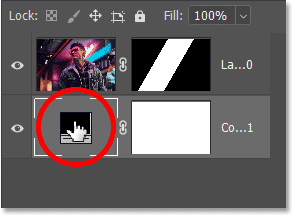
*Double-clicking on the fill layer's color swatch.*

Then instead of choosing a color from the Color Picker, I'll click on a color in the image to sample it. And that color instantly becomes the new background color. I'll accept it by clicking OK to close the Color Picker.

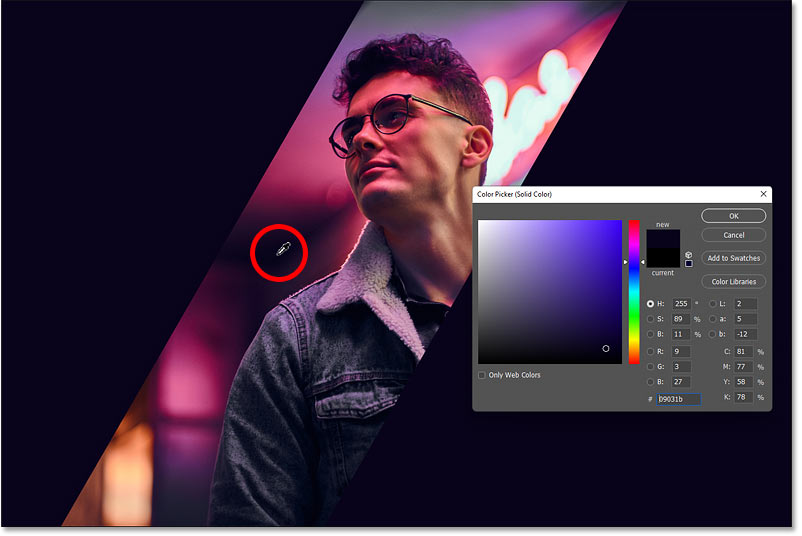
*Sampling a color from the image to use as the new background color.*

### Repositioning the image

Finally, I need to move the image over to the right. So in the Layers panel, I'll click on the image layer to make it active.

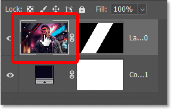
*Selecting the image layer.*

I'll select the **Move Tool** from the toolbar.

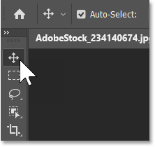
*Selecting the Move Tool.*

Then I'll click on the image and drag it over to the right, leaving room for some text, a logo or anything else I need to display in the blank area on the left.

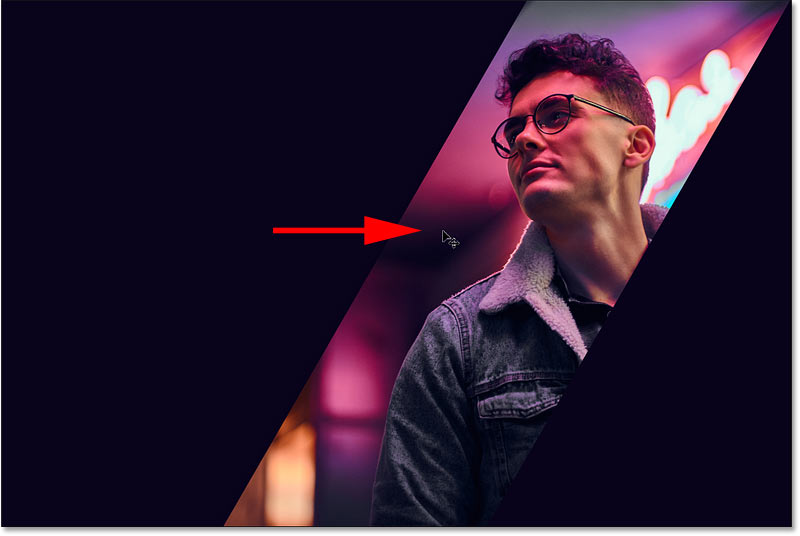
*Dragging the image with the Move Tool.*

And there we have it! Check out my [Photoshop Basics](/basics/) section for more tutorials. And don't forget, all of my tutorials are now available to [download as PDFs](/print-ready-pdfs/)!